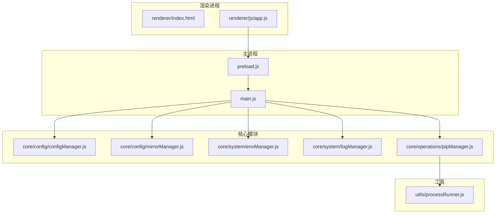
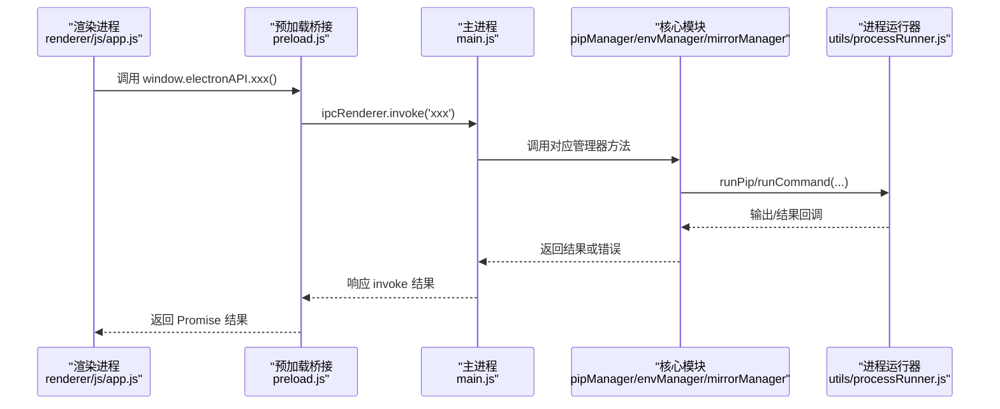
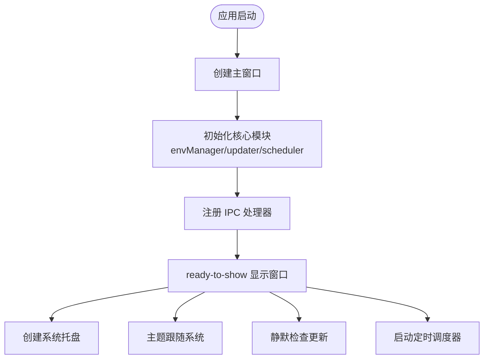
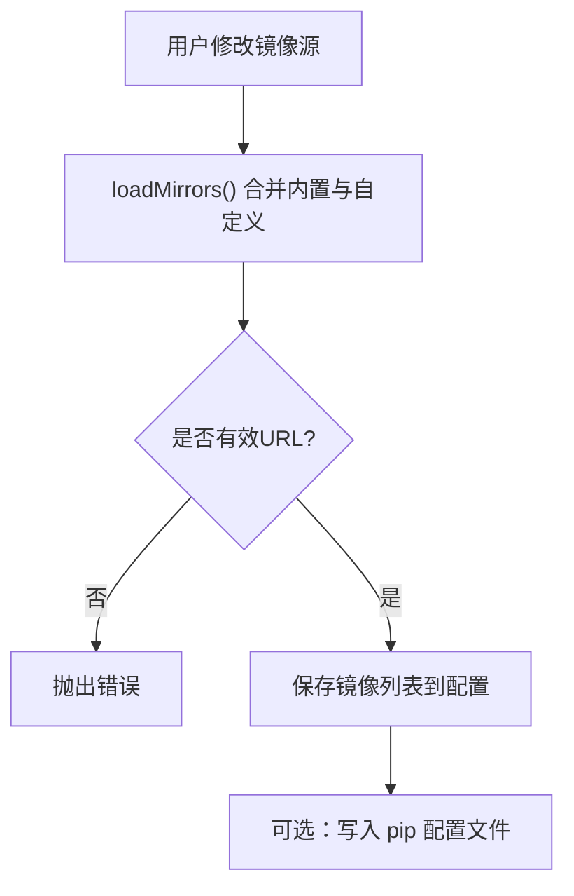
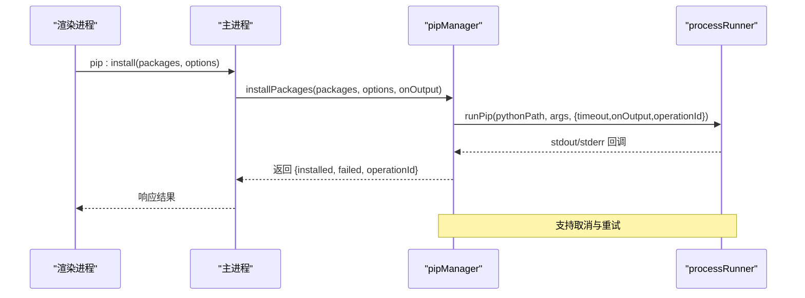
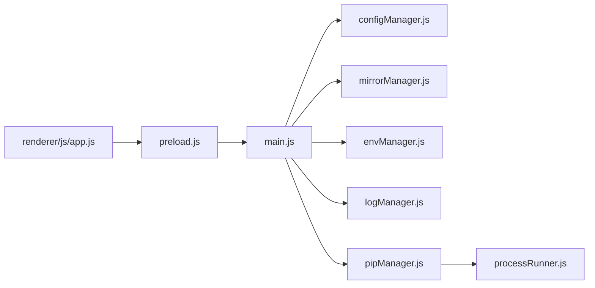

# 开发指南

<cite>
**本文引用的文件**   
- [package.json](file://package.json)
- [main.js](file://main.js)
- [preload.js](file://preload.js)
- [renderer/index.html](file://renderer/index.html)
- [renderer/js/app.js](file://renderer/js/app.js)
- [core/config/configManager.js](file://core/config/configManager.js)
- [core/config/mirrorManager.js](file://core/config/mirrorManager.js)
- [core/system/envManager.js](file://core/system/envManager.js)
- [core/operations/pipManager.js](file://core/operations/pipManager.js)
- [utils/processRunner.js](file://utils/processRunner.js)
- [.github/workflows/ci.yml](file://.github/workflows/ci.yml)
</cite>

## 目录
1. [简介](#简介)
2. [项目结构](#项目结构)
3. [核心组件](#核心组件)
4. [架构总览](#架构总览)
5. [详细组件分析](#详细组件分析)
6. [依赖关系分析](#依赖关系分析)
7. [性能考量](#性能考量)
8. [故障排查指南](#故障排查指南)
9. [结论](#结论)
10. [附录](#附录)

## 简介
本指南面向 PyLibMaster 的新贡献者与维护者，提供从环境搭建、代码规范、构建与测试、调试与性能优化，到插件扩展与贡献流程的完整说明。PyLibMaster 是一个基于 Electron 的 Python 库管理工具，通过主进程与渲染进程协作，封装 pip 操作、镜像源管理、环境检测、日志与配置持久化等能力，并提供丰富的桌面端交互界面。

## 项目结构
- 入口与主进程：main.js 负责窗口生命周期、IPC 处理器注册、托盘与主题同步、自动更新与调度器集成。
- 预加载桥接：preload.js 通过 contextBridge 暴露安全 API 给渲染进程。
- 渲染层：renderer/index.html 为 UI 骨架，renderer/js/app.js 为前端初始化与事件绑定。
- 核心模块：
  - core/config：配置与镜像源管理（configManager.js、mirrorManager.js）。
  - core/system：系统与环境管理（envManager.js、logManager.js）。
  - core/operations：业务操作（pipManager.js、backupManager.js、templateManager.js、auditManager.js、undoManager.js、venvManager.js）。
- 工具层：utils/processRunner.js 封装子进程执行、超时、取消、pip 安装保障等。
- 构建与 CI：package.json 定义脚本与 electron-builder 配置；.github/workflows/ci.yml 提供自动化测试与打包。

**图表来源** 
- [main.js:1-120](file://main.js#L1-L120)
- [preload.js:1-60](file://preload.js#L1-L60)
- [renderer/index.html:1-30](file://renderer/index.html#L1-L30)
- [renderer/js/app.js:1-40](file://renderer/js/app.js#L1-L40)
- [core/config/configManager.js:1-40](file://core/config/configManager.js#L1-L40)
- [core/config/mirrorManager.js:1-40](file://core/config/mirrorManager.js#L1-L40)
- [core/system/envManager.js:1-40](file://core/system/envManager.js#L1-L40)
- [core/operations/pipManager.js:1-60](file://core/operations/pipManager.js#L1-L60)
- [utils/processRunner.js:1-60](file://utils/processRunner.js#L1-L60)

**章节来源**
- [package.json:1-20](file://package.json#L1-L20)
- [main.js:1-120](file://main.js#L1-L120)
- [preload.js:1-60](file://preload.js#L1-L60)
- [renderer/index.html:1-30](file://renderer/index.html#L1-L30)
- [renderer/js/app.js:1-40](file://renderer/js/app.js#L1-L40)

## 核心组件
- 主进程（main.js）
  - 创建与管理 BrowserWindow，设置上下文隔离与安全选项。
  - 注册所有 IPC 处理器，连接渲染进程与核心模块。
  - 应用生命周期管理（启动、关闭、激活）、托盘、主题同步、自动更新、定时调度器。
- 预加载（preload.js）
  - 通过 contextBridge 暴露 window.electronAPI，限定渲染进程可访问的主进程方法。
  - 统一转发 IPC 请求并处理事件监听（如进度、主题、更新状态）。
- 配置管理（configManager.js）
  - 读取/写入 JSON 配置文件，支持默认值合并、数值范围校验与批量更新。
  - 存储路径基于 Electron userData，保证跨平台一致性。
- 镜像源管理（mirrorManager.js）
  - 内置多镜像源，支持自定义、测速、智能路由、写入 pip 配置。
- 环境管理（envManager.js）
  - 扫描常见 Python 安装路径与 PATH，获取版本信息，切换当前环境并持久化。
- 包管理（pipManager.js）
  - 包的查询、安装、卸载、更新、导出/导入、对比、依赖树、离线下载、健康检查等。
  - 支持并行、重试、回滚、操作取消、进度回调。
- 进程运行器（processRunner.js）
  - 封装 spawn 子进程，提供超时、取消、ANSI 清理、UTF-8 编码、pip 自动安装保障。

**章节来源**
- [main.js:1-120](file://main.js#L1-L120)
- [preload.js:1-120](file://preload.js#L1-L120)
- [core/config/configManager.js:1-120](file://core/config/configManager.js#L1-L120)
- [core/config/mirrorManager.js:1-120](file://core/config/mirrorManager.js#L1-L120)
- [core/system/envManager.js:1-120](file://core/system/envManager.js#L1-L120)
- [core/operations/pipManager.js:1-120](file://core/operations/pipManager.js#L1-L120)
- [utils/processRunner.js:1-120](file://utils/processRunner.js#L1-L120)

## 架构总览
PyLibMaster 采用经典的 Electron 三进程模型：主进程、预加载桥接、渲染进程。主进程集中管理系统资源与 Node 能力，通过 IPC 将能力暴露给渲染进程。核心业务模块按功能分层组织，工具层提供通用能力（进程、安全、日志），UI 层专注交互与数据展示。

**图表来源** 
- [renderer/js/app.js:1-60](file://renderer/js/app.js#L1-L60)
- [preload.js:1-120](file://preload.js#L1-L120)
- [main.js:230-360](file://main.js#L230-L360)
- [core/operations/pipManager.js:470-560](file://core/operations/pipManager.js#L470-L560)
- [utils/processRunner.js:80-160](file://utils/processRunner.js#L80-L160)

## 详细组件分析

### 主进程与 IPC 通信
- 窗口与生命周期
  - 创建窗口时启用上下文隔离、禁用 Node 集成，使用 preload 作为安全桥接。
  - 拦截外部链接，仅允许 http/https 协议。
  - 保存窗口位置与尺寸，支持最小化到托盘。
- IPC 处理器
  - 窗口控制、环境管理、虚拟环境、包查询与操作、备份、镜像源、日志、配置、自动更新、系统功能、通知、调度器、模板与快照、审计、磁盘空间、离线下载、requirements 对比、发布历史、依赖图谱、撤销、资源管理器集成。
  - 所有长耗时操作均支持进度回调与取消。

**图表来源** 
- [main.js:40-120](file://main.js#L40-L120)
- [main.js:130-170](file://main.js#L130-L170)
- [main.js:230-360](file://main.js#L230-L360)

**章节来源**
- [main.js:1-120](file://main.js#L1-L120)
- [main.js:230-360](file://main.js#L230-L360)

### 预加载桥接与渲染进程
- 安全暴露
  - 通过 contextBridge.exposeInMainWorld 暴露 window.electronAPI，限制渲染进程直接访问 Node 能力。
  - 统一封装 IPC 调用与事件监听（进度、主题、更新、调度器）。
- 前端初始化
  - app.js 负责侧边栏导航、页面切换、实时筛选、快捷键、主题与语言切换、启动阶段并行加载数据。

```mermaid
classDiagram
class ElectronAPI {
+windowMinimize()
+windowMaximize()
+windowClose()
+detectEnvironments()
+getCurrentEnv()
+switchEnvironment(envPath)
+createVenv(options)
+listVenvs()
+deleteVenv(name)
+getVenvInfo(name)
+listInstalled()
+listInstalledCached()
+listOutdated()
+searchPackage(keyword)
+showPackageInfo(pkgName)
+getDependencyTree(pkgName)
+exportRequirements(options)
+importRequirements(filePath, options)
+compareEnvironments(envA, envB)
+installPackages(packages, options)
+installFromFile(filePath, options)
+uninstallPackages(packages, options)
+updatePackages(packages, options)
+cancelPipOperation(operationId)
+repairPip(options)
+createBackup()
+listBackups()
+restoreBackup(backupId)
+deleteBackup(backupId)
+getMirrors()
+testMirrorSpeed(url)
+testAllMirrors()
+setDefaultMirror(url)
+addCustomMirror(name, url, remark)
+updateMirror(url, updates)
+removeCustomMirror(url)
+restoreDefaultMirrors()
+setSmartRoute(enabled)
+getSmartRoute()
+writePipMirrorConfig()
+reorderMirrors(urlOrder)
+getLogs(filter)
+clearLogs()
+addLog(entry)
+getConfig()
+setConfig(key, value)
+setConfigBulk(updates)
+getAppVersion()
+browseDirectory()
+browseFile(filters)
+openPath(filePath)
+sendNotification(title, body)
+exportLogs(format)
+getSystemTheme()
+onThemeChanged(callback)
+onUpdatesAvailable(callback)
+getSchedulerStatus()
+saveSchedulerConfig(config)
+runSchedulerNow()
+onSchedulerExecuted(callback)
+getTemplates()
+addCustomTemplate(tpl)
+removeCustomTemplate(id)
+createFromTemplate(options)
+createSnapshot(envPath, label)
+listSnapshots()
+getSnapshotDetail(id)
+restoreSnapshot(snapshotId, envPath)
+deleteSnapshot(id)
+runAudit()
+getCachedAudit()
+getDiskUsage()
+downloadPackages(packages, destDir, options)
+diffRequirements(sourceA, sourceB)
+getPackageReleases(pkgName)
+getDependencyGraph()
+checkConflicts()
+healthCheck()
+canUndo()
+performUndo()
+clearUndo()
+getExplorerStatus()
+enableExplorerMenu()
+disableExplorerMenu()
+onProgress(callback)
+removeProgressListener(callback)
+checkForUpdates()
+installUpdate()
+onUpdaterChecking(callback)
+onUpdaterAvailable(callback)
+onUpdaterNotAvailable(callback)
+onUpdaterProgress(callback)
+onUpdaterDownloaded(callback)
+onUpdaterError(callback)
}
```

**图表来源** 
- [preload.js:20-220](file://preload.js#L20-L220)

**章节来源**
- [preload.js:1-220](file://preload.js#L1-L220)
- [renderer/js/app.js:1-120](file://renderer/js/app.js#L1-L120)

### 配置与镜像源管理
- 配置管理
  - 默认值合并、数值范围校验、原子写入（临时文件+重命名）、批量更新。
  - 存储路径基于 userData，确保跨平台一致性与权限安全。
- 镜像源管理
  - 内置多个国内镜像源，支持自定义添加、更新、删除、恢复默认。
  - 智能路由开关，根据测速结果选择最优镜像；可将配置写入 pip 配置文件。

**图表来源** 
- [core/config/configManager.js:120-180](file://core/config/configManager.js#L120-L180)
- [core/config/mirrorManager.js:60-120](file://core/config/mirrorManager.js#L60-L120)

**章节来源**
- [core/config/configManager.js:1-194](file://core/config/configManager.js#L1-L194)
- [core/config/mirrorManager.js:1-200](file://core/config/mirrorManager.js#L1-L200)

### 环境管理与包操作
- 环境管理
  - 扫描常见路径与 PATH，获取 Python 与 pip 版本，过滤无 pip 的环境，自动选择首个可用环境并持久化。
- 包操作
  - 安装/卸载/更新支持批量、并行、重试、回滚、进度回调、取消。
  - 安全校验包名与 wheel 路径，防止命令注入与路径遍历。
  - site-packages 缓存与快速估算包大小与安装时间。

**图表来源** 
- [main.js:310-360](file://main.js#L310-L360)
- [core/operations/pipManager.js:490-580](file://core/operations/pipManager.js#L490-L580)
- [utils/processRunner.js:80-160](file://utils/processRunner.js#L80-L160)

**章节来源**
- [core/system/envManager.js:1-220](file://core/system/envManager.js#L1-L220)
- [core/operations/pipManager.js:1-800](file://core/operations/pipManager.js#L1-L800)

### 日志与系统工具
- 日志管理
  - 持久化 JSON 文件，支持类型筛选与关键词搜索，容量控制与字段截断保护，防抖写入与退出前强制刷新。
- 进程运行器
  - 子进程封装，支持超时、SIGTERM/SIGKILL 两级终止、ANSI 清理、UTF-8 编码、活跃进程跟踪与取消。
  - 自动检测并安装 pip（ensurepip/get-pip.py），失败时给出明确提示。

**章节来源**
- [core/system/logManager.js:1-173](file://core/system/logManager.js#L1-L173)
- [utils/processRunner.js:1-366](file://utils/processRunner.js#L1-L366)

## 依赖关系分析
- 主进程依赖核心模块与工具层，通过 IPC 暴露能力。
- 渲染进程仅通过 preload 暴露的 API 与主进程通信，不直接访问 Node 能力。
- 核心模块之间解耦清晰：pipManager 依赖 configManager、mirrorManager、envManager、logManager、processRunner。
- 构建与 CI 使用 electron-builder 与 GitHub Actions，Node 版本固定为 20，Windows 平台打包 NSIS 安装包。

**图表来源** 
- [main.js:1-120](file://main.js#L1-L120)
- [core/operations/pipManager.js:1-60](file://core/operations/pipManager.js#L1-L60)
- [utils/processRunner.js:1-60](file://utils/processRunner.js#L1-L60)
- [renderer/js/app.js:1-60](file://renderer/js/app.js#L1-L60)
- [preload.js:1-60](file://preload.js#L1-L60)

**章节来源**
- [package.json:1-79](file://package.json#L1-L79)
- [.github/workflows/ci.yml:1-51](file://.github/workflows/ci.yml#L1-L51)

## 性能考量
- 启动与渲染优化
  - 渲染进程分阶段加载：先显示缓存数据，后台异步刷新完整列表与可更新列表。
  - 使用 Promise.allSettled 并行加载环境与镜像源，提升首屏速度。
- 包操作性能
  - 并行安装/更新（线程数由配置决定），智能重试与多镜像源切换。
  - site-packages 路径缓存与目录映射，快速估算包大小与安装时间。
- I/O 与日志
  - 日志写入防抖，避免高频写入；退出前强制刷新确保数据不丢失。
  - 配置保存使用原子写入（临时文件+重命名），降低损坏风险。
- 进程管理
  - 超时与两级终止策略，避免僵尸进程；活跃进程跟踪支持批量取消。

[本节为通用指导，无需特定文件引用]

## 故障排查指南
- 常见问题定位
  - 查看操作日志：在“操作日志”页面筛选类型与关键词，导出 CSV/Markdown 便于分析。
  - 检查 Python 环境：确认当前环境已检测到 pip，必要时修复 pip。
  - 网络问题：切换镜像源或开启智能路由，进行全部测速。
- 调试技巧
  - 主进程调试：在 main.js 中 console.log 输出关键节点；使用 Electron 开发者工具查看渲染进程控制台。
  - 进程输出：安装/卸载/更新操作的 stdout/stderr 会实时回调到 UI，关注异常堆栈与退出码。
  - 日志导出：支持 CSV 与 Markdown 格式，便于归档与分享。
- 性能诊断
  - 使用“数据统计”与“工具箱”中的依赖图谱、空间分析与健康检查，识别瓶颈与冲突。

**章节来源**
- [core/system/logManager.js:1-173](file://core/system/logManager.js#L1-L173)
- [core/system/envManager.js:1-220](file://core/system/envManager.js#L1-L220)
- [core/config/mirrorManager.js:1-200](file://core/config/mirrorManager.js#L1-L200)
- [renderer/index.html:620-700](file://renderer/index.html#L620-L700)

## 结论
PyLibMaster 以清晰的模块化设计与安全的 IPC 通信为基础，提供了完善的 Python 库管理能力。通过合理的性能优化与健壮的错误处理，开发者可以快速上手并高效参与项目开发。遵循本指南的规范与实践，有助于保持代码质量与系统稳定性。

[本节为总结性内容，无需特定文件引用]

## 附录

### 开发环境搭建
- 必要工具与版本
  - Node.js 20（CI 固定版本）
  - npm（随 Node 安装）
  - Electron 31.7.7（依赖声明）
  - Windows 平台用于打包 NSIS 安装包（CI 使用 windows-latest）
- 安装步骤
  - 克隆仓库后执行 npm ci 安装依赖。
  - 使用 npm start 启动开发模式。
  - 使用 npm test 运行测试（需准备 tests/bootstrap.js 与测试用例）。
  - 使用 npm run build 或 npm run dist 打包安装包。

**章节来源**
- [package.json:1-20](file://package.json#L1-L20)
- [.github/workflows/ci.yml:1-51](file://.github/workflows/ci.yml#L1-L51)

### 代码规范与最佳实践
- 命名约定
  - 模块文件使用小写加下划线（如 configManager.js）。
  - IPC 通道命名采用“模块:动作”形式（如 pip:install、env:detect）。
  - 函数与方法使用驼峰命名，常量全大写加下划线。
- 安全实践
  - 渲染进程禁止直接访问 Node API，所有能力通过 preload 暴露。
  - 包名与 wheel 路径严格校验，防止命令注入与路径遍历。
  - 打开系统路径时进行白名单校验，仅允许文档、下载与用户数据目录。
- 错误处理
  - 所有异步操作捕获异常并记录日志，避免崩溃。
  - 用户可见的错误提供友好提示与可操作建议。

[本节为通用指导，无需特定文件引用]

### 构建流程与持续集成
- 构建脚本
  - start：electron . 启动开发模式。
  - test：node --require ./tests/bootstrap.js --test tests/**/*.test.js。
  - build：electron-builder 打包。
  - build:win / dist：Windows 平台打包 NSIS 安装包。
- CI 配置
  - 触发条件：push/PR 到 main/master。
  - 步骤：checkout → setup-node@v4 (Node 20) → npm ci → npm test → npm run build → 上传产物。

**章节来源**
- [package.json:9-15](file://package.json#L9-L15)
- [.github/workflows/ci.yml:1-51](file://.github/workflows/ci.yml#L1-L51)

### 调试技巧与日志分析
- 主进程调试
  - 在 main.js 的关键节点添加 console.log，观察 IPC 调用与模块初始化。
  - 使用 Electron DevTools 查看渲染进程控制台与网络请求。
- 日志分析
  - 在“操作日志”页面筛选类型与关键词，导出 CSV/Markdown 进行分析。
  - 关注异常堆栈、退出码与 stderr 输出，定位问题根因。

**章节来源**
- [core/system/logManager.js:1-173](file://core/system/logManager.js#L1-L173)
- [renderer/index.html:620-700](file://renderer/index.html#L620-L700)

### 性能优化工具与方法
- 启动优化
  - 优先显示缓存数据，后台异步刷新完整列表。
  - 并行加载环境与镜像源，减少等待时间。
- 包操作优化
  - 并行安装/更新，智能重试与多镜像源切换。
  - site-packages 路径缓存与目录映射，快速估算包大小与安装时间。
- I/O 优化
  - 日志写入防抖，配置保存原子写入。
  - 进程超时与两级终止，避免资源泄漏。

[本节为通用指导，无需特定文件引用]

### 插件开发与扩展点
- 扩展点
  - IPC 处理器：在 main.js 中新增 IPC 通道，暴露新能力给渲染进程。
  - 核心模块：在 core/operations 或 core/system 中添加新管理器，遵循现有接口与日志规范。
  - 预加载桥接：在 preload.js 中暴露新的 API，限制渲染进程访问范围。
- 插件规范
  - 模块职责单一，接口清晰，错误处理完善。
  - 提供单元测试与集成测试，确保稳定性。
  - 更新 README 与文档，说明使用方法与注意事项。

[本节为通用指导，无需特定文件引用]

### 贡献代码的流程与规范
- 分支策略
  - 主分支：main/master，稳定版本。
  - 功能分支：feature/*，修复分支：fix/*，发布分支：release/*。
- 提交流程
  - 提交前运行 npm test 与 npm run build，确保通过。
  - 编写清晰的提交信息与变更说明。
  - 发起 Pull Request，描述变更内容与影响范围。
- 代码审查
  - 遵循代码规范与安全实践。
  - 关注性能与可维护性，避免引入回归问题。

[本节为通用指导，无需特定文件引用]