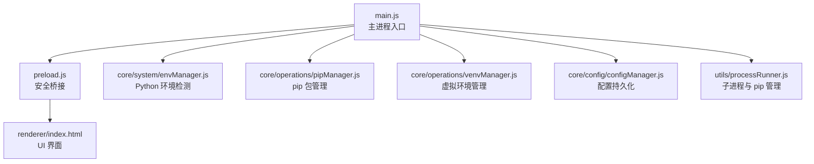
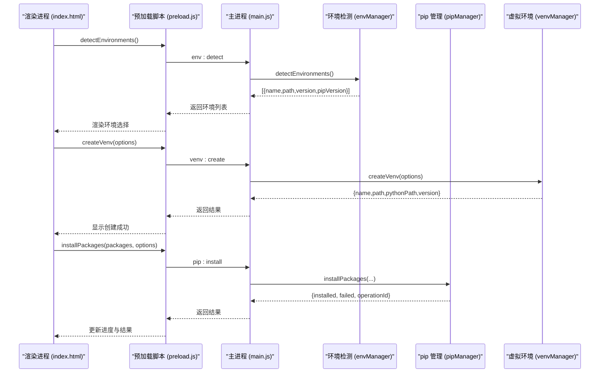
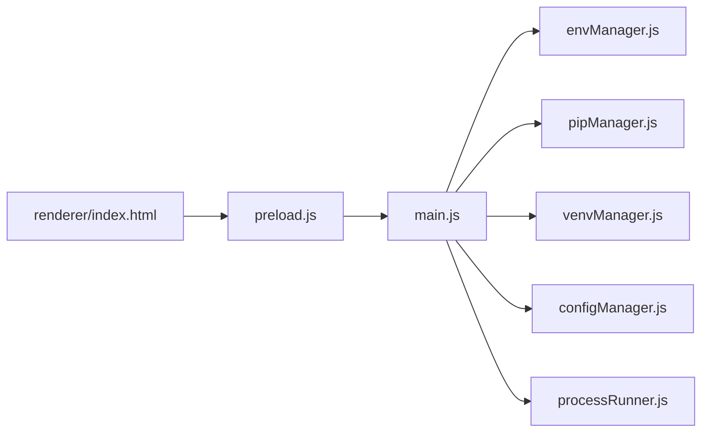

# 快速开始

<cite>
**本文引用的文件**   
- [package.json](file://package.json)
- [main.js](file://main.js)
- [preload.js](file://preload.js)
- [renderer/index.html](file://renderer/index.html)
- [core/system/envManager.js](file://core/system/envManager.js)
- [core/operations/pipManager.js](file://core/operations/pipManager.js)
- [core/operations/venvManager.js](file://core/operations/venvManager.js)
- [core/config/configManager.js](file://core/config/configManager.js)
- [utils/processRunner.js](file://utils/processRunner.js)
</cite>

## 目录
1. [简介](#简介)
2. [项目结构](#项目结构)
3. [核心组件](#核心组件)
4. [架构总览](#架构总览)
5. [详细组件分析](#详细组件分析)
6. [依赖关系分析](#依赖关系分析)
7. [性能注意事项](#性能注意事项)
8. [故障排除指南](#故障排除指南)
9. [结论](#结论)
10. [附录](#附录)

## 简介
本指南面向初次接触 PyLibMaster 的用户，帮助你快速完成系统要求确认、安装与首次启动配置，并掌握检测 Python 环境、安装包、创建虚拟环境等核心操作。PyLibMaster 是一款基于 Electron 的桌面应用，提供 Python 包管理与虚拟环境管理的一体化界面，支持镜像源智能路由、自动回滚、进度反馈与日志导出等功能。

## 项目结构
- 主进程入口：负责窗口管理、IPC 处理器注册、生命周期控制与模块初始化
- 预加载脚本：安全桥接层，将主进程能力暴露给渲染进程
- 渲染界面：HTML/CSS/JS 组成的用户界面，包含安装、卸载、更新、查询、镜像、环境、日志、设置、关于等页面
- 核心模块：环境检测、pip 包管理、虚拟环境管理、配置管理、日志管理等
- 工具库：子进程运行器、安全校验等

图表来源
- [main.js:1-120](file://main.js#L1-L120)
- [preload.js:1-60](file://preload.js#L1-L60)
- [renderer/index.html:1-120](file://renderer/index.html#L1-L120)

章节来源
- [package.json:1-79](file://package.json#L1-L79)
- [main.js:1-120](file://main.js#L1-L120)
- [preload.js:1-60](file://preload.js#L1-L60)
- [renderer/index.html:1-120](file://renderer/index.html#L1-L120)

## 核心组件
- 环境检测（envManager）：扫描常见路径与 PATH，获取 Python 与 pip 版本，维护当前选中环境
- pip 包管理（pipManager）：安装/卸载/更新/查询/搜索/导出导入/对比/健康检查/离线下载等
- 虚拟环境管理（venvManager）：创建/列出/删除/详情查询，支持指定基础 Python、是否含 pip、是否继承系统 site-packages
- 配置管理（configManager）：JSON 配置文件读写、默认值合并、数值范围校验与自动修正
- 子进程运行器（processRunner）：封装 spawn、超时、取消、ANSI 清理、ensurepip 自动安装

章节来源
- [core/system/envManager.js:1-220](file://core/system/envManager.js#L1-L220)
- [core/operations/pipManager.js:1-200](file://core/operations/pipManager.js#L1-L200)
- [core/operations/venvManager.js:1-120](file://core/operations/venvManager.js#L1-L120)
- [core/config/configManager.js:1-120](file://core/config/configManager.js#L1-L120)
- [utils/processRunner.js:1-120](file://utils/processRunner.js#L1-L120)

## 架构总览
PyLibMaster 采用 Electron 三进程模型：主进程、预加载脚本、渲染进程。主进程通过 IPC 暴露能力，预加载脚本在安全隔离下将 API 暴露给渲染进程，渲染进程调用 UI 逻辑并通过 electronAPI 与主进程通信。

图表来源
- [main.js:230-360](file://main.js#L230-L360)
- [preload.js:20-120](file://preload.js#L20-L120)
- [core/system/envManager.js:80-170](file://core/system/envManager.js#L80-L170)
- [core/operations/venvManager.js:70-130](file://core/operations/venvManager.js#L70-L130)
- [core/operations/pipManager.js:470-580](file://core/operations/pipManager.js#L470-L580)

## 详细组件分析

### 系统要求与安装
- 操作系统：Windows（NSIS 安装包目标为 x64），Electron 应用通常也支持 macOS/Linux，但构建配置仅显式声明 Windows 目标
- Node.js：用于构建与打包（electron-builder）
- Python：需要系统中存在可被检测到的 Python 解释器（支持常见安装路径与 Conda/Miniconda）
- 安装方式：
  - 从源码构建：使用 npm scripts 中的 build 命令进行打包
  - 下载安装包：通过 GitHub Releases 发布（publish 配置指向仓库）

章节来源
- [package.json:1-79](file://package.json#L1-L79)

### 首次启动与配置流程
- 启动后主进程创建窗口、托盘、主题同步、自动检查更新与环境检测
- 首次运行会生成默认配置文件（包含主题、语言、存储路径、并行线程数、重试次数、智能路由开关、当前环境、窗口尺寸等）
- 建议先执行“环境检测”，确认已识别到 Python 环境；如未识别，请检查 PATH 或安装路径

章节来源
- [main.js:120-170](file://main.js#L120-L170)
- [core/config/configManager.js:80-120](file://core/config/configManager.js#L80-L120)

### 基本使用示例
- 检测 Python 环境：调用环境检测接口，查看返回的环境列表（名称、路径、版本、pip 版本）
- 安装包：支持批量、并行、版本控制、智能重试、自动回滚；支持从 requirements.txt 或 .whl 安装
- 创建虚拟环境：指定名称、基础 Python、是否包含 pip、是否继承系统 site-packages

章节来源
- [core/system/envManager.js:80-170](file://core/system/envManager.js#L80-L170)
- [core/operations/pipManager.js:470-712](file://core/operations/pipManager.js#L470-L712)
- [core/operations/venvManager.js:70-130](file://core/operations/venvManager.js#L70-L130)

### 常见问题与解决方案
- Python 路径检测失败：
  - 确保 Python 安装在常见路径或在 PATH 中
  - 检查是否安装了 pip（应用会自动尝试 ensurepip 或 get-pip.py）
- 权限问题：
  - 以管理员权限运行应用，避免写入受限目录
  - 检查存储路径与日志目录的写权限
- 网络问题：
  - 配置合适的镜像源，开启智能路由
  - 检查防火墙与代理设置

章节来源
- [utils/processRunner.js:230-278](file://utils/processRunner.js#L230-L278)
- [core/config/configManager.js:120-194](file://core/config/configManager.js#L120-L194)

## 依赖关系分析
- 主进程依赖各核心模块，通过 IPC 暴露能力
- 预加载脚本作为安全桥接，限制渲染进程直接访问 Node API
- 环境检测与 pip 管理依赖子进程运行器执行系统命令
- 配置管理集中管理应用状态与用户偏好

图表来源
- [main.js:1-120](file://main.js#L1-L120)
- [preload.js:1-60](file://preload.js#L1-L60)
- [core/system/envManager.js:1-60](file://core/system/envManager.js#L1-L60)
- [core/operations/pipManager.js:1-60](file://core/operations/pipManager.js#L1-L60)
- [core/operations/venvManager.js:1-60](file://core/operations/venvManager.js#L1-L60)
- [core/config/configManager.js:1-60](file://core/config/configManager.js#L1-L60)
- [utils/processRunner.js:1-60](file://utils/processRunner.js#L1-L60)

章节来源
- [main.js:1-120](file://main.js#L1-L120)
- [preload.js:1-60](file://preload.js#L1-L60)

## 性能注意事项
- 并行安装：合理设置线程数，避免过高导致资源竞争
- 缓存机制：已安装包列表有 5 分钟缓存，site-packages 路径有 30 秒缓存
- 日志防抖：写入日志采用 300ms 防抖，减少频繁 I/O
- 超时控制：子进程执行设置超时，避免长时间阻塞

章节来源
- [core/operations/pipManager.js:80-130](file://core/operations/pipManager.js#L80-L130)
- [core/system/logManager.js:1-80](file://core/system/logManager.js#L1-L80)
- [utils/processRunner.js:80-160](file://utils/processRunner.js#L80-L160)

## 故障排除指南
- 无法检测到 Python：
  - 检查 PATH 环境变量，确保 python.exe 可被找到
  - 查看应用日志，确认是否有权限或路径错误
- pip 不可用：
  - 应用会尝试 ensurepip 或下载 get-pip.py 安装
  - 若仍失败，手动安装 pip 后重启应用
- 安装/卸载失败：
  - 检查镜像源连通性，切换至更快的镜像
  - 查看操作日志，定位具体错误信息
- 权限不足：
  - 以管理员权限运行应用
  - 检查存储路径与日志目录的写权限

章节来源
- [utils/processRunner.js:230-278](file://utils/processRunner.js#L230-L278)
- [core/system/logManager.js:100-173](file://core/system/logManager.js#L100-L173)

## 结论
PyLibMaster 提供了完整的 Python 包管理与虚拟环境管理能力，具备友好的图形界面与强大的后台处理逻辑。通过本指南，你可以快速完成安装与配置，掌握核心操作，并在遇到问题时有效排查与解决。

## 附录
- 常用操作路径参考：
  - 检测环境：[core/system/envManager.js:80-170](file://core/system/envManager.js#L80-L170)
  - 安装包：[core/operations/pipManager.js:470-580](file://core/operations/pipManager.js#L470-L580)
  - 创建虚拟环境：[core/operations/venvManager.js:70-130](file://core/operations/venvManager.js#L70-L130)
  - 配置管理：[core/config/configManager.js:80-120](file://core/config/configManager.js#L80-L120)
  - 子进程运行：[utils/processRunner.js:80-160](file://utils/processRunner.js#L80-L160)