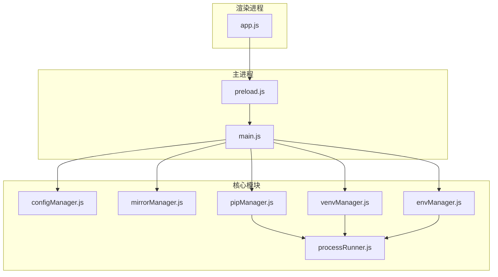
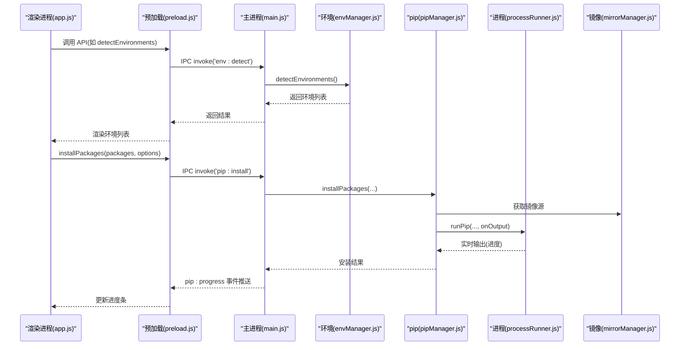
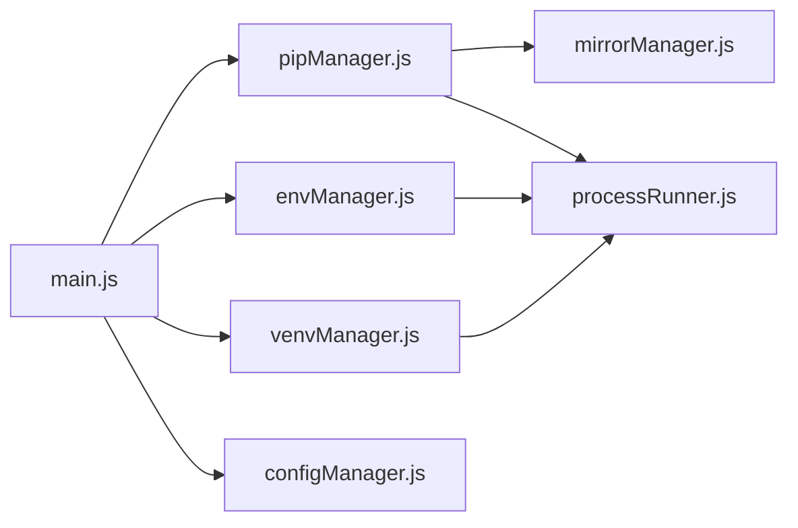

# 常见问题解答

<cite>
**本文引用的文件**   
- [main.js](file://main.js)
- [preload.js](file://preload.js)
- [package.json](file://package.json)
- [core/config/configManager.js](file://core/config/configManager.js)
- [core/config/mirrorManager.js](file://core/config/mirrorManager.js)
- [core/system/envManager.js](file://core/system/envManager.js)
- [core/operations/pipManager.js](file://core/operations/pipManager.js)
- [core/operations/venvManager.js](file://core/operations/venvManager.js)
- [utils/processRunner.js](file://utils/processRunner.js)
- [renderer/js/app.js](file://renderer/js/app.js)
</cite>

## 目录
1. [简介](#简介)
2. [项目结构](#项目结构)
3. [核心组件](#核心组件)
4. [架构总览](#架构总览)
5. [详细组件分析](#详细组件分析)
6. [依赖关系分析](#依赖关系分析)
7. [性能注意事项](#性能注意事项)
8. [故障排查指南](#故障排查指南)
9. [结论](#结论)
10. [附录](#附录)

## 简介
本文件为 PyLibMaster 的“常见问题解答”文档，聚焦用户最常遇到的问题与解决方案，包括：
- Python 环境检测失败
- pip 包安装错误（含网络超时、镜像不可用）
- 权限不足（写入配置或系统目录）
- 网络连接超时（PyPI/镜像源）
- 虚拟环境创建失败
- 自动更新与调度器相关问题

每个问题提供：错误描述、可能原因、逐步解决方案、预防措施，并附带可操作的命令行示例和配置修改方法。内容基于仓库源码实现进行归纳，确保实用性与准确性。

## 项目结构
PyLibMaster 是一个基于 Electron 的桌面应用，采用主进程 + 预加载脚本 + 渲染进程三层架构，核心业务逻辑集中在 core 模块，通过 IPC 暴露给前端 UI。

**图表来源** 
- [main.js:1-150](file://main.js#L1-L150)
- [preload.js:1-120](file://preload.js#L1-L120)
- [core/config/configManager.js:1-120](file://core/config/configManager.js#L1-L120)
- [core/config/mirrorManager.js:1-120](file://core/config/mirrorManager.js#L1-L120)
- [core/system/envManager.js:1-120](file://core/system/envManager.js#L1-L120)
- [core/operations/pipManager.js:1-120](file://core/operations/pipManager.js#L1-L120)
- [core/operations/venvManager.js:1-120](file://core/operations/venvManager.js#L1-L120)
- [utils/processRunner.js:1-120](file://utils/processRunner.js#L1-L120)
- [renderer/js/app.js:1-120](file://renderer/js/app.js#L1-L120)

**章节来源**
- [package.json:1-79](file://package.json#L1-L79)
- [main.js:1-150](file://main.js#L1-L150)
- [preload.js:1-120](file://preload.js#L1-L120)

## 核心组件
- 配置管理：持久化应用设置，包含并行线程数、重试次数、主题、语言、存储路径等。
- 镜像源管理：内置多个 PyPI 镜像，支持智能路由与测速，可将配置写入 pip 配置文件。
- 环境管理：自动检测系统中 Python 环境（含 Conda/Miniconda），维护当前选中环境。
- pip 管理器：安装包/卸载/更新/查询，支持批量、并行、多镜像重试、自动回滚、进度回调。
- 虚拟环境管理：创建/删除/列出 venv，获取详细信息。
- 进程运行器：封装子进程执行、超时控制、取消操作、ANSI 清理、ensurepip 自动安装。
- 渲染进程：UI 交互、事件绑定、状态刷新、国际化与主题切换。

**章节来源**
- [core/config/configManager.js:1-194](file://core/config/configManager.js#L1-L194)
- [core/config/mirrorManager.js:1-376](file://core/config/mirrorManager.js#L1-L376)
- [core/system/envManager.js:1-220](file://core/system/envManager.js#L1-L220)
- [core/operations/pipManager.js:1-800](file://core/operations/pipManager.js#L1-L800)
- [core/operations/venvManager.js:1-278](file://core/operations/venvManager.js#L1-L278)
- [utils/processRunner.js:1-366](file://utils/processRunner.js#L1-L366)
- [renderer/js/app.js:1-210](file://renderer/js/app.js#L1-L210)

## 架构总览
应用启动流程与关键 IPC 通道如下：

**图表来源** 
- [main.js:254-350](file://main.js#L254-L350)
- [preload.js:20-120](file://preload.js#L20-L120)
- [core/system/envManager.js:85-170](file://core/system/envManager.js#L85-L170)
- [core/operations/pipManager.js:495-578](file://core/operations/pipManager.js#L495-L578)
- [utils/processRunner.js:85-161](file://utils/processRunner.js#L85-L161)
- [core/config/mirrorManager.js:284-333](file://core/config/mirrorManager.js#L284-L333)

## 详细组件分析

### Python 环境检测失败
- 错误描述：应用无法检测到任何可用的 Python 环境，或检测到的环境缺少 pip。
- 可能原因：
  - PATH 中未包含 python.exe；常见安装路径未被扫描到。
  - 已安装的 Python 未包含 pip，或被安全软件隔离。
  - Windows Store Python 被重定向导致命令不可用。
- 解决方案：
  - 手动将 Python 安装目录加入系统 PATH，并确保 python --version 与 python -m pip --version 可用。
  - 使用应用内“修复 pip”功能（通过 ensurepip 或 get-pip.py 自动安装）。
  - 在“环境管理”页面重新触发检测，确认是否出现新的环境条目。
- 预防措施：
  - 安装 Python 时勾选“Add to PATH”。
  - 避免使用 Windows Store 的 python.exe，优先使用官方安装包或 Conda/Miniconda。
- 参考实现：
  - 环境检测逻辑与版本信息获取见 [core/system/envManager.js:85-170](file://core/system/envManager.js#L85-L170)。
  - pip 自动安装策略见 [utils/processRunner.js:233-278](file://utils/processRunner.js#L233-L278)。

**章节来源**
- [core/system/envManager.js:85-170](file://core/system/envManager.js#L85-L170)
- [utils/processRunner.js:233-278](file://utils/processRunner.js#L233-L278)

### pip 包安装错误（网络超时、镜像不可用）
- 错误描述：安装过程中出现连接超时、下载失败、镜像不可达或证书校验失败。
- 可能原因：
  - 默认镜像源响应慢或不可达。
  - 企业网络限制（代理、防火墙）未正确配置。
  - 目标包依赖缺失或编译环境不完整（如 Visual Studio Build Tools）。
- 解决方案：
  - 切换到更快的镜像源（阿里云、腾讯云、华为云、清华等），开启“智能路由”自动选择最快镜像。
  - 若需代理，请在系统环境变量中设置 HTTP_PROXY/HTTPS_PROXY，或在 pip 配置文件中添加 proxy 参数。
  - 对于需要编译的包，安装必要的构建工具（Windows 上建议安装 Visual Studio Build Tools）。
- 预防措施：
  - 定期测试镜像速度并固定最优镜像。
  - 在受限网络环境下提前配置代理与超时参数。
- 参考实现：
  - 镜像管理与测速见 [core/config/mirrorManager.js:219-333](file://core/config/mirrorManager.js#L219-L333)。
  - 安装流程与多镜像重试见 [core/operations/pipManager.js:590-615](file://core/operations/pipManager.js#L590-L615)。
  - 子进程超时与取消机制见 [utils/processRunner.js:150-161](file://utils/processRunner.js#L150-L161)。

**章节来源**
- [core/config/mirrorManager.js:219-333](file://core/config/mirrorManager.js#L219-L333)
- [core/operations/pipManager.js:590-615](file://core/operations/pipManager.js#L590-L615)
- [utils/processRunner.js:150-161](file://utils/processRunner.js#L150-L161)

### 权限不足（写入配置或系统目录）
- 错误描述：保存配置、写入 pip 配置文件、删除虚拟环境等操作提示权限不足。
- 可能原因：
  - 应用以非管理员身份运行，但目标目录需要管理员权限（如 Program Files、系统级 pip 配置）。
  - 防病毒软件或企业策略阻止写入特定路径。
- 解决方案：
  - 以管理员身份运行 PyLibMaster。
  - 更改存储路径到用户目录（例如 %APPDATA%/PyLibMaster 或自定义目录）。
  - 将 pip 配置文件写入到用户级目录（~/.config/pip 或 %APPDATA%/pip），避免系统级目录。
- 预防措施：
  - 默认存储路径应位于用户数据目录，避免需要管理员权限的路径。
  - 在受限环境中提前规划存储位置与权限策略。
- 参考实现：
  - 配置存储路径与原子写入见 [core/config/configManager.js:120-138](file://core/config/configManager.js#L120-L138)。
  - 写入 pip 配置文件见 [core/config/mirrorManager.js:299-322](file://core/config/mirrorManager.js#L299-L322)。

**章节来源**
- [core/config/configManager.js:120-138](file://core/config/configManager.js#L120-L138)
- [core/config/mirrorManager.js:299-322](file://core/config/mirrorManager.js#L299-L322)

### 网络连接超时（PyPI/镜像源）
- 错误描述：访问 PyPI 或镜像源时频繁超时，导致安装/更新失败。
- 可能原因：
  - 网络不稳定或 DNS 解析缓慢。
  - 镜像源服务器负载过高或地区性访问限制。
  - 代理配置不正确或未生效。
- 解决方案：
  - 使用“镜像测速”功能选择最快的镜像源。
  - 调整超时参数（pip 配置文件中的 timeout），或启用智能路由自动切换。
  - 检查代理设置，确保 HTTP_PROXY/HTTPS_PROXY 正确指向可用代理。
- 预防措施：
  - 在企业网络中统一配置代理与镜像源白名单。
  - 定期维护镜像源可用性，及时替换失效源。
- 参考实现：
  - 镜像测速与智能路由见 [core/config/mirrorManager.js:219-290](file://core/config/mirrorManager.js#L219-L290)。
  - 子进程超时处理见 [utils/processRunner.js:150-161](file://utils/processRunner.js#L150-L161)。

**章节来源**
- [core/config/mirrorManager.js:219-290](file://core/config/mirrorManager.js#L219-L290)
- [utils/processRunner.js:150-161](file://utils/processRunner.js#L150-L161)

### 虚拟环境创建失败
- 错误描述：创建 venv 时报错，或创建的 venv 无法正常使用。
- 可能原因：
  - 基础 Python 路径无效或缺少可执行文件。
  - 目标目录存在同名 venv，或磁盘空间不足。
  - 操作系统权限限制或杀毒软件拦截。
- 解决方案：
  - 确认基础 Python 可执行文件存在且可运行（python --version）。
  - 更换 venv 名称或清理残留目录后重试。
  - 以管理员身份运行，或将存储路径改为用户目录。
- 预防措施：
  - 创建前校验名称合法性与路径有效性。
  - 监控磁盘空间与权限策略。
- 参考实现：
  - venv 创建与校验见 [core/operations/venvManager.js:73-130](file://core/operations/venvManager.js#L73-L130)。
  - 删除与清理逻辑见 [core/operations/venvManager.js:195-224](file://core/operations/venvManager.js#L195-L224)。

**章节来源**
- [core/operations/venvManager.js:73-130](file://core/operations/venvManager.js#L73-L130)
- [core/operations/venvManager.js:195-224](file://core/operations/venvManager.js#L195-L224)

### 自动更新与调度器问题
- 错误描述：应用自动更新检查失败，或定时任务未按预期执行。
- 可能原因：
  - 网络无法访问 GitHub Releases。
  - 调度器配置错误或被禁用。
  - 应用退出时未正确清理后台任务。
- 解决方案：
  - 检查网络连接与防火墙规则，允许访问更新服务器。
  - 在设置页启用“自动检查更新”，并查看状态栏提示。
  - 重启应用以确保调度器正常初始化。
- 预防措施：
  - 在企业网络中放行更新域名与端口。
  - 定期检查应用版本与更新日志。
- 参考实现：
  - 自动更新入口与事件绑定见 [main.js:217-231](file://main.js#L217-L231)。
  - 调度器状态与执行见 [main.js:526-546](file://main.js#L526-L546)。

**章节来源**
- [main.js:217-231](file://main.js#L217-L231)
- [main.js:526-546](file://main.js#L526-L546)

## 依赖关系分析
- 主进程通过 IPC 将渲染进程的请求转发至核心模块。
- pipManager 依赖 mirrorManager 获取镜像源，依赖 processRunner 执行子进程。
- envManager 负责环境检测，依赖 processRunner 执行 Python 命令。
- venvManager 依赖 processRunner 创建与管理虚拟环境。
- configManager 提供全局配置，所有模块均可读取/写入。

**图表来源** 
- [main.js:1-150](file://main.js#L1-L150)
- [core/operations/pipManager.js:1-120](file://core/operations/pipManager.js#L1-L120)
- [core/system/envManager.js:1-120](file://core/system/envManager.js#L1-L120)
- [core/operations/venvManager.js:1-120](file://core/operations/venvManager.js#L1-L120)
- [core/config/configManager.js:1-120](file://core/config/configManager.js#L1-L120)

**章节来源**
- [main.js:1-150](file://main.js#L1-L150)
- [core/operations/pipManager.js:1-120](file://core/operations/pipManager.js#L1-L120)
- [core/system/envManager.js:1-120](file://core/system/envManager.js#L1-L120)
- [core/operations/venvManager.js:1-120](file://core/operations/venvManager.js#L1-L120)
- [core/config/configManager.js:1-120](file://core/config/configManager.js#L1-L120)

## 性能注意事项
- 并行安装：可通过配置项 parallelThreads 控制并发线程数，避免过多线程导致资源争用。
- 缓存机制：已安装包列表有 5 分钟缓存，site-packages 路径有 30 秒缓存，减少重复扫描开销。
- 超时控制：子进程执行设置合理超时，避免长时间阻塞。
- 日志与备份：自动回滚与日志记录会增加 I/O 开销，建议在大批量操作时谨慎启用。

[本节为通用指导，不直接分析具体文件]

## 故障排查指南
- 快速定位：
  - 查看“日志”页面筛选错误类型与关键词，导出 CSV/Markdown 便于分析。
  - 使用“环境健康检查”与“依赖冲突检测”功能诊断环境问题。
- 常用命令（在终端中验证）：
  - 验证 Python 与 pip：python --version && python -m pip --version
  - 测试镜像源连通性：curl -I https://mirrors.aliyun.com/pypi/simple/
  - 指定镜像安装：pip install --index-url https://mirrors.aliyun.com/pypi/simple/ <包名>
- 配置修改：
  - 修改存储路径：在设置页更改“存储路径”为可用目录。
  - 设置代理：在系统环境变量中添加 HTTP_PROXY/HTTPS_PROXY。
  - 调整超时：在 pip 配置文件中设置 timeout=60。
- 权限问题：
  - 以管理员身份运行应用。
  - 将存储路径改为用户目录（%APPDATA%/PyLibMaster）。

**章节来源**
- [renderer/js/app.js:1-210](file://renderer/js/app.js#L1-L210)
- [core/config/configManager.js:1-194](file://core/config/configManager.js#L1-L194)
- [core/config/mirrorManager.js:299-322](file://core/config/mirrorManager.js#L299-L322)

## 结论
PyLibMaster 提供了完善的 Python 环境与包管理能力，但在实际使用中仍可能遇到环境检测、网络、权限等问题。通过本文档的排查步骤与预防措施，用户可以快速定位并解决常见问题，提升使用体验。建议在生产环境中统一配置镜像源与代理，定期维护环境与健康检查。

[本节为总结，不直接分析具体文件]

## 附录
- 相关配置项说明：
  - parallelThreads：并行安装线程数（1-16）
  - retryCount：智能重试次数（0-10）
  - smartRoute：智能路由开关
  - storagePath：日志与备份存储路径
- 参考实现路径：
  - 配置管理：[core/config/configManager.js](file://core/config/configManager.js)
  - 镜像管理：[core/config/mirrorManager.js](file://core/config/mirrorManager.js)
  - 环境管理：[core/system/envManager.js](file://core/system/envManager.js)
  - pip 管理：[core/operations/pipManager.js](file://core/operations/pipManager.js)
  - 虚拟环境：[core/operations/venvManager.js](file://core/operations/venvManager.js)
  - 进程运行：[utils/processRunner.js](file://utils/processRunner.js)
  - 主进程入口：[main.js](file://main.js)
  - 预加载脚本：[preload.js](file://preload.js)
  - 渲染进程：[renderer/js/app.js](file://renderer/js/app.js)

[本节为附录，不直接分析具体文件]