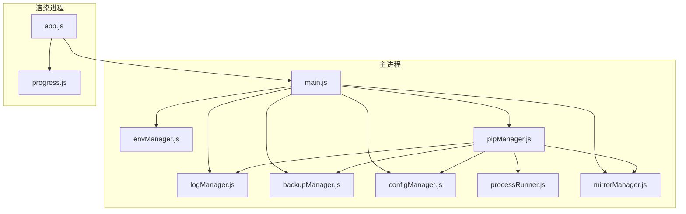
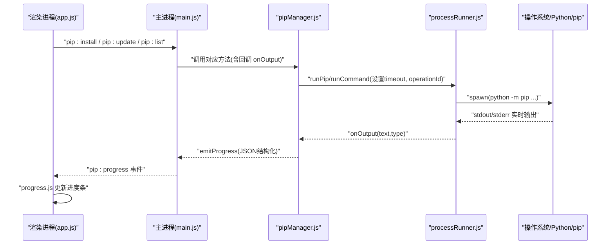
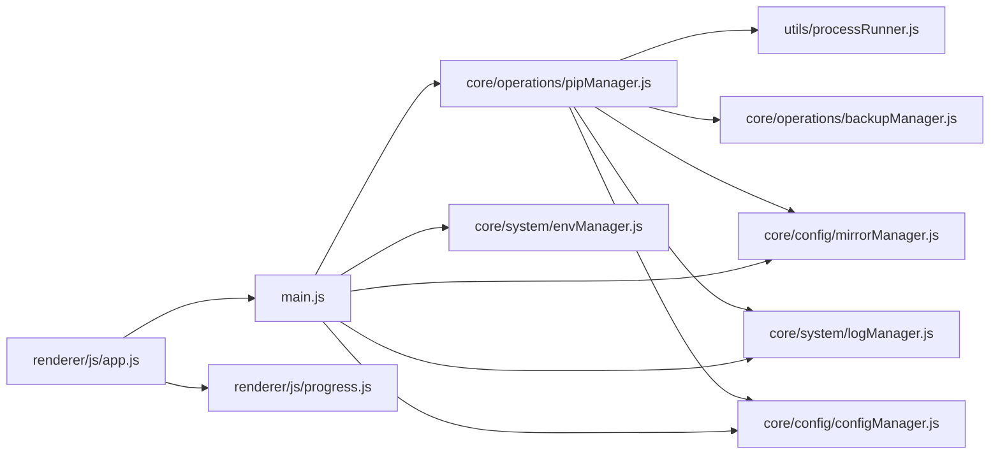

# 性能诊断与优化

<cite>
**本文引用的文件**   
- [main.js](file://main.js)
- [package.json](file://package.json)
- [core/system/logManager.js](file://core/system/logManager.js)
- [utils/processRunner.js](file://utils/processRunner.js)
- [renderer/js/app.js](file://renderer/js/app.js)
- [core/operations/pipManager.js](file://core/operations/pipManager.js)
- [core/system/envManager.js](file://core/system/envManager.js)
- [renderer/js/progress.js](file://renderer/js/progress.js)
- [core/config/configManager.js](file://core/config/configManager.js)
- [core/operations/backupManager.js](file://core/operations/backupManager.js)
- [core/config/mirrorManager.js](file://core/config/mirrorManager.js)
</cite>

## 目录
1. [简介](#简介)
2. [项目结构](#项目结构)
3. [核心组件](#核心组件)
4. [架构总览](#架构总览)
5. [详细组件分析](#详细组件分析)
6. [依赖关系分析](#依赖关系分析)
7. [性能考量与调优建议](#性能考量与调优建议)
8. [故障排查指南](#故障排查指南)
9. [结论](#结论)
10. [附录：监控与数据采集清单](#附录：监控与数据采集清单)

## 简介
本指南面向 PyLibMaster 用户与维护者，聚焦“性能诊断与优化”。内容涵盖：
- 如何监控应用资源使用（内存、CPU、磁盘 I/O、网络）
- 常见性能瓶颈定位方法与工具推荐
- 典型问题场景与解决方案（大量包操作卡顿、网络请求超时、文件读写缓慢等）
- 针对性优化建议与配置调整
- 性能数据采集方法，用于问题分析与持续改进

## 项目结构
PyLibMaster 基于 Electron，主进程负责窗口、IPC、系统能力与核心模块协调；渲染进程负责 UI 交互与进度展示；核心业务集中在 core 目录（pip 管理、环境管理、镜像源、备份、模板等），工具层在 utils。

**图表来源** 
- [main.js:1-150](file://main.js#L1-L150)
- [core/system/logManager.js:1-173](file://core/system/logManager.js#L1-L173)
- [core/system/envManager.js:1-220](file://core/system/envManager.js#L1-L220)
- [core/operations/pipManager.js:1-200](file://core/operations/pipManager.js#L1-L200)
- [core/operations/backupManager.js:1-196](file://core/operations/backupManager.js#L1-L196)
- [core/config/configManager.js:1-194](file://core/config/configManager.js#L1-L194)
- [utils/processRunner.js:1-120](file://utils/processRunner.js#L1-L120)
- [core/config/mirrorManager.js:1-120](file://core/config/mirrorManager.js#L1-L120)
- [renderer/js/app.js:120-210](file://renderer/js/app.js#L120-L210)
- [renderer/js/progress.js:1-141](file://renderer/js/progress.js#L1-L141)

**章节来源**
- [main.js:1-150](file://main.js#L1-L150)
- [package.json:1-79](file://package.json#L1-L79)

## 核心组件
- 主进程入口与 IPC：统一暴露 pip、环境、镜像、日志、配置、更新等接口，集中处理子进程生命周期与取消。
- 子进程运行器：封装 spawn、超时、取消、输出清理、活跃进程跟踪。
- pip 管理器：包查询、安装、卸载、更新、缓存、并发控制、回滚、大小估算、依赖树等。
- 环境管理器：检测 Python 环境、版本信息、切换与持久化。
- 镜像源管理：内置与自定义镜像、测速、智能路由、写入 pip 配置。
- 备份与快照：freeze 备份、恢复、删除；快照创建与恢复。
- 日志管理：操作日志持久化、容量控制、导出。
- 配置管理：默认值、范围校验、原子写入、存储路径。
- 渲染进程：启动阶段并行加载、进度 UI 更新、事件绑定。

**章节来源**
- [utils/processRunner.js:1-120](file://utils/processRunner.js#L1-L120)
- [core/operations/pipManager.js:1-200](file://core/operations/pipManager.js#L1-L200)
- [core/system/envManager.js:1-120](file://core/system/envManager.js#L1-L120)
- [core/config/mirrorManager.js:1-120](file://core/config/mirrorManager.js#L1-L120)
- [core/operations/backupManager.js:1-120](file://core/operations/backupManager.js#L1-L120)
- [core/system/logManager.js:1-120](file://core/system/logManager.js#L1-L120)
- [core/config/configManager.js:1-120](file://core/config/configManager.js#L1-L120)
- [renderer/js/app.js:120-210](file://renderer/js/app.js#L120-L210)
- [renderer/js/progress.js:1-141](file://renderer/js/progress.js#L1-L141)

## 架构总览
下图展示了从 UI 到主进程再到外部命令的调用链，以及关键的性能相关点（并发、超时、缓存、I/O）。

**图表来源** 
- [renderer/js/app.js:120-210](file://renderer/js/app.js#L120-L210)
- [main.js:280-360](file://main.js#L280-L360)
- [core/operations/pipManager.js:475-580](file://core/operations/pipManager.js#L475-L580)
- [utils/processRunner.js:85-160](file://utils/processRunner.js#L85-L160)
- [renderer/js/progress.js:90-141](file://renderer/js/progress.js#L90-L141)

## 详细组件分析

### 子进程运行器（processRunner.js）
- 功能要点
  - 统一的 runCommand/runPip/runPython，支持 UTF-8、shell、cwd、超时、忽略退出码、operationId。
  - 活跃进程 Map 管理，支持按 processId 或 operationId 取消。
  - SIGTERM + 延迟 SIGKILL 的两级终止策略，避免僵尸进程。
  - ANSI 色彩清理，提升日志可读性。
  - pip 就绪检测与自动安装（ensurepip/get-pip.py），带缓存 TTL。
- 性能影响
  - 超时时间过长会阻塞线程池与 UI 响应；过短易误杀。
  - 并发过多会导致 CPU 与 I/O 争用，需结合 parallelThreads 控制。
  - 频繁下载 get-pip.py 会增加网络与磁盘开销。
- 优化建议
  - 合理设置 timeout（安装/更新建议 600s，查询类 30-60s）。
  - 批量操作时限制并发度，避免同时触发大量磁盘 I/O。
  - 复用 pip 就绪缓存，减少重复检测。

**章节来源**
- [utils/processRunner.js:1-120](file://utils/processRunner.js#L1-L120)
- [utils/processRunner.js:120-220](file://utils/processRunner.js#L120-L220)
- [utils/processRunner.js:220-332](file://utils/processRunner.js#L220-L332)
- [utils/processRunner.js:332-366](file://utils/processRunner.js#L332-L366)

### pip 管理器（pipManager.js）
- 功能要点
  - 已安装包列表：实时扫描 site-packages，构建目录映射，估算包大小与安装时间，结果写缓存（5 分钟）。
  - 安装/卸载/更新：支持并行、多镜像重试、自动回滚、进度结构化事件。
  - 安全校验：包名/版本正则、wheel 路径白名单、UNC 与敏感目录拦截。
  - 互斥锁：同一环境串行执行，避免并发冲突。
- 性能影响
  - listInstalled 会遍历 site-packages，大数据量时耗时明显。
  - 并行安装受限于 CPU、磁盘 I/O、网络带宽与 pip 自身并发限制。
  - 缓存命中可显著降低重复扫描成本。
- 优化建议
  - 优先使用 listInstalledCached 获取快速列表，后台再刷新完整列表。
  - 合理设置 parallelThreads（默认 4，视机器性能调整）。
  - 启用智能重试与镜像切换，提高成功率并缩短失败重试时间。
  - 对大体积包安装，考虑离线下载与本地安装。

**章节来源**
- [core/operations/pipManager.js:1-200](file://core/operations/pipManager.js#L1-L200)
- [core/operations/pipManager.js:380-442](file://core/operations/pipManager.js#L380-L442)
- [core/operations/pipManager.js:475-580](file://core/operations/pipManager.js#L475-L580)
- [core/operations/pipManager.js:580-712](file://core/operations/pipManager.js#L580-L712)
- [core/operations/pipManager.js:712-800](file://core/operations/pipManager.js#L712-L800)

### 环境管理器（envManager.js）
- 功能要点
  - 多路径扫描（glob）、PATH 查找、并行获取版本信息。
  - 当前环境选择与持久化。
- 性能影响
  - 多环境检测涉及多次子进程调用，应异步非阻塞。
- 优化建议
  - 启动时后台检测，不阻塞 UI。
  - 缓存检测结果，避免重复扫描。

**章节来源**
- [core/system/envManager.js:1-120](file://core/system/envManager.js#L1-L120)
- [core/system/envManager.js:120-220](file://core/system/envManager.js#L120-L220)

### 镜像源管理（mirrorManager.js）
- 功能要点
  - 内置与自定义镜像合并、默认源维护、测速、智能路由、写入 pip 配置。
- 性能影响
  - 测速为 HEAD 请求，超时 5s；批量测速并行执行。
- 优化建议
  - 开启智能路由可减少慢源导致的整体耗时。
  - 定期测速并保存速度，减少重复测试。

**章节来源**
- [core/config/mirrorManager.js:1-120](file://core/config/mirrorManager.js#L1-L120)
- [core/config/mirrorManager.js:218-290](file://core/config/mirrorManager.js#L218-L290)
- [core/config/mirrorManager.js:290-376](file://core/config/mirrorManager.js#L290-L376)

### 备份与快照（backupManager.js、templateManager.js）
- 功能要点
  - 基于 pip freeze 的备份与恢复；快照 JSON 记录包列表与环境信息。
- 性能影响
  - freeze 与 restore 是 I/O 密集操作，可能成为瓶颈。
- 优化建议
  - 仅在必要时创建备份/快照；批量操作前自动备份，失败后自动回滚。
  - 恢复时使用 --no-deps 减少依赖重装开销。

**章节来源**
- [core/operations/backupManager.js:1-120](file://core/operations/backupManager.js#L1-L120)
- [core/operations/backupManager.js:120-196](file://core/operations/backupManager.js#L120-L196)
- [core/operations/templateManager.js:1-200](file://core/operations/templateManager.js#L1-L200)

### 日志管理（logManager.js）
- 功能要点
  - 日志持久化、容量上限、字段截断、防抖写入、导出 CSV/Markdown。
- 性能影响
  - 高频写入会引发磁盘 I/O；防抖可降低频率。
- 优化建议
  - 保持默认 300ms 防抖；导出时按需筛选类型与关键词。

**章节来源**
- [core/system/logManager.js:1-120](file://core/system/logManager.js#L1-L120)
- [core/system/logManager.js:120-173](file://core/system/logManager.js#L120-L173)

### 配置管理（configManager.js）
- 功能要点
  - 默认值与范围校验、原子写入、存储路径管理。
- 性能影响
  - 配置写入频率低，影响较小。
- 优化建议
  - 批量设置 setBulk 减少磁盘写入次数。

**章节来源**
- [core/config/configManager.js:1-120](file://core/config/configManager.js#L1-L120)
- [core/config/configManager.js:120-194](file://core/config/configManager.js#L120-L194)

### 渲染进程与进度（app.js、progress.js）
- 功能要点
  - 启动分阶段并行加载（环境、镜像、缓存库），后台刷新完整列表。
  - 进度卡片解析结构化事件与文本输出，自动隐藏。
- 性能影响
  - 启动阶段并行任务过多可能导致瞬时 CPU/内存峰值。
- 优化建议
  - 保持 Phase 1 并行，Phase 2/3 懒加载；避免一次性渲染超大表格。

**章节来源**
- [renderer/js/app.js:120-210](file://renderer/js/app.js#L120-L210)
- [renderer/js/progress.js:1-141](file://renderer/js/progress.js#L1-L141)

## 依赖关系分析
- 主进程通过 IPC 暴露所有能力，渲染进程仅通过 API 调用，解耦清晰。
- pipManager 强依赖 processRunner、mirrorManager、backupManager、logManager、configManager、envManager。
- 进度与 UI 由 progress.js 与 app.js 协同，事件驱动。

**图表来源** 
- [main.js:1-150](file://main.js#L1-L150)
- [core/operations/pipManager.js:1-120](file://core/operations/pipManager.js#L1-L120)
- [utils/processRunner.js:1-120](file://utils/processRunner.js#L1-L120)
- [core/config/mirrorManager.js:1-120](file://core/config/mirrorManager.js#L1-L120)
- [core/operations/backupManager.js:1-120](file://core/operations/backupManager.js#L1-L120)
- [core/system/logManager.js:1-120](file://core/system/logManager.js#L1-L120)
- [core/config/configManager.js:1-120](file://core/config/configManager.js#L1-L120)
- [renderer/js/app.js:120-210](file://renderer/js/app.js#L120-L210)
- [renderer/js/progress.js:1-141](file://renderer/js/progress.js#L1-L141)

**章节来源**
- [main.js:1-150](file://main.js#L1-L150)
- [core/operations/pipManager.js:1-120](file://core/operations/pipManager.js#L1-L120)

## 性能考量与调优建议

### 资源监控方法
- 内存占用
  - Windows：任务管理器/资源监视器查看 Node/Electron 进程内存；关注 V8 堆增长与句柄数。
  - macOS：活动监视器；Linux：top/htop/free。
  - 代码侧：可在调试模式引入 node:perf_hooks 采样内存（开发环境）。
- CPU 使用率
  - 观察主进程与子进程 CPU 峰值；大量包安装时 CPU 通常被编译型包占用。
- 磁盘 I/O
  - 使用资源监视器（IO 读写速率、队列长度）；关注 site-packages 目录与备份/日志目录。
- 网络
  - 使用浏览器开发者工具或系统网络监视器；镜像测速结果可作为参考。

### 常见瓶颈与定位
- 大量包操作卡顿
  - 原因：并行度过高导致 I/O 竞争；site-packages 扫描与统计开销大。
  - 定位：检查 parallelThreads、日志中 install/update 耗时；观察磁盘队列。
  - 解决：降低并发、启用缓存、分批操作、使用离线包。
- 网络请求超时
  - 原因：镜像慢、网络不稳定、超时设置过短。
  - 定位：mirrorManager 测速、processRunner 超时日志、pip 输出错误。
  - 解决：开启智能路由、更换更快镜像、适当增大 timeout。
- 文件读写缓慢
  - 原因：日志/备份/缓存频繁写入；磁盘碎片或慢盘。
  - 定位：logManager 写入频率、备份/快照文件大小与数量。
  - 解决：保持防抖、归档旧日志、迁移存储路径至 SSD。

### 配置优化要点
- 并行线程数
  - 默认 4，根据 CPU 核数与磁盘能力调整（1-16）。
- 重试次数
  - 默认 3，网络不稳时可适度增加，但会增加总耗时。
- 超时时间
  - 安装/更新建议 600s；查询类 30-60s；下载脚本 30s。
- 缓存策略
  - 已安装包缓存 5 分钟；site-packages 路径缓存 30s；pip 就绪缓存 5 分钟。
- 智能路由
  - 开启后可自动选择最快镜像，减少失败与重试。

### 采集性能数据的方法
- 操作日志
  - 使用 log:get 筛选类型与关键词，导出 CSV/Markdown 便于分析。
- 进度事件
  - 通过 pip:progress 事件收集每个包的 done/status，统计成功/失败比例与耗时。
- 镜像测速
  - mirror:testAll 获取各镜像速度，保存 speed 字段辅助决策。
- 磁盘占用
  - pip:diskUsage 获取环境磁盘占用分析，识别大体积包。
- 启动时序
  - app.js 启动分阶段并行，记录各阶段耗时（可在调试时添加时间戳）。

**章节来源**
- [core/config/configManager.js:20-45](file://core/config/configManager.js#L20-L45)
- [core/config/mirrorManager.js:218-290](file://core/config/mirrorManager.js#L218-L290)
- [utils/processRunner.js:85-160](file://utils/processRunner.js#L85-L160)
- [core/system/logManager.js:1-120](file://core/system/logManager.js#L1-L120)
- [core/operations/pipManager.js:380-442](file://core/operations/pipManager.js#L380-L442)
- [renderer/js/app.js:120-210](file://renderer/js/app.js#L120-L210)

## 故障排查指南
- 安装/更新失败
  - 检查 processRunner 超时与错误输出；确认镜像可用性与网络连通性。
  - 若启用自动回滚，确认 backupManager 备份/恢复流程是否成功。
- 进度不更新
  - 确认 pipManager emitProgress 是否发送结构化事件；progress.js 是否正确解析。
- 日志缺失或过大
  - 检查 logManager 防抖与 flushLogs；清理历史日志或调整存储路径。
- 环境切换无效
  - 确认 envManager 切换逻辑与 configManager 持久化是否生效。

**章节来源**
- [utils/processRunner.js:120-220](file://utils/processRunner.js#L120-L220)
- [core/operations/pipManager.js:475-580](file://core/operations/pipManager.js#L475-L580)
- [renderer/js/progress.js:90-141](file://renderer/js/progress.js#L90-L141)
- [core/system/logManager.js:80-120](file://core/system/logManager.js#L80-L120)
- [core/system/envManager.js:170-220](file://core/system/envManager.js#L170-L220)

## 结论
PyLibMaster 在架构上实现了清晰的职责分离与良好的可扩展性。通过合理的并发控制、镜像智能路由、缓存策略与完善的日志/备份机制，可有效缓解常见性能瓶颈。建议在生产使用中结合系统监控与内部日志，持续采集与分析性能数据，逐步优化配置与操作流程。

## 附录：监控与数据采集清单
- 系统监控
  - 任务管理器/活动监视器/htop：内存、CPU、磁盘 I/O、网络。
- 应用内数据
  - 日志：log:get（类型/关键词筛选）、log:export（CSV/Markdown）。
  - 进度：pip:progress（done/pkg/status）。
  - 镜像：mirror:testAll（speed）。
  - 磁盘：pip:diskUsage（环境占用分析）。
- 配置项
  - parallelThreads、retryCount、smartRoute、storagePath、timeout（由 processRunner 控制）。

[无章节来源：本节为通用指导]