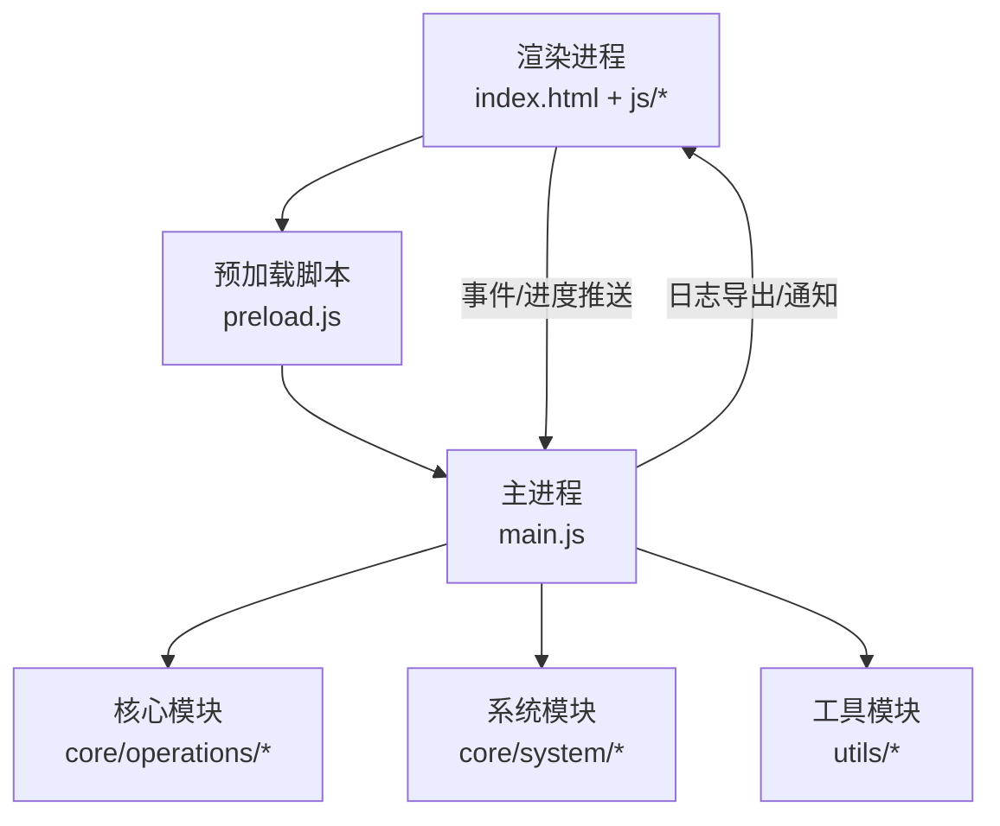
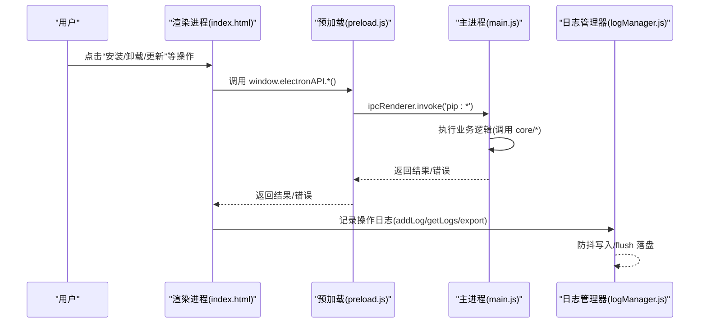
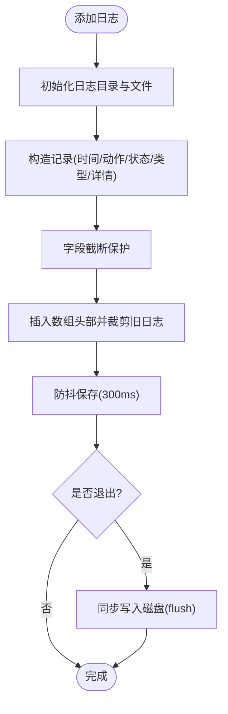
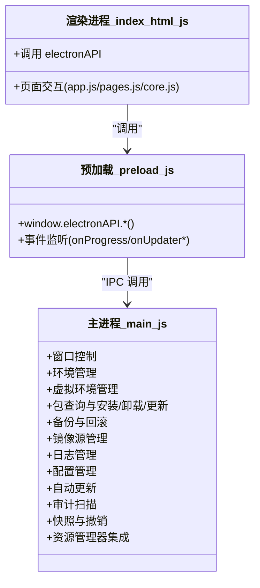
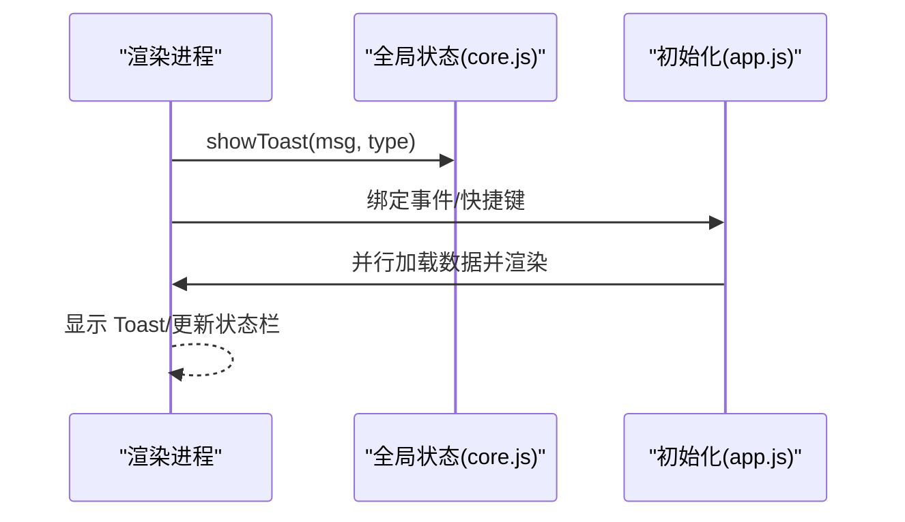
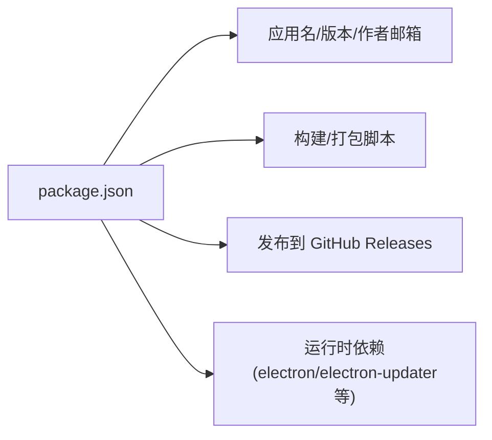

# 技术支持渠道

<cite>
**本文引用的文件**   
- [package.json](file://package.json)
- [main.js](file://main.js)
- [preload.js](file://preload.js)
- [index.html](file://renderer/index.html)
- [app.js](file://renderer/js/app.js)
- [core.js](file://renderer/js/core.js)
- [pages.js](file://renderer/js/pages.js)
- [logManager.js](file://core/system/logManager.js)
</cite>

## 目录
1. [简介](#简介)
2. [项目结构](#项目结构)
3. [核心组件](#核心组件)
4. [架构总览](#架构总览)
5. [详细组件分析](#详细组件分析)
6. [依赖关系分析](#依赖关系分析)
7. [性能与稳定性建议](#性能与稳定性建议)
8. [故障排查指南](#故障排查指南)
9. [结论](#结论)
10. [附录：问题反馈模板与最佳实践](#附录问题反馈模板与最佳实践)

## 简介
本指南面向 PyLibMaster 用户，提供获取帮助的有效途径与使用建议。内容涵盖：
- 如何提交 Bug 报告和功能请求（含必要信息收集与模板）
- 社区支持渠道（GitHub Issues、讨论区等）
- 问题反馈最佳实践（重现步骤、日志与环境信息）
- 参与贡献与交流的方式
- 紧急问题的联系方式与处理流程

## 项目结构
PyLibMaster 为基于 Electron 的桌面应用，采用主进程/预加载脚本/渲染进程三层架构，并通过 IPC 暴露能力给前端页面。关键入口与职责如下：
- 主进程 main.js：窗口管理、IPC 处理器注册、生命周期、系统托盘、自动更新调度、日志导出等
- 预加载脚本 preload.js：安全桥接层，将主进程 API 暴露到 window.electronAPI
- 渲染进程 index.html + js/*：界面与交互逻辑，通过 electronAPI 调用后端能力
- 核心模块 core/*：包管理、镜像源、环境、备份、日志、配置、审计、撤销、资源管理器集成等
- 工具 utils/*：进程运行与安全校验等

**图表来源** 
- [main.js:1-120](file://main.js#L1-L120)
- [preload.js:1-60](file://preload.js#L1-L60)
- [index.html:1-120](file://renderer/index.html#L1-L120)

**章节来源**
- [main.js:1-120](file://main.js#L1-L120)
- [preload.js:1-60](file://preload.js#L1-L60)
- [index.html:1-120](file://renderer/index.html#L1-L120)

## 核心组件
- 日志管理（logManager.js）：持久化操作日志，支持筛选、清空、容量控制与字段截断；提供 flush 确保退出时不丢日志
- 主进程 IPC（main.js）：统一暴露 pip、镜像、环境、备份、日志、配置、更新、审计、快照、撤销、资源管理器等功能接口
- 预加载桥接（preload.js）：将主进程能力以安全方式暴露给渲染进程
- 渲染进程（index.html + app.js + pages.js + core.js）：界面交互、状态管理、事件绑定、国际化、Toast 提示、快捷键等

**章节来源**
- [logManager.js:1-173](file://core/system/logManager.js#L1-L173)
- [main.js:233-640](file://main.js#L233-L640)
- [preload.js:20-221](file://preload.js#L20-L221)
- [app.js:1-210](file://renderer/js/app.js#L1-L210)
- [pages.js:1-200](file://renderer/js/pages.js#L1-L200)
- [core.js:1-93](file://renderer/js/core.js#L1-L93)

## 架构总览
下图展示从用户操作到日志落盘的关键路径，便于定位问题与收集诊断信息。

**图表来源** 
- [preload.js:20-120](file://preload.js#L20-L120)
- [main.js:233-420](file://main.js#L233-L420)
- [logManager.js:100-173](file://core/system/logManager.js#L100-L173)

## 详细组件分析

### 日志管理与导出（用于问题定位）
- 日志存储位置：应用存储目录下的 logs/operations.json
- 功能要点：
  - 新增日志自动加时间戳，字段长度限制，最多保留 2000 条
  - 写入防抖 300ms，退出前强制 flush 保证数据不丢失
  - 支持按类型与关键词筛选，支持导出 CSV/Markdown
- 在“操作日志”页面可筛选、搜索、导出并清空日志

**图表来源** 
- [logManager.js:48-96](file://core/system/logManager.js#L48-L96)
- [logManager.js:98-131](file://core/system/logManager.js#L98-L131)
- [logManager.js:132-173](file://core/system/logManager.js#L132-L173)

**章节来源**
- [logManager.js:1-173](file://core/system/logManager.js#L1-L173)
- [main.js:397-414](file://main.js#L397-L414)
- [main.js:482-514](file://main.js#L482-L514)

### 主进程 IPC 与能力暴露
- 窗口控制、环境检测与切换、虚拟环境管理、包查询与安装/卸载/更新、备份与回滚、镜像源管理、日志管理、配置管理、自动更新、审计扫描、快照、撤销、资源管理器集成等
- 所有能力通过 ipcMain.handle 暴露，渲染进程通过 preload 暴露的 electronAPI 调用

**图表来源** 
- [main.js:233-640](file://main.js#L233-L640)
- [preload.js:20-221](file://preload.js#L20-L221)
- [index.html:1-120](file://renderer/index.html#L1-L120)

**章节来源**
- [main.js:233-640](file://main.js#L233-L640)
- [preload.js:20-221](file://preload.js#L20-L221)

### 渲染进程交互与错误提示
- Toast 提示：统一的消息提示机制，区分 ok/err/info/warn
- 快捷键：Ctrl+F 聚焦搜索、Ctrl+1~9 切换页面、Esc 关闭弹窗
- 启动流程：并行加载配置/环境/镜像/缓存库，后台刷新完整列表，懒加载可更新列表

**图表来源** 
- [core.js:37-93](file://renderer/js/core.js#L37-L93)
- [app.js:104-210](file://renderer/js/app.js#L104-L210)

**章节来源**
- [core.js:1-93](file://renderer/js/core.js#L1-L93)
- [app.js:1-210](file://renderer/js/app.js#L1-L210)

## 依赖关系分析
- 应用元信息与构建发布：
  - package.json 定义了应用名称、版本、作者邮箱、构建脚本、发布仓库（GitHub）等信息
- 运行时依赖：
  - electron、electron-builder、electron-updater、glob、strip-ansi 等

**图表来源** 
- [package.json:1-79](file://package.json#L1-L79)

**章节来源**
- [package.json:1-79](file://package.json#L1-L79)

## 性能与稳定性建议
- 日志写入防抖与退出前 flush，避免高频 IO 与数据丢失
- 启动阶段并行加载与懒加载，提升首屏响应速度
- 字段长度限制与最大条目数控制，防止日志膨胀影响性能
- 建议使用智能路由与重试策略，降低网络波动对安装/更新的影响

[本节为通用建议，无需特定文件引用]

## 故障排查指南
- 快速定位
  - 打开“操作日志”，筛选相关类型（install/uninstall/update/system），搜索关键词
  - 导出 CSV/Markdown 以便附带到问题报告中
- 常见问题
  - pip 损坏或不可用：在“环境选择”页执行“修复 pip”
  - 镜像源不可达：在“镜像源”页进行测速并设置默认镜像
  - 权限或路径问题：检查所选 Python 环境与 site-packages 访问权限
- 辅助工具
  - 依赖冲突检测与健康检查（工具箱页）
  - 磁盘空间分析与依赖图谱（工具箱页）

**章节来源**
- [main.js:397-414](file://main.js#L397-L414)
- [main.js:482-514](file://main.js#L482-L514)
- [pages.js:163-200](file://renderer/js/pages.js#L163-L200)

## 结论
通过本指南，您可以高效地获取帮助、提交问题与参与社区。请优先使用内置日志导出与诊断工具，配合标准化模板提交问题，有助于快速定位与修复。

[本节为总结性内容，无需特定文件引用]

## 附录：问题反馈模板与最佳实践

### 一、如何提交 Bug 报告
- 渠道
  - GitHub Issues（仓库地址见 package.json 的 publish.owner/repo）
  - 邮件联系（作者邮箱见 package.json）
- 必要信息
  - 应用版本（可在“关于”页查看或通过系统版本接口获取）
  - 操作系统与版本
  - Python 环境（路径与版本）
  - 复现步骤（尽量精简）
  - 期望行为与实际行为
  - 日志附件（CSV 或 Markdown）
  - 截图/录屏（如有）
- 模板（复制后填写）
  - 标题：[Bug] 简要描述问题
  - 版本：PyLibMaster vX.Y.Z
  - 系统：Windows/macOS/Linux + 版本
  - Python：路径与版本
  - 复现步骤：
    1. ...
    2. ...
    3. ...
  - 期望行为：...
  - 实际行为：...
  - 日志：附上导出的 CSV/Markdown
  - 其他信息：...

**章节来源**
- [package.json:1-79](file://package.json#L1-L79)
- [logManager.js:132-173](file://core/system/logManager.js#L132-L173)
- [main.js:482-514](file://main.js#L482-L514)

### 二、如何提交功能请求
- 渠道
  - GitHub Issues（标签建议 feature-request）
  - 邮件联系（说明需求背景与价值）
- 必要信息
  - 需求描述与使用场景
  - 预期效果与边界条件
  - 可能的替代方案
  - 优先级与影响范围
- 模板（复制后填写）
  - 标题：[Feature] 简要描述需求
  - 背景：...
  - 需求描述：...
  - 预期效果：...
  - 替代方案：...
  - 优先级：高/中/低

[本节为模板说明，无需特定文件引用]

### 三、社区支持渠道
- GitHub Issues：提交 Bug 与功能请求
- 讨论区/论坛：如仓库提供 Discussions，可发起讨论与求助
- 邮件：适用于非公开或敏感问题沟通

[本节为通用指引，无需特定文件引用]

### 四、问题反馈最佳实践
- 精准复现
  - 最小化操作步骤，排除无关因素
  - 明确触发条件（环境、参数、网络状况）
- 收集日志
  - 在“操作日志”页筛选并导出 CSV/Markdown
  - 若涉及网络问题，同时记录镜像源与网络状态
- 提供环境信息
  - 应用版本、系统版本、Python 路径与版本、是否启用虚拟环境
  - 是否开启智能路由/重试/并行等选项
- 附加材料
  - 截图/录屏、requirements.txt、自定义镜像源配置（脱敏）

**章节来源**
- [logManager.js:132-173](file://core/system/logManager.js#L132-L173)
- [main.js:482-514](file://main.js#L482-L514)

### 五、参与贡献与交流
- 代码贡献
  - Fork 仓库并提交 Pull Request
  - 遵循现有代码风格与模块划分（core/renderer/utils）
- 文档与翻译
  - 完善使用说明与帮助文档
  - 协助多语言文案优化
- 社区交流
  - 在 Issues/Discussions 中积极回答他人问题
  - 分享使用经验与技巧

[本节为通用指引，无需特定文件引用]

### 六、紧急问题处理流程
- 适用场景
  - 批量安装/更新失败导致环境不可用
  - 重要任务阻塞且无法自行恢复
- 处理步骤
  - 立即导出日志并尝试“修复 pip”与“恢复默认镜像源”
  - 通过邮件或 Issues 标注“紧急”并附上日志与环境信息
  - 维护者将优先响应并提供回滚/修复建议

**章节来源**
- [main.js:161-170](file://main.js#L161-L170)
- [logManager.js:86-96](file://core/system/logManager.js#L86-L96)
- [package.json:1-79](file://package.json#L1-L79)