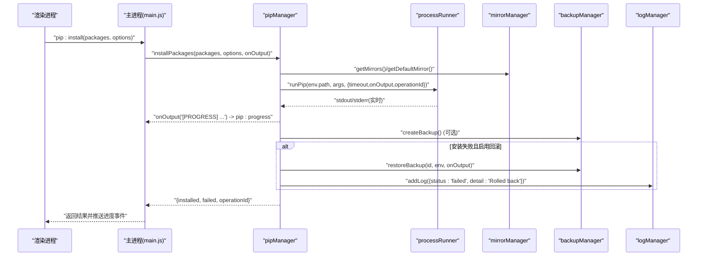
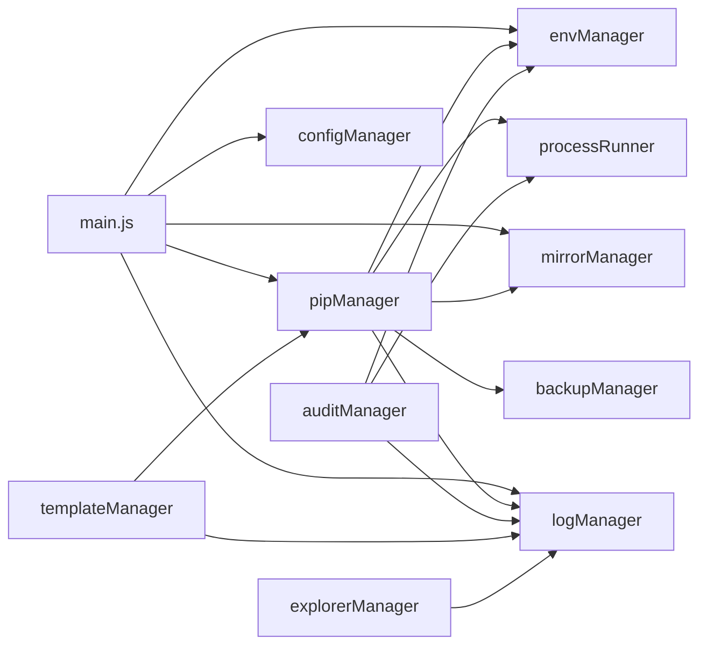

# 故障排除

<cite>
**本文引用的文件**   
- [main.js](file://main.js)
- [package.json](file://package.json)
- [core/system/logManager.js](file://core/system/logManager.js)
- [core/operations/pipManager.js](file://core/operations/pipManager.js)
- [core/system/envManager.js](file://core/system/envManager.js)
- [utils/processRunner.js](file://utils/processRunner.js)
- [core/config/configManager.js](file://core/config/configManager.js)
- [core/operations/backupManager.js](file://core/operations/backupManager.js)
- [core/system/explorerManager.js](file://core/system/explorerManager.js)
- [core/operations/auditManager.js](file://core/operations/auditManager.js)
- [core/config/mirrorManager.js](file://core/config/mirrorManager.js)
- [core/operations/templateManager.js](file://core/operations/templateManager.js)
- [core/operations/undoManager.js](file://core/operations/undoManager.js)
</cite>

## 目录
1. [简介](#简介)
2. [项目结构](#项目结构)
3. [核心组件](#核心组件)
4. [架构总览](#架构总览)
5. [详细组件分析](#详细组件分析)
6. [依赖关系分析](#依赖关系分析)
7. [性能考量](#性能考量)
8. [故障排除指南](#故障排除指南)
9. [结论](#结论)
10. [附录：错误代码与解决步骤](#附录错误代码与解决步骤)

## 简介
本指南面向 PyLibMaster 用户与维护者，聚焦常见问题的快速定位与修复，涵盖 Python 环境检测失败、包安装错误、权限问题、网络连接问题等。文档同时提供日志分析方法（级别、筛选、导出）、性能诊断与优化建议、内置诊断工具使用方式、外部调试工具配合方法，以及社区支持与反馈渠道，帮助用户高效解决问题并降低技术支持负担。

## 项目结构
PyLibMaster 基于 Electron 构建，主进程负责窗口管理、IPC 路由与系统能力调用；核心模块位于 core 目录，按“配置/操作/系统”分层组织；渲染层在 renderer 目录；通用工具在 utils 目录。关键入口为 main.js，通过 IPC 将前端请求分发到 pipManager、envManager、mirrorManager、logManager 等模块。

```mermaid
graph TB
A["main.js<br/>主进程入口与IPC路由"] --> B["core/system/envManager.js<br/>Python环境检测与切换"]
A --> C["core/operations/pipManager.js<br/>包查询/安装/卸载/更新"]
A --> D["core/config/mirrorManager.js<br/>镜像源管理与智能路由"]
A --> E["core/system/logManager.js<br/>操作日志记录与导出"]
A --> F["core/config/configManager.js<br/>应用配置持久化"]
A --> G["utils/processRunner.js<br/>子进程执行与pip自动修复"]
A --> H["core/operations/backupManager.js<br/>备份与恢复"]
A --> I["core/operations/auditManager.js<br/>安全漏洞扫描"]
A --> J["core/operations/templateManager.js<br/>模板与环境快照"]
A --> K["core/operations/undoManager.js<br/>操作撤销栈"]
A --> L["core/system/explorerManager.js<br/>Windows右键菜单集成"]
```

图表来源
- [main.js:1-640](file://main.js#L1-L640)
- [core/system/envManager.js:1-220](file://core/system/envManager.js#L1-L220)
- [core/operations/pipManager.js:1-800](file://core/operations/pipManager.js#L1-L800)
- [core/config/mirrorManager.js:1-376](file://core/config/mirrorManager.js#L1-L376)
- [core/system/logManager.js:1-173](file://core/system/logManager.js#L1-L173)
- [core/config/configManager.js:1-194](file://core/config/configManager.js#L1-L194)
- [utils/processRunner.js:1-366](file://utils/processRunner.js#L1-L366)
- [core/operations/backupManager.js:1-196](file://core/operations/backupManager.js#L1-L196)
- [core/operations/auditManager.js:1-230](file://core/operations/auditManager.js#L1-L230)
- [core/operations/templateManager.js:1-320](file://core/operations/templateManager.js#L1-L320)
- [core/operations/undoManager.js:1-131](file://core/operations/undoManager.js#L1-L131)

章节来源
- [main.js:1-640](file://main.js#L1-L640)
- [package.json:1-79](file://package.json#L1-L79)

## 核心组件
- 环境管理（envManager）：自动检测系统中 Python 与 pip 版本，支持多环境发现与切换，持久化当前环境。
- 包管理（pipManager）：实现包的查询、安装、卸载、更新、依赖树、导出/导入 requirements、离线下载、磁盘占用分析等，具备并行、重试、回滚、互斥锁等特性。
- 镜像源（mirrorManager）：内置多镜像源，支持测速、智能路由、写入 pip 配置文件、排序与自定义源管理。
- 日志管理（logManager）：JSON 持久化、容量控制、字段截断、防抖写入、按类型与关键词筛选、CSV/Markdown 导出。
- 配置管理（configManager）：默认值与范围校验、原子写入、路径管理（userData）。
- 进程运行器（processRunner）：封装子进程执行、超时处理、ANSI 清理、活跃进程跟踪与取消、pip 自动安装（ensurepip/get-pip.py）。
- 备份与恢复（backupManager）：基于 pip freeze 的备份与恢复，ID 安全校验。
- 安全审计（auditManager）：自动安装并使用 pip-audit 进行 CVE 扫描，结果缓存与解析。
- 模板与快照（templateManager）：预设模板一键创建环境与安装包，快照创建/恢复/删除。
- 撤销管理（undoManager）：维护最近操作的撤销栈，支持安装/卸载/更新的逆向操作。
- Windows 资源管理器集成（explorerManager）：注册右键菜单项，无需管理员权限。

章节来源
- [core/system/envManager.js:1-220](file://core/system/envManager.js#L1-L220)
- [core/operations/pipManager.js:1-800](file://core/operations/pipManager.js#L1-L800)
- [core/config/mirrorManager.js:1-376](file://core/config/mirrorManager.js#L1-L376)
- [core/system/logManager.js:1-173](file://core/system/logManager.js#L1-L173)
- [core/config/configManager.js:1-194](file://core/config/configManager.js#L1-L194)
- [utils/processRunner.js:1-366](file://utils/processRunner.js#L1-L366)
- [core/operations/backupManager.js:1-196](file://core/operations/backupManager.js#L1-L196)
- [core/operations/auditManager.js:1-230](file://core/operations/auditManager.js#L1-L230)
- [core/operations/templateManager.js:1-320](file://core/operations/templateManager.js#L1-L320)
- [core/operations/undoManager.js:1-131](file://core/operations/undoManager.js#L1-L131)

## 架构总览
下图展示从 UI 到核心模块的调用链与数据流，重点体现 pip 安装流程中的进度回调、镜像重试、自动回滚与日志记录。

图表来源
- [main.js:310-348](file://main.js#L310-L348)
- [core/operations/pipManager.js:495-578](file://core/operations/pipManager.js#L495-L578)
- [utils/processRunner.js:340-353](file://utils/processRunner.js#L340-L353)
- [core/config/mirrorManager.js:110-130](file://core/config/mirrorManager.js#L110-L130)
- [core/operations/backupManager.js:89-113](file://core/operations/backupManager.js#L89-L113)
- [core/system/logManager.js:112-131](file://core/system/logManager.js#L112-L131)

## 详细组件分析

### 环境检测与切换（envManager）
- 检测策略：遍历常见路径（系统级、用户级、Conda/Miniconda、Windows Store），并通过 where python 补充 PATH 中可执行文件；并行获取 Python 与 pip 版本，过滤无 pip 的环境。
- 切换逻辑：优先从缓存查找，不存在但路径有效则构造临时对象，立即持久化 currentEnv。
- 常见问题定位：
  - 未检测到任何环境：检查 COMMON_PATHS 是否覆盖实际安装位置；确认 PATH 包含 python.exe；确保 pip 可用。
  - 切换后仍显示旧环境：确认 config.currentEnv 是否指向已存在路径；必要时重新 detectEnvironments。

章节来源
- [core/system/envManager.js:85-170](file://core/system/envManager.js#L85-L170)
- [core/system/envManager.js:178-209](file://core/system/envManager.js#L178-L209)

### 包管理（pipManager）
- 安全校验：包名与版本规格正则校验；wheel 路径禁止 UNC、绝对路径校验、敏感目录拦截、非法字符过滤。
- 并发与互斥：同一环境操作互斥锁（Map 存储 Promise），避免并发冲突。
- 安装流程：批量安装支持并行、智能重试（多镜像源）、自动回滚（备份/恢复）、进度事件推送。
- 缓存机制：已安装包列表 5 分钟缓存；site-packages 路径 30 秒缓存。
- 常见问题定位：
  - 安装失败：查看 stderr 输出，确认镜像源连通性、网络代理、防火墙；检查包名合法性与版本规格。
  - 依赖冲突：使用 pip:checkConflicts 或 pip check；必要时隔离环境或降级依赖。
  - 磁盘空间不足：使用 pip:diskUsage 分析占用，清理无用包或扩展存储路径。

章节来源
- [core/operations/pipManager.js:154-217](file://core/operations/pipManager.js#L154-L217)
- [core/operations/pipManager.js:495-578](file://core/operations/pipManager.js#L495-L578)
- [core/operations/pipManager.js:382-421](file://core/operations/pipManager.js#L382-L421)

### 镜像源（mirrorManager）
- 内置源与自定义源合并，确保唯一默认源；支持测速、智能路由、写入 pip 配置文件。
- 常见问题定位：
  - 下载缓慢或失败：测试各镜像速度，选择最快源；开启智能路由；检查代理设置。
  - 写入 pip 配置失败：确认目标目录权限与路径正确；手动验证 pip.ini/pip.conf 内容。

章节来源
- [core/config/mirrorManager.js:60-91](file://core/config/mirrorManager.js#L60-L91)
- [core/config/mirrorManager.js:219-247](file://core/config/mirrorManager.js#L219-L247)
- [core/config/mirrorManager.js:299-322](file://core/config/mirrorManager.js#L299-L322)

### 日志管理（logManager）
- 持久化：JSON 文件，最多 2000 条，字段截断保护，防抖写入，退出前 flush。
- 查询与导出：支持 type 与 search 筛选；导出 CSV/Markdown。
- 常见问题定位：
  - 日志为空：确认 storagePath 存在且可写；检查 addLog 调用；查看 flushLogs 是否在退出前调用。
  - 导出失败：确认保存对话框路径权限；检查文件格式过滤器。

章节来源
- [core/system/logManager.js:53-66](file://core/system/logManager.js#L53-L66)
- [core/system/logManager.js:112-131](file://core/system/logManager.js#L112-L131)
- [core/system/logManager.js:143-159](file://core/system/logManager.js#L143-L159)
- [main.js:485-514](file://main.js#L485-L514)

### 配置管理（configManager）
- 默认值与范围校验：parallelThreads、retryCount 限制；原子写入（tmp+rename）。
- 常见问题定位：
  - 配置损坏：自动重建默认配置；检查 JSON 格式。
  - 存储路径不可写：确认 storagePath 存在且有写入权限。

章节来源
- [core/config/configManager.js:80-117](file://core/config/configManager.js#L80-L117)
- [core/config/configManager.js:123-138](file://core/config/configManager.js#L123-L138)

### 进程运行器（processRunner）
- 子进程封装：UTF-8 编码、ANSI 清理、超时处理（SIGTERM→SIGKILL）、活跃进程跟踪与取消。
- pip 自动安装：缓存→直接检测→ensurepip→get-pip.py 下载安装。
- 常见问题定位：
  - 命令超时：增加 timeout；检查网络与镜像源；必要时禁用代理。
  - 无法取消操作：确认 operationId 一致；检查 activeProcesses 映射。

章节来源
- [utils/processRunner.js:85-161](file://utils/processRunner.js#L85-L161)
- [utils/processRunner.js:233-278](file://utils/processRunner.js#L233-L278)
- [utils/processRunner.js:340-353](file://utils/processRunner.js#L340-L353)

### 备份与恢复（backupManager）
- 备份：pip freeze 生成 txt；恢复：force-reinstall + no-deps。
- 常见问题定位：
  - 恢复失败：检查备份 ID 合法性；确认目标环境 Python 路径有效；查看 pip 输出。

章节来源
- [core/operations/backupManager.js:89-113](file://core/operations/backupManager.js#L89-L113)
- [core/operations/backupManager.js:156-170](file://core/operations/backupManager.js#L156-L170)

### 安全审计（auditManager）
- 自动安装 pip-audit 并执行 JSON 格式扫描；结果缓存 10 分钟；解析漏洞与建议修复版本。
- 常见问题定位：
  - 扫描失败：确认 pip-audit 安装成功；检查网络与 PyPI 访问；查看 stdout JSON 解析。

章节来源
- [core/operations/auditManager.js:31-47](file://core/operations/auditManager.js#L31-L47)
- [core/operations/auditManager.js:54-119](file://core/operations/auditManager.js#L54-L119)

### 模板与快照（templateManager）
- 模板创建：创建 venv 并批量安装；快照：freeze 记录包列表，支持恢复。
- 常见问题定位：
  - 模板安装失败：检查包可用性、镜像源、网络；查看并行安装线程数。
  - 快照恢复失败：确认目标环境路径与权限；检查临时 requirements 文件生成。

章节来源
- [core/operations/templateManager.js:118-154](file://core/operations/templateManager.js#L118-L154)
- [core/operations/templateManager.js:257-292](file://core/operations/templateManager.js#L257-L292)

### 撤销管理（undoManager）
- 维护最近 20 条操作栈；支持安装/卸载/更新的逆向操作。
- 常见问题定位：
  - 撤销失败：检查逆向操作依赖；确认 pipManager 可用；查看日志。

章节来源
- [core/operations/undoManager.js:66-106](file://core/operations/undoManager.js#L66-L106)

### Windows 资源管理器集成（explorerManager）
- 通过 HKCU 注册表添加右键菜单项，无需管理员权限。
- 常见问题定位：
  - 菜单不生效：检查 reg 命令执行结果；确认 exe 路径正确；重启资源管理器。

章节来源
- [core/system/explorerManager.js:54-79](file://core/system/explorerManager.js#L54-L79)

## 依赖关系分析
- 主进程（main.js）集中注册 IPC 处理器，将渲染进程请求路由至对应核心模块。
- pipManager 依赖 processRunner、mirrorManager、backupManager、logManager、envManager。
- auditManager 依赖 processRunner、envManager、logManager。
- templateManager 依赖 pipManager、venvManager（通过 pipManager 间接）、logManager。
- explorerManager 依赖 logManager。
- 所有模块共享 configManager 进行配置读写。

图表来源
- [main.js:1-640](file://main.js#L1-L640)
- [core/operations/pipManager.js:1-800](file://core/operations/pipManager.js#L1-L800)
- [core/operations/auditManager.js:1-230](file://core/operations/auditManager.js#L1-L230)
- [core/operations/templateManager.js:1-320](file://core/operations/templateManager.js#L1-L320)
- [core/system/explorerManager.js:1-120](file://core/system/explorerManager.js#L1-L120)

## 性能考量
- 并行与互斥：pipManager 对同一环境操作加锁，避免并发冲突；合理设置 parallelThreads（默认 4，上限 16）。
- 缓存策略：已安装包列表 5 分钟缓存；site-packages 路径 30 秒缓存；pip 就绪状态 5 分钟缓存；审计结果 10 分钟缓存。
- I/O 优化：日志写入防抖 300ms；配置原子写入；备份/快照文件最小化。
- 网络优化：镜像源测速与智能路由；超时与重试策略；代理与 DNS 缓存影响。
- 建议：
  - 大列表查询优先使用缓存接口（listInstalledCached）。
  - 批量操作启用并行与重试，但注意 CPU/IO 瓶颈。
  - 定期清理日志与备份，避免磁盘膨胀。

[本节为通用指导，不直接分析具体文件]

## 故障排除指南

### Python 环境检测失败
- 现象：启动后未检测到任何 Python 环境，或切换后无效。
- 排查步骤：
  - 确认系统中存在 python.exe 且 PATH 包含该路径。
  - 检查 COMMON_PATHS 是否覆盖实际安装位置（如 Conda/Miniconda/Windows Store）。
  - 验证 pip 可用（python -m pip --version）。
  - 若仅部分环境缺失，手动添加或修正路径。
- 相关模块：envManager、processRunner。

章节来源
- [core/system/envManager.js:85-170](file://core/system/envManager.js#L85-L170)
- [utils/processRunner.js:233-278](file://utils/processRunner.js#L233-L278)

### 包安装错误（网络/镜像/权限）
- 现象：安装超时、连接失败、权限拒绝。
- 排查步骤：
  - 测试镜像源速度与连通性，切换默认源或开启智能路由。
  - 检查代理设置与防火墙规则。
  - 确认存储路径与 site-packages 目录可写。
  - 查看 stderr 输出与日志，定位具体包或依赖问题。
- 相关模块：pipManager、mirrorManager、processRunner、logManager。

章节来源
- [core/operations/pipManager.js:495-578](file://core/operations/pipManager.js#L495-L578)
- [core/config/mirrorManager.js:219-247](file://core/config/mirrorManager.js#L219-L247)
- [utils/processRunner.js:85-161](file://utils/processRunner.js#L85-L161)
- [core/system/logManager.js:143-159](file://core/system/logManager.js#L143-L159)

### 权限问题（文件/注册表）
- 现象：写入配置失败、备份/恢复失败、右键菜单无法启用。
- 排查步骤：
  - 确认 storagePath 与备份目录存在且可写。
  - Windows 下检查 HKCU 注册表权限；以当前用户身份运行。
  - 避免使用管理员权限运行，除非必要。
- 相关模块：configManager、backupManager、explorerManager。

章节来源
- [core/config/configManager.js:123-138](file://core/config/configManager.js#L123-L138)
- [core/operations/backupManager.js:156-170](file://core/operations/backupManager.js#L156-L170)
- [core/system/explorerManager.js:54-79](file://core/system/explorerManager.js#L54-L79)

### 网络连接问题（代理/DNS/超时）
- 现象：下载慢、超时、DNS 解析失败。
- 排查步骤：
  - 关闭代理或使用稳定代理；检查 DNS 设置。
  - 调整超时时间（processRunner 默认 5s 下载、600s 安装）。
  - 使用 mirror:testAll 测速并选择最快源。
- 相关模块：processRunner、mirrorManager。

章节来源
- [utils/processRunner.js:286-331](file://utils/processRunner.js#L286-L331)
- [core/config/mirrorManager.js:219-247](file://core/config/mirrorManager.js#L219-L247)

### 日志分析与导出
- 日志位置：{storagePath}/logs/operations.json。
- 筛选技巧：按 type（install/uninstall/update/system）与关键词搜索（action/detail）。
- 导出功能：支持 CSV 与 Markdown 格式，通过 log:export 接口。
- 常见问题：日志为空或导出失败，检查存储路径权限与导出对话框。

章节来源
- [core/system/logManager.js:53-66](file://core/system/logManager.js#L53-L66)
- [core/system/logManager.js:143-159](file://core/system/logManager.js#L143-L159)
- [main.js:485-514](file://main.js#L485-L514)

### 性能问题诊断与优化
- 诊断：
  - 使用 pip:diskUsage 分析磁盘占用。
  - 查看并行线程数与缓存命中率。
  - 监控网络延迟与镜像源速度。
- 优化：
  - 合理设置 parallelThreads（1-16）。
  - 启用缓存接口与智能路由。
  - 定期清理日志与备份。

章节来源
- [core/operations/pipManager.js:382-421](file://core/operations/pipManager.js#L382-L421)
- [core/config/configManager.js:25-29](file://core/config/configManager.js#L25-L29)
- [core/config/mirrorManager.js:219-247](file://core/config/mirrorManager.js#L219-L247)

### 内置诊断工具使用
- 健康检查：pip:healthCheck（综合诊断）。
- 依赖冲突：pip:checkConflicts。
- 安全审计：audit:run（自动安装 pip-audit 并扫描）。
- 磁盘分析：pip:diskUsage。
- 镜像测速：mirror:testAll。

章节来源
- [main.js:351-353](file://main.js#L351-L353)
- [core/operations/auditManager.js:54-119](file://core/operations/auditManager.js#L54-L119)
- [core/config/mirrorManager.js:219-247](file://core/config/mirrorManager.js#L219-L247)

### 外部调试工具配合
- Node/Electron：使用 electron . 启动，结合 Chrome DevTools 调试渲染进程。
- 子进程调试：捕获 stdout/stderr，打印 ANSI 清理后的文本。
- 网络调试：使用浏览器或 curl 测试镜像源连通性与响应时间。

[本节为通用指导，不直接分析具体文件]

### 社区支持与问题反馈
- 作者邮箱：package.json 中 email 字段。
- 发布渠道：GitHub 仓库（electron-updater publish 配置）。
- 建议反馈内容：操作系统、Python 版本、pip 版本、操作步骤、日志片段、错误截图。

章节来源
- [package.json:1-79](file://package.json#L1-L79)

## 结论
通过系统化排查 Python 环境、包管理、镜像源、日志与权限等关键环节，结合内置诊断工具与外部调试手段，可快速定位并解决 PyLibMaster 的常见问题。建议用户在日常使用中启用缓存与智能路由，合理配置并行线程与超时，定期清理日志与备份，以获得稳定高效的体验。

[本节为总结，不直接分析具体文件]

## 附录：错误代码与解决步骤
- 无 Python 环境选中
  - 现象：操作抛出“No Python environment selected”。
  - 解决：运行 env:detect 检测环境，切换 currentEnv。
  - 参考：pipManager 多处校验。

- 包名或版本不合法
  - 现象：buildPackageSpec 抛出 Invalid package name/version。
  - 解决：修正包名与版本规格，符合正则约束。
  - 参考：pipManager 安全校验。

- 命令超时
  - 现象：processRunner 抛出 Command timeout。
  - 解决：增加 timeout；检查网络与镜像源；禁用代理。
  - 参考：processRunner 超时处理。

- pip 不可用且自动安装失败
  - 现象：ensurePip 抛出 pip is not available...
  - 解决：手动安装 pip（ensurepip 或 get-pip.py）；检查网络。
  - 参考：processRunner ensurePip。

- 备份 ID 不合法
  - 现象：validateBackupId 抛出 Invalid backup ID。
  - 解决：确保文件名格式 backup_*.txt，无路径穿越。
  - 参考：backupManager 校验。

- 镜像 URL 无效
  - 现象：isValidMirrorUrl 返回 false。
  - 解决：使用 http/https 协议，长度不超过 2048。
  - 参考：mirrorManager 校验。

- 写入 pip 配置失败
  - 现象：writePipConfig 抛出权限或路径错误。
  - 解决：检查目标目录权限；手动创建 pip.ini/pip.conf。
  - 参考：mirrorManager 写入逻辑。

- 审计扫描失败
  - 现象：auditManager 抛出 pip-audit installation failed。
  - 解决：手动安装 pip-audit；检查网络与 PyPI 访问。
  - 参考：auditManager 自动安装与执行。

- 撤销失败
  - 现象：performUndo 抛出异常。
  - 解决：检查逆向操作依赖；查看日志；重试或手动修复。
  - 参考：undoManager 撤销逻辑。

- 资源管理器右键菜单不生效
  - 现象：enableContextMenu 失败。
  - 解决：检查 reg 命令执行；确认 exe 路径；重启资源管理器。
  - 参考：explorerManager 注册表操作。

章节来源
- [core/operations/pipManager.js:154-217](file://core/operations/pipManager.js#L154-L217)
- [utils/processRunner.js:85-161](file://utils/processRunner.js#L85-L161)
- [utils/processRunner.js:233-278](file://utils/processRunner.js#L233-L278)
- [core/operations/backupManager.js:62-78](file://core/operations/backupManager.js#L62-L78)
- [core/config/mirrorManager.js:43-51](file://core/config/mirrorManager.js#L43-L51)
- [core/config/mirrorManager.js:299-322](file://core/config/mirrorManager.js#L299-L322)
- [core/operations/auditManager.js:31-47](file://core/operations/auditManager.js#L31-L47)
- [core/operations/undoManager.js:66-106](file://core/operations/undoManager.js#L66-L106)
- [core/system/explorerManager.js:54-79](file://core/system/explorerManager.js#L54-L79)