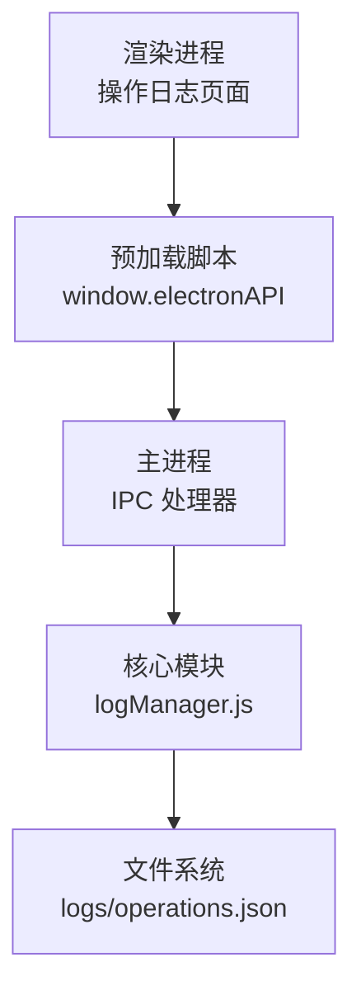
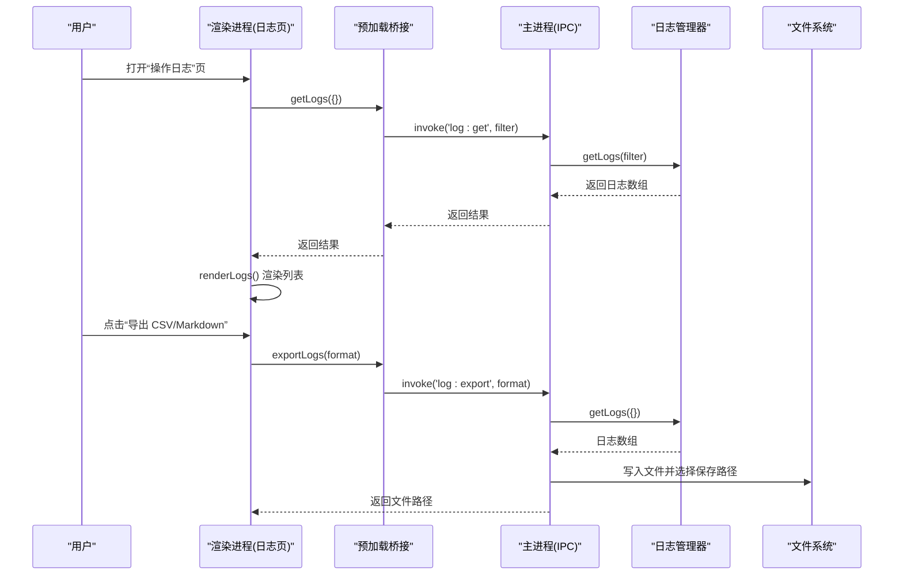
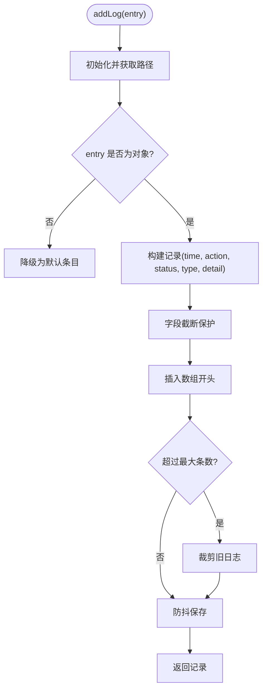
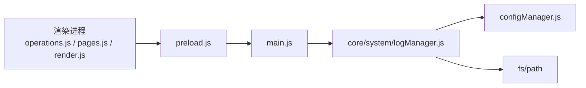

# 日志分析指南

<cite>
**本文引用的文件**   
- [core/system/logManager.js](file://core/system/logManager.js)
- [main.js](file://main.js)
- [preload.js](file://preload.js)
- [renderer/js/operations.js](file://renderer/js/operations.js)
- [renderer/js/pages.js](file://renderer/js/pages.js)
- [renderer/js/render.js](file://renderer/js/render.js)
- [renderer/index.html](file://renderer/index.html)
</cite>

## 目录
1. [简介](#简介)
2. [项目结构](#项目结构)
3. [核心组件](#核心组件)
4. [架构总览](#架构总览)
5. [详细组件分析](#详细组件分析)
6. [依赖关系分析](#依赖关系分析)
7. [性能与容量控制](#性能与容量控制)
8. [故障排查指南](#故障排查指南)
9. [结论](#结论)
10. [附录：字段与格式说明](#附录字段与格式说明)

## 简介
本指南面向 PyLibMaster 的用户与维护者，系统性地说明如何查看与分析应用的操作日志。内容涵盖日志文件的存储位置、数据结构与字段含义、筛选技巧（按类型、关键词）、交互式查询界面使用方法、常见错误模式识别与诊断步骤，以及日志导出与分享方法，帮助快速定位问题并高效反馈给技术支持。

## 项目结构
PyLibMaster 的日志功能由主进程、预加载桥接层与渲染进程三部分协作完成：
- 主进程负责持久化存储与导出能力
- 预加载脚本提供安全 IPC 接口
- 渲染进程提供交互界面与实时刷新

图表来源
- [main.js:397-414](file://main.js#L397-L414)
- [preload.js:88-111](file://preload.js#L88-L111)
- [core/system/logManager.js:1-173](file://core/system/logManager.js#L1-L173)

章节来源
- [main.js:397-414](file://main.js#L397-L414)
- [preload.js:88-111](file://preload.js#L88-L111)
- [core/system/logManager.js:1-173](file://core/system/logManager.js#L1-L173)

## 核心组件
- 日志管理器（logManager）：负责日志写入、查询、清空、防抖保存与容量控制
- 主进程 IPC：暴露 log:get / log:clear / log:add / log:export 等接口
- 预加载桥接：将渲染进程调用映射到主进程 IPC
- 渲染进程：提供日志页 UI、筛选与导出按钮、数据刷新与渲染

章节来源
- [core/system/logManager.js:1-173](file://core/system/logManager.js#L1-L173)
- [main.js:397-414](file://main.js#L397-L414)
- [preload.js:88-111](file://preload.js#L88-L111)
- [renderer/js/operations.js:416-419](file://renderer/js/operations.js#L416-L419)
- [renderer/js/pages.js:320-349](file://renderer/js/pages.js#L320-L349)
- [renderer/js/render.js:378-411](file://renderer/js/render.js#L378-L411)
- [renderer/index.html:621-645](file://renderer/index.html#L621-L645)

## 架构总览
日志从业务操作产生，经主进程记录到磁盘；前端通过 IPC 读取并展示，支持筛选与导出。

图表来源
- [main.js:397-414](file://main.js#L397-L414)
- [main.js:482-514](file://main.js#L482-L514)
- [preload.js:88-111](file://preload.js#L88-L111)
- [core/system/logManager.js:143-159](file://core/system/logManager.js#L143-L159)

章节来源
- [main.js:397-414](file://main.js#L397-L414)
- [main.js:482-514](file://main.js#L482-L514)
- [preload.js:88-111](file://preload.js#L88-L111)
- [core/system/logManager.js:143-159](file://core/system/logManager.js#L143-L159)

## 详细组件分析

### 日志管理器（logManager）
- 职责
  - 记录安装/卸载/更新/系统事件
  - 持久化到 JSON 文件
  - 支持按类型与关键词筛选
  - 容量控制与字段截断保护
- 关键实现要点
  - 存储位置：{storagePath}/logs/operations.json
  - 最大条数：2000 条，超出裁剪旧日志
  - 字段长度限制：单字段最大 1000 字符，超长自动截断
  - 搜索关键词上限：200 字符
  - 写入策略：300ms 防抖，退出前 flush 确保落盘
- 数据结构
  - time：时间戳（YYYY-MM-DD HH:mm:ss）
  - action：操作描述
  - status：状态（ok/failed）
  - type：类型（install/uninstall/update/system）
  - detail：详细信息
- 主要函数
  - addLog(entry)：新增日志并持久化
  - getLogs(filter)：按 type 与 search 筛选
  - clearLogs()：清空并保存
  - flushLogs()：立即同步保存

图表来源
- [core/system/logManager.js:112-131](file://core/system/logManager.js#L112-L131)
- [core/system/logManager.js:32-35](file://core/system/logManager.js#L32-L35)
- [core/system/logManager.js:72-83](file://core/system/logManager.js#L72-L83)

章节来源
- [core/system/logManager.js:1-173](file://core/system/logManager.js#L1-L173)

### 主进程 IPC 处理器（日志相关）
- 暴露接口
  - log:get(filter)：获取日志列表
  - log:clear()：清空日志
  - log:add(entry)：添加一条日志
  - log:export(format)：导出为 CSV 或 Markdown
- 行为说明
  - 导出时调用 getLogs({}) 获取全部日志，生成对应格式并通过系统对话框保存

章节来源
- [main.js:397-414](file://main.js#L397-L414)
- [main.js:482-514](file://main.js#L482-L514)

### 预加载桥接（preload）
- 作用
  - 将 window.electronAPI.getLogs/clearLogs/addLog/exportLogs 映射到 IPC
- 关键点
  - 使用 contextBridge 暴露 API，避免渲染进程直接访问 Node 能力
  - 统一封装 IPC 调用，保证安全隔离

章节来源
- [preload.js:88-111](file://preload.js#L88-L111)

### 渲染进程（日志页交互与渲染）
- 数据刷新
  - refreshLogs()：调用 api.getLogs({}) 拉取日志
- 界面渲染
  - renderLogs()：根据类型筛选与关键词过滤，渲染条目列表
- 导出与清空
  - exportLogs(format)：调用 api.exportLogs(format) 触发导出
  - clearLogs()：调用 api.clearLogs() 清空并刷新

章节来源
- [renderer/js/operations.js:416-419](file://renderer/js/operations.js#L416-L419)
- [renderer/js/render.js:378-411](file://renderer/js/render.js#L378-L411)
- [renderer/js/pages.js:320-349](file://renderer/js/pages.js#L320-L349)
- [renderer/index.html:621-645](file://renderer/index.html#L621-L645)

## 依赖关系分析
- 模块耦合
  - 渲染进程依赖 preload 暴露的 API
  - 主进程依赖 logManager 进行日志读写
  - logManager 依赖配置管理获取 storagePath
- 外部依赖
  - fs 与 path 用于文件读写与路径拼接
  - Electron IPC 用于跨进程通信

图表来源
- [renderer/js/operations.js:416-419](file://renderer/js/operations.js#L416-L419)
- [renderer/js/pages.js:320-349](file://renderer/js/pages.js#L320-L349)
- [renderer/js/render.js:378-411](file://renderer/js/render.js#L378-L411)
- [preload.js:88-111](file://preload.js#L88-L111)
- [main.js:397-414](file://main.js#L397-L414)
- [core/system/logManager.js:1-173](file://core/system/logManager.js#L1-L173)

章节来源
- [renderer/js/operations.js:416-419](file://renderer/js/operations.js#L416-L419)
- [renderer/js/pages.js:320-349](file://renderer/js/pages.js#L320-L349)
- [renderer/js/render.js:378-411](file://renderer/js/render.js#L378-L411)
- [preload.js:88-111](file://preload.js#L88-L111)
- [main.js:397-414](file://main.js#L397-L414)
- [core/system/logManager.js:1-173](file://core/system/logManager.js#L1-L173)

## 性能与容量控制
- 写入防抖：300ms 内多次写入合并一次，降低 I/O 压力
- 容量限制：最多保留 2000 条，超出则裁剪最旧记录
- 字段截断：单字段最长 1000 字符，防止日志膨胀
- 搜索限制：关键词最长 200 字符，避免过长匹配影响性能
- 退出保障：应用退出前强制 flush，确保数据不丢失

章节来源
- [core/system/logManager.js:19-22](file://core/system/logManager.js#L19-L22)
- [core/system/logManager.js:72-83](file://core/system/logManager.js#L72-L83)
- [core/system/logManager.js:112-131](file://core/system/logManager.js#L112-L131)
- [core/system/logManager.js:143-159](file://core/system/logManager.js#L143-L159)
- [main.js:161-170](file://main.js#L161-L170)

## 故障排查指南
- 常见问题与定位
  - 日志未显示：检查是否成功调用 refreshLogs()；确认渲染逻辑 renderLogs() 已执行
  - 导出失败：确认 log:export 流程是否被触发；检查保存对话框返回值与文件写入权限
  - 日志缺失：关注应用退出前是否调用 flushLogs()；检查磁盘空间与路径权限
- 诊断步骤
  - 在“操作日志”页点击“刷新”，观察列表是否更新
  - 使用“类型筛选”与“关键词搜索”缩小范围，验证筛选逻辑
  - 尝试导出 CSV/Markdown，确认文件生成与内容完整性
  - 若仍异常，检查 {storagePath}/logs/operations.json 是否存在且可读
- 常见错误模式
  - 大量写入导致卡顿：由防抖机制缓解，必要时减少高频操作
  - 字段过长被截断：detail/action 超长将被截断，注意关键信息不要放在超长文本中
  - 搜索无结果：确认关键词是否在 action/detail 字段中，且不超过 200 字符

章节来源
- [renderer/js/operations.js:416-419](file://renderer/js/operations.js#L416-L419)
- [renderer/js/render.js:378-411](file://renderer/js/render.js#L378-L411)
- [renderer/js/pages.js:320-349](file://renderer/js/pages.js#L320-L349)
- [core/system/logManager.js:112-131](file://core/system/logManager.js#L112-L131)
- [core/system/logManager.js:143-159](file://core/system/logManager.js#L143-L159)
- [main.js:482-514](file://main.js#L482-L514)

## 结论
PyLibMaster 的日志系统以简洁可靠的 JSON 文件为核心，配合 IPC 与前端交互，实现了高效的记录、查询与导出能力。通过合理的容量控制与写入优化，保障了稳定性与性能。遵循本指南可快速定位问题、有效分析问题根因，并便捷地导出日志用于支持与反馈。

## 附录：字段与格式说明
- 存储位置
  - 路径：{storagePath}/logs/operations.json
- 字段定义
  - time：时间戳（YYYY-MM-DD HH:mm:ss）
  - action：操作描述
  - status：状态（ok/failed）
  - type：类型（install/uninstall/update/system）
  - detail：详细信息
- 筛选技巧
  - 按类型：install / uninstall / update / system
  - 按关键词：匹配 action 与 detail（不区分大小写），最长 200 字符
- 导出格式
  - CSV：包含 Time, Type, Status, Action, Detail
  - Markdown：表格形式，便于阅读与分享
- 交互界面
  - 类型筛选下拉框
  - 关键词搜索输入框
  - 导出 CSV/Markdown 按钮
  - 清空日志按钮

章节来源
- [core/system/logManager.js:11-13](file://core/system/logManager.js#L11-L13)
- [core/system/logManager.js:112-131](file://core/system/logManager.js#L112-L131)
- [core/system/logManager.js:143-159](file://core/system/logManager.js#L143-L159)
- [main.js:482-514](file://main.js#L482-L514)
- [renderer/index.html:621-645](file://renderer/index.html#L621-L645)
- [renderer/js/render.js:378-411](file://renderer/js/render.js#L378-L411)
- [renderer/js/pages.js:320-349](file://renderer/js/pages.js#L320-L349)