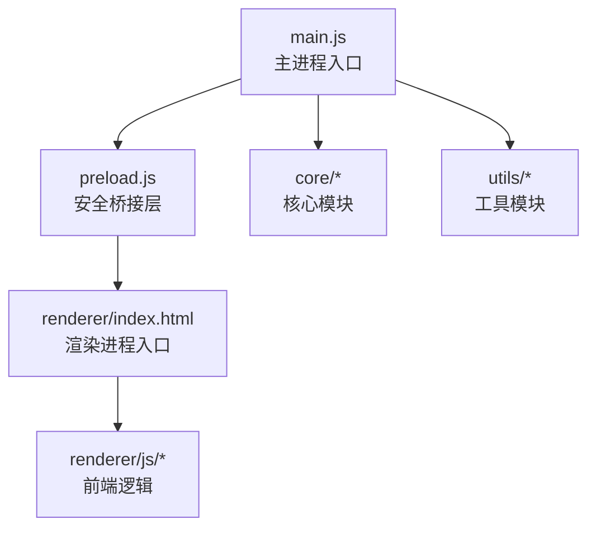
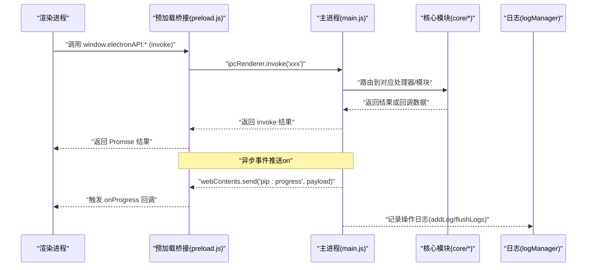
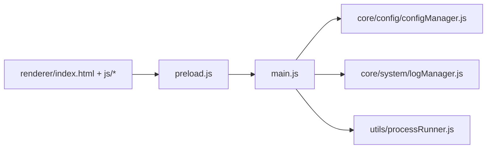

# 调试工具与技巧

<cite>
**本文引用的文件**   
- [main.js](file://main.js)
- [preload.js](file://preload.js)
- [package.json](file://package.json)
- [renderer/index.html](file://renderer/index.html)
- [core/system/logManager.js](file://core/system/logManager.js)
- [core/config/configManager.js](file://core/config/configManager.js)
- [utils/processRunner.js](file://utils/processRunner.js)
- [renderer/js/app.js](file://renderer/js/app.js)
- [renderer/js/core.js](file://renderer/js/core.js)
</cite>

## 目录
1. [简介](#简介)
2. [项目结构](#项目结构)
3. [核心组件](#核心组件)
4. [架构总览](#架构总览)
5. [详细组件分析](#详细组件分析)
6. [依赖关系分析](#依赖关系分析)
7. [性能考量](#性能考量)
8. [故障排查指南](#故障排查指南)
9. [结论](#结论)
10. [附录](#附录)

## 简介
本指南面向 PyLibMaster 的开发者与维护者，系统化介绍内置调试能力与外部调试工具使用方法，覆盖：
- 如何启用开发者模式、查看控制台输出
- 使用 Electron DevTools 进行前端调试
- 主进程与渲染进程的调试方法（含 IPC 通信、事件监听）
- Node.js 常用调试技巧与工具链配置
- 远程调试与日志收集的高级方法

## 项目结构
PyLibMaster 基于 Electron 构建，采用“主进程 + 预加载桥接 + 渲染进程”的经典架构。关键入口与职责如下：
- main.js：Electron 主进程入口，负责窗口管理、IPC 处理器注册、应用生命周期协调
- preload.js：安全桥接层，通过 contextBridge 暴露 window.electronAPI 给渲染进程
- renderer/index.html：渲染进程 HTML 入口，组织页面结构与脚本加载顺序
- core/*：核心业务模块（配置、日志、环境、包管理等）
- utils/*：通用工具（子进程运行器、安全校验等）

图表来源
- [main.js:1-150](file://main.js#L1-L150)
- [preload.js:1-60](file://preload.js#L1-L60)
- [renderer/index.html:1-30](file://renderer/index.html#L1-L30)

章节来源
- [main.js:1-150](file://main.js#L1-L150)
- [preload.js:1-60](file://preload.js#L1-L60)
- [renderer/index.html:1-30](file://renderer/index.html#L1-L30)

## 核心组件
- 主进程（main.js）
  - 创建与管理 BrowserWindow，设置 webPreferences（contextIsolation、nodeIntegration、sandbox）
  - 注册大量 ipcMain.handle 处理器，统一转发到各核心模块
  - 应用生命周期钩子（ready-to-show、window-all-closed、before-quit）
- 预加载桥接（preload.js）
  - 通过 contextBridge.exposeInMainWorld 暴露 window.electronAPI
  - 封装所有 IPC 调用（invoke/on），并集中处理事件监听（如 pip:progress、updater:*、theme:changed）
- 渲染进程（renderer/index.html + js/*）
  - 通过 window.electronAPI 调用主进程能力
  - 绑定 UI 事件，发起操作请求，订阅进度与更新事件
- 日志系统（core/system/logManager.js）
  - 持久化操作日志（JSON），支持筛选、清空、导出
  - 提供 flushLogs 用于退出前强制落盘
- 配置系统（core/config/configManager.js）
  - 读写 pylibmaster-config.json，带值域校验与原子写入
- 子进程运行器（utils/processRunner.js）
  - 封装 spawn，支持超时、取消、ANSI 清理、UTF-8 编码、pip 自动安装

章节来源
- [main.js:1-200](file://main.js#L1-L200)
- [preload.js:1-120](file://preload.js#L1-L120)
- [renderer/index.html:1-30](file://renderer/index.html#L1-L30)
- [core/system/logManager.js:1-100](file://core/system/logManager.js#L1-L100)
- [core/config/configManager.js:1-120](file://core/config/configManager.js#L1-L120)
- [utils/processRunner.js:1-120](file://utils/processRunner.js#L1-L120)

## 架构总览
下图展示主进程、预加载桥接与渲染进程之间的交互关系，以及 IPC 通道与事件流。

图表来源
- [main.js:230-420](file://main.js#L230-L420)
- [preload.js:120-220](file://preload.js#L120-L220)
- [core/system/logManager.js:100-173](file://core/system/logManager.js#L100-L173)

## 详细组件分析

### 主进程调试要点（main.js）
- 启动与窗口
  - createWindow 中设置 webPreferences，确保上下文隔离与安全的 Node 集成策略
  - ready-to-show 后显示窗口，避免白屏闪烁
- IPC 处理器
  - 大量 ipcMain.handle 定义，建议按功能分组定位（窗口控制、环境、虚拟环境、包操作、备份、镜像、日志、配置、更新、系统、通知、调度器、模板/快照、审计、磁盘空间、离线下载、requirements 对比、版本历史、依赖图谱、撤销、资源管理器）
- 生命周期
  - before-quit 中取消活跃子进程并刷新日志，保证数据一致性

调试建议
- 在 main.js 中使用 console.log/warn/error 打印关键路径（例如退出时取消进程计数、路径访问拦截警告）
- 通过 Electron 命令行参数 --inspect=端口 开启主进程调试

章节来源
- [main.js:40-120](file://main.js#L40-L120)
- [main.js:150-170](file://main.js#L150-L170)
- [main.js:230-420](file://main.js#L230-L420)
- [main.js:440-470](file://main.js#L440-L470)

### 预加载桥接与事件监听（preload.js）
- 暴露 API
  - 将主进程能力以 window.electronAPI 形式暴露给渲染进程
- 事件监听
  - 对 pip:progress、updater:*、theme:changed、scheduler:executed、updates:available 等进行统一监听与转发
- 去重与清理
  - 每次绑定前移除旧监听器，避免重复触发

调试建议
- 在浏览器控制台直接调用 window.electronAPI 方法，验证 IPC 是否可达
- 使用 onProgress 回调观察 pip 操作的实时输出

章节来源
- [preload.js:1-120](file://preload.js#L1-L120)
- [preload.js:120-220](file://preload.js#L120-L220)

### 渲染进程调试（renderer/index.html + js/*）
- 入口与加载顺序
  - index.html 声明 CSP，依次加载 i18n、core、render、progress、operations、pages、app
- 全局状态与工具
  - core.js 提供 api 引用、全局变量、Toast、操作 ID 生成等
- 初始化流程
  - app.js 中并行加载配置、环境、镜像、缓存库，再后台刷新完整列表与可更新列表

调试建议
- 在浏览器控制台查看 console.error 输出（如 loadConfig failed、refreshInstalled failed）
- 通过快捷键 Ctrl+F 聚焦搜索框，Ctrl+1~9 切换页面，Esc 关闭弹窗

章节来源
- [renderer/index.html:1-30](file://renderer/index.html#L1-L30)
- [renderer/js/core.js:1-93](file://renderer/js/core.js#L1-L93)
- [renderer/js/app.js:1-120](file://renderer/js/app.js#L1-L120)
- [renderer/js/app.js:120-210](file://renderer/js/app.js#L120-L210)

### 日志系统（core/system/logManager.js）
- 存储与容量
  - 默认最多 2000 条，字段长度限制，防抖写入（300ms）
- 查询与导出
  - 支持类型筛选与关键词搜索；提供 flushLogs 在退出前同步落盘
- 错误降级
  - 保存失败时输出到 stderr，避免死循环

调试建议
- 在 before-quit 阶段调用 flushLogs，确保日志不丢失
- 通过 log:get 接口获取日志，结合过滤器快速定位问题

章节来源
- [core/system/logManager.js:1-100](file://core/system/logManager.js#L1-L100)
- [core/system/logManager.js:100-173](file://core/system/logManager.js#L100-L173)

### 配置系统（core/config/configManager.js）
- 默认值与校验
  - parallelThreads、retryCount 有范围限制，越界自动修正
- 原子写入
  - 先写临时文件再重命名，防止崩溃导致配置文件损坏
- 路径管理
  - 基于 Electron userData 目录，兼容多平台

调试建议
- 检查 pylibmaster-config.json 内容是否正确合并默认值
- 批量 setBulk 减少磁盘写入次数

章节来源
- [core/config/configManager.js:1-120](file://core/config/configManager.js#L1-L120)
- [core/config/configManager.js:120-194](file://core/config/configManager.js#L120-L194)

### 子进程运行器（utils/processRunner.js）
- 命令执行
  - 封装 spawn，支持超时、SIGTERM/SIGKILL 两级终止、ANSI 清理、UTF-8 编码
- 进程跟踪
  - activeProcesses 维护活跃进程，支持按 processId 或 operationId 取消
- pip 就绪检测
  - 优先缓存，其次 ensurepip，最后 get-pip.py 下载安装

调试建议
- 在 runCommand 的 onOutput 回调中打印 stdout/stderr，便于定位 pip 输出
- 使用 cancelOperation 取消一次 pip 操作的所有子进程

章节来源
- [utils/processRunner.js:1-120](file://utils/processRunner.js#L1-L120)
- [utils/processRunner.js:120-220](file://utils/processRunner.js#L120-L220)
- [utils/processRunner.js:220-332](file://utils/processRunner.js#L220-L332)
- [utils/processRunner.js:332-366](file://utils/processRunner.js#L332-L366)

## 依赖关系分析
- 主进程依赖核心模块与工具模块，通过 IPC 暴露能力
- 预加载桥接依赖 electron 的 contextBridge 与 ipcRenderer
- 渲染进程依赖 window.electronAPI 与全局状态
- 日志与配置模块被多处引用，需保证健壮性与幂等性

图表来源
- [main.js:1-60](file://main.js#L1-L60)
- [preload.js:1-40](file://preload.js#L1-L40)
- [renderer/index.html:1-30](file://renderer/index.html#L1-L30)

章节来源
- [main.js:1-60](file://main.js#L1-L60)
- [preload.js:1-40](file://preload.js#L1-L40)
- [renderer/index.html:1-30](file://renderer/index.html#L1-L30)

## 性能考量
- 启动优化
  - 渲染进程分阶段加载：Phase1 快速显示缓存数据，Phase2 后台刷新完整列表，Phase3 懒加载可更新列表
- 日志写入
  - 防抖写入减少频繁 I/O，退出前强制 flush
- 子进程管理
  - 超时与两级终止避免僵尸进程；ANSI 清理降低字符串处理开销
- 配置写入
  - 原子写入避免损坏；批量更新减少磁盘 IO

[本节为通用指导，无需特定文件引用]

## 故障排查指南
- 主进程控制台输出
  - 使用 Electron 启动参数 --inspect=端口 打开 Chrome DevTools 调试主进程
  - 关注 main.js 中的 console.warn/console.log（如路径访问拦截、退出时取消进程计数）
- 渲染进程控制台输出
  - 打开 DevTools 的 Console 面板，查看 console.error 输出（如 loadConfig failed、refreshInstalled failed）
- IPC 通信调试
  - 在浏览器控制台调用 window.electronAPI 方法，确认 invoke 是否成功
  - 监听 pip:progress 事件，观察进度与输出
- 日志与配置
  - 检查 logs/operations.json 是否存在且格式正确
  - 检查 pylibmaster-config.json 是否包含必要项（parallelThreads、retryCount 等）
- 子进程与 pip
  - 若 pip 不可用，查看 ensurePip 流程是否成功（ensurepip 或 get-pip.py）
  - 使用 cancelOperation 取消卡住的 pip 操作

章节来源
- [main.js:150-170](file://main.js#L150-L170)
- [main.js:440-470](file://main.js#L440-L470)
- [core/system/logManager.js:70-100](file://core/system/logManager.js#L70-L100)
- [core/config/configManager.js:120-160](file://core/config/configManager.js#L120-L160)
- [utils/processRunner.js:220-332](file://utils/processRunner.js#L220-L332)
- [renderer/js/app.js:130-210](file://renderer/js/app.js#L130-L210)

## 结论
通过合理运用 Electron DevTools、Node.js 调试器与内置日志/配置系统，可以高效定位主进程、渲染进程与 IPC 通信问题。结合子进程运行器的超时与取消机制，能有效提升稳定性与可维护性。

[本节为总结性内容，无需特定文件引用]

## 附录

### 启用开发者模式与查看控制台输出
- 启动方式
  - 使用 npm start（electron .）启动应用
  - 添加 --inspect=端口 参数以启用主进程调试（例如：npm start -- --inspect=9229）
- 打开 DevTools
  - 在主进程中通过 mainWindow.webContents.openDevTools() 打开渲染进程 DevTools（开发时可临时启用）
- 查看控制台输出
  - 主进程：Chrome DevTools 的 Sources/Console
  - 渲染进程：浏览器 DevTools 的 Console

章节来源
- [package.json:9-15](file://package.json#L9-L15)
- [main.js:40-70](file://main.js#L40-L70)

### 使用 Electron DevTools 进行前端调试
- 打开 DevTools
  - 快捷键 Ctrl+Shift+I（Windows/Linux）或 Cmd+Option+I（macOS）
- 断点与单步
  - 在 renderer/js/*.js 中设置断点，逐步执行，观察变量与 DOM 状态
- 网络与事件
  - 使用 Network 面板监控 HTTP 请求（如 PyPI API）
  - 使用 Event Listener Breakpoints 监听 pip:progress、updater:* 等事件

章节来源
- [renderer/index.html:1-30](file://renderer/index.html#L1-L30)
- [preload.js:120-220](file://preload.js#L120-L220)

### 主进程与渲染进程调试方法
- 主进程调试
  - 使用 --inspect 参数启动，连接 Chrome DevTools
  - 在 main.js 中打断点，检查 IPC 处理器与生命周期钩子
- 渲染进程调试
  - 使用浏览器 DevTools 调试 JS、CSS、HTML
  - 通过 window.electronAPI 调用主进程能力，验证 IPC 行为
- IPC 通信调试
  - 在 preload.js 中监听 onProgress、onUpdater* 等事件，观察数据流
  - 在 main.js 中检查 ipcMain.handle 的参数与返回值

章节来源
- [main.js:230-420](file://main.js#L230-L420)
- [preload.js:120-220](file://preload.js#L120-L220)
- [renderer/js/app.js:80-120](file://renderer/js/app.js#L80-L120)

### Node.js 调试技巧与工具链配置
- VS Code 配置
  - 使用 Node.js 调试器附加到 Electron 主进程（--inspect）
  - 配置 launch.json 以同时调试主进程与渲染进程
- 常用命令
  - node --inspect-brk 启动并等待调试器连接
  - chrome://inspect 查看已连接的 Electron 实例
- 日志与性能
  - 使用 console.time/timeEnd 测量关键路径耗时
  - 结合日志系统（logManager）与配置（configManager）定位问题

章节来源
- [package.json:9-15](file://package.json#L9-L15)
- [core/system/logManager.js:1-100](file://core/system/logManager.js#L1-L100)
- [core/config/configManager.js:1-120](file://core/config/configManager.js#L1-L120)

### 远程调试与日志收集高级方法
- 远程调试
  - 使用 --remote-debugging-port=端口 启动 Electron，允许远程连接 DevTools
  - 在生产环境中谨慎启用，确保安全策略（CSP、权限控制）
- 日志收集
  - 定期导出 logs/operations.json（CSV/Markdown）
  - 在 before-quit 中调用 flushLogs，确保日志完整
- 环境变量与编码
  - 设置 PYTHONIOENCODING=utf-8、PYTHONUTF8=1，避免中文乱码

章节来源
- [main.js:150-170](file://main.js#L150-L170)
- [core/system/logManager.js:100-173](file://core/system/logManager.js#L100-L173)
- [utils/processRunner.js:80-120](file://utils/processRunner.js#L80-L120)