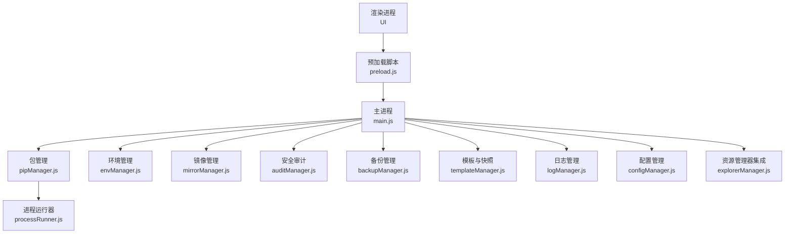
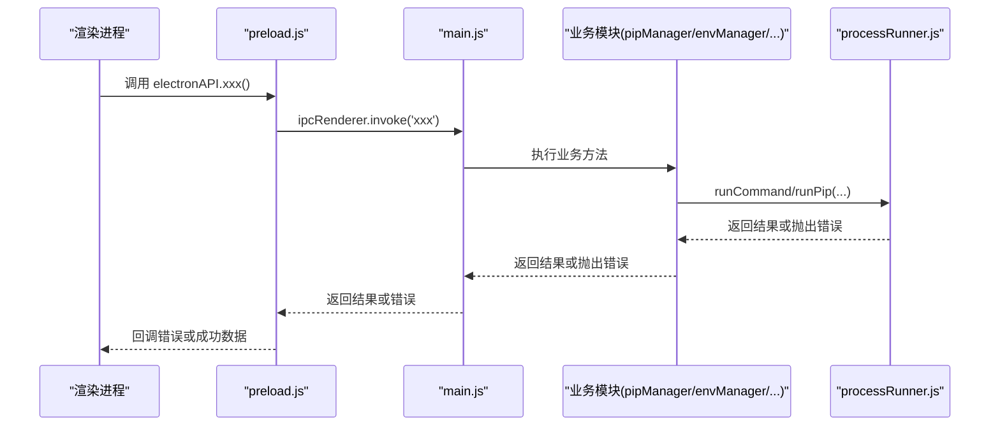
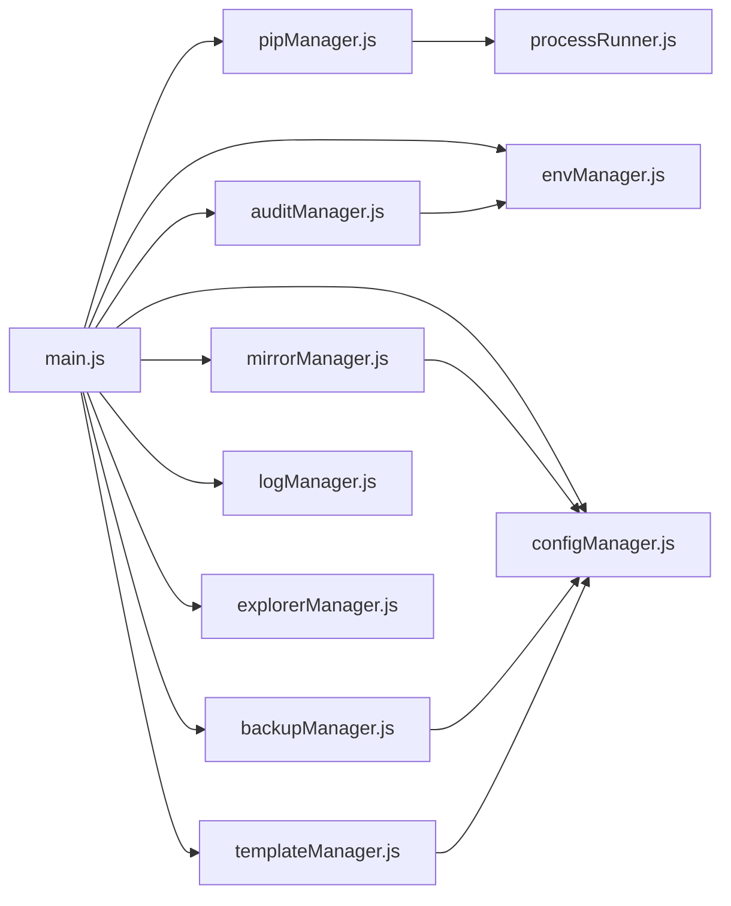

# 错误代码参考

<cite>
**本文引用的文件**   
- [main.js](file://main.js)
- [preload.js](file://preload.js)
- [pipManager.js](file://core/operations/pipManager.js)
- [processRunner.js](file://utils/processRunner.js)
- [envManager.js](file://core/system/envManager.js)
- [mirrorManager.js](file://core/config/mirrorManager.js)
- [auditManager.js](file://core/operations/auditManager.js)
- [backupManager.js](file://core/operations/backupManager.js)
- [templateManager.js](file://core/operations/templateManager.js)
- [logManager.js](file://core/system/logManager.js)
- [configManager.js](file://core/config/configManager.js)
- [explorerManager.js](file://core/system/explorerManager.js)
</cite>

## 目录
1. [简介](#简介)
2. [项目结构](#项目结构)
3. [核心组件](#核心组件)
4. [架构总览](#架构总览)
5. [详细组件分析](#详细组件分析)
6. [依赖关系分析](#依赖关系分析)
7. [性能与稳定性考量](#性能与稳定性考量)
8. [故障排查指南](#故障排查指南)
9. [结论](#结论)
10. [附录：快速查找表与批量处理](#附录快速查找表与批量处理)

## 简介
本文件为 PyLibMaster 的“错误代码参考”，汇总系统级、Python 环境、网络、文件操作等常见错误类型，给出触发条件、影响范围与解决方法。同时提供开发环境下启用详细错误输出与调试模式的方法，以及错误代码的快速查找表和批量处理方法，帮助开发者与用户高效定位与解决问题。

## 项目结构
PyLibMaster 采用 Electron 主进程 + 渲染进程架构，核心业务模块位于 core 目录，工具与桥接层位于 utils 与 preload.js，日志与配置由 system 与 config 子模块管理。错误来源主要分布在以下位置：
- 主进程 IPC 处理器（main.js）
- 预加载桥接（preload.js）
- 包管理与执行器（pipManager.js、processRunner.js）
- Python 环境检测（envManager.js）
- 镜像源管理（mirrorManager.js）
- 安全审计（auditManager.js）
- 备份与快照（backupManager.js、templateManager.js）
- 日志与配置（logManager.js、configManager.js）
- Windows 资源管理器集成（explorerManager.js）

图表来源
- [main.js:1-120](file://main.js#L1-L120)
- [preload.js:1-60](file://preload.js#L1-L60)
- [pipManager.js:1-120](file://core/operations/pipManager.js#L1-L120)
- [processRunner.js:1-120](file://utils/processRunner.js#L1-L120)
- [envManager.js:1-60](file://core/system/envManager.js#L1-L60)
- [mirrorManager.js:1-60](file://core/config/mirrorManager.js#L1-L60)
- [auditManager.js:1-60](file://core/operations/auditManager.js#L1-L60)
- [backupManager.js:1-60](file://core/operations/backupManager.js#L1-L60)
- [templateManager.js:1-60](file://core/operations/templateManager.js#L1-L60)
- [logManager.js:1-60](file://core/system/logManager.js#L1-L60)
- [configManager.js:1-60](file://core/config/configManager.js#L1-L60)
- [explorerManager.js:1-60](file://core/system/explorerManager.js#L1-L60)

章节来源
- [main.js:1-120](file://main.js#L1-L120)
- [preload.js:1-60](file://preload.js#L1-L60)

## 核心组件
- 包管理器（pipManager.js）：负责包的查询、安装、卸载、更新、依赖树、导出导入、对比差异、下载离线包、版本历史、全局依赖图谱等；内置包名/版本校验、wheel 路径安全检查、环境互斥锁、自动回滚与重试。
- 进程运行器（processRunner.js）：封装子进程创建、超时、取消、清理、ANSI 清理、UTF-8 编码、pip 就绪检测与自动安装、按 operationId 批量取消。
- 环境管理（envManager.js）：检测系统中 Python 环境、获取版本信息、切换当前环境并持久化。
- 镜像管理（mirrorManager.js）：内置与自定义镜像源维护、测速、智能路由、写入 pip 配置文件。
- 安全审计（auditManager.js）：自动安装与调用 pip-audit，解析 JSON 结果，生成修复建议与统计摘要。
- 备份与快照（backupManager.js、templateManager.js）：基于 pip freeze 的备份恢复、从模板一键创建环境与安装包、快照创建与恢复。
- 日志与配置（logManager.js、configManager.js）：结构化日志持久化、容量控制、字段截断；配置读写、默认值与范围校验、原子写入。
- 资源管理器集成（explorerManager.js）：Windows 右键菜单注册/注销。

章节来源
- [pipManager.js:1-220](file://core/operations/pipManager.js#L1-L220)
- [processRunner.js:1-120](file://utils/processRunner.js#L1-L120)
- [envManager.js:1-120](file://core/system/envManager.js#L1-L120)
- [mirrorManager.js:1-120](file://core/config/mirrorManager.js#L1-L120)
- [auditManager.js:1-120](file://core/operations/auditManager.js#L1-L120)
- [backupManager.js:1-120](file://core/operations/backupManager.js#L1-L120)
- [templateManager.js:1-120](file://core/operations/templateManager.js#L1-L120)
- [logManager.js:1-120](file://core/system/logManager.js#L1-L120)
- [configManager.js:1-120](file://core/config/configManager.js#L1-L120)
- [explorerManager.js:1-120](file://core/system/explorerManager.js#L1-L120)

## 架构总览
错误传播路径通常遵循：
- 渲染进程通过 preload.js 暴露的 API 调用主进程 IPC 处理器（main.js）。
- 主进程将请求转发到具体业务模块（如 pipManager.js、envManager.js 等）。
- 业务模块通过 processRunner.js 执行系统命令或 Python 命令，捕获异常并向上抛出。
- 错误最终被上层 try/catch 捕获，记录日志并通过事件或返回值反馈给前端。

图表来源
- [preload.js:1-120](file://preload.js#L1-L120)
- [main.js:230-420](file://main.js#L230-L420)
- [pipManager.js:470-620](file://core/operations/pipManager.js#L470-L620)
- [processRunner.js:80-160](file://utils/processRunner.js#L80-L160)

## 详细组件分析

### 系统级错误
- 描述：应用生命周期、窗口控制、主题同步、托盘、通知、自动更新调度器等系统功能抛出的错误。
- 典型触发条件：
  - 窗口状态异常（最大化时保存尺寸被忽略）、主题监听失败、通知不可用、更新检查失败。
- 影响范围：界面交互、系统托盘行为、通知展示、自动更新提示。
- 解决方法：
  - 检查 Electron 原生能力是否可用（Notification.isSupported）。
  - 在 before-quit 中确保取消活跃进程并刷新日志。
  - 对可能失败的异步操作使用静默失败或降级策略。

章节来源
- [main.js:120-220](file://main.js#L120-L220)
- [main.js:460-520](file://main.js#L460-L520)

### Python 环境错误
- 描述：未选择 Python 环境、环境不存在、pip 不可用或无法自动安装。
- 典型触发条件：
  - 调用 listInstalled/listOutdated/installPackages/uninstallPackages/updatePackages 前未设置 currentEnv。
  - ensurePip 检测失败且自动安装失败。
- 影响范围：所有包操作均会失败。
- 解决方法：
  - 先调用 detectEnvironments 并 switchEnvironment 选择有效环境。
  - 若 ensurePip 失败，手动安装 pip（python -m ensurepip 或 get-pip.py）。

章节来源
- [envManager.js:150-220](file://core/system/envManager.js#L150-L220)
- [pipManager.js:380-440](file://core/operations/pipManager.js#L380-L440)
- [processRunner.js:230-280](file://utils/processRunner.js#L230-L280)

### 网络错误
- 描述：镜像源测试失败、下载 get-pip.py 失败、pip index versions 不可用、HTTP 响应非 200。
- 典型触发条件：
  - testMirrorSpeed 返回 9999（超时或失败）。
  - downloadGetPip 多源尝试后仍失败。
  - searchPackage 使用 pip index versions 失败。
- 影响范围：镜像测速、自动安装 pip、包搜索。
- 解决方法：
  - 更换镜像源或关闭智能路由。
  - 检查网络连通性与代理设置。
  - 对于 searchPackage，接受空结果或错误消息作为降级。

章节来源
- [mirrorManager.js:210-280](file://core/config/mirrorManager.js#L210-L280)
- [processRunner.js:280-330](file://utils/processRunner.js#L280-L330)
- [pipManager.js:450-470](file://core/operations/pipManager.js#L450-L470)

### 文件操作错误
- 描述：备份 ID 不合法、备份文件不存在、wheel 路径非法、requirements.txt 不支持的类型、日志/配置写入失败。
- 典型触发条件：
  - validateBackupId 校验失败（包含路径遍历字符、格式不符）。
  - restoreBackup 找不到备份文件。
  - installFromFile 传入 .whl 或 .txt 以外的扩展名。
  - logManager.saveLogs 或 configManager.saveConfig 写入失败。
- 影响范围：备份恢复、离线安装、日志与配置持久化。
- 解决方法：
  - 严格校验输入（ID、路径、扩展名）。
  - 确保存储目录存在且有写权限。
  - 对写入失败进行降级与重试。

章节来源
- [backupManager.js:60-120](file://core/operations/backupManager.js#L60-L120)
- [backupManager.js:150-196](file://core/operations/backupManager.js#L150-L196)
- [pipManager.js:620-712](file://core/operations/pipManager.js#L620-L712)
- [logManager.js:70-100](file://core/system/logManager.js#L70-L100)
- [configManager.js:120-140](file://core/config/configManager.js#L120-L140)

### 包名与版本校验错误
- 描述：包名长度超限、包名格式非法、版本号或版本范围非法。
- 典型触发条件：
  - buildPackageSpec 校验失败。
  - uninstallPackages/updatePackages 参数校验失败。
- 影响范围：安装、卸载、更新流程中断。
- 解决方法：
  - 使用正则校验后的包名与版本规格。
  - 限制最大长度与字符集。

章节来源
- [pipManager.js:130-220](file://core/operations/pipManager.js#L130-L220)
- [pipManager.js:720-800](file://core/operations/pipManager.js#L720-L800)

### 安全漏洞扫描错误
- 描述：pip-audit 未安装或安装失败、JSON 解析失败、扫描结果缓存失效。
- 典型触发条件：
  - ensurePipAudit 安装失败。
  - runCommand 返回非零退出码但 stdout 非 JSON。
- 影响范围：安全审计结果不可用。
- 解决方法：
  - 手动安装 pip-audit。
  - 检查 pip-audit 版本与输出格式兼容性。

章节来源
- [auditManager.js:30-120](file://core/operations/auditManager.js#L30-L120)

### Windows 资源管理器集成错误
- 描述：仅支持 Windows 平台、注册表写入失败。
- 典型触发条件：
  - enableContextMenu/disableContextMenu 在非 Windows 平台调用。
  - reg 命令执行失败（权限不足或路径问题）。
- 影响范围：右键菜单不可用。
- 解决方法：
  - 仅在 Windows 平台启用。
  - 以管理员权限或检查注册表路径。

章节来源
- [explorerManager.js:50-100](file://core/system/explorerManager.js#L50-L100)

## 依赖关系分析
- main.js 集中注册 IPC 处理器，依赖各业务模块。
- pipManager.js 依赖 processRunner.js、mirrorManager.js、backupManager.js、logManager.js、envManager.js。
- processRunner.js 是底层执行器，被多个模块复用。
- mirrorManager.js 依赖 configManager.js 与 processRunner.js。
- auditManager.js 依赖 envManager.js 与 processRunner.js。
- backupManager.js 与 templateManager.js 依赖 configManager.js、logManager.js、processRunner.js。
- explorerManager.js 依赖 logManager.js 与系统命令。

图表来源
- [main.js:1-120](file://main.js#L1-L120)
- [pipManager.js:1-60](file://core/operations/pipManager.js#L1-L60)
- [processRunner.js:1-60](file://utils/processRunner.js#L1-L60)
- [mirrorManager.js:1-60](file://core/config/mirrorManager.js#L1-L60)
- [auditManager.js:1-60](file://core/operations/auditManager.js#L1-L60)
- [backupManager.js:1-60](file://core/operations/backupManager.js#L1-L60)
- [templateManager.js:1-60](file://core/operations/templateManager.js#L1-L60)
- [logManager.js:1-60](file://core/system/logManager.js#L1-L60)
- [configManager.js:1-60](file://core/config/configManager.js#L1-L60)
- [explorerManager.js:1-60](file://core/system/explorerManager.js#L1-L60)

章节来源
- [main.js:1-120](file://main.js#L1-L120)

## 性能与稳定性考量
- 并发与互斥：pipManager.js 使用环境级互斥锁避免同一环境并发冲突；并行安装线程数受配置限制。
- 缓存机制：已安装包列表缓存（5分钟）、site-packages 路径缓存（30秒）、pip 就绪状态缓存（5分钟）、审计结果缓存（10分钟）。
- 超时与终止：processRunner.js 统一超时控制，SIGTERM 后延迟 SIGKILL；支持按 operationId 批量取消。
- I/O 防抖：logManager.js 写入防抖 300ms；configManager.js 原子写入避免损坏。
- 建议：
  - 合理设置 parallelThreads 与 retryCount。
  - 大任务分批次执行，避免长时间阻塞。
  - 监控 activeProcesses 数量，防止资源泄漏。

章节来源
- [pipManager.js:60-120](file://core/operations/pipManager.js#L60-L120)
- [processRunner.js:150-210](file://utils/processRunner.js#L150-L210)
- [logManager.js:70-100](file://core/system/logManager.js#L70-L100)
- [configManager.js:120-140](file://core/config/configManager.js#L120-L140)

## 故障排查指南
- 启用详细错误输出与调试模式：
  - 在 processRunner.js 的 onOutput 回调中打印 stderr/stdout，便于观察命令执行过程。
  - 在 main.js 的 IPC 处理器中捕获异常并记录日志。
  - 使用 logManager.addLog 记录关键步骤与错误详情。
- 常见问题定位：
  - 未选择环境：检查 envManager.getCurrent() 是否为空。
  - pip 不可用：查看 ensurePip 日志，确认 ensurepip 或 get-pip.py 是否成功。
  - 镜像源失败：使用 mirrorManager.testAllMirrors 测速，切换默认源。
  - 备份/快照失败：校验 ID 与文件存在性，检查存储目录权限。
  - 审计失败：确认 pip-audit 已安装且输出为 JSON。
- 批量处理方法：
  - 使用 cancelOperation(operationId) 取消一次操作的所有子进程。
  - 使用 cancelAllProcesses() 在应用退出时清理所有活跃进程。
  - 对批量安装/卸载/更新，开启 rollback 自动回滚，失败时恢复到备份。

章节来源
- [processRunner.js:160-210](file://utils/processRunner.js#L160-L210)
- [main.js:150-170](file://main.js#L150-L170)
- [pipManager.js:500-580](file://core/operations/pipManager.js#L500-L580)
- [backupManager.js:150-196](file://core/operations/backupManager.js#L150-L196)
- [auditManager.js:60-120](file://core/operations/auditManager.js#L60-L120)

## 结论
PyLibMaster 的错误处理覆盖系统、环境、网络、文件、安全等多个层面，具备完善的校验、缓存、重试与回滚机制。通过本文档的快速查找表与批量处理方法，可显著提升问题定位与解决效率。建议在开发环境中启用详细日志与调试输出，结合日志导出功能进行持续优化。

## 附录：快速查找表与批量处理

### 快速查找表（按类别）
- 系统级错误
  - 通知不可用：检查 Notification.isSupported()
  - 更新检查失败：静默失败或降级提示
  - 托盘/主题同步：监听 nativeTheme 事件
- Python 环境错误
  - 未选择环境：调用 detectEnvironments 并 switchEnvironment
  - pip 不可用：ensurePip 自动安装，失败则手动安装
- 网络错误
  - 镜像测速失败：testAllMirrors 切换默认源
  - get-pip.py 下载失败：多源尝试，检查网络
  - pip index versions 不可用：searchPackage 返回空结果
- 文件操作错误
  - 备份 ID 非法：validateBackupId 校验
  - 备份文件不存在：restoreBackup 前检查存在性
  - wheel 路径非法：buildPackageSpec 校验
  - 日志/配置写入失败：原子写入与降级
- 包名与版本错误
  - 包名/版本格式非法：正则校验与长度限制
- 安全审计错误
  - pip-audit 未安装：ensurePipAudit 自动安装
  - JSON 解析失败：兼容新旧格式
- Windows 资源管理器集成错误
  - 非 Windows 平台：仅支持 Windows
  - 注册表写入失败：权限与路径检查

### 批量处理方法
- 取消操作：cancelOperation(operationId)
- 清理进程：cancelAllProcesses()
- 自动回滚：installPackages/updatePackages/uninstallPackages 开启 rollback
- 日志导出：exportLogs(format) 导出 CSV 或 Markdown
- 镜像测速：testAllMirrors() 并行测速并排序

章节来源
- [main.js:480-520](file://main.js#L480-L520)
- [processRunner.js:180-210](file://utils/processRunner.js#L180-L210)
- [pipManager.js:500-580](file://core/operations/pipManager.js#L500-L580)
- [mirrorManager.js:240-280](file://core/config/mirrorManager.js#L240-L280)
- [backupManager.js:150-196](file://core/operations/backupManager.js#L150-L196)
- [auditManager.js:60-120](file://core/operations/auditManager.js#L60-L120)
- [explorerManager.js:50-100](file://core/system/explorerManager.js#L50-L100)