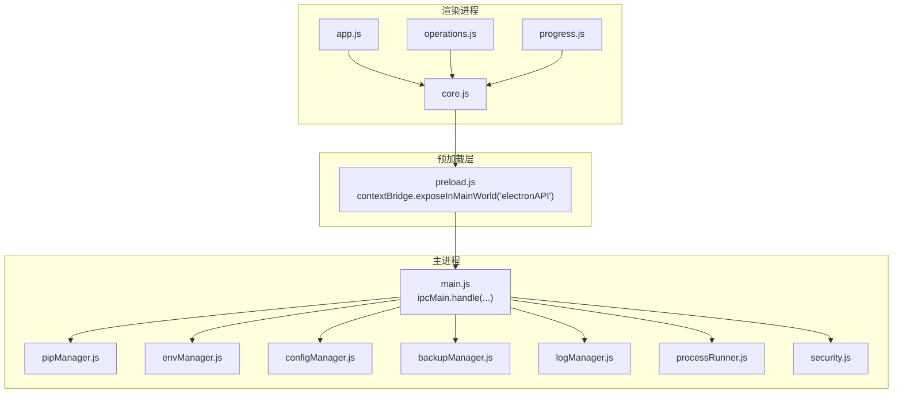
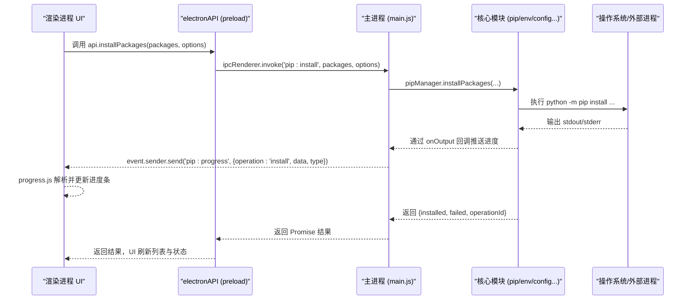
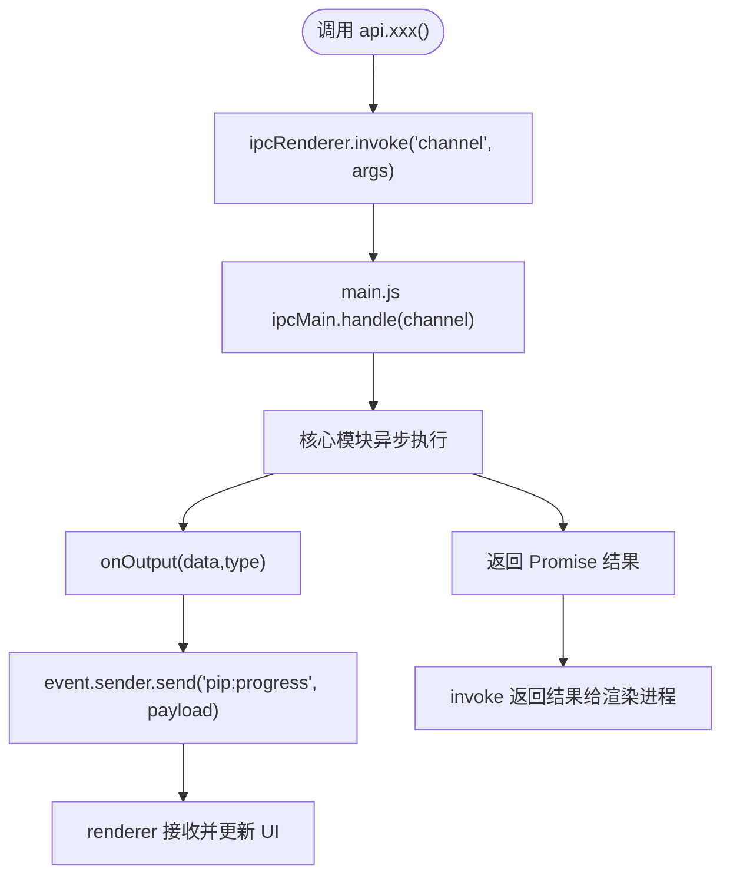
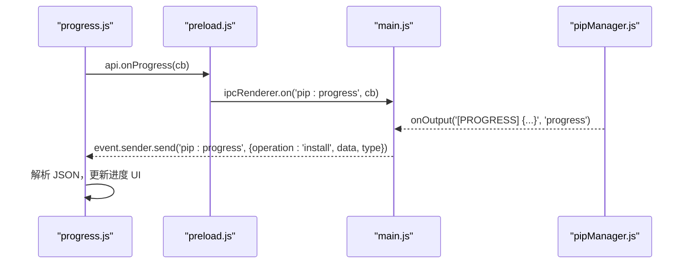
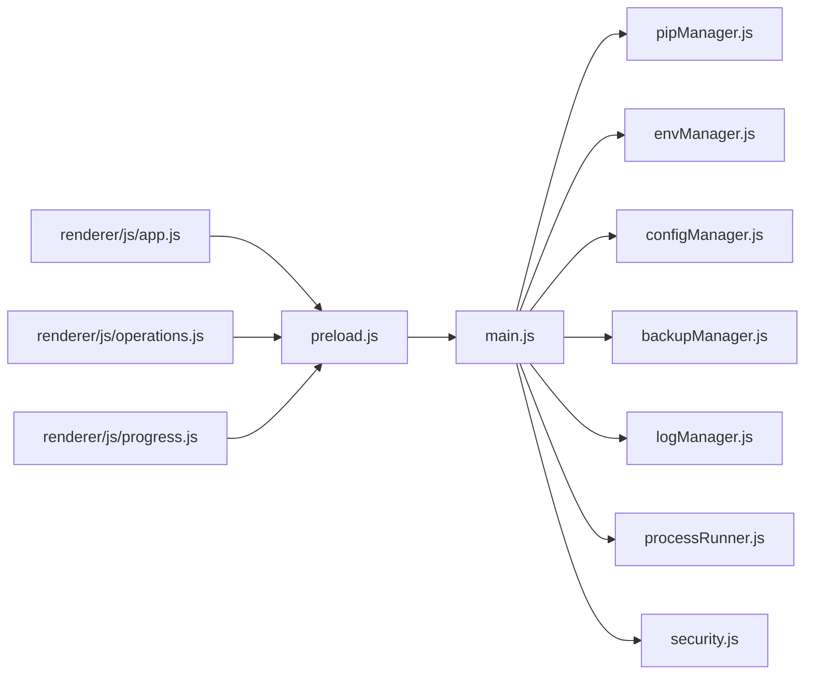

# IPC 通信机制

<cite>
**本文引用的文件**   
- [main.js](file://main.js)
- [preload.js](file://preload.js)
- [renderer/js/app.js](file://renderer/js/app.js)
- [renderer/js/core.js](file://renderer/js/core.js)
- [renderer/js/operations.js](file://renderer/js/operations.js)
- [renderer/js/progress.js](file://renderer/js/progress.js)
- [utils/processRunner.js](file://utils/processRunner.js)
- [utils/security.js](file://utils/security.js)
- [core/operations/pipManager.js](file://core/operations/pipManager.js)
- [core/system/envManager.js](file://core/system/envManager.js)
- [core/config/configManager.js](file://core/config/configManager.js)
- [core/operations/backupManager.js](file://core/operations/backupManager.js)
- [core/system/logManager.js](file://core/system/logManager.js)
</cite>

## 目录
1. [简介](#简介)
2. [项目结构](#项目结构)
3. [核心组件](#核心组件)
4. [架构总览](#架构总览)
5. [详细组件分析](#详细组件分析)
6. [依赖关系分析](#依赖关系分析)
7. [性能考量](#性能考量)
8. [故障排查指南](#故障排查指南)
9. [结论](#结论)
10. [附录：IPC 消息规范与最佳实践](#附录ipc-消息规范与最佳实践)

## 简介
本文件系统性梳理 PyLibMaster 的进程间通信（IPC）机制，重点解释基于 Electron 的 ipcMain.handle() 与 event.sender.send() 的使用模式，覆盖所有已注册的 IPC 处理器类别（窗口控制、包管理、环境管理、配置管理、系统功能等），说明异步处理器的返回值传递机制与事件驱动的实时进度推送（pip:progress）。同时给出安全验证机制（输入参数校验、路径安全检查、命令注入防护）、IPC 消息格式规范、调试技巧与常见问题解决方案。

## 项目结构
- 主进程入口 main.js：创建窗口、注册全部 IPC 处理器、协调各模块初始化与生命周期。
- 预加载脚本 preload.js：通过 contextBridge 暴露安全的 window.electronAPI，将渲染进程调用桥接到主进程 IPC。
- 渲染进程入口 renderer/js/app.js：绑定 UI 事件、启动流程、监听全局事件（主题、更新、调度器执行、进度）。
- 渲染进程工具 renderer/js/core.js：全局状态与通用工具（操作 ID、Toast、国际化）。
- 渲染进程业务 renderer/js/operations.js：安装/卸载/更新等操作编排，发起 IPC 调用并处理结果。
- 渲染进程进度 renderer/js/progress.js：解析 pip:progress 事件，驱动进度条 UI。
- 子进程运行器 utils/processRunner.js：封装 spawn、超时、取消、输出回调、ensurePip。
- 安全工具 utils/security.js：路径白名单校验，防止路径遍历攻击。
- 核心模块 core/*：包管理、环境管理、配置管理、备份、日志等。

**图表来源** 
- [main.js:233-640](file://main.js#L233-L640)
- [preload.js:20-221](file://preload.js#L20-L221)
- [renderer/js/app.js:1-210](file://renderer/js/app.js#L1-L210)
- [renderer/js/core.js:1-93](file://renderer/js/core.js#L1-L93)
- [renderer/js/operations.js:1-536](file://renderer/js/operations.js#L1-L536)
- [renderer/js/progress.js:1-141](file://renderer/js/progress.js#L1-L141)
- [utils/processRunner.js:1-366](file://utils/processRunner.js#L1-L366)
- [utils/security.js:1-43](file://utils/security.js#L1-L43)
- [core/operations/pipManager.js:1-800](file://core/operations/pipManager.js#L1-L800)
- [core/system/envManager.js:1-220](file://core/system/envManager.js#L1-L220)
- [core/config/configManager.js:1-194](file://core/config/configManager.js#L1-L194)
- [core/operations/backupManager.js:1-196](file://core/operations/backupManager.js#L1-L196)
- [core/system/logManager.js:1-173](file://core/system/logManager.js#L1-L173)

**章节来源**
- [main.js:1-210](file://main.js#L1-L210)
- [preload.js:1-221](file://preload.js#L1-L221)
- [renderer/js/app.js:1-210](file://renderer/js/app.js#L1-L210)

## 核心组件
- 主进程 IPC 路由：在 main.js 中集中注册所有 ipcMain.handle() 处理器，按命名空间组织（window:*、env:*、venv:*、pip:*、backup:*、mirror:*、log:*、config:*、system:*、notify:*、theme:*、scheduler:*、template:*、snapshot:*、audit:*、undo:*、explorer:*）。
- 预加载桥接：preload.js 通过 contextBridge.exposeInMainWorld('electronAPI', {...}) 暴露方法，统一使用 ipcRenderer.invoke() 调用主进程处理器，避免渲染进程直接访问 Node API。
- 渲染进程调用：operations.js 等模块通过 api.xxx() 发起请求，并在成功/失败时刷新 UI 或显示提示。
- 事件驱动进度：主进程在处理耗时操作时通过 event.sender.send('pip:progress', payload) 推送结构化进度；渲染进程通过 onProgress(callback) 订阅并更新 UI。

**章节来源**
- [main.js:233-640](file://main.js#L233-L640)
- [preload.js:20-221](file://preload.js#L20-L221)
- [renderer/js/operations.js:1-536](file://renderer/js/operations.js#L1-L536)
- [renderer/js/progress.js:1-141](file://renderer/js/progress.js#L1-L141)

## 架构总览
Electron 应用采用“渲染进程 → 预加载桥接 → 主进程处理器 → 核心模块”的分层架构。渲染进程仅通过 electronAPI 暴露的方法与主进程交互；主进程负责安全校验、权限控制、资源管理与 I/O；核心模块实现具体业务逻辑。

**图表来源** 
- [main.js:311-348](file://main.js#L311-L348)
- [core/operations/pipManager.js:495-578](file://core/operations/pipManager.js#L495-L578)
- [utils/processRunner.js:85-161](file://utils/processRunner.js#L85-L161)
- [renderer/js/progress.js:101-141](file://renderer/js/progress.js#L101-L141)

## 详细组件分析

### 主进程 IPC 处理器分类与职责
- 窗口控制：window:minimize、window:maximize、window:close
- 环境管理：env:detect、env:getCurrent、env:switch
- 虚拟环境：venv:create、venv:list、venv:delete、venv:info
- 包查询：pip:list、pip:listCached、pip:outdated、pip:search、pip:showInfo、pip:depTree、pip:export、pip:import、pip:compareEnvs
- 包操作：pip:install、pip:installFromFile、pip:uninstall、pip:update、pip:cancel、pip:repair、pip:checkConflicts、pip:healthCheck、pip:download、pip:diffRequirements、pip:releases、pip:depGraph、pip:diskUsage
- 备份与回滚：backup:create、backup:list、backup:restore、backup:delete
- 镜像源管理：mirror:list、mirror:test、mirror:testAll、mirror:setDefault、mirror:addCustom、mirror:update、mirror:removeCustom、mirror:restoreDefaults、mirror:smartRoute、mirror:getSmartRoute、mirror:writePipConfig、mirror:reorder
- 日志管理：log:get、log:clear、log:add、log:export
- 配置管理：config:get、config:set、config:setBulk
- 自动更新：updater:check、updater:install
- 系统功能：system:version、system:browseDirectory、system:browseFile、system:openPath
- 桌面通知：notify:send
- 主题同步：theme:getSystem、theme:changed（事件）
- 定时调度：scheduler:getStatus、scheduler:save、scheduler:runNow、scheduler:executed（事件）
- 模板与快照：template:list/add/remove/create、snapshot:create/list/detail/restore/delete
- 安全审计：audit:run、audit:cached
- 撤销操作：undo:canUndo、undo:perform、undo:clear
- Windows 资源管理器集成：explorer:getStatus、explorer:enable、explorer:disable

**章节来源**
- [main.js:233-640](file://main.js#L233-L640)

### 异步处理器返回值传递机制
- 所有 ipcMain.handle() 处理器均返回 Promise 或直接值，由 ipcRenderer.invoke() 等待并返回给渲染进程。
- 耗时操作（如 pip 安装/卸载/更新）通过 onOutput 回调向主进程推送进度，主进程再通过 event.sender.send('pip:progress', payload) 推送至渲染进程。
- 渲染进程通过 api.onProgress(callback) 订阅事件，解析结构化进度数据并更新 UI。

**图表来源** 
- [main.js:311-348](file://main.js#L311-L348)
- [core/operations/pipManager.js:495-578](file://core/operations/pipManager.js#L495-L578)
- [renderer/js/progress.js:101-141](file://renderer/js/progress.js#L101-L141)

**章节来源**
- [main.js:311-348](file://main.js#L311-L348)
- [core/operations/pipManager.js:495-578](file://core/operations/pipManager.js#L495-L578)
- [renderer/js/progress.js:101-141](file://renderer/js/progress.js#L101-L141)

### 事件驱动的实时进度推送（pip:progress）
- 主进程在 pipManager 内部通过 emitProgress() 发送结构化进度事件，格式为 [PROGRESS] {"done":1, "pkg":"xxx", "status":"ok"}。
- 渲染进程 progress.js 解析该事件，更新进度条、百分比、计数与当前包名。
- 对于无结构化进度的操作（如卸载/回滚），从 pip 原始输出推断完成状态。

**图表来源** 
- [core/operations/pipManager.js:61-63](file://core/operations/pipManager.js#L61-L63)
- [renderer/js/progress.js:101-141](file://renderer/js/progress.js#L101-L141)
- [main.js:311-348](file://main.js#L311-L348)

**章节来源**
- [core/operations/pipManager.js:61-63](file://core/operations/pipManager.js#L61-L63)
- [renderer/js/progress.js:101-141](file://renderer/js/progress.js#L101-L141)

### 安全验证机制
- 输入参数校验：
  - 包名校验：正则限制字母、数字、点、短横线、下划线，长度上限。
  - 版本规格校验：限定合法字符集与长度。
  - wheel 文件名校验：禁止 UNC 路径、敏感目录、非法字符，要求绝对路径。
  - 搜索关键词校验：非空、长度限制、包名正则。
- 路径安全检查：
  - system:openPath 使用 isAllowedOpenPath(targetPath, allowedDirs) 白名单校验，仅允许打开文档、下载、用户数据目录下的文件。
  - 备份 ID 校验：validateBackupId(backupId) 严格匹配 backup_*.txt 格式，拒绝路径穿越。
- 命令注入防护：
  - 构建 pip 参数时严格拼接，不拼接用户可控字符串到 shell。
  - runCommand/runPip 使用 child_process.spawn，禁用 shell 执行（除非显式开启）。
  - 对 .whl 路径进行多重检查，阻止恶意路径绕过。

**章节来源**
- [core/operations/pipManager.js:154-217](file://core/operations/pipManager.js#L154-L217)
- [core/operations/pipManager.js:450-472](file://core/operations/pipManager.js#L450-L472)
- [core/operations/backupManager.js:62-78](file://core/operations/backupManager.js#L62-L78)
- [utils/security.js:28-40](file://utils/security.js#L28-L40)
- [main.js:449-466](file://main.js#L449-L466)
- [utils/processRunner.js:85-161](file://utils/processRunner.js#L85-L161)

### 错误处理约定
- 主进程处理器抛出 Error 对象，包含 message 字段；部分错误附加 code、stdout、stderr。
- 渲染进程捕获异常后通过 showToast(msg, type='err') 展示错误信息。
- 日志记录：logManager.addLog({action, status, type, detail}) 持久化操作日志，支持筛选与导出。

**章节来源**
- [core/system/logManager.js:112-131](file://core/system/logManager.js#L112-L131)
- [renderer/js/core.js:58-68](file://renderer/js/core.js#L58-L68)
- [utils/processRunner.js:136-148](file://utils/processRunner.js#L136-L148)

## 依赖关系分析
- 主进程依赖核心模块：pipManager、envManager、configManager、backupManager、logManager、mirrorManager、schedulerManager、templateManager、auditManager、undoManager、explorerManager。
- 预加载层依赖 ipcRenderer 与 contextBridge，暴露 electronAPI。
- 渲染进程依赖 electronAPI 与 i18n，统一管理全局状态与 UI 行为。
- 子进程运行器提供统一的进程执行、超时、取消与输出回调能力。

**图表来源** 
- [main.js:17-31](file://main.js#L17-L31)
- [preload.js:14-221](file://preload.js#L14-L221)
- [renderer/js/app.js:1-210](file://renderer/js/app.js#L1-L210)
- [renderer/js/operations.js:1-536](file://renderer/js/operations.js#L1-L536)
- [renderer/js/progress.js:1-141](file://renderer/js/progress.js#L1-L141)

**章节来源**
- [main.js:17-31](file://main.js#L17-L31)
- [preload.js:14-221](file://preload.js#L14-L221)

## 性能考量
- 缓存策略：
  - 已安装包列表缓存（5分钟 TTL），减少重复扫描。
  - site-packages 路径缓存（30秒 TTL），加速包大小估算。
  - pip 就绪状态缓存（5分钟 TTL），避免重复检测。
- 并发与互斥：
  - 同一 Python 环境的操作通过 acquireEnvLock() 串行执行，避免并发冲突。
  - 批量安装支持并行线程（parallelThreads），提升吞吐。
- I/O 优化：
  - 日志写入防抖（300ms），减少频繁磁盘写入。
  - 配置保存原子写入（临时文件 + rename），避免损坏。
- 网络与超时：
  - 子进程执行设置超时，SIGTERM 后 SIGKILL 强制终止。
  - get-pip.py 多源下载与重定向处理，提高可用性。

**章节来源**
- [core/operations/pipManager.js:89-127](file://core/operations/pipManager.js#L89-L127)
- [core/operations/pipManager.js:226-248](file://core/operations/pipManager.js#L226-L248)
- [utils/processRunner.js:20-26](file://utils/processRunner.js#L20-L26)
- [core/system/logManager.js:72-83](file://core/system/logManager.js#L72-L83)
- [core/config/configManager.js:123-138](file://core/config/configManager.js#L123-L138)
- [utils/processRunner.js:150-159](file://utils/processRunner.js#L150-L159)

## 故障排查指南
- 无法安装/卸载/更新：
  - 检查是否选择了有效的 Python 环境（envManager.getCurrent()）。
  - 确认 pip 可用（ensurePip），必要时手动安装。
  - 查看 logManager 中的操作日志，定位错误详情。
- 进度条不更新：
  - 确认 onProgress 已正确绑定（api.onProgress(updateProgressFromOutput)）。
  - 检查 pip:progress 事件是否被主进程推送（event.sender.send）。
- 路径打开失败：
  - system:openPath 仅允许白名单目录，确保目标路径在允许范围内。
- 备份恢复失败：
  - validateBackupId 校验失败会导致恢复失败，检查备份文件名格式。
- 取消操作无效：
  - 确认 operationId 一致，主进程 cancelOperation 会按 operationId 终止关联进程。

**章节来源**
- [core/system/envManager.js:178-209](file://core/system/envManager.js#L178-L209)
- [utils/processRunner.js:233-278](file://utils/processRunner.js#L233-L278)
- [core/system/logManager.js:143-159](file://core/system/logManager.js#L143-L159)
- [renderer/js/progress.js:101-141](file://renderer/js/progress.js#L101-L141)
- [utils/security.js:28-40](file://utils/security.js#L28-L40)
- [core/operations/backupManager.js:62-78](file://core/operations/backupManager.js#L62-L78)
- [utils/processRunner.js:181-191](file://utils/processRunner.js#L181-L191)

## 结论
PyLibMaster 的 IPC 机制以 Electron 的 ipcMain.handle() 与 event.sender.send() 为核心，结合 preload.js 的安全桥接，实现了渲染进程与主进程的解耦与安全隔离。通过结构化进度事件（pip:progress）与严格的输入校验、路径白名单、命令注入防护，确保了操作的可靠性与安全性。模块化设计使各功能职责清晰，便于扩展与维护。

## 附录：IPC 消息规范与最佳实践

### 请求对象结构
- 窗口控制：无参数或布尔开关
- 环境管理：envPath（字符串）
- 包操作：packages（字符串数组）、options（对象，含 versionMode/version/parallel/retry/rollback/operationId）
- 备份管理：backupId（字符串）
- 镜像源管理：url/name/remark/updates/urlOrder/enabled（字符串/对象/数组）
- 日志管理：filter（对象，type/search）
- 配置管理：key/value 或 updates（对象）
- 系统功能：filters（数组，用于文件选择对话框）

### 响应数据格式
- 包操作：{ installed: [], failed: [], operationId } 或 { uninstalled: [], operationId } 或 { updated: [], failed: [], operationId }
- 环境管理：环境对象或 null
- 备份管理：备份信息对象或列表
- 镜像源管理：镜像列表/测试结果/状态
- 日志管理：日志数组
- 配置管理：配置对象
- 系统功能：版本号/路径/布尔值

### 错误处理约定
- 错误对象包含 message 字段，部分附带 code/stdout/stderr
- 渲染进程捕获后通过 showToast(msg, 'err') 展示
- 操作失败时记录日志，支持导出与分析

### 最佳实践
- 始终使用 electronAPI 暴露的方法，避免直接访问 Node API
- 对长耗时操作启用 operationId，支持取消与跟踪
- 合理设置超时与重试策略，提升鲁棒性
- 使用结构化进度事件，确保 UI 反馈准确
- 遵循安全校验规则，防止路径遍历与命令注入

**章节来源**
- [main.js:233-640](file://main.js#L233-L640)
- [core/operations/pipManager.js:495-578](file://core/operations/pipManager.js#L495-L578)
- [core/operations/backupManager.js:89-113](file://core/operations/backupManager.js#L89-L113)
- [core/system/logManager.js:112-131](file://core/system/logManager.js#L112-L131)
- [utils/processRunner.js:85-161](file://utils/processRunner.js#L85-L161)
- [renderer/js/core.js:58-68](file://renderer/js/core.js#L58-L68)