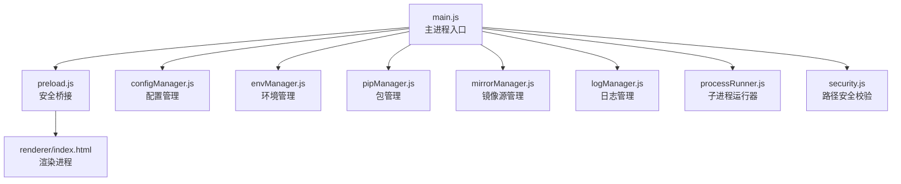
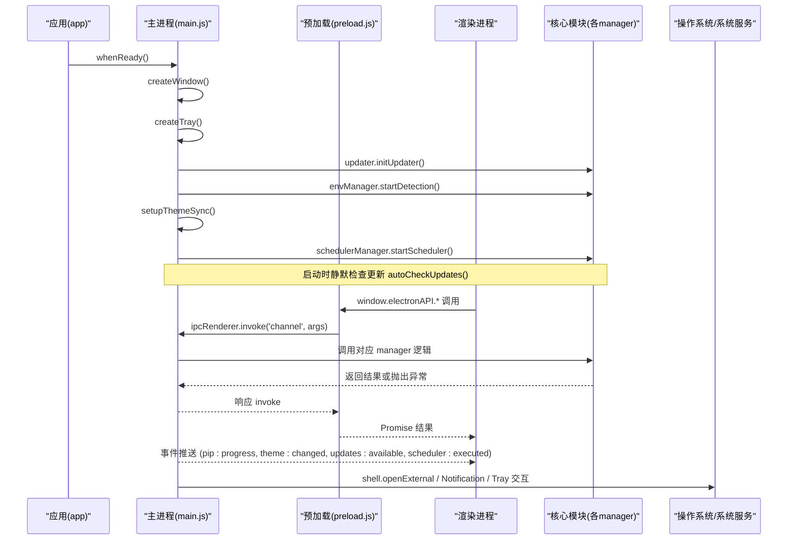
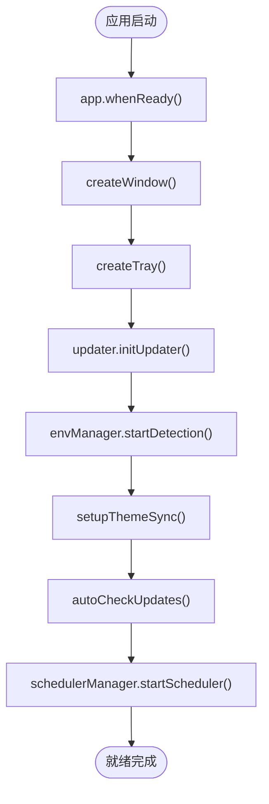
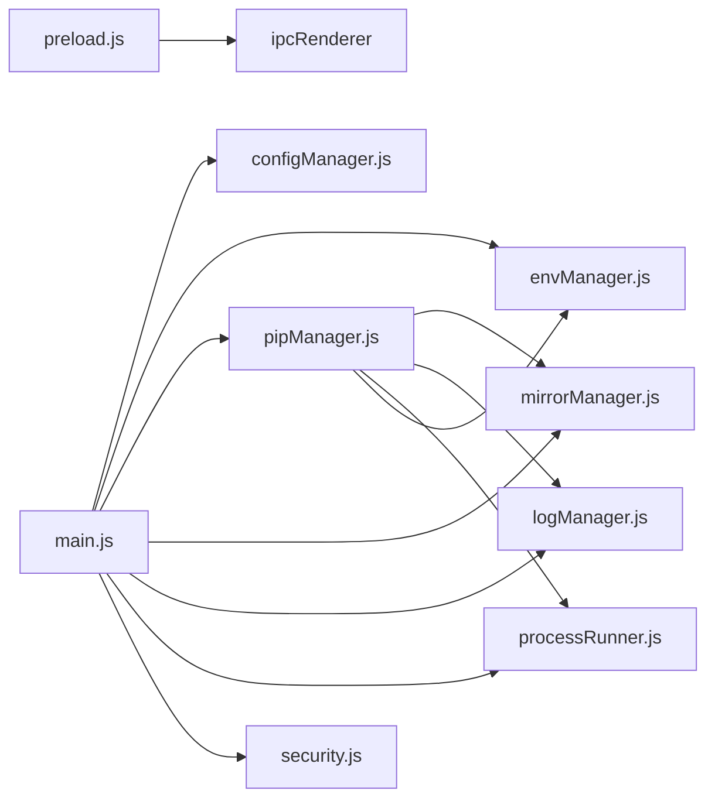

# 主进程架构

<cite>
**本文引用的文件**   
- [main.js](file://main.js)
- [preload.js](file://preload.js)
- [package.json](file://package.json)
- [configManager.js](file://core/config/configManager.js)
- [mirrorManager.js](file://core/config/mirrorManager.js)
- [envManager.js](file://core/system/envManager.js)
- [pipManager.js](file://core/operations/pipManager.js)
- [logManager.js](file://core/system/logManager.js)
- [processRunner.js](file://utils/processRunner.js)
- [security.js](file://utils/security.js)
</cite>

## 目录
1. [简介](#简介)
2. [项目结构](#项目结构)
3. [核心组件](#核心组件)
4. [架构总览](#架构总览)
5. [详细组件分析](#详细组件分析)
6. [依赖关系分析](#依赖关系分析)
7. [性能考量](#性能考量)
8. [故障排查指南](#故障排查指南)
9. [结论](#结论)
10. [附录](#附录)

## 简介
本文件为 PyLibMaster 的主进程架构文档，聚焦 Electron 主进程入口 main.js 的职责与实现，包括窗口管理、IPC 处理器注册、应用生命周期管理；详解 preload.js 安全桥接层的设计原理与 contextBridge 暴露 API 的机制；阐述主进程如何协调 pipManager、envManager、configManager 等核心模块的初始化顺序与依赖关系；并说明窗口状态管理、托盘图标、主题同步等系统级功能的实现细节。同时覆盖主进程与渲染进程的安全通信模型、错误处理与资源清理机制。

## 项目结构
- 入口与配置
  - main.js：Electron 主进程入口，负责窗口创建、IPC 路由、生命周期、系统集成（托盘、主题、通知）等。
  - package.json：应用元数据、打包配置、启动脚本与依赖声明。
- 安全桥接
  - preload.js：通过 contextBridge 将受限 API 暴露给渲染进程，屏蔽 Node 直接访问。
- 核心业务模块
  - core/operations/pipManager.js：包查询、安装、卸载、更新、依赖树、导出导入、离线下载、版本历史、全局依赖图谱等。
  - core/system/envManager.js：Python 环境检测、切换与持久化。
  - core/config/configManager.js：应用配置读写、校验与持久化。
  - core/config/mirrorManager.js：镜像源管理与智能路由。
  - core/system/logManager.js：操作日志记录、筛选、导出与容量控制。
- 工具与系统能力
  - utils/processRunner.js：子进程封装、超时、取消、pip 自动就绪、输出回调与 ANSI 清理。
  - utils/security.js：路径白名单校验，防止路径遍历攻击。

**图表来源** 
- [main.js:1-150](file://main.js#L1-L150)
- [preload.js:1-60](file://preload.js#L1-L60)
- [package.json:1-20](file://package.json#L1-L20)

**章节来源**
- [main.js:1-150](file://main.js#L1-L150)
- [package.json:1-20](file://package.json#L1-L20)

## 核心组件
- 主进程入口 main.js
  - 窗口创建与事件绑定（位置尺寸恢复、最小化/最大化/关闭、外部链接拦截）。
  - IPC 处理器集中注册（window/*、env/*、venv/*、pip/*、backup/*、mirror/*、log/*、config/*、updater/*、system/*、notify/*、scheduler/*、template/*、snapshot/*、audit/*、undo/*、explorer/* 等）。
  - 应用生命周期（whenReady、activate、window-all-closed、before-quit）。
  - 系统集成（托盘菜单、主题跟随系统、自动检查更新、定时调度器）。
- 安全桥接 preload.js
  - 使用 contextBridge.exposeInMainWorld 暴露 electronAPI 对象。
  - 所有方法基于 ipcRenderer.invoke 调用主进程 IPC 通道，禁止渲染进程直接访问 Node。
  - 提供事件监听封装（如 onProgress、onThemeChanged、onUpdater* 等），统一移除旧监听器避免重复绑定。
- 配置管理 configManager.js
  - 默认值合并、数值范围校验与回退、原子写入（临时文件+重命名）、存储路径管理。
- 环境管理 envManager.js
  - 多路径扫描（glob + where python）、并行获取版本信息、缓存当前环境、切换并持久化。
- 包管理 pipManager.js
  - 包名/版本正则校验、site-packages 路径缓存、目录映射与大小估算、并发与互斥锁、备份与回滚、进度事件推送。
- 镜像源管理 mirrorManager.js
  - 内置与自定义镜像合并、测速与智能路由、写入 pip 配置文件、排序与默认源维护。
- 日志管理 logManager.js
  - 防抖写入、字段截断、容量限制、按类型/关键词筛选、导出 CSV/Markdown。
- 子进程运行器 processRunner.js
  - 统一 spawn 封装、UTF-8 编码、ANSI 清理、超时与两级终止、活跃进程跟踪与批量取消、ensurePip 自动安装策略。
- 安全工具 security.js
  - 路径白名单校验，防止路径遍历。

**章节来源**
- [main.js:1-200](file://main.js#L1-L200)
- [preload.js:1-120](file://preload.js#L1-L120)
- [configManager.js:1-120](file://core/config/configManager.js#L1-L120)
- [envManager.js:1-120](file://core/system/envManager.js#L1-L120)
- [pipManager.js:1-120](file://core/operations/pipManager.js#L1-L120)
- [mirrorManager.js:1-120](file://core/config/mirrorManager.js#L1-L120)
- [logManager.js:1-120](file://core/system/logManager.js#L1-L120)
- [processRunner.js:1-120](file://utils/processRunner.js#L1-L120)
- [security.js:1-43](file://utils/security.js#L1-L43)

## 架构总览
主进程作为 Electron 应用的控制中心，承担以下职责：
- 窗口与 UI 生命周期管理
- IPC 路由与权限边界（通过 preload 暴露最小 API）
- 核心模块协调与初始化顺序
- 系统级功能集成（托盘、主题、通知、自动更新、调度器）
- 错误处理与资源清理（进程取消、日志落盘、配置保存）

**图表来源** 
- [main.js:120-210](file://main.js#L120-L210)
- [preload.js:120-220](file://preload.js#L120-L220)

**章节来源**
- [main.js:120-210](file://main.js#L120-L210)
- [preload.js:120-220](file://preload.js#L120-L220)

## 详细组件分析

### 主进程入口 main.js
- 窗口管理
  - 从配置恢复窗口位置与尺寸，设置最小宽高、隐藏原生边框与标题栏、启用上下文隔离与禁用 Node 集成。
  - 拦截新窗口打开，仅允许 http/https 协议并通过系统浏览器打开。
  - resize/move 事件防抖保存窗口状态；close 事件支持“最小化到托盘”行为；closed 事件清理引用。
- 生命周期
  - whenReady：创建窗口、托盘、初始化更新、异步环境检测、主题同步、自动检查更新、启动调度器。
  - activate：macOS Dock 点击重建窗口。
  - window-all-closed：非 macOS 平台退出应用。
  - before-quit：标记退出、取消活跃进程、刷新日志。
- IPC 处理器
  - 窗口控制：minimize/maximize/close。
  - 环境管理：detect/getCurrent/switch。
  - 虚拟环境：create/list/delete/info。
  - 包查询：list/listCached/outdated/search/showInfo/depTree/export/import/compareEnvs。
  - 包操作：install/installFromFile/uninstall/update/cancel/repair/checkConflicts/healthCheck。
  - 备份：create/list/restore/delete。
  - 镜像源：list/test/testAll/setDefault/addCustom/update/removeCustom/restoreDefaults/smartRoute/getSmartRoute/writePipConfig/reorder。
  - 日志：get/clear/add/export。
  - 配置：get/set/setBulk。
  - 自动更新：check/install。
  - 系统功能：version/browseDirectory/browseFile/openPath。
  - 桌面通知：send。
  - 主题：getSystem。
  - 调度器：getStatus/save/runNow。
  - 模板与快照：list/add/remove/create/list/detail/restore/delete。
  - 审计：run/cached。
  - 磁盘空间：diskUsage。
  - 离线下载：download。
  - requirements 对比：diffRequirements。
  - 版本历史：releases。
  - 全局依赖图：depGraph。
  - 撤销：canUndo/perform/clear。
  - Windows 资源管理器集成：getStatus/enable/disable。
- 系统集成
  - 托盘：右键菜单显示主窗口与退出；双击恢复窗口。
  - 主题：监听 nativeTheme.updated，当配置为 system 时推送 theme:changed。
  - 自动检查更新：延迟执行 listOutdated，有更新则推送 updates:available。

**图表来源** 
- [main.js:120-170](file://main.js#L120-L170)

**章节来源**
- [main.js:1-210](file://main.js#L1-L210)

### 安全桥接层 preload.js
- 设计原则
  - 渲染进程不可直接访问 Node 与文件系统，所有能力通过 contextBridge 暴露的最小 API 集合。
  - 所有调用均基于 ipcRenderer.invoke，确保单向请求-响应模型。
  - 事件监听封装统一移除旧监听器，避免内存泄漏与重复触发。
- 暴露的 API 分类
  - 窗口控制、环境管理、虚拟环境、包查询与操作、备份、镜像源、日志、配置、系统功能、通知、主题、调度器、模板与快照、审计、磁盘空间、离线下载、requirements 对比、版本历史、依赖图、健康检查、撤销、Windows 资源管理器集成。
  - 进度事件 onProgress 用于 pip 操作的实时反馈。
  - 自动更新事件 onUpdaterChecking/onUpdaterAvailable/onUpdaterNotAvailable/onUpdaterProgress/onUpdaterDownloaded/onUpdaterError。
- 安全边界
  - 不暴露 ipcRenderer 原始对象，仅暴露封装后的方法。
  - 所有参数由主进程侧进行校验与白名单限制（如 system:openPath 的路径白名单）。

```mermaid
classDiagram
class ElectronAPI {
+windowMinimize()
+windowMaximize()
+windowClose()
+detectEnvironments()
+getCurrentEnv()
+switchEnvironment(envPath)
+createVenv(options)
+listVenvs()
+deleteVenv(name)
+getVenvInfo(name)
+listInstalled()
+listInstalledCached()
+listOutdated()
+searchPackage(keyword)
+showPackageInfo(pkgName)
+getDependencyTree(pkgName)
+exportRequirements(options)
+importRequirements(filePath, options)
+compareEnvironments(envA, envB)
+installPackages(packages, options)
+installFromFile(filePath, options)
+uninstallPackages(packages, options)
+updatePackages(packages, options)
+cancelPipOperation(operationId)
+repairPip(options)
+createBackup()
+listBackups()
+restoreBackup(backupId)
+deleteBackup(backupId)
+getMirrors()
+testMirrorSpeed(url)
+testAllMirrors()
+setDefaultMirror(url)
+addCustomMirror(name, url, remark)
+updateMirror(url, updates)
+removeCustomMirror(url)
+restoreDefaultMirrors()
+setSmartRoute(enabled)
+getSmartRoute()
+writePipMirrorConfig()
+reorderMirrors(urlOrder)
+getLogs(filter)
+clearLogs()
+addLog(entry)
+getConfig()
+setConfig(key, value)
+setConfigBulk(updates)
+getAppVersion()
+browseDirectory()
+browseFile(filters)
+openPath(filePath)
+sendNotification(title, body)
+exportLogs(format)
+getSystemTheme()
+onThemeChanged(callback)
+onUpdatesAvailable(callback)
+getSchedulerStatus()
+saveSchedulerConfig(config)
+runSchedulerNow()
+onSchedulerExecuted(callback)
+getTemplates()
+addCustomTemplate(tpl)
+removeCustomTemplate(id)
+createFromTemplate(options)
+createSnapshot(envPath, label)
+listSnapshots()
+getSnapshotDetail(id)
+restoreSnapshot(snapshotId, envPath)
+deleteSnapshot(id)
+runAudit()
+getCachedAudit()
+getDiskUsage()
+downloadPackages(packages, destDir, options)
+diffRequirements(sourceA, sourceB)
+getPackageReleases(pkgName)
+getDependencyGraph()
+checkConflicts()
+healthCheck()
+canUndo()
+performUndo()
+clearUndo()
+getExplorerStatus()
+enableExplorerMenu()
+disableExplorerMenu()
+onProgress(callback)
+removeProgressListener(callback)
+checkForUpdates()
+installUpdate()
+onUpdaterChecking(callback)
+onUpdaterAvailable(callback)
+onUpdaterNotAvailable(callback)
+onUpdaterProgress(callback)
+onUpdaterDownloaded(callback)
+onUpdaterError(callback)
}
```

**图表来源** 
- [preload.js:20-220](file://preload.js#L20-L220)

**章节来源**
- [preload.js:1-220](file://preload.js#L1-L220)

### 配置管理 configManager.js
- 默认配置项包含主题、语言、存储路径、并行线程数、重试次数、智能路由开关、当前环境、窗口尺寸等。
- 数值配置项具备范围限制与回退值，防止非法输入导致异常。
- 原子写入策略：先写临时文件再重命名，降低崩溃损坏风险。
- 存储路径自动创建，保证后续日志与备份写入成功。

**章节来源**
- [configManager.js:1-194](file://core/config/configManager.js#L1-L194)

### 环境管理 envManager.js
- 检测流程：常见路径 glob 匹配 + PATH 中 where python，并行获取 Python 与 pip 版本，过滤无 pip 的环境。
- 恢复上次选中的环境，若不存在但路径有效则补充信息。
- 切换环境后持久化 currentEnv，支持内存缓存与配置回退。

**章节来源**
- [envManager.js:1-220](file://core/system/envManager.js#L1-L220)

### 包管理 pipManager.js
- 安全校验：包名与版本正则、wheel 路径安全检查（禁止 UNC、敏感目录、非法字符）。
- 性能优化：site-packages 路径缓存、目录映射表构建一次、大小计算带缓存与深度限制。
- 并发与互斥：同一环境操作串行化（acquireEnvLock），避免并发冲突。
- 备份与回滚：安装/卸载前创建备份，失败自动恢复。
- 进度事件：结构化 [PROGRESS] 消息，便于前端可靠计数。
- 多镜像重试：按默认源与镜像列表顺序尝试，支持智能路由。

**章节来源**
- [pipManager.js:1-800](file://core/operations/pipManager.js#L1-L800)

### 镜像源管理 mirrorManager.js
- 内置与自定义镜像合并，确保唯一默认源。
- 测速接口：HEAD numpy 页面，超时 5 秒，失败标记 9999ms。
- 智能路由：开启后选择最快镜像，否则使用用户默认源。
- 写入 pip 配置文件：跨平台路径差异处理，失败时记录日志。

**章节来源**
- [mirrorManager.js:1-376](file://core/config/mirrorManager.js#L1-L376)

### 日志管理 logManager.js
- 防抖写入：300ms 内多次写入合并为一次。
- 容量控制：最多 2000 条，字段截断保护。
- 查询支持：按类型与关键词筛选，搜索长度限制。
- 导出：CSV/Markdown 格式，默认文件名与过滤器。

**章节来源**
- [logManager.js:1-173](file://core/system/logManager.js#L1-L173)

### 子进程运行器 processRunner.js
- 统一 spawn 封装：UTF-8 编码、ANSI 清理、超时与两级终止（SIGTERM→SIGKILL）。
- 活跃进程跟踪：支持按 operationId 批量取消。
- ensurePip 策略：缓存→直接检测→ensurepip→get-pip.py 下载，多源下载与重定向处理。
- runPip/runPython 快捷方法。

**章节来源**
- [processRunner.js:1-366](file://utils/processRunner.js#L1-L366)

### 安全工具 security.js
- 路径白名单校验：解析绝对路径，精确匹配目录或子路径，防止路径遍历。

**章节来源**
- [security.js:1-43](file://utils/security.js#L1-L43)

## 依赖关系分析
- 主进程 main.js 依赖的核心模块与工具：
  - configManager：读取/写入配置（窗口尺寸、存储路径、并行线程、重试次数、智能路由等）。
  - envManager：环境检测与切换，影响 pipManager 的操作目标。
  - pipManager：包管理核心，依赖 mirrorManager、backupManager、logManager、processRunner、envManager。
  - mirrorManager：镜像源配置与写入 pip 配置。
  - logManager：记录操作与系统事件。
  - processRunner：子进程执行、超时、取消、ensurePip。
  - security：路径白名单校验。
- 预加载 preload.js 依赖：
  - ipcRenderer：调用主进程 IPC 通道。
  - contextBridge：暴露 API 到 window.electronAPI。

**图表来源** 
- [main.js:1-120](file://main.js#L1-L120)
- [preload.js:1-60](file://preload.js#L1-L60)
- [pipManager.js:1-60](file://core/operations/pipManager.js#L1-L60)

**章节来源**
- [main.js:1-120](file://main.js#L1-L120)
- [preload.js:1-60](file://preload.js#L1-L60)
- [pipManager.js:1-60](file://core/operations/pipManager.js#L1-L60)

## 性能考量
- 窗口状态保存防抖：resize/move 事件 500ms 防抖，减少频繁写入。
- 已安装包缓存：5 分钟有效期，优先读取缓存，降低 IO 与命令执行开销。
- site-packages 路径缓存：TTL 30 秒，避免重复探测。
- 目录映射与大小计算缓存：避免重复扫描与递归死循环。
- 并行安装与线程数限制：根据配置 parallelThreads 限制并发度。
- 日志写入防抖：300ms 合并写入，降低磁盘压力。
- pip 就绪缓存：5 分钟 TTL，避免重复检测。
- 镜像测速并行：Promise.all 并行测试，提升速度评估效率。

[本节为通用性能建议，不直接分析具体文件]

## 故障排查指南
- 常见问题定位
  - 窗口无法恢复位置/尺寸：检查 configManager 是否可写、窗口事件是否被拦截。
  - 环境检测不到 Python：确认 COMMON_PATHS 与 PATH 环境变量，查看 envManager.detectEnvironments 日志。
  - pip 未安装或不可用：查看 processRunner.ensurePip 日志，确认 ensurepip 与 get-pip.py 下载是否成功。
  - 包安装失败：检查 pipManager.installOne 的多镜像重试日志，确认镜像源可达性与网络状况。
  - 日志丢失：确认 before-quit 阶段 flushLogs 是否执行，检查存储路径权限。
  - 路径打开被拒绝：检查 security.isAllowedOpenPath 白名单配置。
- 错误处理与清理
  - 应用退出前取消所有活跃进程，避免僵尸进程。
  - 配置写入采用原子操作，降低损坏风险。
  - 日志字段截断与容量限制，防止文件过大。

**章节来源**
- [main.js:150-170](file://main.js#L150-L170)
- [processRunner.js:190-210](file://utils/processRunner.js#L190-L210)
- [configManager.js:120-140](file://core/config/configManager.js#L120-L140)
- [logManager.js:80-100](file://core/system/logManager.js#L80-L100)
- [security.js:20-43](file://utils/security.js#L20-L43)

## 结论
PyLibMaster 的主进程架构以 main.js 为核心，结合 preload.js 的安全桥接层，实现了严格的渲染进程隔离与最小 API 暴露。主进程通过集中式 IPC 处理器协调 pipManager、envManager、configManager、mirrorManager、logManager、processRunner 等模块，完成窗口管理、系统集成、包管理与自动化任务。整体设计强调安全性（上下文隔离、路径白名单、正则校验）、可靠性（原子写入、备份回滚、进程取消）、性能（缓存、防抖、并行）与可维护性（模块化、清晰依赖）。

[本节为总结性内容，不直接分析具体文件]

## 附录
- 关键 IPC 通道清单（部分）
  - 窗口控制：window:minimize、window:maximize、window:close
  - 环境管理：env:detect、env:getCurrent、env:switch
  - 虚拟环境：venv:create、venv:list、venv:delete、venv:info
  - 包查询：pip:list、pip:listCached、pip:outdated、pip:search、pip:showInfo、pip:depTree、pip:export、pip:import、pip:compareEnvs
  - 包操作：pip:install、pip:installFromFile、pip:uninstall、pip:update、pip:cancel、pip:repair、pip:checkConflicts、pip:healthCheck
  - 备份：backup:create、backup:list、backup:restore、backup:delete
  - 镜像源：mirror:list、mirror:test、mirror:testAll、mirror:setDefault、mirror:addCustom、mirror:update、mirror:removeCustom、mirror:restoreDefaults、mirror:smartRoute、mirror:getSmartRoute、mirror:writePipConfig、mirror:reorder
  - 日志：log:get、log:clear、log:add、log:export
  - 配置：config:get、config:set、config:setBulk
  - 自动更新：updater:check、updater:install
  - 系统功能：system:version、system:browseDirectory、system:browseFile、system:openPath
  - 通知：notify:send
  - 主题：theme:getSystem
  - 调度器：scheduler:getStatus、scheduler:save、scheduler:runNow
  - 模板与快照：template:list、template:add、template:remove、template:create、snapshot:create、snapshot:list、snapshot:detail、snapshot:restore、snapshot:delete
  - 审计：audit:run、audit:cached
  - 磁盘空间：pip:diskUsage
  - 离线下载：pip:download
  - requirements 对比：pip:diffRequirements
  - 版本历史：pip:releases
  - 全局依赖图：pip:depGraph
  - 撤销：undo:canUndo、undo:perform、undo:clear
  - Windows 资源管理器集成：explorer:getStatus、explorer:enable、explorer:disable

[本节为参考清单，不直接分析具体文件]