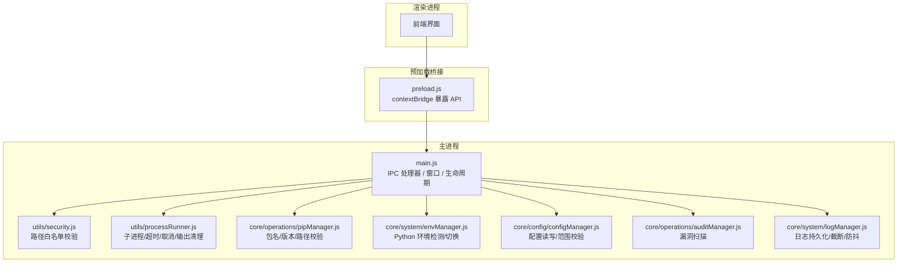
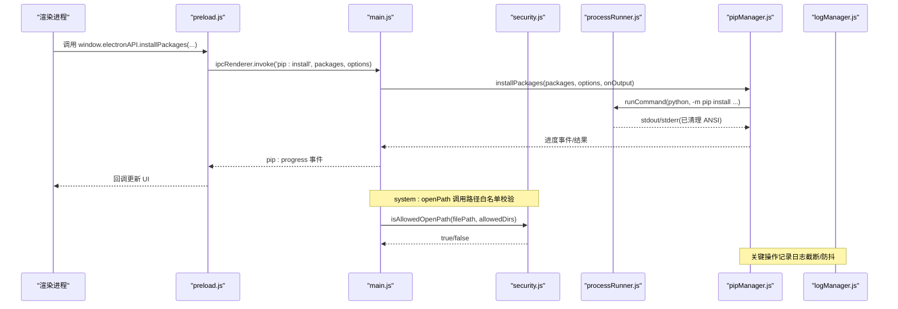
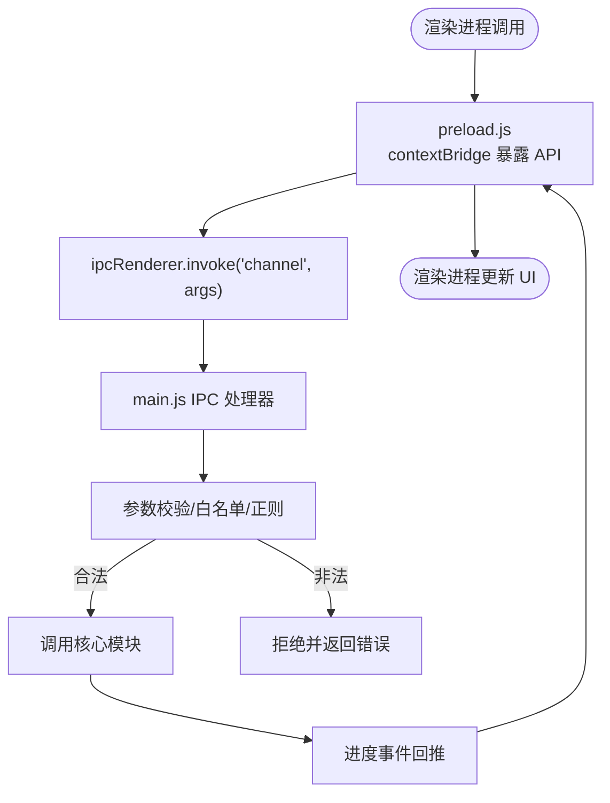
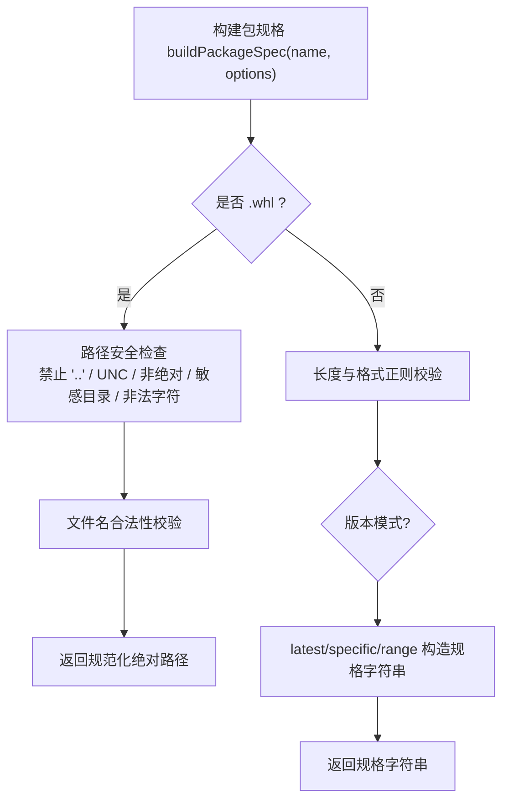
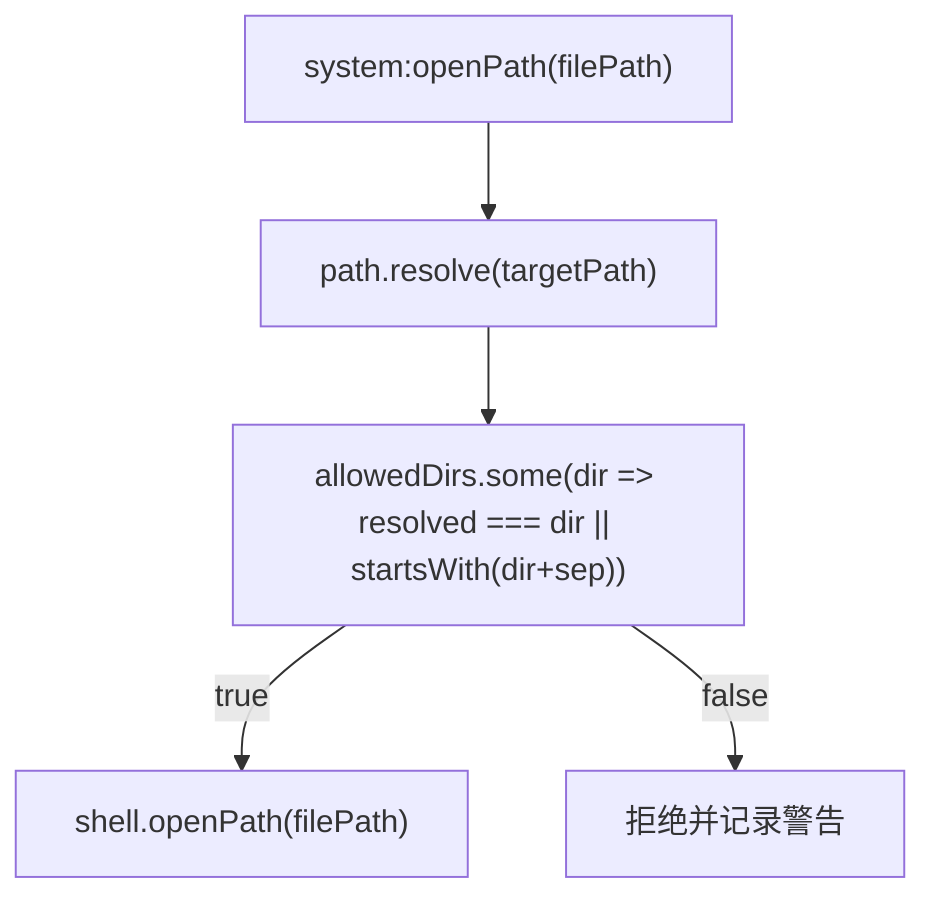
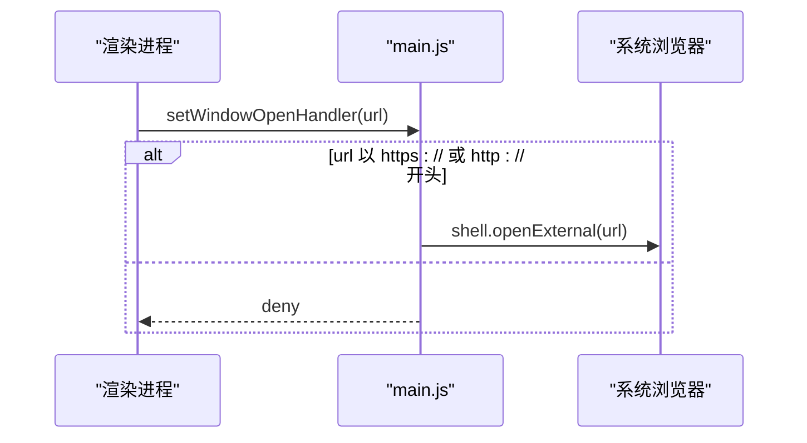
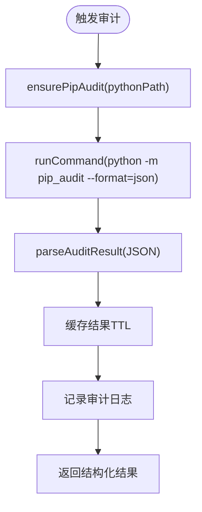
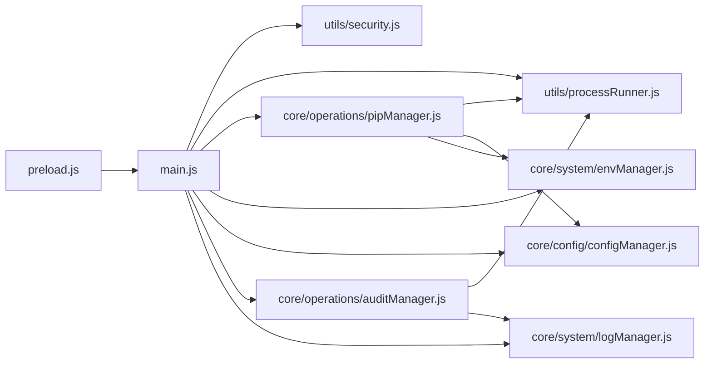

# 安全架构设计

<cite>
**本文引用的文件**   
- [preload.js](file://preload.js)
- [main.js](file://main.js)
- [utils/security.js](file://utils/security.js)
- [utils/processRunner.js](file://utils/processRunner.js)
- [core/operations/pipManager.js](file://core/operations/pipManager.js)
- [core/system/envManager.js](file://core/system/envManager.js)
- [core/config/configManager.js](file://core/config/configManager.js)
- [core/operations/auditManager.js](file://core/operations/auditManager.js)
- [core/system/logManager.js](file://core/system/logManager.js)
- [package.json](file://package.json)
</cite>

## 目录
1. [简介](#简介)
2. [项目结构](#项目结构)
3. [核心组件](#核心组件)
4. [架构总览](#架构总览)
5. [详细组件分析](#详细组件分析)
6. [依赖关系分析](#依赖关系分析)
7. [性能考量](#性能考量)
8. [故障排查指南](#故障排查指南)
9. [结论](#结论)
10. [附录：安全配置与威胁模型](#附录安全配置与威胁模型)

## 简介
本技术文档聚焦 PyLibMaster 的安全架构设计，系统性阐述多层防护机制与实现要点，包括：
- 输入验证、路径遍历防护、命令注入防护
- 权限控制与最小暴露面（contextBridge）
- 文件系统访问白名单与路径规范化
- 命令行执行沙箱（参数校验、环境变量隔离、输出过滤）
- 网络安全措施（HTTPS 强制、证书校验、CORS 策略）
- 安全审计机制（漏洞扫描、依赖检查、安全日志）
并提供可操作的安全配置指南与威胁模型分析。

## 项目结构
PyLibMaster 采用 Electron 主进程 + 预加载桥接 + 渲染进程的分层架构，安全边界清晰：
- 主进程：系统能力与业务逻辑入口，IPC 处理器集中注册
- 预加载脚本：通过 contextBridge 仅暴露必要 API，阻断渲染进程直接访问 Node.js
- 核心模块：包管理、环境管理、镜像源、备份、审计、日志等
- 工具层：进程运行器与安全工具函数



**图表来源** 
- [preload.js:1-221](file://preload.js#L1-L221)
- [main.js:1-640](file://main.js#L1-L640)
- [utils/security.js:1-43](file://utils/security.js#L1-L43)
- [utils/processRunner.js:1-366](file://utils/processRunner.js#L1-L366)
- [core/operations/pipManager.js:1-200](file://core/operations/pipManager.js#L1-L200)
- [core/system/envManager.js:1-200](file://core/system/envManager.js#L1-L200)
- [core/config/configManager.js:1-194](file://core/config/configManager.js#L1-L194)
- [core/operations/auditManager.js:1-200](file://core/operations/auditManager.js#L1-L200)
- [core/system/logManager.js:1-173](file://core/system/logManager.js#L1-L173)

**章节来源**
- [preload.js:1-221](file://preload.js#L1-L221)
- [main.js:1-640](file://main.js#L1-L640)

## 核心组件
- 安全桥接（preload.js）：通过 contextBridge.exposeInMainWorld 仅暴露受控 API，禁止渲染进程直接访问 Node.js 或危险 API。
- IPC 路由（main.js）：集中处理所有 IPC 请求，统一转发到对应业务模块，并在关键路径调用安全校验。
- 路径安全（utils/security.js）：提供 isAllowedOpenPath，基于绝对路径解析与白名单比对，防止路径穿越。
- 进程沙箱（utils/processRunner.js）：封装 spawn，支持超时、SIGTERM/SIGKILL 两级终止、ANSI 输出清理、UTF-8 编码、操作级取消。
- 包管理安全（core/operations/pipManager.js）：包名/版本正则校验、wheel 路径多重校验（禁止 UNC、敏感目录、非法字符）、环境互斥锁。
- 环境管理（core/system/envManager.js）：多源检测 Python 环境，限制在已知路径模式内查找，避免任意路径执行。
- 配置管理（core/config/configManager.js）：数值范围校验与自动修正，原子写入避免损坏。
- 漏洞扫描（core/operations/auditManager.js）：自动安装 pip-audit，JSON 结果解析，严重级别推断与缓存。
- 日志管理（core/system/logManager.js）：字段截断、容量限制、防抖写入、退出前 flush。

**章节来源**
- [preload.js:1-221](file://preload.js#L1-L221)
- [main.js:1-640](file://main.js#L1-L640)
- [utils/security.js:1-43](file://utils/security.js#L1-L43)
- [utils/processRunner.js:1-366](file://utils/processRunner.js#L1-L366)
- [core/operations/pipManager.js:1-200](file://core/operations/pipManager.js#L1-L200)
- [core/system/envManager.js:1-200](file://core/system/envManager.js#L1-L200)
- [core/config/configManager.js:1-194](file://core/config/configManager.js#L1-L194)
- [core/operations/auditManager.js:1-200](file://core/operations/auditManager.js#L1-L200)
- [core/system/logManager.js:1-173](file://core/system/logManager.js#L1-L173)

## 架构总览
下图展示从渲染进程到主进程再到核心模块的调用链，以及安全控制点分布。



**图表来源** 
- [preload.js:1-221](file://preload.js#L1-L221)
- [main.js:1-640](file://main.js#L1-L640)
- [utils/security.js:1-43](file://utils/security.js#L1-L43)
- [utils/processRunner.js:1-366](file://utils/processRunner.js#L1-L366)
- [core/operations/pipManager.js:1-200](file://core/operations/pipManager.js#L1-L200)
- [core/system/logManager.js:1-173](file://core/system/logManager.js#L1-L173)

## 详细组件分析

### 安全桥接与上下文隔离（preload.js）
- 使用 contextBridge.exposeInMainWorld 暴露最小 API 集合，避免渲染进程直接访问 Node.js 或危险 API。
- 所有 IPC 通道以“方法名”形式暴露，参数由主进程严格校验。
- 事件监听采用一次性绑定与移除旧监听器，避免内存泄漏与重复触发。



**图表来源** 
- [preload.js:1-221](file://preload.js#L1-L221)
- [main.js:1-640](file://main.js#L1-L640)

**章节来源**
- [preload.js:1-221](file://preload.js#L1-L221)

### 输入验证与命令注入防护（pipManager.js）
- 包名与版本规格使用严格正则，拒绝非法字符与超长输入。
- wheel 文件路径多重校验：
  - 禁止包含 “..” 组件
  - 禁止 UNC 路径（\\server\share）
  - 必须为绝对路径
  - 禁止 Windows 敏感目录（如 /windows/, /dev/, /proc/, /sys/）
  - 禁止危险字符集（分号、管道、反引号、换行等）
  - 文件名需匹配合法 wheel 命名规范
- 环境级互斥锁，避免同一环境的并发冲突导致状态不一致。



**图表来源** 
- [core/operations/pipManager.js:1-200](file://core/operations/pipManager.js#L1-L200)

**章节来源**
- [core/operations/pipManager.js:1-200](file://core/operations/pipManager.js#L1-L200)

### 路径遍历防护与文件系统白名单（utils/security.js + main.js）
- isAllowedOpenPath(targetPath, allowedDirs) 将目标路径解析为绝对路径，并与允许目录列表进行精确匹配或子路径匹配，有效防御路径穿越攻击。
- main.js 中 system:openPath 使用白名单目录（documents、downloads、userData），拒绝越权访问。



**图表来源** 
- [utils/security.js:1-43](file://utils/security.js#L1-L43)
- [main.js:449-466](file://main.js#L449-L466)

**章节来源**
- [utils/security.js:1-43](file://utils/security.js#L1-L43)
- [main.js:449-466](file://main.js#L449-L466)

### 命令行执行沙箱（utils/processRunner.js）
- 子进程创建：统一设置 UTF-8 编码（PYTHONIOENCODING、PYTHONUTF8），隐藏控制台窗口。
- 超时与终止：先 SIGTERM，延迟后 SIGKILL，确保资源释放。
- 输出过滤：strip-ansi 清理 ANSI 转义序列，避免终端颜色污染日志。
- 进程跟踪：activeProcesses 维护进程映射，支持按 operationId 批量取消。
- pip 就绪保障：ensurePip 优先 ensurepip，失败则下载 get-pip.py 安装，具备多源重试与超时。

```mermaid
classDiagram
class ProcessRunner {
+runCommand(command, args, options) Promise
+runPip(pythonPath, args, options) Promise
+runPython(pythonPath, args, options) Promise
+ensurePip(pythonPath, onOutput) Promise
+cancelProcess(processId) boolean
+cancelOperation(operationId) number
+cancelAllProcesses() number
}
class ActiveProcesses {
<<Map>>
processId -> { proc, operationId, startTime }
}
ProcessRunner --> ActiveProcesses : "维护活跃进程"
```

**图表来源** 
- [utils/processRunner.js:1-366](file://utils/processRunner.js#L1-L366)

**章节来源**
- [utils/processRunner.js:1-366](file://utils/processRunner.js#L1-L366)

### 权限控制与环境管理（envManager.js + configManager.js）
- envManager 限定常见安装路径模式（glob），避免任意路径执行；对 PATH 中的 python 也进行存在性与后缀校验。
- configManager 对数值型配置项进行范围校验与自动修正，保存采用原子写入（临时文件 + rename），降低损坏风险。

**章节来源**
- [core/system/envManager.js:1-200](file://core/system/envManager.js#L1-L200)
- [core/config/configManager.js:1-194](file://core/config/configManager.js#L1-L194)

### 网络安全措施（main.js + package.json）
- 外部链接拦截：仅允许 http/https 协议，其他一律拒绝，并通过系统浏览器打开。
- 应用更新：electron-updater 集成，支持检查、下载、安装流程，事件驱动反馈。
- 构建与发布：electron-builder 配置签名与发布渠道，增强分发可信度。



**图表来源** 
- [main.js:77-82](file://main.js#L77-L82)
- [package.json:69-73](file://package.json#L69-L73)

**章节来源**
- [main.js:77-82](file://main.js#L77-L82)
- [package.json:69-73](file://package.json#L69-L73)

### 安全审计机制（auditManager.js + logManager.js）
- 漏洞扫描：自动安装 pip-audit，执行 JSON 格式扫描，解析结果并推断严重程度，支持缓存减少频繁扫描。
- 日志记录：结构化日志（时间、类型、状态、动作、详情），字段截断与容量限制，防抖写入与退出前 flush。



**图表来源** 
- [core/operations/auditManager.js:1-200](file://core/operations/auditManager.js#L1-L200)
- [core/system/logManager.js:1-173](file://core/system/logManager.js#L1-L173)

**章节来源**
- [core/operations/auditManager.js:1-200](file://core/operations/auditManager.js#L1-L200)
- [core/system/logManager.js:1-173](file://core/system/logManager.js#L1-L173)

## 依赖关系分析
- 主进程依赖各核心模块与工具模块，形成清晰的职责边界。
- 预加载脚本仅依赖 electron 的 contextBridge 与 ipcRenderer，保持最小暴露面。
- 进程运行器依赖 child_process、fs、path、http(s)、strip-ansi，承担底层执行与输出净化。
- 包管理器依赖 processRunner、configManager、mirrorManager、backupManager、logManager、envManager，形成业务闭环。



**图表来源** 
- [preload.js:1-221](file://preload.js#L1-L221)
- [main.js:1-640](file://main.js#L1-L640)
- [utils/security.js:1-43](file://utils/security.js#L1-L43)
- [utils/processRunner.js:1-366](file://utils/processRunner.js#L1-L366)
- [core/operations/pipManager.js:1-200](file://core/operations/pipManager.js#L1-L200)
- [core/system/envManager.js:1-200](file://core/system/envManager.js#L1-L200)
- [core/config/configManager.js:1-194](file://core/config/configManager.js#L1-L194)
- [core/operations/auditManager.js:1-200](file://core/operations/auditManager.js#L1-L200)
- [core/system/logManager.js:1-173](file://core/system/logManager.js#L1-L173)

**章节来源**
- [main.js:1-640](file://main.js#L1-L640)

## 性能考量
- 进程超时与分级终止避免僵尸进程占用资源。
- 日志写入防抖与容量限制降低磁盘压力。
- 包列表缓存与 pip 就绪缓存减少重复 IO 与网络请求。
- 环境检测并行化提升多环境场景下的响应速度。

[本节为通用指导，不直接分析具体文件]

## 故障排查指南
- 若安装/卸载失败：查看 pip:progress 事件输出，确认 ANSI 清理后的日志；检查 processRunner 的 stderr 与退出码。
- 若路径打开被拒：确认 filePath 是否在 documents/downloads/userData 白名单内，检查 isAllowedOpenPath 判定逻辑。
- 若 pip 不可用：检查 ensurePip 流程，确认 ensurepip 与 get-pip.py 下载是否成功。
- 若审计失败：确认 pip-audit 安装与网络可达性，查看 audit 日志与缓存 TTL。

**章节来源**
- [utils/processRunner.js:1-366](file://utils/processRunner.js#L1-L366)
- [utils/security.js:1-43](file://utils/security.js#L1-L43)
- [core/operations/auditManager.js:1-200](file://core/operations/auditManager.js#L1-L200)

## 结论
PyLibMaster 通过严格的上下文隔离、最小暴露面、输入与路径校验、进程沙箱、网络安全策略与审计日志，构建了多层次安全防护体系。建议在后续迭代中持续强化依赖安全扫描、网络传输加密与证书校验，完善 CORS 策略与内容安全策略（CSP），进一步提升整体安全性。

[本节为总结性内容，不直接分析具体文件]

## 附录：安全配置与威胁模型

### 安全配置指南
- 启用上下文隔离与禁用 Node 集成：确保 webPreferences.contextIsolation=true、nodeIntegration=false。
- 预加载脚本最小化暴露：仅通过 contextBridge 暴露必要 API，避免泄露危险对象。
- 路径白名单：对外部路径操作统一走 isAllowedOpenPath，限制在用户数据目录。
- 进程执行：强制 UTF-8 编码、清理 ANSI、设置超时与信号终止，避免命令注入与资源耗尽。
- 包名与版本：严格正则校验，拒绝非法字符与超长输入。
- 网络：仅允许 http/https 外部链接，使用系统浏览器打开；更新通道使用可信发布者。
- 日志：字段截断、容量限制、防抖写入，退出前 flush。

**章节来源**
- [main.js:59-66](file://main.js#L59-L66)
- [preload.js:1-221](file://preload.js#L1-L221)
- [utils/security.js:1-43](file://utils/security.js#L1-L43)
- [utils/processRunner.js:1-366](file://utils/processRunner.js#L1-L366)
- [core/operations/pipManager.js:1-200](file://core/operations/pipManager.js#L1-L200)
- [core/system/logManager.js:1-173](file://core/system/logManager.js#L1-L173)

### 威胁模型分析
- 渲染进程 XSS：通过 contextIsolation 与 nodeIntegration=false 阻断直接 Node 访问，仅通过预加载桥接。
- 路径穿越：isAllowedOpenPath 与绝对路径解析、白名单比对，阻止越权访问。
- 命令注入：包名/版本正则、wheel 路径多重校验，禁止危险字符与 UNC 路径。
- 资源耗尽：进程超时与分级终止，日志防抖与容量限制。
- 网络劫持：仅允许 http/https，外部链接经系统浏览器打开；更新通道使用可信发布源。
- 配置篡改：数值范围校验与原子写入，降低损坏与恶意修改风险。

[本节为概念性说明，不直接分析具体文件]