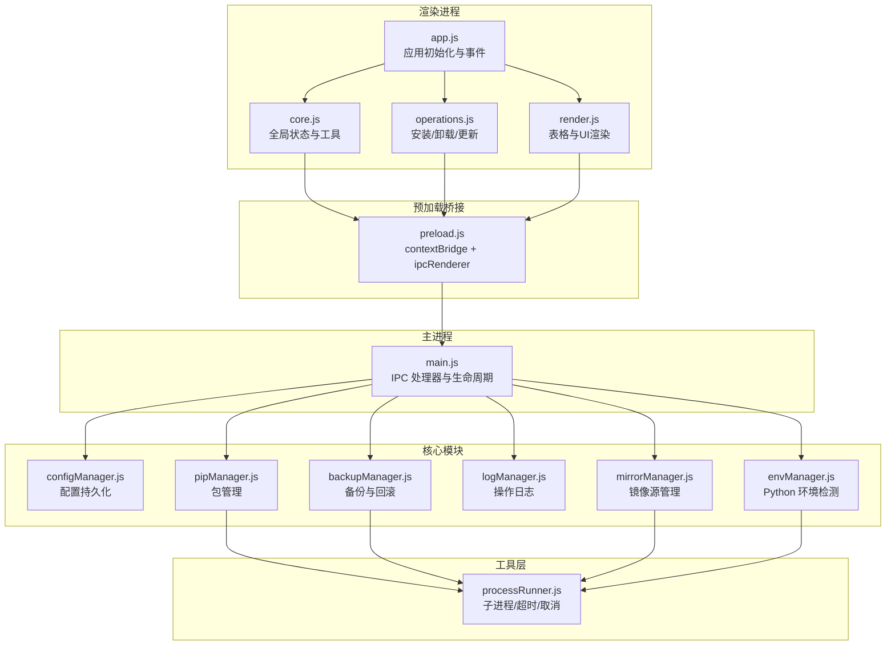
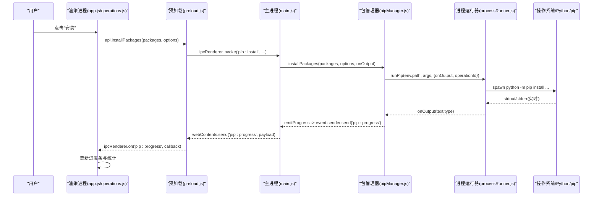
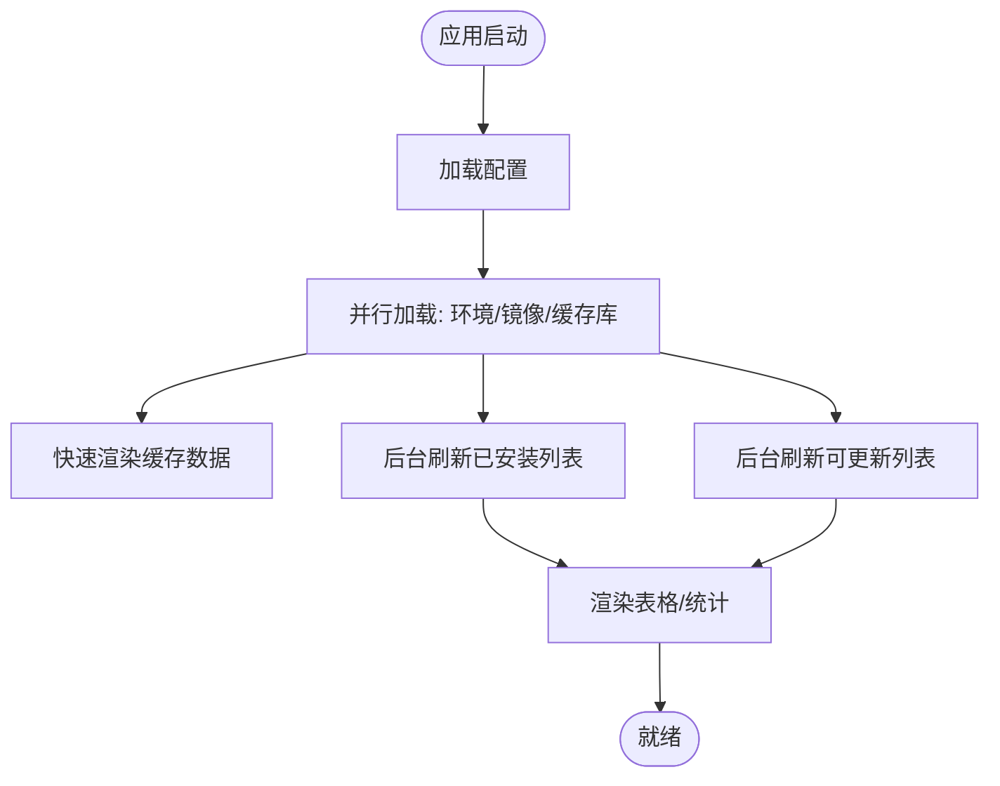
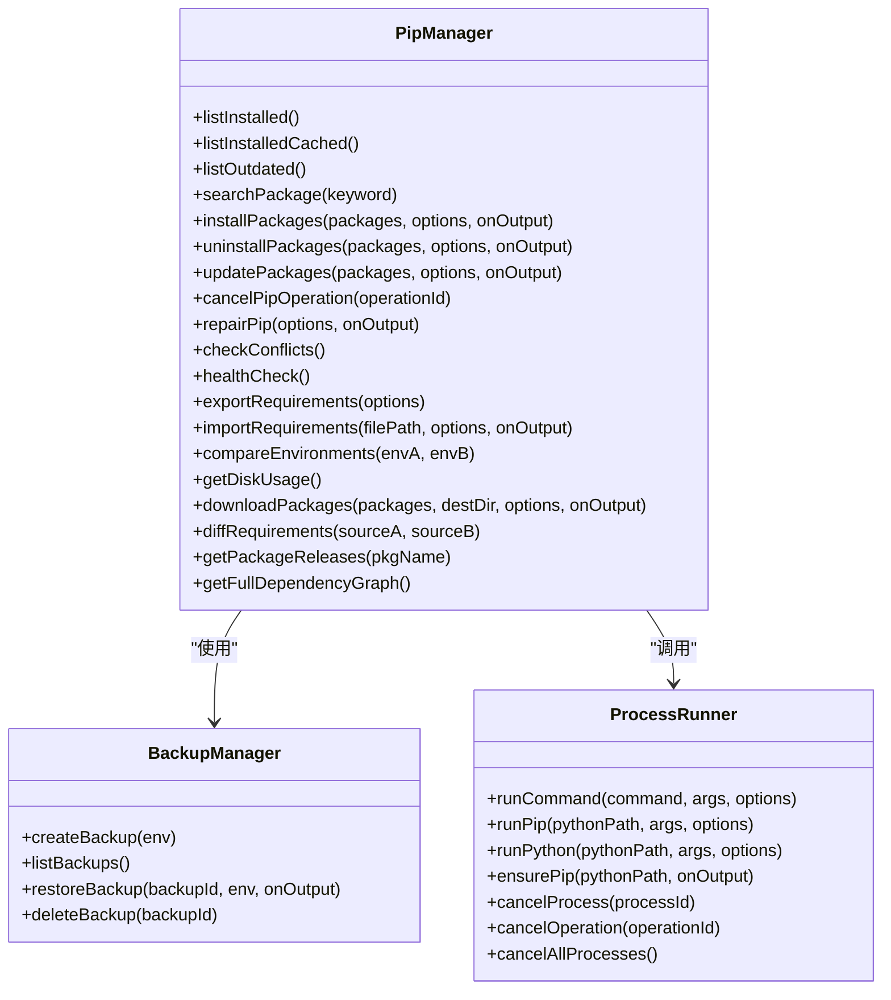
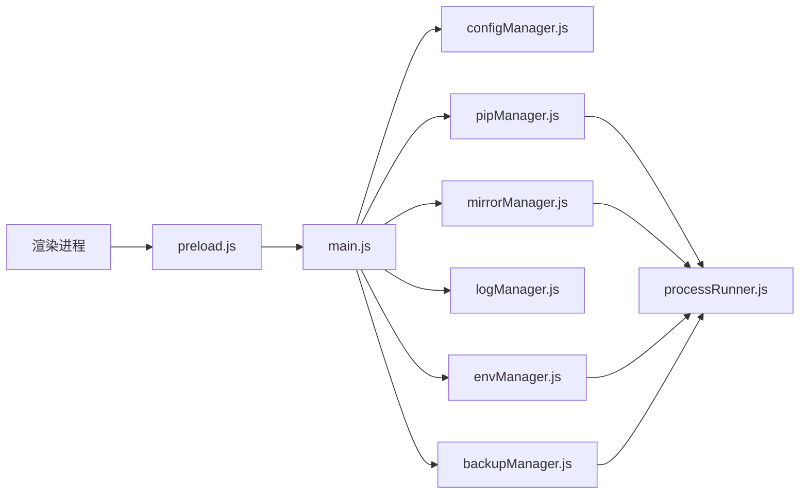
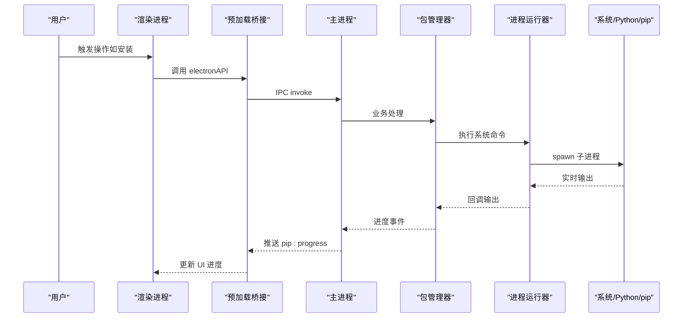
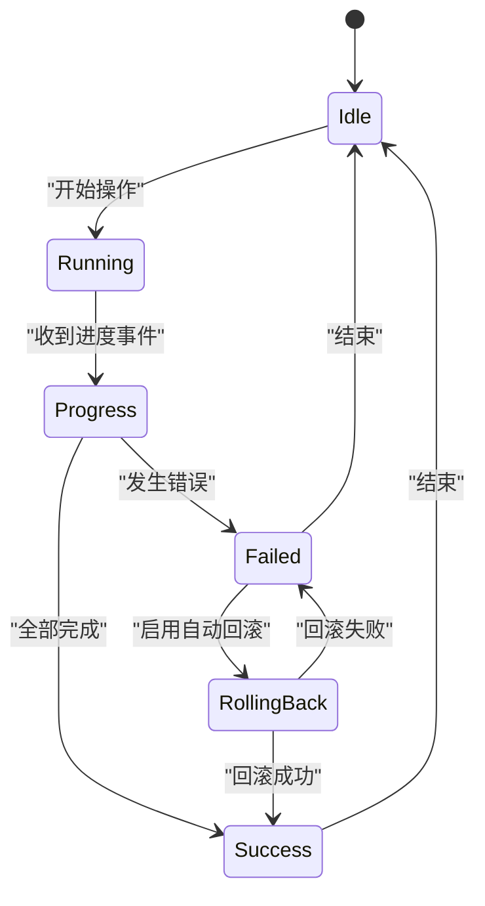
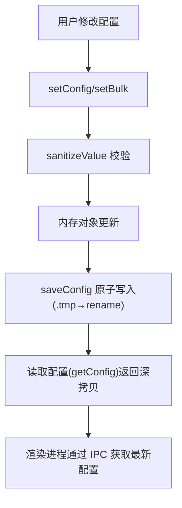
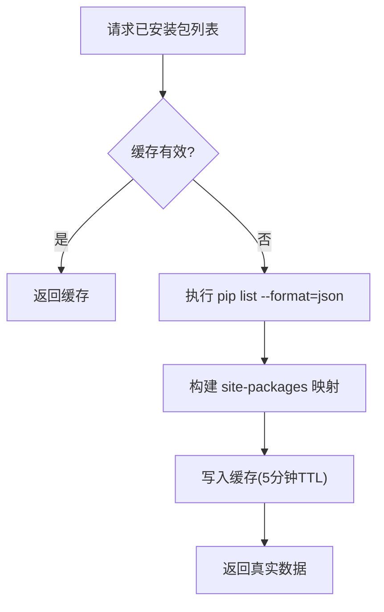

# 数据流设计

<cite>
**本文引用的文件**   
- [main.js](file://main.js)
- [preload.js](file://preload.js)
- [renderer/js/app.js](file://renderer/js/app.js)
- [renderer/js/core.js](file://renderer/js/core.js)
- [renderer/js/operations.js](file://renderer/js/operations.js)
- [renderer/js/render.js](file://renderer/js/render.js)
- [core/config/configManager.js](file://core/config/configManager.js)
- [core/config/mirrorManager.js](file://core/config/mirrorManager.js)
- [core/system/envManager.js](file://core/system/envManager.js)
- [core/system/logManager.js](file://core/system/logManager.js)
- [core/operations/pipManager.js](file://core/operations/pipManager.js)
- [core/operations/backupManager.js](file://core/operations/backupManager.js)
- [utils/processRunner.js](file://utils/processRunner.js)
- [package.json](file://package.json)
</cite>

## 目录
1. [简介](#简介)
2. [项目结构](#项目结构)
3. [核心组件](#核心组件)
4. [架构总览](#架构总览)
5. [详细组件分析](#详细组件分析)
6. [依赖关系分析](#依赖关系分析)
7. [性能与缓存策略](#性能与缓存策略)
8. [故障排查指南](#故障排查指南)
9. [结论](#结论)
10. [附录：数据流图与状态转换图](#附录数据流图与状态转换图)

## 简介
本文件为 PyLibMaster 的数据流设计文档，聚焦从用户操作到系统调用的完整链路：渲染进程 → IPC 通信 → 主进程 → 核心模块 → 系统命令。同时覆盖配置数据的存储与同步、日志收集过滤导出、异步操作状态管理（进度、错误、取消）、缓存策略（包列表、环境检测、扫描结果）以及数据一致性与并发控制机制。

## 项目结构
- 渲染进程（Electron Renderer）：负责 UI 交互、事件绑定、本地状态管理与页面渲染。
- 预加载脚本（preload.js）：通过 contextBridge 暴露安全 API，将渲染进程调用转发至主进程 IPC。
- 主进程（main.js）：创建窗口、注册 IPC 处理器、协调核心模块、生命周期管理。
- 核心模块（core/*）：业务逻辑与系统能力封装，包括配置、镜像、环境、日志、备份、包管理等。
- 工具层（utils/*）：子进程运行器、安全校验等通用能力。

**图表来源** 
- [main.js:1-120](file://main.js#L1-L120)
- [preload.js:1-120](file://preload.js#L1-L120)
- [renderer/js/app.js:120-210](file://renderer/js/app.js#L120-L210)
- [core/config/configManager.js:1-120](file://core/config/configManager.js#L1-L120)
- [core/config/mirrorManager.js:1-120](file://core/config/mirrorManager.js#L1-L120)
- [core/system/envManager.js:1-120](file://core/system/envManager.js#L1-L120)
- [core/system/logManager.js:1-120](file://core/system/logManager.js#L1-L120)
- [core/operations/pipManager.js:1-120](file://core/operations/pipManager.js#L1-L120)
- [core/operations/backupManager.js:1-120](file://core/operations/backupManager.js#L1-L120)
- [utils/processRunner.js:1-120](file://utils/processRunner.js#L1-L120)

**章节来源**
- [main.js:1-120](file://main.js#L1-L120)
- [package.json:1-40](file://package.json#L1-L40)

## 核心组件
- 渲染进程入口 app.js：启动阶段并行加载配置、环境、镜像与缓存库，快速响应并后台刷新真实数据。
- 预加载桥接 preload.js：统一暴露 window.electronAPI，屏蔽 Node 直接访问，确保上下文隔离安全。
- 主进程 main.js：集中注册所有 IPC 处理器，分发到对应核心模块；处理窗口、托盘、主题、通知、调度器等。
- 配置管理器 configManager.js：JSON 持久化，原子写入，范围校验，批量更新，路径管理。
- 镜像源管理器 mirrorManager.js：内置+自定义镜像，智能路由测速，写入 pip 配置。
- 环境管理器 envManager.js：多路径检测 Python/Conda，版本信息获取，当前环境切换与持久化。
- 日志管理器 logManager.js：内存数组+防抖落盘，容量限制，字段截断，查询筛选。
- 包管理器 pipManager.js：安装/卸载/更新/搜索/依赖树/导出导入/对比/健康检查/磁盘占用/离线下载/发布历史/依赖图谱/撤销等；含环境级互斥锁、site-packages 缓存、已安装包缓存。
- 备份管理器 backupManager.js：基于 pip freeze 的备份与恢复，ID 安全校验。
- 进程运行器 processRunner.js：spawn 封装、超时终止、ANSI 清理、活跃进程跟踪、按 operationId 取消、ensurePip 自动安装。

**章节来源**
- [renderer/js/app.js:120-210](file://renderer/js/app.js#L120-L210)
- [preload.js:1-220](file://preload.js#L1-L220)
- [main.js:130-210](file://main.js#L130-L210)
- [core/config/configManager.js:1-194](file://core/config/configManager.js#L1-L194)
- [core/config/mirrorManager.js:1-200](file://core/config/mirrorManager.js#L1-L200)
- [core/system/envManager.js:1-120](file://core/system/envManager.js#L1-L120)
- [core/system/logManager.js:1-120](file://core/system/logManager.js#L1-L120)
- [core/operations/pipManager.js:1-120](file://core/operations/pipManager.js#L1-L120)
- [core/operations/backupManager.js:1-120](file://core/operations/backupManager.js#L1-L120)
- [utils/processRunner.js:1-120](file://utils/processRunner.js#L1-L120)

## 架构总览
整体采用 Electron 经典三层架构：渲染进程（UI）→ 预加载桥接（安全 API）→ 主进程（IPC 路由与系统能力）→ 核心模块（业务逻辑）→ 系统命令（pip/python）。

**图表来源** 
- [renderer/js/operations.js:300-370](file://renderer/js/operations.js#L300-L370)
- [preload.js:55-70](file://preload.js#L55-L70)
- [main.js:310-340](file://main.js#L310-L340)
- [core/operations/pipManager.js:495-578](file://core/operations/pipManager.js#L495-L578)
- [utils/processRunner.js:85-161](file://utils/processRunner.js#L85-L161)

## 详细组件分析

### 渲染进程：事件绑定与启动流程
- app.js 在启动时并行执行配置、环境、镜像与缓存库加载，优先展示缓存数据，再后台刷新真实数据。
- 绑定全局进度事件、主题变化、更新可用通知、定时调度器执行结果等。
- 快捷键与页面导航、设置页主题/语言切换、实时筛选与排序。

**图表来源** 
- [renderer/js/app.js:129-210](file://renderer/js/app.js#L129-L210)

**章节来源**
- [renderer/js/app.js:1-210](file://renderer/js/app.js#L1-210)
- [renderer/js/core.js:1-93](file://renderer/js/core.js#L1-L93)

### 预加载桥接：安全 API 暴露
- 使用 contextBridge.exposeInMainWorld 暴露 window.electronAPI，包含窗口控制、环境管理、虚拟环境、包操作、备份、镜像、日志、配置、通知、主题、调度器、模板快照、审计、磁盘空间、离线下载、requirements 对比、发布历史、依赖图谱、健康检查、撤销、资源管理器集成等。
- 提供 onProgress、onThemeChanged、onUpdatesAvailable、onSchedulerExecuted 等事件监听方法，保证渲染进程能订阅主进程推送。

**章节来源**
- [preload.js:1-221](file://preload.js#L1-L221)

### 主进程：IPC 路由与生命周期
- 注册大量 ipcMain.handle，将渲染进程请求路由到对应核心模块函数。
- 生命周期：创建窗口、托盘、自动更新、环境检测、主题跟随、静默检查更新、调度器启动。
- 退出前清理：取消活跃子进程、立即刷新日志。

**章节来源**
- [main.js:1-210](file://main.js#L1-L210)
- [main.js:210-640](file://main.js#L210-L640)

### 配置管理：存储与热更新
- 配置文件位置：userData/pylibmaster-config.json，支持默认值合并、损坏重建。
- 原子写入：先写 .tmp 再 rename，避免崩溃损坏。
- 数值范围校验与修正，批量设置只触发一次磁盘写入。
- 存储路径动态创建，getStoragePath 用于日志与备份目录。

**章节来源**
- [core/config/configManager.js:1-194](file://core/config/configManager.js#L1-L194)

### 镜像源管理：智能路由与配置写入
- 内置镜像源与自定义镜像合并，确保唯一默认源。
- 测速接口：HEAD 请求 numpy 页面，失败标记 9999ms。
- 智能路由：开启后选择最快镜像；关闭则使用用户默认。
- 写入 pip 配置文件（Windows pip.ini / macOS/Linux pip.conf），供 pip 全局使用。

**章节来源**
- [core/config/mirrorManager.js:1-376](file://core/config/mirrorManager.js#L1-L376)

### 环境管理：检测与切换
- 常见路径 glob 匹配 + where python 查找 PATH 中的 Python。
- 并行获取 Python/pip 版本，过滤无 pip 的环境。
- 恢复上次选中环境，未选则自动选择第一个。
- 切换环境后持久化 currentEnv。

**章节来源**
- [core/system/envManager.js:1-220](file://core/system/envManager.js#L1-L220)

### 日志管理：收集、过滤、导出
- 内存数组缓存，新增日志插入头部，超过最大条数裁剪旧日志。
- 防抖写入（300ms），flushLogs 用于退出前强制落盘。
- 字段截断保护，查询支持类型筛选与关键词搜索。
- 导出 CSV/Markdown 由主进程 IPC 处理器生成并保存。

**章节来源**
- [core/system/logManager.js:1-173](file://core/system/logManager.js#L1-L173)
- [main.js:485-514](file://main.js#L485-L514)

### 包管理：安装/卸载/更新与一致性
- 安装：支持批量、并行、版本模式（latest/specific/range）、智能重试（多镜像源）、自动回滚（备份→失败→恢复）。
- 卸载：支持安全模式、自动回滚、备份选项。
- 更新：支持并行、智能重试、自动回滚、实时进度。
- 安全：包名/版本正则校验、wheel 路径白名单、UNC 与敏感目录禁止。
- 并发控制：环境级互斥锁（同一环境串行），避免 pip 并发冲突。
- 缓存：已安装包缓存（5分钟）、site-packages 路径缓存（30秒）。
- 其他：依赖树、导出 requirements、导入 requirements、对比环境、健康检查、磁盘占用、离线下载、发布历史、依赖图谱、撤销操作。

**图表来源** 
- [core/operations/pipManager.js:1-200](file://core/operations/pipManager.js#L1-L200)
- [core/operations/backupManager.js:1-120](file://core/operations/backupManager.js#L1-L120)
- [utils/processRunner.js:1-120](file://utils/processRunner.js#L1-L120)

**章节来源**
- [core/operations/pipManager.js:1-800](file://core/operations/pipManager.js#L1-L800)
- [core/operations/backupManager.js:1-196](file://core/operations/backupManager.js#L1-L196)
- [utils/processRunner.js:1-366](file://utils/processRunner.js#L1-L366)

### 进程运行器：子进程与取消机制
- 封装 spawn，UTF-8 编码、ANSI 清理、实时输出回调。
- 超时处理：SIGTERM → 延迟 SIGKILL。
- 活跃进程跟踪 Map，支持按 processId 或 operationId 取消。
- ensurePip：缓存→检测→ensurepip→get-pip.py 多级安装策略。

**章节来源**
- [utils/processRunner.js:1-366](file://utils/processRunner.js#L1-L366)

### 渲染进程：操作与进度
- operations.js 实现安装/卸载/更新的具体流程，维护 progressOperation、progressTotal、progressDone、currentOperationId。
- 支持取消当前操作（通过 operationId 向主进程发送取消请求）。
- 拖拽安装区支持 .txt/.whl 文件安装。
- 刷新函数 refreshAll 保证操作后全局数据一致性。

**章节来源**
- [renderer/js/operations.js:1-536](file://renderer/js/operations.js#L1-L536)

### 渲染进程：表格与 UI 渲染
- render.js 负责卸载/更新/查询/镜像/环境/日志等页面的表格渲染与选择状态管理。
- 支持搜索、筛选、排序、全选、拖拽排序（镜像优先级）。
- 统计卡片与状态栏实时更新。

**章节来源**
- [renderer/js/render.js:1-445](file://renderer/js/render.js#L1-L445)

## 依赖关系分析
- 渲染进程依赖 preload.js 暴露的 API，不直接访问 Node 能力。
- 主进程集中依赖 core/* 模块，按功能划分清晰。
- pipManager 强依赖 processRunner、backupManager、mirrorManager、envManager、configManager、logManager。
- 配置与镜像管理均依赖 configManager 进行持久化。
- 日志模块被多处引用，作为统一的审计与诊断通道。

**图表来源** 
- [main.js:1-120](file://main.js#L1-L120)
- [core/operations/pipManager.js:1-120](file://core/operations/pipManager.js#L1-L120)
- [core/config/mirrorManager.js:1-120](file://core/config/mirrorManager.js#L1-L120)
- [core/system/envManager.js:1-120](file://core/system/envManager.js#L1-L120)
- [core/system/logManager.js:1-120](file://core/system/logManager.js#L1-L120)
- [core/operations/backupManager.js:1-120](file://core/operations/backupManager.js#L1-L120)
- [utils/processRunner.js:1-120](file://utils/processRunner.js#L1-L120)

**章节来源**
- [package.json:1-79](file://package.json#L1-L79)

## 性能与缓存策略
- 已安装包缓存：5 分钟有效期，减少频繁扫描 site-packages 的开销。
- site-packages 路径缓存：30 秒 TTL，避免重复解析 pip show 输出。
- pip 就绪状态缓存：5 分钟 TTL，避免重复检测 pip 可用性。
- 日志写入防抖：300ms 内多次 addLog 仅一次落盘。
- 启动阶段并行加载：Promise.allSettled 提升首屏速度。
- 镜像测速并行：testAllMirrors 并行 HEAD 请求，降低测速耗时。
- 包操作并行：install/update 支持 parallel 线程数，受配置 parallelThreads 限制。

[本节为通用性能讨论，无需具体文件引用]

## 故障排查指南
- 安装/卸载/更新失败：
  - 查看日志页筛选类型与关键词，定位错误详情。
  - 检查 pip 是否可用（ensurePip 自动安装策略）。
  - 确认镜像源连通性（测速与智能路由开关）。
- 取消操作无效：
  - 确认 currentOperationId 存在且未被重置。
  - 检查 processRunner 中 activeProcesses 是否存在该 operationId。
- 配置未生效：
  - 检查 configManager 的 sanitizeValue 范围限制。
  - 确认 saveConfig 原子写入成功。
- 环境切换异常：
  - 确认 envManager 检测到目标 Python 且有 pip。
  - 检查 currentEnv 是否持久化成功。
- 日志丢失：
  - 应用退出前 flushLogs 是否被调用。
  - 检查存储路径权限与磁盘空间。

**章节来源**
- [core/system/logManager.js:88-96](file://core/system/logManager.js#L88-L96)
- [utils/processRunner.js:168-206](file://utils/processRunner.js#L168-L206)
- [core/config/configManager.js:123-138](file://core/config/configManager.js#L123-L138)
- [core/system/envManager.js:196-209](file://core/system/envManager.js#L196-L209)

## 结论
PyLibMaster 的数据流设计以清晰的三层架构与模块化为核心，通过预加载桥接保障安全，主进程集中路由与生命周期管理，核心模块专注业务逻辑，工具层统一封装系统调用。配置与日志采用持久化与防抖策略，包管理具备完善的缓存、并发控制与回滚机制，整体具备良好的性能、可靠性与可维护性。

[本节为总结，无需具体文件引用]

## 附录：数据流图与状态转换图

### 数据流图（用户操作到系统命令）

**图表来源** 
- [renderer/js/operations.js:300-370](file://renderer/js/operations.js#L300-L370)
- [preload.js:55-70](file://preload.js#L55-L70)
- [main.js:310-340](file://main.js#L310-L340)
- [core/operations/pipManager.js:495-578](file://core/operations/pipManager.js#L495-L578)
- [utils/processRunner.js:85-161](file://utils/processRunner.js#L85-L161)

### 状态转换图（异步操作状态）

**图表来源** 
- [core/operations/pipManager.js:495-578](file://core/operations/pipManager.js#L495-L578)
- [core/operations/backupManager.js:156-170](file://core/operations/backupManager.js#L156-L170)

### 配置数据流（存储与同步）

**图表来源** 
- [core/config/configManager.js:144-178](file://core/config/configManager.js#L144-L178)
- [core/config/configManager.js:123-138](file://core/config/configManager.js#L123-L138)

### 缓存策略图（包列表与环境检测）

**图表来源** 
- [core/operations/pipManager.js:382-421](file://core/operations/pipManager.js#L382-L421)
- [core/operations/pipManager.js:226-248](file://core/operations/pipManager.js#L226-L248)