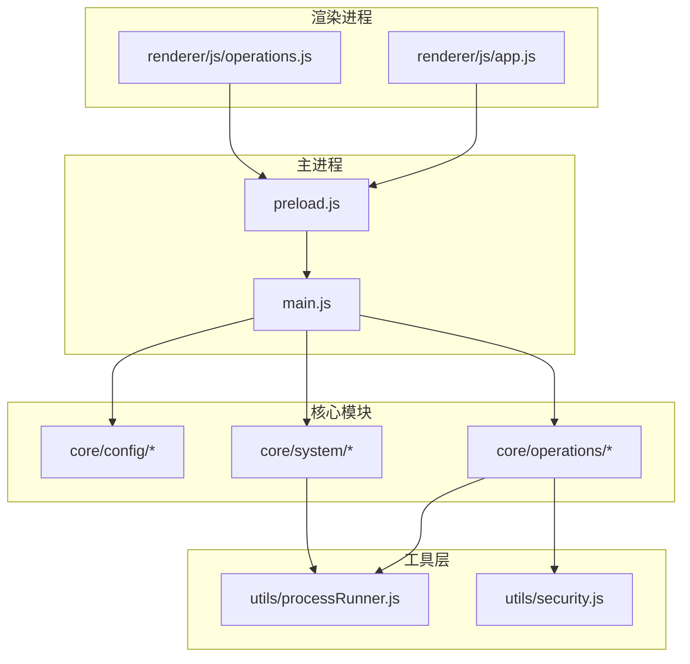
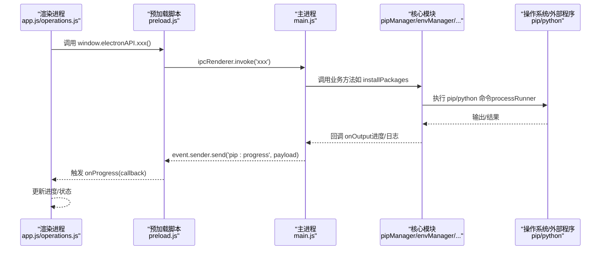
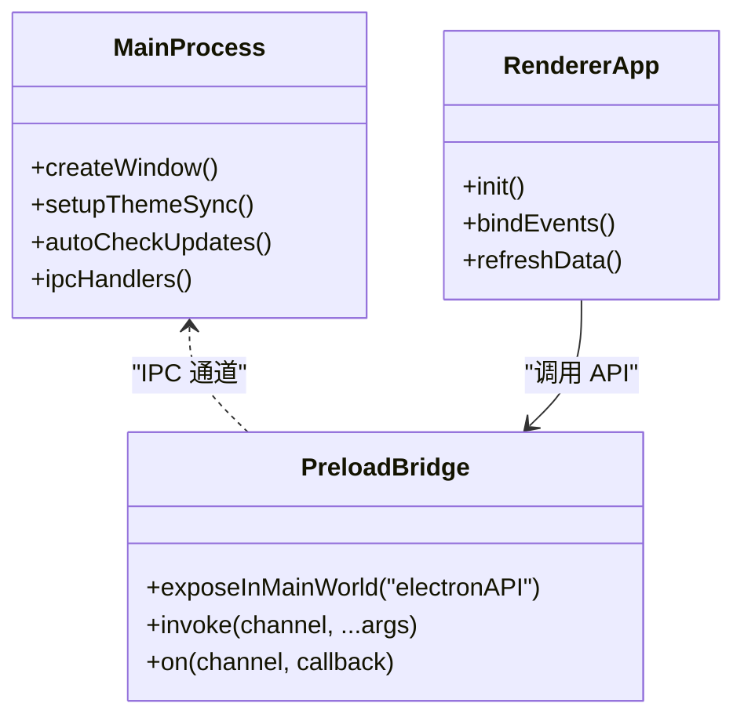
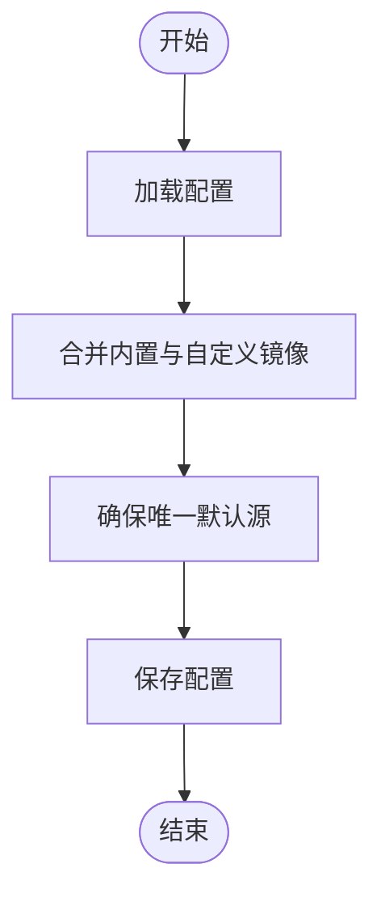
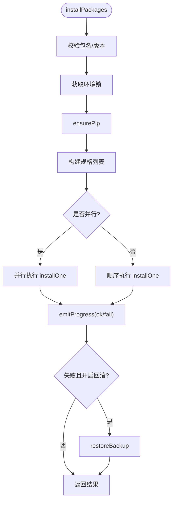
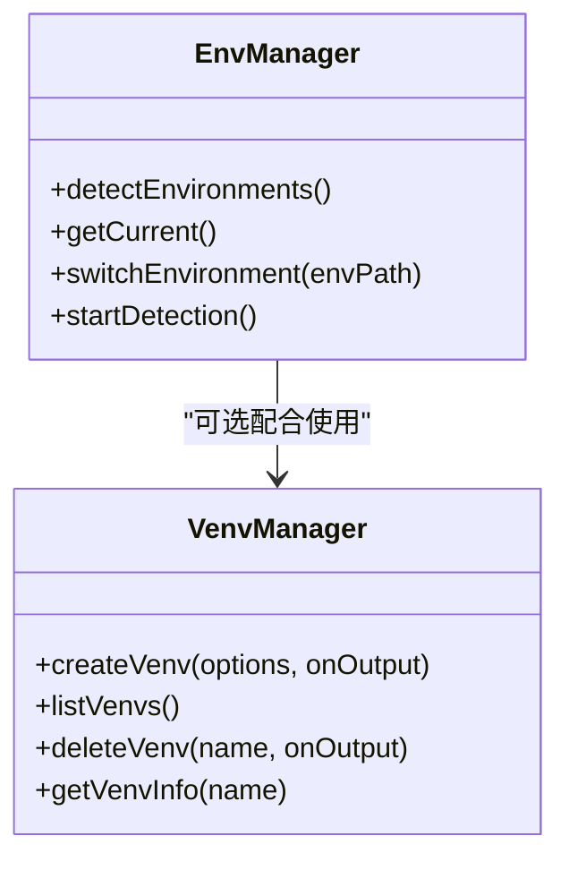
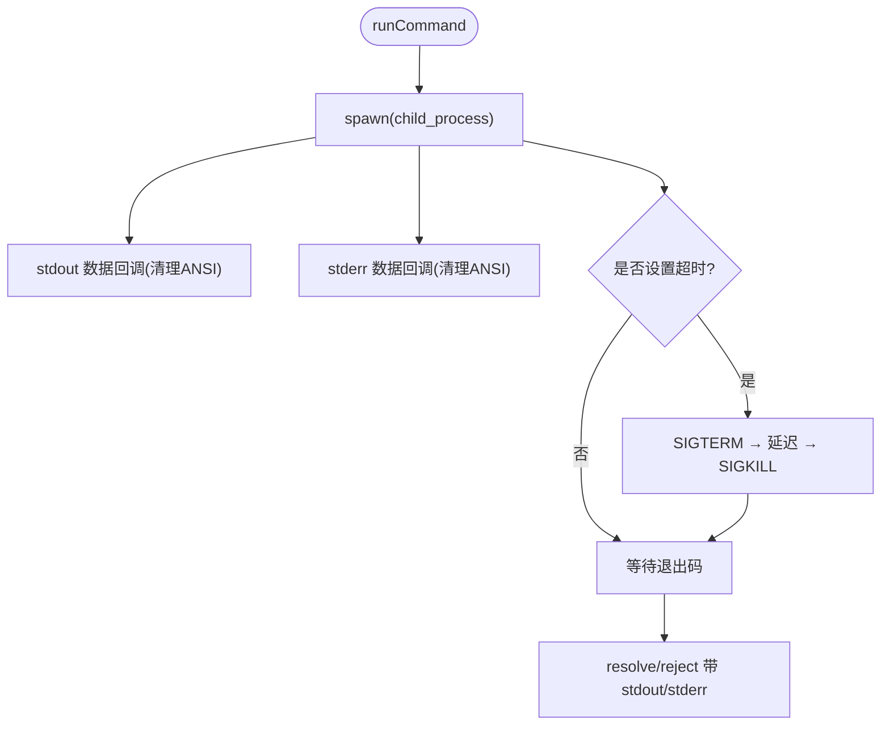
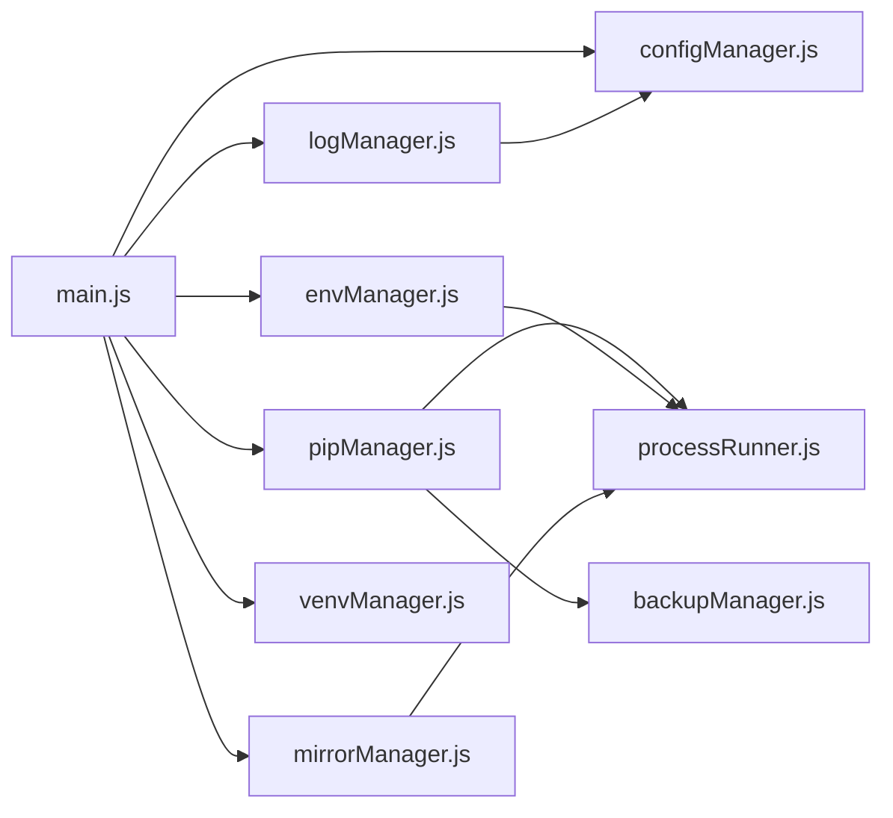
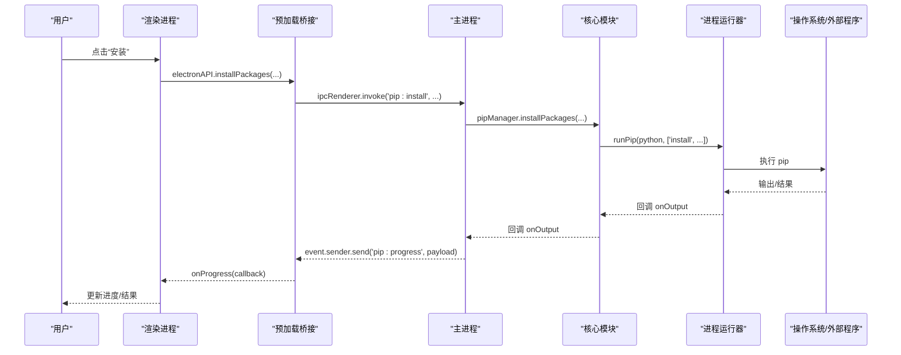
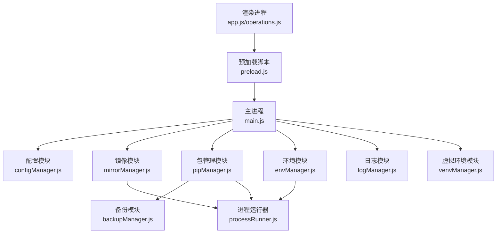

# 架构设计

<cite>
**本文引用的文件**   
- [main.js](file://main.js)
- [preload.js](file://preload.js)
- [package.json](file://package.json)
- [renderer/js/app.js](file://renderer/js/app.js)
- [core/config/configManager.js](file://core/config/configManager.js)
- [core/config/mirrorManager.js](file://core/config/mirrorManager.js)
- [core/operations/pipManager.js](file://core/operations/pipManager.js)
- [core/system/envManager.js](file://core/system/envManager.js)
- [utils/processRunner.js](file://utils/processRunner.js)
- [utils/security.js](file://utils/security.js)
- [core/operations/backupManager.js](file://core/operations/backupManager.js)
- [core/system/logManager.js](file://core/system/logManager.js)
- [core/operations/venvManager.js](file://core/operations/venvManager.js)
</cite>

## 目录
1. [简介](#简介)
2. [项目结构](#项目结构)
3. [核心组件](#核心组件)
4. [架构总览](#架构总览)
5. [详细组件分析](#详细组件分析)
6. [依赖关系分析](#依赖关系分析)
7. [性能考虑](#性能考虑)
8. [故障排查指南](#故障排查指南)
9. [结论](#结论)
10. [附录](#附录)

## 简介
本文件为 PyLibMaster 的架构设计文档，聚焦基于 Electron 的桌面应用架构。内容涵盖主进程与渲染进程的分离、IPC 安全桥接（preload）、核心模块职责划分（config/operations/system）、数据流设计（从用户操作到系统调用）、组件交互图、数据流向图、系统集成点与安全设计原则（输入校验、权限控制、命令注入防护），并说明扩展点与插件化思路。

## 项目结构
PyLibMaster 采用典型的 Electron 分层结构：
- 主进程（main.js）：窗口管理、生命周期、IPC 处理器注册、系统托盘、主题同步、自动更新调度等。
- 预加载脚本（preload.js）：通过 contextBridge 暴露受限 API 给渲染进程，屏蔽 Node 直接访问。
- 渲染进程（renderer/**）：UI 与交互逻辑，使用 window.electronAPI 调用主进程能力。
- 核心模块（core/**）：按职责划分为 config（配置与镜像）、operations（包管理与备份等）、system（环境、日志、资源管理器）。
- 工具层（utils/**）：子进程运行器、安全工具函数等。

**图示来源** 
- [main.js:1-120](file://main.js#L1-L120)
- [preload.js:1-60](file://preload.js#L1-L60)
- [renderer/js/app.js:1-60](file://renderer/js/app.js#L1-L60)

**章节来源**
- [main.js:1-120](file://main.js#L1-L120)
- [package.json:1-40](file://package.json#L1-L40)

## 核心组件
- 主进程（main.js）
  - 创建 BrowserWindow，启用上下文隔离与禁用 Node 集成，设置 preload。
  - 注册所有 IPC 处理器（window/env/venv/pip/backup/mirror/log/config/updater/system/audit/scheduler/template/explorer 等）。
  - 生命周期管理（ready/activate/window-all-closed/before-quit），托盘、主题同步、自动检查更新、调度器启动。
- 预加载脚本（preload.js）
  - 通过 contextBridge.exposeInMainWorld 暴露 electronAPI，封装 ipcRenderer.invoke/on，屏蔽 Node API。
  - 提供事件监听包装（pip:progress、theme:changed、updater:*、scheduler:executed 等）。
- 渲染进程（renderer/js/app.js, operations.js, core.js 等）
  - app.js：页面导航、事件绑定、初始化流程（并行加载缓存、后台刷新真实数据、懒加载可更新列表）。
  - operations.js：安装/卸载/更新操作编排、进度展示、取消操作、全局刷新。
  - core.js：全局状态、i18n 引用、通用工具（XSS 转义、Toast、动画）。
- 核心模块
  - config：configManager（配置持久化与范围校验）、mirrorManager（镜像源管理与智能路由）、schedulerManager（定时任务）。
  - operations：pipManager（包查询/安装/卸载/更新/依赖树/导出导入/对比/健康检查/磁盘占用/离线下载/版本历史/依赖图谱）、backupManager（备份/恢复/删除）、venvManager（虚拟环境创建/删除/信息）、templateManager、auditManager、undoManager。
  - system：envManager（Python 环境检测/切换）、logManager（日志持久化/筛选/导出）、explorerManager（Windows 资源管理器集成）。
- 工具层
  - processRunner.js：子进程封装（超时、取消、ANSI 清理、UTF-8 编码、ensurePip、runPip/runPython）。
  - security.js：路径白名单校验（防止路径遍历）。

**章节来源**
- [main.js:120-220](file://main.js#L120-L220)
- [preload.js:60-120](file://preload.js#L60-L120)
- [renderer/js/app.js:120-210](file://renderer/js/app.js#L120-L210)
- [core/config/configManager.js:1-120](file://core/config/configManager.js#L1-L120)
- [core/config/mirrorManager.js:1-120](file://core/config/mirrorManager.js#L1-L120)
- [core/operations/pipManager.js:1-120](file://core/operations/pipManager.js#L1-L120)
- [core/system/envManager.js:1-80](file://core/system/envManager.js#L1-L80)
- [utils/processRunner.js:1-120](file://utils/processRunner.js#L1-L120)
- [utils/security.js:1-43](file://utils/security.js#L1-L43)

## 架构总览
下图展示了从渲染进程到主进程再到核心模块与系统调用的完整链路，以及关键事件回传机制。

**图示来源** 
- [preload.js:120-185](file://preload.js#L120-L185)
- [main.js:230-360](file://main.js#L230-L360)
- [core/operations/pipManager.js:470-580](file://core/operations/pipManager.js#L470-L580)
- [utils/processRunner.js:80-160](file://utils/processRunner.js#L80-L160)

## 详细组件分析

### 主进程与 IPC 桥接
- 主进程负责：
  - 窗口创建与事件处理（最小化/最大化/关闭、位置尺寸保存、外部链接拦截）。
  - 生命周期钩子（ready/activate/window-all-closed/before-quit）。
  - 托盘菜单、主题跟随系统、自动检查更新、调度器启动。
  - 统一 IPC 处理器注册，将渲染进程请求转发至对应核心模块。
- 预加载脚本负责：
  - 通过 contextBridge 暴露受限 API（window.electronAPI）。
  - 封装 invoke/on，确保渲染进程无法直接访问 Node 能力。
  - 提供事件监听包装（pip:progress、theme:changed、updater:*、scheduler:executed）。

**图示来源** 
- [main.js:40-120](file://main.js#L40-L120)
- [preload.js:15-60](file://preload.js#L15-L60)
- [renderer/js/app.js:1-60](file://renderer/js/app.js#L1-L60)

**章节来源**
- [main.js:120-220](file://main.js#L120-L220)
- [preload.js:15-60](file://preload.js#L15-L60)

### 配置与镜像管理（config）
- configManager：
  - 配置文件读写（userData 目录 JSON），默认值合并，数值范围校验与修正。
  - 原子写入（临时文件+重命名），损坏时重建默认配置。
  - 存储路径管理（日志/备份目录自动创建）。
- mirrorManager：
  - 内置镜像源与自定义镜像源合并，确保唯一默认源。
  - 测速（HEAD 请求 numpy）、智能路由（最快镜像选择）、写入 pip 配置文件。
  - 增删改查、排序、开关智能路由。

**图示来源** 
- [core/config/configManager.js:80-140](file://core/config/configManager.js#L80-L140)
- [core/config/mirrorManager.js:60-120](file://core/config/mirrorManager.js#L60-L120)

**章节来源**
- [core/config/configManager.js:1-120](file://core/config/configManager.js#L1-L120)
- [core/config/mirrorManager.js:1-120](file://core/config/mirrorManager.js#L1-L120)

### 包管理核心（operations/pipManager）
- 功能：
  - 已安装列表（实时扫描 site-packages 并估算大小/时间）、缓存列表（5分钟 TTL）。
  - 搜索（pip index versions）、依赖树、导出/导入 requirements、对比环境、健康检查、磁盘占用、离线下载、版本历史、依赖图谱。
- 安全：
  - 包名/版本正则校验，wheel 路径安全检查（禁止 UNC、敏感目录、非法字符）。
  - 环境级互斥锁（同一环境串行操作）。
- 可靠性：
  - 多镜像重试、自动回滚（失败恢复备份）、并行安装、进度回调。

**图示来源** 
- [core/operations/pipManager.js:470-580](file://core/operations/pipManager.js#L470-L580)
- [core/operations/pipManager.js:580-712](file://core/operations/pipManager.js#L580-L712)
- [core/operations/backupManager.js:80-120](file://core/operations/backupManager.js#L80-L120)

**章节来源**
- [core/operations/pipManager.js:1-120](file://core/operations/pipManager.js#L1-L120)
- [core/operations/backupManager.js:1-120](file://core/operations/backupManager.js#L1-L120)

### Python 环境与虚拟环境（system/envManager, operations/venvManager）
- envManager：
  - 检测常见安装路径（glob）、PATH 中 python、Conda/Miniconda、Windows Store。
  - 并行获取 Python/pip 版本，过滤无 pip 的环境，恢复当前环境。
- venvManager：
  - 创建/删除/列出虚拟环境，支持 --without-pip、--system-site-packages。
  - 读取 pyvenv.cfg 获取基础 Python 路径，统计包数量。

**图示来源** 
- [core/system/envManager.js:80-170](file://core/system/envManager.js#L80-L170)
- [core/operations/venvManager.js:70-130](file://core/operations/venvManager.js#L70-L130)

**章节来源**
- [core/system/envManager.js:1-120](file://core/system/envManager.js#L1-L120)
- [core/operations/venvManager.js:1-120](file://core/operations/venvManager.js#L1-L120)

### 子进程与系统调用（utils/processRunner）
- 封装 spawn，支持超时（SIGTERM→SIGKILL）、实时输出（ANSI 清理）、UTF-8 编码、进程跟踪与取消（operationId）。
- ensurePip：缓存→检测→ensurepip→get-pip.py 多级策略。
- runPip/runPython：统一入口，便于集中管理参数与选项。

**图示来源** 
- [utils/processRunner.js:80-160](file://utils/processRunner.js#L80-L160)
- [utils/processRunner.js:230-280](file://utils/processRunner.js#L230-L280)

**章节来源**
- [utils/processRunner.js:1-120](file://utils/processRunner.js#L1-L120)

### 日志与审计（system/logManager）
- 日志持久化（JSON），容量控制（最多 2000 条），字段截断保护。
- 防抖写入（300ms），flushLogs 在退出前同步保存。
- 支持类型筛选与关键词搜索，导出 CSV/Markdown。

**章节来源**
- [core/system/logManager.js:1-120](file://core/system/logManager.js#L1-L120)

### 安全工具（utils/security）
- isAllowedOpenPath：绝对路径解析后白名单比较，防止路径遍历攻击。
- 用于 system:openPath 等需要打开文件的场景。

**章节来源**
- [utils/security.js:1-43](file://utils/security.js#L1-L43)

## 依赖关系分析
- 主进程依赖核心模块（config/operations/system）与工具层（processRunner/security）。
- 渲染进程仅通过 preload 暴露的 API 与主进程通信，不直接依赖 Node 模块。
- 核心模块之间解耦清晰：pipManager 依赖 backupManager、mirrorManager、envManager、logManager；envManager 依赖 configManager、processRunner；mirrorManager 依赖 configManager、processRunner。

**图示来源** 
- [main.js:12-31](file://main.js#L12-L31)
- [core/operations/pipManager.js:20-28](file://core/operations/pipManager.js#L20-L28)
- [core/system/envManager.js:18-24](file://core/system/envManager.js#L18-L24)
- [core/config/mirrorManager.js:15-20](file://core/config/mirrorManager.js#L15-L20)

**章节来源**
- [main.js:12-31](file://main.js#L12-L31)

## 性能考虑
- 启动优化：
  - 快速加载缓存（已安装包缓存 5 分钟），后台异步刷新真实数据。
  - 低优先级任务（日志、版本信息）非阻塞加载。
- I/O 与缓存：
  - site-packages 路径缓存（TTL 30 秒），文件夹大小计算缓存（避免重复扫描）。
  - 配置写入原子化，日志写入防抖。
- 并发与互斥：
  - 并行安装/更新（线程数由配置控制），环境级互斥锁保证一致性。
- 网络与重试：
  - 多镜像源重试，智能路由选择最快镜像，超时与降级策略。
- 进程管理：
  - 子进程超时与强制终止，批量取消（operationId），退出前清理活跃进程。

[本节为通用指导，无需具体文件引用]

## 故障排查指南
- 常见问题定位：
  - 查看操作日志（类型筛选、关键词搜索），导出 CSV/Markdown 进行分析。
  - 检查 Python 环境是否可用（env:detect、env:getCurrent），确认 pip 就绪（ensurePip）。
  - 镜像源连通性测试（testMirrorSpeed/testAllMirrors），必要时切换默认镜像或开启智能路由。
  - 若 pip 被意外卸载，使用 repair 接口重新引导安装。
- 错误处理策略：
  - 子进程错误包含 stdout/stderr，便于定位命令失败原因。
  - 备份与回滚：安装/卸载失败时自动恢复，确保环境一致性。
  - 路径安全：打开文件/路径需通过白名单校验，避免越权访问。

**章节来源**
- [core/system/logManager.js:120-173](file://core/system/logManager.js#L120-L173)
- [core/operations/pipManager.js:712-800](file://core/operations/pipManager.js#L712-L800)
- [utils/processRunner.js:160-220](file://utils/processRunner.js#L160-L220)

## 结论
PyLibMaster 以 Electron 为主进程与渲染进程分离架构，通过 preload 安全桥接暴露 API，核心模块按职责清晰划分（config/operations/system），结合 processRunner 与 security 工具实现稳定可靠的系统调用与安全防护。数据流从 UI 到主进程再到核心模块与外部程序，全程具备进度反馈、错误处理与回滚机制。该设计兼顾性能、安全与可扩展性，适合持续迭代与插件化扩展。

[本节为总结，无需具体文件引用]

## 附录

### 数据流设计（用户操作到系统调用）

**图示来源** 
- [renderer/js/operations.js:300-370](file://renderer/js/operations.js#L300-L370)
- [preload.js:170-185](file://preload.js#L170-L185)
- [main.js:310-360](file://main.js#L310-L360)
- [core/operations/pipManager.js:470-580](file://core/operations/pipManager.js#L470-L580)
- [utils/processRunner.js:80-160](file://utils/processRunner.js#L80-L160)

### 组件交互图（模块间关系）

**图示来源** 
- [main.js:12-31](file://main.js#L12-L31)
- [core/operations/pipManager.js:20-28](file://core/operations/pipManager.js#L20-L28)
- [core/system/envManager.js:18-24](file://core/system/envManager.js#L18-L24)
- [core/config/mirrorManager.js:15-20](file://core/config/mirrorManager.js#L15-L20)

### 系统集成点
- Windows 资源管理器右键菜单集成（explorerManager）。
- 系统托盘与通知（Tray、Notification）。
- 自动更新（electron-updater）。
- 主题跟随系统（nativeTheme）。
- 定时任务调度（schedulerManager）。

**章节来源**
- [main.js:170-210](file://main.js#L170-L210)
- [main.js:468-520](file://main.js#L468-L520)
- [package.json:60-79](file://package.json#L60-L79)

### 安全设计原则
- 输入验证：包名/版本正则、wheel 路径白名单、镜像 URL 协议校验。
- 权限控制：路径白名单（isAllowedOpenPath）、仅允许特定目录打开文件。
- 命令注入防护：严格参数拼接、禁止危险字符、UNC 路径限制。
- 进程安全：超时与强制终止、操作 ID 批量取消、活跃进程清理。

**章节来源**
- [core/operations/pipManager.js:120-220](file://core/operations/pipManager.js#L120-L220)
- [utils/security.js:1-43](file://utils/security.js#L1-L43)
- [utils/processRunner.js:150-200](file://utils/processRunner.js#L150-L200)

### 扩展点与插件系统建议
- IPC 通道扩展：在 main.js 新增 ipcMain.handle 处理器，并在 preload.js 暴露对应 API。
- 核心模块扩展：在 core/operations 或 core/system 新增模块，遵循现有接口约定（onOutput 回调、错误抛出、日志记录）。
- 插件化建议：
  - 定义统一的插件接口（initialize、registerHandlers、onEvent、cleanup）。
  - 通过配置文件动态加载插件模块，限制其访问范围（沙箱/白名单）。
  - 为插件提供安全的 IPC 通道与事件总线，避免直接访问敏感 API。

[本节为概念性说明，无需具体文件引用]