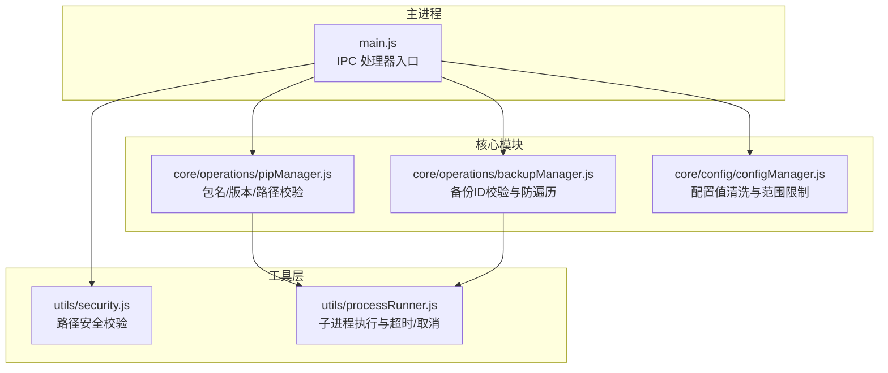
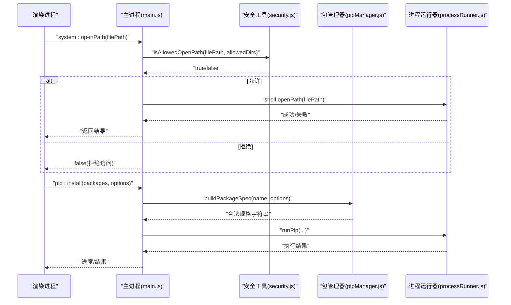
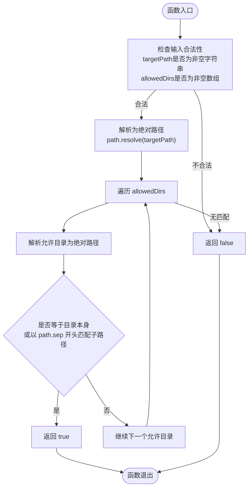
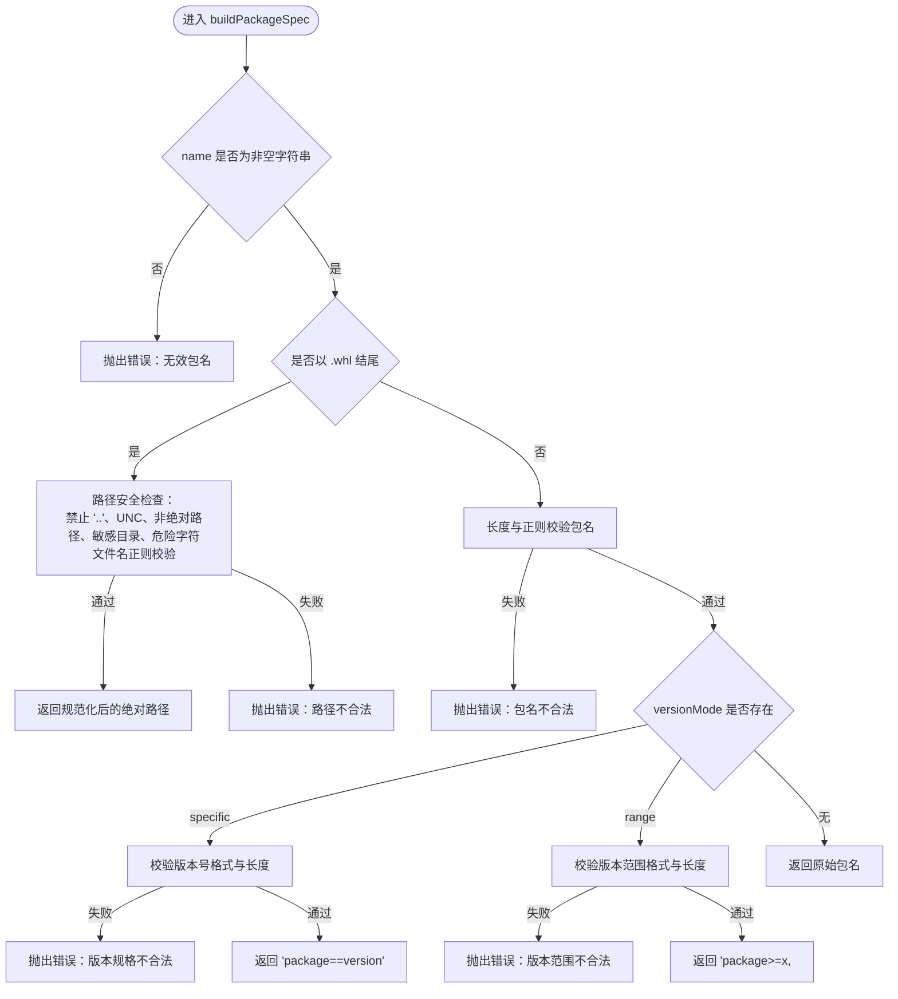
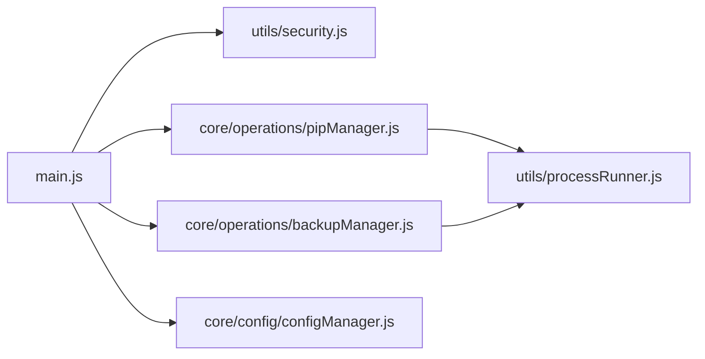

# 安全工具 (security.js)

<cite>
**本文引用的文件**   
- [utils/security.js](file://utils/security.js)
- [main.js](file://main.js)
- [core/operations/pipManager.js](file://core/operations/pipManager.js)
- [core/operations/backupManager.js](file://core/operations/backupManager.js)
- [core/config/configManager.js](file://core/config/configManager.js)
- [utils/processRunner.js](file://utils/processRunner.js)
</cite>

## 目录
1. [简介](#简介)
2. [项目结构](#项目结构)
3. [核心组件](#核心组件)
4. [架构总览](#架构总览)
5. [详细组件分析](#详细组件分析)
6. [依赖关系分析](#依赖关系分析)
7. [性能与安全特性](#性能与安全特性)
8. [故障排查指南](#故障排查指南)
9. [结论](#结论)
10. [附录：安全配置与最佳实践](#附录：安全配置与最佳实践)

## 简介
本文件为 PyLibMaster 的安全工具模块文档，聚焦 utils/security.js 提供的路径安全校验能力，并结合主进程 IPC 处理器、包管理器与备份管理器等模块，系统阐述输入验证策略、路径安全检查机制、命令参数白名单与注入防护等关键安全点。同时给出可操作的安全配置示例与常见问题解决方案，帮助开发者在 Electron 应用中构建健壮的访问控制与输入净化体系。

## 项目结构
本项目采用分层组织方式：
- 核心业务模块位于 core/operations 与 core/config，负责 pip 包管理、镜像源、环境检测、备份与回滚等。
- 系统级能力位于 core/system，包含日志、环境变量、资源管理器集成等。
- 通用工具位于 utils，包括进程运行器 processRunner.js 与安全工具 security.js。
- 主进程 main.js 集中注册 IPC 处理器，作为渲染进程与核心模块之间的安全桥接层。

**图表来源** 
- [main.js:23](file://main.js#L23)
- [utils/security.js:1-43](file://utils/security.js#L1-L43)
- [core/operations/pipManager.js:1-200](file://core/operations/pipManager.js#L1-L200)
- [core/operations/backupManager.js:60-196](file://core/operations/backupManager.js#L60-L196)
- [core/config/configManager.js:35-194](file://core/config/configManager.js#L35-L194)
- [utils/processRunner.js:1-200](file://utils/processRunner.js#L1-L200)

**章节来源**
- [main.js:1-640](file://main.js#L1-L640)

## 核心组件
- 路径安全校验（isAllowedOpenPath）：用于限制“打开路径”操作仅能访问允许的目录集合，防止路径遍历攻击。
- 包名与版本规范校验：通过正则与长度限制，确保 pip 规格字符串合法，避免命令注入。
- 备份 ID 校验：拒绝包含路径分隔符或“..”的非法标识，并强制使用 basename 规范化。
- 配置值清洗：对数值型配置进行范围裁剪与类型校验，防止越界或异常值影响系统行为。
- 子进程执行封装：统一处理超时、信号终止、输出清理与取消，降低外部命令执行风险。

**章节来源**
- [utils/security.js:1-43](file://utils/security.js#L1-L43)
- [core/operations/pipManager.js:129-217](file://core/operations/pipManager.js#L129-L217)
- [core/operations/backupManager.js:60-78](file://core/operations/backupManager.js#L60-L78)
- [core/config/configManager.js:35-44](file://core/config/configManager.js#L35-L44)
- [utils/processRunner.js:66-161](file://utils/processRunner.js#L66-L161)

## 架构总览
下图展示从渲染进程到主进程 IPC 处理器，再到安全校验与核心模块的调用链路。重点体现“打开路径”操作的白名单校验与 pip 安装流程中的输入净化。

**图表来源** 
- [main.js:449-466](file://main.js#L449-L466)
- [utils/security.js:28-40](file://utils/security.js#L28-L40)
- [core/operations/pipManager.js:154-217](file://core/operations/pipManager.js#L154-L217)
- [utils/processRunner.js:85-161](file://utils/processRunner.js#L85-L161)

## 详细组件分析

### 路径安全校验（isAllowedOpenPath）
- 功能要点
  - 将目标路径解析为绝对路径，消除相对路径组件（如 “..”）。
  - 与允许的目录列表逐一比对，要求精确匹配或严格以目录分隔符结尾的子路径匹配，避免前缀误判。
  - 对非法输入（非字符串、空串、允许目录为空）直接拒绝。
- 适用场景
  - 主进程的“打开路径”接口，限制用户只能访问文档、下载、用户数据目录等白名单位置。
- 安全收益
  - 有效防御路径遍历攻击；避免恶意构造的路径逃逸到受限目录之外。

**图表来源** 
- [utils/security.js:28-40](file://utils/security.js#L28-L40)

**章节来源**
- [utils/security.js:1-43](file://utils/security.js#L1-L43)
- [main.js:449-466](file://main.js#L449-L466)

### 包名与版本安全校验（pipManager.buildPackageSpec）
- 功能要点
  - 针对 wheel 文件路径：禁止 “..”、UNC 路径、非绝对路径、敏感目录、危险字符；文件名需符合 .whl 命名规范。
  - 针对包名：长度上限、正则校验（字母数字及有限符号），版本模式支持 exact/range，均进行格式与长度校验。
- 安全收益
  - 防止通过包名或 wheel 路径注入 shell 元字符或访问敏感文件系统。
  - 保证传递给 pip 的参数始终处于受控白名单内。

**图表来源** 
- [core/operations/pipManager.js:154-217](file://core/operations/pipManager.js#L154-L217)

**章节来源**
- [core/operations/pipManager.js:129-217](file://core/operations/pipManager.js#L129-L217)

### 备份 ID 校验（backupManager.validateBackupId）
- 功能要点
  - 类型与长度校验，拒绝空串与超长 ID。
  - 明确禁止路径分隔符与 “..”，阻断路径遍历尝试。
  - 使用 path.basename 规范化后，再按正则校验最终 ID 格式。
- 安全收益
  - 确保备份文件操作只作用于预期目录内的合法文件，避免任意文件读取/删除。

**章节来源**
- [core/operations/backupManager.js:60-78](file://core/operations/backupManager.js#L60-L78)

### 配置值清洗（configManager.sanitizeValue）
- 功能要点
  - 根据 key 对应的 RANGE_LIMITS 进行类型与范围裁剪，非法值回退到默认值。
  - 批量设置时逐项清洗，减少磁盘写入次数。
- 安全收益
  - 防止越界配置导致系统不稳定或资源耗尽。

**章节来源**
- [core/config/configManager.js:35-44](file://core/config/configManager.js#L35-L44)
- [core/config/configManager.js:157-178](file://core/config/configManager.js#L157-L178)

### 子进程执行封装（processRunner.runCommand）
- 功能要点
  - 统一创建子进程，设置 UTF-8 编码，清理 ANSI 转义序列。
  - 支持超时自动终止（SIGTERM + SIGKILL）、按 operationId 批量取消、活跃进程跟踪。
  - 错误信息聚合 stdout/stderr，便于诊断。
- 安全收益
  - 限制外部命令执行窗口，避免长时间占用与僵尸进程；统一输出清洗，降低终端注入风险。

**章节来源**
- [utils/processRunner.js:66-161](file://utils/processRunner.js#L66-L161)
- [utils/processRunner.js:168-200](file://utils/processRunner.js#L168-L200)

## 依赖关系分析
- 主进程 main.js 引入 security.isAllowedOpenPath，并在 system:openPath 中实施白名单校验。
- pipManager 依赖 processRunner 执行 pip 命令，并通过自身校验逻辑保障参数安全。
- backupManager 对备份 ID 进行严格校验，确保文件操作安全。
- configManager 提供配置值的清洗与持久化，避免非法配置影响系统稳定性。

**图表来源** 
- [main.js:23](file://main.js#L23)
- [core/operations/pipManager.js:1-28](file://core/operations/pipManager.js#L1-L28)
- [core/operations/backupManager.js:1-20](file://core/operations/backupManager.js#L1-L20)
- [core/config/configManager.js:1-34](file://core/config/configManager.js#L1-L34)
- [utils/processRunner.js:1-20](file://utils/processRunner.js#L1-L20)

**章节来源**
- [main.js:1-640](file://main.js#L1-L640)

## 性能与安全特性
- 路径校验 O(n) 比较允许目录列表，n 通常为少量固定目录，开销极低。
- 包名/版本校验基于正则与长度判断，时间复杂度接近 O(m)，m 为输入长度。
- 子进程执行封装具备超时与取消机制，避免长期阻塞；ANSI 清理提升日志可读性。
- 配置值清洗在写入前完成，避免运行时分支判断带来的额外开销。

[本节为通用指导，无需源码引用]

## 故障排查指南
- 打开路径被拒绝
  - 现象：system:openPath 返回 false。
  - 排查：确认 filePath 是否在 allowedDirs（文档、下载、用户数据目录）内；检查路径是否包含 “..” 或相对路径未正确解析。
  - 参考实现：主进程 IPC 处理器与 isAllowedOpenPath。
- 包安装失败（参数不合法）
  - 现象：buildPackageSpec 抛出错误。
  - 排查：检查包名是否符合正则、wheel 路径是否为绝对路径且不含危险字符、版本规格是否合法。
- 备份操作失败（ID 不合法）
  - 现象：validateBackupId 抛出错误。
  - 排查：确认备份 ID 不包含路径分隔符与 “..”，长度在允许范围内，且 basename 后符合正则。
- 子进程超时或被取消
  - 现象：runCommand 抛出超时错误或进程被取消。
  - 排查：检查 timeout 设置、operationId 是否正确、是否有并发冲突；查看 stderr 输出定位原因。

**章节来源**
- [main.js:449-466](file://main.js#L449-L466)
- [utils/security.js:28-40](file://utils/security.js#L28-L40)
- [core/operations/pipManager.js:154-217](file://core/operations/pipManager.js#L154-L217)
- [core/operations/backupManager.js:60-78](file://core/operations/backupManager.js#L60-L78)
- [utils/processRunner.js:85-161](file://utils/processRunner.js#L85-L161)

## 结论
PyLibMaster 的安全工具模块以最小权限原则为核心，围绕“输入净化—路径白名单—参数白名单—进程执行约束”形成闭环防护。通过 isAllowedOpenPath、包名/版本校验、备份 ID 校验与配置值清洗等手段，有效抵御路径遍历、命令注入与非法配置等常见安全风险。结合统一的子进程执行封装，进一步提升了系统的健壮性与可观测性。

[本节为总结性内容，无需源码引用]

## 附录：安全配置与最佳实践
- 最小权限原则
  - 仅在必要处启用 Node 集成，保持上下文隔离；对外部链接打开进行协议白名单限制。
- 输入净化与输出编码
  - 对所有用户输入进行类型、长度、格式校验；对输出进行 HTML/Markdown/CSV 转义或模板化处理，避免注入。
- 路径与文件访问
  - 使用绝对路径与白名单目录；禁止 UNC 路径与敏感目录访问；对文件名进行正则校验。
- 命令参数白名单
  - 仅允许已知安全的 pip 子命令与参数组合；对版本规格进行严格正则校验。
- 进程与资源控制
  - 设置合理超时与重试上限；支持按操作 ID 取消；清理 ANSI 输出，避免终端污染。
- 配置安全
  - 数值型配置必须限定范围；配置文件损坏时自动重建默认配置；原子写入避免部分更新。

[本节为通用指导，无需源码引用]