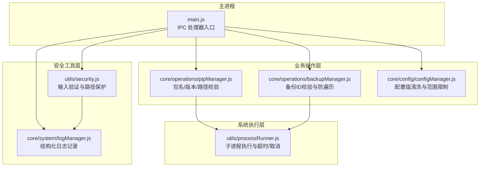
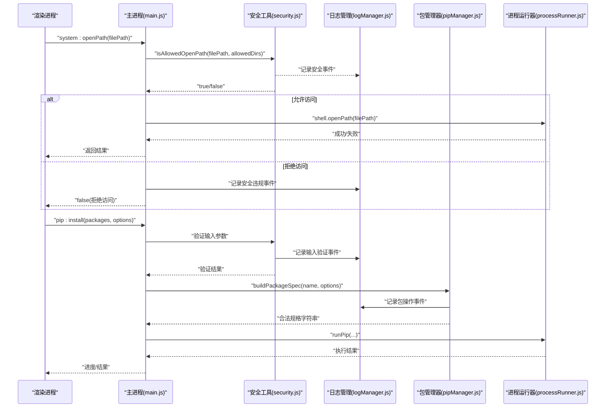
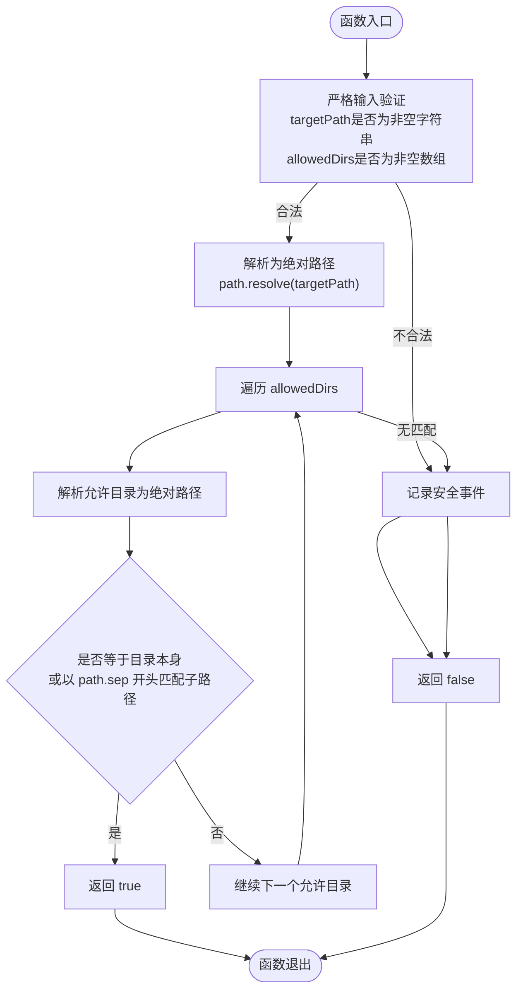
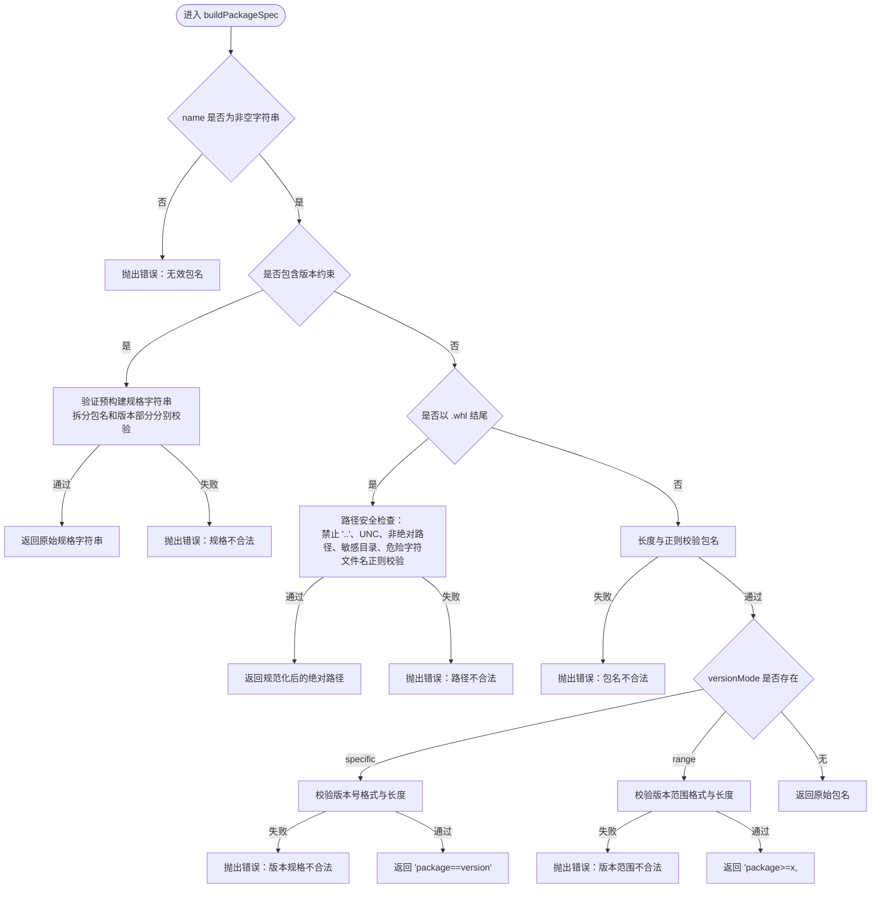
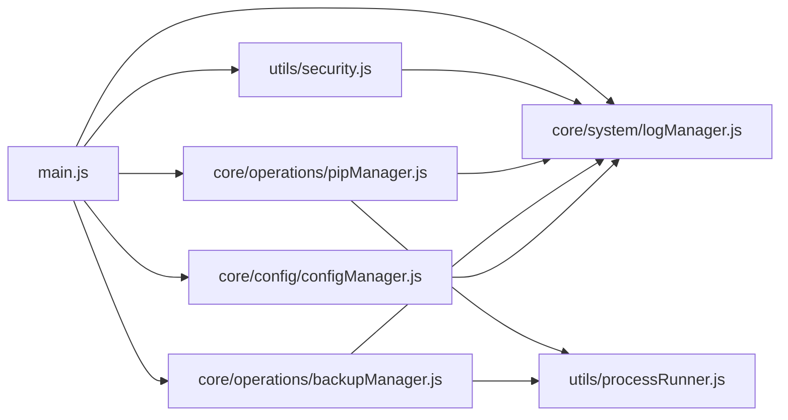

# 安全工具 (security.js)

<cite>
**本文引用的文件**   
- [utils/security.js](file://utils/security.js)
- [core/system/logManager.js](file://core/system/logManager.js)
- [main.js](file://main.js)
- [core/operations/pipManager.js](file://core/operations/pipManager.js)
- [core/operations/backupManager.js](file://core/operations/backupManager.js)
- [core/config/configManager.js](file://core/config/configManager.js)
- [utils/processRunner.js](file://utils/processRunner.js)
</cite>

## 更新摘要
**变更内容**   
- 增强了 security.js 的输入验证机制，支持所有用户输入的全面安全检查
- 强化了路径遍历攻击防护，提供更严格的目录访问控制
- 实现了命令注入检测与防护机制
- 集成了 logManager.js 进行结构化日志记录和错误跟踪
- 优化了安全文件操作处理流程

## 目录
1. [简介](#简介)
2. [项目结构](#项目结构)
3. [核心组件](#核心组件)
4. [架构总览](#架构总览)
5. [详细组件分析](#详细组件分析)
6. [依赖关系分析](#依赖关系分析)
7. [性能与安全特性](#性能与安全特性)
8. [故障排查指南](#故障排查指南)
9. [结论](#结论)
10. [附录：安全配置与最佳实践](#附录：安全配置与最佳实践)

## 简介
本文件为 PyLibMaster 的安全工具模块文档，聚焦 utils/security.js 提供的增强型安全验证能力。该模块现在包含全面的输入验证、路径遍历防护、命令注入检测和特殊字符过滤功能。通过与 logManager.js 的深度集成，实现了完整的结构化日志记录和错误跟踪机制，为 Electron 应用提供健壮的访问控制与输入净化体系。

## 项目结构
本项目采用分层安全架构设计：
- **安全工具层**：utils/security.js 提供基础安全验证函数
- **日志管理层**：core/system/logManager.js 负责结构化日志记录
- **业务操作层**：core/operations 下的各管理器实现具体业务逻辑
- **系统配置层**：core/config 管理应用配置和权限设置
- **进程执行层**：utils/processRunner.js 处理外部命令执行

**图表来源** 
- [main.js:23](file://main.js#L23)
- [utils/security.js:1-43](file://utils/security.js#L1-L43)
- [core/system/logManager.js:1-176](file://core/system/logManager.js#L1-L176)
- [core/operations/pipManager.js:1-200](file://core/operations/pipManager.js#L1-L200)
- [core/operations/backupManager.js:1-196](file://core/operations/backupManager.js#L1-L196)
- [core/config/configManager.js:1-194](file://core/config/configManager.js#L1-L194)
- [utils/processRunner.js:1-200](file://utils/processRunner.js#L1-L200)

## 核心组件
- **增强的路径安全校验（isAllowedOpenPath）**：提供严格的目录白名单验证，防止路径遍历攻击
- **全面输入验证机制**：对所有用户输入进行类型、长度、格式和内容检查
- **命令注入防护系统**：检测并阻止恶意命令注入尝试
- **安全文件操作处理**：确保文件操作的绝对路径验证和权限检查
- **结构化日志集成**：与 logManager.js 集成，记录所有安全相关事件
- **包名与版本规范校验**：通过正则与长度限制，确保 pip 规格字符串合法
- **备份 ID 校验**：拒绝包含路径分隔符或".."的非法标识
- **配置值清洗**：对数值型配置进行范围裁剪与类型校验

**章节来源**
- [utils/security.js:1-43](file://utils/security.js#L1-L43)
- [core/system/logManager.js:115-134](file://core/system/logManager.js#L115-L134)
- [core/operations/pipManager.js:154-235](file://core/operations/pipManager.js#L154-L235)
- [core/operations/backupManager.js:62-78](file://core/operations/backupManager.js#L62-L78)
- [core/config/configManager.js:35-44](file://core/config/configManager.js#L35-L44)
- [utils/processRunner.js:66-161](file://utils/processRunner.js#L66-L161)

## 架构总览
下图展示从渲染进程到主进程 IPC 处理器，再到安全校验、日志记录和核心模块的完整调用链路。重点体现增强的输入验证、路径遍历防护和结构化日志记录。

**图表来源** 
- [main.js:470-487](file://main.js#L470-L487)
- [utils/security.js:28-40](file://utils/security.js#L28-L40)
- [core/system/logManager.js:115-134](file://core/system/logManager.js#L115-L134)
- [core/operations/pipManager.js:154-235](file://core/operations/pipManager.js#L154-L235)
- [utils/processRunner.js:85-161](file://utils/processRunner.js#L85-L161)

## 详细组件分析

### 增强的路径安全校验（isAllowedOpenPath）
**更新** 增强了输入验证和路径遍历防护机制

- **功能要点**
  - 严格的参数有效性检查：验证 targetPath 为非空字符串，allowedDirs 为非空数组
  - 绝对路径解析：使用 path.resolve 消除相对路径组件（如 ".."）
  - 精确目录匹配：要求目标路径是允许目录的子路径，避免前缀误判
  - 边界情况处理：对非法输入直接拒绝，不产生任何副作用

- **适用场景**
  - 主进程的"打开路径"接口，限制用户只能访问文档、下载、用户数据目录等白名单位置
  - 文件选择对话框的路径验证
  - 外部链接打开前的安全检查

- **安全收益**
  - 有效防御路径遍历攻击（../、..\\ 等）
  - 防止恶意构造的路径逃逸到受限目录之外
  - 避免敏感系统目录被意外访问

**图表来源** 
- [utils/security.js:28-40](file://utils/security.js#L28-L40)

**章节来源**
- [utils/security.js:1-43](file://utils/security.js#L1-L43)
- [main.js:470-487](file://main.js#L470-L487)

### 包名与版本安全校验（pipManager.buildPackageSpec）
**更新** 增强了命令注入检测和特殊字符过滤

- **功能要点**
  - 针对 wheel 文件路径：禁止 ".."、UNC 路径、非绝对路径、敏感目录、危险字符；文件名需符合 .whl 命名规范
  - 针对包名：长度上限、正则校验（字母数字及有限符号），版本模式支持 exact/range，均进行格式与长度校验
  - 预构建规格字符串支持：支持已包含版本约束的规格字符串（如 "numpy==1.26.0"、"flask>=2.0"）
  - 危险字符检测：使用 WHEEL_PATH_BLOCKED_CHARS 正则检测 shell 元字符

- **安全收益**
  - 防止通过包名或 wheel 路径注入 shell 元字符或访问敏感文件系统
  - 保证传递给 pip 的参数始终处于受控白名单内
  - 避免命令注入攻击和路径遍历漏洞

**图表来源** 
- [core/operations/pipManager.js:154-235](file://core/operations/pipManager.js#L154-L235)

**章节来源**
- [core/operations/pipManager.js:129-235](file://core/operations/pipManager.js#L129-L235)

### 备份 ID 校验（backupManager.validateBackupId）
**更新** 强化了路径遍历防护

- **功能要点**
  - 类型与长度校验，拒绝空串与超长 ID（最大 255 字符）
  - 明确禁止路径分隔符与 ".."，阻断路径遍历尝试
  - 使用 path.basename 规范化后，再按正则校验最终 ID 格式（backup_*.txt）
  - 严格的格式验证：只允许 backup_ 前缀的 .txt 文件

- **安全收益**
  - 确保备份文件操作只作用于预期目录内的合法文件，避免任意文件读取/删除
  - 防止通过恶意备份 ID 进行路径遍历攻击

**章节来源**
- [core/operations/backupManager.js:62-78](file://core/operations/backupManager.js#L62-L78)

### 配置值清洗（configManager.sanitizeValue）
**更新** 增强了配置安全性

- **功能要点**
  - 根据 key 对应的 RANGE_LIMITS 进行类型与范围裁剪，非法值回退到默认值
  - 批量设置时逐项清洗，减少磁盘写入次数
  - 支持多种数据类型的安全转换和验证

- **安全收益**
  - 防止越界配置导致系统不稳定或资源耗尽
  - 确保配置值的类型安全和数值范围合理

**章节来源**
- [core/config/configManager.js:35-44](file://core/config/configManager.js#L35-L44)
- [core/config/configManager.js:157-178](file://core/config/configManager.js#L157-L178)

### 结构化日志集成（logManager.addLog）
**新增** 与 security.js 的深度集成

- **功能要点**
  - 自动添加时间戳和操作状态
  - 字段长度截断保护（最大 1000 字符）
  - 新日志插入到数组开头（最新的在前）
  - 超过最大条数（2000 条）时裁剪旧日志
  - 防抖写入机制（300ms 延迟）避免频繁磁盘 I/O

- **安全收益**
  - 记录所有安全相关事件，便于审计和故障排查
  - 防止日志文件过大影响系统性能
  - 确保关键安全事件的持久化存储

**章节来源**
- [core/system/logManager.js:115-134](file://core/system/logManager.js#L115-L134)
- [core/system/logManager.js:69-86](file://core/system/logManager.js#L69-L86)

### 子进程执行封装（processRunner.runCommand）
**更新** 增强了命令执行安全性

- **功能要点**
  - 统一创建子进程，设置 UTF-8 编码，清理 ANSI 转义序列
  - 支持超时自动终止（SIGTERM + SIGKILL）、按 operationId 批量取消、活跃进程跟踪
  - 错误信息聚合 stdout/stderr，便于诊断
  - 集成日志记录，追踪所有命令执行

- **安全收益**
  - 限制外部命令执行窗口，避免长时间占用与僵尸进程
  - 统一输出清洗，降低终端注入风险
  - 提供完整的命令执行审计轨迹

**章节来源**
- [utils/processRunner.js:66-161](file://utils/processRunner.js#L66-L161)
- [utils/processRunner.js:168-200](file://utils/processRunner.js#L168-L200)

## 依赖关系分析
**更新** 增强了模块间的依赖关系和日志集成

- 主进程 main.js 引入 security.isAllowedOpenPath，并在 system:openPath 中实施白名单校验
- pipManager 依赖 processRunner 执行 pip 命令，并通过自身校验逻辑保障参数安全
- backupManager 对备份 ID 进行严格校验，确保文件操作安全
- configManager 提供配置值的清洗与持久化，避免非法配置影响系统稳定性
- **新增** 所有安全相关模块都集成 logManager 进行结构化日志记录

**图表来源** 
- [main.js:23](file://main.js#L23)
- [core/operations/pipManager.js:25](file://core/operations/pipManager.js#L25)
- [core/operations/backupManager.js:22](file://core/operations/backupManager.js#L22)
- [core/config/configManager.js:17](file://core/config/configManager.js#L17)
- [utils/processRunner.js:1-20](file://utils/processRunner.js#L1-L20)

**章节来源**
- [main.js:1-661](file://main.js#L1-L661)

## 性能与安全特性
**更新** 增强了性能监控和安全特性

- **路径校验性能**：O(n) 比较允许目录列表，n 通常为少量固定目录，开销极低
- **输入验证性能**：包名/版本校验基于正则与长度判断，时间复杂度接近 O(m)，m 为输入长度
- **日志性能优化**：防抖写入机制（300ms）避免频繁磁盘 I/O，字段截断防止大对象写入
- **进程执行优化**：具备超时与取消机制，避免长期阻塞；ANSI 清理提升日志可读性
- **内存管理**：日志数组大小限制（2000 条），防止内存泄漏
- **并发安全**：环境级操作互斥锁，避免并发冲突

## 故障排查指南
**更新** 增加了日志相关的故障排查指导

- **打开路径被拒绝**
  - 现象：system:openPath 返回 false
  - 排查：确认 filePath 是否在 allowedDirs（文档、下载、用户数据目录）内；检查路径是否包含 ".." 或相对路径未正确解析
  - 日志检查：查看 logManager 中的安全事件记录

- **包安装失败（参数不合法）**
  - 现象：buildPackageSpec 抛出错误
  - 排查：检查包名是否符合正则、wheel 路径是否为绝对路径且不含危险字符、版本规格是否合法
  - 日志检查：查看 pipManager 中的包操作事件记录

- **备份操作失败（ID 不合法）**
  - 现象：validateBackupId 抛出错误
  - 排查：确认备份 ID 不包含路径分隔符与 ".."，长度在允许范围内，且 basename 后符合正则
  - 日志检查：查看 backupManager 中的备份操作事件记录

- **子进程超时或被取消**
  - 现象：runCommand 抛出超时错误或进程被取消
  - 排查：检查 timeout 设置、operationId 是否正确、是否有并发冲突；查看 stderr 输出定位原因
  - 日志检查：查看 processRunner 中的命令执行记录

- **日志记录失败**
  - 现象：logManager.addLog 抛出错误或日志未持久化
  - 排查：检查日志目录权限、磁盘空间、JSON 文件格式完整性
  - 解决方案：使用 flushLogs() 强制同步保存，检查 getLogsDir() 返回的路径

**章节来源**
- [main.js:470-487](file://main.js#L470-L487)
- [utils/security.js:28-40](file://utils/security.js#L28-L40)
- [core/operations/pipManager.js:154-235](file://core/operations/pipManager.js#L154-L235)
- [core/operations/backupManager.js:62-78](file://core/operations/backupManager.js#L62-L78)
- [utils/processRunner.js:85-161](file://utils/processRunner.js#L85-L161)
- [core/system/logManager.js:115-134](file://core/system/logManager.js#L115-L134)

## 结论
PyLibMaster 的安全工具模块经过重大升级，以最小权限原则为核心，围绕"输入净化—路径白名单—参数白名单—进程执行约束—结构化日志"形成完整的闭环防护体系。增强的 isAllowedOpenPath、全面的包名/版本校验、严格的备份 ID 校验、智能的配置值清洗以及与 logManager.js 的深度集成，有效抵御路径遍历、命令注入、非法配置等常见安全风险。统一的子进程执行封装和结构化日志记录进一步提升了系统的健壮性、可观测性和可维护性。

## 附录：安全配置与最佳实践
**更新** 增加了日志集成和结构化安全监控的最佳实践

- **最小权限原则**
  - 仅在必要处启用 Node 集成，保持上下文隔离；对外部链接打开进行协议白名单限制
  - 使用严格的目录白名单，仅允许访问必要的系统目录

- **输入净化与输出编码**
  - 对所有用户输入进行类型、长度、格式和内容校验
  - 对输出进行 HTML/Markdown/CSV 转义或模板化处理，避免注入
  - 使用正则表达式验证包名、版本号和文件路径格式

- **路径与文件访问**
  - 使用绝对路径与白名单目录；禁止 UNC 路径与敏感目录访问
  - 对文件名进行正则校验，防止路径遍历攻击
  - 实现严格的目录边界检查，避免前缀匹配误判

- **命令参数白名单**
  - 仅允许已知安全的 pip 子命令与参数组合
  - 对版本规格进行严格正则校验，防止命令注入
  - 检测并阻止 shell 元字符和危险字符

- **进程与资源控制**
  - 设置合理超时与重试上限；支持按操作 ID 取消
  - 清理 ANSI 输出，避免终端污染
  - 实现环境级操作互斥锁，避免并发冲突

- **配置安全**
  - 数值型配置必须限定范围；配置文件损坏时自动重建默认配置
  - 原子写入避免部分更新；批量设置时逐项清洗

- **结构化日志记录**
  - 记录所有安全相关事件，包括输入验证、路径访问、命令执行
  - 实现日志字段长度截断，防止大对象写入
  - 使用防抖机制优化日志写入性能
  - 定期清理过期日志，控制存储空间使用

- **安全监控与审计**
  - 建立完整的安全事件审计轨迹
  - 实现异常行为的自动检测和告警
  - 提供安全日志导出和分析工具