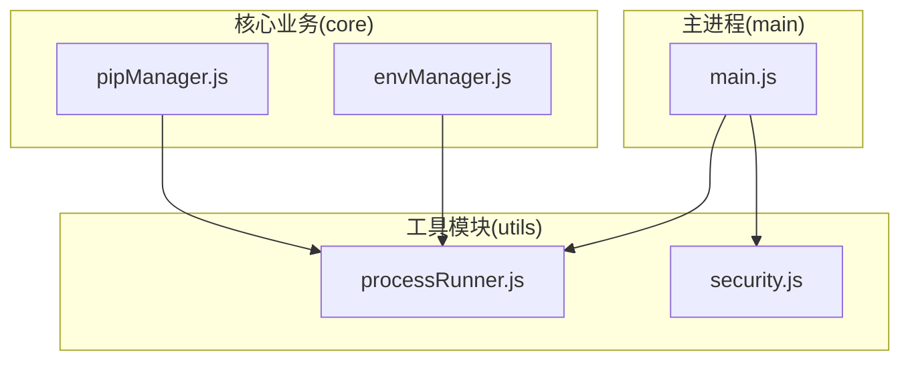
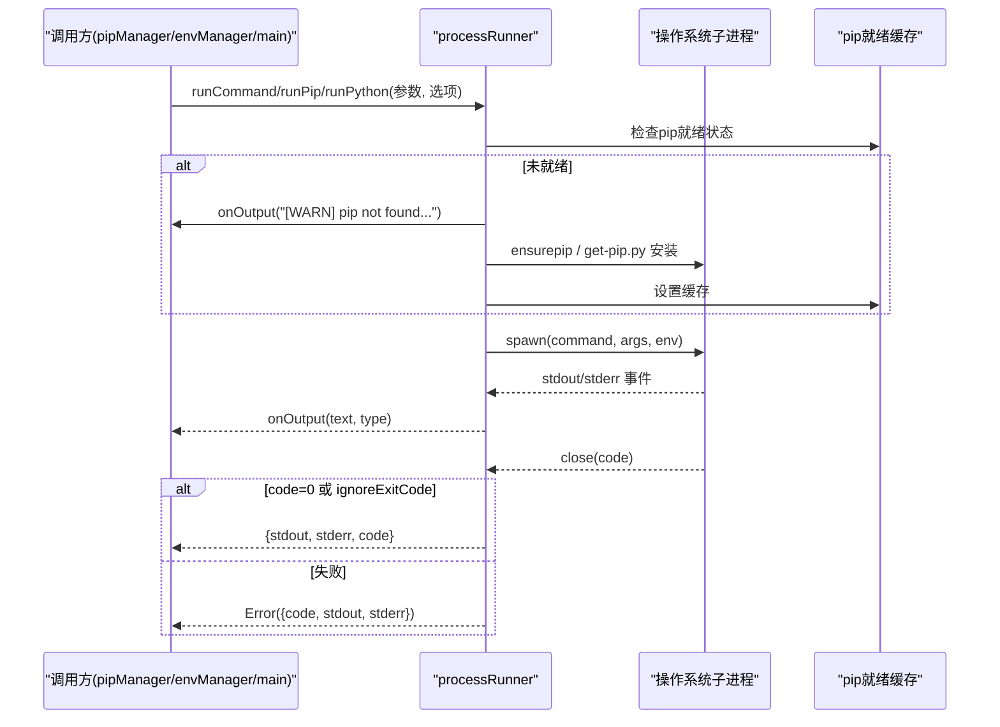
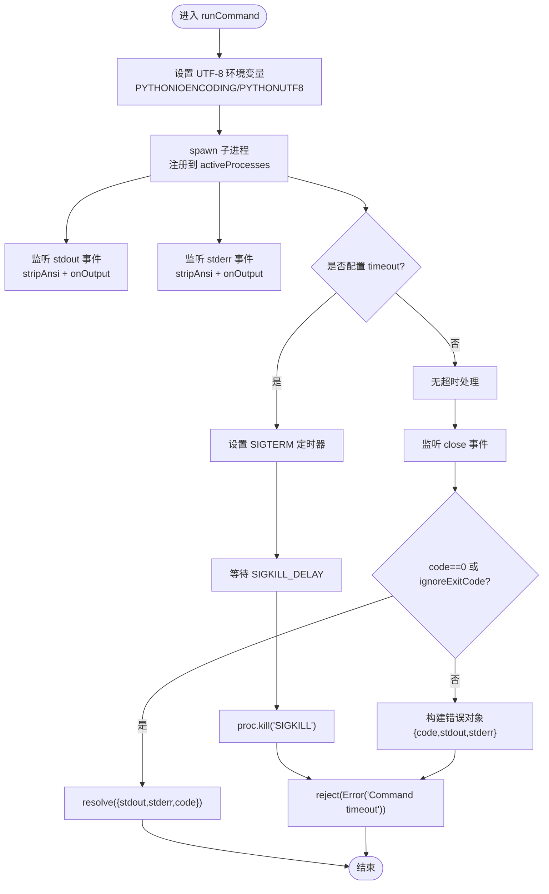
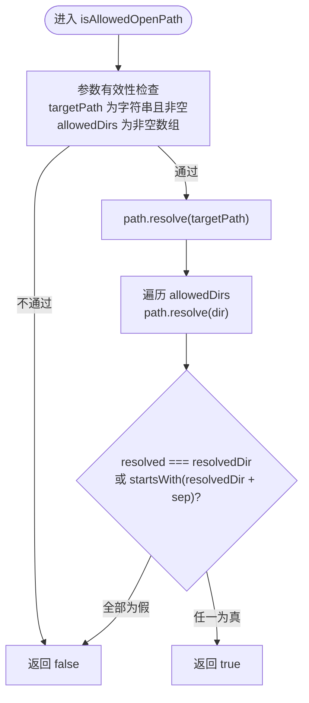
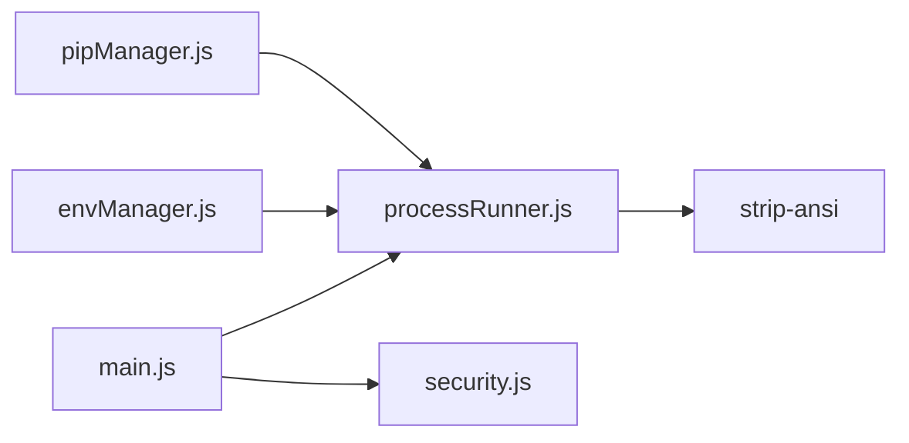

# 工具模块设计

<cite>
**本文引用的文件**   
- [processRunner.js](file://utils/processRunner.js)
- [security.js](file://utils/security.js)
- [package.json](file://package.json)
- [main.js](file://main.js)
- [pipManager.js](file://core/operations/pipManager.js)
- [envManager.js](file://core/system/envManager.js)
</cite>

## 目录
1. [简介](#简介)
2. [项目结构](#项目结构)
3. [核心组件](#核心组件)
4. [架构总览](#架构总览)
5. [详细组件分析](#详细组件分析)
6. [依赖关系分析](#依赖关系分析)
7. [性能考量](#性能考量)
8. [故障排查指南](#故障排查指南)
9. [结论](#结论)
10. [附录：使用示例与扩展指南](#附录使用示例与扩展指南)

## 简介
本文件为 PyLibMaster 的工具模块设计文档，聚焦 utils/ 目录下的两个关键工具模块：
- processRunner.js：子进程运行器与 pip/Python 命令封装，提供统一的进程创建、生命周期管理、超时处理、实时输出捕获与取消机制。
- security.js：安全工具函数，提供路径安全检查，防止路径遍历攻击，确保用户只能访问允许的目录范围。

文档将从系统架构、组件职责、数据流、错误处理、性能优化等维度进行深入解析，并提供使用示例与扩展建议，帮助读者快速理解并复用这些工具模块。

## 项目结构
PyLibMaster 采用模块化组织方式，工具模块位于 utils/ 目录，被 core/ 业务模块与 main.js 主进程广泛引用。下图展示了工具模块在整体架构中的位置与主要调用方。

图表来源
- [processRunner.js:1-366](file://utils/processRunner.js#L1-L366)
- [security.js:1-43](file://utils/security.js#L1-L43)
- [pipManager.js:1-800](file://core/operations/pipManager.js#L1-L800)
- [envManager.js:1-200](file://core/system/envManager.js#L1-L200)
- [main.js:1-200](file://main.js#L1-L200)

章节来源
- [package.json:1-79](file://package.json#L1-L79)

## 核心组件
- processRunner.js
  - 统一封装 spawn 子进程执行，支持 UTF-8 编码、ANSI 清理、超时终止（SIGTERM + SIGKILL）、活跃进程跟踪与批量取消。
  - 提供 runCommand、runPip、runPython 快捷方法，以及 ensurePip 自动安装策略（缓存、ensurepip、get-pip.py）。
  - 维护活跃进程 Map，支持按 processId 或 operationId 取消操作。
- security.js
  - 提供 isAllowedOpenPath 路径校验，基于 path.resolve 与边界检查，防止路径穿越攻击。

章节来源
- [processRunner.js:1-366](file://utils/processRunner.js#L1-L366)
- [security.js:1-43](file://utils/security.js#L1-L43)

## 架构总览
工具模块通过单一职责原则实现高内聚、低耦合：
- processRunner.js 专注进程管理与 pip/Python 命令执行，屏蔽底层细节。
- security.js 专注输入与路径安全校验，避免业务层重复实现。
- 上层模块（如 pipManager、envManager）通过调用工具模块完成具体任务，降低耦合度，提升可测试性与可维护性。

图表来源
- [processRunner.js:85-161](file://utils/processRunner.js#L85-L161)
- [processRunner.js:233-278](file://utils/processRunner.js#L233-L278)

## 详细组件分析

### processRunner.js 进程管理封装
- 子进程创建与生命周期
  - 使用 spawn 创建子进程，强制设置 PYTHONIOENCODING/PYTHONUTF8 环境变量，确保 UTF-8 输出。
  - 注册到 activeProcesses Map，记录 processId、operationId、startTime，便于追踪与取消。
- 实时输出捕获与 ANSI 清理
  - 监听 stdout/stderr data 事件，使用 strip-ansi 清理 ANSI 转义序列，回调 onOutput(text, type)。
- 超时处理与两级终止
  - 若配置 timeout，先发送 SIGTERM，延迟 SIGKILL_DELAY（默认 5 秒）后发送 SIGKILL，确保资源释放。
- 活跃进程取消
  - cancelProcess(processId)：按进程 ID 取消。
  - cancelOperation(operationId)：按操作 ID 批量取消（适用于一次 pip 操作的多个子进程）。
  - cancelAllProcesses()：应用退出时清理所有活跃进程。
- pip 自动安装策略
  - ensurePip(pythonPath, onOutput)：优先检查缓存；其次直接检测；然后尝试 python -m ensurepip --upgrade；最后下载 get-pip.py 安装。
  - downloadGetPip()：多源下载（主站与 GitHub 备用），支持重定向与超时重试。
- 便捷接口
  - runPip(pythonPath, args, options)：封装 python -m pip。
  - runPython(pythonPath, args, options)：封装 Python 命令。

图表来源
- [processRunner.js:85-161](file://utils/processRunner.js#L85-L161)
- [processRunner.js:150-159](file://utils/processRunner.js#L150-L159)

章节来源
- [processRunner.js:1-366](file://utils/processRunner.js#L1-L366)

### security.js 安全工具函数
- 路径安全检查
  - isAllowedOpenPath(targetPath, allowedDirs)：将目标路径解析为绝对路径，并与允许目录列表进行精确匹配或子路径检查（包含分隔符边界），防止 "../" 等相对路径绕过。
  - 输入有效性检查：非字符串或空值直接拒绝；allowedDirs 必须为非空数组。
- 适用场景
  - 文件打开/保存对话框的白名单校验。
  - 限制用户仅能访问指定目录，避免路径遍历攻击。

图表来源
- [security.js:28-40](file://utils/security.js#L28-L40)

章节来源
- [security.js:1-43](file://utils/security.js#L1-L43)

### 工具模块的复用性与单一职责
- 单一职责原则
  - processRunner.js 只负责进程与命令执行，不关心业务逻辑；security.js 只负责路径安全校验，不关心其他安全策略。
- 高内聚低耦合
  - 上层模块通过明确接口调用工具模块，减少重复代码，提高可测试性与可维护性。
- 可扩展性
  - 新增命令类型（如 node、npm）可通过 runCommand 统一封装；新增安全策略可在 security.js 中扩展独立函数。

章节来源
- [processRunner.js:1-366](file://utils/processRunner.js#L1-L366)
- [security.js:1-43](file://utils/security.js#L1-L43)

## 依赖关系分析
- 外部依赖
  - strip-ansi：用于清理终端 ANSI 色彩序列，锁定版本 ^6.0.1 以兼容 CommonJS require。
- 内部依赖
  - pipManager.js、envManager.js、main.js 均依赖 processRunner.js。
  - main.js 依赖 security.js 进行路径安全校验。

图表来源
- [package.json:20-27](file://package.json#L20-L27)
- [pipManager.js:26](file://core/operations/pipManager.js#L26)
- [envManager.js:22](file://core/system/envManager.js#L22)
- [main.js:23](file://main.js#L23)
- [main.js:163](file://main.js#L163)

章节来源
- [package.json:1-79](file://package.json#L1-L79)
- [pipManager.js:1-800](file://core/operations/pipManager.js#L1-L800)
- [envManager.js:1-200](file://core/system/envManager.js#L1-L200)
- [main.js:1-200](file://main.js#L1-L200)

## 性能考量
- 缓存策略
  - pip 就绪状态缓存（PIP_READY_TTL=5分钟），避免重复检测。
  - site-packages 路径缓存（SITE_PACKAGES_CACHE_TTL=30秒），加速包大小估算。
- I/O 与网络
  - get-pip.py 下载支持多源与超时重试，降低网络失败概率。
  - 文件写入与读取使用同步 API 保证一致性，但需注意阻塞风险（仅在必要时使用）。
- 并发控制
  - 环境级互斥锁（envLocks）确保同一 Python 环境的操作串行执行，避免并发冲突。
- 内存与资源
  - 活跃进程 Map 及时清理，避免内存泄漏。
  - 超时与两级终止确保僵尸进程被回收。

[本节为通用指导，不直接分析具体文件]

## 故障排查指南
- 常见错误与处理
  - 命令超时：检查 timeout 配置与 onOutput 日志，确认子进程是否正常响应。
  - pip 不可用：查看 ensurePip 流程日志，确认 ensurepip 与 get-pip.py 安装是否成功。
  - 路径不安全：isAllowedOpenPath 返回 false，检查 targetPath 与 allowedDirs 配置。
- 日志与调试
  - 使用 onOutput 回调收集 stdout/stderr，定位问题。
  - 在 main.js 的 before-quit 事件中调用 cancelAllProcesses，确保退出时清理进程。
- 回滚与备份
  - pipManager 在安装/卸载失败时触发自动回滚，结合 backupManager 恢复环境状态。

章节来源
- [processRunner.js:85-161](file://utils/processRunner.js#L85-L161)
- [processRunner.js:233-278](file://utils/processRunner.js#L233-L278)
- [security.js:28-40](file://utils/security.js#L28-L40)
- [main.js:161-170](file://main.js#L161-L170)

## 结论
PyLibMaster 的工具模块通过清晰的分层与单一职责设计，实现了高内聚、低耦合的代码结构。processRunner.js 提供了强大的进程管理能力，security.js 确保了路径安全，二者共同支撑了上层业务模块的稳定与高效。建议在扩展新功能时遵循相同的设计原则，保持模块的可维护性与可测试性。

[本节为总结，不直接分析具体文件]

## 附录：使用示例与扩展指南
- 使用示例
  - 执行 pip 命令：调用 runPip(pythonPath, ['install', 'package'], { timeout: 60000, onOutput })。
  - 执行 Python 脚本：调用 runPython(pythonPath, ['script.py'], { cwd: '/path/to/project' })。
  - 路径安全检查：调用 isAllowedOpenPath('/home/user/docs/file.txt', ['/home/user/docs'])。
- 扩展指南
  - 新增命令封装：在 processRunner.js 中添加 runXxx 方法，复用 runCommand。
  - 新增安全策略：在 security.js 中增加独立函数，保持单一职责。
  - 集成到业务模块：在 pipManager/envManager 中调用工具模块，避免重复实现。

章节来源
- [processRunner.js:340-353](file://utils/processRunner.js#L340-L353)
- [security.js:28-40](file://utils/security.js#L28-L40)
- [pipManager.js:495-578](file://core/operations/pipManager.js#L495-L578)
- [envManager.js:48-71](file://core/system/envManager.js#L48-L71)