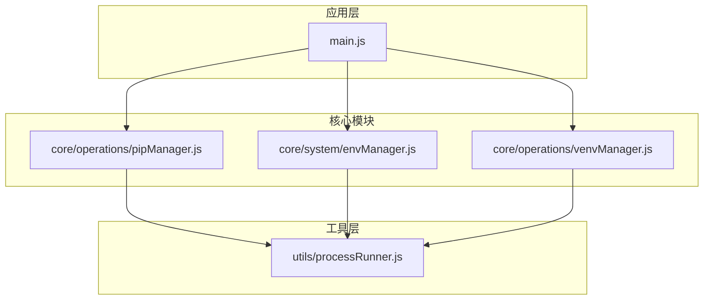
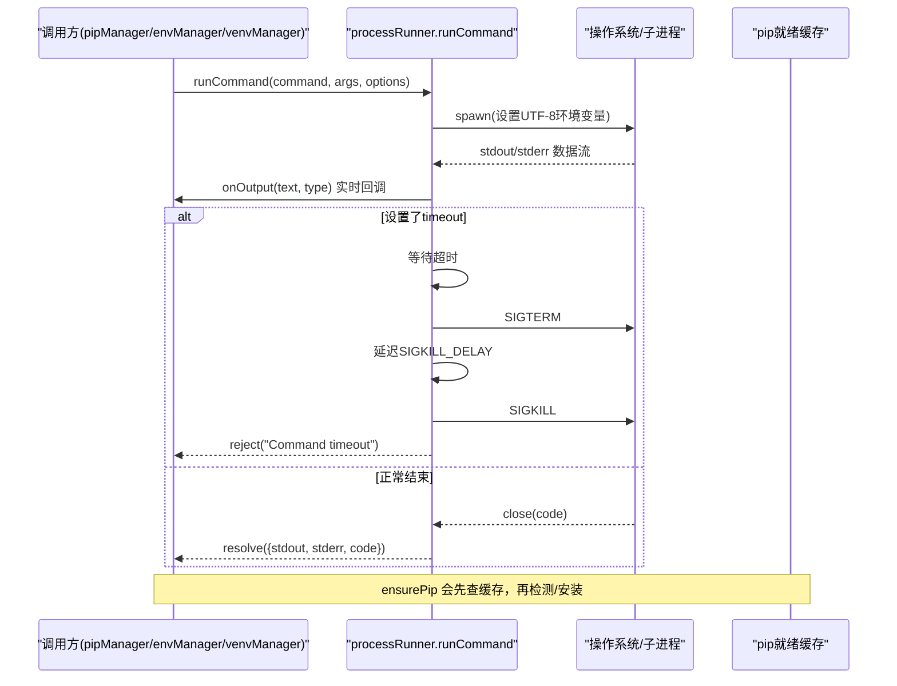
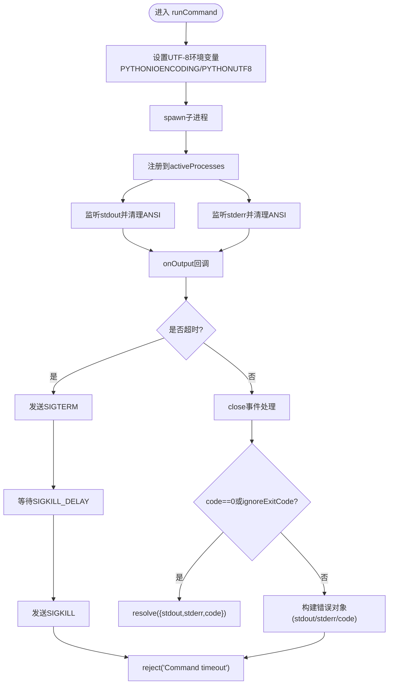
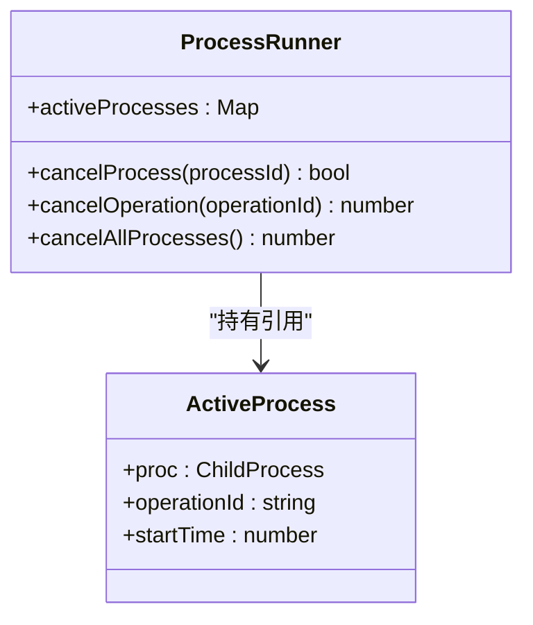
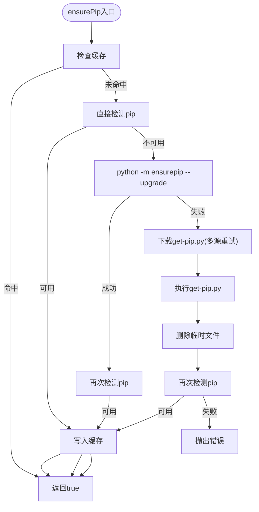
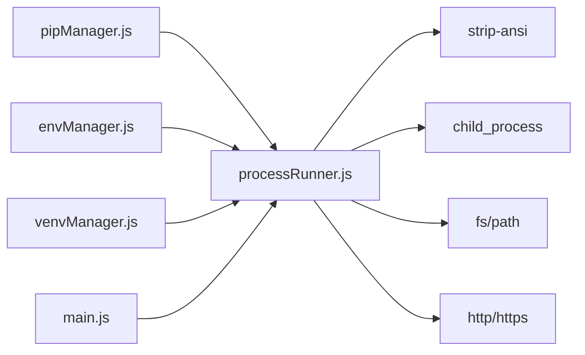

# 进程运行器 (processRunner.js)

<cite>
**本文引用的文件**   
- [utils/processRunner.js](file://utils/processRunner.js)
- [core/operations/pipManager.js](file://core/operations/pipManager.js)
- [core/system/envManager.js](file://core/system/envManager.js)
- [core/operations/venvManager.js](file://core/operations/venvManager.js)
- [main.js](file://main.js)
- [package.json](file://package.json)
</cite>

## 目录
1. [简介](#简介)
2. [项目结构](#项目结构)
3. [核心组件](#核心组件)
4. [架构总览](#架构总览)
5. [详细组件分析](#详细组件分析)
6. [依赖关系分析](#依赖关系分析)
7. [性能考量](#性能考量)
8. [故障排查指南](#故障排查指南)
9. [结论](#结论)
10. [附录：使用示例与最佳实践](#附录使用示例与最佳实践)

## 简介
本模块为 PyLibMaster 的“进程运行器”，负责统一封装子进程的创建、执行、超时与取消、实时输出捕获与 ANSI 清理，以及 pip 自动安装策略（ensurepip → get-pip.py）。它通过 operationId 实现批量操作取消，并通过环境变量设置保证 UTF-8 编码与跨平台兼容性。该模块被多个核心业务模块复用，是系统稳定运行的关键基础设施。

## 项目结构
- utils/processRunner.js：进程运行器核心实现
- core/operations/pipManager.js：包管理（大量调用 runPip、ensurePip、cancelOperation）
- core/system/envManager.js：Python 环境检测（调用 runCommand/runPython）
- core/operations/venvManager.js：虚拟环境管理（调用 runCommand/runPython）
- main.js：应用主进程，退出前调用 cancelAllProcesses 清理活跃进程
- package.json：声明 strip-ansi 依赖及版本锁定原因

图表来源
- [main.js:163-167](file://main.js#L163-L167)
- [core/operations/pipManager.js:26](file://core/operations/pipManager.js#L26)
- [core/system/envManager.js:22](file://core/system/envManager.js#L22)
- [core/operations/venvManager.js:20](file://core/operations/venvManager.js#L20)
- [utils/processRunner.js:1-20](file://utils/processRunner.js#L1-L20)

章节来源
- [utils/processRunner.js:1-20](file://utils/processRunner.js#L1-L20)
- [package.json:20-27](file://package.json#L20-L27)

## 核心组件
- 子进程执行器 runCommand
  - 支持超时（SIGTERM + SIGKILL 两级终止）、实时输出回调、ANSI 清理、UTF-8 环境变量注入、Windows 控制台隐藏
  - 返回 Promise，包含 stdout、stderr、code
- 进程跟踪与取消
  - activeProcesses 维护 processId -> { proc, operationId, startTime }
  - cancelProcess、cancelOperation、cancelAllProcesses 提供细粒度到全局的取消能力
- pip 自动安装 ensurePip
  - 缓存 → 直接检测 → ensurepip → 下载 get-pip.py（多源重试）→ 校验可用性
- 便捷方法
  - runPip(pythonPath, args, options)、runPython(pythonPath, args, options)
- 辅助功能
  - checkPipAvailable、clearPipReadyCache、downloadGetPip

章节来源
- [utils/processRunner.js:85-161](file://utils/processRunner.js#L85-L161)
- [utils/processRunner.js:168-206](file://utils/processRunner.js#L168-L206)
- [utils/processRunner.js:213-278](file://utils/processRunner.js#L213-L278)
- [utils/processRunner.js:286-331](file://utils/processRunner.js#L286-L331)
- [utils/processRunner.js:340-353](file://utils/processRunner.js#L340-L353)

## 架构总览
下图展示了从上层模块到进程运行器的调用链，以及进程生命周期与取消流程。

图表来源
- [utils/processRunner.js:85-161](file://utils/processRunner.js#L85-L161)
- [utils/processRunner.js:213-278](file://utils/processRunner.js#L213-L278)

## 详细组件分析

### 子进程执行器 runCommand
- 功能要点
  - 强制 UTF-8 编码：PYTHONIOENCODING=utf-8、PYTHONUTF8=1
  - Windows 隐藏控制台窗口：windowsHide=true
  - 标准输出/错误事件处理：stripAnsi 清理 ANSI 色彩序列后回调
  - 错误与退出处理：非零退出码时构造带 stdout/stderr 的错误对象
  - 超时机制：先 SIGTERM，延迟 5 秒后 SIGKILL，确保彻底终止
  - 进程跟踪：注册到 activeProcesses，支持按 processId 或 operationId 取消
- 复杂度与内存
  - stdout/stderr 字符串拼接，长时间大输出可能占用较多内存；建议上层按需消费 onOutput 并限制累积长度
- 错误处理
  - 进程 error/close 事件均进行清理，避免资源泄漏
  - 超时拒绝时附带明确错误信息

图表来源
- [utils/processRunner.js:85-161](file://utils/processRunner.js#L85-L161)

章节来源
- [utils/processRunner.js:85-161](file://utils/processRunner.js#L85-L161)

### 进程跟踪与取消
- activeProcesses 以 Map 存储进程元数据，支持：
  - cancelProcess(processId)：向指定进程发送 SIGTERM
  - cancelOperation(operationId)：按操作 ID 批量取消所有关联进程
  - cancelAllProcesses()：应用退出时清理全部活跃进程
- 典型用法
  - pipManager 在执行批量操作时为每个子进程设置相同的 operationId，从而在一次用户取消中中断整个任务集

图表来源
- [utils/processRunner.js:168-206](file://utils/processRunner.js#L168-L206)

章节来源
- [utils/processRunner.js:168-206](file://utils/processRunner.js#L168-L206)
- [main.js:163-167](file://main.js#L163-L167)

### pip 自动安装策略 ensurePip
- 策略优先级
  1. 检查缓存（按 pythonPath 缓存 5 分钟）
  2. 直接检测 pip 可用性
  3. 尝试 python -m ensurepip --upgrade
  4. 下载 get-pip.py（多源重试：主站与 GitHub 备用源），执行安装并清理临时文件
  5. 再次检测 pip 可用性，成功则写入缓存
- 多源下载与错误恢复
  - 若当前 URL 失败/重定向/非 200，递归尝试下一个 URL
  - 下载超时 30 秒，失败则继续下一个源
- 异常处理
  - 任一阶段失败记录日志并继续下一方案
  - 全部失败抛出错误提示手动安装

图表来源
- [utils/processRunner.js:213-278](file://utils/processRunner.js#L213-L278)
- [utils/processRunner.js:286-331](file://utils/processRunner.js#L286-L331)

章节来源
- [utils/processRunner.js:213-278](file://utils/processRunner.js#L213-L278)
- [utils/processRunner.js:286-331](file://utils/processRunner.js#L286-L331)

### 便捷方法与辅助函数
- runPip：封装 python -m pip 调用，透传 options（如 timeout、onOutput、operationId）
- runPython：封装任意 Python 脚本执行
- checkPipAvailable：快速检测 pip 是否可用
- clearPipReadyCache：清空 pip 就绪状态缓存（用于测试或环境变化后刷新）

章节来源
- [utils/processRunner.js:340-353](file://utils/processRunner.js#L340-L353)
- [utils/processRunner.js:213-220](file://utils/processRunner.js#L213-L220)
- [utils/processRunner.js:60-63](file://utils/processRunner.js#L60-L63)

## 依赖关系分析
- 内部依赖
  - strip-ansi：用于清理终端 ANSI 转义序列（颜色等）
  - child_process.spawn：创建子进程
  - fs/path/os/http/https：文件系统与网络下载
- 外部调用
  - 上层模块通过 require 引用 processRunner 暴露的方法
  - 在应用退出时，main.js 调用 cancelAllProcesses 清理活跃进程

图表来源
- [utils/processRunner.js:13-18](file://utils/processRunner.js#L13-L18)
- [package.json:20-27](file://package.json#L20-L27)
- [core/operations/pipManager.js:26](file://core/operations/pipManager.js#L26)
- [core/system/envManager.js:22](file://core/system/envManager.js#L22)
- [core/operations/venvManager.js:20](file://core/operations/venvManager.js#L20)
- [main.js:163-167](file://main.js#L163-L167)

章节来源
- [package.json:20-27](file://package.json#L20-L27)

## 性能考量
- 输出缓冲与内存
  - stdout/stderr 在进程内累积，长时间运行的大输出可能导致内存增长；建议上层对 onOutput 做节流或截断，避免无限拼接
- 超时与信号
  - 默认 SIGTERM + 5 秒后 SIGKILL 的两级终止，确保僵尸进程不会残留
- 缓存
  - pip 就绪状态缓存 TTL 5 分钟，减少重复检测开销
- I/O 与网络
  - get-pip.py 下载采用多源重试与 30 秒超时，提升成功率与鲁棒性

[本节为通用指导，不直接分析具体文件]

## 故障排查指南
- 常见错误
  - 命令超时：检查 timeout 配置是否合理，必要时增大或优化命令逻辑
  - pip 不可用且自动安装失败：确认网络可达、ensurepip 可用、get-pip.py 下载源可访问
  - ANSI 乱码：确认 strip-ansi 已正确引入，终端输出是否包含控制字符
  - 进程未释放：检查是否在错误路径上遗漏 cleanup，或主动调用 cancelAllProcesses
- 定位手段
  - 利用 onOutput 打印进度与中间结果
  - 使用 operationId 批量取消相关进程
  - 在应用退出时观察 cancelAllProcesses 返回值，确认是否有未清理进程

章节来源
- [utils/processRunner.js:85-161](file://utils/processRunner.js#L85-L161)
- [utils/processRunner.js:168-206](file://utils/processRunner.js#L168-L206)
- [utils/processRunner.js:213-278](file://utils/processRunner.js#L213-L278)

## 结论
processRunner.js 提供了健壮、可观测、可取消的子进程执行框架，结合 pip 自动安装策略与环境变量设置，显著提升了 PyLibMaster 的稳定性与用户体验。其清晰的接口设计与完善的错误处理，使其成为系统各模块可靠的基础设施。

[本节为总结，不直接分析具体文件]

## 附录：使用示例与最佳实践

- 基本命令执行
  - 使用 runCommand 执行任意命令，传入 timeout、onOutput、operationId 等选项
  - 参考路径：[utils/processRunner.js:85-161](file://utils/processRunner.js#L85-L161)
- 异步回调处理
  - 通过 onOutput 接收实时文本，区分 'stdout'/'stderr'，用于 UI 进度展示
  - 参考路径：[utils/processRunner.js:116-127](file://utils/processRunner.js#L116-L127)
- 错误处理
  - 捕获 Promise 拒绝，读取 err.stdout/err.stderr/err.code 进行诊断
  - 参考路径：[utils/processRunner.js:136-148](file://utils/processRunner.js#L136-L148)
- 性能监控
  - 基于 startTime 计算执行时长，结合 onOutput 统计吞吐
  - 参考路径：[utils/processRunner.js:101](file://utils/processRunner.js#L101)
- 批量操作取消
  - 为同一批操作分配相同 operationId，调用 cancelOperation 一次性中断
  - 参考路径：[utils/processRunner.js:181-191](file://utils/processRunner.js#L181-L191)
- pip 自动安装
  - 在执行 pip 前调用 ensurePip，自动选择 ensurepip/get-pip.py 安装
  - 参考路径：[utils/processRunner.js:233-278](file://utils/processRunner.js#L233-L278)
- 环境变量设置（UTF-8）
  - 自动注入 PYTHONIOENCODING=utf-8、PYTHONUTF8=1，避免中文乱码
  - 参考路径：[utils/processRunner.js:88](file://utils/processRunner.js#L88)
- 跨平台兼容
  - Windows 隐藏控制台窗口 windowsHide=true；路径与命令适配由上层模块处理
  - 参考路径：[utils/processRunner.js:93-98](file://utils/processRunner.js#L93-L98)
- 内存管理优化
  - 对长输出进行消费式处理（仅保留必要片段），避免无界拼接
  - 参考路径：[utils/processRunner.js:116-127](file://utils/processRunner.js#L116-L127)

章节来源
- [utils/processRunner.js:85-161](file://utils/processRunner.js#L85-L161)
- [utils/processRunner.js:181-191](file://utils/processRunner.js#L181-L191)
- [utils/processRunner.js:233-278](file://utils/processRunner.js#L233-L278)