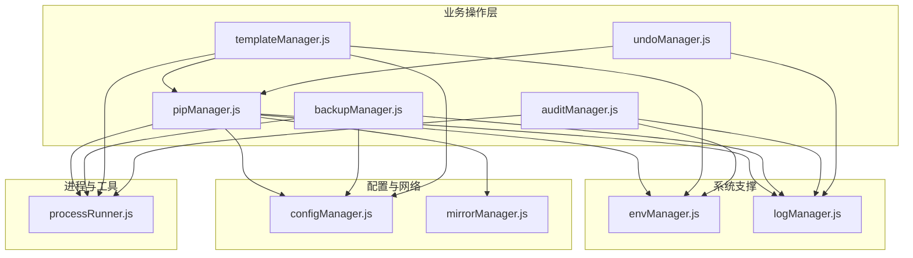
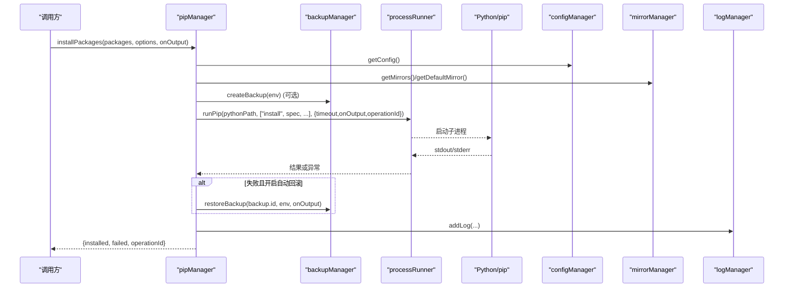
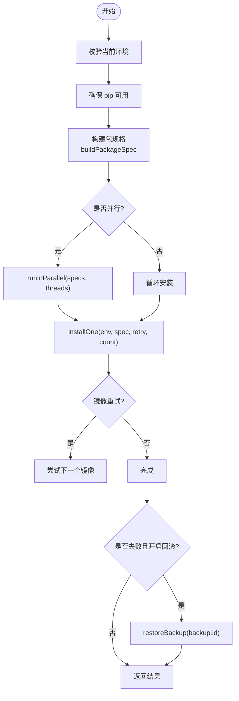
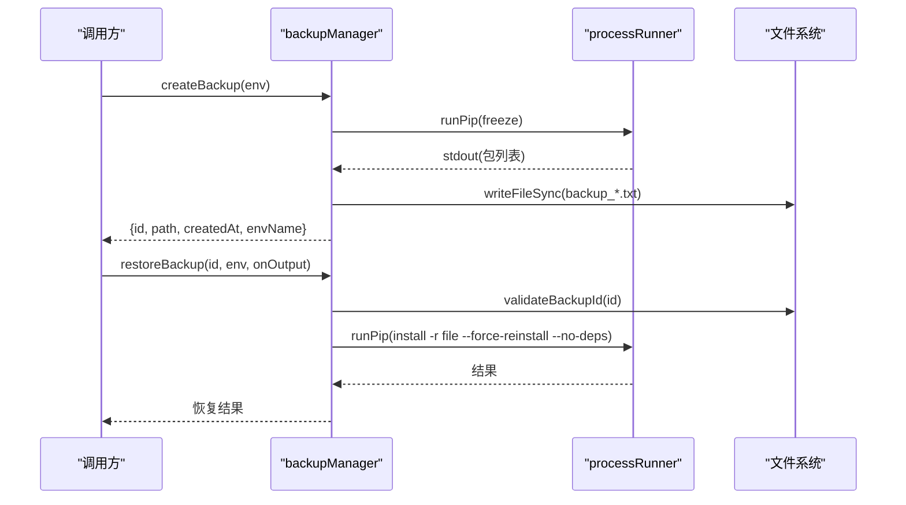
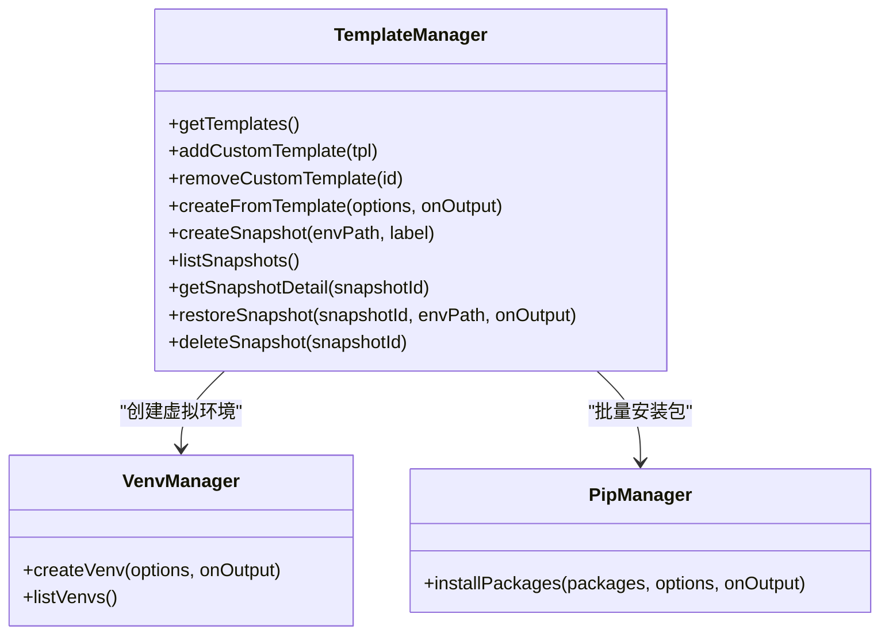
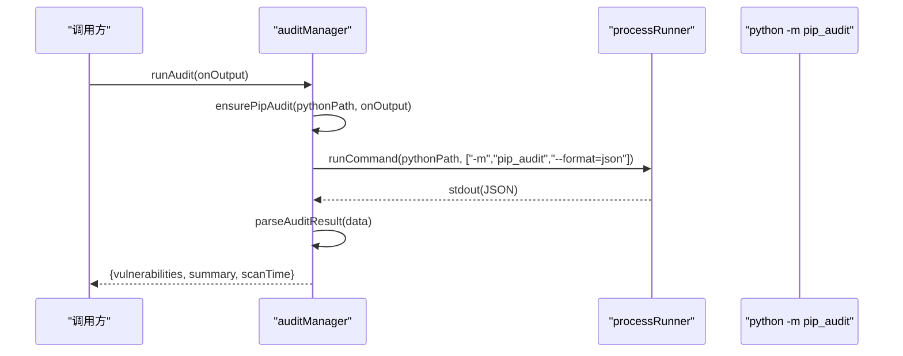
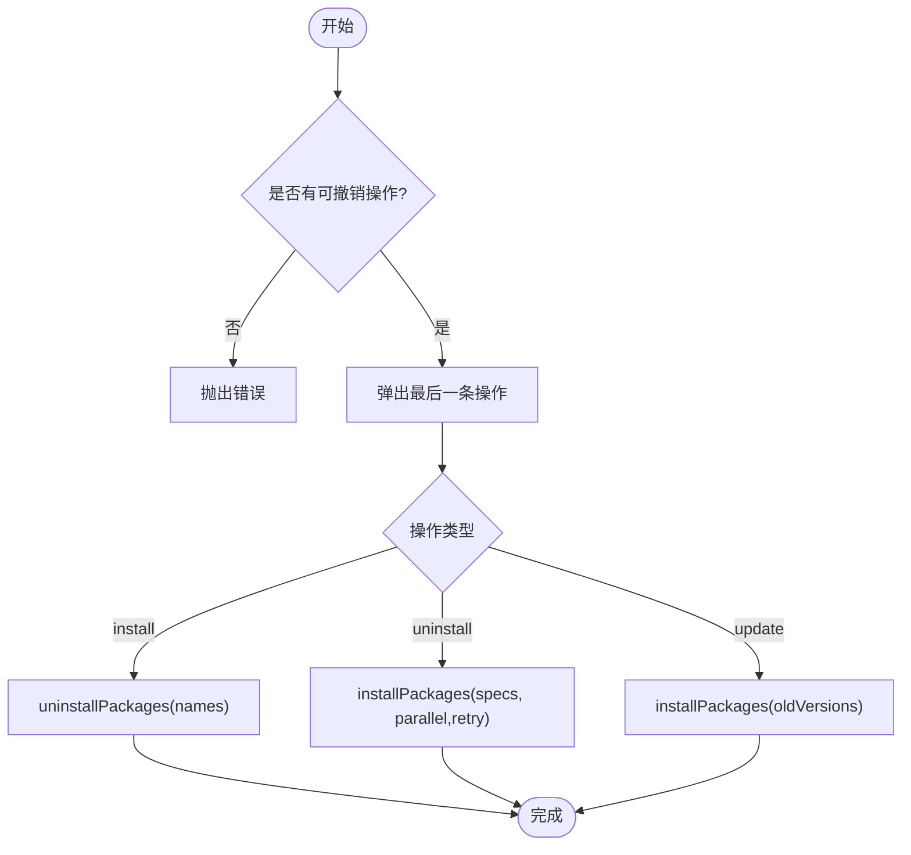
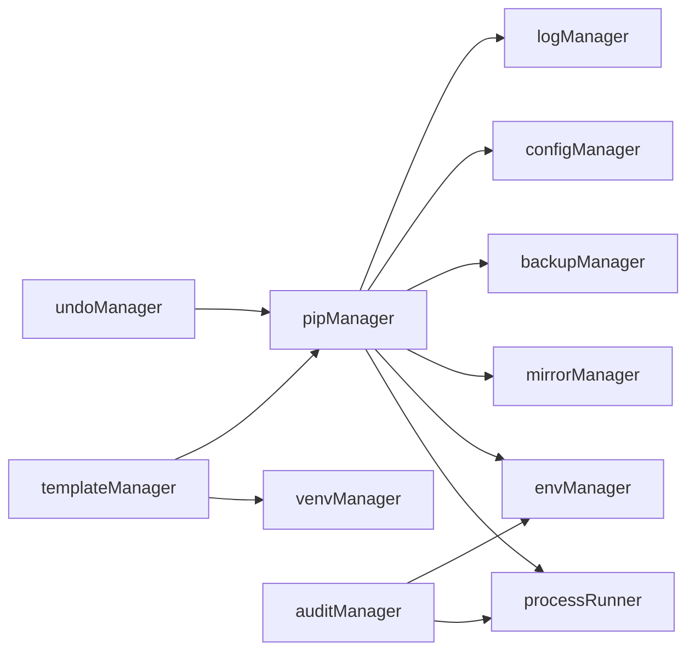

# 业务操作层

<cite>
**本文引用的文件**   
- [pipManager.js](file://core/operations/pipManager.js)
- [backupManager.js](file://core/operations/backupManager.js)
- [templateManager.js](file://core/operations/templateManager.js)
- [auditManager.js](file://core/operations/auditManager.js)
- [undoManager.js](file://core/operations/undoManager.js)
- [processRunner.js](file://utils/processRunner.js)
- [envManager.js](file://core/system/envManager.js)
- [configManager.js](file://core/config/configManager.js)
- [mirrorManager.js](file://core/config/mirrorManager.js)
- [logManager.js](file://core/system/logManager.js)
</cite>

## 目录
1. [简介](#简介)
2. [项目结构](#项目结构)
3. [核心组件](#核心组件)
4. [架构总览](#架构总览)
5. [详细组件分析](#详细组件分析)
6. [依赖关系分析](#依赖关系分析)
7. [性能考量](#性能考量)
8. [故障排查指南](#故障排查指南)
9. [结论](#结论)
10. [附录：扩展接口与最佳实践](#附录扩展接口与最佳实践)

## 简介
本文件面向 PyLibMaster 的业务操作层，聚焦以下模块的实现细节与使用方式：
- pipManager.js：包安装、卸载、更新、查询、依赖解析、版本控制、批量与并行执行、错误重试与自动回滚。
- backupManager.js：备份恢复机制（环境快照、包列表导出、数据完整性校验、增量策略）。
- templateManager.js：模板系统（预设模板、自定义模板、环境快照创建与恢复）。
- auditManager.js：安全审计（漏洞扫描、依赖冲突检测、健康检查）。
- undoManager.js：撤销机制（操作历史栈、可回滚）。
同时给出业务模块扩展接口与最佳实践建议。

## 项目结构
业务操作层位于 core/operations，围绕 Python 环境与 pip 生态提供统一封装；底层通过 utils/processRunner 管理子进程与 pip 生命周期，system 层提供环境、日志等基础设施，config 层提供镜像源与配置管理。

图表来源
- [pipManager.js:1-120](file://core/operations/pipManager.js#L1-L120)
- [backupManager.js:1-60](file://core/operations/backupManager.js#L1-L60)
- [templateManager.js:1-80](file://core/operations/templateManager.js#L1-L80)
- [auditManager.js:1-60](file://core/operations/auditManager.js#L1-L60)
- [undoManager.js:1-40](file://core/operations/undoManager.js#L1-L40)
- [processRunner.js:1-60](file://utils/processRunner.js#L1-L60)
- [envManager.js:1-40](file://core/system/envManager.js#L1-L40)
- [configManager.js:1-60](file://core/config/configManager.js#L1-L60)
- [mirrorManager.js:1-40](file://core/config/mirrorManager.js#L1-L40)
- [logManager.js:1-40](file://core/system/logManager.js#L1-L40)

章节来源
- [pipManager.js:1-120](file://core/operations/pipManager.js#L1-L120)
- [processRunner.js:1-120](file://utils/processRunner.js#L1-L120)
- [envManager.js:1-80](file://core/system/envManager.js#L1-L80)
- [configManager.js:1-120](file://core/config/configManager.js#L1-L120)
- [mirrorManager.js:1-120](file://core/config/mirrorManager.js#L1-L120)
- [logManager.js:1-120](file://core/system/logManager.js#L1-L120)

## 核心组件
- pipManager：包管理的核心，提供安装/卸载/更新/查询/依赖/导出导入/对比/下载/离线能力，内置并发、重试、回滚、进度事件、取消操作、磁盘占用分析等。
- backupManager：基于 pip freeze 的备份与恢复，支持列出/删除备份，ID 安全校验。
- templateManager：内置多领域模板一键创建虚拟环境并安装包；支持自定义模板与环境快照（时间旅行式恢复）。
- auditManager：基于 pip-audit 的安全扫描，自动安装依赖、缓存结果、解析输出、生成修复建议。
- undoManager：维护最近 N 条操作的撤销栈，支持撤销安装/卸载/更新。

章节来源
- [pipManager.js:470-580](file://core/operations/pipManager.js#L470-L580)
- [backupManager.js:80-120](file://core/operations/backupManager.js#L80-L120)
- [templateManager.js:110-160](file://core/operations/templateManager.js#L110-L160)
- [auditManager.js:50-120](file://core/operations/auditManager.js#L50-L120)
- [undoManager.js:60-110](file://core/operations/undoManager.js#L60-L110)

## 架构总览
下图展示关键调用链与数据流：用户触发操作 → 业务管理器 → 进程运行器 → pip/Python 命令 → 日志/配置/镜像源 → 返回结果与进度。

图表来源
- [pipManager.js:495-578](file://core/operations/pipManager.js#L495-L578)
- [processRunner.js:340-342](file://utils/processRunner.js#L340-L342)
- [backupManager.js:89-113](file://core/operations/backupManager.js#L89-L113)
- [configManager.js:140-148](file://core/config/configManager.js#L140-L148)
- [mirrorManager.js:110-118](file://core/config/mirrorManager.js#L110-L118)
- [logManager.js:112-131](file://core/system/logManager.js#L112-L131)

## 详细组件分析

### pipManager 包管理详解
- 包查询
  - listInstalled/listInstalledCached：实时或缓存读取已安装包，估算大小与安装时间，写入缓存。
  - listOutdated：获取可更新包列表。
  - searchPackage：通过 pip index versions 搜索可用版本（兼容 pip 21.2+）。
- 包安装
  - installPackages：支持批量、并行、智能重试（多镜像源）、自动回滚、进度回调、取消操作。
  - installFromFile：从 .whl 或 requirements.txt 安装，带安全校验与回滚。
  - buildPackageSpec：构建 pip 规格字符串，支持 latest/specific/range 模式与 wheel 路径安全校验。
- 包卸载
  - uninstallPackages：批量卸载，支持安全模式与自动回滚。
- 包更新
  - updatePackages：批量更新，支持并行、智能重试、自动回滚。
  - updateOne：检测“Requirement already satisfied”避免误判成功。
- 依赖与版本
  - showPackageInfo/getDependencyTree：获取包详情与依赖树（限制深度）。
  - exportRequirements/importRequirements：导出/导入 requirements。
  - compareEnvironments/diffRequirements：环境差异与需求差异对比。
  - getFullDependencyGraph：全局依赖图（缓存）。
  - checkConflicts：基于 pip check 的依赖冲突检测。
  - healthCheck：综合健康检查（包元数据、site-packages、冲突等）。
- 其他
  - downloadPackages：离线下载包到指定目录。
  - repairPip：修复 pip（ensurepip/get-pip.py）。
  - cancelPipOperation：按 operationId 取消进程。
  - getDiskUsage：统计 site-packages 占用。

图表来源
- [pipManager.js:495-578](file://core/operations/pipManager.js#L495-L578)
- [pipManager.js:590-615](file://core/operations/pipManager.js#L590-L615)
- [pipManager.js:912-924](file://core/operations/pipManager.js#L912-L924)
- [backupManager.js:156-170](file://core/operations/backupManager.js#L156-L170)

章节来源
- [pipManager.js:382-441](file://core/operations/pipManager.js#L382-L441)
- [pipManager.js:495-578](file://core/operations/pipManager.js#L495-L578)
- [pipManager.js:627-712](file://core/operations/pipManager.js#L627-L712)
- [pipManager.js:727-771](file://core/operations/pipManager.js#L727-L771)
- [pipManager.js:787-867](file://core/operations/pipManager.js#L787-L867)
- [pipManager.js:874-904](file://core/operations/pipManager.js#L874-L904)
- [pipManager.js:1006-1077](file://core/operations/pipManager.js#L1006-L1077)
- [pipManager.js:1086-1135](file://core/operations/pipManager.js#L1086-L1135)
- [pipManager.js:1143-1182](file://core/operations/pipManager.js#L1143-L1182)
- [pipManager.js:1190-1212](file://core/operations/pipManager.js#L1190-L1212)
- [pipManager.js:1224-1263](file://core/operations/pipManager.js#L1224-L1263)
- [pipManager.js:1273-1320](file://core/operations/pipManager.js#L1273-L1320)
- [pipManager.js:1391-1435](file://core/operations/pipManager.js#L1391-L1435)
- [pipManager.js:1442-1485](file://core/operations/pipManager.js#L1442-L1485)
- [pipManager.js:1492-1566](file://core/operations/pipManager.js#L1492-L1566)

### backupManager 备份恢复机制
- 创建备份：执行 pip freeze，保存为 backup_{环境名}_{时间戳}.txt。
- 列出/删除备份：过滤合法文件名，按时间排序。
- 恢复备份：使用 pip install -r --force-reinstall --no-deps 强制重装。
- 安全性：validateBackupId 防止路径遍历与非法格式。

图表来源
- [backupManager.js:89-113](file://core/operations/backupManager.js#L89-L113)
- [backupManager.js:156-170](file://core/operations/backupManager.js#L156-L170)
- [backupManager.js:122-142](file://core/operations/backupManager.js#L122-L142)
- [backupManager.js:179-193](file://core/operations/backupManager.js#L179-L193)

章节来源
- [backupManager.js:29-38](file://core/operations/backupManager.js#L29-L38)
- [backupManager.js:62-78](file://core/operations/backupManager.js#L62-L78)
- [backupManager.js:89-113](file://core/operations/backupManager.js#L89-L113)
- [backupManager.js:122-142](file://core/operations/backupManager.js#L122-L142)
- [backupManager.js:156-170](file://core/operations/backupManager.js#L156-L170)
- [backupManager.js:179-193](file://core/operations/backupManager.js#L179-L193)

### templateManager 模板系统与快照
- 预设模板：Web(Flask/Django)、数据分析、机器学习、爬虫、自动化办公等。
- 自定义模板：增删改查，持久化到配置。
- 一键创建：创建 venv → 查找 pythonPath → 批量安装模板包（并行、重试、无回滚）。
- 环境快照：freeze 记录包列表，JSON 存储；支持列出/详情/恢复/删除。

图表来源
- [templateManager.js:72-110](file://core/operations/templateManager.js#L72-L110)
- [templateManager.js:118-154](file://core/operations/templateManager.js#L118-L154)
- [templateManager.js:175-209](file://core/operations/templateManager.js#L175-L209)
- [templateManager.js:257-292](file://core/operations/templateManager.js#L257-L292)

章节来源
- [templateManager.js:23-66](file://core/operations/templateManager.js#L23-L66)
- [templateManager.js:72-110](file://core/operations/templateManager.js#L72-L110)
- [templateManager.js:118-154](file://core/operations/templateManager.js#L118-L154)
- [templateManager.js:175-209](file://core/operations/templateManager.js#L175-L209)
- [templateManager.js:215-236](file://core/operations/templateManager.js#L215-L236)
- [templateManager.js:257-292](file://core/operations/templateManager.js#L257-L292)

### auditManager 安全审计
- 自动安装 pip-audit（若缺失），执行 python -m pip_audit --format=json。
- 解析 JSON 输出，推断严重程度，汇总统计，缓存 10 分钟。
- 记录扫描日志，支持获取缓存结果与清空缓存。

图表来源
- [auditManager.js:31-47](file://core/operations/auditManager.js#L31-L47)
- [auditManager.js:54-119](file://core/operations/auditManager.js#L54-L119)
- [auditManager.js:126-187](file://core/operations/auditManager.js#L126-L187)

章节来源
- [auditManager.js:31-47](file://core/operations/auditManager.js#L31-L47)
- [auditManager.js:54-119](file://core/operations/auditManager.js#L54-L119)
- [auditManager.js:126-187](file://core/operations/auditManager.js#L126-L187)
- [auditManager.js:209-222](file://core/operations/auditManager.js#L209-L222)

### undoManager 撤销机制
- 记录类型：install/uninstall/update，最多保留 20 条。
- 撤销逻辑：
  - 撤销安装：卸载这些包。
  - 撤销卸载：重新安装（带版本号）。
  - 撤销更新：回退到旧版本（meta.oldVersions）。
- 失败保护：撤销失败时把操作放回栈顶。

图表来源
- [undoManager.js:22-33](file://core/operations/undoManager.js#L22-L33)
- [undoManager.js:66-106](file://core/operations/undoManager.js#L66-L106)

章节来源
- [undoManager.js:22-33](file://core/operations/undoManager.js#L22-L33)
- [undoManager.js:66-106](file://core/operations/undoManager.js#L66-L106)

## 依赖关系分析
- pipManager 强依赖 processRunner（子进程与 pip 生命周期）、envManager（当前环境）、mirrorManager（镜像源）、backupManager（回滚）、configManager（配置）、logManager（日志）。
- templateManager 依赖 venvManager（创建虚拟环境）与 pipManager（批量安装）。
- auditManager 依赖 processRunner（执行 pip-audit）与 envManager。
- undoManager 依赖 pipManager（执行逆向操作）。

图表来源
- [pipManager.js:1-40](file://core/operations/pipManager.js#L1-L40)
- [templateManager.js:1-20](file://core/operations/templateManager.js#L1-L20)
- [auditManager.js:1-20](file://core/operations/auditManager.js#L1-L20)
- [undoManager.js:1-20](file://core/operations/undoManager.js#L1-L20)

章节来源
- [pipManager.js:1-40](file://core/operations/pipManager.js#L1-L40)
- [templateManager.js:1-20](file://core/operations/templateManager.js#L1-L20)
- [auditManager.js:1-20](file://core/operations/auditManager.js#L1-L20)
- [undoManager.js:1-20](file://core/operations/undoManager.js#L1-L20)

## 性能考量
- 并发与队列：pipManager.runInParallel 限制并发线程数，避免过多子进程导致资源争用。
- 缓存策略：
  - 已安装包缓存（5 分钟 TTL）。
  - site-packages 路径缓存（30 秒 TTL）。
  - 依赖图缓存（5 分钟 TTL）。
  - 扫描结果缓存（10 分钟 TTL）。
- I/O 优化：
  - 一次性构建包目录映射表，减少重复 readdirSync。
  - 文件夹大小计算带缓存与最大递归深度限制。
- 超时与终止：processRunner 支持 SIGTERM/SIGKILL 两级终止，避免僵尸进程。
- 日志防抖：logManager 写盘防抖，降低频繁 IO。

章节来源
- [pipManager.js:87-127](file://core/operations/pipManager.js#L87-L127)
- [pipManager.js:226-248](file://core/operations/pipManager.js#L226-L248)
- [pipManager.js:260-314](file://core/operations/pipManager.js#L260-L314)
- [pipManager.js:1391-1435](file://core/operations/pipManager.js#L1391-L1435)
- [auditManager.js:20-24](file://core/operations/auditManager.js#L20-L24)
- [processRunner.js:150-160](file://utils/processRunner.js#L150-L160)
- [logManager.js:72-83](file://core/system/logManager.js#L72-L83)

## 故障排查指南
- pip 不可用
  - 现象：所有 pip 命令失败。
  - 处理：调用 repairPip 或 ensurePip，优先 ensurepip，其次 get-pip.py。
- 安装/更新失败
  - 现象：部分包失败，可能因镜像源问题。
  - 处理：启用 retry 与多镜像源重试；查看日志；必要时关闭并行逐个排查。
- 依赖冲突
  - 现象：checkConflicts 报告冲突。
  - 处理：根据冲突信息升级/降级相关包；使用 diffRequirements 对比需求。
- 备份/恢复失败
  - 现象：restoreBackup 报错。
  - 处理：确认备份 ID 合法性与文件存在；检查目标环境 pip 可用性。
- 撤销失败
  - 现象：performUndo 抛错。
  - 处理：检查操作栈是否为空；查看日志；失败会自动将操作放回栈顶。

章节来源
- [pipManager.js:950-996](file://core/operations/pipManager.js#L950-L996)
- [pipManager.js:1442-1485](file://core/operations/pipManager.js#L1442-L1485)
- [backupManager.js:156-170](file://core/operations/backupManager.js#L156-L170)
- [undoManager.js:66-106](file://core/operations/undoManager.js#L66-L106)

## 结论
PyLibMaster 业务操作层以 pipManager 为核心，结合 backup/template/audit/undo 四大模块，形成完整的包管理与环境治理能力。通过并发、重试、回滚、缓存与日志，兼顾性能与可靠性。扩展点清晰，便于按需增强功能。

## 附录：扩展接口与最佳实践
- 扩展点
  - 新增包操作：在 pipManager 中实现新 API（如批量导出/导入、离线安装），遵循现有参数约定与日志规范。
  - 自定义模板：通过 templateManager.addCustomTemplate 添加领域模板。
  - 自定义镜像源：mirrorManager.addCustomMirror 与 reorderMirrors 调整优先级。
  - 审计规则：auditManager.parseAuditResult 可扩展严重级别推断与字段映射。
- 最佳实践
  - 始终传入 operationId 以便批量取消。
  - 对敏感输入进行白名单校验（包名、wheel 路径、备份 ID）。
  - 大任务开启并行但限制并发度，避免资源耗尽。
  - 重要操作前开启自动回滚，确保一致性。
  - 合理设置超时与重试次数，平衡成功率与耗时。
  - 定期清理备份与快照，控制磁盘占用。
  - 使用日志筛选定位问题，关注 failed 状态条目。

章节来源
- [templateManager.js:83-98](file://core/operations/templateManager.js#L83-L98)
- [mirrorManager.js:139-150](file://core/config/mirrorManager.js#L139-L150)
- [auditManager.js:126-187](file://core/operations/auditManager.js#L126-L187)
- [pipManager.js:495-578](file://core/operations/pipManager.js#L495-L578)
- [logManager.js:112-131](file://core/system/logManager.js#L112-L131)