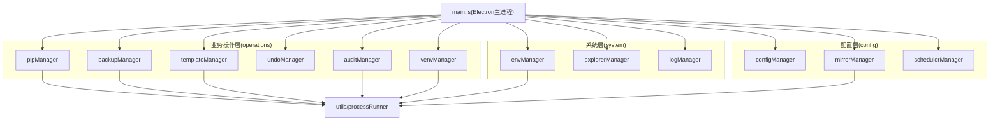
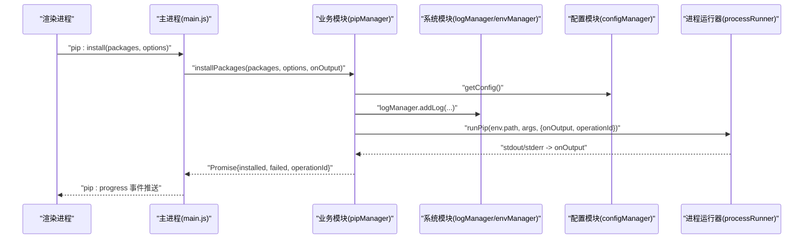
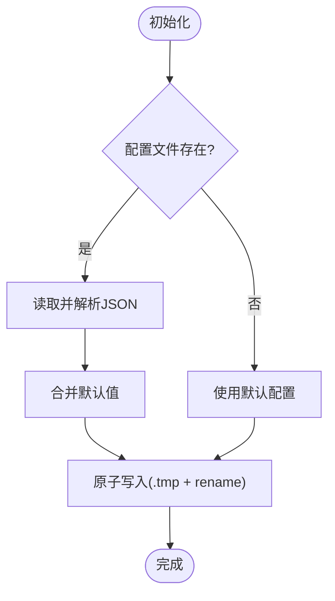
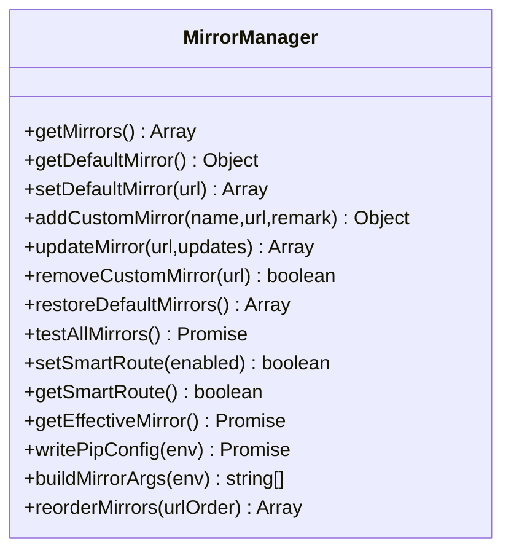
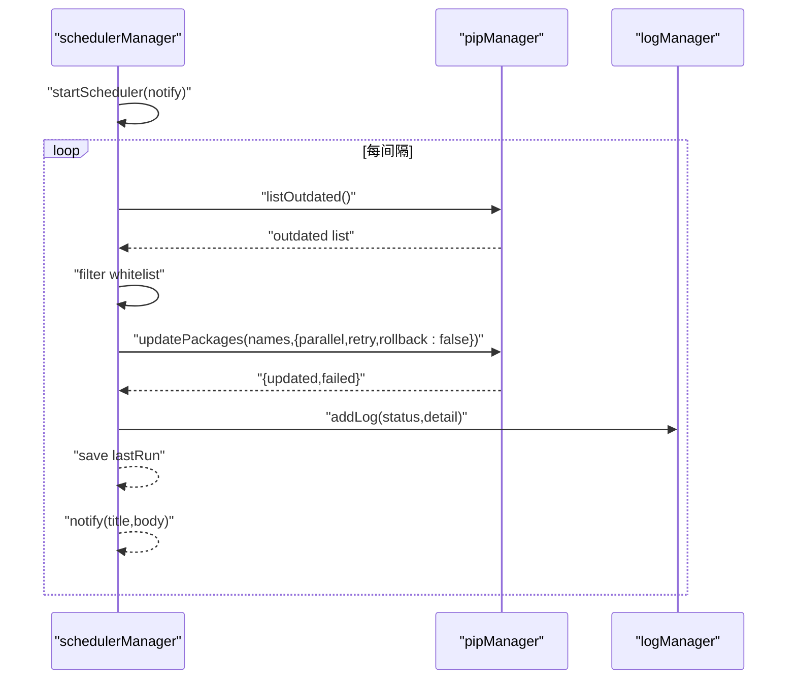
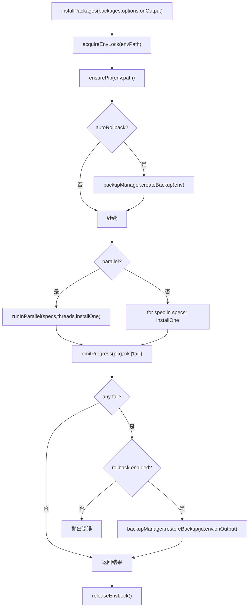
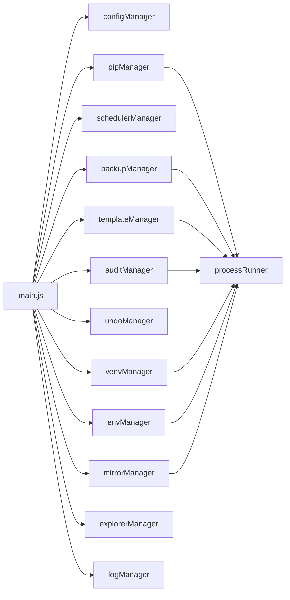

# 核心架构设计

<cite>
**本文引用的文件**   
- [main.js](file://main.js)
- [configManager.js](file://core/config/configManager.js)
- [mirrorManager.js](file://core/config/mirrorManager.js)
- [schedulerManager.js](file://core/config/schedulerManager.js)
- [pipManager.js](file://core/operations/pipManager.js)
- [backupManager.js](file://core/operations/backupManager.js)
- [templateManager.js](file://core/operations/templateManager.js)
- [undoManager.js](file://core/operations/undoManager.js)
- [venvManager.js](file://core/operations/venvManager.js)
- [auditManager.js](file://core/operations/auditManager.js)
- [envManager.js](file://core/system/envManager.js)
- [explorerManager.js](file://core/system/explorerManager.js)
- [logManager.js](file://core/system/logManager.js)
- [processRunner.js](file://utils/processRunner.js)
</cite>

## 目录
1. [引言](#引言)
2. [项目结构](#项目结构)
3. [核心组件](#核心组件)
4. [架构总览](#架构总览)
5. [详细组件分析](#详细组件分析)
6. [依赖关系分析](#依赖关系分析)
7. [性能考量](#性能考量)
8. [故障排查指南](#故障排查指南)
9. [结论](#结论)
10. [附录：扩展与最佳实践](#附录扩展与最佳实践)

## 引言
本文件系统化阐述 PyLibMaster 的核心架构，聚焦 core/ 目录下的三层模式：配置管理（config）、业务操作（operations）、系统功能（system）。文档将明确各层职责边界、接口契约、模块间通信协议（事件监听、回调、Promise），以及配置驱动的状态统一管理机制。同时给出模块扩展方法与最佳实践，帮助开发者快速理解并安全地扩展新功能。

## 项目结构
- 配置层（core/config）
  - configManager：应用配置的持久化、校验与批量更新
  - mirrorManager：PyPI 镜像源管理与智能路由
  - schedulerManager：定时自动更新调度器
- 业务操作层（core/operations）
  - pipManager：包查询、安装、卸载、更新、回滚、进度事件等核心能力
  - backupManager：环境备份与恢复
  - templateManager：模板创建环境与快照管理
  - undoManager：操作撤销栈
  - venvManager：虚拟环境生命周期管理
  - auditManager：安全漏洞扫描（基于 pip-audit）
- 系统层（core/system）
  - envManager：Python 环境检测与切换
  - explorerManager：Windows 资源管理器右键菜单集成
  - logManager：操作日志记录与查询
- 工具层（utils）
  - processRunner：子进程运行、超时、取消、pip 自动就绪保障

**图表来源** 
- [main.js:17-31](file://main.js#L17-L31)
- [configManager.js:1-194](file://core/config/configManager.js#L1-L194)
- [mirrorManager.js:1-376](file://core/config/mirrorManager.js#L1-L376)
- [schedulerManager.js:1-197](file://core/config/schedulerManager.js#L1-L197)
- [pipManager.js:1-800](file://core/operations/pipManager.js#L1-L800)
- [backupManager.js:1-196](file://core/operations/backupManager.js#L1-L196)
- [templateManager.js:1-320](file://core/operations/templateManager.js#L1-L320)
- [undoManager.js:1-131](file://core/operations/undoManager.js#L1-L131)
- [venvManager.js:1-278](file://core/operations/venvManager.js#L1-L278)
- [auditManager.js:1-230](file://core/operations/auditManager.js#L1-L230)
- [envManager.js:1-220](file://core/system/envManager.js#L1-L220)
- [explorerManager.js:1-120](file://core/system/explorerManager.js#L1-L120)
- [logManager.js:1-173](file://core/system/logManager.js#L1-L173)
- [processRunner.js:1-366](file://utils/processRunner.js#L1-L366)

**章节来源**
- [main.js:17-31](file://main.js#L17-L31)

## 核心组件
- 配置管理（configManager）
  - 职责：JSON 配置持久化、默认值合并、范围校验与自动修正、原子写入、存储路径管理
  - 关键接口：getConfig、setConfig、setBulk、getStoragePath、init
  - 特点：深拷贝返回、失败降级、损坏重建
- 镜像源管理（mirrorManager）
  - 职责：内置/自定义镜像列表、测速与智能路由、写入 pip 配置文件、构建命令行参数
  - 关键接口：getMirrors、setDefaultMirror、addCustomMirror、testAllMirrors、getEffectiveMirror、writePipConfig、buildMirrorArgs
- 定时调度（schedulerManager）
  - 职责：每日/每周自动更新任务、白名单过滤、执行结果日志与通知
  - 关键接口：startScheduler、runAutoUpdate、getStatus、saveSchedulerConfig
- 包管理（pipManager）
  - 职责：包查询、安装/卸载/更新、并行与重试、自动回滚、进度事件、缓存与环境锁
  - 关键接口：installPackages、uninstallPackages、updatePackages、listInstalled、searchPackage、cancelPipOperation
- 备份与恢复（backupManager）
  - 职责：pip freeze 备份、恢复、删除、ID 安全校验
- 模板与快照（templateManager）
  - 职责：预设模板一键创建环境、快照创建/恢复/删除
- 撤销管理（undoManager）
  - 职责：操作历史栈、撤销执行（安装↔卸载/更新回退）
- 虚拟环境（venvManager）
  - 职责：创建/列出/删除/详情获取，跨平台 python 路径解析
- 安全审计（auditManager）
  - 职责：pip-audit 扫描、结果解析、严重级别推断、缓存
- 环境管理（envManager）
  - 职责：自动检测 Python 环境、版本信息、当前环境切换与持久化
- 资源管理器集成（explorerManager）
  - 职责：Windows 右键菜单注册/注销
- 日志管理（logManager）
  - 职责：操作日志持久化、防抖写入、容量控制、筛选与导出
- 进程运行器（processRunner）
  - 职责：子进程封装、超时/取消、ANSI 清理、pip 自动就绪、活跃进程跟踪

**章节来源**
- [configManager.js:1-194](file://core/config/configManager.js#L1-L194)
- [mirrorManager.js:1-376](file://core/config/mirrorManager.js#L1-L376)
- [schedulerManager.js:1-197](file://core/config/schedulerManager.js#L1-L197)
- [pipManager.js:1-800](file://core/operations/pipManager.js#L1-L800)
- [backupManager.js:1-196](file://core/operations/backupManager.js#L1-L196)
- [templateManager.js:1-320](file://core/operations/templateManager.js#L1-L320)
- [undoManager.js:1-131](file://core/operations/undoManager.js#L1-L131)
- [venvManager.js:1-278](file://core/operations/venvManager.js#L1-L278)
- [auditManager.js:1-230](file://core/operations/auditManager.js#L1-L230)
- [envManager.js:1-220](file://core/system/envManager.js#L1-L220)
- [explorerManager.js:1-120](file://core/system/explorerManager.js#L1-L120)
- [logManager.js:1-173](file://core/system/logManager.js#L1-L173)
- [processRunner.js:1-366](file://utils/processRunner.js#L1-L366)

## 架构总览
- 分层职责
  - 配置层：集中管理应用状态与外部依赖配置（镜像、调度策略），提供稳定读取与持久化
  - 业务层：面向用户操作的领域逻辑（包管理、环境、模板、审计、撤销），通过配置层与系统层协作
  - 系统层：基础设施能力（环境检测、日志、资源管理器集成），为上层提供通用支撑
- 通信协议
  - IPC：Electron 主进程通过 ipcMain.handle 暴露 API，渲染进程通过 preload 调用
  - 事件：主进程向渲染进程发送 pip:progress、scheduler:executed、theme:changed、updates:available 等
  - 回调：业务方法支持 onOutput(data, type) 实时输出；异步 Promise 返回结构化结果
- 配置驱动
  - 所有可配置项经 configManager 统一管理，包含范围校验、默认值合并、原子写入
  - 模块通过 getConfig/setConfig/setBulk 访问或更新状态，保证一致性

**图表来源** 
- [main.js:311-336](file://main.js#L311-L336)
- [pipManager.js:495-578](file://core/operations/pipManager.js#L495-L578)
- [processRunner.js:85-161](file://utils/processRunner.js#L85-L161)
- [logManager.js:112-131](file://core/system/logManager.js#L112-L131)
- [configManager.js:144-178](file://core/config/configManager.js#L144-L178)

**章节来源**
- [main.js:133-150](file://main.js#L133-L150)

## 详细组件分析

### 配置管理（configManager）
- 设计要点
  - 默认值合并与范围限制（parallelThreads、retryCount）
  - 原子写入（先写 .tmp 再重命名），崩溃保护
  - 存储路径自动创建与回退策略
- 接口契约
  - getConfig(): 返回深拷贝配置对象
  - setConfig(key, value): 单键设置并持久化
  - setBulk(updates): 批量设置，单次写入
  - getStoragePath(): 确保目录存在并返回路径
- 错误处理
  - JSON 解析失败时重建默认配置
  - 保存失败时尝试降级到 logManager 或 stderr

**图表来源** 
- [configManager.js:80-117](file://core/config/configManager.js#L80-L117)
- [configManager.js:123-138](file://core/config/configManager.js#L123-L138)

**章节来源**
- [configManager.js:1-194](file://core/config/configManager.js#L1-L194)

### 镜像源管理（mirrorManager）
- 设计要点
  - 内置与自定义镜像合并，确保唯一默认源
  - 智能路由：按响应时间选择最快镜像
  - 写入 pip 全局配置（pip.ini/pip.conf）
- 接口契约
  - getMirrors/getDefaultMirror/setDefaultMirror
  - addCustomMirror/updateMirror/removeCustomMirror
  - testAllMirrors/getEffectiveMirror/writePipConfig/buildMirrorArgs
- 错误处理
  - URL 合法性校验（http/https、长度限制）
  - 冲突检测与重复添加保护

**图表来源** 
- [mirrorManager.js:60-112](file://core/config/mirrorManager.js#L60-L112)
- [mirrorManager.js:219-290](file://core/config/mirrorManager.js#L219-L290)
- [mirrorManager.js:299-333](file://core/config/mirrorManager.js#L299-L333)

**章节来源**
- [mirrorManager.js:1-376](file://core/config/mirrorManager.js#L1-L376)

### 定时调度（schedulerManager）
- 设计要点
  - 启动时根据配置恢复定时器（daily/weekly）
  - 白名单过滤，避免误更新关键包
  - 执行结果写入日志，可选通知回调
- 接口契约
  - startScheduler(notify)、runAutoUpdate(notify)、getStatus、saveSchedulerConfig

**图表来源** 
- [schedulerManager.js:145-163](file://core/config/schedulerManager.js#L145-L163)
- [schedulerManager.js:70-138](file://core/config/schedulerManager.js#L70-L138)

**章节来源**
- [schedulerManager.js:1-197](file://core/config/schedulerManager.js#L1-L197)

### 包管理（pipManager）
- 设计要点
  - 环境级互斥锁（同一环境串行操作）
  - 并行安装与多镜像重试
  - 自动回滚（失败时从备份恢复）
  - 进度事件（[PROGRESS] 结构化消息）
  - site-packages 大小与安装时间估算
- 接口契约
  - installPackages/uninstallPackages/updatePackages
  - listInstalled/listInstalledCached/listOutdated/searchPackage
  - cancelPipOperation（operationId）
- 错误处理
  - 包名/版本正则校验
  - wheel 路径安全校验（禁止 UNC、敏感目录、非法字符）
  - 异常时触发回滚并记录日志

**图表来源** 
- [pipManager.js:495-578](file://core/operations/pipManager.js#L495-L578)
- [pipManager.js:590-615](file://core/operations/pipManager.js#L590-L615)
- [pipManager.js:72-85](file://core/operations/pipManager.js#L72-L85)

**章节来源**
- [pipManager.js:1-800](file://core/operations/pipManager.js#L1-L800)

### 备份与恢复（backupManager）
- 设计要点
  - 基于 pip freeze 生成备份文件
  - 恢复使用 --force-reinstall --no-deps
  - 备份 ID 严格校验，防止路径遍历
- 接口契约
  - createBackup(env)、listBackups、restoreBackup(backupId,env,onOutput)、deleteBackup(backupId)

**章节来源**
- [backupManager.js:1-196](file://core/operations/backupManager.js#L1-L196)

### 模板与快照（templateManager）
- 设计要点
  - 内置模板一键创建环境并安装包
  - 快照记录完整包列表，支持“时间旅行”恢复
- 接口契约
  - getTemplates/addCustomTemplate/removeCustomTemplate/createFromTemplate
  - createSnapshot/listSnapshots/getSnapshotDetail/restoreSnapshot/deleteSnapshot

**章节来源**
- [templateManager.js:1-320](file://core/operations/templateManager.js#L1-L320)

### 撤销管理（undoManager）
- 设计要点
  - 维护最多 20 条操作历史
  - 撤销实现：安装→卸载；卸载→重装指定版本；更新→回退旧版本
- 接口契约
  - recordOperation(type,packages,meta)、canUndo、performUndo(onOutput)、clear、getStackSize

**章节来源**
- [undoManager.js:1-131](file://core/operations/undoManager.js#L1-L131)

### 虚拟环境（venvManager）
- 设计要点
  - 跨平台 python 路径解析（Scripts/python.exe vs bin/python）
  - 创建/删除/详情获取，名称合法性校验
- 接口契约
  - createVenv(options,onOutput)、listVenvs、deleteVenv(name,onOutput)、getVenvInfo(name)

**章节来源**
- [venvManager.js:1-278](file://core/operations/venvManager.js#L1-L278)

### 安全审计（auditManager）
- 设计要点
  - 自动安装 pip-audit（若缺失）
  - 解析 JSON 输出，推断严重程度，缓存 10 分钟
- 接口契约
  - runAudit(onOutput)、ensurePipAudit(pythonPath,onOutput)、getCachedResult、clearCache

**章节来源**
- [auditManager.js:1-230](file://core/operations/auditManager.js#L1-L230)

### 环境管理（envManager）
- 设计要点
  - 常见路径 glob 匹配 + where python 查找
  - 并行获取版本信息，过滤无 pip 的环境
  - 切换后持久化 currentEnv
- 接口契约
  - detectEnvironments、getCurrent、switchEnvironment(envPath)、startDetection

**章节来源**
- [envManager.js:1-220](file://core/system/envManager.js#L1-L220)

### 资源管理器集成（explorerManager）
- 设计要点
  - HKCU 注册表写入，无需管理员权限
  - 两个菜单项：“用 PyLibMaster 打开”、“在此创建虚拟环境”
- 接口契约
  - enableContextMenu/disableContextMenu/isContextMenuEnabled/getStatus

**章节来源**
- [explorerManager.js:1-120](file://core/system/explorerManager.js#L1-L120)

### 日志管理（logManager）
- 设计要点
  - 防抖写入（300ms），最大 2000 条，字段截断保护
  - 支持类型筛选与关键词搜索
- 接口契约
  - addLog(entry)、getLogs(filter)、clearLogs、flushLogs

**章节来源**
- [logManager.js:1-173](file://core/system/logManager.js#L1-L173)

### 进程运行器（processRunner）
- 设计要点
  - 子进程封装：超时、SIGTERM/SIGKILL、ANSI 清理、UTF-8 强制
  - pip 自动就绪：ensurepip → get-pip.py 下载
  - 活跃进程跟踪与按 operationId 取消
- 接口契约
  - runCommand/runPip/runPython、ensurePip、checkPipAvailable、cancelProcess/cancelOperation/cancelAllProcesses

**章节来源**
- [processRunner.js:1-366](file://utils/processRunner.js#L1-L366)

## 依赖关系分析
- 模块耦合
  - operations 层强依赖 system 层（envManager、logManager）与 utils（processRunner）
  - config 层被 operations 广泛引用，作为状态与策略的唯一来源
  - main.js 作为 IPC 中枢，桥接渲染进程与各模块
- 直接依赖图

**图表来源** 
- [main.js:17-31](file://main.js#L17-L31)
- [pipManager.js:20-27](file://core/operations/pipManager.js#L20-L27)
- [backupManager.js:19-23](file://core/operations/backupManager.js#L19-L23)
- [templateManager.js:15-19](file://core/operations/templateManager.js#L15-L19)
- [auditManager.js:16-18](file://core/operations/auditManager.js#L16-L18)
- [venvManager.js:16-20](file://core/operations/venvManager.js#L16-L20)
- [envManager.js:18-23](file://core/system/envManager.js#L18-L23)
- [mirrorManager.js:15-19](file://core/config/mirrorManager.js#L15-L19)

**章节来源**
- [main.js:17-31](file://main.js#L17-L31)

## 性能考量
- 缓存策略
  - 已安装包缓存（5 分钟）、site-packages 路径缓存（30 秒）、pip 就绪状态缓存（5 分钟）、审计结果缓存（10 分钟）
- 并发与锁
  - 环境级互斥锁避免并发冲突；并行安装线程数由配置控制
- I/O 优化
  - 日志防抖写入、配置原子写入、批量设置减少磁盘 IO
- 网络优化
  - 镜像测速与智能路由降低延迟；多镜像重试提升成功率

[本节为通用指导，不直接分析具体文件]

## 故障排查指南
- 常见问题定位
  - pip 未就绪：检查 ensurePip 流程与缓存；查看 processRunner 的 ensurePip 日志
  - 安装失败：确认包名/版本合法性、镜像可达性；启用自动回滚验证环境一致性
  - 日志丢失：确认 flushLogs 在退出前调用；检查磁盘权限与路径
  - 调度器未执行：检查 schedulerEnabled 与频率配置；查看 lastRun 是否过期
- 诊断步骤
  - 使用 logManager.getLogs({type:'install'|'uninstall'|'update', search:'关键词'}) 筛选
  - 通过 pip:healthCheck 与 pip:checkConflicts 进行环境健康诊断
  - 使用 mirror:testAll 验证镜像可用性

**章节来源**
- [processRunner.js:233-278](file://utils/processRunner.js#L233-L278)
- [logManager.js:143-159](file://core/system/logManager.js#L143-L159)
- [schedulerManager.js:145-163](file://core/config/schedulerManager.js#L145-L163)

## 结论
PyLibMaster 采用清晰的三层架构：配置层统一状态与策略、业务层专注领域逻辑、系统层提供基础设施。通过 IPC、事件与回调机制实现前后端解耦，结合 Promise 异步模型与丰富的错误处理，保障了稳定性与可扩展性。配置驱动的设计使系统具备高内聚、低耦合特性，便于后续扩展与维护。

[本节为总结，不直接分析具体文件]

## 附录：扩展与最佳实践
- 新增业务模块建议
  - 定义清晰接口（输入/输出/错误约定），优先使用 Promise
  - 通过 configManager 读取/写入配置，避免硬编码
  - 使用 logManager 记录关键步骤与异常
  - 如需子进程操作，统一通过 processRunner
  - 在 main.js 中注册新的 IPC 处理器，保持命名规范（如 module:action）
- 最佳实践
  - 输入校验：包名、路径、URL 等必须严格校验
  - 幂等性：重复操作应产生相同结果或安全忽略
  - 资源清理：子进程、定时器、文件句柄需及时释放
  - 错误降级：关键路径失败时应回滚或提示用户
  - 性能：合理使用缓存、批处理与并发控制

[本节为通用指导，不直接分析具体文件]