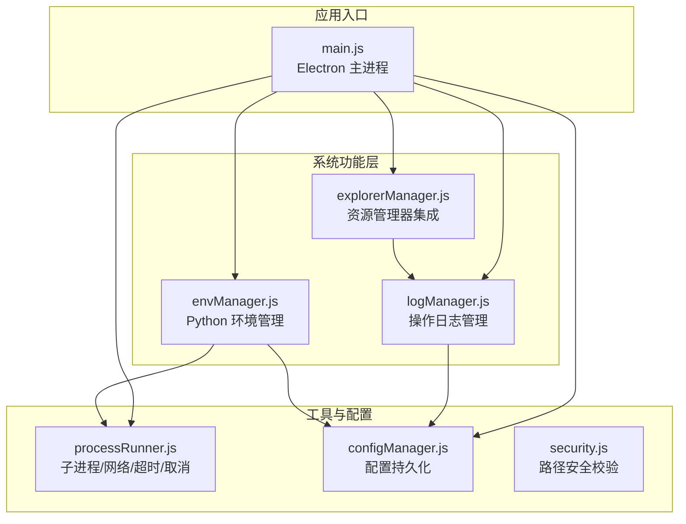
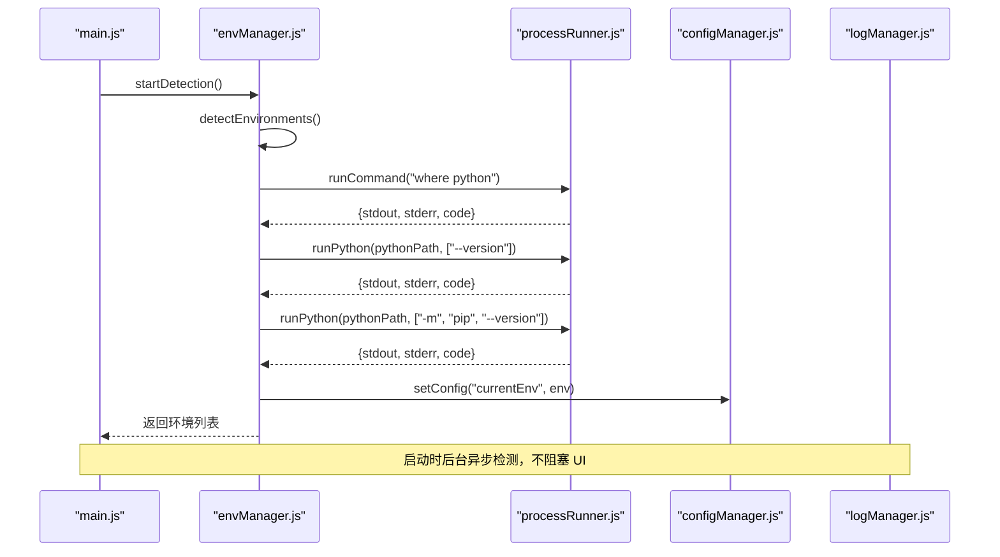
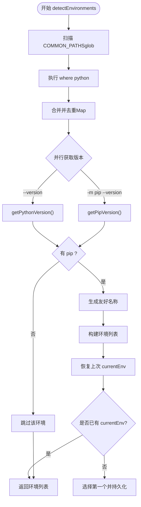
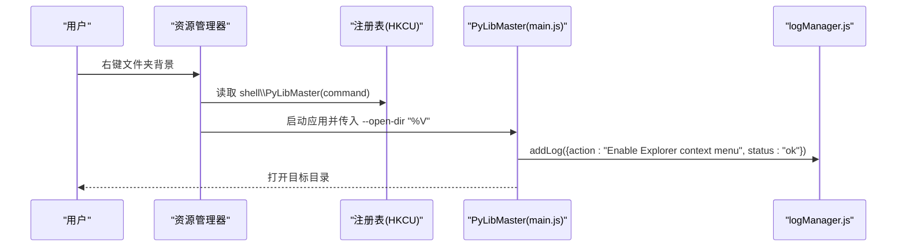
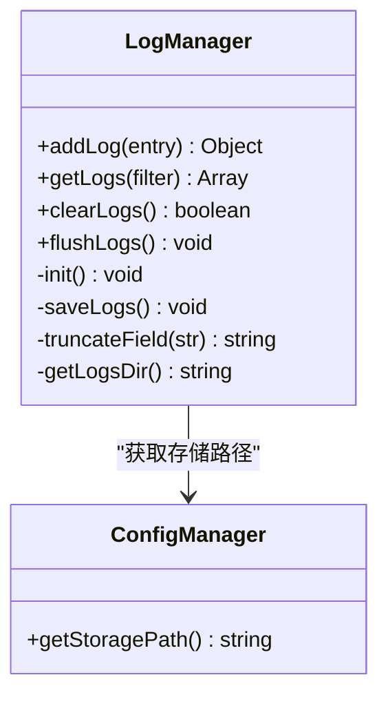
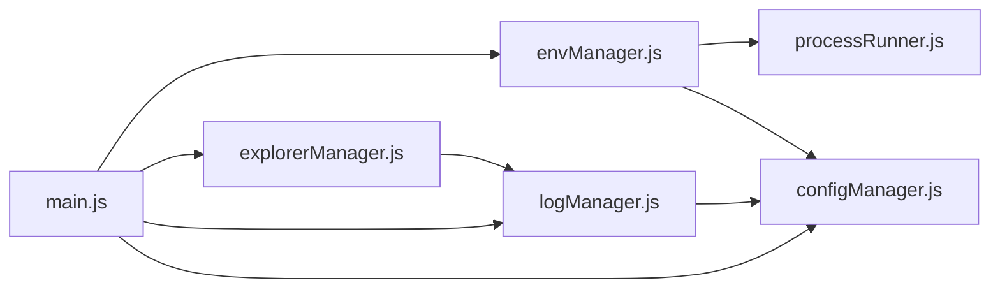

# 系统功能层

<cite>
**本文引用的文件**   
- [envManager.js](file://core/system/envManager.js)
- [explorerManager.js](file://core/system/explorerManager.js)
- [logManager.js](file://core/system/logManager.js)
- [processRunner.js](file://utils/processRunner.js)
- [configManager.js](file://core/config/configManager.js)
- [security.js](file://utils/security.js)
- [main.js](file://main.js)
- [package.json](file://package.json)
</cite>

## 目录
1. [简介](#简介)
2. [项目结构](#项目结构)
3. [核心组件](#核心组件)
4. [架构总览](#架构总览)
5. [详细组件分析](#详细组件分析)
6. [依赖关系分析](#依赖关系分析)
7. [性能考量](#性能考量)
8. [故障排查指南](#故障排查指南)
9. [结论](#结论)
10. [附录：扩展指南与最佳实践](#附录扩展指南与最佳实践)

## 简介
本章节面向 PyLibMaster 的系统功能层，聚焦三大模块：Python 环境管理（envManager）、Windows 资源管理器集成（explorerManager）、操作日志管理（logManager）。文档将深入解释环境检测算法、多环境识别、虚拟环境切换逻辑；文件系统操作、路径验证与安全访问控制；日志记录机制、分级过滤、实时输出、日志轮转与性能优化。同时说明各模块与操作系统 API 的集成方式（进程管理、文件 I/O、网络请求），并提供系统级功能扩展指南与错误处理策略。

## 项目结构
系统功能层位于 core/system 目录，由三个独立职责清晰的模块组成，并通过 utils 和 core/config 提供通用能力支撑。

图表来源
- [envManager.js:1-220](file://core/system/envManager.js#L1-L220)
- [explorerManager.js:1-120](file://core/system/explorerManager.js#L1-L120)
- [logManager.js:1-173](file://core/system/logManager.js#L1-L173)
- [processRunner.js:1-366](file://utils/processRunner.js#L1-L366)
- [configManager.js:1-194](file://core/config/configManager.js#L1-L194)
- [security.js:1-43](file://utils/security.js#L1-L43)
- [main.js:1-200](file://main.js#L1-L200)

章节来源
- [envManager.js:1-220](file://core/system/envManager.js#L1-L220)
- [explorerManager.js:1-120](file://core/system/explorerManager.js#L1-L120)
- [logManager.js:1-173](file://core/system/logManager.js#L1-L173)
- [processRunner.js:1-366](file://utils/processRunner.js#L1-L366)
- [configManager.js:1-194](file://core/config/configManager.js#L1-L194)
- [security.js:1-43](file://utils/security.js#L1-L43)
- [main.js:1-200](file://main.js#L1-L200)

## 核心组件
- envManager：自动检测系统中已安装的 Python 环境，获取版本信息，维护当前选中环境并支持切换与持久化。
- explorerManager：在 Windows 资源管理器背景菜单中注册“用 PyLibMaster 打开”和“在此创建虚拟环境”，通过 HKCU 注册表实现，无需管理员权限。
- logManager：以 JSON 文件持久化操作日志，支持按类型筛选与关键词搜索，具备容量控制、字段截断、防抖写入与退出前同步刷新。

章节来源
- [envManager.js:1-220](file://core/system/envManager.js#L1-L220)
- [explorerManager.js:1-120](file://core/system/explorerManager.js#L1-L120)
- [logManager.js:1-173](file://core/system/logManager.js#L1-L173)

## 架构总览
系统功能层围绕“进程执行 + 配置持久化 + 日志记录”构建，主进程负责生命周期管理与 IPC 桥接，系统模块专注各自领域职责。

图表来源
- [main.js:133-140](file://main.js#L133-L140)
- [envManager.js:85-170](file://core/system/envManager.js#L85-L170)
- [processRunner.js:85-161](file://utils/processRunner.js#L85-L161)
- [configManager.js:157-178](file://core/config/configManager.js#L157-L178)

## 详细组件分析

### envManager：Python 环境管理
- 环境检测算法
  - 扫描常见安装路径（glob 模式匹配），覆盖系统级与用户级 Python、Anaconda/Miniconda、Windows Store Python 等。
  - 调用系统命令 where python 查找 PATH 中的可执行文件。
  - 对每个候选路径并行执行 --version 与 -m pip --version，收集版本信息。
  - 过滤无 pip 的环境，生成友好名称（如 Python x.y.z 或 conda 环境名）。
  - 恢复上次保存的 currentEnv，若仍存在则优先置于列表首位。
- 多环境识别
  - 使用 Map 去重（小写路径键），避免重复项。
  - 根据路径层级推断环境名（scripts/bin 回退到上级目录）。
- 虚拟环境管理
  - 当前模块负责“发现与切换”，实际虚拟环境创建由 venvManager 负责（不在本文件内）。
- 环境切换逻辑
  - 优先从缓存中查找，不存在但路径存在则构造临时对象，否则抛出错误。
  - 切换后立即持久化 currentEnv 到配置。
- 并发与性能
  - 使用 Promise.all 并行获取版本信息，提升多环境场景下的检测速度。
- 错误处理
  - glob 失败忽略；where 失败忽略；版本解析失败降级为 unknown。

图表来源
- [envManager.js:85-170](file://core/system/envManager.js#L85-L170)
- [envManager.js:48-71](file://core/system/envManager.js#L48-L71)

章节来源
- [envManager.js:1-220](file://core/system/envManager.js#L1-L220)
- [processRunner.js:85-161](file://utils/processRunner.js#L85-L161)
- [configManager.js:157-178](file://core/config/configManager.js#L157-L178)

### explorerManager：Windows 资源管理器右键菜单集成
- 功能范围
  - 启用/禁用两个菜单项：“用 PyLibMaster 打开”、“在此创建虚拟环境”。
  - 通过 HKCU 注册表项写入，无需管理员权限。
- 关键流程
  - 获取 exe 路径（打包后 process.execPath，开发模式拼接 electron 运行 main.js）。
  - 写入主菜单与子菜单项及图标，设置 command 参数传递 %V（所选目录）。
  - 查询状态：reg query 判断是否存在注册表项。
- 跨平台兼容
  - 非 Windows 平台直接返回不支持。
- 错误处理
  - 捕获 reg 命令异常，记录日志并返回失败消息。

图表来源
- [explorerManager.js:54-79](file://core/system/explorerManager.js#L54-L79)
- [explorerManager.js:107-112](file://core/system/explorerManager.js#L107-L112)
- [logManager.js:112-131](file://core/system/logManager.js#L112-L131)

章节来源
- [explorerManager.js:1-120](file://core/system/explorerManager.js#L1-L120)
- [logManager.js:112-131](file://core/system/logManager.js#L112-L131)

### logManager：操作日志管理
- 存储与初始化
  - 日志文件位置：{storagePath}/logs/operations.json。
  - 启动时加载 JSON，损坏时重置为空数组。
- 写入机制
  - 新增日志插入数组开头（最新在前），超过 MAX_LOGS（2000）裁剪旧日志。
  - 单个字段长度限制 MAX_FIELD_LENGTH（1000），超长截断并追加省略号。
  - 写入采用防抖（300ms），减少频繁磁盘 IO。
  - 应用退出前 flushLogs 强制同步写入，确保数据不丢失。
- 查询与过滤
  - getLogs(filter) 支持 type 筛选与 search 关键词（不区分大小写，限定最大长度）。
- 性能优化
  - 防抖写入、批量裁剪、字段截断，避免大文件与慢 IO。
- 错误处理
  - 写入失败输出到 stderr，避免死循环；JSON 解析失败降级为空数组。

图表来源
- [logManager.js:112-173](file://core/system/logManager.js#L112-L173)
- [configManager.js:185-191](file://core/config/configManager.js#L185-L191)

章节来源
- [logManager.js:1-173](file://core/system/logManager.js#L1-L173)
- [configManager.js:185-191](file://core/config/configManager.js#L185-L191)

## 依赖关系分析
- envManager 依赖 processRunner（执行系统命令与 Python 命令）、configManager（持久化 currentEnv）。
- explorerManager 依赖 logManager（记录启用/禁用结果），通过 child_process 的 execSync 操作注册表。
- logManager 依赖 configManager（确定存储路径），纯文件 I/O 与内存数组。
- 主进程 main.js 协调各模块初始化与生命周期事件。

图表来源
- [envManager.js:18-24](file://core/system/envManager.js#L18-L24)
- [explorerManager.js:11-14](file://core/system/explorerManager.js#L11-L14)
- [logManager.js:15-17](file://core/system/logManager.js#L15-L17)
- [main.js:17-31](file://main.js#L17-L31)

章节来源
- [envManager.js:18-24](file://core/system/envManager.js#L18-L24)
- [explorerManager.js:11-14](file://core/system/explorerManager.js#L11-L14)
- [logManager.js:15-17](file://core/system/logManager.js#L15-L17)
- [main.js:17-31](file://main.js#L17-L31)

## 性能考量
- 环境检测并行化：Promise.all 并行获取版本信息，显著缩短多环境检测时间。
- 日志写入防抖：300ms 内多次写入合并为一次，降低磁盘压力。
- 字段截断与容量限制：防止日志文件过大导致读写缓慢。
- 进程超时与两级终止：SIGTERM 后等待 5 秒再 SIGKILL，避免僵尸进程。
- 配置原子写入：先写临时文件再重命名，避免崩溃导致配置文件损坏。

[本节为通用性能建议，不直接分析具体文件]

## 故障排查指南
- Python 环境未检测到
  - 检查 COMMON_PATHS 是否包含实际安装路径；确认 where python 能返回有效路径；查看日志是否有 pip 不可用的提示。
- 切换环境失败
  - 确认路径存在且可执行；检查 configManager 写入是否成功；查看日志记录。
- 资源管理器右键菜单无效
  - 在非 Windows 平台会返回不支持；检查注册表 HKCU 对应项是否存在；查看启用/禁用日志。
- 日志缺失或不完整
  - 检查 storagePath 是否存在与可写；确认 flushLogs 是否在退出前被调用；查看 stderr 输出。
- 子进程卡住或超时
  - 检查 timeout 设置；确认 onOutput 回调是否正常；必要时使用 cancelOperation 取消。

章节来源
- [envManager.js:85-170](file://core/system/envManager.js#L85-L170)
- [explorerManager.js:54-79](file://core/system/explorerManager.js#L54-L79)
- [logManager.js:72-96](file://core/system/logManager.js#L72-L96)
- [processRunner.js:150-161](file://utils/processRunner.js#L150-L161)

## 结论
系统功能层以清晰职责划分与稳健的错误处理为核心，实现了可靠的 Python 环境检测与切换、Windows 资源管理器集成以及高性能的日志管理。通过进程管理、文件 I/O、网络请求与配置持久化的协同，保证了应用在多环境与多平台场景下的稳定性与可扩展性。

[本节为总结性内容，不直接分析具体文件]

## 附录：扩展指南与最佳实践

### 添加新的系统级功能
- 明确职责边界：新功能应放在 core/system 下独立模块，避免侵入现有模块。
- 依赖最小化：仅引入必要依赖，复用 processRunner、configManager、logManager。
- 安全优先：对用户输入进行严格校验，使用 security.js 的路径校验函数防止路径遍历。
- 可观测性：所有关键操作通过 logManager.addLog 记录，便于问题定位。
- 错误处理：对外暴露统一错误语义，内部 try/catch 捕获并降级，避免崩溃。
- 测试与文档：为新功能补充单元测试与使用说明。

章节来源
- [security.js:28-40](file://utils/security.js#L28-L40)
- [logManager.js:112-131](file://core/system/logManager.js#L112-L131)
- [configManager.js:123-138](file://core/config/configManager.js#L123-L138)

### 与操作系统 API 集成要点
- 进程管理
  - 使用 processRunner.runCommand 封装 spawn，统一超时、取消、ANSI 清理与 UTF-8 编码。
  - 通过 operationId 批量取消相关进程，避免孤儿进程。
- 文件 I/O
  - 使用 fs 与 path 进行路径解析与校验，避免相对路径绕过。
  - 配置与日志写入采用原子写入与防抖策略。
- 网络请求
  - 下载脚本（如 get-pip.py）使用 http/https 客户端，支持重定向、超时与多源重试。
- 注册表（Windows）
  - 通过 reg 命令读写 HKCU，无需管理员权限；注意命令失败时的异常处理。

章节来源
- [processRunner.js:85-161](file://utils/processRunner.js#L85-L161)
- [processRunner.js:286-331](file://utils/processRunner.js#L286-L331)
- [explorerManager.js:54-79](file://core/system/explorerManager.js#L54-L79)
- [configManager.js:123-138](file://core/config/configManager.js#L123-L138)

### 错误处理与异常恢复策略
- 防御式编程：对输入进行类型与范围校验，非法值回退默认值。
- 降级策略：解析失败返回未知版本，JSON 损坏重置为空数组。
- 幂等与重试：pip 就绪状态缓存避免重复检测；下载脚本多源重试。
- 资源清理：退出前取消所有活跃进程，刷新日志，释放定时器。

章节来源
- [configManager.js:39-44](file://core/config/configManager.js#L39-L44)
- [logManager.js:53-66](file://core/system/logManager.js#L53-L66)
- [processRunner.js:233-278](file://utils/processRunner.js#L233-L278)
- [main.js:161-170](file://main.js#L161-L170)

### 外部依赖与版本约束
- glob：用于路径模式匹配，快速发现 Python 安装。
- strip-ansi：清理终端 ANSI 色彩序列，保证输出可读。
- electron-updater：应用更新（与系统功能层间接相关）。

章节来源
- [package.json:20-27](file://package.json#L20-L27)