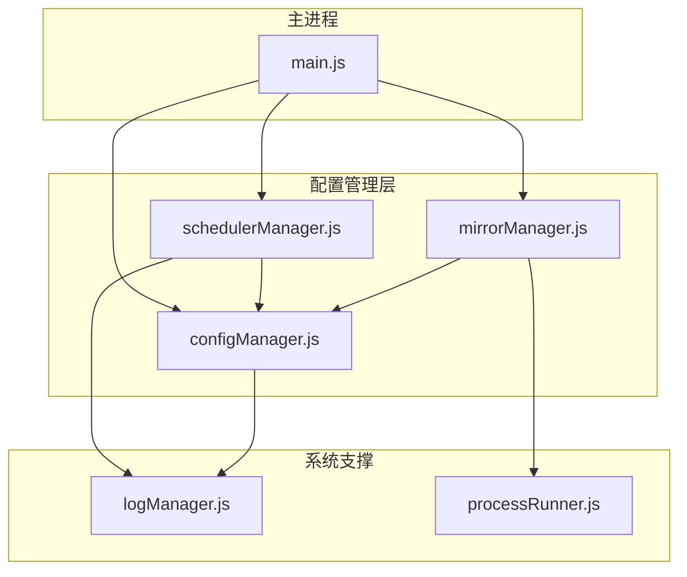
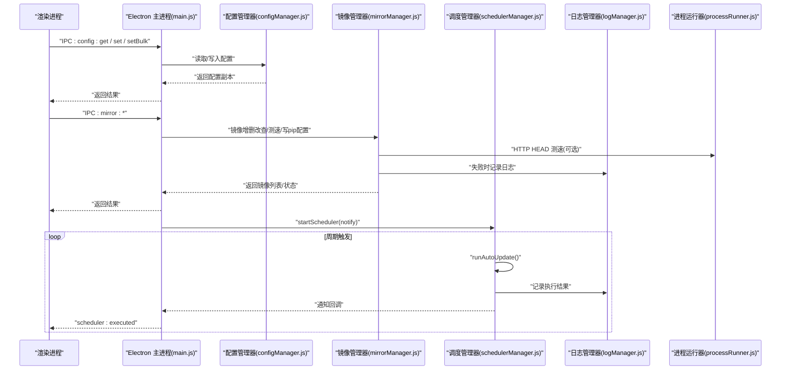
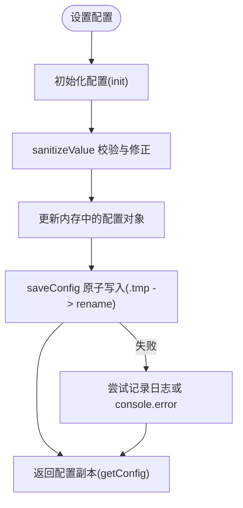
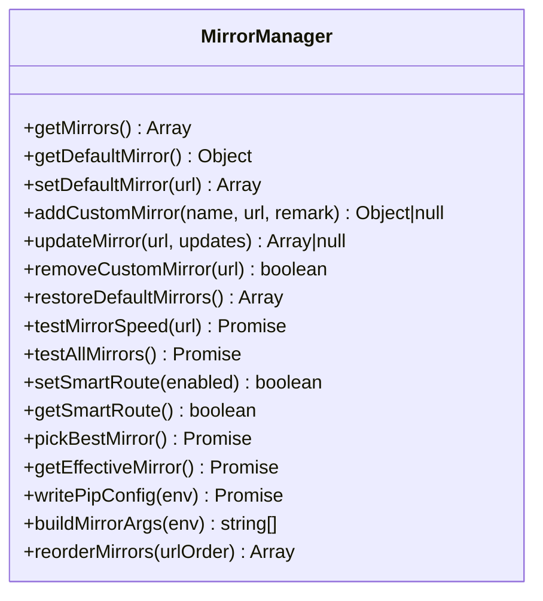
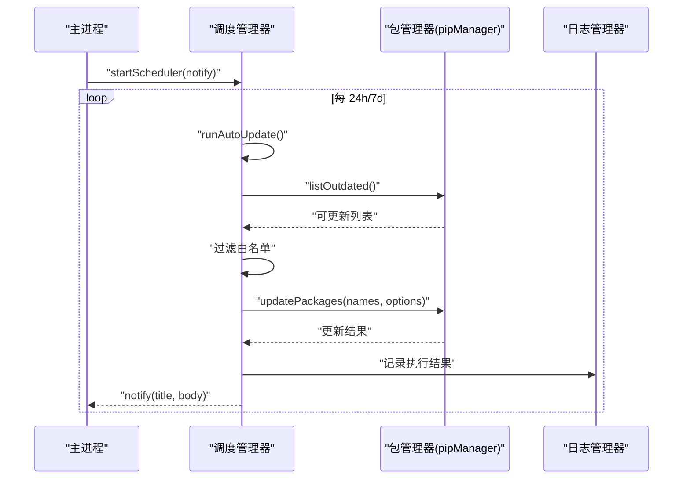
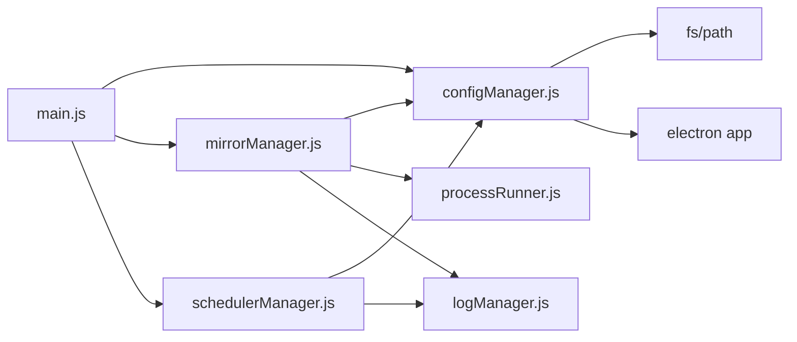

# 配置管理层

<cite>
**本文引用的文件**   
- [configManager.js](file://core/config/configManager.js)
- [mirrorManager.js](file://core/config/mirrorManager.js)
- [schedulerManager.js](file://core/config/schedulerManager.js)
- [logManager.js](file://core/system/logManager.js)
- [processRunner.js](file://utils/processRunner.js)
- [main.js](file://main.js)
- [package.json](file://package.json)
</cite>

## 目录
1. [简介](#简介)
2. [项目结构](#项目结构)
3. [核心组件](#核心组件)
4. [架构总览](#架构总览)
5. [详细组件分析](#详细组件分析)
6. [依赖关系分析](#依赖关系分析)
7. [性能考量](#性能考量)
8. [故障排查指南](#故障排查指南)
9. [结论](#结论)
10. [附录：扩展与迁移指南](#附录扩展与迁移指南)

## 简介
本章节面向 PyLibMaster 的配置管理层，系统性阐述以下模块的职责与实现要点：
- configManager.js：配置的持久化存储、默认值管理、范围校验与自动修正、跨平台路径策略、原子写入防损坏。
- mirrorManager.js：镜像源管理机制（内置/自定义）、智能路由算法、pip 配置文件写入。
- schedulerManager.js：定时任务管理（调度、状态监控、错误处理）。
- 配套系统：日志记录、进程运行器、主进程集成等。

该文档既适合开发者深入理解代码结构与数据流，也适合非技术读者快速掌握配置管理的工作原理与最佳实践。

## 项目结构
配置管理层位于 core/config 目录下，由三个核心管理器组成：
- configManager.js：应用配置读写、校验、持久化。
- mirrorManager.js：PyPI 镜像源管理与智能路由。
- schedulerManager.js：定时自动更新调度器。

图表来源
- [configManager.js:1-194](file://core/config/configManager.js#L1-L194)
- [mirrorManager.js:1-376](file://core/config/mirrorManager.js#L1-L376)
- [schedulerManager.js:1-197](file://core/config/schedulerManager.js#L1-L197)
- [logManager.js:1-173](file://core/system/logManager.js#L1-L173)
- [processRunner.js:1-366](file://utils/processRunner.js#L1-L366)
- [main.js:1-640](file://main.js#L1-L640)

章节来源
- [configManager.js:1-194](file://core/config/configManager.js#L1-L194)
- [mirrorManager.js:1-376](file://core/config/mirrorManager.js#L1-L376)
- [schedulerManager.js:1-197](file://core/config/schedulerManager.js#L1-L197)
- [logManager.js:1-173](file://core/system/logManager.js#L1-L173)
- [processRunner.js:1-366](file://utils/processRunner.js#L1-L366)
- [main.js:1-640](file://main.js#L1-L640)

## 核心组件
- 配置管理器（configManager）
  - 职责：加载/保存配置、合并默认值、数值范围校验与自动修正、跨平台路径解析、原子写入。
  - 关键能力：getConfig/setConfig/setBulk/getStoragePath/init。
- 镜像管理器（mirrorManager）
  - 职责：内置/自定义镜像源维护、URL 校验、测速与智能路由、写入 pip 全局配置、构建命令行参数。
  - 关键能力：getMirrors/addCustomMirror/updateMirror/removeCustomMirror/testAllMirrors/pickBestMirror/writePipConfig/buildMirrorArgs/reorderMirrors。
- 调度管理器（schedulerManager）
  - 职责：定时任务启动/停止、执行自动更新、白名单过滤、状态持久化与错误处理。
  - 关键能力：getSchedulerConfig/saveSchedulerConfig/runAutoUpdate/startScheduler/stopScheduler/getStatus。

章节来源
- [configManager.js:1-194](file://core/config/configManager.js#L1-L194)
- [mirrorManager.js:1-376](file://core/config/mirrorManager.js#L1-L376)
- [schedulerManager.js:1-197](file://core/config/schedulerManager.js#L1-L197)

## 架构总览
配置管理层通过 Electron 主进程暴露 IPC 接口，供渲染进程调用。各管理器之间通过模块化依赖协作，形成清晰的职责边界。

图表来源
- [main.js:406-414](file://main.js#L406-L414)
- [main.js:370-395](file://main.js#L370-L395)
- [main.js:526-546](file://main.js#L526-L546)
- [configManager.js:140-194](file://core/config/configManager.js#L140-L194)
- [mirrorManager.js:219-333](file://core/config/mirrorManager.js#L219-L333)
- [schedulerManager.js:70-138](file://core/config/schedulerManager.js#L70-L138)
- [logManager.js:112-131](file://core/system/logManager.js#L112-L131)
- [processRunner.js:85-161](file://utils/processRunner.js#L85-L161)

## 详细组件分析

### 配置管理器（configManager.js）
- 配置持久化与默认值
  - 首次启动或配置文件不存在时，生成默认配置并保存到磁盘。
  - 若配置文件存在但损坏，自动重建默认配置。
  - 默认项包括主题、语言、存储路径、并行线程数、重试次数、智能路由开关、当前环境、窗口尺寸等。
- 跨平台路径策略
  - 使用 Electron app.getPath('userData') 获取用户数据目录；未就绪时回退到环境变量或当前目录。
  - 安装目录用于默认存储路径（如 log 目录），便于日志与备份集中存放。
- 数值范围限制与自动修正
  - RANGE_LIMITS 定义数值型配置的最小/最大/回退值。
  - sanitizeValue 对类型与范围进行校验，非法值自动修正为最近合法值或默认值。
- 原子写入机制
  - 先写入 .tmp 文件，再 rename 为目标文件，避免崩溃导致配置文件损坏。
  - 失败时尝试通过日志管理器记录错误，否则降级输出到 stderr。
- 批量更新与缓存
  - setBulk 一次性校验并写入，减少磁盘 I/O。
  - getConfig 返回深拷贝，防止外部修改内部状态。

图表来源
- [configManager.js:39-44](file://core/config/configManager.js#L39-L44)
- [configManager.js:56-72](file://core/config/configManager.js#L56-L72)
- [configManager.js:80-117](file://core/config/configManager.js#L80-L117)
- [configManager.js:123-138](file://core/config/configManager.js#L123-L138)
- [configManager.js:144-178](file://core/config/configManager.js#L144-L178)

章节来源
- [configManager.js:1-194](file://core/config/configManager.js#L1-L194)

### 镜像管理器（mirrorManager.js）
- 内置镜像源与自定义镜像源
  - DEFAULT_MIRRORS 包含官方与多个国内镜像源。
  - loadMirrors 合并内置与用户保存的自定义镜像，确保唯一默认源。
- URL 校验与去重
  - isValidMirrorUrl 检查协议与长度，addCustomMirror/updateMirror 严格校验新 URL。
  - 重复 URL 直接拒绝添加或更新。
- 测速与智能路由
  - testMirrorSpeed 通过 HEAD 请求 numpy 页面测速，超时或失败标记为 9999ms。
  - testAllMirrors 并行测速并持久化 speed。
  - pickBestMirror 选择最快镜像；getEffectiveMirror 根据 smartRoute 决定生效镜像。
- 写入 pip 配置与命令行参数
  - writePipConfig 按平台写入 pip.ini 或 pip.conf，设置 index-url 与 timeout。
  - buildMirrorArgs 为非官方源生成 --index-url 参数。
- 排序与恢复
  - reorderMirrors 支持拖拽排序后持久化优先级。
  - restoreDefaultMirrors 清空自定义镜像，重建内置列表。

图表来源
- [mirrorManager.js:22-29](file://core/config/mirrorManager.js#L22-L29)
- [mirrorManager.js:43-51](file://core/config/mirrorManager.js#L43-L51)
- [mirrorManager.js:60-91](file://core/config/mirrorManager.js#L60-L91)
- [mirrorManager.js:219-247](file://core/config/mirrorManager.js#L219-L247)
- [mirrorManager.js:267-290](file://core/config/mirrorManager.js#L267-L290)
- [mirrorManager.js:299-333](file://core/config/mirrorManager.js#L299-L333)
- [mirrorManager.js:340-357](file://core/config/mirrorManager.js#L340-L357)

章节来源
- [mirrorManager.js:1-376](file://core/config/mirrorManager.js#L1-L376)

### 调度管理器（schedulerManager.js）
- 配置与状态
  - getSchedulerConfig 从配置中读取 enabled/frequency/whitelist/lastRun。
  - saveSchedulerConfig 批量持久化调度相关字段。
- 定时任务
  - startScheduler 根据频率设置 setInterval；若距离上次执行超过间隔则延迟执行一次。
  - stopScheduler 清理定时器。
- 自动更新流程
  - runAutoUpdate 获取可更新列表，过滤白名单，调用 pipManager.updatePackages 批量更新。
  - 成功/失败均记录日志，更新 lastRun 时间，并通过 notify 回调推送结果。
- 错误处理
  - 捕获异常记录日志并返回错误信息，finally 确保 isRunning 重置。

图表来源
- [schedulerManager.js:29-50](file://core/config/schedulerManager.js#L29-L50)
- [schedulerManager.js:70-138](file://core/config/schedulerManager.js#L70-L138)
- [schedulerManager.js:145-163](file://core/config/schedulerManager.js#L145-L163)
- [schedulerManager.js:179-187](file://core/config/schedulerManager.js#L179-L187)

章节来源
- [schedulerManager.js:1-197](file://core/config/schedulerManager.js#L1-L197)

## 依赖关系分析
- configManager 依赖 Electron app 与 fs/path，提供基础配置能力。
- mirrorManager 依赖 configManager 与 processRunner（HTTP 测速），以及日志管理器做错误记录。
- schedulerManager 依赖 configManager 与日志管理器，并在运行时动态引入 pipManager。
- main.js 作为入口，注册所有 IPC 处理器，协调配置、镜像、调度等模块。

图表来源
- [configManager.js:17-19](file://core/config/configManager.js#L17-L19)
- [mirrorManager.js:18-19](file://core/config/mirrorManager.js#L18-L19)
- [schedulerManager.js:18-19](file://core/config/schedulerManager.js#L18-L19)
- [main.js:17-31](file://main.js#L17-L31)

章节来源
- [configManager.js:1-194](file://core/config/configManager.js#L1-L194)
- [mirrorManager.js:1-376](file://core/config/mirrorManager.js#L1-L376)
- [schedulerManager.js:1-197](file://core/config/schedulerManager.js#L1-L197)
- [main.js:1-640](file://main.js#L1-L640)

## 性能考量
- 原子写入降低崩溃风险：配置保存采用临时文件+rename 策略，避免部分写入导致的损坏。
- 批量更新减少 I/O：setBulk 一次性校验并保存，避免多次磁盘操作。
- 并行测速提升体验：镜像测速使用 Promise.all 并发请求，缩短等待时间。
- 日志防抖：日志写入采用 300ms 防抖，减少高频写入带来的开销。
- 进程超时与强制终止：子进程执行具备超时与 SIGTERM/SIGKILL 两级终止，避免僵尸进程。

[本节为通用性能建议，不直接分析具体文件]

## 故障排查指南
- 配置文件损坏
  - 现象：读取 JSON 失败或解析异常。
  - 处理：configManager 在 init 中捕获异常并重建默认配置，同时保存。
  - 参考：[configManager.js:101-117](file://core/config/configManager.js#L101-L117)
- 写入失败
  - 现象：saveConfig 抛出异常。
  - 处理：尝试通过日志管理器记录错误，否则降级到 console.error。
  - 参考：[configManager.js:123-138](file://core/config/configManager.js#L123-L138)
- 镜像 URL 无效
  - 现象：addCustomMirror/updateMirror 抛出错误。
  - 处理：isValidMirrorUrl 校验协议与长度，确保 http/https 且不超过 2048 字符。
  - 参考：[mirrorManager.js:43-51](file://core/config/mirrorManager.js#L43-L51)
- 测速失败或超时
  - 现象：testMirrorSpeed 返回 9999ms。
  - 处理：网络不可达或响应失败时标记为慢速，不影响其他镜像选择。
  - 参考：[mirrorManager.js:219-233](file://core/config/mirrorManager.js#L219-L233)
- 调度任务未执行
  - 现象：startScheduler 未触发 runAutoUpdate。
  - 处理：检查 enabled 与 frequency；确认 lastRun 是否满足间隔条件。
  - 参考：[schedulerManager.js:145-163](file://core/config/schedulerManager.js#L145-L163)
- 日志丢失
  - 现象：应用退出前未持久化日志。
  - 处理：before-quit 事件调用 flushLogs 立即同步写入。
  - 参考：[main.js:161-170](file://main.js#L161-L170), [logManager.js:88-96](file://core/system/logManager.js#L88-L96)

章节来源
- [configManager.js:101-138](file://core/config/configManager.js#L101-L138)
- [mirrorManager.js:43-51](file://core/config/mirrorManager.js#L43-L51)
- [mirrorManager.js:219-233](file://core/config/mirrorManager.js#L219-L233)
- [schedulerManager.js:145-163](file://core/config/schedulerManager.js#L145-L163)
- [main.js:161-170](file://main.js#L161-L170)
- [logManager.js:88-96](file://core/system/logManager.js#L88-L96)

## 结论
配置管理层以清晰的分层与职责划分，实现了高可靠性的配置持久化、灵活的镜像源管理与健壮的定时任务调度。通过原子写入、范围校验、并行测速与日志防抖等机制，系统在易用性与稳定性之间取得良好平衡。主进程通过 IPC 统一暴露能力，便于前端交互与扩展。

[本节为总结性内容，不直接分析具体文件]

## 附录：扩展与迁移指南

### 新增配置项与验证规则
- 步骤
  - 在 configManager 的默认配置中添加新字段与默认值。
  - 如需数值范围限制，在 RANGE_LIMITS 中声明 min/max/fallback。
  - 在 setConfig/setBulk 中复用 sanitizeValue 完成校验与修正。
  - 在 IPC 处理器中暴露新的配置读写接口（如需要）。
- 注意事项
  - 保持 getConfig 返回深拷贝，避免外部污染内部状态。
  - 保存时使用 setBulk 批量写入，减少 I/O 次数。
- 参考
  - 默认配置与范围限制：[configManager.js:21-29](file://core/config/configManager.js#L21-L29), [configManager.js:90-99](file://core/config/configManager.js#L90-L99)
  - 校验与保存：[configManager.js:39-44](file://core/config/configManager.js#L39-L44), [configManager.js:157-178](file://core/config/configManager.js#L157-L178)

章节来源
- [configManager.js:21-29](file://core/config/configManager.js#L21-L29)
- [configManager.js:90-99](file://core/config/configManager.js#L90-L99)
- [configManager.js:39-44](file://core/config/configManager.js#L39-L44)
- [configManager.js:157-178](file://core/config/configManager.js#L157-L178)

### 配置迁移与版本兼容性
- 现状
  - 当前实现通过 defaults 合并 saved 配置，缺失字段自动补全默认值。
  - 无显式版本号字段，迁移逻辑简单。
- 建议方案
  - 在配置中增加 version 字段，标识配置格式版本。
  - 在 init 中比较版本，执行迁移脚本（如字段重命名、默认值调整、数据结构升级）。
  - 迁移完成后更新 version 并保存。
- 影响范围
  - 需确保迁移过程幂等，避免重复迁移造成数据不一致。
  - 迁移失败应回滚或保留原配置，保证可用性。

[本节为概念性指导，不直接分析具体文件]

### 镜像源扩展指南
- 新增内置镜像
  - 在 DEFAULT_MIRRORS 中添加 name/url/isDefault/builtin。
  - 确保 URL 以 /simple/ 结尾，符合 pip 规范。
- 自定义镜像
  - 使用 addCustomMirror 添加，URL 必须通过 isValidMirrorUrl 校验。
  - 可通过 reorderMirrors 调整优先级。
- 智能路由
  - 开启 setSmartRoute(true) 后，getEffectiveMirror 将选择最快镜像。
  - 定期执行 testAllMirrors 更新速度缓存。
- 参考
  - 内置镜像与合并逻辑：[mirrorManager.js:22-29](file://core/config/mirrorManager.js#L22-L29), [mirrorManager.js:60-91](file://core/config/mirrorManager.js#L60-L91)
  - 测速与路由：[mirrorManager.js:219-247](file://core/config/mirrorManager.js#L219-L247), [mirrorManager.js:267-290](file://core/config/mirrorManager.js#L267-L290)

章节来源
- [mirrorManager.js:22-29](file://core/config/mirrorManager.js#L22-L29)
- [mirrorManager.js:60-91](file://core/config/mirrorManager.js#L60-L91)
- [mirrorManager.js:219-247](file://core/config/mirrorManager.js#L219-L247)
- [mirrorManager.js:267-290](file://core/config/mirrorManager.js#L267-L290)

### 调度任务扩展指南
- 新增调度策略
  - 在 getSchedulerConfig 中扩展频率或策略字段。
  - 在 getInterval 中计算新策略的间隔。
- 执行逻辑扩展
  - 在 runAutoUpdate 中插入新的业务步骤（如预检查、后置处理）。
  - 确保错误路径记录日志并更新 lastRun。
- 参考
  - 配置与间隔：[schedulerManager.js:29-59](file://core/config/schedulerManager.js#L29-L59)
  - 执行流程：[schedulerManager.js:70-138](file://core/config/schedulerManager.js#L70-L138)

章节来源
- [schedulerManager.js:29-59](file://core/config/schedulerManager.js#L29-L59)
- [schedulerManager.js:70-138](file://core/config/schedulerManager.js#L70-L138)

### 与主进程的集成
- IPC 接口
  - 配置：config:get / config:set / config:setBulk。
  - 镜像：mirror:list / mirror:test / mirror:testAll / mirror:setDefault / mirror:addCustom / mirror:update / mirror:removeCustom / mirror:restoreDefaults / mirror:smartRoute / mirror:getSmartRoute / mirror:writePipConfig / mirror:reorder。
  - 调度：scheduler:getStatus / scheduler:save / scheduler:runNow。
- 生命周期
  - 应用启动时初始化窗口、托盘、主题、自动更新、环境检测与调度器。
  - 退出前取消活跃进程并刷新日志。
- 参考
  - IPC 处理器定义：[main.js:406-414](file://main.js#L406-L414), [main.js:370-395](file://main.js#L370-L395), [main.js:526-546](file://main.js#L526-L546)
  - 应用生命周期：[main.js:133-150](file://main.js#L133-L150), [main.js:161-170](file://main.js#L161-L170)

章节来源
- [main.js:406-414](file://main.js#L406-L414)
- [main.js:370-395](file://main.js#L370-L395)
- [main.js:526-546](file://main.js#L526-L546)
- [main.js:133-170](file://main.js#L133-L170)