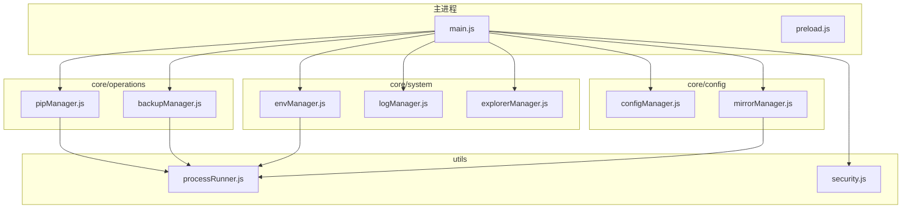
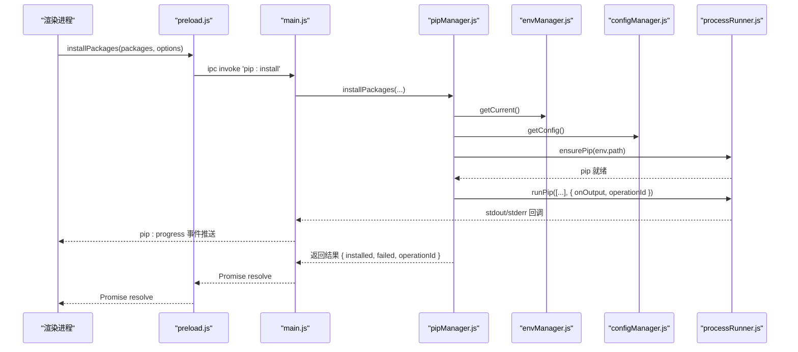
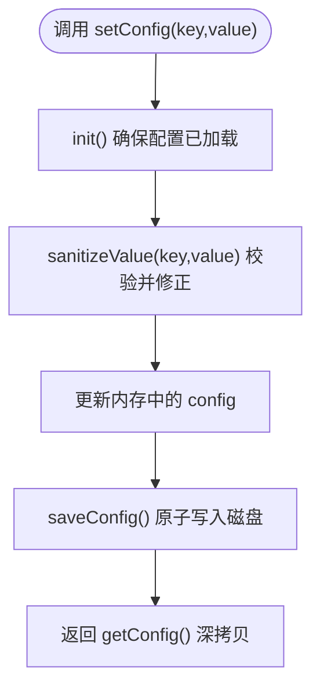
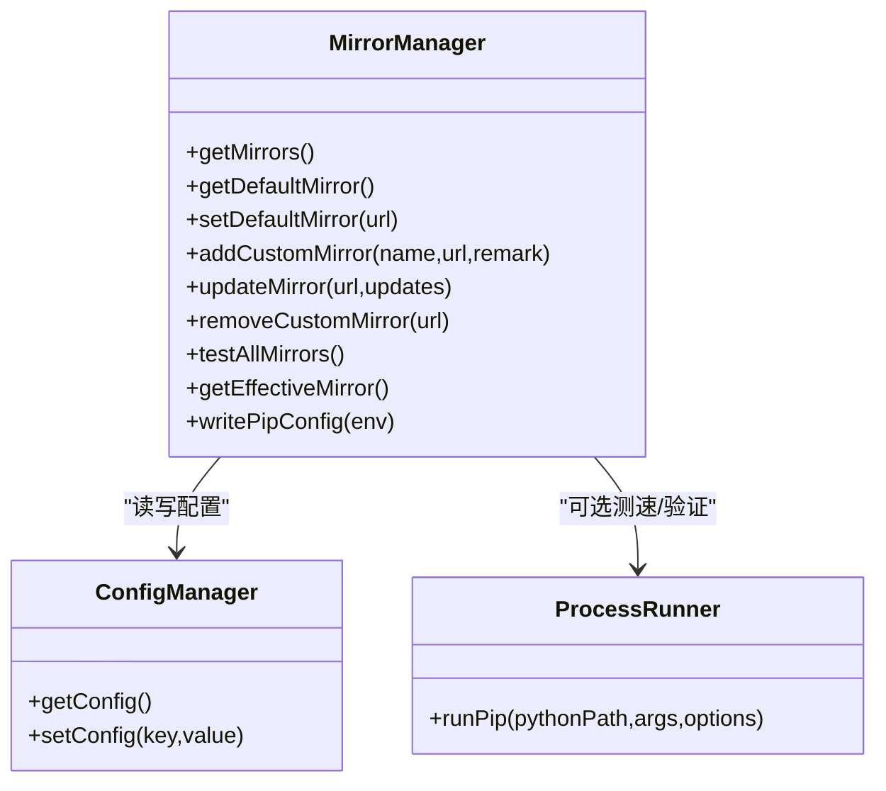
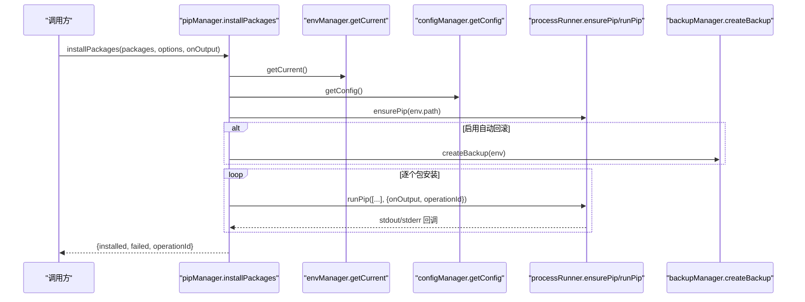
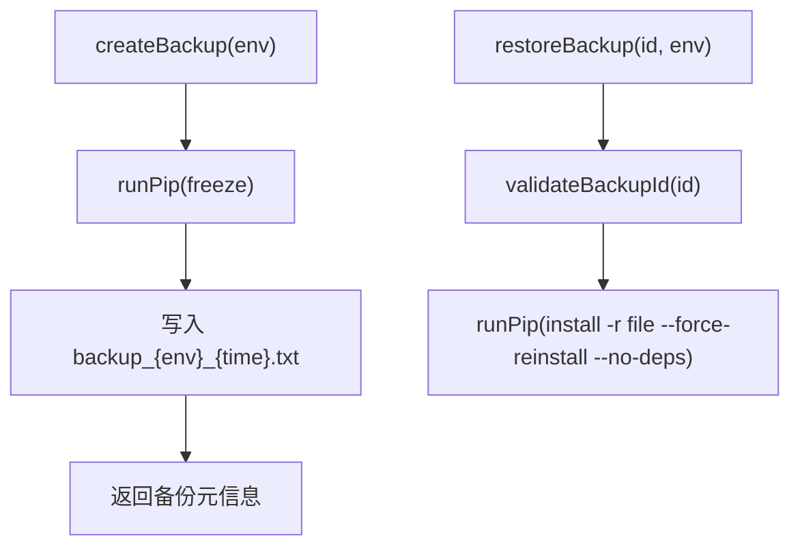
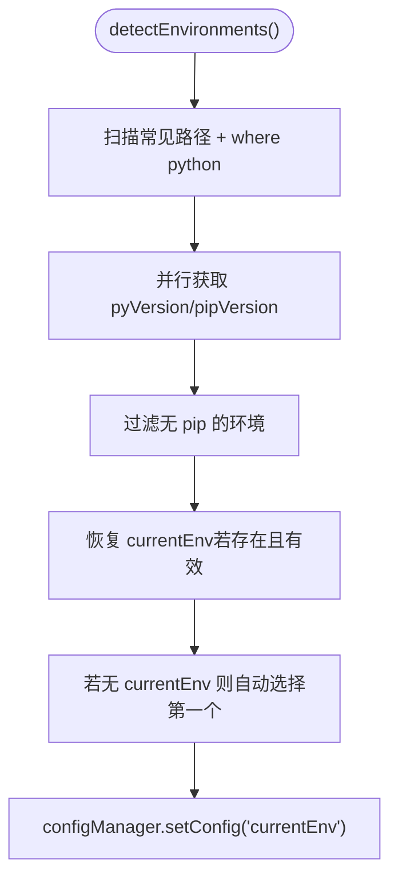
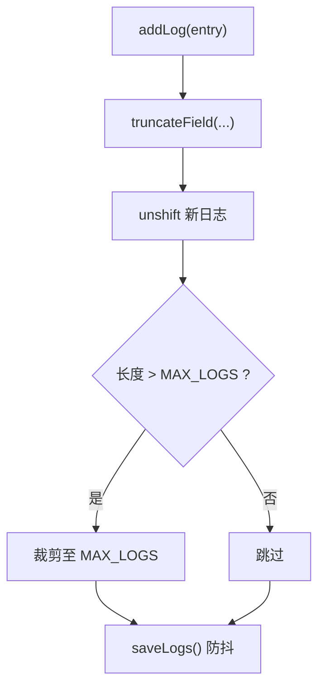
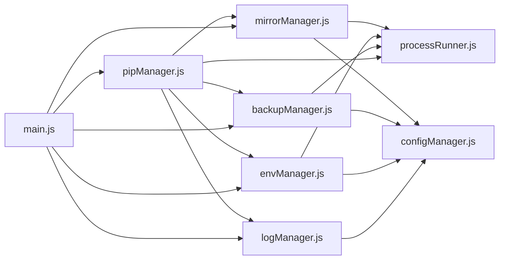

# 模块化架构设计

<cite>
**本文引用的文件**   
- [main.js](file://main.js)
- [preload.js](file://preload.js)
- [package.json](file://package.json)
- [core/config/configManager.js](file://core/config/configManager.js)
- [core/config/mirrorManager.js](file://core/config/mirrorManager.js)
- [core/operations/pipManager.js](file://core/operations/pipManager.js)
- [core/operations/backupManager.js](file://core/operations/backupManager.js)
- [core/system/envManager.js](file://core/system/envManager.js)
- [core/system/logManager.js](file://core/system/logManager.js)
- [core/system/explorerManager.js](file://core/system/explorerManager.js)
- [utils/processRunner.js](file://utils/processRunner.js)
- [utils/security.js](file://utils/security.js)
</cite>

## 目录
1. [引言](#引言)
2. [项目结构](#项目结构)
3. [核心组件](#核心组件)
4. [架构总览](#架构总览)
5. [详细组件分析](#详细组件分析)
6. [依赖关系分析](#依赖关系分析)
7. [性能与可靠性](#性能与可靠性)
8. [故障排查指南](#故障排查指南)
9. [结论](#结论)
10. [附录：扩展指南与最佳实践](#附录扩展指南与最佳实践)

## 引言
本文件面向 PyLibMaster 的模块化架构，重点阐述 core/ 下三层职责划分（config、operations、system），以及 utils/ 工具层的进程管理封装。文档将解释模块接口、依赖关系、数据流向、事件通信协议（IPC、回调、Promise）、配置驱动模式、扩展机制，并给出依赖图与最佳实践。

## 项目结构
PyLibMaster 采用 Electron 主渲染分离架构，核心业务集中在 core/ 目录，按“配置-业务-系统”分层组织；utils/ 提供跨层共享能力（进程运行器、安全校验）；main.js 作为主进程入口统一注册 IPC 处理器，preload.js 暴露安全的桥接 API 给渲染进程。

图表来源
- [main.js:1-640](file://main.js#L1-L640)
- [preload.js:1-200](file://preload.js#L1-L200)
- [core/config/configManager.js:1-194](file://core/config/configManager.js#L1-L194)
- [core/config/mirrorManager.js:1-376](file://core/config/mirrorManager.js#L1-L376)
- [core/operations/pipManager.js:1-800](file://core/operations/pipManager.js#L1-L800)
- [core/operations/backupManager.js:1-196](file://core/operations/backupManager.js#L1-L196)
- [core/system/envManager.js:1-220](file://core/system/envManager.js#L1-L220)
- [core/system/logManager.js:1-173](file://core/system/logManager.js#L1-L173)
- [core/system/explorerManager.js:1-120](file://core/system/explorerManager.js#L1-L120)
- [utils/processRunner.js:1-366](file://utils/processRunner.js#L1-L366)
- [utils/security.js:1-43](file://utils/security.js#L1-L43)

章节来源
- [package.json:1-79](file://package.json#L1-L79)

## 核心组件
- config 层（配置管理）
  - configManager.js：应用配置的持久化、读取/写入、批量更新、值域校验、存储路径管理。
  - mirrorManager.js：镜像源列表管理、智能路由、测速、写入 pip 配置文件。
- operations 层（业务操作）
  - pipManager.js：包查询、安装、卸载、更新、搜索、导出/导入、依赖分析等核心业务。
  - backupManager.js：基于 pip freeze 的备份与恢复，支持安全 ID 校验。
- system 层（系统功能）
  - envManager.js：Python 环境检测、版本信息获取、当前环境切换与持久化。
  - logManager.js：操作日志记录、容量控制、筛选导出。
  - explorerManager.js：Windows 资源管理器右键菜单集成。
- utils 层（工具函数）
  - processRunner.js：子进程创建、超时/取消、输出回调、pip 自动安装与缓存。
  - security.js：路径白名单校验，防止路径遍历攻击。

章节来源
- [core/config/configManager.js:1-194](file://core/config/configManager.js#L1-L194)
- [core/config/mirrorManager.js:1-376](file://core/config/mirrorManager.js#L1-L376)
- [core/operations/pipManager.js:1-800](file://core/operations/pipManager.js#L1-L800)
- [core/operations/backupManager.js:1-196](file://core/operations/backupManager.js#L1-L196)
- [core/system/envManager.js:1-220](file://core/system/envManager.js#L1-L220)
- [core/system/logManager.js:1-173](file://core/system/logManager.js#L1-L173)
- [core/system/explorerManager.js:1-120](file://core/system/explorerManager.js#L1-L120)
- [utils/processRunner.js:1-366](file://utils/processRunner.js#L1-L366)
- [utils/security.js:1-43](file://utils/security.js#L1-L43)

## 架构总览
整体采用“主进程集中式 IPC + 核心模块解耦”的设计。渲染进程通过 preload.js 暴露的 window.electronAPI 调用主进程的 IPC 处理器，再由 main.js 转发到对应 core 模块。所有外部命令执行统一由 utils/processRunner.js 管理，确保超时、取消、输出回调和错误处理的一致性。

图表来源
- [preload.js:1-200](file://preload.js#L1-L200)
- [main.js:310-341](file://main.js#L310-L341)
- [core/operations/pipManager.js:495-578](file://core/operations/pipManager.js#L495-L578)
- [core/system/envManager.js:178-184](file://core/system/envManager.js#L178-L184)
- [core/config/configManager.js:144-178](file://core/config/configManager.js#L144-L178)
- [utils/processRunner.js:233-278](file://utils/processRunner.js#L233-L278)

## 详细组件分析

### 配置层：configManager.js
- 职责
  - 应用配置持久化（JSON），默认值合并，范围校验与自动修正。
  - 存储路径管理（基于 Electron userData 或环境变量）。
  - 原子写入（先写临时文件再重命名）避免损坏。
- 关键接口
  - init()：初始化配置目录与默认配置。
  - getConfig()/setConfig()/setBulk()：读取、设置、批量设置。
  - getStoragePath()：获取日志/备份存储路径并确保存在。
- 数据流
  - 启动时加载配置，后续变更立即落盘。
  - 其他模块通过 getConfig() 获取只读副本，避免外部修改内部状态。

图表来源
- [core/config/configManager.js:157-178](file://core/config/configManager.js#L157-L178)
- [core/config/configManager.js:123-138](file://core/config/configManager.js#L123-L138)

章节来源
- [core/config/configManager.js:1-194](file://core/config/configManager.js#L1-L194)

### 配置层：mirrorManager.js
- 职责
  - 内置与自定义镜像源管理，智能路由（最快镜像选择），测速，写入 pip 配置文件。
- 关键接口
  - getMirrors()/getDefaultMirror()/setDefaultMirror()
  - addCustomMirror()/updateMirror()/removeCustomMirror()
  - testAllMirrors()/getEffectiveMirror()/writePipConfig()
- 数据流
  - 从 configManager 加载 mirrors 配置，合并内置源，保证唯一默认源。
  - 智能路由开启时并行测速，按响应时间排序选择最优镜像。

图表来源
- [core/config/mirrorManager.js:1-376](file://core/config/mirrorManager.js#L1-L376)
- [core/config/configManager.js:144-178](file://core/config/configManager.js#L144-L178)
- [utils/processRunner.js:340-353](file://utils/processRunner.js#L340-L353)

章节来源
- [core/config/mirrorManager.js:1-376](file://core/config/mirrorManager.js#L1-L376)

### 业务层：pipManager.js
- 职责
  - 包查询（已安装、可更新、搜索）、安装/卸载/更新、大小估算、依赖树、导出/导入 requirements、健康检查等。
  - 安全校验（包名/版本正则、wheel 路径安全检查）、环境级互斥锁、自动回滚、多镜像重试、并行安装。
- 关键接口
  - listInstalled()/listInstalledCached()/listOutdated()/searchPackage()
  - installPackages()/uninstallPackages()/updatePackages()
  - installFromFile()/exportRequirements()/importRequirements()
  - showPackageInfo()/getDependencyTree()/compareEnvironments()
- 数据流与并发
  - 使用 acquireEnvLock(envPath) 保证同一环境串行操作。
  - 并行安装通过线程数限制（config.parallelThreads）控制并发度。
  - 进度通过 onOutput 回调上报，主进程转发为 pip:progress 事件。

图表来源
- [core/operations/pipManager.js:495-578](file://core/operations/pipManager.js#L495-L578)
- [core/system/envManager.js:178-184](file://core/system/envManager.js#L178-L184)
- [core/config/configManager.js:144-178](file://core/config/configManager.js#L144-L178)
- [utils/processRunner.js:233-278](file://utils/processRunner.js#L233-L278)
- [core/operations/backupManager.js:89-113](file://core/operations/backupManager.js#L89-L113)

章节来源
- [core/operations/pipManager.js:1-800](file://core/operations/pipManager.js#L1-L800)

### 业务层：backupManager.js
- 职责
  - 基于 pip freeze 生成备份文件，支持列出、恢复、删除，ID 安全校验。
- 关键接口
  - createBackup(env)/restoreBackup(backupId, env, onOutput)/listBackups()/deleteBackup(backupId)
- 数据流
  - 备份文件命名包含环境名与时间戳，存放于 storagePath/backups。
  - 恢复时使用 --force-reinstall --no-deps 精确还原。

图表来源
- [core/operations/backupManager.js:89-113](file://core/operations/backupManager.js#L89-L113)
- [core/operations/backupManager.js:156-170](file://core/operations/backupManager.js#L156-L170)

章节来源
- [core/operations/backupManager.js:1-196](file://core/operations/backupManager.js#L1-L196)

### 系统层：envManager.js
- 职责
  - 检测系统中 Python 环境（常见路径、PATH、Conda 等），获取版本与 pip 版本，切换当前环境并持久化。
- 关键接口
  - detectEnvironments()/getCurrent()/switchEnvironment(envPath)/startDetection()
- 数据流
  - 启动后台检测，优先恢复上次选择的 currentEnv。
  - 切换后写入 configManager.currentEnv。

图表来源
- [core/system/envManager.js:85-170](file://core/system/envManager.js#L85-L170)
- [core/system/envManager.js:196-209](file://core/system/envManager.js#L196-L209)

章节来源
- [core/system/envManager.js:1-220](file://core/system/envManager.js#L1-L220)

### 系统层：logManager.js
- 职责
  - 操作日志记录、容量控制（最多 2000 条）、字段截断、防抖写入、筛选导出。
- 关键接口
  - addLog(entry)/getLogs(filter)/clearLogs()/flushLogs()
- 数据流
  - 新日志插入数组开头，超过阈值裁剪旧日志，300ms 防抖写入。
  - 退出前 flushLogs 确保数据不丢失。

图表来源
- [core/system/logManager.js:112-131](file://core/system/logManager.js#L112-L131)
- [core/system/logManager.js:72-83](file://core/system/logManager.js#L72-L83)

章节来源
- [core/system/logManager.js:1-173](file://core/system/logManager.js#L1-L173)

### 系统层：explorerManager.js
- 职责
  - Windows 资源管理器右键菜单集成（HKCU 注册表），无需管理员权限。
- 关键接口
  - enableContextMenu()/disableContextMenu()/getStatus()
- 数据流
  - 通过 reg add/reg delete 管理注册表项，失败记录日志。

章节来源
- [core/system/explorerManager.js:1-120](file://core/system/explorerManager.js#L1-L120)

### 工具层：processRunner.js
- 职责
  - 子进程封装：创建、超时（SIGTERM→SIGKILL）、取消（按 operationId 批量取消）、实时输出回调、ANSI 清理。
  - pip 自动安装策略：缓存 → 直接检测 → ensurepip → 下载 get-pip.py。
- 关键接口
  - runCommand()/runPip()/runPython()/ensurePip()/cancelOperation()/cancelAllProcesses()
- 数据流
  - 活跃进程 Map 跟踪，支持按 operationId 取消一次操作的所有子进程。

```mermaid
flowchart TD
Start(["runCommand(cmd,args,options)"]) --> Spawn["spawn(child_process)"]
Spawn --> Events["stdout/stderr 事件 → stripAnsi → onOutput"]
Events --> Close{"close(code)"}
Close --> |code=0 或 ignoreExitCode| Resolve["resolve({stdout,stderr,code})"]
Close --> |非零| Reject["reject(Error with stdout/stderr)"]
Timeout{"options.timeout?"} --> |是| Sigterm["setTimeout SIGTERM → 5s → SIGKILL"]
Sigterm --> Cancel["reject('Command timeout')"]
```

图表来源
- [utils/processRunner.js:85-161](file://utils/processRunner.js#L85-L161)
- [utils/processRunner.js:233-278](file://utils/processRunner.js#L233-L278)
- [utils/processRunner.js:181-191](file://utils/processRunner.js#L181-L191)

章节来源
- [utils/processRunner.js:1-366](file://utils/processRunner.js#L1-L366)

### 工具层：security.js
- 职责
  - 路径白名单校验，防止路径遍历攻击。
- 关键接口
  - isAllowedOpenPath(targetPath, allowedDirs)

章节来源
- [utils/security.js:1-43](file://utils/security.js#L1-L43)

## 依赖关系分析
- 主进程 main.js 集中注册 IPC 处理器，负责窗口生命周期、托盘、主题同步、自动更新、调度器等。
- 业务模块依赖：
  - pipManager 依赖 envManager、configManager、mirrorManager、backupManager、logManager、processRunner。
  - backupManager 依赖 configManager、logManager、processRunner。
  - envManager 依赖 processRunner、configManager。
  - mirrorManager 依赖 configManager、processRunner。
  - logManager 依赖 configManager。
- 工具层被多处复用，降低耦合。

图表来源
- [main.js:1-640](file://main.js#L1-L640)
- [core/operations/pipManager.js:1-800](file://core/operations/pipManager.js#L1-L800)
- [core/system/envManager.js:1-220](file://core/system/envManager.js#L1-L220)
- [core/config/mirrorManager.js:1-376](file://core/config/mirrorManager.js#L1-L376)
- [core/operations/backupManager.js:1-196](file://core/operations/backupManager.js#L1-L196)
- [core/system/logManager.js:1-173](file://core/system/logManager.js#L1-L173)
- [utils/processRunner.js:1-366](file://utils/processRunner.js#L1-L366)
- [core/config/configManager.js:1-194](file://core/config/configManager.js#L1-L194)

章节来源
- [main.js:1-640](file://main.js#L1-L640)

## 性能与可靠性
- 进程与 I/O
  - processRunner 使用 UTF-8 强制编码、ANSI 清理、超时与两级终止，避免僵尸进程。
  - pip 就绪状态缓存（5 分钟 TTL）减少重复检测开销。
- 并发与锁
  - pipManager 使用环境级互斥锁，避免同一环境的并发冲突。
  - 并行安装受 config.parallelThreads 限制，避免过多子进程导致系统抖动。
- 缓存与优化
  - site-packages 路径缓存（TTL 30s）、已安装包缓存（5 分钟）、文件夹大小计算缓存。
  - 日志写入 300ms 防抖，避免频繁 IO。
- 可靠性
  - 配置原子写入、备份/回滚机制、错误日志记录、退出前 flushLogs。
  - 镜像源多源重试与智能路由提升成功率。

[本节为通用指导，不直接分析具体文件]

## 故障排查指南
- 常见问题定位
  - pip 未安装：查看 ensurePip 流程是否成功，确认网络与 get-pip.py 下载源。
  - 安装失败：检查 pipManager 的镜像重试顺序与 onOutput 日志，确认包名/版本合法性。
  - 环境切换无效：确认 envManager 是否正确持久化 currentEnv，检查路径是否存在。
  - 日志缺失：检查 logManager 的 flushLogs 是否在退出前调用，确认存储路径权限。
- 调试建议
  - 在 onOutput 中打印关键步骤，结合 logManager.addLog 记录异常上下文。
  - 使用 cancelOperation(operationId) 中断长时间任务，观察进程取消行为。
  - 对镜像源进行 testAllMirrors 测速，确认智能路由生效。

章节来源
- [utils/processRunner.js:233-278](file://utils/processRunner.js#L233-L278)
- [core/operations/pipManager.js:590-615](file://core/operations/pipManager.js#L590-L615)
- [core/system/envManager.js:196-209](file://core/system/envManager.js#L196-L209)
- [core/system/logManager.js:88-96](file://core/system/logManager.js#L88-L96)

## 结论
PyLibMaster 的模块化架构以清晰的三层职责划分与统一的工具层为基础，通过主进程 IPC 桥接渲染进程与核心模块，实现了高内聚、低耦合、可扩展的系统设计。配置驱动与事件驱动的异步模式确保了良好的用户体验与系统稳定性。

[本节为总结性内容，不直接分析具体文件]

## 附录：扩展指南与最佳实践

### 新增业务模块（operations）
- 设计原则
  - 单一职责：每个模块聚焦一类业务（如包管理、模板管理）。
  - 依赖最小化：仅依赖必要的 config/system/utils 模块。
  - 安全校验：输入参数严格校验（正则、路径、长度）。
  - 异步与回调：使用 Promise 与 onOutput 回调，便于进度反馈。
- 步骤
  - 在 core/operations 下新建模块文件，定义对外接口。
  - 在 main.js 中注册 IPC 处理器，转发请求到模块方法。
  - 在 preload.js 暴露 API 给渲染进程。
  - 使用 logManager 记录关键操作，必要时使用 backupManager 做回滚。

章节来源
- [main.js:310-341](file://main.js#L310-L341)
- [preload.js:1-200](file://preload.js#L1-L200)
- [core/operations/pipManager.js:1-800](file://core/operations/pipManager.js#L1-L800)

### 新增系统功能（system）
- 设计原则
  - 平台相关逻辑隔离（如 explorerManager 仅限 Windows）。
  - 与 configManager 交互时保持幂等与容错。
  - 使用 processRunner 执行系统命令，统一错误处理。
- 步骤
  - 在 core/system 下新建模块，实现功能接口。
  - 在 main.js 注册 IPC 处理器。
  - 在 preload.js 暴露 API。
  - 记录日志与异常，确保可观测性。

章节来源
- [core/system/explorerManager.js:1-120](file://core/system/explorerManager.js#L1-L120)
- [main.js:632-640](file://main.js#L632-L640)
- [preload.js:172-176](file://preload.js#L172-L176)

### 新增配置项（config）
- 设计原则
  - 默认值与范围校验，避免非法配置。
  - 原子写入，崩溃恢复。
  - 向后兼容：新增字段不影响旧配置。
- 步骤
  - 在 configManager.js 中添加默认值与校验规则。
  - 在 setConfig/setBulk 中应用 sanitizeValue。
  - 在其他模块中通过 getConfig() 读取。

章节来源
- [core/config/configManager.js:21-44](file://core/config/configManager.js#L21-L44)
- [core/config/configManager.js:157-178](file://core/config/configManager.js#L157-L178)

### 模块间通信协议
- IPC 调用：渲染进程通过 preload.js 暴露的 electronAPI 调用主进程 IPC 处理器。
- 事件监听：主进程通过 mainWindow.webContents.send 推送 pip:progress、theme:changed、scheduler:executed 等事件。
- 回调函数：业务模块通过 onOutput(text, type) 回调上报进度与日志。
- Promise 异步：所有 I/O 与外部命令均使用 Promise，避免阻塞。

章节来源
- [preload.js:177-184](file://preload.js#L177-L184)
- [main.js:140-144](file://main.js#L140-L144)
- [core/operations/pipManager.js:61-63](file://core/operations/pipManager.js#L61-L63)

### 配置驱动的应用状态
- 应用状态（主题、语言、存储路径、并行线程、重试次数、智能路由、当前环境、窗口尺寸）均由 configManager 统一管理。
- 各模块通过 getConfig() 获取只读副本，避免状态不一致。
- 变更通过 setConfig/setBulk 持久化，确保重启后一致。

章节来源
- [core/config/configManager.js:89-117](file://core/config/configManager.js#L89-L117)
- [core/config/configManager.js:144-178](file://core/config/configManager.js#L144-L178)

### 最佳实践
- 输入校验与安全：对所有用户输入进行类型、长度、格式校验，防止注入与路径遍历。
- 错误处理与日志：捕获异常并记录详细信息，便于问题定位。
- 资源管理：及时释放定时器、关闭进程、清理缓存。
- 性能优化：合理使用缓存（TTL）、批处理写入、并行与限流。
- 可测试性：模块接口清晰，便于单元测试与集成测试。

[本节为通用指导，不直接分析具体文件]