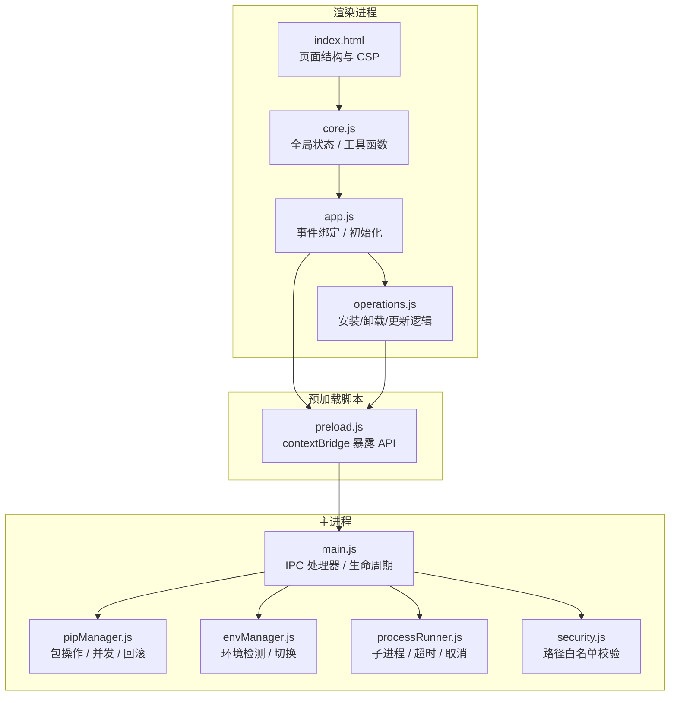
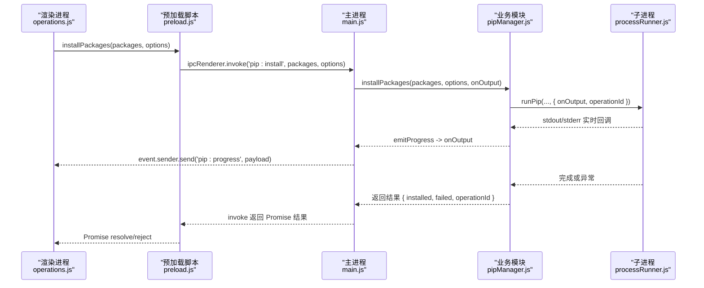
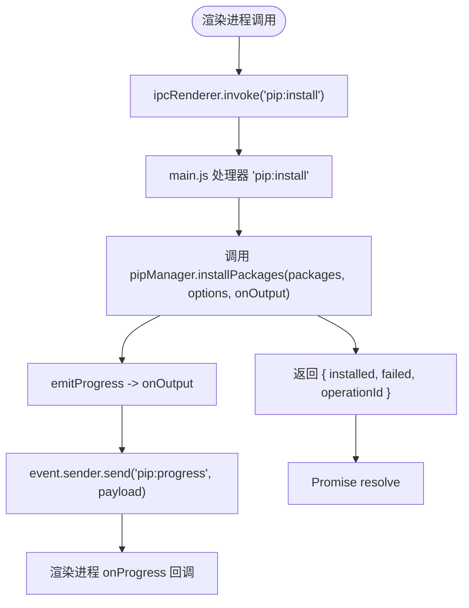
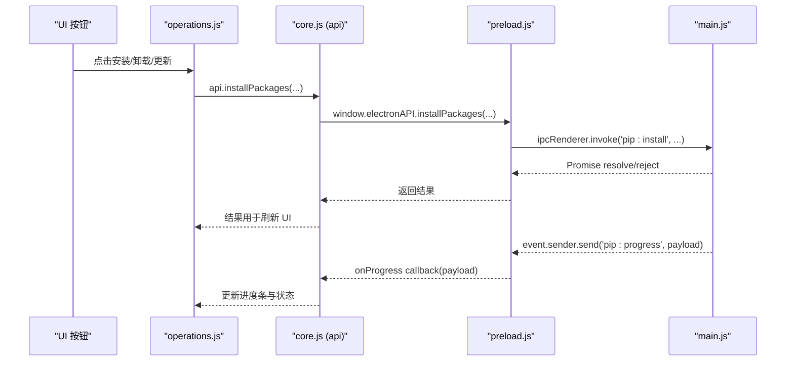
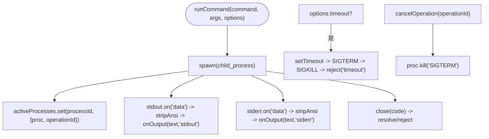
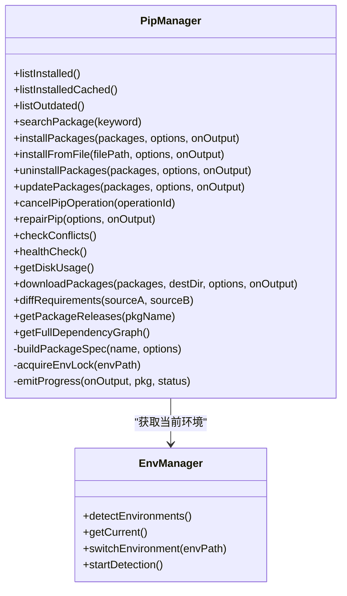
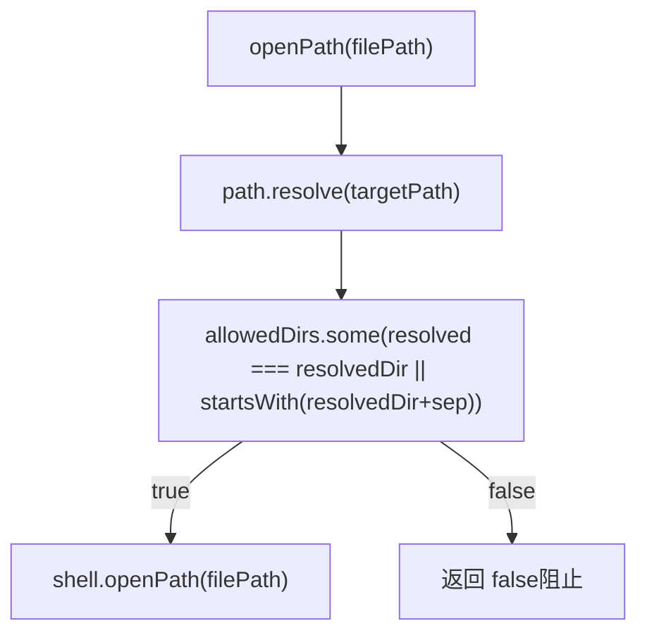
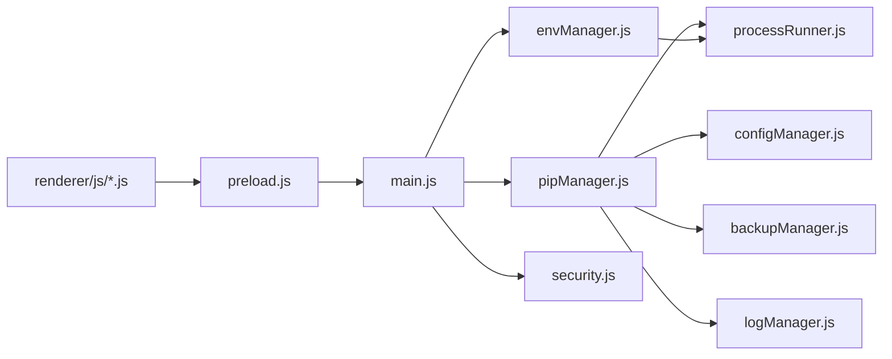

# 模块通信机制

<cite>
**本文引用的文件**   
- [main.js](file://main.js)
- [preload.js](file://preload.js)
- [renderer/index.html](file://renderer/index.html)
- [renderer/js/app.js](file://renderer/js/app.js)
- [renderer/js/core.js](file://renderer/js/core.js)
- [renderer/js/operations.js](file://renderer/js/operations.js)
- [utils/processRunner.js](file://utils/processRunner.js)
- [core/system/envManager.js](file://core/system/envManager.js)
- [core/operations/pipManager.js](file://core/operations/pipManager.js)
- [utils/security.js](file://utils/security.js)
</cite>

## 目录
1. [简介](#简介)
2. [项目结构](#项目结构)
3. [核心组件](#核心组件)
4. [架构总览](#架构总览)
5. [详细组件分析](#详细组件分析)
6. [依赖关系分析](#依赖关系分析)
7. [性能考量](#性能考量)
8. [故障排查指南](#故障排查指南)
9. [结论](#结论)
10. [附录：通信事件与 API 清单](#附录通信事件与-api-清单)

## 简介
本文件系统化阐述 PyLibMaster 的模块通信机制，重点覆盖主进程与渲染进程之间的 IPC 模式、消息传递、事件监听、数据同步、安全桥接（contextBridge）、错误处理与异常传播、异步回调与 Promise 链式调用、权限控制与数据序列化等。文档同时提供通信流程图与常见问题解决方案，帮助读者快速理解并正确使用该通信体系。

## 项目结构
PyLibMaster 基于 Electron 架构，采用“主进程 + 预加载脚本 + 渲染进程”的分层设计：
- 主进程：负责窗口管理、系统能力访问、IPC 处理器注册、业务模块协调。
- 预加载脚本：通过 contextBridge 暴露受限 API，作为安全桥接层。
- 渲染进程：UI 与交互逻辑，通过 window.electronAPI 调用主进程能力。

**图表来源** 
- [main.js:1-120](file://main.js#L1-L120)
- [preload.js:1-221](file://preload.js#L1-L221)
- [renderer/index.html:1-120](file://renderer/index.html#L1-L120)
- [renderer/js/app.js:1-120](file://renderer/js/app.js#L1-L120)
- [renderer/js/core.js:1-93](file://renderer/js/core.js#L1-L93)
- [renderer/js/operations.js:1-120](file://renderer/js/operations.js#L1-L120)
- [utils/processRunner.js:1-120](file://utils/processRunner.js#L1-L120)
- [core/system/envManager.js:1-120](file://core/system/envManager.js#L1-L120)
- [core/operations/pipManager.js:1-120](file://core/operations/pipManager.js#L1-L120)
- [utils/security.js:1-43](file://utils/security.js#L1-L43)

**章节来源**
- [main.js:1-120](file://main.js#L1-L120)
- [preload.js:1-221](file://preload.js#L1-L221)
- [renderer/index.html:1-120](file://renderer/index.html#L1-L120)

## 核心组件
- 主进程入口与 IPC 处理器（main.js）
  - 注册所有 ipcMain.handle 处理器，将渲染进程请求路由到具体业务模块。
  - 使用 mainWindow.webContents.send 推送事件（如 pip:progress、theme:changed、updates:available、scheduler:executed）。
- 预加载脚本（preload.js）
  - 通过 contextBridge.exposeInMainWorld 暴露 window.electronAPI，封装 ipcRenderer.invoke 和 on 监听。
  - 统一命名空间，避免渲染进程直接访问 Node API。
- 渲染进程入口与状态（renderer/js/app.js, renderer/js/core.js）
  - app.js 负责 UI 事件绑定、启动流程、事件订阅（进度、主题、更新、调度器）。
  - core.js 定义全局 api 引用、共享状态与通用工具（如生成 operationId）。
- 操作逻辑（renderer/js/operations.js）
  - 实现安装/卸载/更新的交互与调用，维护进度状态、取消操作、刷新数据。
- 子进程与命令执行（utils/processRunner.js）
  - 封装 spawn、超时、取消、输出回调、ANSI 清理、pip 自动安装。
- 业务模块（core/operations/pipManager.js, core/system/envManager.js）
  - pipManager 提供包查询、安装、卸载、更新、缓存、并发、回滚、镜像重试等。
  - envManager 负责 Python 环境检测、切换与持久化。
- 安全工具（utils/security.js）
  - 路径白名单校验，防止路径遍历攻击。

**章节来源**
- [main.js:233-640](file://main.js#L233-L640)
- [preload.js:20-221](file://preload.js#L20-L221)
- [renderer/js/app.js:1-120](file://renderer/js/app.js#L1-L120)
- [renderer/js/core.js:1-93](file://renderer/js/core.js#L1-L93)
- [renderer/js/operations.js:1-120](file://renderer/js/operations.js#L1-L120)
- [utils/processRunner.js:1-120](file://utils/processRunner.js#L1-L120)
- [core/operations/pipManager.js:1-120](file://core/operations/pipManager.js#L1-L120)
- [core/system/envManager.js:1-120](file://core/system/envManager.js#L1-L120)
- [utils/security.js:1-43](file://utils/security.js#L1-L43)

## 架构总览
下图展示一次“安装包”操作的完整 IPC 通信流程，包括渲染进程调用、主进程处理器转发、业务模块执行、子进程运行、进度事件回推与结果返回。

**图表来源** 
- [renderer/js/operations.js:300-370](file://renderer/js/operations.js#L300-L370)
- [preload.js:59-65](file://preload.js#L59-L65)
- [main.js:310-348](file://main.js#L310-L348)
- [core/operations/pipManager.js:495-578](file://core/operations/pipManager.js#L495-L578)
- [utils/processRunner.js:340-353](file://utils/processRunner.js#L340-L353)

## 详细组件分析

### 预加载脚本的安全桥接层（preload.js）
- 通过 contextBridge.exposeInMainWorld 暴露 window.electronAPI，仅暴露必要方法。
- 所有调用均使用 ipcRenderer.invoke，确保渲染进程无法直接访问 Node API。
- 事件监听封装为 onXxx(callback)，内部使用 ipcRenderer.on，并在每次注册前移除旧监听，避免重复绑定。
- 关键暴露接口类别：
  - 窗口控制：windowMinimize/windowMaximize/windowClose
  - 环境管理：detectEnvironments/getCurrentEnv/switchEnvironment
  - 虚拟环境：createVenv/listVenvs/deleteVenv/getVenvInfo
  - 包查询与操作：listInstalled/installPackages/uninstallPackages/updatePackages/cancelPipOperation/repairPip
  - 备份与镜像源：backup/mirror 相关接口
  - 日志与配置：log/config 相关接口
  - 系统功能：version/browse/openPath/notify/theme/scheduler/template/audit/disk/offline/releases/graph/undo/explorer
  - 进度与更新事件：onProgress/onUpdater* 系列

```mermaid
classDiagram
class ElectronAPI {
+windowMinimize()
+windowMaximize()
+windowClose()
+detectEnvironments()
+getCurrentEnv()
+switchEnvironment(envPath)
+createVenv(options)
+listVenvs()
+deleteVenv(name)
+getVenvInfo(name)
+listInstalled()
+listInstalledCached()
+listOutdated()
+searchPackage(keyword)
+showPackageInfo(pkgName)
+getDependencyTree(pkgName)
+exportRequirements(options)
+importRequirements(filePath, options)
+compareEnvironments(envA, envB)
+installPackages(packages, options)
+installFromFile(filePath, options)
+uninstallPackages(packages, options)
+updatePackages(packages, options)
+cancelPipOperation(operationId)
+repairPip(options)
+createBackup()
+listBackups()
+restoreBackup(backupId)
+deleteBackup(backupId)
+getMirrors()
+testMirrorSpeed(url)
+testAllMirrors()
+setDefaultMirror(url)
+addCustomMirror(name, url, remark)
+updateMirror(url, updates)
+removeCustomMirror(url)
+restoreDefaultMirrors()
+setSmartRoute(enabled)
+getSmartRoute()
+writePipMirrorConfig()
+reorderMirrors(urlOrder)
+getLogs(filter)
+clearLogs()
+addLog(entry)
+getConfig()
+setConfig(key, value)
+setConfigBulk(updates)
+getAppVersion()
+browseDirectory()
+browseFile(filters)
+openPath(filePath)
+sendNotification(title, body)
+exportLogs(format)
+getSystemTheme()
+onThemeChanged(callback)
+onUpdatesAvailable(callback)
+getSchedulerStatus()
+saveSchedulerConfig(config)
+runSchedulerNow()
+onSchedulerExecuted(callback)
+getTemplates()
+addCustomTemplate(tpl)
+removeCustomTemplate(id)
+createFromTemplate(options)
+createSnapshot(envPath, label)
+listSnapshots()
+getSnapshotDetail(id)
+restoreSnapshot(snapshotId, envPath)
+deleteSnapshot(id)
+runAudit()
+getCachedAudit()
+getDiskUsage()
+downloadPackages(packages, destDir, options)
+diffRequirements(sourceA, sourceB)
+getPackageReleases(pkgName)
+getDependencyGraph()
+checkConflicts()
+healthCheck()
+canUndo()
+performUndo()
+clearUndo()
+getExplorerStatus()
+enableExplorerMenu()
+disableExplorerMenu()
+onProgress(callback)
+removeProgressListener(callback)
+checkForUpdates()
+installUpdate()
+onUpdaterChecking(callback)
+onUpdaterAvailable(callback)
+onUpdaterNotAvailable(callback)
+onUpdaterProgress(callback)
+onUpdaterDownloaded(callback)
+onUpdaterError(callback)
}
```

**图表来源** 
- [preload.js:20-221](file://preload.js#L20-L221)

**章节来源**
- [preload.js:20-221](file://preload.js#L20-L221)

### 主进程 IPC 处理器（main.js）
- 使用 ipcMain.handle 注册大量处理器，对应 preload 暴露的方法名。
- 对需要实时进度的操作（安装/卸载/更新/导入/模板创建/快照恢复/审计等），在处理器中通过 event.sender.send('pip:progress', payload) 推送进度。
- 对系统级能力（打开路径、通知、对话框）进行安全限制与异常捕获。
- 示例：安装处理器将 onOutput 回调传递给 pipManager.installPackages，后者通过 emitProgress 触发 pip:progress 事件。

**图表来源** 
- [main.js:310-348](file://main.js#L310-L348)
- [core/operations/pipManager.js:495-578](file://core/operations/pipManager.js#L495-L578)

**章节来源**
- [main.js:233-640](file://main.js#L233-L640)

### 渲染进程调用与事件订阅（app.js, core.js, operations.js）
- core.js 定义 api = window.electronAPI，供各模块统一调用。
- app.js 启动时并行加载配置、环境、镜像、缓存库，订阅 onProgress、onThemeChanged、onUpdatesAvailable、onSchedulerExecuted 等事件。
- operations.js 实现安装/卸载/更新的具体逻辑，维护 progressOperation、progressTotal、progressDone、currentOperationId，支持取消操作。

**图表来源** 
- [renderer/js/app.js:80-120](file://renderer/js/app.js#L80-L120)
- [renderer/js/core.js:11-14](file://renderer/js/core.js#L11-L14)
- [renderer/js/operations.js:300-370](file://renderer/js/operations.js#L300-L370)
- [preload.js:59-65](file://preload.js#L59-L65)
- [main.js:310-348](file://main.js#L310-L348)

**章节来源**
- [renderer/js/app.js:1-120](file://renderer/js/app.js#L1-L120)
- [renderer/js/core.js:1-93](file://renderer/js/core.js#L1-L93)
- [renderer/js/operations.js:1-120](file://renderer/js/operations.js#L1-L120)

### 子进程与命令执行（processRunner.js）
- runCommand/spawn 封装了子进程创建、UTF-8 编码、stdout/stderr 实时回调、ANSI 清理、超时与两级终止（SIGTERM + SIGKILL）。
- 活跃进程列表 activeProcesses 支持按 processId 或 operationId 取消。
- ensurePip 自动检测并安装 pip（ensurepip 或 get-pip.py），失败抛出明确错误。
- runPip/runPython 便捷封装。

**图表来源** 
- [utils/processRunner.js:85-161](file://utils/processRunner.js#L85-L161)
- [utils/processRunner.js:181-206](file://utils/processRunner.js#L181-L206)
- [utils/processRunner.js:233-278](file://utils/processRunner.js#L233-L278)

**章节来源**
- [utils/processRunner.js:1-120](file://utils/processRunner.js#L1-L120)

### 业务模块：pipManager 与 envManager
- pipManager：
  - 包名与版本规格严格校验（正则、长度、UNC/敏感目录检查）。
  - 并发安装（runInParallel）、智能重试（多镜像源）、自动回滚（备份/恢复）。
  - 已安装包缓存（5分钟 TTL）、site-packages 路径缓存（30秒 TTL）。
  - 进度事件 emitProgress 标准化输出，便于前端可靠计数。
- envManager：
  - 扫描常见路径与 PATH，获取 Python 与 pip 版本，过滤无 pip 的环境。
  - 切换环境并持久化 currentEnv。

**图表来源** 
- [core/operations/pipManager.js:1-120](file://core/operations/pipManager.js#L1-L120)
- [core/system/envManager.js:1-120](file://core/system/envManager.js#L1-L120)

**章节来源**
- [core/operations/pipManager.js:1-120](file://core/operations/pipManager.js#L1-L120)
- [core/system/envManager.js:1-120](file://core/system/envManager.js#L1-L120)

### 安全验证与权限控制（security.js）
- isAllowedOpenPath 使用 path.resolve 解析绝对路径，并进行边界检查，防止路径遍历攻击。
- main.js 的 system:openPath 处理器强制白名单目录（documents/downloads/userData），非法路径直接拒绝。

**图表来源** 
- [utils/security.js:28-40](file://utils/security.js#L28-L40)
- [main.js:449-466](file://main.js#L449-L466)

**章节来源**
- [utils/security.js:1-43](file://utils/security.js#L1-L43)
- [main.js:449-466](file://main.js#L449-L466)

## 依赖关系分析
- 渲染进程依赖 preload 暴露的 electronAPI，不直接访问 Node。
- 主进程集中注册 IPC 处理器，解耦渲染进程与业务模块。
- pipManager 依赖 processRunner 执行子进程，依赖 configManager 读取配置，依赖 backupManager/logManager 辅助功能。
- envManager 依赖 processRunner 执行 Python 命令。
- security.js 被 main.js 的 system:openPath 处理器引用，确保路径安全。

**图表来源** 
- [renderer/js/app.js:1-120](file://renderer/js/app.js#L1-L120)
- [preload.js:20-221](file://preload.js#L20-L221)
- [main.js:233-640](file://main.js#L233-L640)
- [core/operations/pipManager.js:1-120](file://core/operations/pipManager.js#L1-L120)
- [core/system/envManager.js:1-120](file://core/system/envManager.js#L1-L120)
- [utils/processRunner.js:1-120](file://utils/processRunner.js#L1-L120)
- [utils/security.js:1-43](file://utils/security.js#L1-L43)

**章节来源**
- [main.js:233-640](file://main.js#L233-L640)
- [core/operations/pipManager.js:1-120](file://core/operations/pipManager.js#L1-L120)
- [core/system/envManager.js:1-120](file://core/system/envManager.js#L1-L120)
- [utils/processRunner.js:1-120](file://utils/processRunner.js#L1-L120)
- [utils/security.js:1-43](file://utils/security.js#L1-L43)

## 性能考量
- 缓存策略：
  - 已安装包缓存（5分钟 TTL）减少频繁扫描 site-packages。
  - site-packages 路径缓存（30秒 TTL）降低重复计算。
  - pip 就绪状态缓存（5分钟）避免重复检测。
- 并发与并行：
  - pipManager 支持并行安装/更新，线程数由配置 parallelThreads 控制。
  - envManager 并行获取多个环境的版本信息。
- 异步与事件驱动：
  - 进度事件 pip:progress 实时反馈，避免阻塞 UI。
  - 启动阶段使用 Promise.allSettled 并行加载非关键数据。
- I/O 优化：
  - 配置保存使用原子写入（临时文件 + rename）。
  - 日志导出批量构建内容后一次性写入。

[本节为通用指导，无需特定文件引用]

## 故障排查指南
- 安装/卸载/更新失败
  - 检查 pip 是否可用（ensurePip 自动安装失败会抛错）。
  - 查看 pip:progress 事件中的 stderr 输出定位问题。
  - 确认 operationId 是否正确传递，以便取消操作。
- 子进程超时
  - processRunner 会在 timeout 后发送 SIGTERM，等待 5 秒后 SIGKILL；检查网络与镜像源。
- 路径安全问题
  - openPath 仅允许 documents/downloads/userData 下的路径，其他将被拒绝。
- 事件重复绑定
  - preload 的 onXxx 方法在注册前会 removeAllListeners，避免重复回调。
- 配置损坏
  - configManager 在读取失败时重建默认配置并保存。

**章节来源**
- [utils/processRunner.js:150-161](file://utils/processRunner.js#L150-L161)
- [utils/security.js:28-40](file://utils/security.js#L28-L40)
- [main.js:449-466](file://main.js#L449-L466)
- [core/operations/pipManager.js:495-578](file://core/operations/pipManager.js#L495-L578)

## 结论
PyLibMaster 的模块通信机制以 Electron 的 IPC 为核心，通过 preload 的安全桥接层将主进程能力安全地暴露给渲染进程。主进程集中注册处理器，业务模块负责复杂逻辑，子进程执行器提供稳定可靠的命令执行与取消能力。整体架构清晰、职责分明，具备完善的错误处理、进度反馈与安全控制，适合扩展与维护。

[本节为总结性内容，无需特定文件引用]

## 附录：通信事件与 API 清单
- 渲染进程调用（ipcRenderer.invoke）
  - 窗口控制：window:minimize / window:maximize / window:close
  - 环境管理：env:detect / env:getCurrent / env:switch
  - 虚拟环境：venv:create / venv:list / venv:delete / venv:info
  - 包查询与操作：pip:list / pip:listCached / pip:outdated / pip:search / pip:showInfo / pip:depTree / pip:export / pip:import / pip:compareEnvs / pip:install / pip:installFromFile / pip:uninstall / pip:update / pip:cancel / pip:repair / pip:checkConflicts / pip:healthCheck / pip:diskUsage / pip:download / pip:diffRequirements / pip:releases / pip:depGraph
  - 备份与镜像：backup:create / backup:list / backup:restore / backup:delete / mirror:list / mirror:test / mirror:testAll / mirror:setDefault / mirror:addCustom / mirror:update / mirror:removeCustom / mirror:restoreDefaults / mirror:smartRoute / mirror:getSmartRoute / mirror:writePipConfig / mirror:reorder
  - 日志与配置：log:get / log:clear / log:add / log:export / config:get / config:set / config:setBulk
  - 系统功能：system:version / system:browseDirectory / system:browseFile / system:openPath / notify:send / theme:getSystem
  - 自动更新：updater:check / updater:install
  - 定时调度：scheduler:getStatus / scheduler:save / scheduler:runNow
  - 模板与快照：template:list / template:add / template:remove / template:create / snapshot:create / snapshot:list / snapshot:detail / snapshot:restore / snapshot:delete
  - 审计与撤销：audit:run / audit:cached / undo:canUndo / undo:perform / undo:clear
  - 资源管理器集成：explorer:getStatus / explorer:enable / explorer:disable
- 主进程推送事件（event.sender.send）
  - pip:progress：进度与状态（operation、data、type）
  - theme:changed：主题变化（dark/light）
  - updates:available：可更新数量
  - scheduler:executed：调度执行结果
  - updater:*：检查/下载/错误等更新阶段事件

**章节来源**
- [main.js:233-640](file://main.js#L233-L640)
- [preload.js:20-221](file://preload.js#L20-L221)