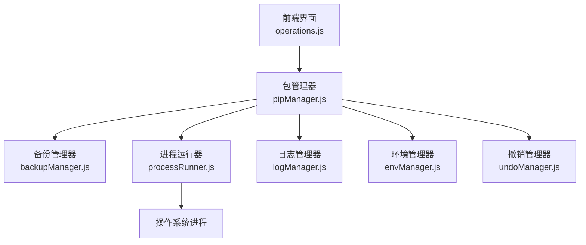
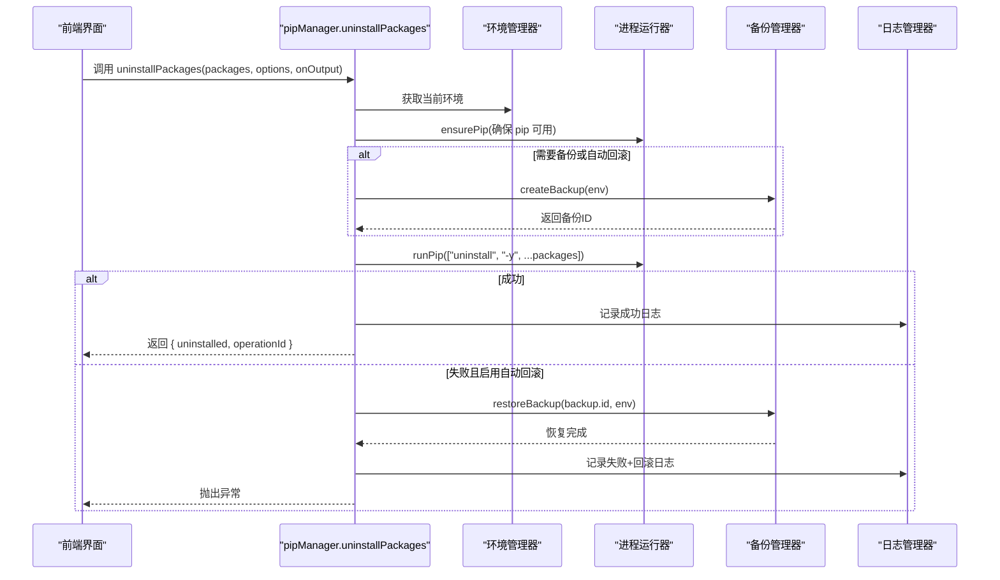
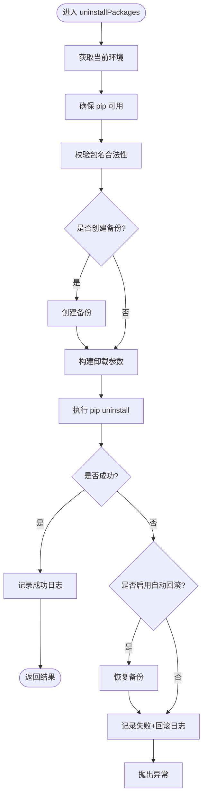
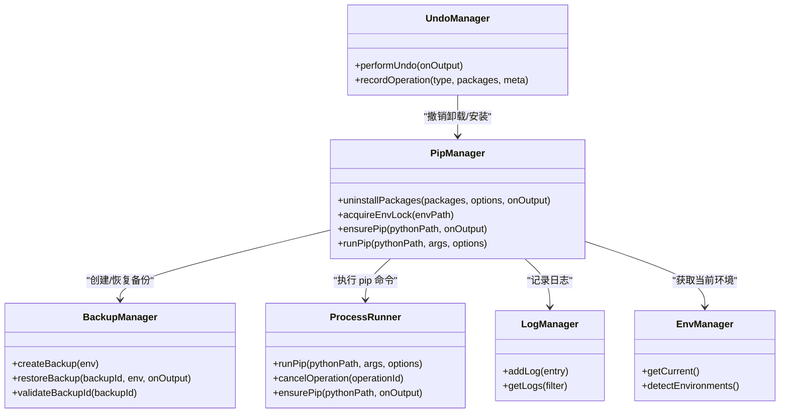

# 包卸载功能

<cite>
**本文引用的文件**   
- [pipManager.js](file://core/operations/pipManager.js)
- [backupManager.js](file://core/operations/backupManager.js)
- [undoManager.js](file://core/operations/undoManager.js)
- [operations.js](file://renderer/js/operations.js)
- [processRunner.js](file://utils/processRunner.js)
- [logManager.js](file://core/system/logManager.js)
- [envManager.js](file://core/system/envManager.js)
- [security.js](file://utils/security.js)
</cite>

## 目录
1. [简介](#简介)
2. [项目结构](#项目结构)
3. [核心组件](#核心组件)
4. [架构总览](#架构总览)
5. [详细组件分析](#详细组件分析)
6. [依赖关系分析](#依赖关系分析)
7. [性能考量](#性能考量)
8. [故障排查指南](#故障排查指南)
9. [结论](#结论)
10. [附录：API 调用示例与最佳实践](#附录api-调用示例与最佳实践)

## 简介
本文件围绕“包卸载”能力进行系统化说明，重点解析 uninstallPackages 方法的实现原理与使用方式。该模块支持批量卸载、安全模式（仅卸载指定包，不影响依赖关系）、自动备份与回滚机制，并在卸载前执行环境检查、包名验证与安全校验；在卸载过程中提供依赖检测、冲突处理与错误恢复；同时具备完善的日志记录、进度反馈与异常处理机制。文档还包含 API 调用示例与最佳实践，帮助开发者快速集成并安全使用卸载能力。

## 项目结构
卸载相关代码主要分布在以下模块：
- core/operations/pipManager.js：卸载主流程、参数校验、并发锁、日志与进度
- core/operations/backupManager.js：备份创建与恢复（基于 pip freeze）
- core/operations/undoManager.js：操作撤销栈（可回退卸载或安装）
- renderer/js/operations.js：前端卸载入口与交互逻辑
- utils/processRunner.js：子进程运行器（pip 命令执行、超时、取消）
- core/system/logManager.js：操作日志持久化与查询
- core/system/envManager.js：当前 Python 环境管理
- utils/security.js：路径安全校验工具

图表来源
- [pipManager.js:727-771](file://core/operations/pipManager.js#L727-L771)
- [backupManager.js:89-113](file://core/operations/backupManager.js#L89-L113)
- [processRunner.js:340-342](file://utils/processRunner.js#L340-L342)
- [logManager.js:112-131](file://core/system/logManager.js#L112-L131)
- [envManager.js:178-184](file://core/system/envManager.js#L178-L184)
- [operations.js:80-113](file://renderer/js/operations.js#L80-L113)

章节来源
- [pipManager.js:727-771](file://core/operations/pipManager.js#L727-L771)
- [backupManager.js:89-113](file://core/operations/backupManager.js#L89-L113)
- [operations.js:80-113](file://renderer/js/operations.js#L80-L113)

## 核心组件
- 卸载主流程（uninstallPackages）
  - 输入：包名数组 packages，选项 options（backup、rollback、force、operationId），输出回调 onOutput
  - 行为：获取当前环境、确保 pip 可用、可选创建备份、构建 pip 卸载参数、执行卸载、失败时按策略回滚、记录日志、释放环境锁
- 备份与恢复（backupManager）
  - createBackup：通过 pip freeze 生成备份文件
  - restoreBackup：通过 pip install -r 强制重装指定版本，不重装依赖
- 撤销栈（undoManager）
  - 记录最近的操作（安装/卸载/更新），支持 performUndo 执行逆向操作
- 进程运行器（processRunner）
  - runPip：封装 python -m pip 执行，支持超时、取消、实时输出
- 日志管理器（logManager）
  - addLog：统一记录操作日志，支持筛选与容量控制
- 环境管理器（envManager）
  - getCurrent：返回当前选中的 Python 环境
- 安全工具（security）
  - isAllowedOpenPath：路径白名单校验（用于其他场景）

章节来源
- [pipManager.js:727-771](file://core/operations/pipManager.js#L727-L771)
- [backupManager.js:89-113](file://core/operations/backupManager.js#L89-L113)
- [undoManager.js:66-106](file://core/operations/undoManager.js#L66-L106)
- [processRunner.js:340-342](file://utils/processRunner.js#L340-L342)
- [logManager.js:112-131](file://core/system/logManager.js#L112-L131)
- [envManager.js:178-184](file://core/system/envManager.js#L178-L184)

## 架构总览
卸载流程的整体时序如下：

图表来源
- [pipManager.js:727-771](file://core/operations/pipManager.js#L727-L771)
- [backupManager.js:89-113](file://core/operations/backupManager.js#L89-L113)
- [processRunner.js:340-342](file://utils/processRunner.js#L340-L342)
- [logManager.js:112-131](file://core/system/logManager.js#L112-L131)

## 详细组件分析

### 卸载主流程（uninstallPackages）
- 环境检查
  - 获取当前环境，若未选择则抛出错误
  - 确保 pip 可用（必要时自动安装）
- 包名验证与安全校验
  - 对每个包名进行类型与正则校验，非法名称直接抛出错误
  - 防止命令注入与路径遍历（参考 buildPackageSpec 的安全策略，卸载路径同样遵循严格校验）
- 备份与回滚
  - 当 options.backup 为真或 autoRollback 开启时，先创建备份
  - 卸载失败且 autoRollback 为真时，自动恢复备份并记录日志
- 卸载执行
  - 构建参数：['uninstall', '-y', ...packages]，可选 --no-warn-script-location
  - 通过 runPip 执行，支持超时与取消
- 日志与进度
  - 成功/失败均记录日志
  - 可通过 onOutput 接收实时输出（由 processRunner 转发）
- 并发控制
  - 使用环境级互斥锁，避免同一环境并发操作导致冲突

图表来源
- [pipManager.js:727-771](file://core/operations/pipManager.js#L727-L771)
- [backupManager.js:89-113](file://core/operations/backupManager.js#L89-L113)
- [processRunner.js:340-342](file://utils/processRunner.js#L340-L342)
- [logManager.js:112-131](file://core/system/logManager.js#L112-L131)

章节来源
- [pipManager.js:727-771](file://core/operations/pipManager.js#L727-L771)

### 备份与恢复（backupManager）
- 创建备份
  - 通过 pip freeze 获取已安装包列表及版本，写入备份文件
  - 文件名格式：backup_{环境名}_{时间戳}.txt
- 恢复备份
  - 使用 pip install -r 强制重装指定版本的包，--no-deps 不重装依赖
  - 适用于卸载失败后的快速恢复
- 安全性
  - 备份 ID 校验，防止路径遍历攻击
  - 限制备份 ID 长度与字符集

章节来源
- [backupManager.js:89-113](file://core/operations/backupManager.js#L89-L113)
- [backupManager.js:156-170](file://core/operations/backupManager.js#L156-L170)

### 撤销栈（undoManager）
- 记录操作
  - 支持安装、卸载、更新三类操作的记录
- 撤销卸载
  - 撤销卸载即重新安装对应包（带版本号）
- 撤销安装
  - 撤销安装即卸载这些包
- 撤销更新
  - 根据旧版本信息回退到旧版本

章节来源
- [undoManager.js:66-106](file://core/operations/undoManager.js#L66-L106)

### 前端卸载入口（operations.js）
- 单包卸载与批量卸载
  - 支持弹出备份确认对话框
  - 支持勾选“自动回滚”选项
- 卸载执行
  - 设置进度状态、操作 ID
  - 调用 api.uninstallPackages，传入 backup、rollback、operationId
- 刷新与提示
  - 成功后刷新已安装列表与统计信息
  - 显示成功/失败提示与桌面通知

章节来源
- [operations.js:80-113](file://renderer/js/operations.js#L80-L113)

### 进程运行器（processRunner）
- runPip
  - 封装 python -m pip 执行，支持超时、取消、实时输出
- 取消操作
  - cancelOperation 按 operationId 取消所有关联进程
- 自动安装 pip
  - ensurePip 优先使用 ensurepip，失败后尝试 get-pip.py

章节来源
- [processRunner.js:340-342](file://utils/processRunner.js#L340-L342)
- [processRunner.js:181-191](file://utils/processRunner.js#L181-L191)
- [processRunner.js:233-278](file://utils/processRunner.js#L233-L278)

### 日志管理器（logManager）
- addLog
  - 统一记录操作日志，支持字段截断与容量控制
- 查询与清空
  - getLogs 支持按类型与关键词筛选
  - clearLogs 清空所有日志

章节来源
- [logManager.js:112-131](file://core/system/logManager.js#L112-L131)
- [logManager.js:143-159](file://core/system/logManager.js#L143-L159)

### 环境管理器（envManager）
- getCurrent
  - 返回当前选中的 Python 环境
- detectEnvironments
  - 扫描常见安装路径，检测 Python 与 pip 版本

章节来源
- [envManager.js:178-184](file://core/system/envManager.js#L178-L184)
- [envManager.js:85-170](file://core/system/envManager.js#L85-L170)

### 安全工具（security）
- isAllowedOpenPath
  - 路径白名单校验，防止路径遍历攻击

章节来源
- [security.js:28-40](file://utils/security.js#L28-L40)

## 依赖关系分析
卸载功能的依赖关系如下：

图表来源
- [pipManager.js:727-771](file://core/operations/pipManager.js#L727-L771)
- [backupManager.js:89-113](file://core/operations/backupManager.js#L89-L113)
- [processRunner.js:340-342](file://utils/processRunner.js#L340-L342)
- [logManager.js:112-131](file://core/system/logManager.js#L112-L131)
- [envManager.js:178-184](file://core/system/envManager.js#L178-L184)
- [undoManager.js:66-106](file://core/operations/undoManager.js#L66-L106)

章节来源
- [pipManager.js:727-771](file://core/operations/pipManager.js#L727-L771)
- [backupManager.js:89-113](file://core/operations/backupManager.js#L89-L113)
- [processRunner.js:340-342](file://utils/processRunner.js#L340-L342)
- [logManager.js:112-131](file://core/system/logManager.js#L112-L131)
- [envManager.js:178-184](file://core/system/envManager.js#L178-L184)
- [undoManager.js:66-106](file://core/operations/undoManager.js#L66-L106)

## 性能考量
- 并发控制
  - 环境级互斥锁避免同一环境并发操作，减少资源竞争与状态不一致
- 缓存优化
  - pip 就绪状态缓存（5分钟 TTL）减少重复检测开销
  - site-packages 路径缓存（30秒 TTL）加速包大小估算
- 并行卸载
  - 当前卸载流程为串行执行，如需提升吞吐可在上层拆分任务或使用队列限流
- I/O 优化
  - 日志写入采用防抖（300ms）降低频繁磁盘写
  - 备份文件读写为一次性操作，影响较小

[本节为通用指导，不直接分析具体文件]

## 故障排查指南
- 常见问题
  - 未选择 Python 环境：检查 envManager.getCurrent 返回值
  - pip 不可用：确保 ensurePip 成功，必要时手动安装 pip
  - 包名非法：检查包名是否符合 VALID_PACKAGE_NAME 正则
  - 备份失败：检查备份目录权限与磁盘空间
  - 卸载失败：查看日志详情与 pip 输出 stderr
- 定位方法
  - 查看 logManager 的 operations.json 日志
  - 使用 onOutput 回调捕获实时输出
  - 通过 cancelOperation 取消长时间运行的进程
- 恢复策略
  - 启用自动回滚，失败时自动恢复备份
  - 使用 undoManager.performUndo 执行逆向操作

章节来源
- [logManager.js:112-131](file://core/system/logManager.js#L112-L131)
- [processRunner.js:181-191](file://utils/processRunner.js#L181-L191)
- [pipManager.js:727-771](file://core/operations/pipManager.js#L727-L771)

## 结论
uninstallPackages 提供了完整、安全的包卸载能力，涵盖环境检查、包名验证、备份与回滚、日志记录、进度反馈与异常处理。通过模块化设计与严格的校验机制，确保卸载过程稳定可靠。建议在生产环境中启用自动回滚与备份，结合日志与撤销栈实现可追溯与可恢复的操作体验。

[本节为总结性内容，不直接分析具体文件]

## 附录：API 调用示例与最佳实践

### API 调用示例
- 基本卸载
  - 调用 uninstallPackages(['numpy'], {}, onOutput)
  - 返回 { uninstalled: ['numpy'], operationId }
- 带备份与回滚
  - 调用 uninstallPackages(['pandas', 'scipy'], { backup: true, rollback: true }, onOutput)
  - 失败时自动恢复备份并记录日志
- 强制卸载
  - 调用 uninstallPackages(['requests'], { force: true }, onOutput)
  - 添加 --no-warn-script-location 参数

章节来源
- [operations.js:80-113](file://renderer/js/operations.js#L80-L113)
- [pipManager.js:727-771](file://core/operations/pipManager.js#L727-L771)

### 最佳实践
- 始终启用备份与自动回滚，确保卸载失败可恢复
- 使用 onOutput 回调收集实时输出，便于调试与用户反馈
- 合理设置超时时间，避免长时间阻塞
- 批量卸载时注意包名合法性校验，避免非法输入
- 利用 undoManager 提供撤销能力，增强用户体验

[本节为通用指导，不直接分析具体文件]