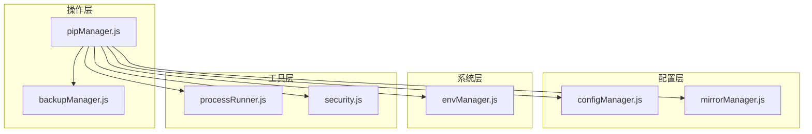
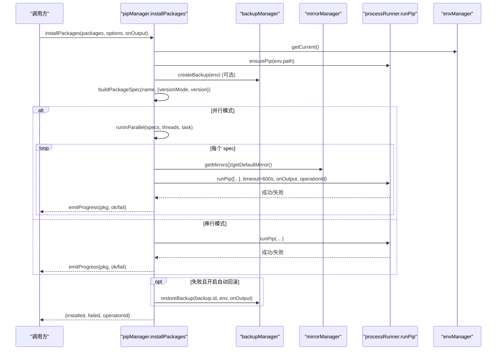
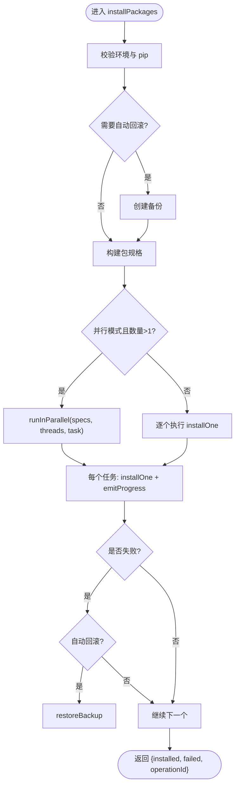
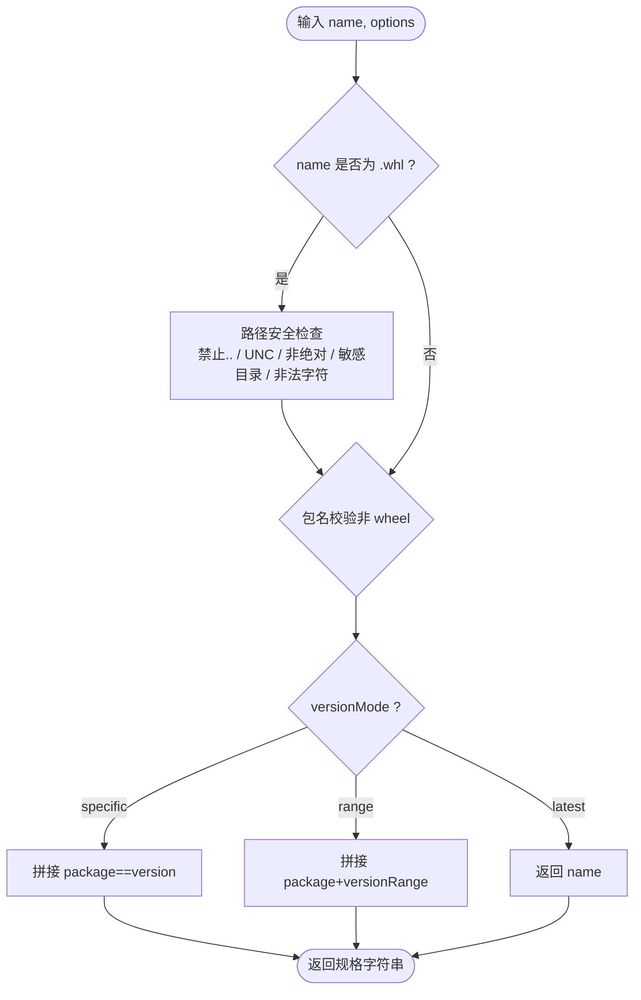
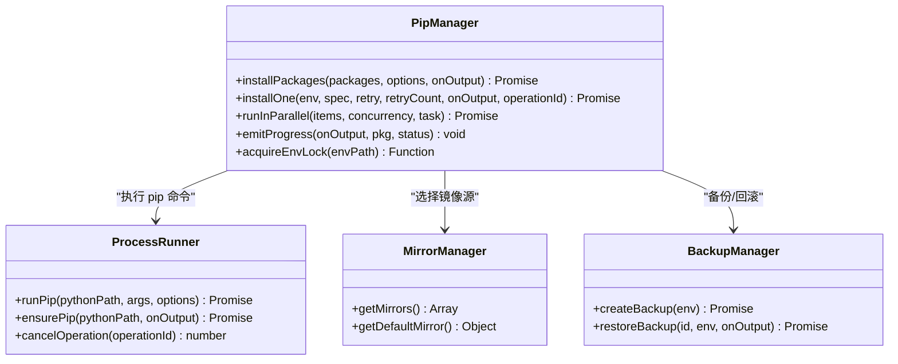
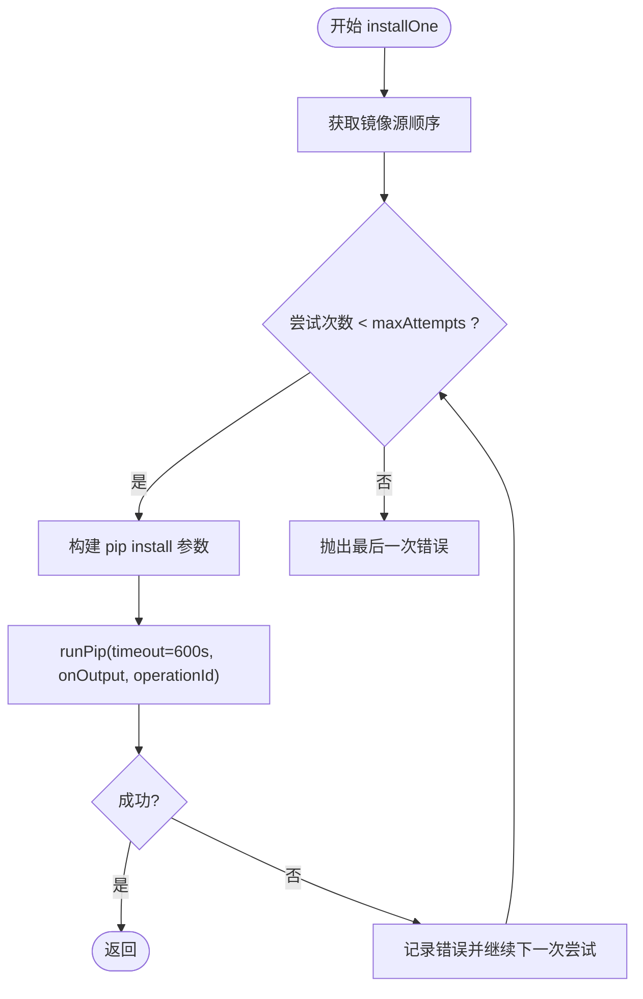
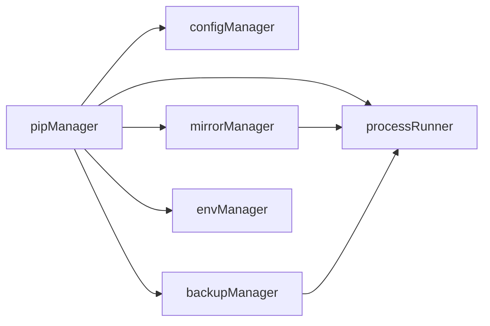

# 包安装功能

<cite>
**本文引用的文件**   
- [pipManager.js](file://core/operations/pipManager.js)
- [mirrorManager.js](file://core/config/mirrorManager.js)
- [processRunner.js](file://utils/processRunner.js)
- [security.js](file://utils/security.js)
- [configManager.js](file://core/config/configManager.js)
- [backupManager.js](file://core/operations/backupManager.js)
- [envManager.js](file://core/system/envManager.js)
</cite>

## 目录
1. [简介](#简介)
2. [项目结构](#项目结构)
3. [核心组件](#核心组件)
4. [架构总览](#架构总览)
5. [详细组件分析](#详细组件分析)
6. [依赖关系分析](#依赖关系分析)
7. [性能考量](#性能考量)
8. [故障排查指南](#故障排查指南)
9. [结论](#结论)
10. [附录：API 使用示例](#附录api-使用示例)

## 简介
本文件聚焦于“包安装”功能的实现与使用，重点解析 installPackages 方法的核心流程、并发与重试机制、版本控制策略、自动回滚保护，以及 buildPackageSpec 的规格构建逻辑。同时涵盖镜像源重试策略、超时处理、错误恢复、线程池管理与进度回调机制，并提供可直接参考的 API 调用示例路径。

## 项目结构
围绕包安装的关键模块分布如下：
- 操作层（operations）：pipManager 负责包的查询、安装、卸载、更新、下载、依赖分析等；backupManager 提供备份与恢复能力。
- 配置层（config）：configManager 管理应用配置（并行线程数、重试次数等）；mirrorManager 管理 PyPI 镜像源列表、智能路由与 pip 配置写入。
- 系统层（system）：envManager 检测并管理 Python 环境。
- 工具层（utils）：processRunner 封装子进程执行、超时、取消、pip 自动安装；security 提供路径安全校验。

图表来源
- [pipManager.js:1-120](file://core/operations/pipManager.js#L1-L120)
- [mirrorManager.js:1-120](file://core/config/mirrorManager.js#L1-L120)
- [processRunner.js:1-120](file://utils/processRunner.js#L1-L120)
- [configManager.js:1-120](file://core/config/configManager.js#L1-L120)
- [backupManager.js:1-120](file://core/operations/backupManager.js#L1-L120)
- [envManager.js:1-120](file://core/system/envManager.js#L1-L120)

章节来源
- [pipManager.js:1-120](file://core/operations/pipManager.js#L1-L120)
- [mirrorManager.js:1-120](file://core/config/mirrorManager.js#L1-L120)
- [processRunner.js:1-120](file://utils/processRunner.js#L1-L120)
- [configManager.js:1-120](file://core/config/configManager.js#L1-L120)
- [backupManager.js:1-120](file://core/operations/backupManager.js#L1-L120)
- [envManager.js:1-120](file://core/system/envManager.js#L1-L120)

## 核心组件
- pipManager：包安装/卸载/更新/下载/依赖分析/健康检查等核心业务。
- mirrorManager：镜像源管理、测速、智能路由、pip 配置文件写入。
- processRunner：子进程运行器、pip 自动安装、超时与取消、输出回调。
- backupManager：基于 pip freeze 的备份与恢复，支持强制重装。
- configManager：应用配置持久化，包含并行线程数、重试次数等。
- envManager：Python 环境发现与切换。
- security：路径安全校验（防路径遍历）。

章节来源
- [pipManager.js:1-120](file://core/operations/pipManager.js#L1-L120)
- [mirrorManager.js:1-120](file://core/config/mirrorManager.js#L1-L120)
- [processRunner.js:1-120](file://utils/processRunner.js#L1-L120)
- [backupManager.js:1-120](file://core/operations/backupManager.js#L1-L120)
- [configManager.js:1-120](file://core/config/configManager.js#L1-L120)
- [envManager.js:1-120](file://core/system/envManager.js#L1-L120)

## 架构总览
包安装的整体流程如下：
- 入口：installPackages(packages, options, onOutput)
- 前置：确保当前环境有效、确保 pip 可用、创建备份（可选）、生成包规格（buildPackageSpec）
- 执行：串行或并行（runInParallel）执行单个安装（installOne），每个任务内部多镜像源重试
- 结果：收集成功/失败，发送进度事件，记录日志，必要时触发回滚

图表来源
- [pipManager.js:495-578](file://core/operations/pipManager.js#L495-L578)
- [pipManager.js:590-615](file://core/operations/pipManager.js#L590-L615)
- [pipManager.js:912-924](file://core/operations/pipManager.js#L912-L924)
- [mirrorManager.js:109-130](file://core/config/mirrorManager.js#L109-L130)
- [processRunner.js:233-278](file://utils/processRunner.js#L233-L278)
- [backupManager.js:89-113](file://core/operations/backupManager.js#L89-L113)

## 详细组件分析

### installPackages 方法（批量安装、并行、重试、回滚）
- 输入参数
  - packages：字符串数组，包名或 wheel 路径
  - options：
    - versionMode：latest/specific/range
    - version：版本号或范围
    - parallel：是否并行
    - retry：是否启用智能重试（多镜像源）
    - rollback：是否自动回滚（默认开启）
    - operationId：操作 ID（用于取消）
  - onOutput：输出回调（stdout/stderr/progress）
- 关键流程
  - 获取当前环境，确保 pip 可用
  - 读取配置（parallelThreads、retryCount）
  - 可选创建备份（autoRollback）
  - 构建包规格 specs（buildPackageSpec）
  - 若 parallel=true 且 specs>1，则按 threads=min(config.parallelThreads, specs.length) 并行执行
  - 每个 spec 通过 installOne 执行，内部多镜像源重试
  - 每步通过 emitProgress 推送进度事件
  - 失败时根据 autoRollback 决定是否回滚
- 并发模型
  - 使用 runInParallel 实现固定并发度的工作队列
  - 同一环境的互斥锁（acquireEnvLock）保证环境级串行，避免冲突
- 错误隔离
  - 每个 spec 独立 try/catch，失败不影响其他 spec
  - 失败项记录到 failed 数组，并输出 stderr
- 进度回调
  - emitProgress 统一格式：[PROGRESS] {"done":1,"pkg":"...","status":"ok|fail"}
- 超时与取消
  - runPip 支持 timeout 与 operationId，cancelOperation 可批量取消

图表来源
- [pipManager.js:495-578](file://core/operations/pipManager.js#L495-L578)
- [pipManager.js:912-924](file://core/operations/pipManager.js#L912-L924)
- [pipManager.js:590-615](file://core/operations/pipManager.js#L590-L615)
- [backupManager.js:89-113](file://core/operations/backupManager.js#L89-L113)

章节来源
- [pipManager.js:495-578](file://core/operations/pipManager.js#L495-L578)
- [pipManager.js:912-924](file://core/operations/pipManager.js#L912-L924)
- [pipManager.js:590-615](file://core/operations/pipManager.js#L590-L615)
- [backupManager.js:89-113](file://core/operations/backupManager.js#L89-L113)

### buildPackageSpec（包规格构建与安全校验）
- 支持模式
  - latest：直接返回包名
  - specific：package==version
  - range：package>=x,<y
  - wheel：直接返回绝对路径（严格安全检查）
- 安全校验要点
  - 包名长度限制与正则校验（仅允许字母数字及点、短横线、下划线）
  - wheel 路径禁止 ..、UNC 路径、非绝对路径、敏感目录、非法字符
  - wheel 文件名必须匹配合法命名规范
- 版本规格校验
  - versionMode 为 specific/range 时，对 version 进行长度与正则校验

图表来源
- [pipManager.js:154-217](file://core/operations/pipManager.js#L154-L217)

章节来源
- [pipManager.js:154-217](file://core/operations/pipManager.js#L154-L217)

### 并发安装的线程池管理、错误隔离与进度回调
- 线程池
  - runInParallel(items, concurrency, task)：维护一个共享队列与固定数量的 worker，worker 循环取任务执行
  - 并发度由 config.parallelThreads 决定，上限受 items.length 限制
- 错误隔离
  - 每个任务独立 try/catch，失败项加入 failed，不中断整体流程
  - 输出 stderr 并通过 emitProgress 上报状态
- 进度回调
  - emitProgress(onOutput, pkg, status) 统一推送 JSON 格式的进度事件
- 环境互斥
  - acquireEnvLock(envPath) 保证同一环境内操作串行，避免并发写冲突

图表来源
- [pipManager.js:495-578](file://core/operations/pipManager.js#L495-L578)
- [pipManager.js:590-615](file://core/operations/pipManager.js#L590-L615)
- [pipManager.js:912-924](file://core/operations/pipManager.js#L912-L924)
- [processRunner.js:233-278](file://utils/processRunner.js#L233-L278)
- [mirrorManager.js:109-130](file://core/config/mirrorManager.js#L109-L130)
- [backupManager.js:89-113](file://core/operations/backupManager.js#L89-L113)

章节来源
- [pipManager.js:495-578](file://core/operations/pipManager.js#L495-L578)
- [pipManager.js:912-924](file://core/operations/pipManager.js#L912-L924)
- [processRunner.js:233-278](file://utils/processRunner.js#L233-L278)
- [mirrorManager.js:109-130](file://core/config/mirrorManager.js#L109-L130)
- [backupManager.js:89-113](file://core/operations/backupManager.js#L89-L113)

### 镜像源重试策略、超时处理与错误恢复
- 镜像源顺序
  - 优先 defaultMirror，其次其余 mirrors（去重 default）
  - 至少尝试两次（maxAttempts = max(2, min(retryCount, mirrorOrder.length))）
- 重试逻辑
  - installOne 循环尝试不同镜像源，直到成功或耗尽
  - updateOne 额外判断“Requirement already satisfied”，视为未生效继续换源
- 超时与取消
  - runPip 支持 timeout（毫秒），超时后先 SIGTERM，再延迟 SIGKILL
  - cancelOperation(operationId) 可批量终止关联进程
- 错误恢复
  - 失败时记录 stderr 并继续下一镜像源
  - 若开启自动回滚，则在首次失败时立即 restoreBackup

图表来源
- [pipManager.js:590-615](file://core/operations/pipManager.js#L590-L615)
- [processRunner.js:85-161](file://utils/processRunner.js#L85-L161)
- [processRunner.js:181-191](file://utils/processRunner.js#L181-L191)

章节来源
- [pipManager.js:590-615](file://core/operations/pipManager.js#L590-L615)
- [processRunner.js:85-161](file://utils/processRunner.js#L85-L161)
- [processRunner.js:181-191](file://utils/processRunner.js#L181-L191)

### 自动回滚保护
- 触发条件
  - installPackages/updatePackages/uninstallPackages 在失败且 autoRollback=true 时触发
- 实现方式
  - 操作前创建备份（pip freeze 输出保存为 txt）
  - 失败时调用 restoreBackup，使用 --force-reinstall --no-deps 恢复指定版本
- 安全性
  - 备份 ID 校验防止路径遍历（validateBackupId）

章节来源
- [pipManager.js:514-521](file://core/operations/pipManager.js#L514-L521)
- [pipManager.js:552-562](file://core/operations/pipManager.js#L552-L562)
- [backupManager.js:89-113](file://core/operations/backupManager.js#L89-L113)
- [backupManager.js:156-170](file://core/operations/backupManager.js#L156-L170)

## 依赖关系分析
- pipManager 依赖：
  - configManager：读取 parallelThreads、retryCount
  - mirrorManager：获取镜像源列表与默认源
  - backupManager：备份与恢复
  - envManager：获取当前环境
  - processRunner：执行 pip、确保 pip 可用、取消操作
- 外部集成点：
  - pip 命令行（install/uninstall/list/show/index/...）
  - 文件系统（备份文件、缓存、site-packages）
  - 网络（镜像源访问、PyPI JSON API）

图表来源
- [pipManager.js:1-120](file://core/operations/pipManager.js#L1-L120)
- [mirrorManager.js:1-120](file://core/config/mirrorManager.js#L1-L120)
- [backupManager.js:1-120](file://core/operations/backupManager.js#L1-L120)
- [envManager.js:1-120](file://core/system/envManager.js#L1-L120)
- [processRunner.js:1-120](file://utils/processRunner.js#L1-L120)

章节来源
- [pipManager.js:1-120](file://core/operations/pipManager.js#L1-L120)
- [mirrorManager.js:1-120](file://core/config/mirrorManager.js#L1-L120)
- [backupManager.js:1-120](file://core/operations/backupManager.js#L1-L120)
- [envManager.js:1-120](file://core/system/envManager.js#L1-L120)
- [processRunner.js:1-120](file://utils/processRunner.js#L1-L120)

## 性能考量
- 并发安装
  - 合理设置 parallelThreads（默认 4，最大 16），避免过多线程导致 I/O 竞争
- 镜像源重试
  - 多镜像源顺序尝试提升成功率，但会增加总体耗时；可通过 smartRoute 选择最快镜像
- 缓存
  - site-packages 路径缓存 TTL 30s；已安装包缓存 5min；pip 就绪状态缓存 5min
- 磁盘 IO
  - 估算包大小与安装时间采用快速扫描与缓存，避免重复递归计算
- 超时
  - 安装/更新默认 600s 超时，避免长时间阻塞

章节来源
- [pipManager.js:226-243](file://core/operations/pipManager.js#L226-L243)
- [pipManager.js:88-127](file://core/operations/pipManager.js#L88-L127)
- [processRunner.js:20-24](file://utils/processRunner.js#L20-L24)
- [configManager.js:21-29](file://core/config/configManager.js#L21-L29)

## 故障排查指南
- 常见问题定位
  - 无 Python 环境：检查 envManager.getCurrent() 是否返回有效环境
  - pip 不可用：查看 ensurePip 日志，确认 ensurepip/get-pip.py 安装过程
  - 镜像源失败：观察 installOne 的 stderr 输出，确认各镜像源响应
  - 超时：增大 timeout 或优化网络；检查 cancelOperation 是否误杀
  - 回滚触发：确认 autoRollback 开关与备份文件是否存在
- 诊断工具
  - healthCheck：综合检查环境健康（依赖冲突、元数据损坏等）
  - checkConflicts：基于 pip check 解析冲突信息
  - listInstalled/listOutdated：验证包列表与可更新情况

章节来源
- [pipManager.js:1492-1566](file://core/operations/pipManager.js#L1492-L1566)
- [pipManager.js:1442-1485](file://core/operations/pipManager.js#L1442-L1485)
- [processRunner.js:233-278](file://utils/processRunner.js#L233-L278)
- [backupManager.js:156-170](file://core/operations/backupManager.js#L156-L170)

## 结论
installPackages 提供了健壮、可扩展的包安装能力：支持批量与并行、智能多镜像源重试、严格的版本规格构建与安全校验、自动回滚保护、实时进度回调与环境互斥锁。配合 processRunner 的超时与取消机制、mirrorManager 的智能路由与 pip 配置写入、backupManager 的安全备份与恢复，形成完整的包管理闭环。建议在生产环境中开启自动回滚与合理的并发/重试配置，以获得最佳稳定性与用户体验。

## 附录：API 使用示例
以下示例展示如何使用不同版本模式与选项进行包安装。为避免泄露具体代码内容，仅提供调用路径与说明。

- 基本安装（最新）
  - 调用：installPackages(['numpy', 'pandas'], { versionMode: 'latest' }, onOutput)
  - 说明：默认 latest 模式，等价于传入空 versionMode
  - 参考路径：[pipManager.js:495-578](file://core/operations/pipManager.js#L495-L578)

- 指定版本安装
  - 调用：installPackages(['requests'], { versionMode: 'specific', version: '2.31.0' }, onOutput)
  - 说明：生成 requests==2.31.0 规格
  - 参考路径：[pipManager.js:200-206](file://core/operations/pipManager.js#L200-L206)

- 版本范围安装
  - 调用：installPackages(['flask'], { versionMode: 'range', version: '>=2.0,<3.0' }, onOutput)
  - 说明：生成 flask>=2.0,<3.0 规格
  - 参考路径：[pipManager.js:208-214](file://core/operations/pipManager.js#L208-L214)

- 从 wheel 文件安装
  - 调用：installPackages(['/absolute/path/to/pkg-1.0-py3-none-any.whl'], {}, onOutput)
  - 说明：wheel 路径需为绝对路径，且通过安全检查
  - 参考路径：[pipManager.js:160-188](file://core/operations/pipManager.js#L160-L188)

- 并行安装与智能重试
  - 调用：installPackages(['a','b','c'], { parallel: true, retry: true, rollback: true }, onOutput)
  - 说明：并行执行，多镜像源重试，失败自动回滚
  - 参考路径：[pipManager.js:527-540](file://core/operations/pipManager.js#L527-L540)

- 自定义线程数与重试次数
  - 调用：configManager.setBulk({ parallelThreads: 6, retryCount: 3 })
  - 说明：调整并发与重试上限
  - 参考路径：[configManager.js:21-29](file://core/config/configManager.js#L21-L29)

- 取消正在进行的安装
  - 调用：processRunner.cancelOperation(operationId)
  - 说明：按 operationId 批量取消关联进程
  - 参考路径：[processRunner.js:181-191](file://utils/processRunner.js#L181-L191)

- 进度回调处理
  - 说明：onOutput(text, type) 中解析 [PROGRESS] 行以更新 UI
  - 参考路径：[pipManager.js:61-63](file://core/operations/pipManager.js#L61-L63)

- 从 requirements.txt 安装
  - 调用：installFromFile('/path/to/requirements.txt', { retry: true, rollback: true }, onOutput)
  - 说明：支持 .txt 批量安装，带镜像重试与回滚
  - 参考路径：[pipManager.js:665-712](file://core/operations/pipManager.js#L665-L712)

- 从 wheel 文件安装（单文件）
  - 调用：installFromFile('/path/to/pkg.whl', { rollback: true }, onOutput)
  - 说明：单 wheel 安装，支持回滚
  - 参考路径：[pipManager.js:627-663](file://core/operations/pipManager.js#L627-L663)