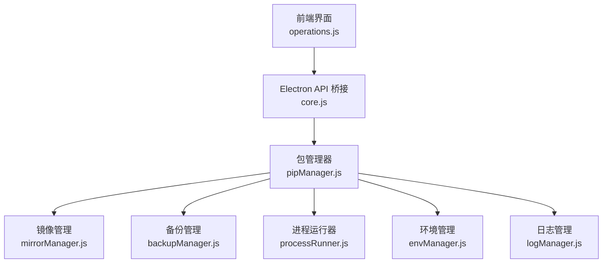
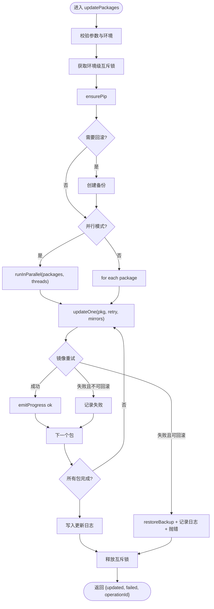
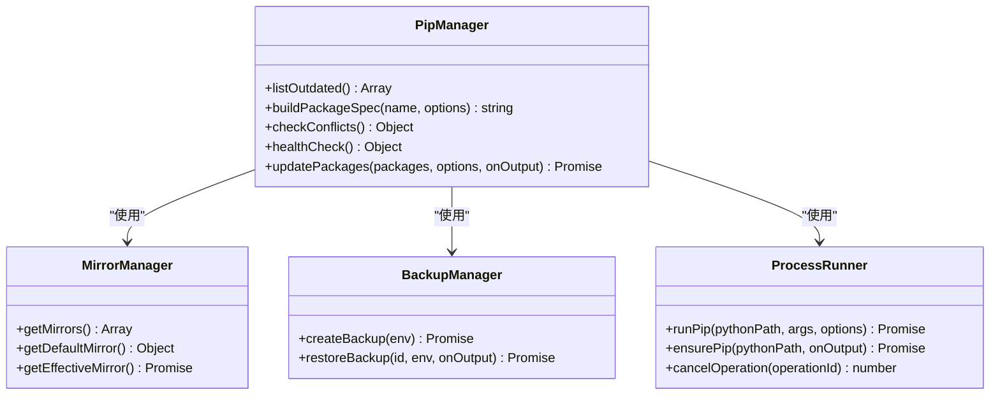
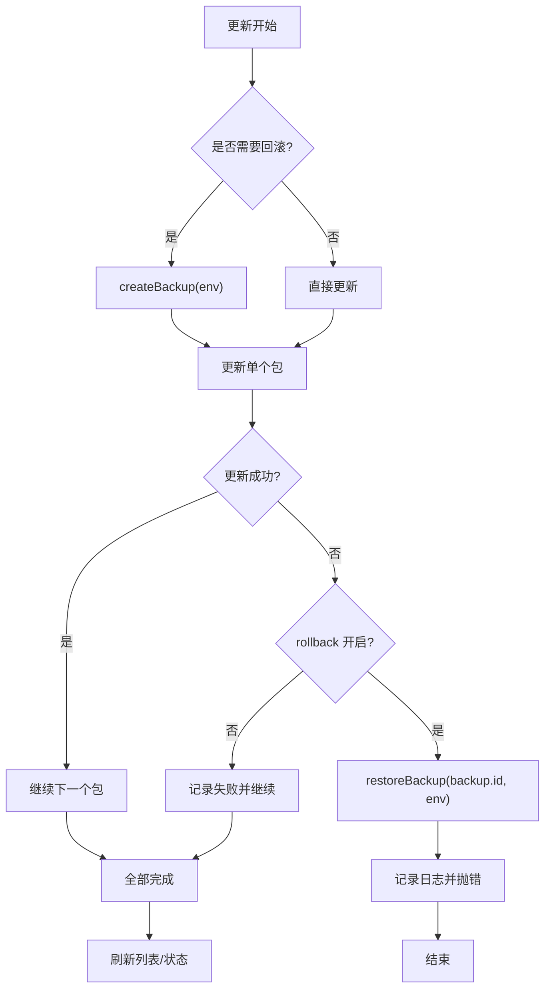
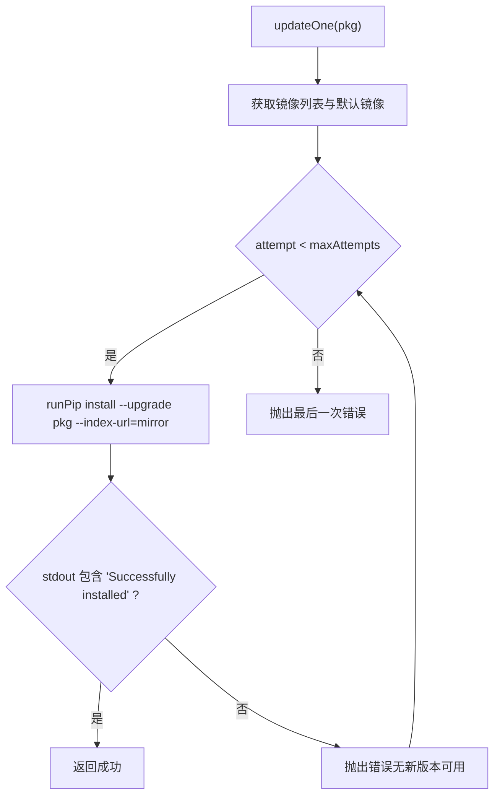
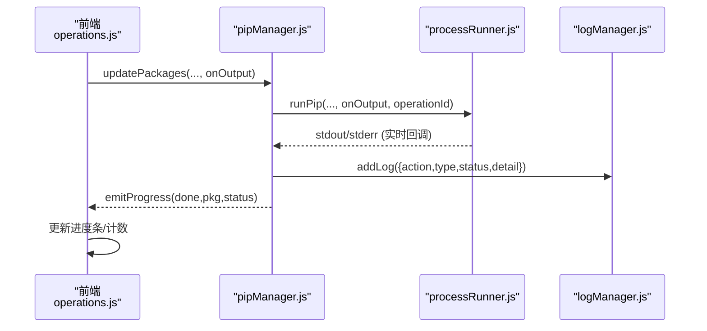
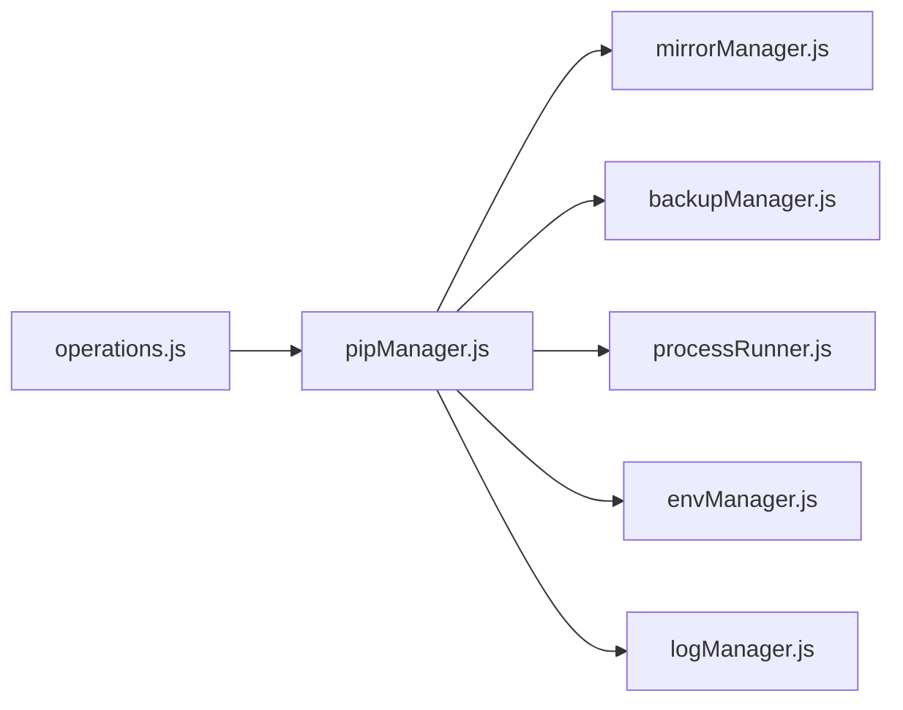

# 包更新功能

<cite>
**本文引用的文件**   
- [pipManager.js](file://core/operations/pipManager.js)
- [mirrorManager.js](file://core/config/mirrorManager.js)
- [backupManager.js](file://core/operations/backupManager.js)
- [logManager.js](file://core/system/logManager.js)
- [processRunner.js](file://utils/processRunner.js)
- [envManager.js](file://core/system/envManager.js)
- [operations.js](file://renderer/js/operations.js)
- [core.js](file://renderer/js/core.js)
</cite>

## 目录
1. [简介](#简介)
2. [项目结构](#项目结构)
3. [核心组件](#核心组件)
4. [架构总览](#架构总览)
5. [详细组件分析](#详细组件分析)
6. [依赖关系分析](#依赖关系分析)
7. [性能考量](#性能考量)
8. [故障排查指南](#故障排查指南)
9. [结论](#结论)
10. [附录：API 调用示例](#附录api-调用示例)

## 简介
本文件面向“包更新”能力，重点解析 updatePackages 方法的实现与使用。该能力支持：
- 批量更新、并行处理
- 智能重试与多镜像源切换
- 版本兼容性验证与依赖冲突检测
- 更新前备份、失败回滚与状态恢复
- 进度监控、错误处理与日志记录

## 项目结构
围绕包更新的核心代码分布在以下模块：
- 业务逻辑层：pipManager.js（安装/卸载/更新/查询等）
- 镜像管理：mirrorManager.js（内置/自定义镜像、测速、智能路由）
- 备份恢复：backupManager.js（freeze 快照、恢复）
- 进程运行器：processRunner.js（子进程、超时、取消、ensurePip）
- 环境管理：envManager.js（当前 Python 环境）
- 日志管理：logManager.js（操作日志持久化）
- 前端交互：operations.js（更新按钮、进度、选项读取）
- 全局状态：core.js（全局变量、操作 ID 生成）



图表来源
- [pipManager.js:787-867](file://core/operations/pipManager.js#L787-L867)
- [mirrorManager.js:1-376](file://core/config/mirrorManager.js#L1-L376)
- [backupManager.js:1-196](file://core/operations/backupManager.js#L1-L196)
- [processRunner.js:1-366](file://utils/processRunner.js#L1-L366)
- [envManager.js:1-220](file://core/system/envManager.js#L1-L220)
- [logManager.js:1-173](file://core/system/logManager.js#L1-L173)
- [operations.js:115-236](file://renderer/js/operations.js#L115-L236)
- [core.js:1-93](file://renderer/js/core.js#L1-L93)

章节来源
- [pipManager.js:787-867](file://core/operations/pipManager.js#L787-L867)
- [operations.js:115-236](file://renderer/js/operations.js#L115-L236)

## 核心组件
- pipManager.updatePackages：批量更新的入口，负责参数校验、环境锁、可选备份、并行或串行执行、结果汇总与日志。
- mirrorManager：提供默认/自定义镜像列表、智能路由、测速、构建命令行参数。
- backupManager：基于 pip freeze 创建快照，支持按备份 ID 恢复。
- processRunner：封装子进程执行、超时、取消、ensurePip 自动安装。
- envManager：获取当前 Python 环境，确保命令在正确环境中执行。
- logManager：统一记录操作日志，支持筛选与容量控制。
- operations.js：前端更新流程，收集用户选项、发起 API 调用、展示进度与结果。

章节来源
- [pipManager.js:787-904](file://core/operations/pipManager.js#L787-L904)
- [mirrorManager.js:1-376](file://core/config/mirrorManager.js#L1-L376)
- [backupManager.js:1-196](file://core/operations/backupManager.js#L1-L196)
- [processRunner.js:1-366](file://utils/processRunner.js#L1-L366)
- [envManager.js:1-220](file://core/system/envManager.js#L1-L220)
- [logManager.js:1-173](file://core/system/logManager.js#L1-L173)
- [operations.js:115-236](file://renderer/js/operations.js#L115-L236)

## 架构总览
updatePackages 的端到端调用链如下：

```mermaid
sequenceDiagram
participant UI as "前端界面<br/>operations.js"
participant Core as "全局状态<br/>core.js"
participant PM as "包管理器<br/>pipManager.js"
participant MR as "镜像管理<br/>mirrorManager.js"
participant BK as "备份管理<br/>backupManager.js"
participant PR as "进程运行器<br/>processRunner.js"
participant ENV as "环境管理<br/>envManager.js"
participant LOG as "日志管理<br/>logManager.js"
UI->>Core : 生成 operationId, 设置进度状态
UI->>PM : updatePackages(packages, options, onOutput)
PM->>ENV : getCurrentEnv()
PM->>PR : ensurePip(env.path)
alt 自动回滚开启
PM->>BK : createBackup(env)
BK-->>PM : {id, path, createdAt}
end
opt 并行模式
PM->>PM : runInParallel(packages, threads, task)
loop 每个包
PM->>MR : getMirrors()/getDefaultMirror()
PM->>PR : runPip(install --upgrade pkg, index-url=mirror)
PR-->>PM : stdout/stderr
PM->>LOG : addLog(...)
end
else 串行模式
loop 每个包
PM->>MR : getMirrors()/getDefaultMirror()
PM->>PR : runPip(install --upgrade pkg, index-url=mirror)
PR-->>PM : stdout/stderr
PM->>LOG : addLog(...)
end
end
PM-->>UI : {updated, failed, operationId}
UI->>UI : 刷新列表/统计/通知
```

图表来源
- [pipManager.js:787-904](file://core/operations/pipManager.js#L787-L904)
- [mirrorManager.js:1-376](file://core/config/mirrorManager.js#L1-L376)
- [backupManager.js:1-196](file://core/operations/backupManager.js#L1-L196)
- [processRunner.js:1-366](file://utils/processRunner.js#L1-L366)
- [envManager.js:1-220](file://core/system/envManager.js#L1-L220)
- [logManager.js:1-173](file://core/system/logManager.js#L1-L173)
- [operations.js:115-236](file://renderer/js/operations.js#L115-L236)

## 详细组件分析

### updatePackages 方法详解
- 输入参数
  - packages: 包名数组
  - options.parallel: 是否并行
  - options.retry: 是否启用智能重试（多镜像源）
  - options.rollback: 是否自动回滚（默认开启）
  - options.operationId: 用于取消与跟踪
  - onOutput: 输出回调（stdout/stderr/progress）
- 关键流程
  - 环境校验与环境级互斥锁（同一环境串行）
  - 可选创建备份（autoRollback）
  - 根据 parallel 选择并行或串行执行 updateOne
  - 每个包尝试多个镜像源，遇到“Requirement already satisfied”视为未升级成功并继续下一个镜像
  - 失败时若开启回滚则立即恢复备份并抛出异常
  - 汇总 updated/failed 并写入日志
- 复杂度与并发
  - 并行线程数 = min(config.parallelThreads, packages.length)
  - 每个包的镜像重试次数 = max(2, min(retryCount, mirrors.length))
- 错误处理
  - 包名校验、空输入校验
  - 子进程异常捕获、超时终止、SIGTERM/SIGKILL 两级终止
  - 回滚失败也会记录日志并向上抛出



图表来源
- [pipManager.js:787-904](file://core/operations/pipManager.js#L787-L904)
- [pipManager.js:912-924](file://core/operations/pipManager.js#L912-L924)
- [processRunner.js:1-366](file://utils/processRunner.js#L1-L366)
- [backupManager.js:1-196](file://core/operations/backupManager.js#L1-L196)

章节来源
- [pipManager.js:787-904](file://core/operations/pipManager.js#L787-L904)
- [pipManager.js:912-924](file://core/operations/pipManager.js#L912-L924)

### 更新策略：检查可更新包、版本兼容性与依赖冲突
- 检查可更新包
  - listOutdated：通过 pip list --outdated --format=json 获取可更新列表
- 版本兼容性验证
  - buildPackageSpec：对包名与版本规格进行严格正则校验，防止注入与非法字符
- 依赖冲突检测
  - checkConflicts：调用 pip check 解析冲突信息，返回冲突清单与消息
  - healthCheck：综合诊断（包元数据损坏、site-packages 可访问性、依赖冲突等），给出健康评分



图表来源
- [pipManager.js:428-472](file://core/operations/pipManager.js#L428-L472)
- [pipManager.js:154-217](file://core/operations/pipManager.js#L154-L217)
- [pipManager.js:1442-1485](file://core/operations/pipManager.js#L1442-L1485)
- [pipManager.js:1492-1566](file://core/operations/pipManager.js#L1492-L1566)
- [mirrorManager.js:1-376](file://core/config/mirrorManager.js#L1-L376)
- [backupManager.js:1-196](file://core/operations/backupManager.js#L1-L196)
- [processRunner.js:1-366](file://utils/processRunner.js#L1-L366)

章节来源
- [pipManager.js:428-472](file://core/operations/pipManager.js#L428-L472)
- [pipManager.js:154-217](file://core/operations/pipManager.js#L154-L217)
- [pipManager.js:1442-1485](file://core/operations/pipManager.js#L1442-L1485)
- [pipManager.js:1492-1566](file://core/operations/pipManager.js#L1492-L1566)

### 备份创建、失败回滚与状态恢复
- 备份创建
  - 使用 pip freeze 导出当前环境的包及版本到备份文件
  - 文件名格式：backup_{环境名}_{时间戳}.txt
- 失败回滚
  - 更新任一包失败且开启 rollback，立即 restoreBackup（--force-reinstall --no-deps）
  - 回滚成功后抛出异常，阻止后续更新
- 状态恢复
  - 通过备份 ID 定位文件，校验安全性（防路径遍历）
  - 恢复后重新刷新已安装/可更新列表，保证 UI 一致性



图表来源
- [backupManager.js:89-113](file://core/operations/backupManager.js#L89-L113)
- [backupManager.js:156-170](file://core/operations/backupManager.js#L156-L170)
- [pipManager.js:809-853](file://core/operations/pipManager.js#L809-L853)

章节来源
- [backupManager.js:89-113](file://core/operations/backupManager.js#L89-L113)
- [backupManager.js:156-170](file://core/operations/backupManager.js#L156-L170)
- [pipManager.js:809-853](file://core/operations/pipManager.js#L809-L853)

### 并行处理与智能重试
- 并行处理
  - runInParallel(items, concurrency, task) 使用队列+worker 池限制并发
  - 线程数由配置项 parallelThreads 决定，上限不超过包数量
- 智能重试与多镜像源
  - updateOne 中按默认镜像优先顺序尝试，至少尝试两次
  - 当 stdout 包含 “Requirement already satisfied” 且无 “Successfully installed”，视为未升级成功，继续下一个镜像
  - 可通过 options.retry 控制是否启用多镜像重试（内部始终尝试多镜像，但最大次数受 retryCount 限制）



图表来源
- [pipManager.js:874-904](file://core/operations/pipManager.js#L874-L904)
- [pipManager.js:912-924](file://core/operations/pipManager.js#L912-L924)
- [mirrorManager.js:1-376](file://core/config/mirrorManager.js#L1-L376)

章节来源
- [pipManager.js:874-904](file://core/operations/pipManager.js#L874-L904)
- [pipManager.js:912-924](file://core/operations/pipManager.js#L912-L924)
- [mirrorManager.js:1-376](file://core/config/mirrorManager.js#L1-L376)

### 进度监控、错误处理与日志记录
- 进度监控
  - emitProgress 发送结构化进度事件，前端据此更新“已完成/总数”计数
  - 前端 operations.js 维护 progressTotal、progressDone、progressOperation 等状态
- 错误处理
  - 子进程超时：SIGTERM -> 等待 -> SIGKILL
  - 取消操作：通过 operationId 批量终止关联进程
- 日志记录
  - logManager.addLog 统一记录 action/status/type/detail，支持去抖写入与裁剪字段长度



图表来源
- [pipManager.js:61-63](file://core/operations/pipManager.js#L61-L63)
- [processRunner.js:85-161](file://utils/processRunner.js#L85-L161)
- [logManager.js:112-131](file://core/system/logManager.js#L112-L131)
- [operations.js:115-236](file://renderer/js/operations.js#L115-L236)

章节来源
- [pipManager.js:61-63](file://core/operations/pipManager.js#L61-L63)
- [processRunner.js:85-161](file://utils/processRunner.js#L85-L161)
- [logManager.js:112-131](file://core/system/logManager.js#L112-L131)
- [operations.js:115-236](file://renderer/js/operations.js#L115-L236)

## 依赖关系分析
- 模块耦合
  - pipManager 强依赖 mirrorManager、backupManager、processRunner、envManager、logManager
  - 前端 operations.js 通过 window.electronAPI 调用主进程暴露的方法
- 外部依赖
  - pip 命令（python -m pip）
  - 文件系统（备份/日志/缓存）
  - 网络（镜像源下载、PyPI JSON API）
- 潜在循环依赖
  - 各模块职责清晰，未见循环引用；pipManager 作为上层编排者，其他为工具型模块



图表来源
- [pipManager.js:787-904](file://core/operations/pipManager.js#L787-L904)
- [operations.js:115-236](file://renderer/js/operations.js#L115-L236)

章节来源
- [pipManager.js:787-904](file://core/operations/pipManager.js#L787-L904)
- [operations.js:115-236](file://renderer/js/operations.js#L115-L236)

## 性能考量
- 并行度控制：parallelThreads 限制并发，避免过多子进程导致系统资源争用
- 镜像重试次数：maxAttempts 取 2 与 retryCount 的最小值，减少无效请求
- 缓存机制：
  - site-packages 路径缓存（TTL 30s）
  - 已安装包缓存（5min）
  - pip 就绪状态缓存（5min）
- 磁盘 IO：
  - 备份/日志写入采用防抖（300ms）
  - 日志字段截断保护文件大小
- 建议：
  - 大批量更新时适当降低 parallelThreads
  - 合理设置 retryCount，避免过长耗时
  - 定期清理旧备份与日志

[本节为通用指导，不直接分析具体文件]

## 故障排查指南
- 常见问题
  - 无 Python 环境：getCurrentEnv 返回空，需先选择或检测环境
  - pip 不可用：ensurePip 自动修复（ensurepip/get-pip.py）
  - 镜像源不可达：自动切换到下一个镜像源
  - 更新未生效：stdout 包含 “Requirement already satisfied” 将被视为失败并重试
  - 权限问题：备份/日志写入失败会记录错误但不中断主流程
- 定位手段
  - 查看 logManager 中的操作日志（类型 update/install/uninstall/system）
  - 观察 onOutput 输出的 stderr 信息
  - 使用 cancelOperation 取消长时间运行的任务
- 恢复步骤
  - 使用 restoreBackup 恢复到最近一次备份
  - 刷新已安装/可更新列表，确认状态一致

章节来源
- [processRunner.js:233-278](file://utils/processRunner.js#L233-L278)
- [logManager.js:112-131](file://core/system/logManager.js#L112-L131)
- [backupManager.js:156-170](file://core/operations/backupManager.js#L156-L170)
- [pipManager.js:874-904](file://core/operations/pipManager.js#L874-L904)

## 结论
updatePackages 提供了企业级的包更新能力：安全校验、并行加速、智能重试、自动回滚、完善日志与进度反馈。结合镜像管理与环境管理，能够在复杂网络与多环境场景下稳定工作。建议在大规模更新场景中配合健康检查与依赖冲突检测，提前规避风险。

[本节为总结，不直接分析具体文件]

## 附录：API 调用示例
以下为在前端渲染进程中调用更新操作的典型方式（以 operations.js 为例）：
- 单包更新
  - 构造 options：{ parallel:false, retry:true, rollback:true, operationId }
  - 调用 api.updatePackages([name], options)
- 批量更新
  - 从勾选集合 selectedForUpdate 提取 names
  - 构造 options：{ parallel:true, retry:true, rollback:true, operationId }
  - 调用 api.updatePackages(names, options)
- 进度与结果
  - 监听 onOutput 输出（stdout/stderr/progress）
  - 根据返回的 { updated, failed, operationId } 刷新 UI 与统计

章节来源
- [operations.js:115-236](file://renderer/js/operations.js#L115-L236)
- [core.js:1-93](file://renderer/js/core.js#L1-L93)