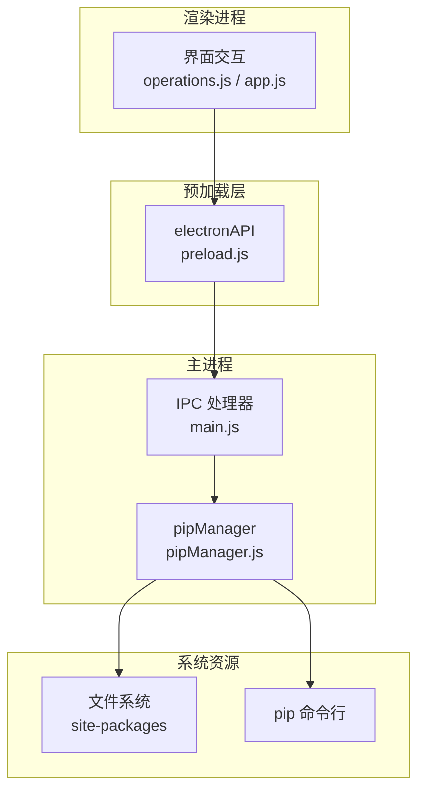
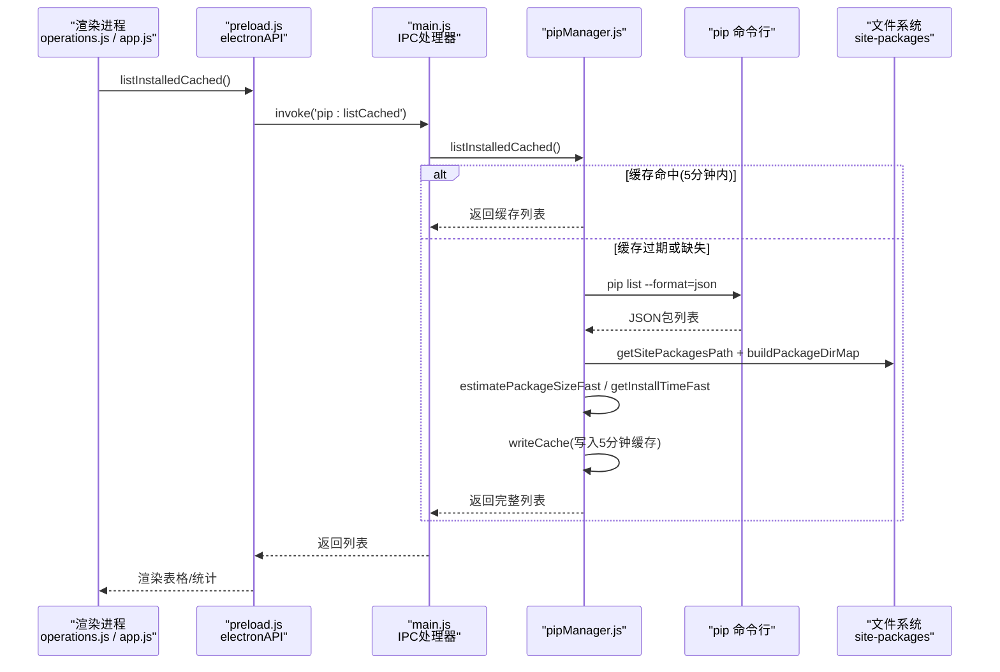
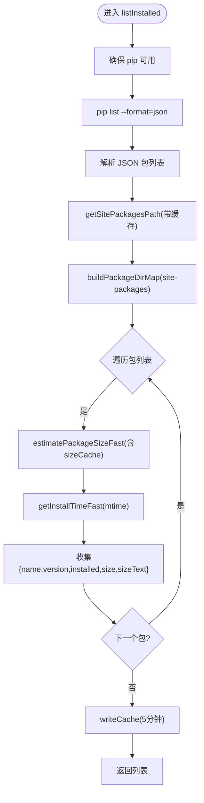
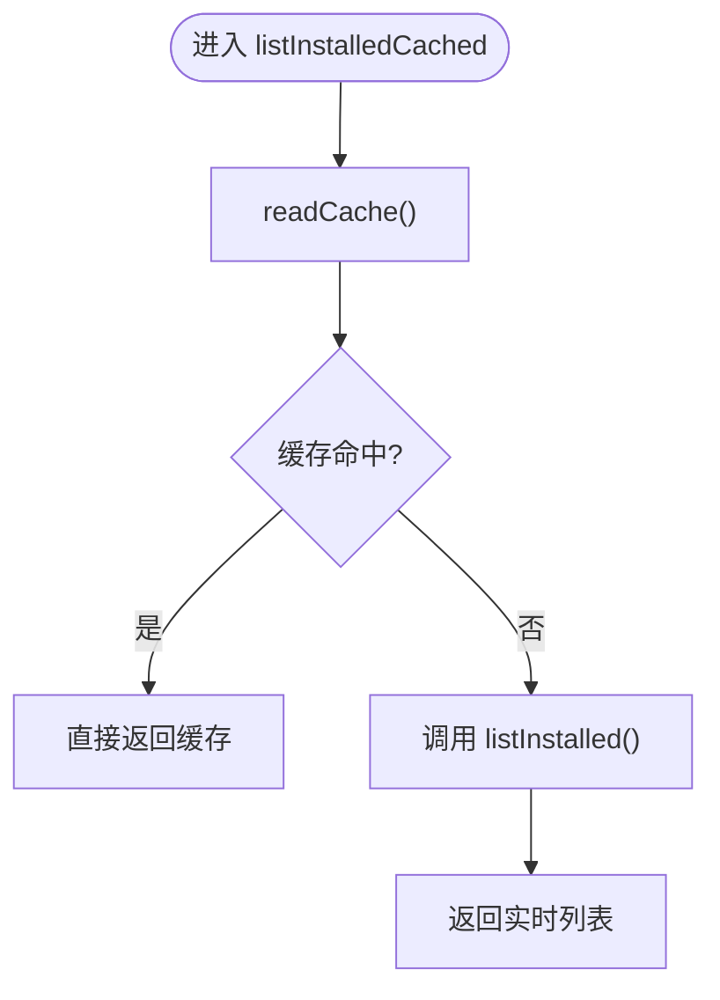
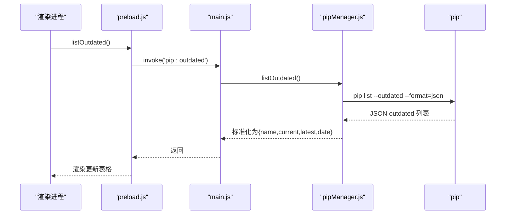
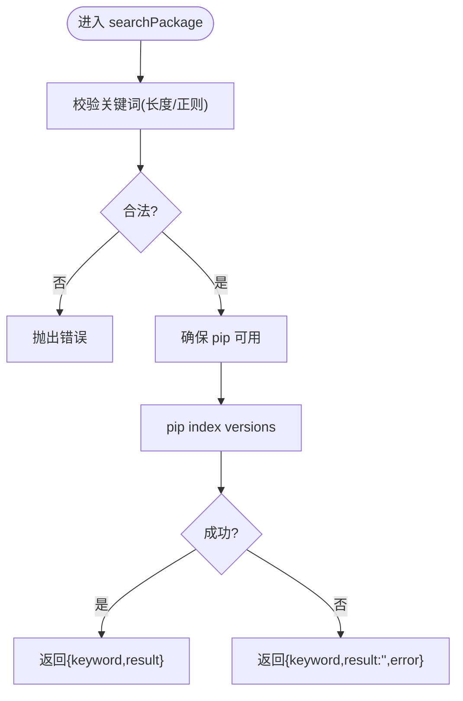
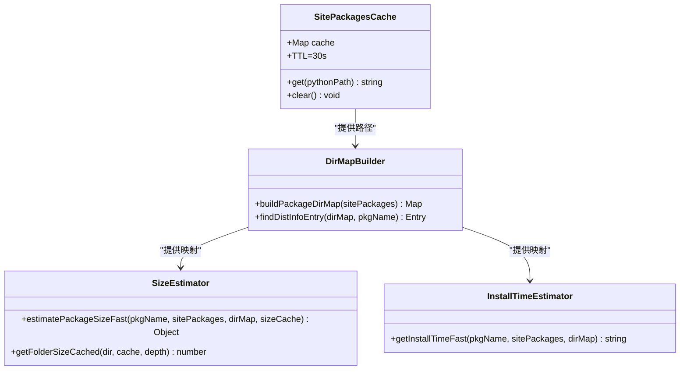
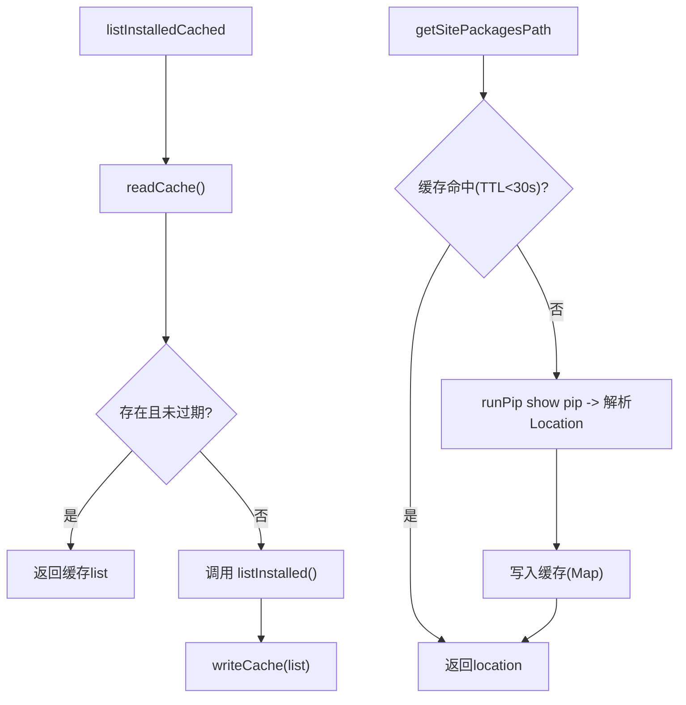
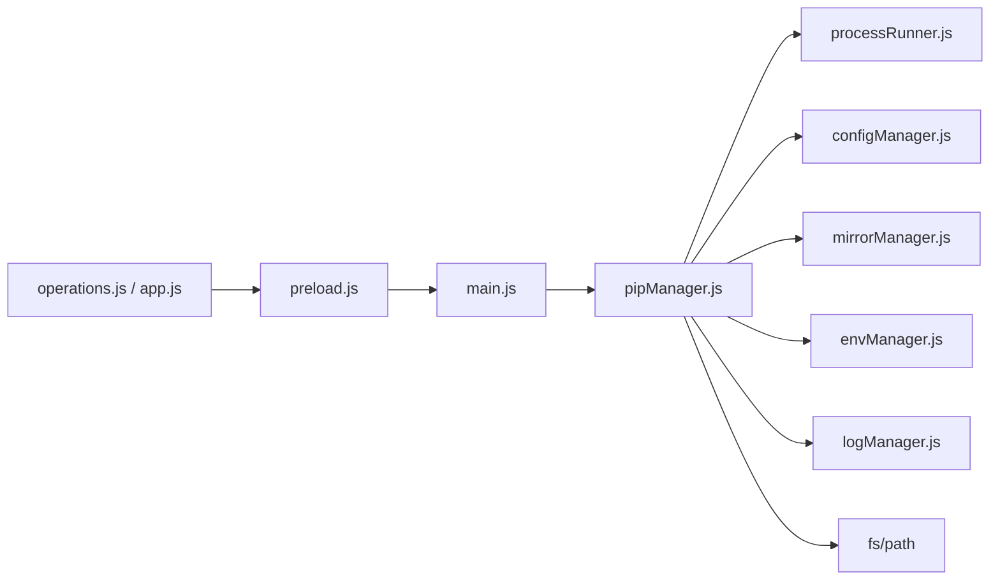

# 包查询功能

<cite>
**本文引用的文件**   
- [pipManager.js](file://core/operations/pipManager.js)
- [main.js](file://main.js)
- [preload.js](file://preload.js)
- [operations.js](file://renderer/js/operations.js)
- [app.js](file://renderer/js/app.js)
</cite>

## 目录
1. [简介](#简介)
2. [项目结构](#项目结构)
3. [核心组件](#核心组件)
4. [架构总览](#架构总览)
5. [详细组件分析](#详细组件分析)
6. [依赖关系分析](#依赖关系分析)
7. [性能考量](#性能考量)
8. [故障排查指南](#故障排查指南)
9. [结论](#结论)
10. [附录：API调用示例](#附录api调用示例)

## 简介
本文件聚焦 PyLibMaster 的“包查询”能力，系统性说明以下方法的行为与实现细节：
- listInstalled（已安装包列表）
- listInstalledCached（缓存列表）
- listOutdated（可更新包列表）
- searchPackage（PyPI搜索）

并深入解释 site-packages 路径扫描、包大小估算算法、安装时间计算；同时详细说明缓存机制（5分钟有效期的已安装包缓存、site-packages 路径缓存 30秒TTL）。文档包含具体 API 调用示例与性能优化策略（目录映射表构建、递归大小计算的缓存机制），帮助读者快速理解并高效使用。

## 项目结构
包查询相关代码主要分布在以下模块：
- core/operations/pipManager.js：核心业务逻辑，封装 pip 命令调用、缓存、目录扫描、大小估算等
- main.js：主进程 IPC 路由，将渲染进程的请求转发到 pipManager
- preload.js：安全桥接层，暴露 electronAPI 给渲染进程
- renderer/js/operations.js：前端操作与刷新逻辑，调用 electronAPI
- renderer/js/app.js：应用初始化流程，优先加载缓存数据以提升响应速度

图表来源
- [pipManager.js:382-472](file://core/operations/pipManager.js#L382-L472)
- [main.js:285-291](file://main.js#L285-L291)
- [preload.js:42-45](file://preload.js#L42-L45)

章节来源
- [pipManager.js:1-120](file://core/operations/pipManager.js#L1-L120)
- [main.js:280-300](file://main.js#L280-L300)
- [preload.js:40-50](file://preload.js#L40-L50)
- [operations.js:400-460](file://renderer/js/operations.js#L400-L460)
- [app.js:140-180](file://renderer/js/app.js#L140-L180)

## 核心组件
- pipManager.js
  - 提供 listInstalled、listInstalledCached、listOutdated、searchPackage 等方法
  - 内置已安装包缓存（5分钟）、site-packages 路径缓存（30秒TTL）
  - 基于 site-packages 目录扫描进行包大小估算与安装时间计算
- main.js
  - 注册 IPC 处理器，将 pip:list、pip:listCached、pip:outdated、pip:search 等事件路由到 pipManager
- preload.js
  - 通过 contextBridge 暴露 electronAPI，使渲染进程能安全调用上述方法
- operations.js / app.js
  - 前端刷新与初始化逻辑，优先读取缓存提升体验，后台异步刷新完整数据

章节来源
- [pipManager.js:382-472](file://core/operations/pipManager.js#L382-L472)
- [main.js:285-291](file://main.js#L285-L291)
- [preload.js:42-45](file://preload.js#L42-L45)
- [operations.js:400-460](file://renderer/js/operations.js#L400-L460)
- [app.js:140-180](file://renderer/js/app.js#L140-L180)

## 架构总览
包查询的整体调用链路如下：
- 渲染进程通过 electronAPI.listInstalledCached() 或 listInstalled() 发起请求
- preload.js 通过 ipcRenderer.invoke('pip:list' | 'pip:listCached') 转发
- main.js 的 IPC 处理器调用 pipManager 对应方法
- pipManager 执行 pip 命令、读取/写入缓存、扫描 site-packages，返回结果

图表来源
- [pipManager.js:382-421](file://core/operations/pipManager.js#L382-L421)
- [main.js:285-287](file://main.js#L285-L287)
- [preload.js:42-43](file://preload.js#L42-L43)

## 详细组件分析

### listInstalled（已安装包列表）
- 行为
  - 获取当前 Python 环境，确保 pip 可用
  - 执行 pip list --format=json 获取包列表
  - 获取 site-packages 路径（带缓存）
  - 构建包目录映射表（.dist-info 与普通包目录）
  - 对每个包估算大小与安装时间
  - 写入缓存（5分钟有效期）
- 关键实现要点
  - site-packages 路径缓存 TTL=30秒，避免重复探测
  - 目录映射表一次性构建，减少重复 readdirSync
  - 递归大小计算使用 Map 缓存，防止重复扫描与符号链接死循环
  - 安装时间通过 .dist-info 或包目录 mtime 快速估算

图表来源
- [pipManager.js:382-409](file://core/operations/pipManager.js#L382-L409)
- [pipManager.js:226-248](file://core/operations/pipManager.js#L226-L248)
- [pipManager.js:260-282](file://core/operations/pipManager.js#L260-L282)
- [pipManager.js:296-314](file://core/operations/pipManager.js#L296-L314)
- [pipManager.js:323-340](file://core/operations/pipManager.js#L323-L340)
- [pipManager.js:351-371](file://core/operations/pipManager.js#L351-L371)

章节来源
- [pipManager.js:382-409](file://core/operations/pipManager.js#L382-L409)

### listInstalledCached（缓存列表）
- 行为
  - 优先读取本地缓存（5分钟有效期）
  - 若缓存不存在或过期，回退到 listInstalled 实时扫描
- 设计动机
  - 启动时快速显示界面，降低首次等待时间
  - 后台异步刷新完整数据保证准确性

图表来源
- [pipManager.js:99-127](file://core/operations/pipManager.js#L99-L127)
- [pipManager.js:417-421](file://core/operations/pipManager.js#L417-L421)

章节来源
- [pipManager.js:417-421](file://core/operations/pipManager.js#L417-L421)

### listOutdated（可更新包列表）
- 行为
  - 获取当前环境，确保 pip 可用
  - 执行 pip list --outdated --format=json
  - 返回 name、current、latest、date 字段

图表来源
- [pipManager.js:428-441](file://core/operations/pipManager.js#L428-L441)
- [main.js:289](file://main.js#L289)
- [preload.js:44](file://preload.js#L44)

章节来源
- [pipManager.js:428-441](file://core/operations/pipManager.js#L428-L441)

### searchPackage（PyPI搜索）
- 行为
  - 校验关键词合法性（长度、字符集）
  - 使用 pip index versions <keyword>（pip 21.2+）作为替代方案（PyPI 已禁用 pip search）
  - 返回 { keyword, result } 或包含错误信息

图表来源
- [pipManager.js:450-472](file://core/operations/pipManager.js#L450-L472)
- [main.js:291](file://main.js#L291)
- [preload.js:45](file://preload.js#L45)

章节来源
- [pipManager.js:450-472](file://core/operations/pipManager.js#L450-L472)

### site-packages 路径扫描与包大小估算
- site-packages 路径缓存
  - 通过 runPip('show', 'pip') 解析 Location 字段
  - 内存 Map 缓存，TTL=30秒，避免频繁探测
- 目录映射表构建
  - 扫描 site-packages 顶层条目
  - 识别 .dist-info 目录与普通包目录
  - 统一键名（下划线/短横线转换，小写化）
- 包大小估算
  - 候选路径包括包目录与 .dist-info 目录
  - 递归计算目录大小，跳过符号链接，最大深度20层
  - 使用 sizeCache Map 缓存子目录大小，避免重复 IO
- 安装时间估算
  - 根据目标目录或 .dist-info 目录的 mtime 快速估算
  - 返回 ISO 日期字符串（YYYY-MM-DD）

图表来源
- [pipManager.js:226-248](file://core/operations/pipManager.js#L226-L248)
- [pipManager.js:260-282](file://core/operations/pipManager.js#L260-L282)
- [pipManager.js:296-314](file://core/operations/pipManager.js#L296-L314)
- [pipManager.js:323-340](file://core/operations/pipManager.js#L323-L340)
- [pipManager.js:351-371](file://core/operations/pipManager.js#L351-L371)

章节来源
- [pipManager.js:226-248](file://core/operations/pipManager.js#L226-L248)
- [pipManager.js:260-282](file://core/operations/pipManager.js#L260-L282)
- [pipManager.js:296-314](file://core/operations/pipManager.js#L296-L314)
- [pipManager.js:323-340](file://core/operations/pipManager.js#L323-L340)
- [pipManager.js:351-371](file://core/operations/pipManager.js#L351-L371)

### 缓存机制详解
- 已安装包缓存（5分钟）
  - 存储位置：配置存储路径下的 installed-cache.json
  - 数据结构：{ timestamp, list }
  - 读取逻辑：存在且未过期则返回 list，否则返回 null
  - 写入逻辑：每次 listInstalled 成功后写入
- site-packages 路径缓存（30秒TTL）
  - 内存 Map，按 pythonPath 索引
  - 每次访问先检查 TTL，命中则直接返回 location
  - 失败时记录日志并返回空字符串

图表来源
- [pipManager.js:99-127](file://core/operations/pipManager.js#L99-L127)
- [pipManager.js:226-248](file://core/operations/pipManager.js#L226-L248)
- [pipManager.js:417-421](file://core/operations/pipManager.js#L417-L421)

章节来源
- [pipManager.js:99-127](file://core/operations/pipManager.js#L99-L127)
- [pipManager.js:226-248](file://core/operations/pipManager.js#L226-L248)
- [pipManager.js:417-421](file://core/operations/pipManager.js#L417-L421)

## 依赖关系分析
- 渲染进程依赖 electronAPI（preload.js）
- electronAPI 依赖 IPC 通道（ipcRenderer.invoke）
- 主进程依赖 pipManager（业务逻辑）
- pipManager 依赖：
  - processRunner（runPip、ensurePip、cancelOperation）
  - configManager（storagePath）
  - mirrorManager（镜像源相关，搜索场景可能用到）
  - envManager（当前环境）
  - logManager（错误日志）
  - fs/path（文件系统与路径处理）

图表来源
- [pipManager.js:20-27](file://core/operations/pipManager.js#L20-L27)
- [main.js:285-291](file://main.js#L285-L291)
- [preload.js:42-45](file://preload.js#L42-L45)

章节来源
- [pipManager.js:20-27](file://core/operations/pipManager.js#L20-L27)
- [main.js:285-291](file://main.js#L285-L291)
- [preload.js:42-45](file://preload.js#L42-L45)

## 性能考量
- 目录映射表构建
  - 在 listInstalled 中一次性构建 site-packages 目录映射，避免 per-package 的 glob/readdir 开销
  - 键名规范化（下划线/短横线、小写化）提高查找效率
- 递归大小计算的缓存机制
  - getFolderSizeCached 使用 Map 缓存子目录大小，避免重复 IO
  - 跳过符号链接，限制最大递归深度（20层），防止死循环
- 缓存策略
  - 已安装包缓存（5分钟）显著降低首次加载与频繁刷新时的延迟
  - site-packages 路径缓存（30秒TTL）减少 pip show 调用次数
- 并发与串行控制
  - 环境级互斥锁确保同一环境操作串行，避免并发冲突
  - 并行任务队列用于批量安装/更新，但查询路径保持串行以保证一致性

章节来源
- [pipManager.js:260-282](file://core/operations/pipManager.js#L260-L282)
- [pipManager.js:296-314](file://core/operations/pipManager.js#L296-L314)
- [pipManager.js:72-85](file://core/operations/pipManager.js#L72-L85)

## 故障排查指南
- 常见问题
  - 缓存未生效：检查 installed-cache.json 是否存在且 timestamp 未过期
  - site-packages 路径为空：确认 pip show pip 输出是否包含 Location，网络或权限问题可能导致失败
  - 包大小估算为0：检查 site-packages 目录是否可访问，符号链接或权限问题会导致跳过
  - searchPackage 返回空结果：确认 pip 版本>=21.2，支持 pip index versions
- 日志定位
  - 所有异常均通过 logManager.addLog 记录，可在日志页面筛选查看
  - 常见 action：Read installed cache failed、Write installed cache failed、Get site-packages path failed、Calculate folder size failed、Get install time failed

章节来源
- [pipManager.js:99-127](file://core/operations/pipManager.js#L99-L127)
- [pipManager.js:226-248](file://core/operations/pipManager.js#L226-L248)
- [pipManager.js:296-314](file://core/operations/pipManager.js#L296-L314)
- [pipManager.js:323-340](file://core/operations/pipManager.js#L323-L340)
- [pipManager.js:450-472](file://core/operations/pipManager.js#L450-L472)

## 结论
PyLibMaster 的包查询功能通过多层缓存与高效的目录扫描策略，实现了快速、准确的包信息管理。listInstalled 与 listInstalledCached 的组合兼顾了实时性与响应速度；listOutdated 与 searchPackage 提供了完整的包生态探索能力。结合 site-packages 路径缓存、目录映射表与递归大小缓存，系统在大规模环境中仍能保持良好性能。建议在生产使用中合理设置刷新频率，充分利用缓存机制以获得最佳用户体验。

## 附录：API调用示例
以下为典型的前端调用方式（通过 electronAPI）：

- 获取已安装包缓存列表（快速响应）
  - 调用：window.electronAPI.listInstalledCached()
  - 返回：Array<{name, version, installed, size, sizeText, source}>
  - 适用场景：应用启动、快速展示

- 获取已安装包完整列表（实时扫描）
  - 调用：window.electronAPI.listInstalled()
  - 返回：同上
  - 适用场景：操作后刷新、需要最新数据

- 获取可更新包列表
  - 调用：window.electronAPI.listOutdated()
  - 返回：Array<{name, current, latest, date}>
  - 适用场景：更新检查、批量更新准备

- 搜索 PyPI 包
  - 调用：window.electronAPI.searchPackage(keyword)
  - 返回：{keyword, result} 或 {keyword, result:'', error}
  - 适用场景：包发现、版本信息查询

章节来源
- [preload.js:42-45](file://preload.js#L42-L45)
- [operations.js:400-460](file://renderer/js/operations.js#L400-L460)
- [app.js:140-180](file://renderer/js/app.js#L140-L180)