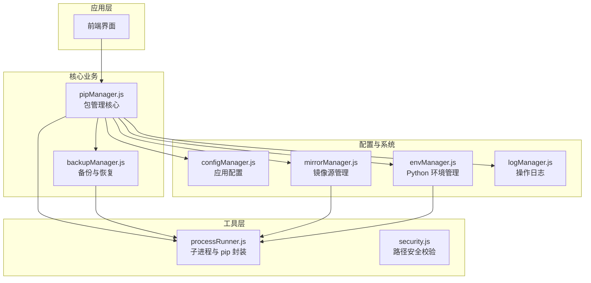
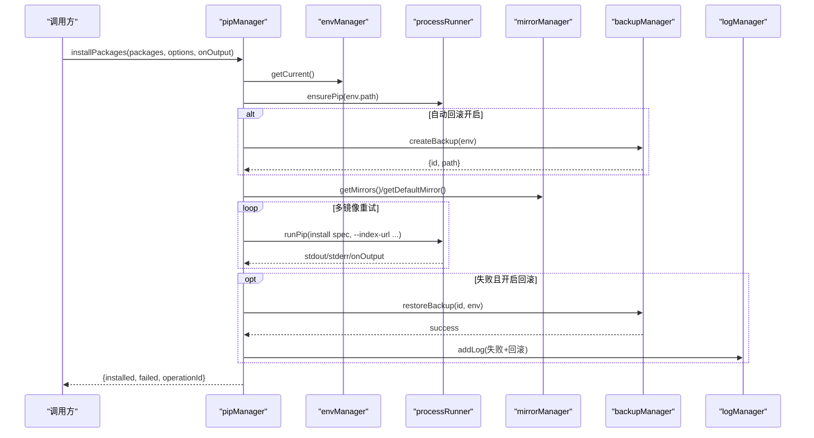
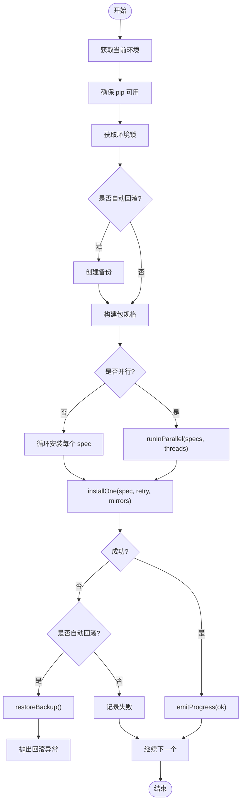
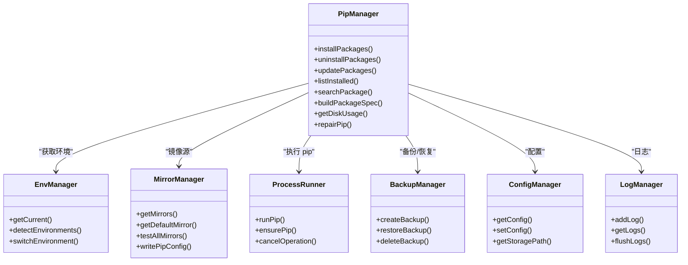

# 包管理器 (pipManager)

<cite>
**本文引用的文件**   
- [core/operations/pipManager.js](file://core/operations/pipManager.js)
- [core/config/mirrorManager.js](file://core/config/mirrorManager.js)
- [core/system/envManager.js](file://core/system/envManager.js)
- [utils/processRunner.js](file://utils/processRunner.js)
- [utils/security.js](file://utils/security.js)
- [core/config/configManager.js](file://core/config/configManager.js)
- [core/system/logManager.js](file://core/system/logManager.js)
- [core/operations/backupManager.js](file://core/operations/backupManager.js)
- [package.json](file://package.json)
</cite>

## 目录
1. [简介](#简介)
2. [项目结构](#项目结构)
3. [核心组件](#核心组件)
4. [架构总览](#架构总览)
5. [详细组件分析](#详细组件分析)
6. [依赖关系分析](#依赖关系分析)
7. [性能考量](#性能考量)
8. [故障排查指南](#故障排查指南)
9. [结论](#结论)
10. [附录：API 使用示例与最佳实践](#附录api-使用示例与最佳实践)

## 简介
本仓库中的 pipManager 是一个面向 Electron 应用的 Python 包管理模块，提供安装、卸载、更新、查询、离线下载、依赖分析与健康检查等能力。其设计重点包括：
- 批量、并行、版本控制、镜像重试、自动回滚的安装流程
- 安全模式卸载与自动回滚
- 智能重试与并发处理的更新流程
- 已安装列表、缓存列表、可更新列表、搜索等查询能力
- 包名与版本的安全校验（正则、wheel 路径安全检查、命令注入防护）
- 环境级操作互斥锁，确保同一 Python 环境的操作串行执行
- site-packages 路径缓存、包大小估算、安装时间计算等性能优化
- 完善的错误处理、日志记录与进度回调机制

## 项目结构
pipManager 位于 core/operations 下，围绕“包操作”这一职责组织代码，并与配置、系统、工具层协作：
- 配置层：configManager、mirrorManager
- 系统层：envManager、logManager
- 工具层：processRunner、security
- 备份与回滚：backupManager
- 入口与对外 API：pipManager.js

图表来源
- [core/operations/pipManager.js:1-120](file://core/operations/pipManager.js#L1-L120)
- [core/config/mirrorManager.js:1-120](file://core/config/mirrorManager.js#L1-L120)
- [core/system/envManager.js:1-80](file://core/system/envManager.js#L1-L80)
- [utils/processRunner.js:1-120](file://utils/processRunner.js#L1-L120)

章节来源
- [core/operations/pipManager.js:1-120](file://core/operations/pipManager.js#L1-L120)
- [package.json:1-30](file://package.json#L1-L30)

## 核心组件
- pipManager：包管理的核心实现，包含安装、卸载、更新、查询、导出导入、依赖分析、健康检查等全部功能。
- mirrorManager：PyPI 镜像源管理，支持内置/自定义镜像、测速、智能路由、写入 pip 配置。
- envManager：Python 环境检测、切换与持久化，支持常见安装路径与 Conda 环境。
- processRunner：子进程运行器，封装 pip/Python 命令执行、超时、取消、ANSI 清理、ensurepip 自动安装。
- backupManager：基于 pip freeze 的备份与恢复，支持安全 ID 校验与强制重装。
- configManager：应用配置读写、范围校验、原子保存。
- logManager：操作日志持久化、防抖写入、容量限制、筛选查询。
- security：通用路径安全校验工具。

章节来源
- [core/operations/pipManager.js:1-120](file://core/operations/pipManager.js#L1-L120)
- [core/config/mirrorManager.js:1-120](file://core/config/mirrorManager.js#L1-L120)
- [core/system/envManager.js:1-80](file://core/system/envManager.js#L1-L80)
- [utils/processRunner.js:1-120](file://utils/processRunner.js#L1-L120)
- [core/operations/backupManager.js:1-80](file://core/operations/backupManager.js#L1-L80)
- [core/config/configManager.js:1-80](file://core/config/configManager.js#L1-L80)
- [core/system/logManager.js:1-80](file://core/system/logManager.js#L1-L80)
- [utils/security.js:1-43](file://utils/security.js#L1-L43)

## 架构总览
pipManager 通过 processRunner 调用 pip，结合 mirrorManager 选择镜像源，envManager 定位当前环境，backupManager 提供回滚保障，configManager 管理配置，logManager 记录操作。所有包操作均受环境级互斥锁保护，避免并发冲突。

图表来源
- [core/operations/pipManager.js:495-578](file://core/operations/pipManager.js#L495-L578)
- [core/config/mirrorManager.js:109-130](file://core/config/mirrorManager.js#L109-L130)
- [utils/processRunner.js:340-342](file://utils/processRunner.js#L340-L342)
- [core/operations/backupManager.js:89-113](file://core/operations/backupManager.js#L89-L113)

## 详细组件分析

### 包安装（installPackages）
- 支持批量、并行、版本控制（latest/specific/range）、镜像重试、自动回滚、进度回调。
- 内部通过 acquireEnvLock 获取环境锁，确保同一环境串行执行。
- 构建包规格字符串时进行严格安全校验（包名校验、wheel 路径安全检查）。
- 若开启自动回滚，安装前创建备份；任一包失败则触发回滚并抛出异常。

图表来源
- [core/operations/pipManager.js:495-578](file://core/operations/pipManager.js#L495-L578)
- [core/operations/pipManager.js:590-615](file://core/operations/pipManager.js#L590-L615)
- [core/operations/pipManager.js:912-924](file://core/operations/pipManager.js#L912-L924)

章节来源
- [core/operations/pipManager.js:495-578](file://core/operations/pipManager.js#L495-L578)
- [core/operations/pipManager.js:590-615](file://core/operations/pipManager.js#L590-L615)
- [core/operations/pipManager.js:912-924](file://core/operations/pipManager.js#L912-L924)

### 包卸载（uninstallPackages）
- 支持批量卸载与安全模式（仅卸载指定包，不影响依赖）。
- 支持自动回滚：卸载前创建备份，失败则恢复。
- 对包名进行正则校验，防止非法输入。

章节来源
- [core/operations/pipManager.js:727-771](file://core/operations/pipManager.js#L727-L771)

### 包更新（updatePackages）
- 支持批量更新、并行处理、智能重试（多镜像源）。
- 更新逻辑会检测“Requirement already satisfied”，避免误判为成功。
- 支持自动回滚：任一更新失败则恢复备份。

章节来源
- [core/operations/pipManager.js:787-867](file://core/operations/pipManager.js#L787-L867)
- [core/operations/pipManager.js:874-904](file://core/operations/pipManager.js#L874-L904)

### 包查询（listInstalled/listOutdated/searchPackage）
- listInstalled：实时扫描 pip list，估算包大小与安装时间，写入缓存（5分钟有效）。
- listInstalledCached：优先返回缓存，过期则回退到实时扫描。
- listOutdated：获取可更新包列表。
- searchPackage：使用 pip index versions（替代已禁用的 pip search），带输入校验。

章节来源
- [core/operations/pipManager.js:382-441](file://core/operations/pipManager.js#L382-L441)
- [core/operations/pipManager.js:450-472](file://core/operations/pipManager.js#L450-L472)

### 包名与版本安全校验
- buildPackageSpec：
  - 包名正则校验（只允许字母、数字、点、短横线、下划线）。
  - 版本规格正则校验（支持 ==、>=、<、~、+ 等组合）。
  - wheel 文件路径安全检查：禁止 ..、UNC 路径、敏感目录、非法字符、文件名合法性。
- 其他接口（如 uninstall/update）在入口处对包名进行正则校验。

章节来源
- [core/operations/pipManager.js:154-217](file://core/operations/pipManager.js#L154-L217)
- [core/operations/pipManager.js:727-736](file://core/operations/pipManager.js#L727-L736)
- [core/operations/pipManager.js:792-796](file://core/operations/pipManager.js#L792-L796)

### 环境级操作互斥锁
- acquireEnvLock：以 envPath 为键维护 Promise 队列，等待已有锁释放后创建新锁，返回释放函数。
- 所有包操作（安装、卸载、更新、import requirements）均在 try/finally 中释放锁，保证并发安全。

章节来源
- [core/operations/pipManager.js:72-85](file://core/operations/pipManager.js#L72-L85)
- [core/operations/pipManager.js:495-578](file://core/operations/pipManager.js#L495-L578)
- [core/operations/pipManager.js:727-771](file://core/operations/pipManager.js#L727-L771)
- [core/operations/pipManager.js:787-867](file://core/operations/pipManager.js#L787-L867)
- [core/operations/pipManager.js:1109-1135](file://core/operations/pipManager.js#L1109-L1135)

### site-packages 路径缓存与性能优化
- getSitePackagesPath：通过 pip show pip 解析 Location，结果按 pythonPath 缓存（TTL 30秒）。
- buildPackageDirMap：一次性扫描 .dist-info 与普通包目录，建立映射表，避免重复 readdirSync。
- estimatePackageSizeFast：综合包目录与 .dist-info 大小，使用递归缓存（跳过符号链接，最大深度 20）。
- getInstallTimeFast：基于 mtime 快速估算安装日期。

章节来源
- [core/operations/pipManager.js:226-248](file://core/operations/pipManager.js#L226-L248)
- [core/operations/pipManager.js:260-314](file://core/operations/pipManager.js#L260-L314)
- [core/operations/pipManager.js:323-371](file://core/operations/pipManager.js#L323-L371)

### 镜像源管理与智能重试
- mirrorManager：内置多个镜像源，支持用户自定义、默认源设置、测速、智能路由、写入 pip 配置。
- installOne/updateOne：按默认镜像 + 其他镜像顺序重试，最多尝试 min(retryCount, 镜像数) 次。
- updateOne 特殊处理“Requirement already satisfied”，避免误判成功。

章节来源
- [core/config/mirrorManager.js:22-30](file://core/config/mirrorManager.js#L22-L30)
- [core/config/mirrorManager.js:109-130](file://core/config/mirrorManager.js#L109-L130)
- [core/config/mirrorManager.js:219-247](file://core/config/mirrorManager.js#L219-L247)
- [core/config/mirrorManager.js:299-333](file://core/config/mirrorManager.js#L299-L333)
- [core/operations/pipManager.js:590-615](file://core/operations/pipManager.js#L590-L615)
- [core/operations/pipManager.js:874-904](file://core/operations/pipManager.js#L874-L904)

### 子进程与 pip 管理
- processRunner：统一封装 runCommand/runPip/runPython，支持超时、SIGTERM/SIGKILL 两级终止、ANSI 清理、操作取消（operationId）。
- ensurePip：自动检测并安装 pip（ensurepip -> get-pip.py），缓存就绪状态（TTL 5分钟）。
- cancelOperation：按 operationId 取消一次操作的所有关联进程。

章节来源
- [utils/processRunner.js:85-161](file://utils/processRunner.js#L85-L161)
- [utils/processRunner.js:233-278](file://utils/processRunner.js#L233-L278)
- [utils/processRunner.js:340-342](file://utils/processRunner.js#L340-L342)
- [utils/processRunner.js:181-191](file://utils/processRunner.js#L181-L191)

### 备份与回滚
- backupManager：基于 pip freeze 生成备份文件，支持列出、删除、恢复（force-reinstall --no-deps）。
- 备份 ID 安全校验：正则与路径遍历防护。
- pipManager 在安装/卸载/更新时可选自动回滚，失败即恢复。

章节来源
- [core/operations/backupManager.js:89-113](file://core/operations/backupManager.js#L89-L113)
- [core/operations/backupManager.js:156-170](file://core/operations/backupManager.js#L156-L170)
- [core/operations/backupManager.js:62-78](file://core/operations/backupManager.js#L62-L78)
- [core/operations/pipManager.js:514-521](file://core/operations/pipManager.js#L514-L521)
- [core/operations/pipManager.js:744-749](file://core/operations/pipManager.js#L744-L749)
- [core/operations/pipManager.js:810-813](file://core/operations/pipManager.js#L810-L813)

### 日志与进度回调
- logManager：持久化操作日志，支持类型筛选与关键词搜索，防抖写入，容量限制（2000条），字段截断。
- pipManager：关键步骤输出结构化日志（安装/卸载/更新/系统事件），失败与回滚均有记录。
- 进度回调：emitProgress 向上传递 [PROGRESS] 事件，便于前端可靠更新计数。

章节来源
- [core/system/logManager.js:112-131](file://core/system/logManager.js#L112-L131)
- [core/system/logManager.js:143-159](file://core/system/logManager.js#L143-L159)
- [core/operations/pipManager.js:61-63](file://core/operations/pipManager.js#L61-L63)
- [core/operations/pipManager.js:567-572](file://core/operations/pipManager.js#L567-L572)
- [core/operations/pipManager.js:756-766](file://core/operations/pipManager.js#L756-L766)
- [core/operations/pipManager.js:856-861](file://core/operations/pipManager.js#L856-L861)

## 依赖关系分析
pipManager 依赖以下模块完成包管理任务：
- envManager：获取当前 Python 环境
- mirrorManager：选择镜像源与参数
- processRunner：执行 pip/Python 命令
- backupManager：备份与恢复
- configManager：读取配置（并行线程数、重试次数）
- logManager：记录操作日志

图表来源
- [core/operations/pipManager.js:1568-1596](file://core/operations/pipManager.js#L1568-L1596)
- [core/system/envManager.js:178-219](file://core/system/envManager.js#L178-L219)
- [core/config/mirrorManager.js:109-130](file://core/config/mirrorManager.js#L109-L130)
- [utils/processRunner.js:340-342](file://utils/processRunner.js#L340-L342)
- [core/operations/backupManager.js:89-113](file://core/operations/backupManager.js#L89-L113)
- [core/config/configManager.js:144-162](file://core/config/configManager.js#L144-L162)
- [core/system/logManager.js:112-131](file://core/system/logManager.js#L112-L131)

章节来源
- [core/operations/pipManager.js:1568-1596](file://core/operations/pipManager.js#L1568-L1596)

## 性能考量
- site-packages 路径缓存：TTL 30秒，减少重复探测开销。
- 包目录映射表：一次性构建，避免 per-package 的 readdirSync。
- 包大小估算：递归缓存目录大小，跳过符号链接，限制最大深度 20。
- 安装时间估算：直接读取 mtime，O(1)。
- 并行安装/更新：runInParallel 限制并发线程数（默认 4，可配置）。
- pip 就绪缓存：TTL 5分钟，避免重复检测。
- 日志写入防抖：300ms 内多次写入合并为一次。

章节来源
- [core/operations/pipManager.js:226-248](file://core/operations/pipManager.js#L226-L248)
- [core/operations/pipManager.js:260-314](file://core/operations/pipManager.js#L260-L314)
- [core/operations/pipManager.js:912-924](file://core/operations/pipManager.js#L912-L924)
- [utils/processRunner.js:20-24](file://utils/processRunner.js#L20-L24)
- [core/system/logManager.js:22-26](file://core/system/logManager.js#L22-L26)

## 故障排查指南
- pip 不可用：调用 ensurePip 自动安装（ensurepip -> get-pip.py），查看日志确认安装过程。
- 网络问题：启用智能路由或手动切换镜像源，观察 testAllMirrors 测速结果。
- 权限问题：检查 site-packages 目录访问权限与存储路径是否存在。
- 依赖冲突：使用 checkConflicts 诊断，根据输出修复依赖版本。
- 操作卡住：使用 cancelOperation(operationId) 取消正在进行的 pip 操作。
- 日志与进度：通过 logManager.getLogs() 与 onOutput 回调追踪问题。

章节来源
- [utils/processRunner.js:233-278](file://utils/processRunner.js#L233-L278)
- [core/config/mirrorManager.js:219-247](file://core/config/mirrorManager.js#L219-L247)
- [core/operations/pipManager.js:1442-1485](file://core/operations/pipManager.js#L1442-L1485)
- [utils/processRunner.js:181-191](file://utils/processRunner.js#L181-L191)
- [core/system/logManager.js:143-159](file://core/system/logManager.js#L143-L159)

## 结论
pipManager 提供了完整、健壮、安全的 Python 包管理能力，覆盖安装、卸载、更新、查询、离线下载、依赖分析与健康检查等场景。通过严格的输入校验、环境级互斥锁、镜像重试与自动回滚机制，保证了操作的可靠性与安全性。配合性能优化与完善的日志/进度反馈，适合在桌面应用中稳定使用。

## 附录：API 使用示例与最佳实践
以下为常用 API 的使用方式与注意事项（不展示具体代码内容，仅提供调用思路与参数说明）：

- installPackages(packages, options, onOutput)
  - packages：包名数组，支持 latest/specific/range 版本模式
  - options：{ versionMode, version, parallel, retry, rollback, operationId }
  - onOutput：接收 [INFO]/[WARN]/[ERR]/[ROLLBACK]/[PROGRESS] 事件
  - 返回：{ installed, failed, operationId }
  - 注意：开启 rollback 会在失败时自动回滚；parallel=true 时按配置线程数并行

- uninstallPackages(packages, options, onOutput)
  - packages：包名数组（需通过正则校验）
  - options：{ force, backup, rollback, operationId }
  - 返回：{ uninstalled, operationId }
  - 注意：建议开启 backup/rollback，避免误删依赖导致环境损坏

- updatePackages(packages, options, onOutput)
  - packages：包名数组
  - options：{ parallel, retry, rollback, operationId }
  - 返回：{ updated, failed, operationId }
  - 注意：updateOne 会检测“Requirement already satisfied”，避免误判成功

- listInstalled() / listInstalledCached()
  - 返回：[{ name, version, installed, size, sizeText, source }]
  - 注意：listInstalledCached 优先返回缓存（5分钟有效）

- listOutdated()
  - 返回：[{ name, current, latest, date }]

- searchPackage(keyword)
  - 返回：{ keyword, result, error? }
  - 注意：使用 pip index versions，keyword 需通过正则校验

- installFromFile(filePath, options, onOutput)
  - 支持 .whl 与 .txt（requirements.txt）
  - 返回：{ installed, failed, operationId }

- exportRequirements(options) / importRequirements(filePath, options, onOutput)
  - 导出/导入 requirements.txt，支持 freeze 模式

- compareEnvironments(envPathA, envPathB)
  - 返回：{ onlyA, onlyB, different, same }

- getDiskUsage()
  - 返回：{ packages, total, totalText, sitePackagesPath }

- downloadPackages(packages, destDir, options, onOutput)
  - 支持 includeDeps、platform、pythonVersion 选项

- diffRequirements(sourceA, sourceB)
  - 对比两个来源的包差异（env/file）

- getPackageReleases(pkgName)
  - 从 PyPI JSON API 获取发布历史

- getFullDependencyGraph() / checkConflicts() / healthCheck()
  - 依赖图、冲突检测、环境健康检查

章节来源
- [core/operations/pipManager.js:495-578](file://core/operations/pipManager.js#L495-L578)
- [core/operations/pipManager.js:727-771](file://core/operations/pipManager.js#L727-L771)
- [core/operations/pipManager.js:787-867](file://core/operations/pipManager.js#L787-L867)
- [core/operations/pipManager.js:382-441](file://core/operations/pipManager.js#L382-L441)
- [core/operations/pipManager.js:450-472](file://core/operations/pipManager.js#L450-L472)
- [core/operations/pipManager.js:627-712](file://core/operations/pipManager.js#L627-L712)
- [core/operations/pipManager.js:1086-1135](file://core/operations/pipManager.js#L1086-L1135)
- [core/operations/pipManager.js:1143-1182](file://core/operations/pipManager.js#L1143-L1182)
- [core/operations/pipManager.js:1190-1212](file://core/operations/pipManager.js#L1190-L1212)
- [core/operations/pipManager.js:1224-1263](file://core/operations/pipManager.js#L1224-L1263)
- [core/operations/pipManager.js:1273-1320](file://core/operations/pipManager.js#L1273-L1320)
- [core/operations/pipManager.js:1329-1378](file://core/operations/pipManager.js#L1329-L1378)
- [core/operations/pipManager.js:1391-1435](file://core/operations/pipManager.js#L1391-L1435)
- [core/operations/pipManager.js:1442-1485](file://core/operations/pipManager.js#L1442-L1485)
- [core/operations/pipManager.js:1492-1566](file://core/operations/pipManager.js#L1492-L1566)