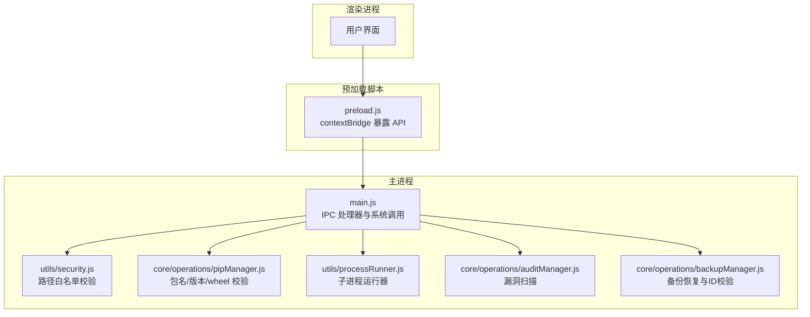
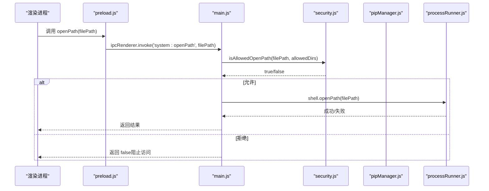
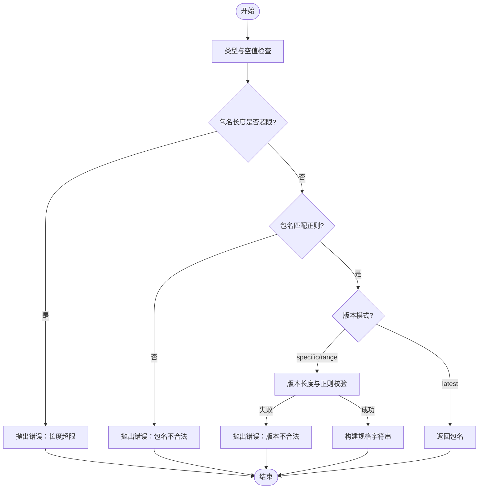
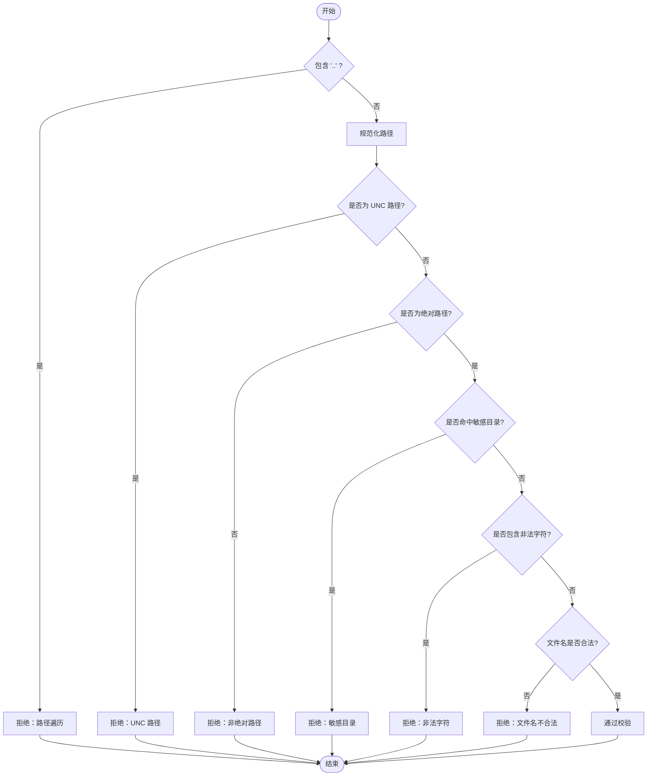
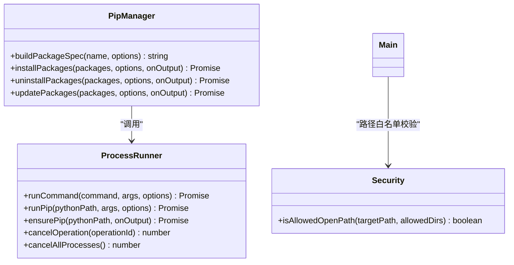
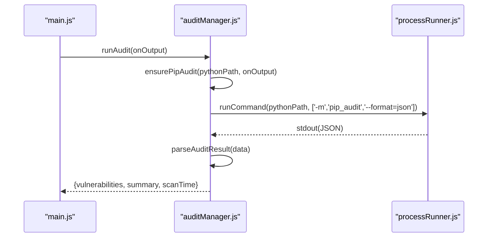
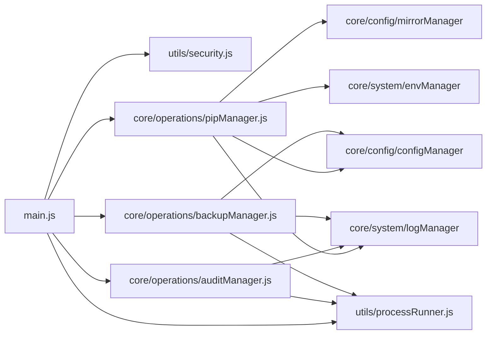

# 安全校验机制

<cite>
**本文引用的文件**   
- [main.js](file://main.js)
- [preload.js](file://preload.js)
- [utils/security.js](file://utils/security.js)
- [core/operations/pipManager.js](file://core/operations/pipManager.js)
- [core/operations/auditManager.js](file://core/operations/auditManager.js)
- [core/operations/backupManager.js](file://core/operations/backupManager.js)
- [utils/processRunner.js](file://utils/processRunner.js)
</cite>

## 目录
1. [简介](#简介)
2. [项目结构](#项目结构)
3. [核心组件](#核心组件)
4. [架构总览](#架构总览)
5. [详细组件分析](#详细组件分析)
6. [依赖关系分析](#依赖关系分析)
7. [性能考量](#性能考量)
8. [故障排查指南](#故障排查指南)
9. [结论](#结论)
10. [附录：安全规则与扩展方法](#附录：安全规则与扩展方法)

## 简介
本文件系统性阐述 PyLibMaster 的安全校验机制，覆盖包名与版本的安全验证、wheel 文件路径安全检查、命令注入防护、输入数据清洗与输出验证、以及安全漏洞检测与防护策略。文档面向技术与非技术读者，提供渐进式说明、可视化图示与可操作的配置建议。

## 项目结构
本项目采用分层组织：主进程（Electron）负责 IPC 路由与安全边界；预加载脚本作为安全桥接层；核心业务模块集中在 core/operations 与 core/system；工具函数在 utils 中实现。安全相关的关键点包括：
- 主进程对系统 API 的访问进行白名单限制与路径校验
- 预加载脚本通过 contextBridge 暴露最小化 API，避免渲染进程直接访问 Node 能力
- pip 操作前进行严格的包名/版本正则校验与 wheel 路径安全检查
- 子进程执行统一由 processRunner 管理，具备超时、取消、ANSI 清理等特性
- 备份 ID 与审计结果均经过结构化处理与缓存控制

**图表来源** 
- [main.js:1-120](file://main.js#L1-L120)
- [preload.js:1-60](file://preload.js#L1-L60)
- [utils/security.js:1-43](file://utils/security.js#L1-L43)
- [core/operations/pipManager.js:1-60](file://core/operations/pipManager.js#L1-L60)
- [utils/processRunner.js:1-60](file://utils/processRunner.js#L1-L60)
- [core/operations/auditManager.js:1-40](file://core/operations/auditManager.js#L1-L40)
- [core/operations/backupManager.js:1-40](file://core/operations/backupManager.js#L1-L40)

**章节来源**
- [main.js:1-120](file://main.js#L1-L120)
- [preload.js:1-60](file://preload.js#L1-L60)

## 核心组件
- 路径安全校验（utils/security.js）
  - isAllowedOpenPath：基于绝对路径解析与白名单目录比较，防止路径遍历攻击
- 包管理与安装（core/operations/pipManager.js）
  - 包名正则 VALID_PACKAGE_NAME、版本规格正则 VALID_VERSION_SPEC
  - wheel 文件名与路径多重校验（禁止 ..、UNC、敏感目录、非法字符）
  - 长度限制检查（包名、版本号）
- 子进程运行器（utils/processRunner.js）
  - 统一 runCommand/runPip，支持超时、SIGTERM/SIGKILL 两级终止、ANSI 清理、UTF-8 编码
- 备份与恢复（core/operations/backupManager.js）
  - 备份 ID 格式校验，防止路径穿越
- 漏洞扫描（core/operations/auditManager.js）
  - 自动安装 pip-audit，JSON 结果解析与严重级别推断，结果缓存

**章节来源**
- [utils/security.js:1-43](file://utils/security.js#L1-L43)
- [core/operations/pipManager.js:120-220](file://core/operations/pipManager.js#L120-L220)
- [utils/processRunner.js:60-160](file://utils/processRunner.js#L60-L160)
- [core/operations/backupManager.js:36-78](file://core/operations/backupManager.js#L36-L78)
- [core/operations/auditManager.js:20-120](file://core/operations/auditManager.js#L20-L120)

## 架构总览
安全校验贯穿“输入→校验→执行→输出”的全链路：
- 输入侧：渲染进程通过 preload 暴露的最小 API 进入主进程；主进程对系统级操作（如打开路径）使用白名单校验
- 校验侧：pipManager 对包名、版本、wheel 路径进行严格正则与语义校验；backupManager 对备份 ID 做格式与路径穿越防护
- 执行侧：processRunner 统一封装子进程执行，强制 UTF-8、清理 ANSI、设置超时与取消机制
- 输出侧：审计结果结构化并缓存；日志记录与进度事件推送前端

**图表来源** 
- [main.js:449-466](file://main.js#L449-L466)
- [utils/security.js:28-40](file://utils/security.js#L28-L40)
- [preload.js:100-110](file://preload.js#L100-L110)

**章节来源**
- [main.js:449-466](file://main.js#L449-L466)
- [utils/security.js:28-40](file://utils/security.js#L28-L40)
- [preload.js:100-110](file://preload.js#L100-L110)

## 详细组件分析

### 包名与版本安全验证
- 包名正则 VALID_PACKAGE_NAME：仅允许字母、数字、点、短横线、下划线，且首字符为字母或数字
- 版本规格正则 VALID_VERSION_SPEC：允许常见版本运算符与分隔符组合
- 长度限制：包名最大长度、版本号最大长度
- 搜索关键词同样受包名校验与长度限制约束

**图表来源** 
- [core/operations/pipManager.js:154-217](file://core/operations/pipManager.js#L154-L217)
- [core/operations/pipManager.js:450-472](file://core/operations/pipManager.js#L450-L472)

**章节来源**
- [core/operations/pipManager.js:29-35](file://core/operations/pipManager.js#L29-L35)
- [core/operations/pipManager.js:154-217](file://core/operations/pipManager.js#L154-L217)
- [core/operations/pipManager.js:450-472](file://core/operations/pipManager.js#L450-L472)

### Wheel 文件路径安全检查
- 路径遍历防护：禁止包含 ".." 组件
- UNC 路径禁止：拒绝以 \\\\ 或 // 开头的路径
- 敏感目录阻止：拒绝 Windows 系统敏感目录（如 /windows/、/dev/、/proc/、/sys/）
- 非法字符检测：禁止命令注入相关字符（分号、管道、反引号、美元符号、引号、回车换行、空字符等）
- 文件名合法性：必须匹配 .whl 后缀与命名规范

**图表来源** 
- [core/operations/pipManager.js:160-188](file://core/operations/pipManager.js#L160-L188)

**章节来源**
- [core/operations/pipManager.js:131-137](file://core/operations/pipManager.js#L131-L137)
- [core/operations/pipManager.js:160-188](file://core/operations/pipManager.js#L160-L188)

### 命令注入防护措施
- 输入侧：所有包名、版本、搜索关键词均通过严格正则与长度限制
- 执行侧：子进程执行不使用 shell（默认 shell=false），避免 shell 元字符解释
- 输出侧：stdout/stderr 输出经 stripAnsi 清理，避免终端转义序列污染
- 超时与终止：runCommand 支持超时后 SIGTERM 再 SIGKILL 的两级终止，确保恶意或卡死进程被回收

**图表来源** 
- [utils/processRunner.js:85-160](file://utils/processRunner.js#L85-L160)
- [core/operations/pipManager.js:154-217](file://core/operations/pipManager.js#L154-L217)
- [utils/security.js:28-40](file://utils/security.js#L28-L40)

**章节来源**
- [utils/processRunner.js:85-160](file://utils/processRunner.js#L85-L160)
- [core/operations/pipManager.js:154-217](file://core/operations/pipManager.js#L154-L217)
- [utils/security.js:28-40](file://utils/security.js#L28-L40)

### 输入数据清洗与输出验证
- 输入清洗：
  - 包名/版本/关键词正则过滤
  - 路径规范化与白名单比对
  - 备份 ID 格式与路径穿越检查
- 输出验证：
  - JSON 解析与结构化（审计结果、包列表）
  - 日志导出时对特殊字符转义（CSV 双引号处理）
  - 进度事件使用固定键名与状态枚举，避免前端误解析

**章节来源**
- [core/operations/backupManager.js:62-78](file://core/operations/backupManager.js#L62-L78)
- [main.js:490-514](file://main.js#L490-L514)
- [core/operations/auditManager.js:126-187](file://core/operations/auditManager.js#L126-L187)

### 安全漏洞检测与防护策略
- 自动安装 pip-audit（若未安装则静默安装）
- 执行 python -m pip_audit --format=json 获取结构化结果
- 解析漏洞信息，推断严重程度，生成修复建议
- 结果缓存（TTL 10 分钟）减少重复扫描开销
- 异常处理兼容旧版 JSON 格式与非零退出码场景

**图表来源** 
- [core/operations/auditManager.js:54-119](file://core/operations/auditManager.js#L54-L119)
- [utils/processRunner.js:85-160](file://utils/processRunner.js#L85-L160)

**章节来源**
- [core/operations/auditManager.js:20-120](file://core/operations/auditManager.js#L20-L120)

## 依赖关系分析
- main.js 依赖 security.js 进行路径白名单校验，依赖 pipManager.js 进行包操作，依赖 processRunner.js 进行子进程管理
- pipManager.js 依赖 configManager、mirrorManager、backupManager、logManager、envManager 与 processRunner
- auditManager.js 依赖 logManager、processRunner、envManager
- backupManager.js 依赖 configManager、logManager、processRunner

**图表来源** 
- [main.js:17-31](file://main.js#L17-L31)
- [core/operations/pipManager.js:20-28](file://core/operations/pipManager.js#L20-L28)
- [core/operations/auditManager.js:16-19](file://core/operations/auditManager.js#L16-L19)
- [core/operations/backupManager.js:19-24](file://core/operations/backupManager.js#L19-L24)

**章节来源**
- [main.js:17-31](file://main.js#L17-L31)
- [core/operations/pipManager.js:20-28](file://core/operations/pipManager.js#L20-L28)
- [core/operations/auditManager.js:16-19](file://core/operations/auditManager.js#L16-L19)
- [core/operations/backupManager.js:19-24](file://core/operations/backupManager.js#L19-L24)

## 性能考量
- site-packages 路径缓存 TTL 30 秒，减少重复探测
- 已安装包缓存 TTL 5 分钟，提升列表响应速度
- 审计结果缓存 TTL 10 分钟，降低频繁扫描开销
- 子进程执行超时与两级终止，避免长时间占用资源
- 并行安装与智能重试（多镜像源）提高吞吐与成功率

[本节为通用指导，无需特定文件引用]

## 故障排查指南
- 包名/版本校验失败
  - 检查是否符合 VALID_PACKAGE_NAME 与 VALID_VERSION_SPEC
  - 确认长度未超过限制
  - 参考路径：[core/operations/pipManager.js:154-217](file://core/operations/pipManager.js#L154-L217)
- Wheel 路径被拒绝
  - 检查是否包含 ".."、UNC 路径、敏感目录或非法字符
  - 确认是否为绝对路径且文件名符合 .whl 规范
  - 参考路径：[core/operations/pipManager.js:160-188](file://core/operations/pipManager.js#L160-L188)
- 路径打开被阻止
  - 确认目标路径在白名单目录内（documents/downloads/userData）
  - 参考路径：[main.js:449-466](file://main.js#L449-L466)、[utils/security.js:28-40](file://utils/security.js#L28-L40)
- 子进程超时或卡死
  - 检查 timeout 配置与 cancelOperation/cancelAllProcesses 调用
  - 参考路径：[utils/processRunner.js:150-160](file://utils/processRunner.js#L150-L160)
- 备份 ID 无效
  - 检查格式 backup_*.txt，无路径穿越字符
  - 参考路径：[core/operations/backupManager.js:62-78](file://core/operations/backupManager.js#L62-L78)
- 漏洞扫描失败
  - 确认 pip-audit 已安装，查看 JSON 输出与错误日志
  - 参考路径：[core/operations/auditManager.js:54-119](file://core/operations/auditManager.js#L54-L119)

**章节来源**
- [core/operations/pipManager.js:154-217](file://core/operations/pipManager.js#L154-L217)
- [core/operations/pipManager.js:160-188](file://core/operations/pipManager.js#L160-L188)
- [main.js:449-466](file://main.js#L449-L466)
- [utils/security.js:28-40](file://utils/security.js#L28-L40)
- [utils/processRunner.js:150-160](file://utils/processRunner.js#L150-L160)
- [core/operations/backupManager.js:62-78](file://core/operations/backupManager.js#L62-L78)
- [core/operations/auditManager.js:54-119](file://core/operations/auditManager.js#L54-L119)

## 结论
PyLibMaster 的安全校验机制围绕“严格输入校验、受限系统访问、受控子进程执行、结构化输出与缓存”展开，有效防范路径遍历、命令注入、敏感目录访问与恶意包名/版本。通过模块化设计与清晰的职责划分，安全策略易于扩展与维护。建议在新增功能时遵循相同的安全范式：白名单优先、正则约束、长度限制、结构化解析与缓存控制。

[本节为总结性内容，无需特定文件引用]

## 附录：安全规则与扩展方法
- 包名校验规则
  - 正则：VALID_PACKAGE_NAME（仅字母、数字、点、短横线、下划线，首字符为字母或数字）
  - 长度：MAX_PACKAGE_NAME_LENGTH（214）
  - 参考路径：[core/operations/pipManager.js:29-35](file://core/operations/pipManager.js#L29-L35)、[core/operations/pipManager.js:190-198](file://core/operations/pipManager.js#L190-L198)
- 版本规格规则
  - 正则：VALID_VERSION_SPEC（允许常见运算符与分隔符）
  - 长度：MAX_VERSION_LENGTH（100）
  - 参考路径：[core/operations/pipManager.js:31-32](file://core/operations/pipManager.js#L31-L32)、[core/operations/pipManager.js:200-214](file://core/operations/pipManager.js#L200-L214)
- Wheel 路径规则
  - 禁止 ".."、UNC、敏感目录、非法字符
  - 文件名需匹配 .whl 规范
  - 参考路径：[core/operations/pipManager.js:131-137](file://core/operations/pipManager.js#L131-L137)、[core/operations/pipManager.js:160-188](file://core/operations/pipManager.js#L160-L188)
- 路径白名单
  - isAllowedOpenPath：仅允许 documents/downloads/userData 下的文件
  - 参考路径：[utils/security.js:28-40](file://utils/security.js#L28-L40)、[main.js:449-466](file://main.js#L449-L466)
- 子进程安全
  - 禁用 shell、UTF-8 强制、ANSI 清理、超时与两级终止
  - 参考路径：[utils/processRunner.js:85-160](file://utils/processRunner.js#L85-L160)
- 备份 ID 安全
  - 格式 backup_*.txt，禁止路径穿越
  - 参考路径：[core/operations/backupManager.js:62-78](file://core/operations/backupManager.js#L62-L78)
- 自定义扩展建议
  - 新增输入字段时，增加长度限制与正则校验
  - 新增系统调用时，使用白名单与参数化方式，避免拼接命令
  - 新增外部数据解析时，先进行结构化校验与类型转换，再使用
  - 新增缓存时，设置合理 TTL 与失效策略

**章节来源**
- [core/operations/pipManager.js:29-35](file://core/operations/pipManager.js#L29-L35)
- [core/operations/pipManager.js:131-137](file://core/operations/pipManager.js#L131-L137)
- [core/operations/pipManager.js:160-188](file://core/operations/pipManager.js#L160-L188)
- [utils/security.js:28-40](file://utils/security.js#L28-L40)
- [main.js:449-466](file://main.js#L449-L466)
- [utils/processRunner.js:85-160](file://utils/processRunner.js#L85-L160)
- [core/operations/backupManager.js:62-78](file://core/operations/backupManager.js#L62-L78)