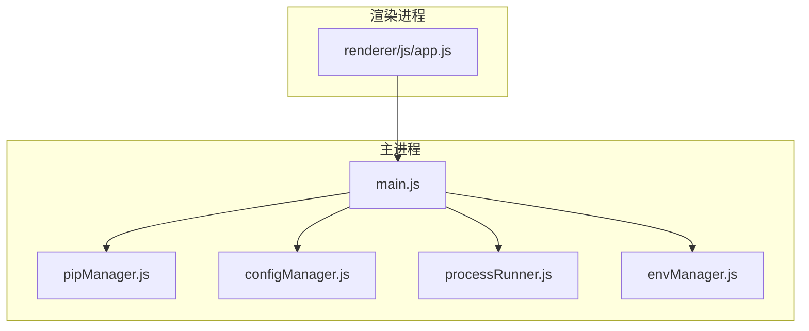
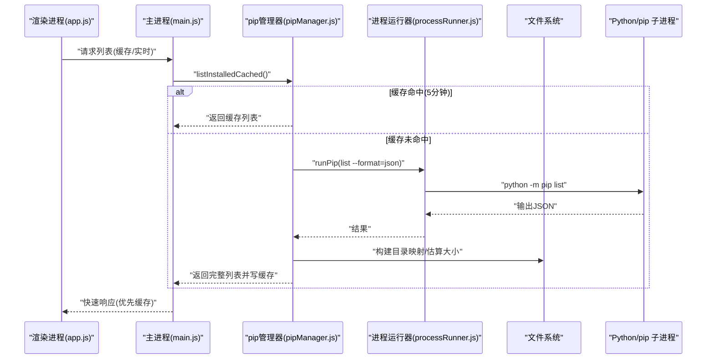
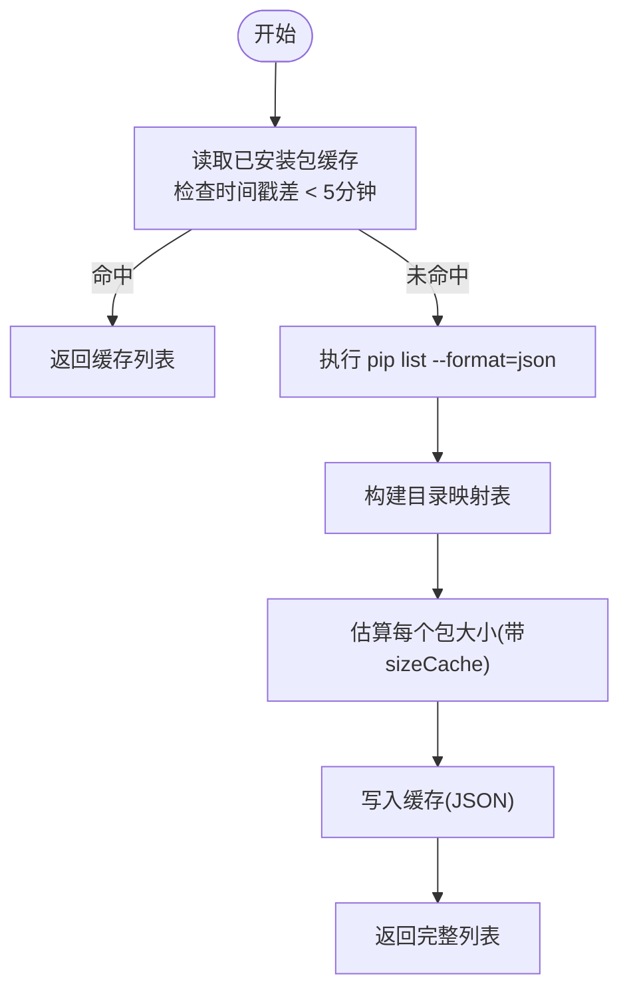
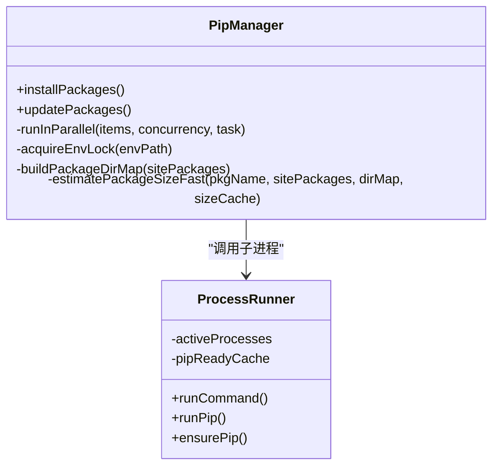
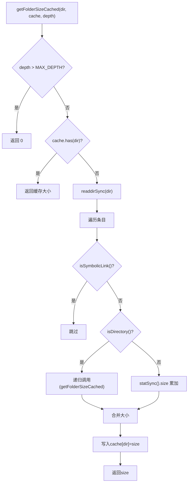
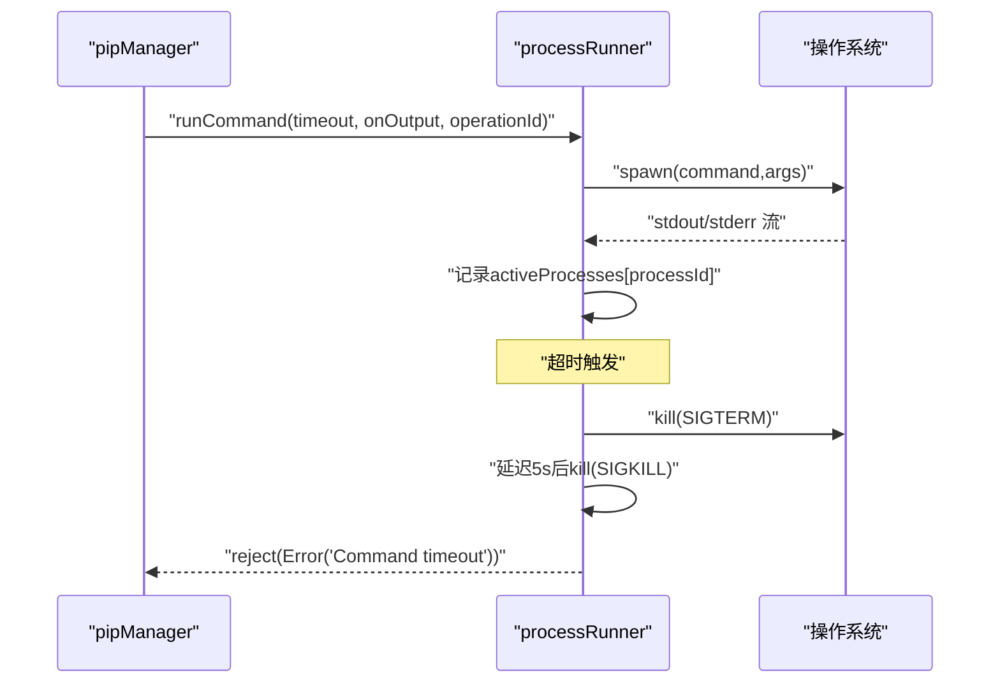
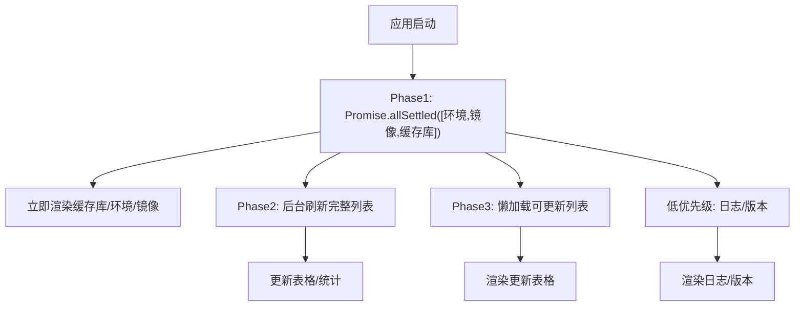
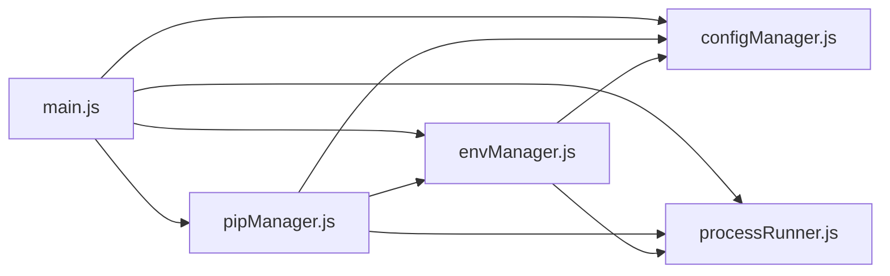

# 性能优化技术

<cite>
**本文引用的文件**   
- [main.js](file://main.js)
- [package.json](file://package.json)
- [pipManager.js](file://core/operations/pipManager.js)
- [configManager.js](file://core/config/configManager.js)
- [processRunner.js](file://utils/processRunner.js)
- [envManager.js](file://core/system/envManager.js)
- [app.js](file://renderer/js/app.js)
</cite>

## 目录
1. [简介](#简介)
2. [项目结构](#项目结构)
3. [核心组件](#核心组件)
4. [架构总览](#架构总览)
5. [详细组件分析](#详细组件分析)
6. [依赖关系分析](#依赖关系分析)
7. [性能考量与指标](#性能考量与指标)
8. [故障排查指南](#故障排查指南)
9. [结论](#结论)
10. [附录](#附录)

## 简介
本文件聚焦 PyLibMaster 的性能优化技术，系统性阐述缓存机制、并发处理、文件系统操作优化、内存管理与垃圾回收策略，并给出监控指标、瓶颈分析与调优建议。内容基于仓库中的实际实现，覆盖已安装包缓存（5分钟有效期）、site-packages 路径缓存（30秒TTL）、包大小计算缓存、目录映射表构建、并行安装线程池管理、资源竞争避免、批量目录扫描、符号链接跳过、递归深度限制、进程超时与取消、以及前端启动阶段的渐进式加载等。

## 项目结构
本项目采用 Electron 主进程 + 渲染进程架构：
- 主进程负责 IPC 路由、应用生命周期、子进程运行与清理、配置与日志持久化、环境检测与切换、镜像源管理等。
- 渲染进程负责 UI 交互、事件绑定、渐进式数据加载与状态更新。
- 核心业务模块集中在 core/operations 与 core/system，工具类在 utils/。

图表来源
- [main.js:1-120](file://main.js#L1-L120)
- [pipManager.js:1-120](file://core/operations/pipManager.js#L1-L120)
- [configManager.js:1-120](file://core/config/configManager.js#L1-L120)
- [processRunner.js:1-120](file://utils/processRunner.js#L1-L120)
- [envManager.js:1-120](file://core/system/envManager.js#L1-L120)
- [app.js:1-120](file://renderer/js/app.js#L1-L120)

章节来源
- [main.js:1-120](file://main.js#L1-L120)
- [package.json:1-79](file://package.json#L1-L79)

## 核心组件
- pipManager：包查询、安装、卸载、更新、磁盘占用分析、离线下载、依赖图、健康检查；内置多种缓存与并发控制。
- processRunner：子进程执行器，封装超时、取消、ANSI清理、UTF-8编码、pip自动安装与就绪缓存。
- configManager：配置持久化、数值范围校验与默认值回退、原子写入。
- envManager：Python 环境检测、版本信息获取、当前环境切换与缓存。
- main.js：IPC 处理器注册、窗口与托盘管理、应用生命周期、调度器集成。
- app.js：渲染进程初始化、渐进式加载、事件绑定与主题/语言切换。

章节来源
- [pipManager.js:1-120](file://core/operations/pipManager.js#L1-L120)
- [processRunner.js:1-120](file://utils/processRunner.js#L1-L120)
- [configManager.js:1-120](file://core/config/configManager.js#L1-L120)
- [envManager.js:1-120](file://core/system/envManager.js#L1-L120)
- [main.js:1-120](file://main.js#L1-L120)
- [app.js:1-120](file://renderer/js/app.js#L1-L120)

## 架构总览
下图展示从渲染进程到主进程再到子进程的调用链与关键优化点（缓存、并发、超时、取消）。

图表来源
- [app.js:130-210](file://renderer/js/app.js#L130-L210)
- [main.js:280-310](file://main.js#L280-L310)
- [pipManager.js:382-421](file://core/operations/pipManager.js#L382-L421)
- [processRunner.js:340-342](file://utils/processRunner.js#L340-L342)

## 详细组件分析

### 缓存机制
- 已安装包缓存（5分钟有效期）
  - 通过 JSON 文件存储 timestamp 与 list，读取时判断时间戳差是否小于 5 分钟。
  - 首次或过期时执行实时扫描并写回缓存。
  - 前端优先调用缓存接口，提升首屏速度。
- site-packages 路径缓存（30秒TTL）
  - 使用 Map 缓存 pythonPath -> { location, time }，避免重复解析 pip show Location。
  - 超过 TTL 则重新探测。
- 包大小计算缓存
  - 递归计算目录大小时使用 sizeCache Map，避免重复统计同一目录。
  - 对 .dist-info 与普通包目录分别查找并累加。
- 目录映射表构建
  - 一次性构建 site-packages 下包名到路径的映射，用于快速定位安装时间与大小。
  - 支持 _ 与 - 规范化转换，兼容不同命名风格。
- 依赖图缓存（5分钟TTL）
  - 全局依赖图谱结果按时间戳缓存，减少重复 pip show 调用。
- pip 就绪状态缓存（5分钟TTL）
  - 进程运行器维护 pythonPath -> { ready, time }，避免频繁检测 pip 可用性。

图表来源
- [pipManager.js:99-127](file://core/operations/pipManager.js#L99-L127)
- [pipManager.js:260-314](file://core/operations/pipManager.js#L260-L314)
- [pipManager.js:382-421](file://core/operations/pipManager.js#L382-L421)
- [pipManager.js:1382-1435](file://core/operations/pipManager.js#L1382-L1435)
- [processRunner.js:23-63](file://utils/processRunner.js#L23-L63)

章节来源
- [pipManager.js:99-127](file://core/operations/pipManager.js#L99-L127)
- [pipManager.js:226-248](file://core/operations/pipManager.js#L226-L248)
- [pipManager.js:260-314](file://core/operations/pipManager.js#L260-L314)
- [pipManager.js:1382-1435](file://core/operations/pipManager.js#L1382-L1435)
- [processRunner.js:23-63](file://utils/processRunner.js#L23-L63)

### 并发处理优化
- 并行安装线程池管理
  - runInParallel 以固定并发数 workers 消费任务队列，避免无界并发导致资源争用。
  - 并发数受配置 parallelThreads 限制，默认 4，最大不超过包数量。
- 资源竞争避免
  - 环境级互斥锁（acquireEnvLock），确保同一 Python 环境的操作串行执行，防止 pip 元数据冲突。
  - 所有安装/卸载/更新均包裹在 acquire/release 中。
- 内存使用优化
  - 目录映射表与大小缓存 Map 在一次操作中复用，避免重复扫描。
  - 依赖图构建限制扫描包数量（最多 80 个），降低内存与 I/O 压力。
  - 前端启动阶段分 Phase 并行加载，先显示缓存数据，后台刷新完整数据。

图表来源
- [pipManager.js:495-578](file://core/operations/pipManager.js#L495-L578)
- [pipManager.js:912-924](file://core/operations/pipManager.js#L912-L924)
- [processRunner.js:85-161](file://utils/processRunner.js#L85-L161)

章节来源
- [pipManager.js:495-578](file://core/operations/pipManager.js#L495-L578)
- [pipManager.js:912-924](file://core/operations/pipManager.js#L912-L924)
- [pipManager.js:1382-1435](file://core/operations/pipManager.js#L1382-L1435)
- [app.js:130-210](file://renderer/js/app.js#L130-L210)

### 文件系统操作优化
- 批量目录扫描
  - buildPackageDirMap 一次性读取 site-packages 顶层条目，建立包名到路径映射，避免 per-package glob 或 readdirSync。
- 符号链接跳过
  - getFolderSizeCached 遇到符号链接直接跳过，防止死循环与重复计数。
- 递归深度限制
  - 设置 MAX_DEPTH=20，超出深度直接返回 0，避免深层嵌套导致的栈与 I/O 风暴。
- 安全路径校验
  - wheel 路径禁止 UNC、相对路径、敏感目录与非法字符，防止路径遍历与命令注入。

图表来源
- [pipManager.js:296-314](file://core/operations/pipManager.js#L296-L314)
- [pipManager.js:260-282](file://core/operations/pipManager.js#L260-L282)
- [pipManager.js:154-217](file://core/operations/pipManager.js#L154-L217)

章节来源
- [pipManager.js:260-314](file://core/operations/pipManager.js#L260-L314)
- [pipManager.js:154-217](file://core/operations/pipManager.js#L154-L217)

### 进程与超时、取消
- 子进程执行器提供统一超时处理（SIGTERM 后 5 秒 SIGKILL），避免僵尸进程。
- 活跃进程跟踪 activeProcesses，支持按 operationId 批量取消。
- 应用退出前 cancelAllProcesses，确保清理所有子进程。
- pip 就绪状态缓存减少重复检测开销。

图表来源
- [processRunner.js:85-161](file://utils/processRunner.js#L85-L161)
- [processRunner.js:197-206](file://utils/processRunner.js#L197-L206)
- [processRunner.js:233-278](file://utils/processRunner.js#L233-L278)

章节来源
- [processRunner.js:85-161](file://utils/processRunner.js#L85-L161)
- [processRunner.js:197-206](file://utils/processRunner.js#L197-L206)
- [processRunner.js:233-278](file://utils/processRunner.js#L233-L278)

### 前端渐进式加载与状态管理
- 启动阶段并行加载配置、环境、镜像、缓存库，优先显示缓存数据。
- 后台刷新完整列表与可更新列表，不阻塞 UI。
- 低优先级加载日志与应用版本，渲染统计面板。

图表来源
- [app.js:130-210](file://renderer/js/app.js#L130-L210)

章节来源
- [app.js:130-210](file://renderer/js/app.js#L130-L210)

## 依赖关系分析
- main.js 作为 IPC 中枢，将渲染进程请求路由至各核心模块。
- pipManager 依赖 configManager（配置项如 parallelThreads、retryCount）、mirrorManager（镜像源）、backupManager（备份/回滚）、logManager（日志）、processRunner（子进程）、envManager（当前环境）。
- processRunner 依赖 strip-ansi、child_process、fs、path、https/http。
- envManager 依赖 glob、processRunner、configManager。

图表来源
- [main.js:1-120](file://main.js#L1-L120)
- [pipManager.js:1-40](file://core/operations/pipManager.js#L1-L40)
- [envManager.js:1-40](file://core/system/envManager.js#L1-L40)
- [processRunner.js:1-40](file://utils/processRunner.js#L1-L40)

章节来源
- [main.js:1-120](file://main.js#L1-L120)
- [pipManager.js:1-40](file://core/operations/pipManager.js#L1-L40)
- [envManager.js:1-40](file://core/system/envManager.js#L1-L40)
- [processRunner.js:1-40](file://utils/processRunner.js#L1-L40)

## 性能考量与指标
- 缓存命中率
  - 已安装包缓存（5分钟）与 site-packages 路径缓存（30秒）显著降低 I/O 与子进程调用次数。
  - 依赖图缓存（5分钟）减少重复 pip show 调用。
- 并发与吞吐
  - runInParallel 控制并发度，避免 CPU 与 I/O 争用；parallelThreads 可通过配置调整。
- 文件系统效率
  - 一次性构建目录映射表，避免 per-package 扫描；符号链接跳过与深度限制防止异常路径。
- 进程管理
  - 超时与两级终止保证资源释放；operationId 批量取消提升用户体验。
- 内存与 GC
  - 使用 Map 缓存目录大小与依赖图，单次操作内复用，减少对象创建与分配。
  - 前端异步任务使用 Promise.allSettled，避免阻塞主线程。
- 监控指标建议
  - 缓存命中率（installed-cache、site-packages、dep-graph、pip-ready）。
  - 平均/峰值内存占用（Node.js 进程 RSS/Heap）。
  - 子进程执行时长分布（成功/失败/超时）。
  - 并发度与队列长度（runInParallel 工作线程利用率）。
  - I/O 等待时间（fs.readdirSync/statSync 耗时）。
  - 错误率（网络超时、权限不足、路径非法）。
- 瓶颈分析与调优建议
  - 若缓存命中率低，考虑延长 TTL 或增加增量更新策略。
  - 高并发场景下适当降低 parallelThreads，观察 CPU 与 I/O 饱和情况。
  - 大型环境（>1000 包）限制依赖图扫描数量（已实现 80 上限），必要时分页或抽样。
  - 磁盘 I/O 热点集中在 site-packages 扫描，可考虑引入更细粒度的增量缓存（按包变更时间戳）。
  - 网络不稳定时启用多镜像重试（已实现），并可结合智能路由选择最快镜像。

[本节为通用指导，不直接分析具体文件]

## 故障排查指南
- 常见问题
  - pip 不可用：ensurePip 会尝试 ensurepip 与 get-pip.py 安装；检查网络与权限。
  - 超时：runCommand 会在超时后发送 SIGTERM/SIGKILL；查看日志确认是否为网络或编译问题。
  - 路径非法：wheel 路径校验严格，确保绝对路径且不含敏感目录与非法字符。
  - 并发冲突：同一环境操作被互斥锁串行化；检查是否存在跨环境误用。
- 诊断步骤
  - 查看日志导出（CSV/Markdown）定位错误上下文。
  - 使用 healthCheck 与 checkConflicts 评估环境健康与依赖冲突。
  - 清空 pip 就绪缓存（clearPipReadyCache）后重试。
  - 降低 parallelThreads 或禁用并行安装，验证是否并发导致的问题。

章节来源
- [processRunner.js:233-278](file://utils/processRunner.js#L233-L278)
- [pipManager.js:1442-1485](file://core/operations/pipManager.js#L1442-L1485)
- [pipManager.js:1492-1566](file://core/operations/pipManager.js#L1492-L1566)
- [main.js:161-170](file://main.js#L161-L170)

## 结论
PyLibMaster 在缓存、并发、文件系统与进程管理方面实现了系统化的性能优化策略。通过多级缓存与 TTL、受限并发与互斥锁、安全的目录扫描与深度限制、以及健壮的子进程管理，显著提升了响应速度与稳定性。建议持续监控关键指标并根据环境规模动态调优参数，以获得最佳性能与用户体验。

[本节为总结性内容，不直接分析具体文件]

## 附录
- 配置项参考
  - parallelThreads：并行安装线程数（1-16，默认 4）。
  - retryCount：智能重试次数（0-10，默认 3）。
  - smartRoute：智能路由开关。
  - storagePath：日志与备份存储路径。
- 常用 API
  - listInstalled / listInstalledCached：实时与缓存列表。
  - installPackages / uninstallPackages / updatePackages：批量操作与并发控制。
  - getDiskUsage / getFullDependencyGraph：磁盘占用与依赖图。
  - checkConflicts / healthCheck：依赖冲突与环境健康检查。

章节来源
- [configManager.js:22-44](file://core/config/configManager.js#L22-L44)
- [pipManager.js:1568-1596](file://core/operations/pipManager.js#L1568-L1596)