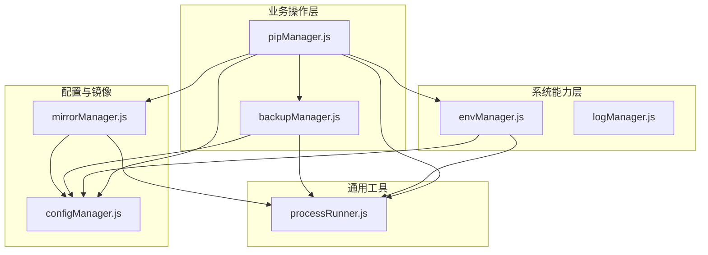
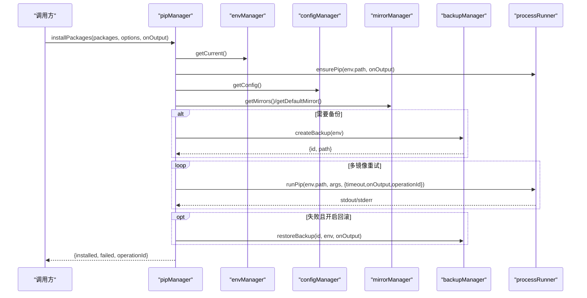
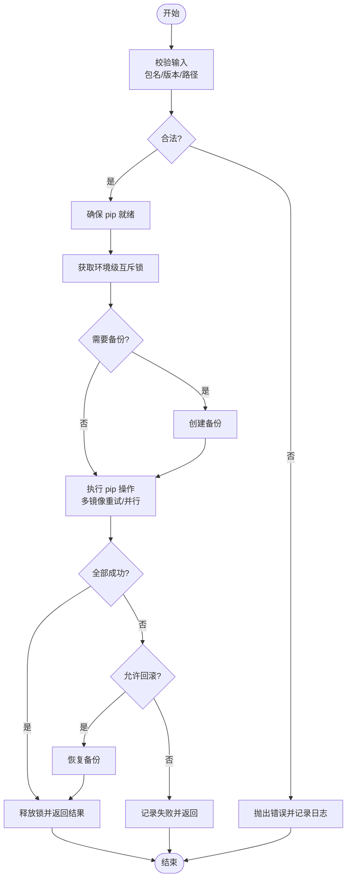
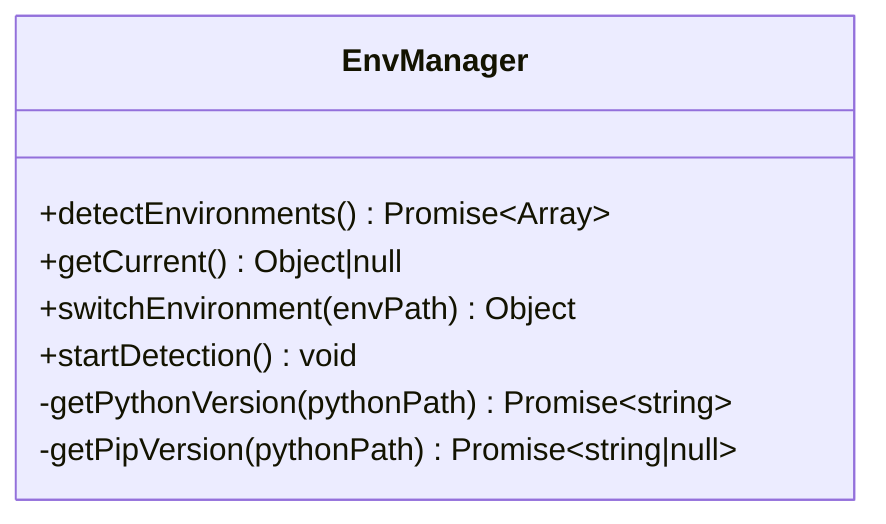
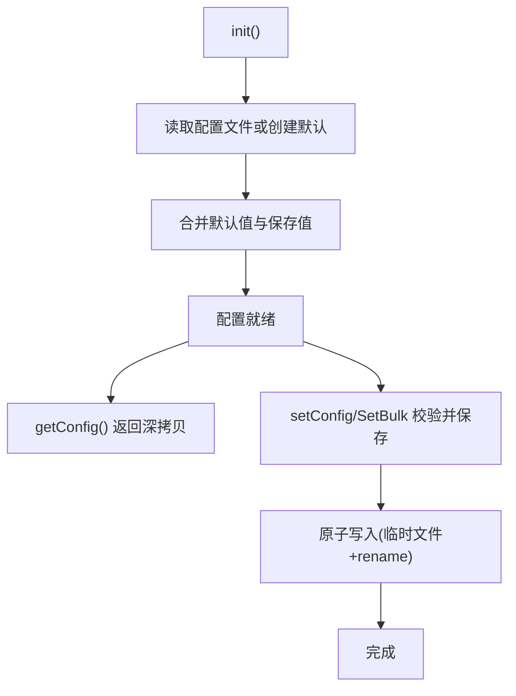
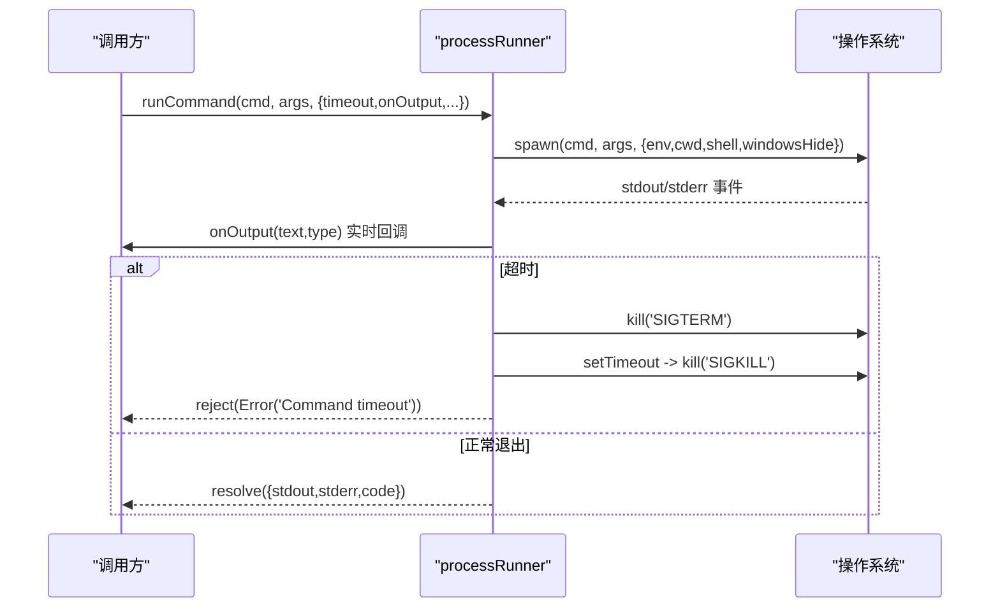
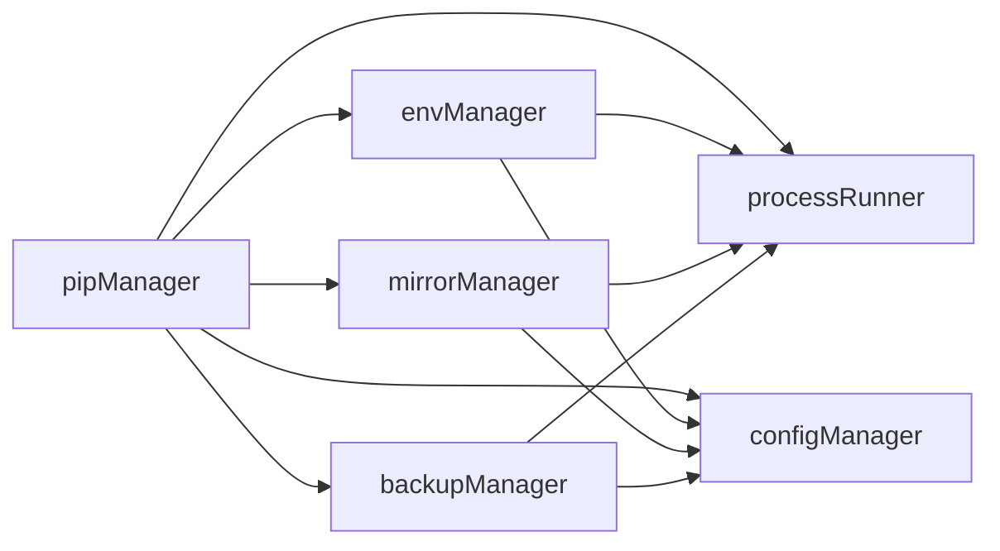

# 核心模块

<cite>
**本文引用的文件**   
- [pipManager.js](file://core/operations/pipManager.js)
- [envManager.js](file://core/system/envManager.js)
- [configManager.js](file://core/config/configManager.js)
- [processRunner.js](file://utils/processRunner.js)
- [mirrorManager.js](file://core/config/mirrorManager.js)
- [backupManager.js](file://core/operations/backupManager.js)
- [logManager.js](file://core/system/logManager.js)
- [package.json](file://package.json)
</cite>

## 目录
1. [简介](#简介)
2. [项目结构](#项目结构)
3. [核心组件](#核心组件)
4. [架构总览](#架构总览)
5. [详细组件分析](#详细组件分析)
6. [依赖关系分析](#依赖关系分析)
7. [性能考量](#性能考量)
8. [故障排查指南](#故障排查指南)
9. [结论](#结论)
10. [附录：API 速查与使用模式](#附录api-速查与使用模式)

## 简介
本文件面向 PyLibMaster 的核心模块，重点围绕四个关键模块进行系统化说明：
- pipManager（包管理器）：负责包的查询、安装、卸载、更新、依赖分析、离线下载、健康检查等。
- envManager（环境管理器）：负责自动检测系统 Python 环境、获取版本信息、切换并持久化当前环境。
- configManager（配置管理器）：负责应用配置的读写、校验、默认值合并与原子写入。
- processRunner（进程运行器）：封装子进程执行、超时、取消、ANSI 清理、pip 自动就绪保障等。

文档将提供职责边界、核心功能、API 接口、数据流、错误处理策略、性能优化建议与最佳实践，并给出调试技巧与常见问题解决方案，既适合初学者入门，也满足高级用户的深入需求。

## 项目结构
PyLibMaster 采用分层组织方式：
- core/operations：业务操作层（pipManager、backupManager 等）
- core/system：系统能力层（envManager、logManager 等）
- core/config：配置与镜像管理（configManager、mirrorManager 等）
- utils：通用工具（processRunner、security 等）
- renderer/main：前端渲染与主进程入口（不在本文范围）

图表来源
- [pipManager.js:1-28](file://core/operations/pipManager.js#L1-L28)
- [envManager.js:18-24](file://core/system/envManager.js#L18-L24)
- [configManager.js:17-20](file://core/config/configManager.js#L17-L20)
- [mirrorManager.js:15-20](file://core/config/mirrorManager.js#L15-L20)
- [backupManager.js:19-24](file://core/operations/backupManager.js#L19-L24)
- [processRunner.js:13-19](file://utils/processRunner.js#L13-L19)

章节来源
- [package.json:1-24](file://package.json#L1-L24)

## 核心组件
本节对四个核心模块的职责与关键能力进行概览，后续章节将展开 API 与实现细节。

- pipManager
  - 包查询：已安装列表（含大小/时间估算）、可更新列表、搜索
  - 包操作：批量安装/卸载/更新、并行执行、智能重试、自动回滚
  - 安全校验：包名/版本正则校验、wheel 路径安全检查
  - 依赖与健康：依赖树、冲突检测、环境健康检查
  - 离线与导出：requirements 导出/导入、离线下载、环境对比
- envManager
  - 环境发现：扫描常见路径、PATH 中 python、Conda/Anaconda
  - 版本探测：Python 与 pip 版本解析
  - 环境切换：内存缓存 + 配置文件持久化
- configManager
  - 配置加载：默认值合并、损坏恢复、原子写入
  - 数值校验：范围限制与自动修正
  - 存储路径：基于 Electron userData 或环境变量
- processRunner
  - 子进程封装：spawn、超时、SIGTERM/SIGKILL、ANSI 清理
  - pip 就绪：ensurePip（ensurepip/get-pip.py），缓存与重试
  - 进程管理：按 operationId 取消、全局取消

章节来源
- [pipManager.js:1-1597](file://core/operations/pipManager.js#L1-L1597)
- [envManager.js:1-220](file://core/system/envManager.js#L1-L220)
- [configManager.js:1-194](file://core/config/configManager.js#L1-L194)
- [processRunner.js:1-366](file://utils/processRunner.js#L1-L366)

## 架构总览
下图展示了四个核心模块之间的调用关系与数据流向。pipManager 作为业务编排中心，协调 envManager、configManager、mirrorManager、backupManager 与 processRunner 完成包生命周期管理；envManager 通过 processRunner 探测环境与版本；configManager 提供统一配置读写；processRunner 提供底层进程能力。

图表来源
- [pipManager.js:495-578](file://core/operations/pipManager.js#L495-L578)
- [envManager.js:178-184](file://core/system/envManager.js#L178-L184)
- [configManager.js:144-147](file://core/config/configManager.js#L144-L147)
- [mirrorManager.js:110-118](file://core/config/mirrorManager.js#L110-L118)
- [backupManager.js:89-113](file://core/operations/backupManager.js#L89-L113)
- [processRunner.js:233-278](file://utils/processRunner.js#L233-L278)

## 详细组件分析

### pipManager（包管理器）
- 职责与特性
  - 包查询：listInstalled/listOutdated/searchPackage
  - 包操作：installPackages/installFromFile/uninstallPackages/updatePackages
  - 安全与健壮性：包名校验、wheel 路径校验、环境级互斥锁、自动回滚
  - 依赖与健康：showPackageInfo/getDependencyTree/checkConflicts/healthCheck
  - 离线与迁移：downloadPackages/exportRequirements/importRequirements/compareEnvironments/diffRequirements
  - 进度与日志：结构化进度事件、操作日志记录
- 关键数据结构与复杂度
  - site-packages 路径缓存 Map（TTL 30s），避免重复解析
  - 包目录映射表 Map（name -> {type,path}），用于快速查找 .dist-info 与包目录
  - 文件夹大小递归计算带缓存 Map，最大深度 20，避免符号链接死循环
  - 并发控制：runInParallel 队列+worker 池，线程数受配置限制
- 错误处理策略
  - 输入校验失败直接抛出错误
  - 网络/命令失败时多镜像重试，必要时触发自动回滚
  - 所有异常均记录日志，便于定位问题
- 性能优化
  - 已安装包列表缓存（5分钟）
  - site-packages 路径缓存（30秒）
  - 目录大小与安装时间估算的缓存与限深
  - 并行安装/更新，限制并发度
- 典型使用模式
  - 安装：指定版本模式（latest/specific/range），支持并行与重试
  - 卸载：安全模式，可选备份与回滚
  - 更新：智能判断“Requirement already satisfied”避免误判成功
  - 离线：downloadPackages 支持平台/Python 版本参数
  - 依赖：getDependencyTree 递归构建（最大深度 3）

图表来源
- [pipManager.js:495-578](file://core/operations/pipManager.js#L495-L578)
- [pipManager.js:727-771](file://core/operations/pipManager.js#L727-L771)
- [pipManager.js:787-867](file://core/operations/pipManager.js#L787-L867)
- [backupManager.js:89-113](file://core/operations/backupManager.js#L89-L113)

章节来源
- [pipManager.js:1-1597](file://core/operations/pipManager.js#L1-L1597)
- [backupManager.js:1-196](file://core/operations/backupManager.js#L1-L196)

### envManager（环境管理器）
- 职责与特性
  - 自动检测系统中可用的 Python 环境（常见路径、PATH、Conda/Anaconda）
  - 获取 Python 与 pip 版本信息
  - 切换当前环境并持久化到配置
  - 后台启动检测，不阻塞主流程
- 关键设计
  - 去重 Map（小写路径）避免重复环境
  - 并行获取版本信息提升检测速度
  - 恢复配置中的 currentEnv，若存在则优先选择
- 错误处理策略
  - 找不到环境抛错；无 pip 的环境被过滤
  - glob/where 命令失败忽略，保证鲁棒性
- 性能优化
  - 并行版本探测
  - 内存缓存当前环境与已检测列表
- 典型使用模式
  - detectEnvironments() 获取可用环境
  - switchEnvironment(path) 切换并保存
  - startDetection() 异步启动检测

图表来源
- [envManager.js:85-170](file://core/system/envManager.js#L85-L170)
- [envManager.js:178-209](file://core/system/envManager.js#L178-L209)

章节来源
- [envManager.js:1-220](file://core/system/envManager.js#L1-L220)

### configManager（配置管理器）
- 职责与特性
  - 配置初始化：默认值合并、损坏恢复、目录创建
  - 读取/设置：getConfig/setConfig/setBulk，返回深拷贝防止外部修改
  - 数值校验：RANGE_LIMITS 限制范围与类型，自动修正
  - 原子写入：先写临时文件再 rename，避免崩溃损坏
  - 存储路径：Electron userData 或环境变量回退
- 关键设计
  - init() 单例初始化，避免重复 IO
  - sanitizeValue() 统一校验逻辑
  - saveConfig() 降级日志输出（logManager 未就绪时）
- 错误处理策略
  - 配置文件损坏重建默认配置
  - 保存失败尝试记录日志，否则 stderr 输出
- 性能优化
  - 内存缓存配置对象
  - 批量设置只触发一次磁盘写入
- 典型使用模式
  - getConfig() 获取完整配置副本
  - setConfig(key,value)/setBulk(updates) 更新配置
  - getStoragePath() 获取存储目录（不存在则创建）

图表来源
- [configManager.js:80-117](file://core/config/configManager.js#L80-L117)
- [configManager.js:123-138](file://core/config/configManager.js#L123-L138)
- [configManager.js:144-178](file://core/config/configManager.js#L144-L178)

章节来源
- [configManager.js:1-194](file://core/config/configManager.js#L1-L194)

### processRunner（进程运行器）
- 职责与特性
  - 子进程封装：spawn、超时、SIGTERM/SIGKILL、ANSI 清理、UTF-8 编码
  - pip 就绪保障：checkPipAvailable/ensurePip（ensurepip 优先，失败则 get-pip.py）
  - 进程管理：activeProcesses 跟踪、cancelProcess/cancelOperation/cancelAllProcesses
  - 便捷方法：runPip/runPython
- 关键设计
  - pipReadyCache 缓存 pip 就绪状态（TTL 5 分钟）
  - 活跃进程 Map（processId -> proc, operationId, startTime）
  - 下载 get-pip.py 多源重试（主站与 GitHub 备用）
- 错误处理策略
  - 非零退出码构造错误对象（包含 stdout/stderr）
  - 超时后两级终止（SIGTERM 后 SIGKILL）
  - 下载失败自动切换下一个 URL
- 性能优化
  - pip 就绪缓存减少重复检测
  - ANSI 清理避免终端转义污染
- 典型使用模式
  - runCommand(command,args,options) 基础执行
  - ensurePip(pythonPath,onOutput) 确保 pip 可用
  - runPip(pythonPath,args,options) 执行 pip 命令
  - cancelOperation(operationId) 批量取消关联进程

图表来源
- [processRunner.js:85-161](file://utils/processRunner.js#L85-L161)
- [processRunner.js:233-278](file://utils/processRunner.js#L233-L278)
- [processRunner.js:286-331](file://utils/processRunner.js#L286-L331)

章节来源
- [processRunner.js:1-366](file://utils/processRunner.js#L1-L366)

## 依赖关系分析
- pipManager 依赖 envManager（获取当前环境）、configManager（读取配置）、mirrorManager（镜像源）、backupManager（备份/回滚）、processRunner（执行 pip/Python）
- envManager 依赖 processRunner（执行 Python/pip 命令）、configManager（持久化 currentEnv）
- mirrorManager 依赖 configManager（保存镜像配置）、processRunner（测速/写入 pip 配置）
- backupManager 依赖 configManager（存储路径）、processRunner（执行 pip freeze/install）
- logManager 被多个模块用于记录操作日志

图表来源
- [pipManager.js:22-27](file://core/operations/pipManager.js#L22-L27)
- [envManager.js:22-24](file://core/system/envManager.js#L22-L24)
- [mirrorManager.js:18-20](file://core/config/mirrorManager.js#L18-L20)
- [backupManager.js:21-24](file://core/operations/backupManager.js#L21-L24)

章节来源
- [pipManager.js:1-28](file://core/operations/pipManager.js#L1-L28)
- [envManager.js:18-24](file://core/system/envManager.js#L18-L24)
- [mirrorManager.js:15-20](file://core/config/mirrorManager.js#L15-L20)
- [backupManager.js:19-24](file://core/operations/backupManager.js#L19-L24)

## 性能考量
- 缓存策略
  - pip 就绪状态缓存（5 分钟）
  - site-packages 路径缓存（30 秒）
  - 已安装包列表缓存（5 分钟）
  - 依赖图缓存（5 分钟）
- 并发与限流
  - 并行安装/更新，线程数由配置 parallelThreads 控制
  - 文件夹大小递归计算限制深度（20）
- I/O 优化
  - 原子写入配置，避免损坏
  - 日志写入防抖（300ms）
- 网络优化
  - 多镜像源重试与智能路由（最快镜像）
  - get-pip.py 多源下载与超时控制

[本节为通用指导，无需具体文件引用]

## 故障排查指南
- 常见问题与解决
  - pip 不可用：调用 ensurePip，优先 ensurepip，失败则下载 get-pip.py；如仍失败，手动安装 pip
  - 安装失败：检查包名/版本合法性、镜像源连通性、网络超时；启用自动回滚恢复环境
  - 依赖冲突：使用 checkConflicts 诊断，根据提示修复或重装依赖
  - 环境切换失败：确认路径存在且包含 pip；重新 detectEnvironments
  - 配置损坏：configManager 会自动重建默认配置
- 调试技巧
  - 启用 onOutput 回调查看实时输出（stdout/stderr）
  - 使用 operationId 批量取消相关进程
  - 查看日志文件 operations.json，筛选 type/action/detail
  - 使用 healthCheck 生成环境健康报告
- 错误分类
  - 输入校验错误：立即抛错，检查参数格式
  - 网络/命令错误：捕获 stdout/stderr，结合日志定位
  - 文件系统错误：检查权限与路径合法性

章节来源
- [processRunner.js:233-278](file://utils/processRunner.js#L233-L278)
- [pipManager.js:1442-1485](file://core/operations/pipManager.js#L1442-L1485)
- [logManager.js:112-131](file://core/system/logManager.js#L112-L131)

## 结论
PyLibMaster 的核心模块以清晰的分层与职责划分实现了稳健的 Python 包管理能力。pipManager 作为业务编排中心，结合 envManager、configManager、mirrorManager、backupManager 与 processRunner，提供了从环境检测到包操作的全链路支持。通过缓存、并发、多镜像重试与自动回滚等机制，系统在易用性与可靠性之间取得良好平衡。建议在生产使用中合理配置并行线程与重试次数，并结合日志与健康检查进行持续监控。

[本节为总结，无需具体文件引用]

## 附录：API 速查与使用模式

- pipManager 常用 API
  - listInstalled()/listInstalledCached()：获取已安装包列表（实时/缓存）
  - listOutdated()：获取可更新包列表
  - searchPackage(keyword)：搜索包（基于 pip index versions）
  - installPackages(packages, options, onOutput)：批量安装（支持 versionMode、parallel、retry、rollback）
  - installFromFile(filePath, options, onOutput)：从 .whl/.txt 安装
  - uninstallPackages(packages, options, onOutput)：批量卸载（支持 force、backup、rollback）
  - updatePackages(packages, options, onOutput)：批量更新（支持 parallel、retry、rollback）
  - showPackageInfo(pkgName)：包详情（名称、版本、摘要、依赖等）
  - getDependencyTree(pkgName)：依赖树（最大深度 3）
  - exportRequirements(options)/importRequirements(filePath, options, onOutput)：requirements 导出/导入
  - compareEnvironments(envPathA, envPathB)：对比两个环境的差异
  - getDiskUsage()：磁盘占用分析
  - downloadPackages(packages, destDir, options, onOutput)：离线下载（支持 includeDeps/platform/pythonVersion）
  - diffRequirements(sourceA, sourceB)：对比两个来源的包列表差异
  - getPackageReleases(pkgName)：获取发布历史（PyPI JSON）
  - getFullDependencyGraph()：全局依赖关系图（节点/边）
  - checkConflicts()：依赖冲突检测
  - healthCheck()：环境健康检查（评分/问题清单）
  - repairPip(options, onOutput)：修复 pip（ensurepip/get-pip.py）
  - buildPackageSpec(name, options)：构建安装规格字符串（支持 latest/specific/range/wheel）

- envManager 常用 API
  - detectEnvironments()：检测系统 Python 环境
  - getCurrent()：获取当前环境
  - switchEnvironment(envPath)：切换环境并持久化
  - startDetection()：后台启动检测

- configManager 常用 API
  - getConfig()：获取配置深拷贝
  - setConfig(key, value)：设置单个配置项
  - setBulk(updates)：批量设置配置项
  - getStoragePath()：获取存储路径（不存在则创建）

- processRunner 常用 API
  - runCommand(command, args, options)：执行系统命令
  - runPip(pythonPath, args, options)：执行 pip 命令
  - runPython(pythonPath, args, options)：执行 Python 命令
  - ensurePip(pythonPath, onOutput)：确保 pip 可用
  - checkPipAvailable(pythonPath)：检查 pip 可用性
  - clearPipReadyCache()：清空 pip 就绪缓存
  - cancelProcess(processId)：取消指定进程
  - cancelOperation(operationId)：按 operationId 取消关联进程
  - cancelAllProcesses()：取消所有活跃进程

- 使用示例（描述性）
  - 安装多个包（最新/指定版本/范围）：调用 installPackages，传入 packages 数组与 versionMode/version，可选择 parallel/retry/rollback，并通过 onOutput 接收进度
  - 从 requirements.txt 安装：调用 importRequirements，传入文件路径与选项（如 retry=false），onOutput 显示安装过程
  - 切换环境：调用 switchEnvironment 指定 python.exe 路径，成功后 getCurrent 返回新环境
  - 修复 pip：调用 repairPip，优先 ensurepip，失败则 get-pip.py，完成后验证 pip --version
  - 健康检查：调用 healthCheck，得到评分与问题清单，根据提示修复

章节来源
- [pipManager.js:382-421](file://core/operations/pipManager.js#L382-L421)
- [pipManager.js:450-472](file://core/operations/pipManager.js#L450-L472)
- [pipManager.js:495-578](file://core/operations/pipManager.js#L495-L578)
- [pipManager.js:627-712](file://core/operations/pipManager.js#L627-L712)
- [pipManager.js:727-771](file://core/operations/pipManager.js#L727-L771)
- [pipManager.js:787-867](file://core/operations/pipManager.js#L787-L867)
- [pipManager.js:1006-1038](file://core/operations/pipManager.js#L1006-L1038)
- [pipManager.js:1045-1077](file://core/operations/pipManager.js#L1045-L1077)
- [pipManager.js:1086-1135](file://core/operations/pipManager.js#L1086-L1135)
- [pipManager.js:1143-1182](file://core/operations/pipManager.js#L1143-L1182)
- [pipManager.js:1190-1212](file://core/operations/pipManager.js#L1190-L1212)
- [pipManager.js:1224-1263](file://core/operations/pipManager.js#L1224-L1263)
- [pipManager.js:1273-1320](file://core/operations/pipManager.js#L1273-L1320)
- [pipManager.js:1329-1378](file://core/operations/pipManager.js#L1329-L1378)
- [pipManager.js:1391-1435](file://core/operations/pipManager.js#L1391-L1435)
- [pipManager.js:1442-1485](file://core/operations/pipManager.js#L1442-L1485)
- [pipManager.js:1492-1566](file://core/operations/pipManager.js#L1492-L1566)
- [pipManager.js:950-996](file://core/operations/pipManager.js#L950-L996)
- [envManager.js:85-170](file://core/system/envManager.js#L85-L170)
- [envManager.js:178-209](file://core/system/envManager.js#L178-L209)
- [configManager.js:144-178](file://core/config/configManager.js#L144-L178)
- [processRunner.js:85-161](file://utils/processRunner.js#L85-L161)
- [processRunner.js:233-278](file://utils/processRunner.js#L233-L278)