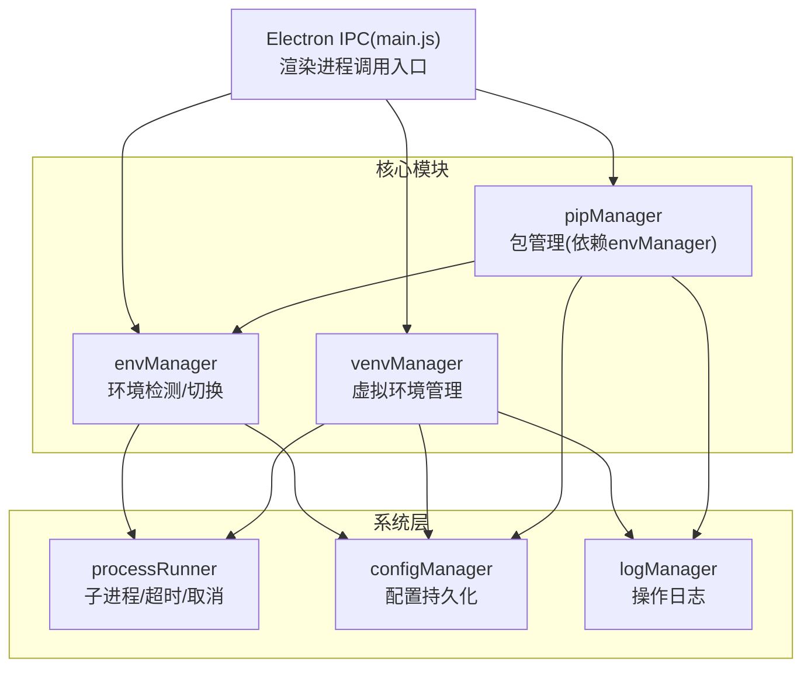
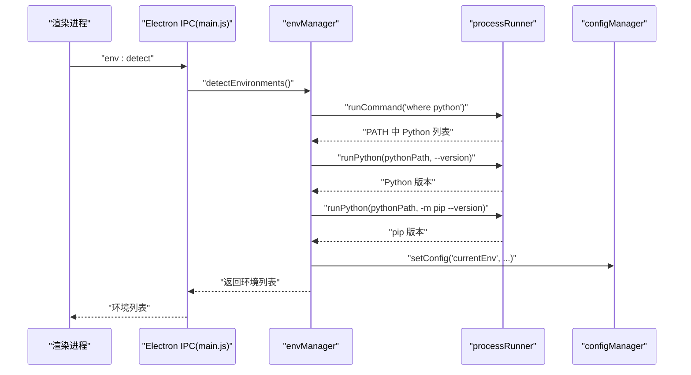
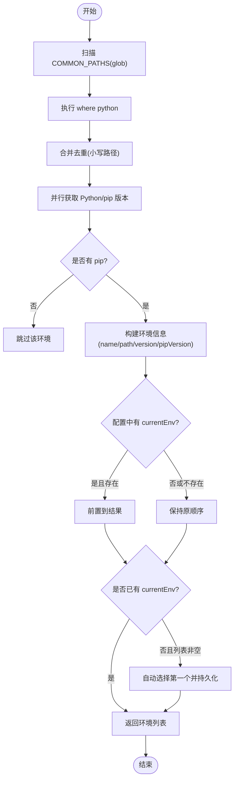
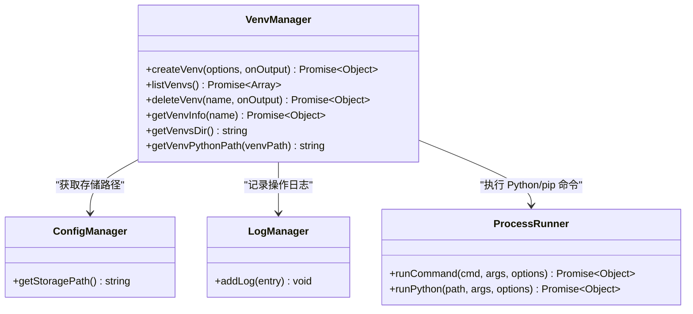
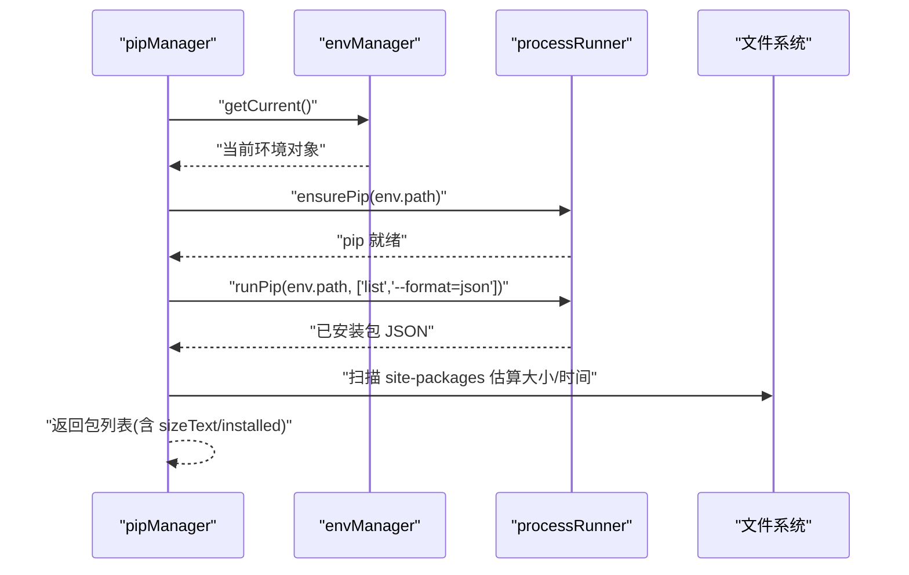
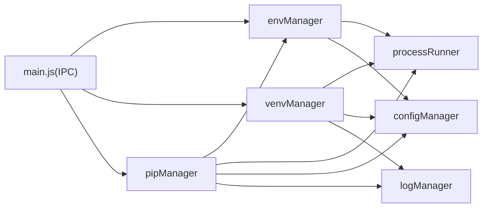

# 环境管理器 (envManager)

<cite>
**本文引用的文件**   
- [core/system/envManager.js](file://core/system/envManager.js)
- [core/operations/venvManager.js](file://core/operations/venvManager.js)
- [core/operations/pipManager.js](file://core/operations/pipManager.js)
- [utils/processRunner.js](file://utils/processRunner.js)
- [core/config/configManager.js](file://core/config/configManager.js)
- [core/system/logManager.js](file://core/system/logManager.js)
- [main.js](file://main.js)
</cite>

## 目录
1. [简介](#简介)
2. [项目结构](#项目结构)
3. [核心组件](#核心组件)
4. [架构总览](#架构总览)
5. [详细组件分析](#详细组件分析)
6. [依赖关系分析](#依赖关系分析)
7. [性能考量](#性能考量)
8. [故障排查指南](#故障排查指南)
9. [结论](#结论)
10. [附录：API 使用示例与最佳实践](#附录api-使用示例与最佳实践)

## 简介
本文件为 PyLibMaster 中的 envManager（Python 环境管理器）的权威文档。内容覆盖：
- Python 环境检测机制：系统 Python、virtualenv、conda 等路径扫描与识别
- 环境切换逻辑：内存缓存 + 配置持久化的动态切换
- 虚拟环境管理：创建、删除、信息获取
- 环境信息接口：Python 版本、pip 版本、site-packages 路径等
- 验证与兼容性检查：名称合法性、路径安全、pip 就绪性
- 与 pipManager 的集成：确保包操作在正确环境中执行
- 错误处理与异常恢复策略：超时、回滚、日志记录

## 项目结构
envManager 位于 core/system 下，负责“发现与选择当前 Python 环境”；venvManager 位于 core/operations 下，负责“虚拟环境的生命周期管理”；pipManager 通过 envManager 获取当前环境并执行包操作；processRunner 提供子进程运行、pip 自动安装与取消能力；configManager 负责配置持久化；logManager 负责操作日志。

图表来源
- [core/system/envManager.js:1-220](file://core/system/envManager.js#L1-L220)
- [core/operations/venvManager.js:1-278](file://core/operations/venvManager.js#L1-L278)
- [core/operations/pipManager.js:1-800](file://core/operations/pipManager.js#L1-L800)
- [utils/processRunner.js:1-366](file://utils/processRunner.js#L1-L366)
- [core/config/configManager.js:1-194](file://core/config/configManager.js#L1-L194)
- [core/system/logManager.js:1-173](file://core/system/logManager.js#L1-L173)
- [main.js:254-281](file://main.js#L254-L281)

章节来源
- [core/system/envManager.js:1-220](file://core/system/envManager.js#L1-L220)
- [core/operations/venvManager.js:1-278](file://core/operations/venvManager.js#L1-L278)
- [core/operations/pipManager.js:1-800](file://core/operations/pipManager.js#L1-L800)
- [utils/processRunner.js:1-366](file://utils/processRunner.js#L1-L366)
- [core/config/configManager.js:1-194](file://core/config/configManager.js#L1-L194)
- [core/system/logManager.js:1-173](file://core/system/logManager.js#L1-L173)
- [main.js:254-281](file://main.js#L254-L281)

## 核心组件
- envManager：检测系统中可用的 Python 环境，维护当前选中环境，支持切换与持久化
- venvManager：创建/列出/删除虚拟环境，读取 pyvenv.cfg 获取基础 Python 路径，统计包数量
- pipManager：基于当前环境执行包查询/安装/卸载/更新，具备多镜像重试、自动回滚、并发控制
- processRunner：封装子进程执行、超时终止、ANSI 清理、pip 自动安装、按 operationId 取消
- configManager：应用配置读写，包含 currentEnv 字段用于持久化当前环境
- logManager：统一记录操作日志，支持筛选与导出

章节来源
- [core/system/envManager.js:1-220](file://core/system/envManager.js#L1-L220)
- [core/operations/venvManager.js:1-278](file://core/operations/venvManager.js#L1-L278)
- [core/operations/pipManager.js:1-800](file://core/operations/pipManager.js#L1-L800)
- [utils/processRunner.js:1-366](file://utils/processRunner.js#L1-L366)
- [core/config/configManager.js:1-194](file://core/config/configManager.js#L1-L194)
- [core/system/logManager.js:1-173](file://core/system/logManager.js#L1-L173)

## 架构总览
envManager 作为环境中枢，向上暴露 detectEnvironments、getCurrent、switchEnvironment、startDetection；向下通过 processRunner 执行 Python/pip 命令，并通过 configManager 持久化当前环境。venvManager 独立管理虚拟环境目录与元数据。pipManager 依赖 envManager 获取当前环境，确保所有包操作在目标环境中执行。

图表来源
- [main.js:254-261](file://main.js#L254-L261)
- [core/system/envManager.js:85-170](file://core/system/envManager.js#L85-L170)
- [utils/processRunner.js:85-161](file://utils/processRunner.js#L85-L161)
- [core/config/configManager.js:157-162](file://core/config/configManager.js#L157-L162)

## 详细组件分析

### envManager：Python 环境检测与切换
- 检测范围
  - 常见路径模式：系统级 Python、用户级 Python、Windows Store Python、Conda/Anaconda/Miniconda 环境
  - PATH 中的 Python：通过 where python 查找
- 检测流程
  - 遍历 COMMON_PATHS 进行 glob 匹配
  - 并行获取每个候选 Python 的版本与 pip 版本
  - 过滤无 pip 的环境
  - 恢复配置中保存的当前环境（若仍存在）
  - 若无当前环境且列表非空，自动选择第一个并持久化
- 切换逻辑
  - 优先从缓存查找，不存在但路径存在则构造临时对象
  - 切换后立即写入配置
- 启动检测
  - startDetection 异步后台检测，不阻塞主流程

图表来源
- [core/system/envManager.js:31-41](file://core/system/envManager.js#L31-L41)
- [core/system/envManager.js:85-170](file://core/system/envManager.js#L85-L170)

章节来源
- [core/system/envManager.js:1-220](file://core/system/envManager.js#L1-L220)

### venvManager：虚拟环境管理
- 存储位置
  - 默认位于配置的 storagePath/venvs 目录
- 创建
  - 校验名称合法性与长度限制
  - 校验基础 Python 可执行文件存在
  - 构建 python -m venv 参数（支持 --without-pip、--system-site-packages）
  - 失败时清理残留目录并记录日志
  - 成功后读取 Python 版本并返回信息
- 列出
  - 遍历 venvs 目录，验证 python.exe/pyvenv.cfg 有效性
  - 读取 Python 版本、pip 版本、包数量（pip list --format=json）
- 删除
  - 名称与路径合法性校验，防止路径穿越
  - 递归删除目录并记录日志
- 详情
  - 读取 pyvenv.cfg 的 home 字段获取基础 Python 路径

图表来源
- [core/operations/venvManager.js:26-130](file://core/operations/venvManager.js#L26-L130)
- [core/operations/venvManager.js:136-186](file://core/operations/venvManager.js#L136-L186)
- [core/operations/venvManager.js:195-224](file://core/operations/venvManager.js#L195-L224)
- [core/operations/venvManager.js:231-268](file://core/operations/venvManager.js#L231-L268)
- [core/config/configManager.js:185-191](file://core/config/configManager.js#L185-L191)
- [core/system/logManager.js:112-131](file://core/system/logManager.js#L112-L131)
- [utils/processRunner.js:340-353](file://utils/processRunner.js#L340-L353)

章节来源
- [core/operations/venvManager.js:1-278](file://core/operations/venvManager.js#L1-L278)

### pipManager：与 envManager 的集成
- 获取当前环境
  - getCurrentEnv() 直接调用 envManager.getCurrent()
- site-packages 路径
  - getSitePackagesPath(pythonPath) 通过 pip show pip 解析 Location，带缓存 TTL
- 包操作互斥锁
  - acquireEnvLock(envPath) 保证同一环境串行执行，避免并发冲突
- 安装/卸载/更新
  - 均先 ensurePip(env.path)，再执行 runPip
  - 支持多镜像重试、自动回滚、进度回调、operationId 取消

图表来源
- [core/operations/pipManager.js:42-44](file://core/operations/pipManager.js#L42-L44)
- [core/operations/pipManager.js:226-243](file://core/operations/pipManager.js#L226-L243)
- [core/operations/pipManager.js:382-409](file://core/operations/pipManager.js#L382-L409)
- [utils/processRunner.js:233-278](file://utils/processRunner.js#L233-L278)

章节来源
- [core/operations/pipManager.js:1-800](file://core/operations/pipManager.js#L1-L800)

### processRunner：子进程与 pip 保障
- 子进程执行
  - runCommand 支持超时、SIGTERM/SIGKILL 两级终止、ANSI 清理、UTF-8 输出
  - 活跃进程跟踪，支持 cancelProcess/cancelOperation/cancelAllProcesses
- pip 就绪保障
  - ensurePip 三级策略：缓存 → ensurepip → 下载 get-pip.py
  - 下载失败自动尝试备用源
- 快捷方法
  - runPip、runPython 封装常用命令

章节来源
- [utils/processRunner.js:1-366](file://utils/processRunner.js#L1-L366)

### configManager：配置与当前环境持久化
- 存储位置
  - Electron userData 目录下的 pylibmaster-config.json
- 关键项
  - currentEnv：当前选中的 Python 环境对象
  - storagePath：日志与备份存储根目录
- 原子写入
  - 先写 .tmp 再 rename，避免损坏

章节来源
- [core/config/configManager.js:1-194](file://core/config/configManager.js#L1-L194)

### logManager：操作日志
- 统一记录安装/卸载/更新/系统事件
- 防抖写入，最大条数限制，字段截断保护
- 支持按类型与关键词筛选

章节来源
- [core/system/logManager.js:1-173](file://core/system/logManager.js#L1-L173)

## 依赖关系分析
- envManager 依赖 processRunner 执行系统命令与 Python 命令，依赖 configManager 持久化 currentEnv
- venvManager 依赖 configManager 获取存储路径，依赖 processRunner 执行 Python 命令，依赖 logManager 记录日志
- pipManager 依赖 envManager 获取当前环境，依赖 processRunner 执行 pip 命令，依赖 configManager 与 logManager
- main.js 通过 IPC 将前端请求路由到各模块

图表来源
- [core/system/envManager.js:1-220](file://core/system/envManager.js#L1-L220)
- [core/operations/venvManager.js:1-278](file://core/operations/venvManager.js#L1-L278)
- [core/operations/pipManager.js:1-800](file://core/operations/pipManager.js#L1-L800)
- [utils/processRunner.js:1-366](file://utils/processRunner.js#L1-L366)
- [core/config/configManager.js:1-194](file://core/config/configManager.js#L1-L194)
- [core/system/logManager.js:1-173](file://core/system/logManager.js#L1-L173)
- [main.js:254-281](file://main.js#L254-L281)

## 性能考量
- 环境检测并行化：对多个候选 Python 并行执行版本探测，显著缩短多环境场景耗时
- site-packages 路径缓存：TTL 30 秒，减少重复解析开销
- 已安装包缓存：5 分钟有效，降低频繁扫描成本
- 环境级互斥锁：避免同一环境并发操作导致的竞争条件
- 子进程超时与分级终止：防止长时间挂起影响用户体验

[本节为通用指导，不直接分析具体文件]

## 故障排查指南
- 未检测到任何环境
  - 确认 PATH 中存在 python.exe，或 COMMON_PATHS 覆盖到的路径存在
  - 检查是否存在 pip（无 pip 的环境会被过滤）
- 切换环境失败
  - 路径不存在会抛出错误；请确认路径正确
  - 查看配置文件中 currentEnv 是否被正确持久化
- 虚拟环境创建失败
  - 名称非法或过长会抛错
  - 基础 Python 不存在会抛错
  - 创建失败会自动清理残留目录并记录日志
- pip 不可用
  - ensurePip 会尝试 ensurepip 与 get-pip.py 安装，失败会抛出明确错误
  - 检查网络与下载源可用性
- 包操作卡住
  - 使用 cancelOperation(operationId) 取消相关进程
  - 查看日志定位问题

章节来源
- [core/system/envManager.js:196-209](file://core/system/envManager.js#L196-L209)
- [core/operations/venvManager.js:73-130](file://core/operations/venvManager.js#L73-L130)
- [utils/processRunner.js:233-278](file://utils/processRunner.js#L233-L278)
- [core/system/logManager.js:112-131](file://core/system/logManager.js#L112-L131)

## 结论
envManager 提供了稳定可靠的 Python 环境检测与切换能力，结合 venvManager 的虚拟环境管理与 pipManager 的包管理能力，形成完整的 Python 开发环境工作流。通过 processRunner 的子进程管控与 ensurePip 保障，以及 configManager 的配置持久化与 logManager 的操作审计，系统在易用性、稳定性与安全性方面均有良好表现。

[本节为总结性内容，不直接分析具体文件]

## 附录：API 使用示例与最佳实践

### 环境检测与切换（envManager）
- 检测可用环境
  - 调用 envManager.detectEnvironments()，返回包含 name、path、version、pipVersion 的数组
  - 适合在应用启动后异步调用，避免阻塞界面
- 获取当前环境
  - 调用 envManager.getCurrent()，优先返回内存缓存，否则回退到配置文件
- 切换环境
  - 调用 envManager.switchEnvironment(envPath)，传入目标 Python 可执行文件路径
  - 成功返回新环境对象，失败抛出错误（路径不存在）

章节来源
- [core/system/envManager.js:85-170](file://core/system/envManager.js#L85-L170)
- [core/system/envManager.js:178-184](file://core/system/envManager.js#L178-L184)
- [core/system/envManager.js:196-209](file://core/system/envManager.js#L196-L209)

### 虚拟环境管理（venvManager）
- 创建虚拟环境
  - createVenv({ name, pythonPath, withPip=true, systemSitePackages=false }, onOutput)
  - 返回 { name, path, pythonPath, version }
- 列出虚拟环境
  - listVenvs() 返回 [{ name, path, pythonPath, version, pipVersion, packageCount }]
- 删除虚拟环境
  - deleteVenv(name, onOutput) 返回 { success, name }
- 获取详细信息
  - getVenvInfo(name) 返回 { name, path, pythonPath, version, pipVersion, basePython }

章节来源
- [core/operations/venvManager.js:73-130](file://core/operations/venvManager.js#L73-L130)
- [core/operations/venvManager.js:136-186](file://core/operations/venvManager.js#L136-L186)
- [core/operations/venvManager.js:195-224](file://core/operations/venvManager.js#L195-L224)
- [core/operations/venvManager.js:231-268](file://core/operations/venvManager.js#L231-L268)

### 环境信息与验证（envManager + pipManager）
- Python 版本：通过 runPython(pythonPath, ['--version']) 解析
- pip 版本：通过 runPython(pythonPath, ['-m', 'pip', '--version']) 解析
- site-packages 路径：pipManager.getSitePackagesPath(pythonPath) 解析 pip show pip 的 Location
- 环境健康检查：pipManager.healthCheck() 综合诊断（由 main.js IPC 暴露）

章节来源
- [core/system/envManager.js:48-71](file://core/system/envManager.js#L48-L71)
- [core/operations/pipManager.js:226-243](file://core/operations/pipManager.js#L226-L243)
- [main.js:353-353](file://main.js#L353-L353)

### 与 pipManager 的集成
- 所有包操作前都会调用 ensurePip(env.path) 确保 pip 可用
- 使用 acquireEnvLock(env.path) 保证同一环境串行执行
- 支持 operationId 取消操作，便于批量任务的中断与清理

章节来源
- [core/operations/pipManager.js:495-578](file://core/operations/pipManager.js#L495-L578)
- [core/operations/pipManager.js:72-85](file://core/operations/pipManager.js#L72-L85)
- [utils/processRunner.js:181-191](file://utils/processRunner.js#L181-L191)

### 错误处理与异常恢复
- 子进程超时：processRunner 先 SIGTERM，延迟后 SIGKILL，并返回错误
- pip 缺失：ensurePip 自动安装，失败抛出明确错误
- 虚拟环境创建失败：清理残留目录并记录日志
- 包操作失败：支持自动回滚（backupManager），并记录回滚原因

章节来源
- [utils/processRunner.js:151-161](file://utils/processRunner.js#L151-L161)
- [utils/processRunner.js:233-278](file://utils/processRunner.js#L233-L278)
- [core/operations/venvManager.js:105-114](file://core/operations/venvManager.js#L105-L114)
- [core/operations/pipManager.js:552-565](file://core/operations/pipManager.js#L552-L565)

### IPC 调用示例（main.js 暴露）
- 环境检测：ipcMain.handle('env:detect')
- 获取当前环境：ipcMain.handle('env:getCurrent')
- 切换环境：ipcMain.handle('env:switch')
- 虚拟环境：create/list/delete/info
- 包操作：install/uninstall/update/search/export/import/compareEnvs 等

章节来源
- [main.js:254-281](file://main.js#L254-L281)
- [main.js:282-354](file://main.js#L282-L354)