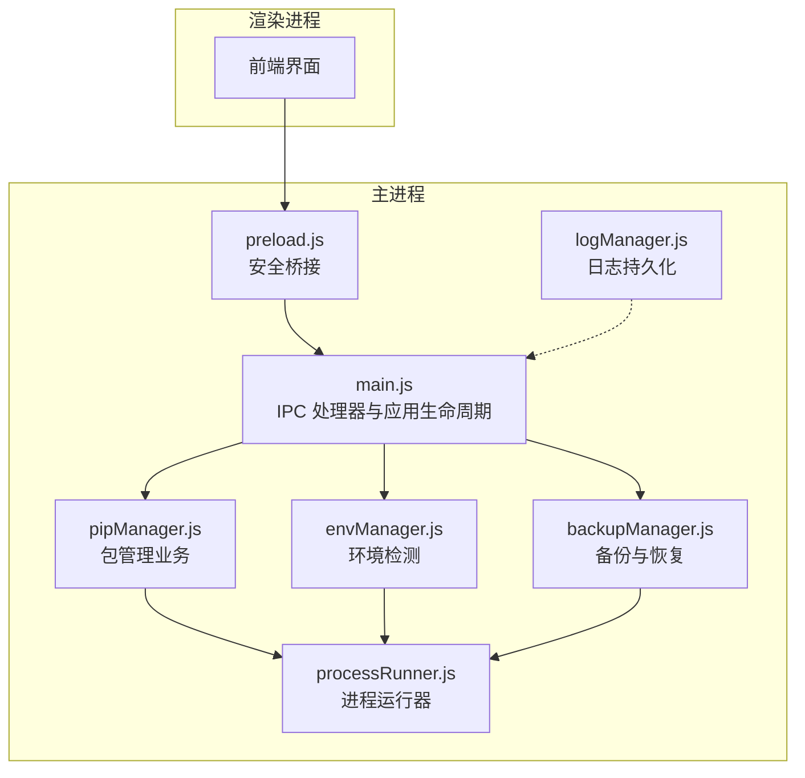
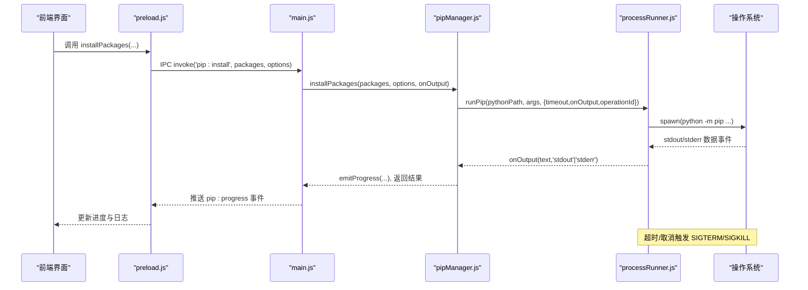
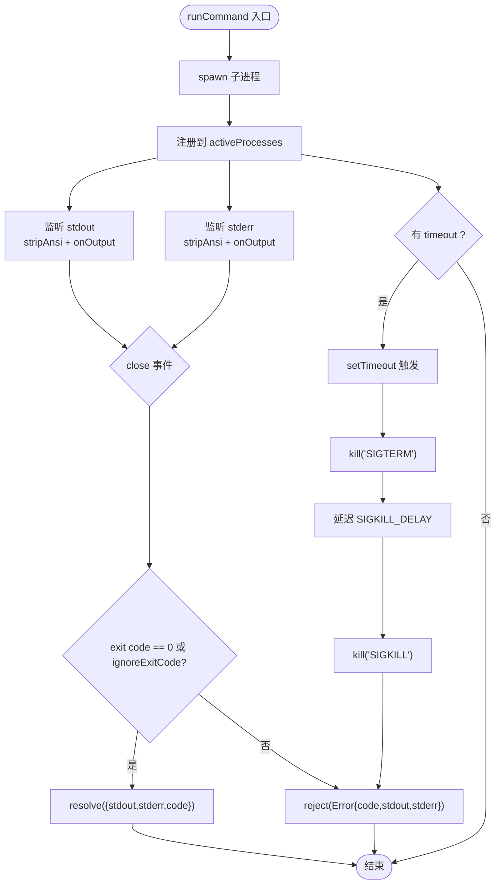
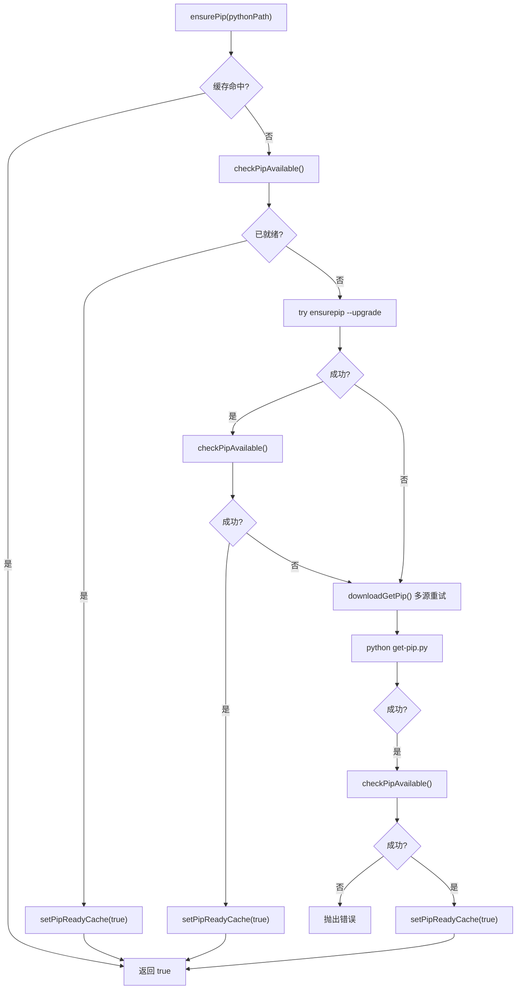
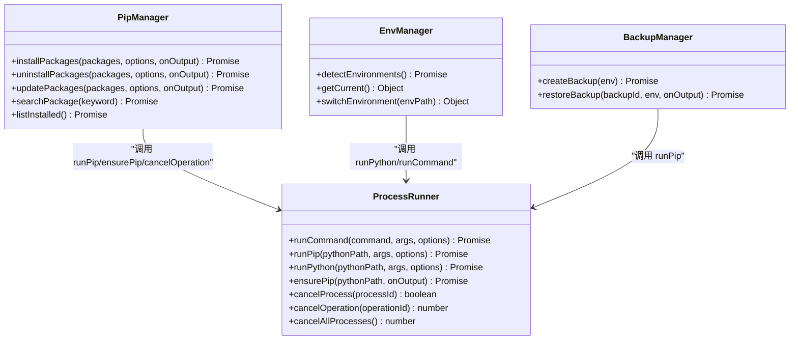
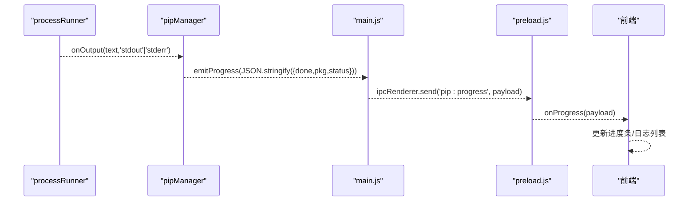
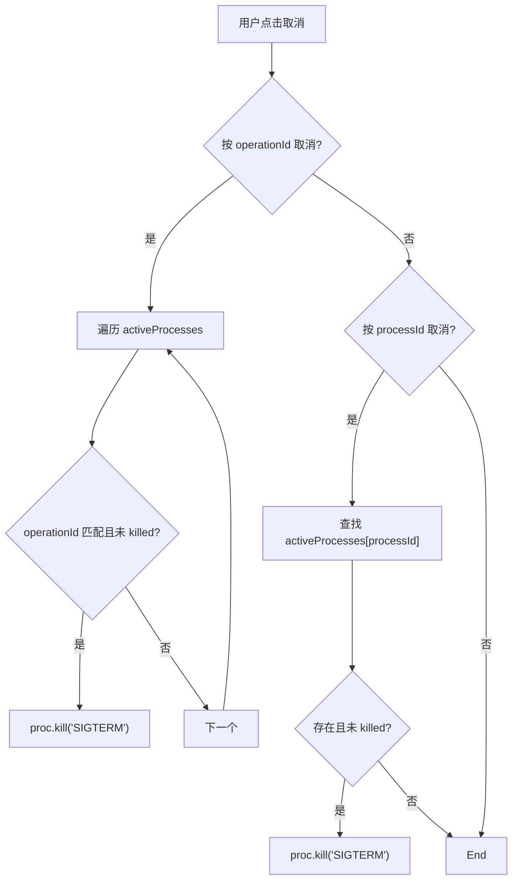
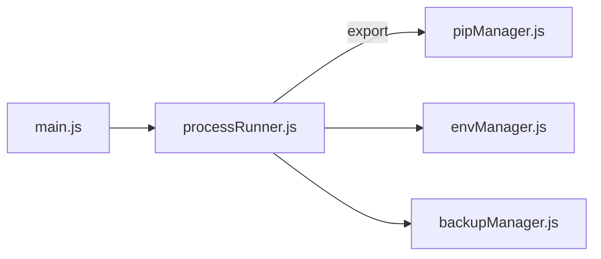

# 进程运行器 (processRunner)

<cite>
**本文引用的文件**   
- [utils/processRunner.js](file://utils/processRunner.js)
- [core/operations/pipManager.js](file://core/operations/pipManager.js)
- [main.js](file://main.js)
- [preload.js](file://preload.js)
- [core/system/envManager.js](file://core/system/envManager.js)
- [core/operations/backupManager.js](file://core/operations/backupManager.js)
- [core/system/logManager.js](file://core/system/logManager.js)
</cite>

## 目录
1. [简介](#简介)
2. [项目结构](#项目结构)
3. [核心组件](#核心组件)
4. [架构总览](#架构总览)
5. [详细组件分析](#详细组件分析)
6. [依赖关系分析](#依赖关系分析)
7. [性能与资源优化](#性能与资源优化)
8. [故障排查指南](#故障排查指南)
9. [结论](#结论)
10. [附录：API 使用示例](#附录api-使用示例)

## 简介
本文件围绕 processRunner 进程运行器，系统性阐述其在 PyLibMaster 中的职责与实现：子进程的创建、监控、终止与资源清理；异步命令执行封装（支持 pip、Python 脚本及其他系统命令）；实时输出流式传输到前端；超时控制与取消操作；进程状态监控与错误处理策略；以及与 pipManager 的集成方式。同时给出进程池管理与资源优化建议，避免过多子进程占用系统资源。

## 项目结构
processRunner 位于 utils 层，为上层业务模块提供统一的进程执行能力。pipManager、envManager、backupManager 等模块通过 require 引用 processRunner 提供的 API，完成包管理、环境检测、备份恢复等操作。Electron 主进程 main.js 在应用退出时调用 cancelAllProcesses 确保所有活跃子进程被安全终止。

图表来源
- [main.js:160-170](file://main.js#L160-L170)
- [preload.js:177-184](file://preload.js#L177-L184)
- [core/operations/pipManager.js:20-30](file://core/operations/pipManager.js#L20-L30)
- [core/system/envManager.js:20-25](file://core/system/envManager.js#L20-L25)
- [core/operations/backupManager.js:20-25](file://core/operations/backupManager.js#L20-L25)
- [utils/processRunner.js:1-20](file://utils/processRunner.js#L1-L20)

章节来源
- [main.js:160-170](file://main.js#L160-L170)
- [preload.js:177-184](file://preload.js#L177-L184)
- [core/operations/pipManager.js:20-30](file://core/operations/pipManager.js#L20-L30)
- [core/system/envManager.js:20-25](file://core/system/envManager.js#L20-L25)
- [core/operations/backupManager.js:20-25](file://core/operations/backupManager.js#L20-L25)
- [utils/processRunner.js:1-20](file://utils/processRunner.js#L1-L20)

## 核心组件
- 子进程执行引擎 runCommand
  - 基于 Node child_process.spawn 创建子进程，统一设置 UTF-8 编码环境变量，隐藏 Windows 控制台窗口。
  - 实时监听 stdout/stderr，自动清理 ANSI 转义序列，并通过 onOutput 回调将文本流式推送给调用方。
  - 支持超时控制：先发送 SIGTERM，延迟后强制 SIGKILL，并拒绝 Promise。
  - 注册活跃进程到 activeProcesses Map，支持按 processId 或 operationId 取消。
  - 统一错误对象构造，包含 code、stdout、stderr 字段，便于上层诊断。

- 便捷封装 runPip / runPython
  - runPip 固定以 python -m pip 形式执行，简化参数拼装。
  - runPython 直接转发参数到 Python 解释器。

- pip 就绪保障 ensurePip
  - 多级安装策略：缓存检查 → 直接检测 → ensurepip → 下载 get-pip.py 安装。
  - 下载失败自动切换备用源，带超时与重定向处理。
  - 安装成功后写入缓存，避免重复检测。

- 进程取消与清理
  - cancelProcess：按进程 ID 发送 SIGTERM。
  - cancelOperation：按 operationId 批量取消关联进程。
  - cancelAllProcesses：应用退出时清理全部活跃进程。

- 辅助功能
  - checkPipAvailable：快速检测 pip 是否可用。
  - clearPipReadyCache：清空 pip 就绪缓存。

章节来源
- [utils/processRunner.js:85-161](file://utils/processRunner.js#L85-L161)
- [utils/processRunner.js:168-206](file://utils/processRunner.js#L168-L206)
- [utils/processRunner.js:213-278](file://utils/processRunner.js#L213-L278)
- [utils/processRunner.js:286-331](file://utils/processRunner.js#L286-L331)
- [utils/processRunner.js:340-353](file://utils/processRunner.js#L340-L353)

## 架构总览
processRunner 作为底层进程执行抽象，向上暴露稳定接口；pipManager 等业务模块组合这些接口，实现包安装、卸载、更新、搜索、备份恢复等功能；Electron 主进程通过 IPC 将前端请求路由到对应模块，并在应用退出时调用 cancelAllProcesses 保证资源释放。

图表来源
- [preload.js:177-184](file://preload.js#L177-L184)
- [main.js:311-341](file://main.js#L311-L341)
- [core/operations/pipManager.js:495-578](file://core/operations/pipManager.js#L495-L578)
- [utils/processRunner.js:85-161](file://utils/processRunner.js#L85-L161)

## 详细组件分析

### 子进程生命周期与实时监控
- 创建阶段
  - 生成唯一 processId，记录 startTime，保存至 activeProcesses。
  - 设置 PYTHONIOENCODING/PYTHONUTF8 环境变量，确保 UTF-8 输出。
  - 可选 shell 模式与自定义 cwd。
- 输出阶段
  - 对 stdout/stderr 数据块进行 stripAnsi 清理，拼接字符串并回调 onOutput。
- 结束阶段
  - close 事件根据 exit code 决定 resolve 或 reject，reject 时附带 code/stdout/stderr。
  - cleanup 清除定时器并从 activeProcesses 删除引用，防止内存泄漏。
- 超时与取消
  - 若配置 timeout，启动定时器；超时先 kill('SIGTERM')，延迟后 kill('SIGKILL')。
  - 支持按 processId 或 operationId 取消，cancelOperation 会遍历 activeProcesses 匹配并发送 SIGTERM。

图表来源
- [utils/processRunner.js:85-161](file://utils/processRunner.js#L85-L161)
- [utils/processRunner.js:168-206](file://utils/processRunner.js#L168-L206)

章节来源
- [utils/processRunner.js:85-161](file://utils/processRunner.js#L85-L161)
- [utils/processRunner.js:168-206](file://utils/processRunner.js#L168-L206)

### pip 就绪保障与自动安装
- 缓存机制：pipReadyCache 以 pythonPath 为键，TTL 5 分钟，避免重复检测。
- 检测流程：checkPipAvailable 执行 python -m pip --version。
- 安装策略优先级：
  1) ensurepip --upgrade
  2) 下载 get-pip.py（多源重试，含重定向与超时）
- 安装完成后再次验证可用性，成功则写入缓存。

图表来源
- [utils/processRunner.js:213-278](file://utils/processRunner.js#L213-L278)
- [utils/processRunner.js:286-331](file://utils/processRunner.js#L286-L331)

章节来源
- [utils/processRunner.js:213-278](file://utils/processRunner.js#L213-L278)
- [utils/processRunner.js:286-331](file://utils/processRunner.js#L286-L331)

### 与 pipManager 的集成
- pipManager 通过 runPip 执行包管理命令，传入 onOutput 回调用于实时进度上报。
- 安装/卸载/更新均支持 operationId，配合 cancelOperation 实现一键取消整个操作链。
- 镜像源重试、并行安装、自动回滚等高级特性建立在 processRunner 的稳定基础之上。

图表来源
- [core/operations/pipManager.js:20-30](file://core/operations/pipManager.js#L20-L30)
- [core/system/envManager.js:20-25](file://core/system/envManager.js#L20-L25)
- [core/operations/backupManager.js:20-25](file://core/operations/backupManager.js#L20-L25)
- [utils/processRunner.js:340-353](file://utils/processRunner.js#L340-L353)

章节来源
- [core/operations/pipManager.js:495-578](file://core/operations/pipManager.js#L495-L578)
- [core/system/envManager.js:48-71](file://core/system/envManager.js#L48-L71)
- [core/operations/backupManager.js:89-113](file://core/operations/backupManager.js#L89-L113)

### 实时输出与前端交互
- processRunner 通过 onOutput(text, type) 回调将 stdout/stderr 文本推送到上层。
- pipManager 将文本包装为结构化进度事件，经 main.js 的 IPC 处理器以 pip:progress 事件推送给 preload.js。
- preload.js 在渲染进程暴露 onProgress(callback)，前端据此更新“已完成/总数”计数与日志面板。

图表来源
- [core/operations/pipManager.js:55-63](file://core/operations/pipManager.js#L55-L63)
- [main.js:311-341](file://main.js#L311-L341)
- [preload.js:177-184](file://preload.js#L177-L184)

章节来源
- [core/operations/pipManager.js:55-63](file://core/operations/pipManager.js#L55-L63)
- [main.js:311-341](file://main.js#L311-L341)
- [preload.js:177-184](file://preload.js#L177-L184)

### 超时控制与取消操作
- 超时控制：runCommand 支持 timeout 毫秒数，触发后先 SIGTERM，再延迟 SIGKILL，并拒绝 Promise。
- 取消操作：
  - cancelProcess(processId)：精准终止单个进程。
  - cancelOperation(operationId)：按操作 ID 批量终止相关进程（如一次安装任务的多步子进程）。
  - cancelAllProcesses()：应用退出时清理全部活跃进程。

图表来源
- [utils/processRunner.js:168-206](file://utils/processRunner.js#L168-L206)

章节来源
- [utils/processRunner.js:168-206](file://utils/processRunner.js#L168-L206)

### 错误处理策略
- 子进程 error 事件：立即清理并 reject。
- close 事件：非零退出码时构建 Error，附加 code/stdout/stderr 字段，便于上层定位问题。
- 网络下载 get-pip.py：多源重试、超时销毁请求、重定向处理。
- 日志记录：logManager 持久化关键操作与异常信息，支持导出与筛选。

章节来源
- [utils/processRunner.js:85-161](file://utils/processRunner.js#L85-L161)
- [utils/processRunner.js:286-331](file://utils/processRunner.js#L286-L331)
- [core/system/logManager.js:112-131](file://core/system/logManager.js#L112-L131)

## 依赖关系分析
- processRunner 被多个模块引用：
  - pipManager：包管理核心逻辑，依赖 runPip、ensurePip、cancelOperation。
  - envManager：环境检测，依赖 runPython、runCommand。
  - backupManager：备份恢复，依赖 runPip。
  - main.js：应用退出时调用 cancelAllProcesses。
- 外部依赖：
  - Node child_process.spawn：子进程创建与事件驱动。
  - strip-ansi：清理终端 ANSI 色彩序列。
  - https/http：下载 get-pip.py。
  - fs/path/os：文件系统与路径操作。

图表来源
- [core/operations/pipManager.js:20-30](file://core/operations/pipManager.js#L20-L30)
- [core/system/envManager.js:20-25](file://core/system/envManager.js#L20-L25)
- [core/operations/backupManager.js:20-25](file://core/operations/backupManager.js#L20-L25)
- [main.js:160-170](file://main.js#L160-L170)

章节来源
- [core/operations/pipManager.js:20-30](file://core/operations/pipManager.js#L20-L30)
- [core/system/envManager.js:20-25](file://core/system/envManager.js#L20-L25)
- [core/operations/backupManager.js:20-25](file://core/operations/backupManager.js#L20-L25)
- [main.js:160-170](file://main.js#L160-L170)

## 性能与资源优化
- 进程池管理建议
  - 当前实现未内置进程池，但可通过并发度限制与队列化调度降低峰值。例如在 pipManager.installPackages 中限制并行线程数（已有配置项 parallelThreads）。
  - 引入轻量级任务队列（如 async.queue），限制同时运行的子进程数量，避免系统资源耗尽。
- 缓存与去重
  - pip 就绪缓存（TTL 5 分钟）、site-packages 路径缓存（TTL 30 秒）减少重复检测与 IO。
  - 已安装包缓存（5 分钟）提升列表查询性能。
- 输出缓冲与清理
  - 实时 stripAnsi 清理，避免前端渲染负担；必要时可合并小片段以降低回调频率。
- 超时与优雅终止
  - 合理设置 timeout，结合 SIGTERM/SIGKILL 两级终止，确保长时间任务可控。
- 日志防抖与容量控制
  - logManager 采用 300ms 防抖写入，最大 2000 条，字段截断保护，避免磁盘压力。

章节来源
- [core/operations/pipManager.js:527-540](file://core/operations/pipManager.js#L527-L540)
- [core/operations/pipManager.js:36-38](file://core/operations/pipManager.js#L36-L38)
- [core/operations/pipManager.js:99-114](file://core/operations/pipManager.js#L99-L114)
- [core/system/logManager.js:19-23](file://core/system/logManager.js#L19-L23)
- [utils/processRunner.js:20-24](file://utils/processRunner.js#L20-L24)

## 故障排查指南
- 常见问题
  - pip 不可用：检查 ensurePip 流程是否成功，查看日志中 ensurepip/get-pip.py 安装输出。
  - 命令超时：增大 timeout 或检查目标命令是否卡死；确认 SIGTERM/SIGKILL 是否生效。
  - 取消无效：确认 operationId 是否正确传递；检查 activeProcesses 中进程是否已被其他逻辑终止。
  - 输出乱码：确认 PYTHONIOENCODING/PYTHONUTF8 环境变量设置；检查 onOutput 是否重复解码。
- 定位手段
  - 查看 logManager 导出的日志，筛选类型与关键词。
  - 在 onOutput 中打印 text 与 type，确认 stdout/stderr 流向。
  - 使用 cancelOperation(operationId) 批量终止，观察是否仍有残留进程。

章节来源
- [core/system/logManager.js:112-131](file://core/system/logManager.js#L112-L131)
- [utils/processRunner.js:85-161](file://utils/processRunner.js#L85-L161)
- [utils/processRunner.js:168-206](file://utils/processRunner.js#L168-L206)

## 结论
processRunner 提供了稳定、可扩展的子进程执行基础设施，覆盖创建、监控、终止、清理、超时与取消等关键环节。通过与 pipManager、envManager、backupManager 的紧密集成，实现了可靠的包管理与环境管理能力。结合缓存、并发控制与日志体系，系统在性能与可维护性上具备良好平衡。建议在后续迭代中引入进程池与任务队列，进一步优化资源占用与吞吐。

## 附录：API 使用示例
以下示例展示如何使用 processRunner 的核心方法。为避免泄露具体代码内容，仅提供调用路径与说明。

- 执行任意系统命令
  - 调用路径：runCommand(command, args, options)
  - 典型选项：timeout、onOutput、shell、ignoreExitCode、operationId
  - 返回值：Promise<{stdout, stderr, code}>
  - 参考路径：[utils/processRunner.js:85-161](file://utils/processRunner.js#L85-L161)

- 执行 pip 命令
  - 调用路径：runPip(pythonPath, args, options)
  - 说明：内部固定以 python -m pip 执行，适合安装/卸载/更新/查询等操作
  - 参考路径：[utils/processRunner.js:340-342](file://utils/processRunner.js#L340-L342)

- 执行 Python 脚本
  - 调用路径：runPython(pythonPath, args, options)
  - 说明：直接调用 Python 解释器，args 为脚本与参数
  - 参考路径：[utils/processRunner.js:351-353](file://utils/processRunner.js#L351-L353)

- 确保 pip 可用
  - 调用路径：ensurePip(pythonPath, onOutput)
  - 说明：多级安装策略，自动检测与安装 pip，支持 onOutput 实时反馈
  - 参考路径：[utils/processRunner.js:233-278](file://utils/processRunner.js#L233-L278)

- 取消操作
  - 单进程取消：cancelProcess(processId)
  - 按操作取消：cancelOperation(operationId)
  - 全部取消：cancelAllProcesses()
  - 参考路径：[utils/processRunner.js:168-206](file://utils/processRunner.js#L168-L206)

- 与 pipManager 集成的典型流程
  - 前端通过 preload.js 暴露的 installPackages 调用，最终进入 pipManager.installPackages，内部多次调用 runPip，并透传 onOutput 与 operationId。
  - 参考路径：
    - [preload.js:59-64](file://preload.js#L59-L64)
    - [main.js:311-341](file://main.js#L311-L341)
    - [core/operations/pipManager.js:495-578](file://core/operations/pipManager.js#L495-L578)

- 实时输出到前端
  - processRunner 通过 onOutput 回调推送文本；pipManager 将其包装为结构化进度事件；main.js 通过 pip:progress 事件推送；preload.js 暴露 onProgress 供前端订阅。
  - 参考路径：
    - [core/operations/pipManager.js:55-63](file://core/operations/pipManager.js#L55-L63)
    - [main.js:311-341](file://main.js#L311-L341)
    - [preload.js:177-184](file://preload.js#L177-L184)