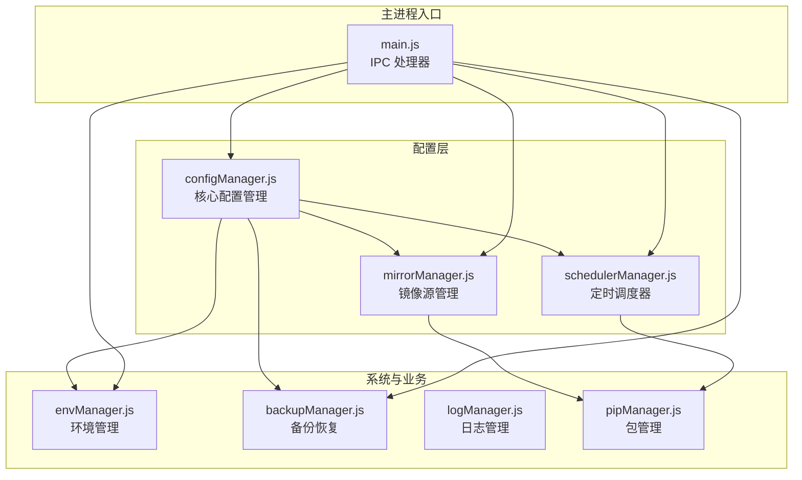
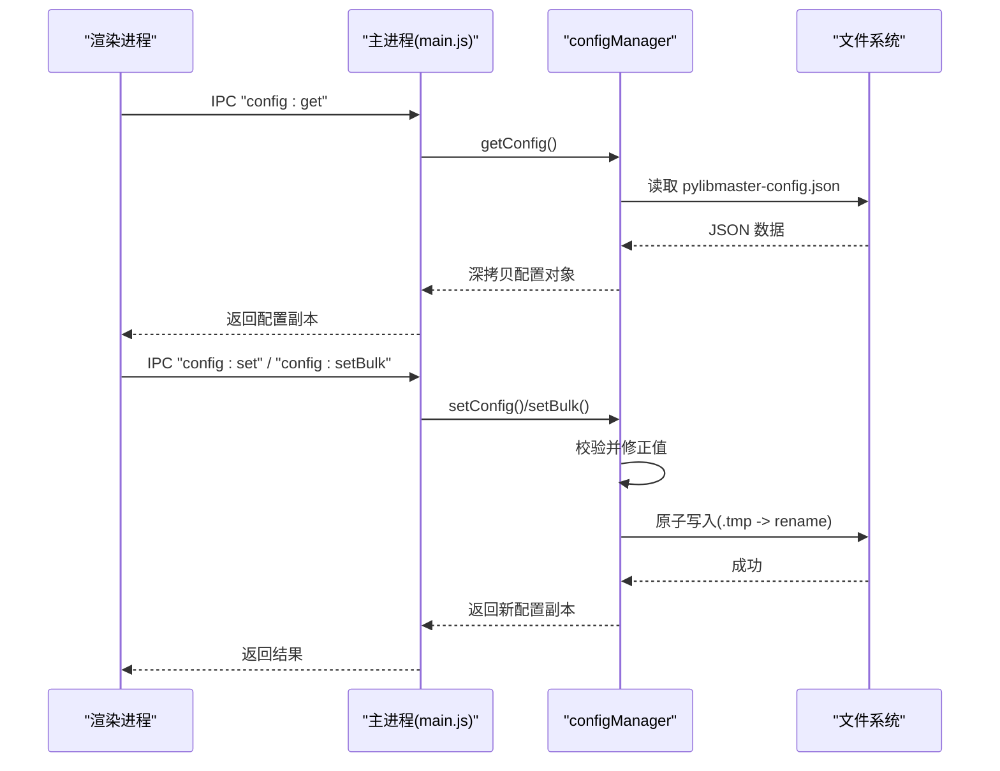
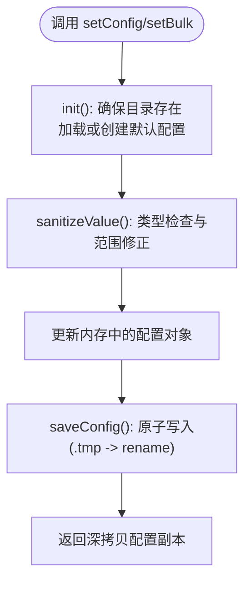
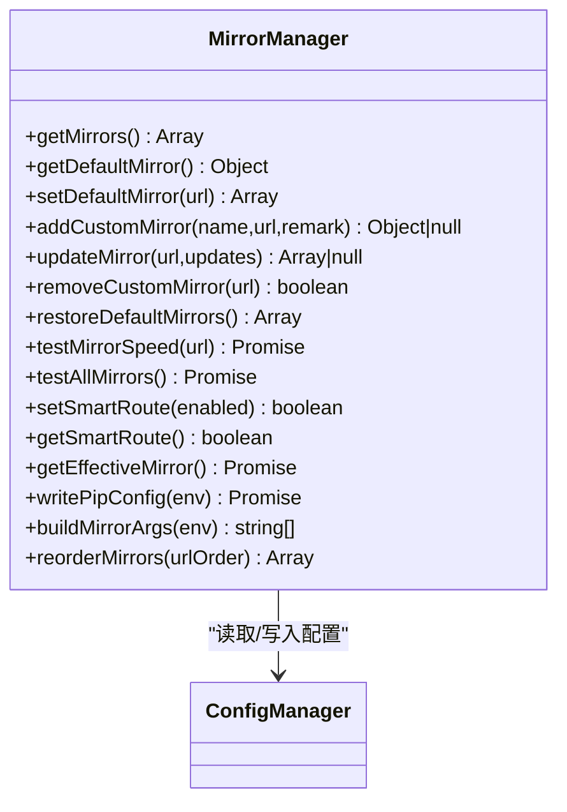
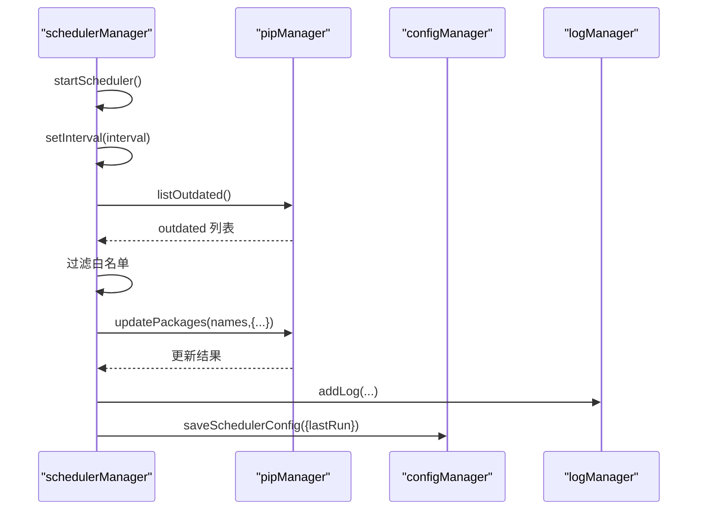
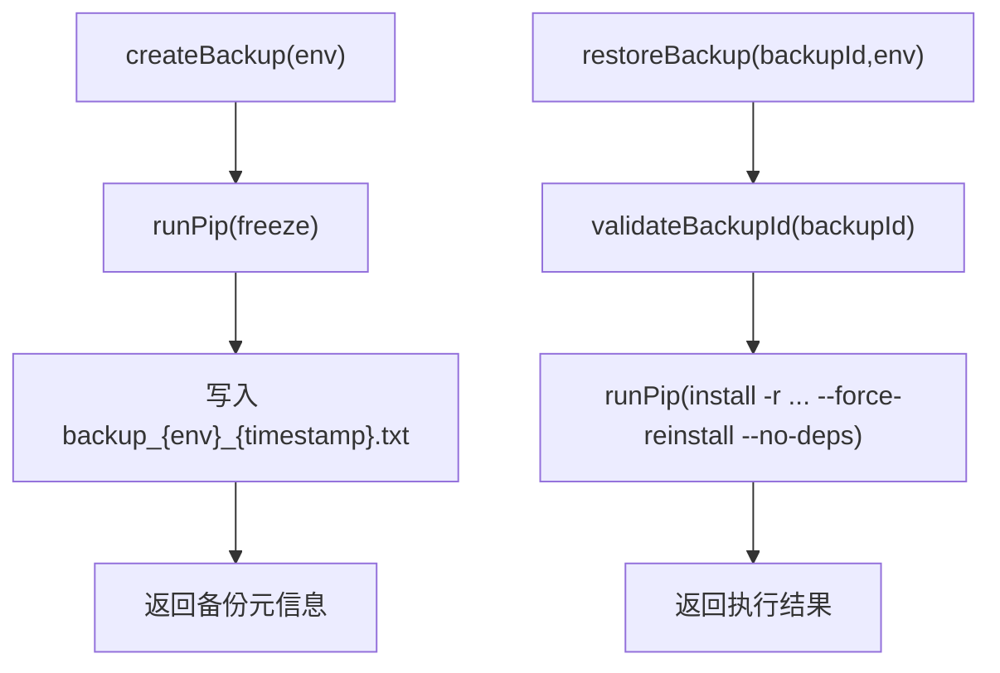
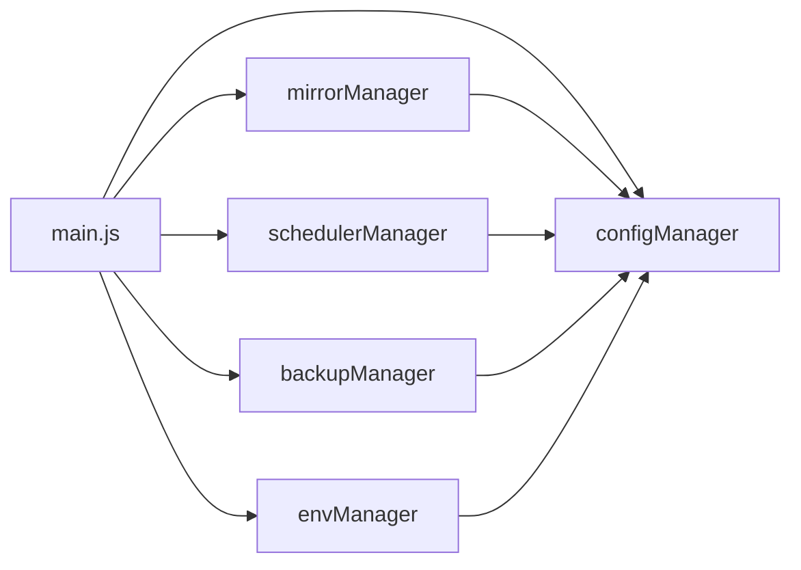

# 配置管理器 (configManager)

<cite>
**本文引用的文件**   
- [core/config/configManager.js](file://core/config/configManager.js)
- [core/config/mirrorManager.js](file://core/config/mirrorManager.js)
- [core/config/schedulerManager.js](file://core/config/schedulerManager.js)
- [core/operations/backupManager.js](file://core/operations/backupManager.js)
- [core/system/envManager.js](file://core/system/envManager.js)
- [main.js](file://main.js)
- [package.json](file://package.json)
</cite>

## 更新摘要
**所做更改**   
- 新增 configManager.js 核心配置管理模块，提供完整的配置持久化、验证和原子写入功能
- 增强 mirrorManager.js 镜像源管理功能，支持智能路由和测速
- 新增 schedulerManager.js 定时自动更新调度器，支持每日/每周任务调度
- 完善 IPC 接口，统一配置访问和管理
- 优化配置存储结构和备份恢复机制

## 目录
1. [简介](#简介)
2. [项目结构](#项目结构)
3. [核心组件](#核心组件)
4. [架构总览](#架构总览)
5. [详细组件分析](#详细组件分析)
6. [依赖关系分析](#依赖关系分析)
7. [性能考量](#性能考量)
8. [故障排查指南](#故障排查指南)
9. [结论](#结论)
10. [附录：API 使用示例与最佳实践](#附录api-使用示例与最佳实践)

## 简介
本文件为 PyLibMaster 应用中的配置管理器（configManager）及其相关模块的权威文档。内容覆盖：
- 配置文件存储结构与格式、路径与命名规范、版本管理策略
- 配置的读取、写入、更新机制，支持增量更新与原子操作
- 配置验证规则（类型、范围、依赖关系）
- 默认配置管理与配置合并策略
- 配置热重载机制（运行时配置更新）
- 与其他模块的配置交互方式（镜像源、线程数、超时等）
- 配置备份与恢复、迁移策略
- 具体 API 使用示例与最佳实践

## 项目结构
配置相关代码主要位于 core/config 目录下，并与系统与环境管理、备份管理等模块协作。主进程通过 IPC 暴露配置接口给渲染进程。

**图表来源** 
- [core/config/configManager.js:1-194](file://core/config/configManager.js#L1-L194)
- [core/config/mirrorManager.js:1-376](file://core/config/mirrorManager.js#L1-L376)
- [core/config/schedulerManager.js:1-197](file://core/config/schedulerManager.js#L1-L197)
- [core/system/envManager.js:1-200](file://core/system/envManager.js#L1-L200)
- [core/operations/backupManager.js:1-196](file://core/operations/backupManager.js#L1-L196)
- [main.js:1-661](file://main.js#L1-L661)

**章节来源**
- [core/config/configManager.js:1-194](file://core/config/configManager.js#L1-L194)
- [main.js:1-661](file://main.js#L1-L661)

## 核心组件
- **configManager**：负责应用配置的持久化、校验、合并、原子写入与缓存；提供 getConfig、setConfig、setBulk、getStoragePath、init 等接口
- **mirrorManager**：管理 PyPI 镜像源（内置与自定义）、智能路由、测速、写入 pip 配置
- **schedulerManager**：定时自动更新调度器，基于配置驱动，持久化调度状态
- **backupManager**：环境包列表备份与恢复，安全 ID 校验，按配置存储路径组织
- **envManager**：Python 环境检测与切换，当前环境持久化到配置
- **main.js**：IPC 处理器桥接渲染进程与核心模块，包含配置读写、镜像源、调度器等接口

**章节来源**
- [core/config/configManager.js:1-194](file://core/config/configManager.js#L1-L194)
- [core/config/mirrorManager.js:1-376](file://core/config/mirrorManager.js#L1-L376)
- [core/config/schedulerManager.js:1-197](file://core/config/schedulerManager.js#L1-L197)
- [core/operations/backupManager.js:1-196](file://core/operations/backupManager.js#L1-L196)
- [core/system/envManager.js:1-200](file://core/system/envManager.js#L1-L200)
- [main.js:1-661](file://main.js#L1-L661)

## 架构总览
配置体系以 configManager 为中心，其他模块按需读取或更新配置。主进程通过 IPC 暴露统一接口，保证跨进程安全访问。

**图表来源** 
- [main.js:427-434](file://main.js#L427-L434)
- [core/config/configManager.js:120-178](file://core/config/configManager.js#L120-L178)

## 详细组件分析

### configManager：配置持久化与校验
- **职责**
  - 管理应用配置的持久化存储（JSON 文件）
  - 提供配置的读取、写入、批量更新接口
  - 配置值范围校验与自动修正
  - 配置文件路径管理（基于 Electron userData 目录）
- **存储位置**
  - Windows: %APPDATA%/PyLibMaster/pylibmaster-config.json
  - macOS: ~/Library/Application Support/PyLibMaster/pylibmaster-config.json
  - Linux: ~/.config/PyLibMaster/pylibmaster-config.json
- **默认配置项**
  - theme、language、storagePath、parallelThreads、retryCount、smartRoute、currentEnv、windowBounds
- **数值范围限制**
  - parallelThreads: 1~16，默认 4
  - retryCount: 0~10，默认 3
- **原子写入**
  - 先写 .tmp 再重命名为目标文件，避免崩溃导致损坏
- **错误处理**
  - 配置文件损坏时重建默认配置
  - 保存失败时尝试记录日志，降级输出到 stderr
- **导出接口**
  - getConfig、setConfig、setBulk、getStoragePath、init

**图表来源** 
- [core/config/configManager.js:39-44](file://core/config/configManager.js#L39-L44)
- [core/config/configManager.js:80-117](file://core/config/configManager.js#L80-L117)
- [core/config/configManager.js:123-138](file://core/config/configManager.js#L123-L138)
- [core/config/configManager.js:157-178](file://core/config/configManager.js#L157-L178)

**章节来源**
- [core/config/configManager.js:1-194](file://core/config/configManager.js#L1-L194)

### mirrorManager：镜像源管理
- **职责**
  - 管理内置与自定义镜像源列表
  - 智能路由（自动选择最快镜像）
  - 测速、排序、写入 pip 配置文件
- **配置项**
  - mirrors: 数组，包含 name、url、remark、isDefault、speed 等字段
  - smartRoute: 布尔开关
- **关键能力**
  - loadMirrors：合并内置与用户配置，确保唯一默认源
  - saveMirrors：仅保存必要字段
  - testAllMirrors：并行测速并持久化 speed
  - getEffectiveMirror：根据 smartRoute 决定生效镜像
  - writePipConfig：写入平台特定的 pip 配置文件
  - buildMirrorArgs：构建 pip 命令行参数
  - reorderMirrors：拖拽排序后持久化优先级

**图表来源** 
- [core/config/mirrorManager.js:60-112](file://core/config/mirrorManager.js#L60-L112)
- [core/config/mirrorManager.js:240-290](file://core/config/mirrorManager.js#L240-L290)
- [core/config/mirrorManager.js:299-333](file://core/config/mirrorManager.js#L299-L333)

**章节来源**
- [core/config/mirrorManager.js:1-376](file://core/config/mirrorManager.js#L1-L376)

### schedulerManager：定时自动更新调度器
- **职责**
  - 管理定时任务（每日/每周），后台静默执行更新
  - 白名单过滤，结果写入日志
  - 调度状态持久化到配置
- **配置项**
  - schedulerEnabled、schedulerFrequency、schedulerWhitelist、schedulerLastRun
- **关键能力**
  - runAutoUpdate：获取可更新列表、过滤白名单、批量更新、记录日志
  - startScheduler/stopScheduler：启动/停止定时器
  - getStatus：返回运行状态与上次执行时间

**图表来源** 
- [core/config/schedulerManager.js:70-138](file://core/config/schedulerManager.js#L70-L138)
- [core/config/schedulerManager.js:145-163](file://core/config/schedulerManager.js#L145-L163)

**章节来源**
- [core/config/schedulerManager.js:1-197](file://core/config/schedulerManager.js#L1-L197)

### backupManager：备份与恢复
- **职责**
  - 基于 pip freeze 生成包列表备份
  - 列出、恢复、删除备份文件
  - 备份 ID 安全校验（防止路径遍历）
- **存储位置**
  - {storagePath}/backups/
- **关键能力**
  - createBackup：执行 pip freeze 并写入文件
  - restoreBackup：从备份文件强制重装指定版本
  - validateBackupId：严格校验文件名格式与安全

**图表来源** 
- [core/operations/backupManager.js:89-113](file://core/operations/backupManager.js#L89-L113)
- [core/operations/backupManager.js:156-170](file://core/operations/backupManager.js#L156-L170)

**章节来源**
- [core/operations/backupManager.js:1-196](file://core/operations/backupManager.js#L1-L196)

### envManager：环境与配置联动
- **职责**
  - 检测系统中 Python 环境，维护当前选中环境
  - 将 currentEnv 持久化到配置
- **与配置的关系**
  - 读取/写入 currentEnv
  - 在切换环境时立即持久化

**章节来源**
- [core/system/envManager.js:1-200](file://core/system/envManager.js#L1-L200)

### main.js：IPC 与配置交互
- **职责**
  - 注册所有 IPC 处理器，连接渲染进程与核心模块
  - 配置相关接口：config:get、config:set、config:setBulk
  - 镜像源、调度器、环境管理等接口
- **窗口与主题同步**
  - 窗口尺寸保存到 windowBounds
  - 主题跟随系统时推送主题变化事件

**章节来源**
- [main.js:427-434](file://main.js#L427-L434)
- [main.js:544-567](file://main.js#L544-L567)

## 依赖关系分析
- configManager 被 mirrorManager、schedulerManager、backupManager、envManager 等多处引用
- main.js 作为 IPC 中枢，协调各模块与渲染进程的通信
- 配置文件的读写由 configManager 统一封装，保证一致性与安全性

**图表来源** 
- [main.js:1-661](file://main.js#L1-L661)
- [core/config/configManager.js:1-194](file://core/config/configManager.js#L1-L194)
- [core/config/mirrorManager.js:1-376](file://core/config/mirrorManager.js#L1-L376)
- [core/config/schedulerManager.js:1-197](file://core/config/schedulerManager.js#L1-L197)
- [core/operations/backupManager.js:1-196](file://core/operations/backupManager.js#L1-L196)
- [core/system/envManager.js:1-200](file://core/system/envManager.js#L1-L200)

**章节来源**
- [main.js:1-661](file://main.js#L1-L661)

## 性能考量
- **原子写入减少磁盘 I/O 风险**，避免崩溃导致配置损坏
- **批量更新（setBulk）只触发一次磁盘写入**，降低 IO 开销
- **镜像源测速采用并行策略**，提升速度测试效率
- **配置读取返回深拷贝**，避免外部修改内部状态带来的额外成本
- **窗口尺寸保存使用防抖（500ms）**，避免拖动时高频写入

## 故障排查指南
- **配置文件损坏**
  - 现象：应用启动时报错或配置异常
  - 处理：configManager 会在捕获异常时重建默认配置并保存
- **保存失败**
  - 现象：无法写入配置文件
  - 处理：尝试通过 logManager 记录失败原因，若未就绪则降级输出到 stderr
- **镜像源无效**
  - 现象：添加或更新镜像源时报错
  - 处理：校验 URL 协议与长度，确保 http/https 且不超过 2048 字符
- **备份 ID 非法**
  - 现象：恢复或删除备份时报错
  - 处理：validateBackupId 会拒绝包含路径遍历或不匹配格式的 ID

**章节来源**
- [core/config/configManager.js:112-138](file://core/config/configManager.js#L112-L138)
- [core/config/mirrorManager.js:43-51](file://core/config/mirrorManager.js#L43-L51)
- [core/operations/backupManager.js:62-78](file://core/operations/backupManager.js#L62-L78)

## 结论
configManager 提供了稳定、安全的配置管理能力，结合镜像源与调度器等模块，形成完整的配置生态。通过原子写入、范围校验、默认合并与 IPC 暴露，保证了跨进程一致性与可靠性。配合备份与恢复机制，可实现配置与环境的快速回滚与迁移。

## 附录：API 使用示例与最佳实践

### 配置文件存储结构与格式
- **文件路径**
  - Windows: %APPDATA%/PyLibMaster/pylibmaster-config.json
  - macOS: ~/Library/Application Support/PyLibMaster/pylibmaster-config.json
  - Linux: ~/.config/PyLibMaster/pylibmaster-config.json
- **命名规范**
  - 固定名称：pylibmaster-config.json
- **版本管理**
  - 当前实现未显式版本号字段；如需版本迁移，可在新增字段时进行兼容处理（例如保留旧字段、渐进替换）

**章节来源**
- [core/config/configManager.js:11-15](file://core/config/configManager.js#L11-L15)
- [core/config/configManager.js:89-117](file://core/config/configManager.js#L89-L117)

### 读取、写入与更新机制
- **读取配置**
  - 使用 IPC "config:get" 调用 configManager.getConfig()，返回深拷贝
- **设置单个配置项**
  - 使用 IPC "config:set" 调用 setConfig(key, value)，自动校验并原子写入
- **批量更新配置**
  - 使用 IPC "config:setBulk" 调用 setBulk(updates)，一次性校验并写入

**章节来源**
- [main.js:427-434](file://main.js#L427-L434)
- [core/config/configManager.js:144-178](file://core/config/configManager.js#L144-L178)

### 配置验证规则
- **类型与范围**
  - parallelThreads：数字，范围 1~16，默认 4
  - retryCount：数字，范围 0~10，默认 3
- **依赖关系**
  - storagePath：用于日志与备份存储，不存在时自动创建
  - currentEnv：切换环境后立即持久化
  - smartRoute：影响镜像源选择逻辑

**章节来源**
- [core/config/configManager.js:26-29](file://core/config/configManager.js#L26-L29)
- [core/config/configManager.js:89-99](file://core/config/configManager.js#L89-L99)
- [core/system/envManager.js:165-168](file://core/system/envManager.js#L165-L168)

### 默认配置管理与合并策略
- **默认配置项包括** theme、language、storagePath、parallelThreads、retryCount、smartRoute、currentEnv、windowBounds
- **合并策略**：读取已保存配置后与默认配置合并，缺失字段使用默认值

**章节来源**
- [core/config/configManager.js:89-117](file://core/config/configManager.js#L89-L117)

### 配置热重载机制
- **运行时更新**
  - 通过 IPC 调用 setConfig/setBulk 即时更新内存与磁盘
  - 窗口尺寸与主题变化实时保存与广播
- **注意事项**
  - 配置变更不会自动触发全局事件广播，需在各模块内按需重新读取最新配置

**章节来源**
- [main.js:90-101](file://main.js#L90-L101)
- [main.js:201-208](file://main.js#L201-L208)
- [core/config/configManager.js:157-178](file://core/config/configManager.js#L157-L178)

### 与其他模块的配置交互
- **镜像源配置**
  - mirrorManager 读取/写入 mirrors、smartRoute，并写入 pip 配置文件
- **线程数与重试**
  - configManager 的 parallelThreads、retryCount 控制安装/更新行为
- **超时配置**
  - mirrorManager.writePipConfig 写入 timeout=60（秒）

**章节来源**
- [core/config/mirrorManager.js:97-107](file://core/config/mirrorManager.js#L97-107)
- [core/config/mirrorManager.js:299-322](file://core/config/mirrorManager.js#L299-L322)
- [core/config/configManager.js:26-29](file://core/config/configManager.js#L26-L29)

### 配置备份与恢复
- **备份**
  - 使用 backupManager.createBackup(env) 生成包列表备份
  - 备份文件存储在 {storagePath}/backups/
- **恢复**
  - 使用 backupManager.restoreBackup(backupId, env) 强制重装指定版本
- **迁移策略**
  - 当前未实现配置版本迁移；建议在新增字段时保持向后兼容，必要时在应用升级时进行迁移脚本处理

**章节来源**
- [core/operations/backupManager.js:89-113](file://core/operations/backupManager.js#L89-L113)
- [core/operations/backupManager.js:156-170](file://core/operations/backupManager.js#L156-L170)

### API 使用示例（IPC 调用）
- **获取完整配置**
  - IPC: "config:get"
  - 返回：配置对象的深拷贝
- **设置单个配置项**
  - IPC: "config:set"
  - 参数：key, value
  - 返回：更新后的配置副本
- **批量更新配置**
  - IPC: "config:setBulk"
  - 参数：updates（键值对对象）
  - 返回：更新后的配置副本

**章节来源**
- [main.js:427-434](file://main.js#L427-L434)

### 最佳实践
- **优先使用 setBulk 进行多项配置更新**，减少磁盘写入次数
- **对数值型配置进行合理范围约束**，避免非法值导致异常
- **在镜像源管理中启用智能路由**以提升下载速度
- **定期创建备份**，便于环境快速恢复
- **谨慎修改 storagePath**，确保路径存在且有写入权限