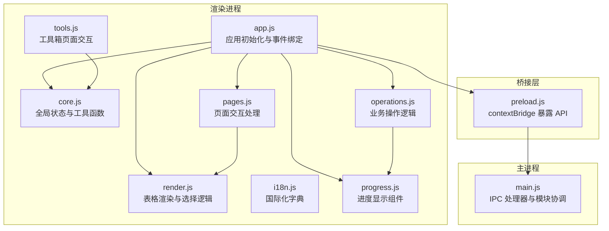
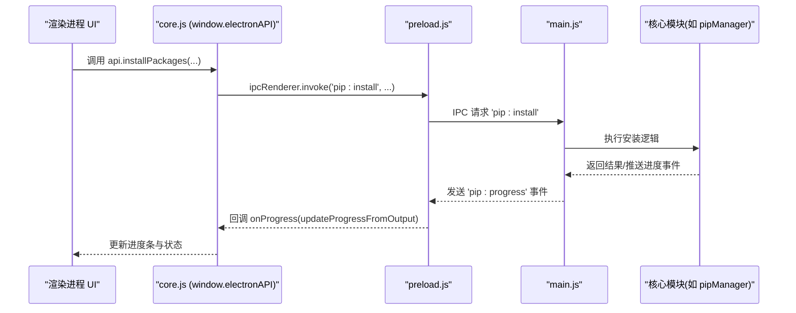
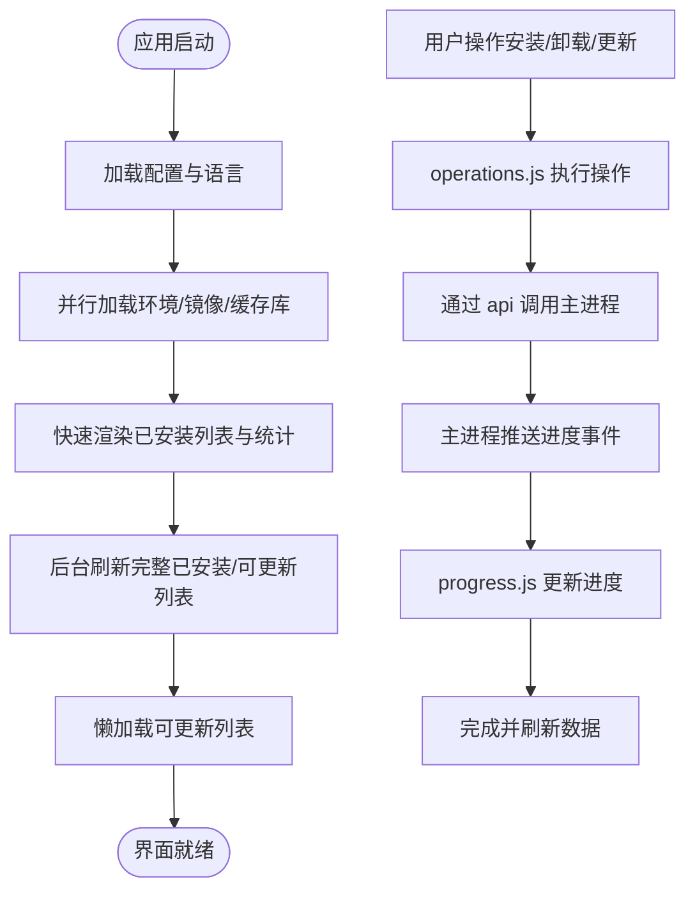

# JavaScript 模块

<cite>
**本文引用的文件**   
- [app.js](file://renderer/js/app.js)
- [core.js](file://renderer/js/core.js)
- [render.js](file://renderer/js/render.js)
- [operations.js](file://renderer/js/operations.js)
- [pages.js](file://renderer/js/pages.js)
- [i18n.js](file://renderer/js/i18n.js)
- [tools.js](file://renderer/js/tools.js)
- [progress.js](file://renderer/js/progress.js)
- [preload.js](file://preload.js)
- [main.js](file://main.js)
- [package.json](file://package.json)
</cite>

## 更新摘要
**已完成的变更**   
- 完成了渲染进程 JavaScript 的完全模块化重构
- 将单一文件拆分为 8 个独立的功能模块：app.js、core.js、operations.js、pages.js、render.js、progress.js、tools.js、i18n.js
- 每个模块都有明确的职责分工和清晰的依赖关系
- 增强了 IPC 通信封装和错误处理机制
- 优化了性能管理和内存使用

## 目录
1. [简介](#简介)
2. [项目结构](#项目结构)
3. [核心组件](#核心组件)
4. [架构总览](#架构总览)
5. [详细组件分析](#详细组件分析)
6. [依赖关系与数据流](#依赖关系与数据流)
7. [性能考量](#性能考量)
8. [故障排查指南](#故障排查指南)
9. [结论](#结论)
10. [附录：扩展与自定义开发指南](#附录扩展与自定义开发指南)

## 简介
本文件为 PyLibMaster 的渲染进程 JavaScript 模块系统文档，聚焦以下目标：
- 详细说明各模块职责、实现要点与交互方式
- 解释模块间依赖关系、数据流向与事件通信机制（含 IPC）
- 总结错误处理策略与性能优化技巧
- 提供模块扩展指南与自定义功能开发说明

PyLibMaster 基于 Electron，渲染进程通过 preload 暴露安全 API，调用主进程能力完成 Python 环境管理、包安装/卸载/更新、镜像源配置、日志与配置持久化等。

## 项目结构
渲染进程位于 renderer/js 下，按职责划分多个模块；preload.js 作为桥接层统一暴露 IPC 方法；main.js 负责窗口生命周期与 IPC 处理器注册。

**图表来源**
- [app.js:1-210](file://renderer/js/app.js#L1-L210)
- [core.js:1-93](file://renderer/js/core.js#L1-L93)
- [render.js:1-445](file://renderer/js/render.js#L1-L445)
- [operations.js:1-536](file://renderer/js/operations.js#L1-L536)
- [pages.js:1-800](file://renderer/js/pages.js#L1-L800)
- [i18n.js:1-373](file://renderer/js/i18n.js#L1-L373)
- [tools.js:1-795](file://renderer/js/tools.js#L1-L795)
- [progress.js:1-141](file://renderer/js/progress.js#L1-L141)
- [preload.js:1-221](file://preload.js#L1-L221)
- [main.js:1-661](file://main.js#L1-L661)

**章节来源**
- [package.json:1-79](file://package.json#L1-L79)

## 核心组件
- **app.js**：渲染进程入口，负责侧边栏导航、设置页主题/语言切换、实时筛选绑定、全局事件监听（进度、自动更新、调度器）、快捷键与启动初始化流程。
- **core.js**：全局状态与工具函数，定义 api 与 i18n 引用、全局变量（已安装包、可更新包、镜像、环境、日志、选中集合等），以及 HTML 转义、Toast、动画、关闭弹窗等通用方法。
- **render.js**：表格渲染与选择逻辑，覆盖卸载页、更新页、查询页、镜像源列表、环境列表、日志列表、统计卡片与状态栏更新。
- **operations.js**：三大核心操作（安装/卸载/更新）的执行逻辑、取消支持、拖拽安装区、数据刷新函数（已安装/可更新/日志/环境/镜像）。
- **pages.js**：镜像源操作、环境选择、虚拟环境创建/删除/使用、日志导出、设置加载与应用、自动更新事件绑定、包详情面板、环境对比、定时调度器、版本历史等。
- **i18n.js**：中英文文案字典，注册到 window.I18N，供 t(key) 翻译与 applyLanguage() 动态替换。
- **tools.js**：工具箱页面交互，包括依赖图谱（Canvas 力导向图与树形图）、磁盘空间分析、环境对比、离线下载、操作撤销、系统集成（右键菜单开关）、环境诊断等。
- **progress.js**：进度条 UI 管理，解析后端结构化进度事件，更新百分比、计数与状态，并在完成后延迟隐藏。

**章节来源**
- [app.js:1-210](file://renderer/js/app.js#L1-L210)
- [core.js:1-93](file://renderer/js/core.js#L1-L93)
- [render.js:1-445](file://renderer/js/render.js#L1-L445)
- [operations.js:1-536](file://renderer/js/operations.js#L1-L536)
- [pages.js:1-800](file://renderer/js/pages.js#L1-L800)
- [i18n.js:1-373](file://renderer/js/i18n.js#L1-L373)
- [tools.js:1-795](file://renderer/js/tools.js#L1-L795)
- [progress.js:1-141](file://renderer/js/progress.js#L1-L141)

## 架构总览
渲染进程通过 preload.js 暴露 electronAPI，所有对主进程的调用均经 contextBridge 转发，确保渲染进程无法直接访问 Node.js API。主进程 main.js 注册 IPC 处理器，协调核心模块（pipManager、mirrorManager、envManager、backupManager、logManager、configManager、updater、venvManager、schedulerManager、templateManager、auditManager、undoManager、explorerManager）。

**图表来源**
- [preload.js:177-184](file://preload.js#L177-L184)
- [main.js:332-336](file://main.js#L332-L336)
- [operations.js:336-370](file://renderer/js/operations.js#L336-L370)
- [progress.js:101-141](file://renderer/js/progress.js#L101-L141)

## 详细组件分析

### app.js：应用初始化与事件绑定
- 侧边栏导航切换页面，并针对"更新库"页面加载调度器状态。
- 安装页版本模式切换控制输入框显隐。
- 设置页主题/语言切换，保存配置并即时应用。
- 实时筛选绑定（卸载搜索、查询搜索/筛选/排序、日志筛选）。
- 全局事件绑定：进度事件、自动更新事件、主题变化、调度器执行结果。
- 快捷键系统：Ctrl+F 聚焦搜索、Ctrl+1~9 切换页面、Esc 关闭弹窗。
- 启动初始化：分阶段并行加载（环境、镜像、缓存库），快速响应后后台刷新完整数据，懒加载可更新列表，低优先级加载日志与应用版本，渲染环境对比选项与工具箱。

**章节来源**
- [app.js:16-27](file://renderer/js/app.js#L16-L27)
- [app.js:31-62](file://renderer/js/app.js#L31-L62)
- [app.js:64-79](file://renderer/js/app.js#L64-L79)
- [app.js:80-102](file://renderer/js/app.js#L80-L102)
- [app.js:104-126](file://renderer/js/app.js#L104-L126)
- [app.js:128-210](file://renderer/js/app.js#L128-L210)

### core.js：全局状态管理与工具函数
- 全局引用：api（window.electronAPI）、i18n（window.I18N）。
- 全局状态：当前语言、已安装包、可更新包、镜像源、Python 环境、当前环境索引、日志数据、今日安装计数、待卸载信息、编辑中的镜像索引、应用配置缓存、进度相关变量、当前操作 ID、勾选集合等。
- 工具函数：HTML 转义防 XSS、Toast 提示、生成唯一操作 ID、数值动画、关闭模态对话框。

**章节来源**
- [core.js:11-36](file://renderer/js/core.js#L11-L36)
- [core.js:37-93](file://renderer/js/core.js#L37-L93)

### render.js：表格渲染和数据展示
- 卸载页：单选/全选、选择信息更新、渲染表格（名称、版本、安装时间、大小、状态、操作按钮）。
- 更新页：全选/单选、搜索过滤、渲染表格（当前版本、最新版本、发布日期、更新按钮）。
- 查询页：关键词搜索、状态筛选（所有/已安装/有更新）、排序（时间/名称/大小），渲染表格。
- 镜像源页：显示/编辑模式、测速结果与默认标记、拖拽排序（重排本地数组并持久化顺序）。
- 环境页：渲染 Python 环境列表与虚拟环境列表，基础 Python 下拉选项填充。
- 日志页：类型筛选与关键词搜索，渲染条目（动作、时间、成功/失败标签）。
- 统计与状态栏：数字动画更新统计卡片，底部状态栏显示已安装数、可更新数、Python 版本与环境名。

**章节来源**
- [render.js:16-78](file://renderer/js/render.js#L16-L78)
- [render.js:82-157](file://renderer/js/render.js#L82-L157)
- [render.js:159-205](file://renderer/js/render.js#L159-L205)
- [render.js:207-318](file://renderer/js/render.js#L207-L318)
- [render.js:320-376](file://renderer/js/render.js#L320-L376)
- [render.js:378-411](file://renderer/js/render.js#L378-L411)
- [render.js:413-445](file://renderer/js/render.js#L413-L445)

### operations.js：业务操作逻辑
- 取消操作：通过 operationId 向主进程发送取消请求。
- 卸载操作：单个/批量卸载，支持备份确认与回滚，完成后刷新数据与通知。
- 更新操作：单包/全部更新，读取选项（并行/重试/回滚），显示进度与结果统计。
- 检查更新：从 PyPI 拉取可更新列表，刷新界面。
- 安装操作：支持从搜索框输入（多包名、粘贴 pip install 命令或文件路径）、拖拽 .txt/.whl 文件安装，读取选项（版本模式/并行/重试/回滚），显示进度与结果统计。
- 数据刷新：refreshInstalled、refreshOutdated、refreshLogs、refreshEnvs、refreshMirrors、refreshAll、refreshCurrentPage。

**章节来源**
- [operations.js:15-31](file://renderer/js/operations.js#L15-L31)
- [operations.js:33-113](file://renderer/js/operations.js#L33-L113)
- [operations.js:115-236](file://renderer/js/operations.js#L115-L236)
- [operations.js:238-397](file://renderer/js/operations.js#L238-L397)
- [operations.js:399-536](file://renderer/js/operations.js#L399-L536)

### pages.js：页面交互处理
- 镜像源操作：设置默认、删除、编辑、添加、测速、智能路由、恢复默认。
- 环境操作：切换环境、修复 pip。
- 虚拟环境：创建、使用、删除、刷新列表。
- 日志操作：添加、清空、导出 CSV/Markdown。
- 语言与主题：applyLanguage 遍历 data-i18n 属性并重新渲染各页面。
- 设置操作：浏览存储路径、加载配置应用到 UI（语言、主题、线程数、重试次数、新增开关）。
- 自动更新：检查更新、安装更新、绑定事件（checking/available/not-available/progress/downloaded/error）。
- 包详情面板：显示包信息、依赖与被依赖列表、依赖树。
- 导出/导入环境：requirements.txt 导出与导入。
- 环境对比：选择两个环境或文件进行差异对比。
- 定时调度器：加载状态、切换开关、修改频率、白名单维护、立即执行。

**章节来源**
- [pages.js:15-161](file://renderer/js/pages.js#L15-L161)
- [pages.js:163-218](file://renderer/js/pages.js#L163-L218)
- [pages.js:220-318](file://renderer/js/pages.js#L220-L318)
- [pages.js:320-349](file://renderer/js/pages.js#L320-L349)
- [pages.js:351-422](file://renderer/js/pages.js#L351-L422)
- [pages.js:424-522](file://renderer/js/pages.js#L424-L522)
- [pages.js:524-602](file://renderer/js/pages.js#L524-L602)
- [pages.js:604-694](file://renderer/js/pages.js#L604-L694)
- [pages.js:696-800](file://renderer/js/pages.js#L696-L800)

### i18n.js：国际化支持
- 提供 zh/en 两套文案字典，键名采用"模块.具体文案"格式。
- 通过 window.I18N 暴露，供 t(key) 与 applyLanguage() 使用。
- 覆盖导航、按钮、标签、空状态、设置项、统计、调度器、模板、审计、PyPI 浏览、工具箱、依赖图谱、磁盘分析、环境对比、离线下载、撤销、版本历史、系统集成等。

**章节来源**
- [i18n.js:1-373](file://renderer/js/i18n.js#L1-L373)

### tools.js：工具箱页面交互
- Tab 切换：依赖图谱、环境诊断、安全审计、磁盘空间分析、环境对比、离线下载。
- 依赖图谱：单包树形图与全局力导向图，Canvas 高清渲染，交互（缩放、平移、拖拽节点、双击重置、悬停高亮）。
- 磁盘空间分析：Top N 条形图，显示 site-packages 路径与总计占用。
- 环境对比：支持文件或环境对比，展示仅 A/B 存在与版本变更。
- 离线下载：选择目标目录、平台、是否包含依赖，显示进度与结果。
- 操作撤销：刷新可用状态，执行撤销并刷新数据。
- 系统集成：Windows 资源管理器右键菜单启用/禁用。
- 版本历史：在包详情中加载发布历史与 Changelog 链接。
- 环境诊断：冲突检测与健康检查，评分与问题列表。

**章节来源**
- [tools.js:14-103](file://renderer/js/tools.js#L14-L103)
- [tools.js:111-210](file://renderer/js/tools.js#L111-L210)
- [tools.js:212-386](file://renderer/js/tools.js#L212-L386)
- [tools.js:388-460](file://renderer/js/tools.js#L388-L460)
- [tools.js:462-506](file://renderer/js/tools.js#L462-L506)
- [tools.js:508-564](file://renderer/js/tools.js#L508-L564)
- [tools.js:566-605](file://renderer/js/tools.js#L566-L605)
- [tools.js:607-636](file://renderer/js/tools.js#L607-L636)
- [tools.js:638-663](file://renderer/js/tools.js#L638-L663)
- [tools.js:665-689](file://renderer/js/tools.js#L665-L689)
- [tools.js:695-787](file://renderer/js/tools.js#L695-L787)
- [tools.js:789-795](file://renderer/js/tools.js#L789-L795)

### progress.js：进度显示组件
- resetProgress：新操作开始时重置进度条、清除隐藏定时器。
- finishProgress：设置最终状态（成功/失败），刷新日志，延迟隐藏进度卡片。
- setProgressUI：更新填充宽度、百分比、计数。
- updateProgressFromOutput：解析结构化进度事件（[PROGRESS] JSON），兜底从 pip 输出推断完成状态，提取当前包名更新标签。

**章节来源**
- [progress.js:14-74](file://renderer/js/progress.js#L14-L74)
- [progress.js:76-88](file://renderer/js/progress.js#L76-L88)
- [progress.js:90-141](file://renderer/js/progress.js#L90-L141)

## 依赖关系与数据流
- **依赖关系**
  - app.js 依赖 core.js、render.js、progress.js、operations.js、pages.js、i18n.js。
  - operations.js 依赖 core.js（全局状态与工具）、progress.js（进度 UI）。
  - pages.js 依赖 core.js、render.js、operations.js（刷新函数）。
  - tools.js 依赖 core.js（api、t、showToast）。
  - render.js 依赖 core.js（全局状态与工具）。
  - i18n.js 被 core.js 引用，提供翻译能力。
  - 所有模块通过 core.js 中的 api（window.electronAPI）与主进程通信。
- **数据流**
  - 启动阶段：app.js 并行加载环境与镜像、缓存库，快速渲染；后台刷新完整已安装与可更新列表，懒加载更新列表。
  - 用户操作：operations.js 发起安装/卸载/更新，通过 api 调用主进程；主进程执行并推送进度事件；progress.js 更新 UI。
  - 页面交互：pages.js 处理镜像源、环境、日志、设置、自动更新、包详情、环境对比、调度器等；render.js 根据全局状态渲染表格与列表。
  - 国际化：i18n.js 提供文案，core.js 的 t(key) 与 pages.js 的 applyLanguage() 动态替换 DOM 文本。
  - 工具箱：tools.js 通过 api 获取依赖图谱、磁盘占用、对比结果等，渲染 Canvas 图表与列表。

**图表来源**
- [app.js:128-210](file://renderer/js/app.js#L128-L210)
- [operations.js:336-370](file://renderer/js/operations.js#L336-L370)
- [progress.js:101-141](file://renderer/js/progress.js#L101-L141)

## 性能考量
- **启动性能**
  - 并行加载：Promise.allSettled 同时加载环境、镜像、缓存库，提升首屏速度。
  - 懒加载：可更新列表后台异步刷新，不阻塞 UI。
  - 低优先级任务：日志与应用版本加载放在最后，避免影响关键路径。
- **渲染性能**
  - 表格渲染按需过滤与排序，减少不必要 DOM 操作。
  - 统计数字动画仅在值变化时触发，避免频繁重绘。
  - Canvas 图谱限制节点数量（最大 80），降低力导向计算开销。
- **事件与状态**
  - 进度事件去重与清理监听器，避免重复绑定。
  - 进度卡片隐藏延迟，避免误隐藏新操作的进度。
- **I/O 与网络**
  - 镜像源测速与智能路由优化下载速度。
  - 并行安装/更新线程数可调，平衡 CPU 与网络带宽。

**章节来源**
- [app.js:128-210](file://renderer/js/app.js#L128-L210)
- [render.js:167-205](file://renderer/js/render.js#L167-L205)
- [tools.js:212-286](file://renderer/js/tools.js#L212-L286)
- [progress.js:20-35](file://renderer/js/progress.js#L20-L35)

## 故障排查指南
- **常见问题定位**
  - 进度无更新：检查 onProgress 是否正确绑定，确认主进程推送事件通道（pip:progress）。
  - 语言未切换：确认 applyLanguage 是否被调用，data-i18n 属性是否存在。
  - 镜像源不可用：运行全部测速，检查 URL 格式与网络连通性。
  - 环境切换失败：确认当前环境路径有效，刷新环境列表并重试。
  - 自动更新失败：查看 onUpdaterError 回调消息，检查网络连接与权限。
- **错误处理策略**
  - 所有异步操作使用 try/catch，捕获异常并通过 showToast 反馈。
  - 进度完成后的日志刷新与状态栏更新，保证结果可见。
  - 操作取消通过 operationId 传递，主进程终止关联子进程。
- **调试建议**
  - 打开控制台查看 console.error 输出。
  - 使用日志页面筛选与搜索，定位操作失败原因。
  - 检查配置项（线程数、重试次数、存储路径）是否符合预期。

**章节来源**
- [operations.js:104-113](file://renderer/js/operations.js#L104-L113)
- [operations.js:155-163](file://renderer/js/operations.js#L155-L163)
- [operations.js:285-293](file://renderer/js/operations.js#L285-L293)
- [pages.js:416-422](file://renderer/js/pages.js#L416-L422)
- [pages.js:516-522](file://renderer/js/pages.js#L516-L522)

## 结论
PyLibMaster 的渲染进程模块设计清晰、职责明确，通过 core.js 集中管理全局状态与工具，app.js 协调事件与初始化，render.js 专注数据展示，operations.js 执行业务逻辑，pages.js 处理页面交互，i18n.js 提供国际化，tools.js 扩展高级功能，progress.js 统一进度 UI。模块间通过 preload.js 暴露的安全 API 与主进程通信，形成稳定可靠的数据流与事件通信机制。整体架构兼顾性能与用户体验，具备良好的可扩展性与可维护性。

## 附录：扩展与自定义开发指南
- **新增页面或功能**
  - 在 pages.js 中添加交互逻辑，必要时在 render.js 增加渲染函数。
  - 在 i18n.js 补充对应文案键，确保 applyLanguage 能正确替换。
  - 如需与主进程通信，在 preload.js 暴露新的 API，并在 main.js 注册 IPC 处理器。
- **扩展工具箱**
  - 在 tools.js 新增 Tab 面板与渲染逻辑，复用 Canvas 绘图与数据处理模式。
  - 通过 api 调用主进程能力，获取数据并渲染图表或列表。
- **自定义进度与事件**
  - 复用 progress.js 的 resetProgress、finishProgress、setProgressUI。
  - 在主进程推送结构化进度事件（[PROGRESS] JSON），便于统一解析。
- **国际化最佳实践**
  - 所有用户可见文案使用 t(key)，避免硬编码字符串。
  - 新增键时同步补充 zh/en 翻译。
- **性能优化建议**
  - 大数据量渲染时使用分页或虚拟滚动（如需）。
  - 合理设置并行线程数与重试次数，避免过载。
  - 使用 Promise.allSettled 并行加载非关键数据，提升首屏速度。
- **安全与稳定性**
  - 所有用户输入通过 escapeHtml 转义，防止 XSS。
  - 异步操作统一 try/catch，错误信息通过 Toast 反馈。
  - 操作取消通过 operationId 精准终止，避免资源泄漏。

**章节来源**
- [i18n.js:1-373](file://renderer/js/i18n.js#L1-L373)
- [tools.js:789-795](file://renderer/js/tools.js#L789-L795)
- [progress.js:14-74](file://renderer/js/progress.js#L14-L74)
- [core.js:37-93](file://renderer/js/core.js#L37-L93)
- [preload.js:1-221](file://preload.js#L1-L221)
- [main.js:1-661](file://main.js#L1-L661)