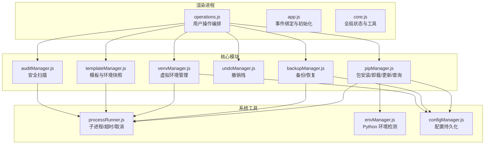
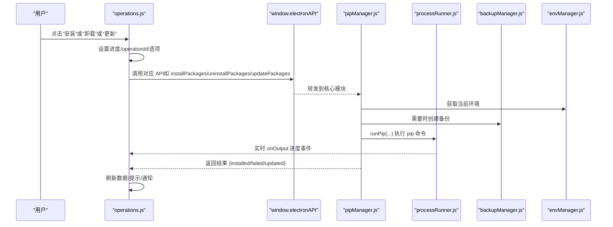
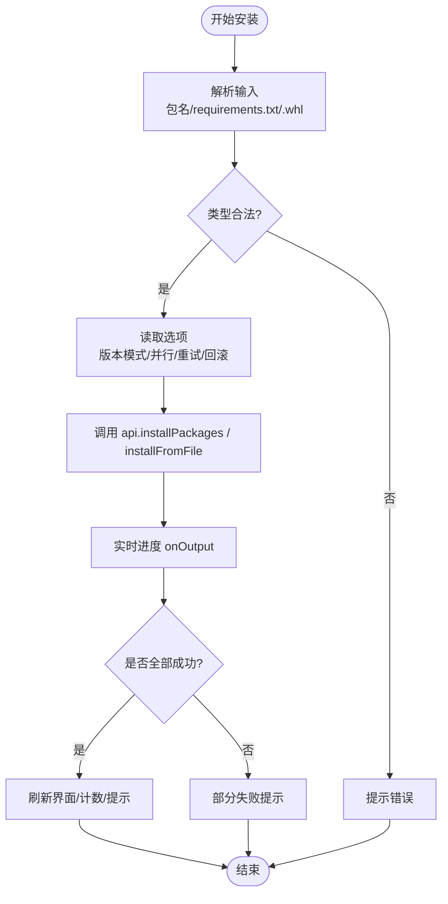
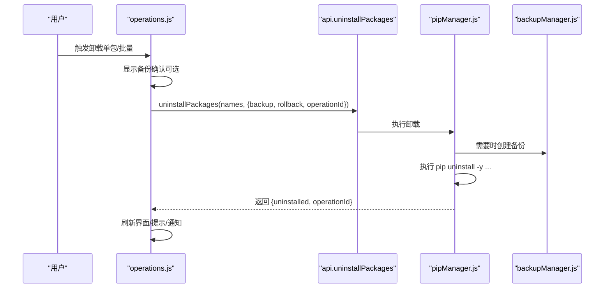
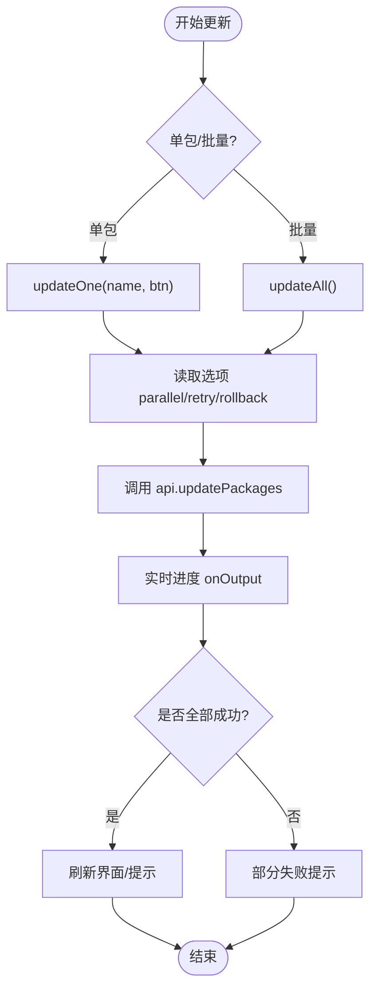
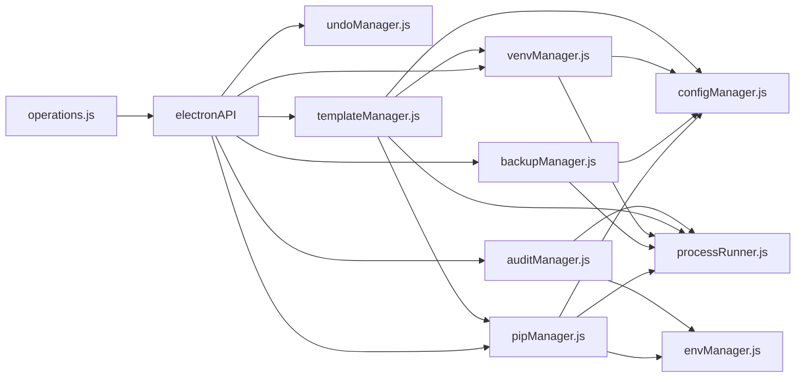

# 业务操作模块 (operations.js)

<cite>
**本文引用的文件**   
- [operations.js](file://renderer/js/operations.js)
- [pipManager.js](file://core/operations/pipManager.js)
- [backupManager.js](file://core/operations/backupManager.js)
- [venvManager.js](file://core/operations/venvManager.js)
- [undoManager.js](file://core/operations/undoManager.js)
- [templateManager.js](file://core/operations/templateManager.js)
- [auditManager.js](file://core/operations/auditManager.js)
- [processRunner.js](file://utils/processRunner.js)
- [envManager.js](file://core/system/envManager.js)
- [configManager.js](file://core/config/configManager.js)
- [app.js](file://renderer/js/app.js)
</cite>

## 目录
1. [简介](#简介)
2. [项目结构](#项目结构)
3. [核心组件](#核心组件)
4. [架构总览](#架构总览)
5. [详细组件分析](#详细组件分析)
6. [依赖关系分析](#依赖关系分析)
7. [性能与并发控制](#性能与并发控制)
8. [故障排查指南](#故障排查指南)
9. [结论](#结论)
10. [附录：扩展开发指南](#附录扩展开发指南)

## 简介
本文件为 PyLibMaster 的业务操作模块文档，聚焦于 renderer/js/operations.js 中所有用户操作的实现与编排，包括包安装、卸载、更新、查询、备份恢复、环境管理等核心业务逻辑。同时覆盖 IPC 通信封装、异步操作处理、错误重试机制、进度反馈、批量操作策略、并发控制、资源管理、事务回滚、操作历史与撤销重做、数据一致性保证，以及自定义操作扩展的最佳实践。

## 项目结构
PyLibMaster 采用前后端分离的 Electron 架构：
- 渲染进程（renderer）负责 UI 交互与状态管理，通过 window.electronAPI 调用主进程暴露的 API。
- 核心业务逻辑位于 core/operations 与 core/system、core/config 等子模块，统一由 utils/processRunner.js 执行外部命令（pip/python）。
- operations.js 作为前端业务编排层，将用户操作转化为对后端 API 的调用，并维护进度、取消、刷新等流程。

图表来源
- [operations.js:1-536](file://renderer/js/operations.js#L1-L536)
- [pipManager.js:1-800](file://core/operations/pipManager.js#L1-L800)
- [backupManager.js:1-196](file://core/operations/backupManager.js#L1-L196)
- [venvManager.js:1-278](file://core/operations/venvManager.js#L1-L278)
- [undoManager.js:1-131](file://core/operations/undoManager.js#L1-L131)
- [templateManager.js:1-320](file://core/operations/templateManager.js#L1-L320)
- [auditManager.js:1-230](file://core/operations/auditManager.js#L1-L230)
- [processRunner.js:1-366](file://utils/processRunner.js#L1-L366)
- [envManager.js:1-220](file://core/system/envManager.js#L1-L220)
- [configManager.js:1-194](file://core/config/configManager.js#L1-L194)

章节来源
- [operations.js:1-536](file://renderer/js/operations.js#L1-L536)
- [app.js:1-200](file://renderer/js/app.js#L1-L200)

## 核心组件
- 操作编排层（operations.js）
  - 安装：支持从搜索框输入、粘贴 pip install 命令、拖拽 .txt/.whl 文件安装；支持并行、重试、回滚、版本模式。
  - 卸载：单包/批量卸载，可选备份与回滚。
  - 更新：检查可更新列表、单包/批量更新，支持并行、重试、回滚。
  - 查询：已安装包、可更新包、镜像源、日志、环境等数据的刷新与渲染。
  - 进度与取消：统一的进度展示与基于 operationId 的取消能力。
  - 刷新策略：全局刷新与当前页面刷新，确保操作后数据一致性。

- 包管理器（pipManager.js）
  - 包名/版本安全校验、site-packages 路径缓存、包大小/安装时间估算。
  - 批量安装/卸载/更新，支持多镜像源重试、自动回滚、并发控制。
  - 从文件安装（.whl/.txt），失败时自动回滚。

- 备份管理器（backupManager.js）
  - 基于 pip freeze 创建备份，按环境+时间戳命名，支持列出/恢复/删除。
  - 备份 ID 安全校验，防止路径遍历攻击。

- 虚拟环境管理器（venvManager.js）
  - 创建/删除/列举虚拟环境，获取 Python/pip 版本与包数量。
  - 名称合法性校验与路径安全校验。

- 撤销管理器（undoManager.js）
  - 记录最近 20 条操作，支持撤销安装/卸载/更新，失败时回推栈。

- 模板与快照（templateManager.js）
  - 内置模板一键创建环境与安装依赖；环境快照创建/恢复/删除。

- 安全审计（auditManager.js）
  - 使用 pip-audit 扫描已知漏洞，解析结果并给出修复建议，带缓存。

- 进程运行器（processRunner.js）
  - 子进程封装：超时、SIGTERM/SIGKILL、实时输出回调、ANSI 清理。
  - 活跃进程跟踪与按 operationId 取消；pip 自动安装（ensurepip/get-pip.py）。

- 环境管理与配置（envManager.js, configManager.js）
  - 自动检测 Python 环境（含 Conda/Anaconda/Store），切换并持久化。
  - 配置项范围校验与原子写入，存储路径管理。

章节来源
- [operations.js:1-536](file://renderer/js/operations.js#L1-L536)
- [pipManager.js:1-800](file://core/operations/pipManager.js#L1-L800)
- [backupManager.js:1-196](file://core/operations/backupManager.js#L1-L196)
- [venvManager.js:1-278](file://core/operations/venvManager.js#L1-L278)
- [undoManager.js:1-131](file://core/operations/undoManager.js#L1-L131)
- [templateManager.js:1-320](file://core/operations/templateManager.js#L1-L320)
- [auditManager.js:1-230](file://core/operations/auditManager.js#L1-L230)
- [processRunner.js:1-366](file://utils/processRunner.js#L1-L366)
- [envManager.js:1-220](file://core/system/envManager.js#L1-L220)
- [configManager.js:1-194](file://core/config/configManager.js#L1-L194)

## 架构总览
operations.js 作为前端编排层，通过 api.* 方法调用主进程暴露的接口，实际执行业务逻辑的核心在 pipManager.js、backupManager.js、venvManager.js 等模块。所有外部命令通过 processRunner.js 执行，具备超时、取消、实时输出、ANSI 清理等能力。环境检测与配置由 envManager.js 与 configManager.js 提供支撑。

图表来源
- [operations.js:238-370](file://renderer/js/operations.js#L238-L370)
- [pipManager.js:474-578](file://core/operations/pipManager.js#L474-L578)
- [processRunner.js:85-161](file://utils/processRunner.js#L85-L161)
- [backupManager.js:89-113](file://core/operations/backupManager.js#L89-L113)
- [envManager.js:178-184](file://core/system/envManager.js#L178-L184)

## 详细组件分析

### 安装操作（Install）
- 入口函数 startInstall()
  - 解析输入：支持空格/逗号分隔多个包名、直接粘贴 pip install 命令、直接粘贴文件路径（.whl/.txt）。
  - 读取选项：版本模式（latest/specific/range）、版本号、并行、重试、回滚、operationId。
  - 调用 api.installPackages()，根据结果统计成功/失败数，刷新界面与统计数据。
- 文件安装 installFromSelectedFile()
  - 仅支持 .txt/.whl，.whl 直接安装，.txt 通过 requirements.txt 批量安装。
  - 支持重试与回滚，失败时自动恢复备份。
- 拖拽安装区
  - 支持拖拽 .txt/.whl 文件，点击选择文件，统一走 installFromSelectedFile()。

图表来源
- [operations.js:301-370](file://renderer/js/operations.js#L301-L370)
- [operations.js:253-293](file://renderer/js/operations.js#L253-L293)
- [operations.js:374-397](file://renderer/js/operations.js#L374-L397)
- [pipManager.js:495-578](file://core/operations/pipManager.js#L495-L578)
- [pipManager.js:627-712](file://core/operations/pipManager.js#L627-L712)

章节来源
- [operations.js:301-370](file://renderer/js/operations.js#L301-L370)
- [operations.js:253-293](file://renderer/js/operations.js#L253-L293)
- [operations.js:374-397](file://renderer/js/operations.js#L374-L397)
- [pipManager.js:495-578](file://core/operations/pipManager.js#L495-L578)
- [pipManager.js:627-712](file://core/operations/pipManager.js#L627-L712)

### 卸载操作（Uninstall）
- 单包卸载 singleUninstall()
  - 弹出备份确认对话框（若勾选），确认后进入 doUninstall()。
- 批量卸载 batchUninstall()
  - 从勾选列表收集包名，同样支持备份确认。
- 执行卸载 doUninstall()
  - 设置进度与 operationId，调用 api.uninstallPackages()，支持 backup/rollback。
  - 成功后清空勾选、刷新界面、提示与桌面通知。

图表来源
- [operations.js:39-113](file://renderer/js/operations.js#L39-L113)
- [pipManager.js:727-771](file://core/operations/pipManager.js#L727-L771)
- [backupManager.js:89-113](file://core/operations/backupManager.js#L89-L113)

章节来源
- [operations.js:39-113](file://renderer/js/operations.js#L39-L113)
- [pipManager.js:727-771](file://core/operations/pipManager.js#L727-L771)
- [backupManager.js:89-113](file://core/operations/backupManager.js#L89-L113)

### 更新操作（Update）
- 检查更新 checkUpdates()
  - 调用 api.listOutdated() 获取可更新列表，渲染表格与统计。
- 单包更新 updateOne()
  - 读取更新选项（parallel/retry/rollback），调用 api.updatePackages([name], options)。
- 批量更新 updateAll()
  - 未勾选则默认全选可更新库，调用 api.updatePackages(names, options)，统计成功/失败数。

图表来源
- [operations.js:115-236](file://renderer/js/operations.js#L115-L236)
- [operations.js:170-217](file://renderer/js/operations.js#L170-L217)
- [pipManager.js:787-800](file://core/operations/pipManager.js#L787-L800)

章节来源
- [operations.js:115-236](file://renderer/js/operations.js#L115-L236)
- [operations.js:170-217](file://renderer/js/operations.js#L170-L217)
- [pipManager.js:787-800](file://core/operations/pipManager.js#L787-L800)

### 查询与刷新（Query & Refresh）
- 已安装包 refreshInstalled()
  - 调用 api.listInstalled()，实时扫描 site-packages，估算包大小与安装时间。
- 可更新包 refreshOutdated()
  - 调用 api.listOutdated()，获取最新可用版本信息。
- 日志 refreshLogs()
  - 调用 api.getLogs({}) 获取操作日志。
- 环境 refreshEnvs()
  - 调用 api.detectEnvironments() 与 api.getCurrentEnv()，同步渲染 venv 列表与基础 Python 下拉选项。
- 镜像源 refreshMirrors()
  - 调用 api.getMirrors() 与 api.getSmartRoute()，渲染镜像源与智能路由开关。
- 全局刷新 refreshAll()
  - 并行刷新已安装与可更新列表，重新渲染各页面与状态栏，刷新撤销按钮状态。
- 当前页面刷新 refreshCurrentPage()
  - 根据当前活动页面执行对应的刷新逻辑，避免全量刷新带来的开销。

章节来源
- [operations.js:402-536](file://renderer/js/operations.js#L402-L536)
- [pipManager.js:382-441](file://core/operations/pipManager.js#L382-L441)
- [envManager.js:178-184](file://core/system/envManager.js#L178-L184)

### 备份与恢复（Backup & Restore）
- 创建备份 createBackup(env)
  - 执行 pip freeze，生成 backup_{环境名}_{时间戳}.txt 文件。
- 列出备份 listBackups()
  - 按创建时间倒序返回备份基本信息。
- 恢复备份 restoreBackup(backupId, env, onOutput)
  - 使用 pip install -r <backup>.txt --force-reinstall --no-deps 强制重装指定版本。
- 删除备份 deleteBackup(backupId)
  - 校验备份 ID 安全性，删除指定备份文件。

章节来源
- [backupManager.js:89-196](file://core/operations/backupManager.js#L89-L196)

### 环境管理（Environment Management）
- 检测环境 detectEnvironments()
  - 扫描常见路径（系统/用户/Conda/Anaconda/Store），并行获取 Python/pip 版本，过滤无 pip 的环境。
- 切换环境 switchEnvironment(envPath)
  - 优先从缓存查找，不存在但路径存在则临时构造对象，立即持久化。
- 获取当前环境 getCurrent()
  - 优先内存缓存，回退到配置文件保存的环境。

章节来源
- [envManager.js:85-170](file://core/system/envManager.js#L85-L170)
- [envManager.js:178-209](file://core/system/envManager.js#L178-L209)

### 撤销与重做（Undo & Redo）
- 记录操作 recordOperation(type, packages, meta)
  - 最多保留 20 条，包含操作类型、包列表、附加信息与时间。
- 判断可撤销 canUndo()
  - 返回是否可撤销及最近操作描述。
- 执行撤销 performUndo(onOutput)
  - 安装→卸载；卸载→重新安装（带版本号）；更新→回退到旧版本（meta.oldVersions）。
  - 失败时将操作放回栈顶，保证撤销栈一致性。

章节来源
- [undoManager.js:22-131](file://core/operations/undoManager.js#L22-L131)

### 模板与快照（Templates & Snapshots）
- 模板创建 createFromTemplate(options, onOutput)
  - 创建虚拟环境，安装模板内所有包，返回结果。
- 快照创建 createSnapshot(envPath, label)
  - 执行 pip freeze，记录完整包列表与元信息。
- 快照恢复 restoreSnapshot(snapshotId, envPath, onOutput)
  - 写入临时 requirements 文件，批量安装，清理临时文件。
- 快照管理 listSnapshots()/getSnapshotDetail()/deleteSnapshot()
  - 列出/详情/删除，按时间排序。

章节来源
- [templateManager.js:118-154](file://core/operations/templateManager.js#L118-L154)
- [templateManager.js:175-209](file://core/operations/templateManager.js#L175-L209)
- [templateManager.js:257-292](file://core/operations/templateManager.js#L257-L292)

### 安全审计（Security Audit）
- 确保 pip-audit ensurePipAudit(pythonPath, onOutput)
  - 未安装则自动安装，失败返回 false。
- 执行扫描 runAudit(onOutput)
  - 使用 python -m pip_audit --format=json 扫描，解析结果并缓存。
- 解析结果 parseAuditResult(data)
  - 兼容新旧 JSON 格式，提取漏洞详情、严重程度、修复版本与建议链接。

章节来源
- [auditManager.js:31-47](file://core/operations/auditManager.js#L31-L47)
- [auditManager.js:54-119](file://core/operations/auditManager.js#L54-L119)
- [auditManager.js:126-187](file://core/operations/auditManager.js#L126-L187)

## 依赖关系分析
- operations.js 依赖 api.* 方法（由 preload.js 暴露），实际调用核心模块。
- pipManager.js 依赖 envManager.js、configManager.js、backupManager.js、processRunner.js。
- backupManager.js 依赖 configManager.js、processRunner.js。
- venvManager.js 依赖 configManager.js、processRunner.js。
- undoManager.js 依赖 logManager（用于记录撤销操作日志）。
- templateManager.js 依赖 configManager.js、processRunner.js、venvManager.js、pipManager.js。
- auditManager.js 依赖 processRunner.js、envManager.js。
- processRunner.js 提供统一的子进程执行能力，被所有需要外部命令的模块复用。

图表来源
- [operations.js:1-536](file://renderer/js/operations.js#L1-L536)
- [pipManager.js:1-800](file://core/operations/pipManager.js#L1-L800)
- [backupManager.js:1-196](file://core/operations/backupManager.js#L1-L196)
- [venvManager.js:1-278](file://core/operations/venvManager.js#L1-L278)
- [undoManager.js:1-131](file://core/operations/undoManager.js#L1-L131)
- [templateManager.js:1-320](file://core/operations/templateManager.js#L1-L320)
- [auditManager.js:1-230](file://core/operations/auditManager.js#L1-L230)
- [processRunner.js:1-366](file://utils/processRunner.js#L1-L366)
- [envManager.js:1-220](file://core/system/envManager.js#L1-L220)
- [configManager.js:1-194](file://core/config/configManager.js#L1-L194)

章节来源
- [operations.js:1-536](file://renderer/js/operations.js#L1-L536)
- [pipManager.js:1-800](file://core/operations/pipManager.js#L1-L800)
- [backupManager.js:1-196](file://core/operations/backupManager.js#L1-L196)
- [venvManager.js:1-278](file://core/operations/venvManager.js#L1-L278)
- [undoManager.js:1-131](file://core/operations/undoManager.js#L1-L131)
- [templateManager.js:1-320](file://core/operations/templateManager.js#L1-L320)
- [auditManager.js:1-230](file://core/operations/auditManager.js#L1-L230)
- [processRunner.js:1-366](file://utils/processRunner.js#L1-L366)
- [envManager.js:1-220](file://core/system/envManager.js#L1-L220)
- [configManager.js:1-194](file://core/config/configManager.js#L1-L194)

## 性能与并发控制
- 并发控制
  - 环境级互斥锁（acquireEnvLock）确保同一 Python 环境的操作串行执行，避免并发冲突。
  - 安装/更新支持并行线程数（config.parallelThreads），限制最大并发以避免资源争用。
- 缓存优化
  - 已安装包缓存（5分钟有效期），减少重复扫描。
  - site-packages 路径缓存（TTL 30秒），提升包大小/安装时间估算速度。
  - pip 就绪状态缓存（TTL 5分钟），避免重复检测。
- 超时与取消
  - 子进程统一超时处理（SIGTERM + SIGKILL），支持按 operationId 取消关联进程。
  - 下载 get-pip.py 多源重试，提高可用性。
- 资源管理
  - 失败时清理残留目录（如 venv 创建失败）。
  - 临时文件清理（如快照恢复时的临时 requirements 文件）。

章节来源
- [pipManager.js:72-85](file://core/operations/pipManager.js#L72-L85)
- [pipManager.js:99-127](file://core/operations/pipManager.js#L99-L127)
- [pipManager.js:226-248](file://core/operations/pipManager.js#L226-L248)
- [processRunner.js:150-161](file://utils/processRunner.js#L150-L161)
- [processRunner.js:181-191](file://utils/processRunner.js#L181-L191)
- [processRunner.js:233-278](file://utils/processRunner.js#L233-L278)
- [venvManager.js:105-114](file://core/operations/venvManager.js#L105-L114)
- [templateManager.js:289-292](file://core/operations/templateManager.js#L289-L292)

## 故障排查指南
- 常见问题
  - pip 不可用：自动安装 ensurepip 或 get-pip.py，失败时提示手动安装。
  - 网络问题：多镜像源重试，智能路由（config.smartRoute）可切换源。
  - 权限不足：以管理员权限运行应用或调整目录权限。
  - 路径非法：包名/版本/备份 ID/venv 名称均进行严格校验，非法输入会抛出明确错误。
- 日志与调试
  - 查看操作日志（refreshLogs/renderLogs），定位失败原因。
  - 启用安全审计（auditManager.runAudit），检查已知漏洞与修复建议。
  - 使用撤销功能（undoManager.performUndo）快速回滚误操作。
- 取消与超时
  - 通过 cancelCurrentOperation() 发送取消请求，主进程终止关联子进程。
  - 子进程超时自动终止，避免长时间挂起。

章节来源
- [operations.js:20-31](file://renderer/js/operations.js#L20-L31)
- [processRunner.js:233-278](file://utils/processRunner.js#L233-L278)
- [auditManager.js:54-119](file://core/operations/auditManager.js#L54-L119)
- [undoManager.js:66-106](file://core/operations/undoManager.js#L66-L106)

## 结论
operations.js 作为 PyLibMaster 的前端业务编排层，提供了完整的包管理生命周期操作（安装/卸载/更新/查询），并通过 pipManager.js、backupManager.js、venvManager.js、undoManager.js、templateManager.js、auditManager.js 等核心模块实现强大的业务能力。结合 processRunner.js 的子进程管理能力与 envManager.js、configManager.js 的系统集成，确保了高可靠性、高性能与易用性。通过严格的输入校验、并发控制、超时与取消、备份与回滚、撤销与重做、日志与审计，保障了数据一致性与用户体验。

## 附录：扩展开发指南
- 自定义操作扩展
  - 在 operations.js 中添加新的用户操作入口函数，遵循现有模式：设置进度/operationId、调用 api.*、处理结果、刷新界面。
  - 在 pipManager.js 或对应模块中实现核心逻辑，确保输入校验、错误处理、日志记录。
  - 如需外部命令，使用 processRunner.js 提供的 runCommand/runPip/runPython，支持超时、取消、实时输出。
- 最佳实践
  - 始终进行输入校验（包名/版本/路径/ID），防止注入与路径遍历。
  - 使用 environment 级互斥锁避免并发冲突。
  - 合理使用缓存（已安装包/site-packages/pip 就绪）提升性能。
  - 提供清晰的错误消息与日志，便于用户与开发者定位问题。
  - 支持备份与回滚，确保操作可逆。
  - 提供撤销功能，增强用户体验。
  - 使用国际化（i18n）与 Toast 提示，提升可读性。
  - 在失败时清理临时文件与残留目录，保持系统整洁。

章节来源
- [operations.js:1-536](file://renderer/js/operations.js#L1-L536)
- [pipManager.js:1-800](file://core/operations/pipManager.js#L1-L800)
- [processRunner.js:1-366](file://utils/processRunner.js#L1-L366)
- [envManager.js:1-220](file://core/system/envManager.js#L1-L220)
- [configManager.js:1-194](file://core/config/configManager.js#L1-L194)