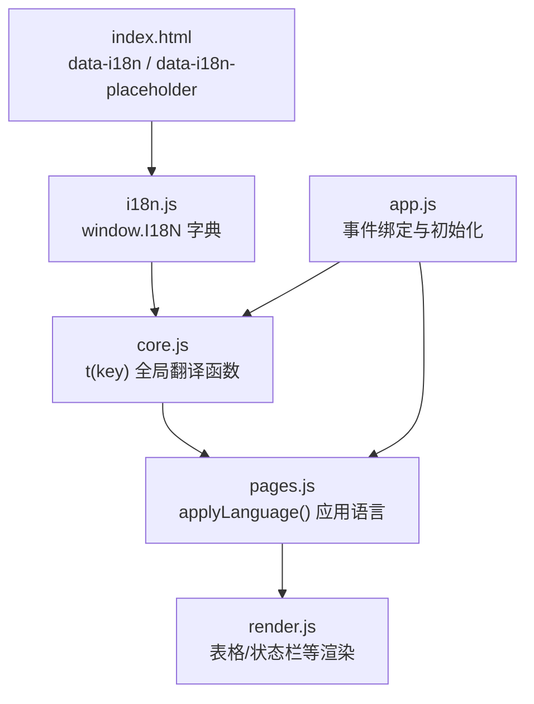
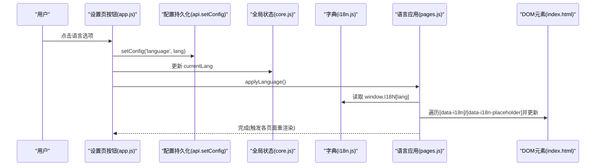
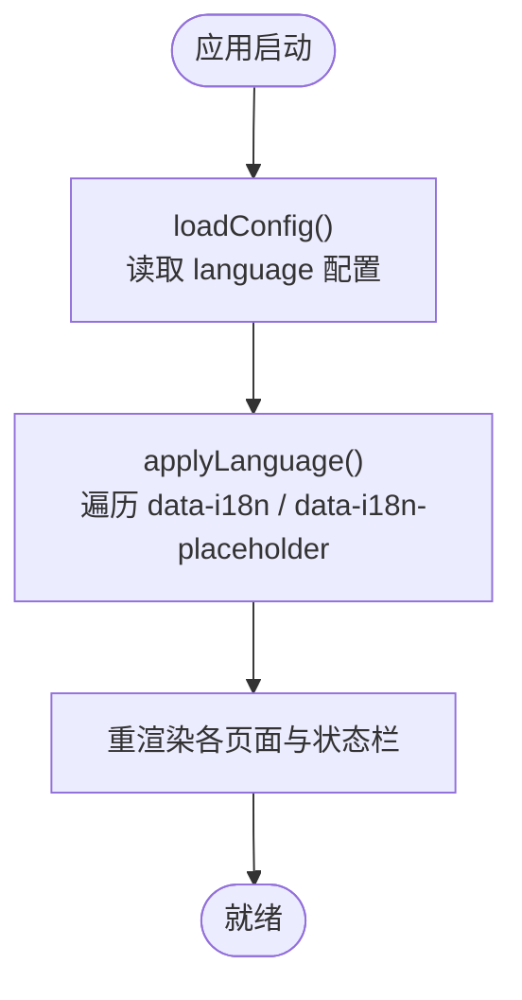
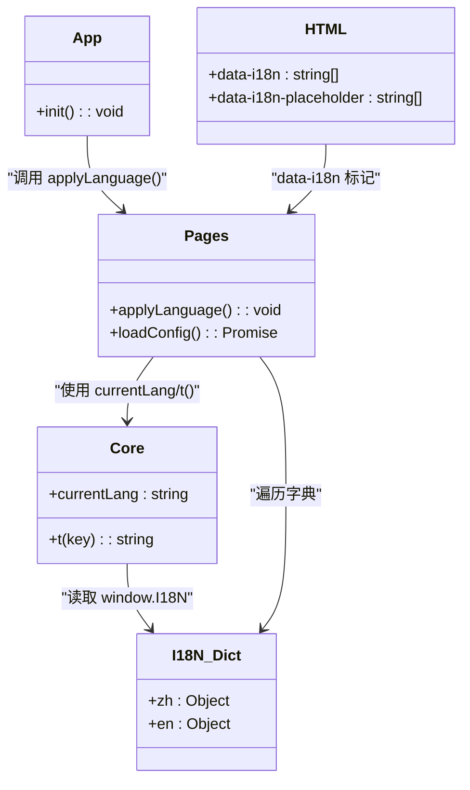

# 国际化模块 (i18n.js)

<cite>
**本文引用的文件**   
- [renderer/js/i18n.js](file://renderer/js/i18n.js)
- [renderer/js/core.js](file://renderer/js/core.js)
- [renderer/js/pages.js](file://renderer/js/pages.js)
- [renderer/js/app.js](file://renderer/js/app.js)
- [renderer/index.html](file://renderer/index.html)
</cite>

## 目录
1. [简介](#简介)
2. [项目结构](#项目结构)
3. [核心组件](#核心组件)
4. [架构总览](#架构总览)
5. [详细组件分析](#详细组件分析)
6. [依赖关系分析](#依赖关系分析)
7. [性能考量](#性能考量)
8. [故障排查指南](#故障排查指南)
9. [结论](#结论)
10. [附录](#附录)

## 简介
本文件为 PyLibMaster 的国际化（i18n）模块文档，聚焦于 renderer/js/i18n.js 及其在渲染进程中的使用方式。内容涵盖：
- 中英文语言包的组织与键值管理
- 动态语言切换流程与文本替换机制
- 翻译文件的结构与命名约定
- 复数形式与上下文支持现状与建议
- 语言检测、默认语言设置与本地化存储策略
- 新增语言的扩展方法与翻译维护流程
- 最佳实践与性能优化建议

## 项目结构
国际化相关代码主要位于渲染进程的 JS 文件中，HTML 通过 data-i18n 和 data-i18n-placeholder 标记参与多语言渲染。加载顺序确保 i18n 字典最先可用，随后由 core.js 暴露 t() 函数，再由 pages.js 统一应用语言到 DOM。

图表来源
- [renderer/index.html:1-200](file://renderer/index.html#L1-L200)
- [renderer/js/i18n.js:1-373](file://renderer/js/i18n.js#L1-L373)
- [renderer/js/core.js:1-93](file://renderer/js/core.js#L1-L93)
- [renderer/js/pages.js:1-800](file://renderer/js/pages.js#L1-L800)

章节来源
- [renderer/index.html:1-200](file://renderer/index.html#L1-L200)
- [renderer/js/i18n.js:1-373](file://renderer/js/i18n.js#L1-L373)
- [renderer/js/core.js:1-93](file://renderer/js/core.js#L1-L93)
- [renderer/js/pages.js:1-800](file://renderer/js/pages.js#L1-L800)

## 核心组件
- 语言字典与注册：i18n.js 将 zh/en 两套文案挂载到 window.I18N，供其他模块直接读取。
- 翻译函数：core.js 定义 t(key)，基于当前语言 currentLang 从 window.I18N 中取值，缺失时回退 key。
- 语言应用：pages.js 提供 applyLanguage()，遍历 data-i18n 与 data-i18n-placeholder 并更新 DOM，同时刷新各页面渲染。
- 语言切换入口：app.js 监听设置页语言选项点击，持久化配置并调用 applyLanguage()。

章节来源
- [renderer/js/i18n.js:1-373](file://renderer/js/i18n.js#L1-L373)
- [renderer/js/core.js:1-93](file://renderer/js/core.js#L1-L93)
- [renderer/js/pages.js:350-422](file://renderer/js/pages.js#L350-L422)
- [renderer/js/app.js:52-62](file://renderer/js/app.js#L52-L62)

## 架构总览
下图展示了用户切换语言时的完整调用链与数据流。

图表来源
- [renderer/js/app.js:52-62](file://renderer/js/app.js#L52-L62)
- [renderer/js/core.js:16-17](file://renderer/js/core.js#L16-L17)
- [renderer/js/pages.js:358-374](file://renderer/js/pages.js#L358-L374)
- [renderer/index.html:62-118](file://renderer/index.html#L62-L118)

## 详细组件分析

### 语言字典与键值管理（i18n.js）
- 组织方式：以 zh/en 两个顶层对象存放所有文案，键名采用“模块.具体文案”的分层格式，如 nav.install、btn.cancel、settings.language 等。
- 覆盖范围：导航、操作按钮、提示语、空态文案、统计标签、工具集、PyPI 浏览、安全审计、环境对比、日志导出、版本历史、系统集成等。
- 可插拔性：新增语言只需在 window.I18N 下新增同构对象，并在切换逻辑中支持该语言标识即可。

章节来源
- [renderer/js/i18n.js:11-372](file://renderer/js/i18n.js#L11-L372)

### 翻译函数与运行时查找（core.js）
- t(key) 实现：根据 currentLang 选择对应语言对象，若键不存在则返回 key 本身作为回退。
- 全局共享：currentLang 初始值来自配置加载，所有模块通过 t() 获取文案，避免硬编码字符串。

章节来源
- [renderer/js/core.js:16-17](file://renderer/js/core.js#L16-L17)

### 语言应用与 DOM 替换（pages.js）
- applyLanguage()：
  - 遍历所有 data-i18n 属性，将 textContent 设置为对应翻译。
  - 遍历所有 data-i18n-placeholder 属性，将 placeholder 设置为对应翻译。
  - 重新渲染卸载/更新/查询/镜像/日志等页面，以及状态栏与选择信息。
- 语言切换交互：
  - app.js 监听语言选项点击，设置 document.documentElement.lang，保存配置，并调用 applyLanguage()。
  - pages.js 的 loadConfig() 启动时读取配置，恢复 currentLang 与界面选中项。

图表来源
- [renderer/js/pages.js:358-374](file://renderer/js/pages.js#L358-L374)
- [renderer/js/pages.js:393-422](file://renderer/js/pages.js#L393-L422)
- [renderer/js/app.js:52-62](file://renderer/js/app.js#L52-L62)

章节来源
- [renderer/js/pages.js:358-374](file://renderer/js/pages.js#L358-L374)
- [renderer/js/pages.js:393-422](file://renderer/js/pages.js#L393-L422)
- [renderer/js/app.js:52-62](file://renderer/js/app.js#L52-L62)

### HTML 标记与静态文案（index.html）
- 使用 data-i18n 标注需要翻译的文本节点。
- 使用 data-i18n-placeholder 标注输入框占位符。
- 这些标记是 applyLanguage() 的扫描目标，保证文案与模板解耦。

章节来源
- [renderer/index.html:62-118](file://renderer/index.html#L62-L118)
- [renderer/index.html:135-165](file://renderer/index.html#L135-L165)

### 语言检测、默认语言与本地化存储
- 语言检测：当前实现未包含浏览器或系统语言自动检测；默认语言来源于配置加载。
- 默认语言设置：loadConfig() 中若未检测到配置，则回退为中文。
- 本地化存储：语言切换通过 api.setConfig('language', lang) 持久化，后续启动时由 loadConfig() 恢复。

章节来源
- [renderer/js/pages.js:393-422](file://renderer/js/pages.js#L393-L422)
- [renderer/js/app.js:52-62](file://renderer/js/app.js#L52-L62)

### 复数形式与上下文支持现状
- 现状：当前字典未内置复数规则引擎或上下文参数化机制，文案以固定字符串为主。
- 建议：
  - 对需复数的场景，可在键名上区分单复数（如 tag.installed_s），或在 t() 基础上封装带参数的格式化函数。
  - 对含变量的文案（如“已安装 {count} 个库”），可在 t() 后做简单 replace，或使用专用插值函数。

章节来源
- [renderer/js/core.js:16-17](file://renderer/js/core.js#L16-L17)
- [renderer/js/render.js:44-47](file://renderer/js/render.js#L44-L47)

### 新增语言扩展方法
步骤建议：
- 在 i18n.js 的 window.I18N 下新增语言对象（如 ja），保持与 zh/en 相同的键集合。
- 在设置页的语言选项中增加对应选项，并确保点击后能设置 currentLang 并调用 applyLanguage()。
- 验证所有 data-i18n/data-i18n-placeholder 是否都能正确显示新语言文案。

章节来源
- [renderer/js/i18n.js:11-372](file://renderer/js/i18n.js#L11-L372)
- [renderer/js/app.js:52-62](file://renderer/js/app.js#L52-L62)
- [renderer/js/pages.js:358-374](file://renderer/js/pages.js#L358-L374)

### 翻译维护流程
- 新增文案：先在 i18n.js 的 zh 与 en 中补充相同键，再在 HTML 中使用 data-i18n 或 data-i18n-placeholder 引用。
- 修改文案：仅修改 i18n.js 中的对应键值，无需改动业务逻辑。
- 校验一致性：可通过脚本检查 zh/en 键集合是否一致，避免遗漏。

章节来源
- [renderer/js/i18n.js:11-372](file://renderer/js/i18n.js#L11-L372)
- [renderer/index.html:62-118](file://renderer/index.html#L62-L118)

## 依赖关系分析
- i18n.js 被 core.js 通过 window.I18N 引用，提供字典数据。
- core.js 暴露 t() 给 render.js、pages.js、app.js 等模块使用。
- pages.js 的 applyLanguage() 依赖 i18n.js 的字典与 core.js 的 currentLang。
- index.html 通过 data-i18n 标记与 pages.js 的 applyLanguage() 协作完成文案替换。

图表来源
- [renderer/js/i18n.js:11-372](file://renderer/js/i18n.js#L11-L372)
- [renderer/js/core.js:16-17](file://renderer/js/core.js#L16-L17)
- [renderer/js/pages.js:358-374](file://renderer/js/pages.js#L358-L374)
- [renderer/index.html:62-118](file://renderer/index.html#L62-L118)

章节来源
- [renderer/js/i18n.js:11-372](file://renderer/js/i18n.js#L11-L372)
- [renderer/js/core.js:16-17](file://renderer/js/core.js#L16-L17)
- [renderer/js/pages.js:358-374](file://renderer/js/pages.js#L358-L374)
- [renderer/index.html:62-118](file://renderer/index.html#L62-L118)

## 性能考量
- 字典访问复杂度：t(key) 为 O(1) 的对象属性访问，整体开销极低。
- DOM 遍历成本：applyLanguage() 会遍历所有 data-i18n/data-i18n-placeholder 元素，建议在大规模文案变更时批量处理，减少重排重绘。
- 渲染联动：每次语言切换都会触发多个页面的重渲染，必要时可延迟或分片执行。
- 缓存策略：可将常用文案结果缓存，但鉴于字典较小且访问频繁，通常收益有限。

## 故障排查指南
- 文案不显示或显示为 key：
  - 检查 i18n.js 中是否存在对应语言与键。
  - 确认 HTML 中 data-i18n/data-i18n-placeholder 拼写正确。
  - 确认 currentLang 是否正确设置。
- 切换语言后部分文案未更新：
  - 检查是否在切换后调用了 applyLanguage()。
  - 检查是否有动态插入的 DOM 未添加 data-i18n 标记或未在 applyLanguage() 后再次更新。
- 默认语言不符合预期：
  - 检查 loadConfig() 中语言配置的读取与回退逻辑。
  - 确认 api.setConfig('language', lang) 是否成功持久化。

章节来源
- [renderer/js/core.js:16-17](file://renderer/js/core.js#L16-L17)
- [renderer/js/pages.js:358-374](file://renderer/js/pages.js#L358-L374)
- [renderer/js/pages.js:393-422](file://renderer/js/pages.js#L393-L422)
- [renderer/js/app.js:52-62](file://renderer/js/app.js#L52-L62)

## 结论
PyLibMaster 的国际化方案简洁高效：通过集中式字典、统一的 t() 接口与 data-i18n 标记，实现了中英文双语支持与动态切换。当前实现未包含复数规则与复杂上下文参数化，但具备良好的扩展基础。建议按本文档的流程进行新增语言与文案维护，并结合性能与可维护性建议持续优化。

## 附录
- 键命名规范：建议使用“模块.具体文案”的分层格式，便于管理与检索。
- 文案分类示例：nav.*、btn.*、install.*、uninstall.*、update.*、query.*、mirror.*、env.*、logs.*、settings.*、about.*、detail.*、tools.*、audit.*、pypi.*、scheduler.*、tpl.*、diff.*、offline.*、undo.*、releases.* 等。
- 变量插值建议：对含变量的文案，可在 t() 返回值上使用字符串替换，或封装专用插值函数以提升可读性与复用性。