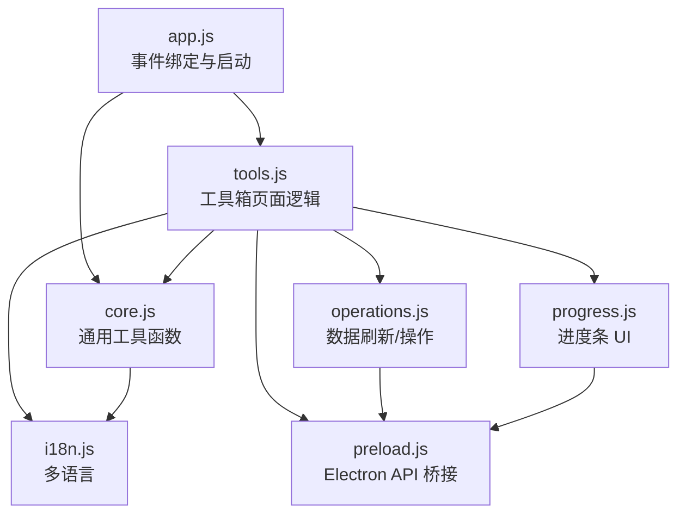
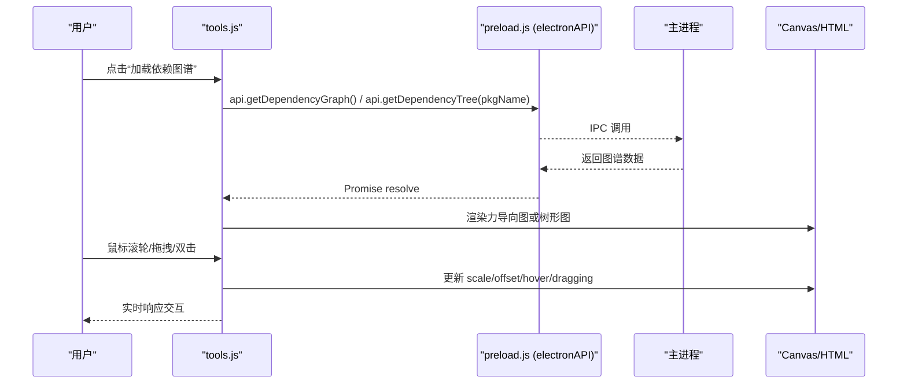
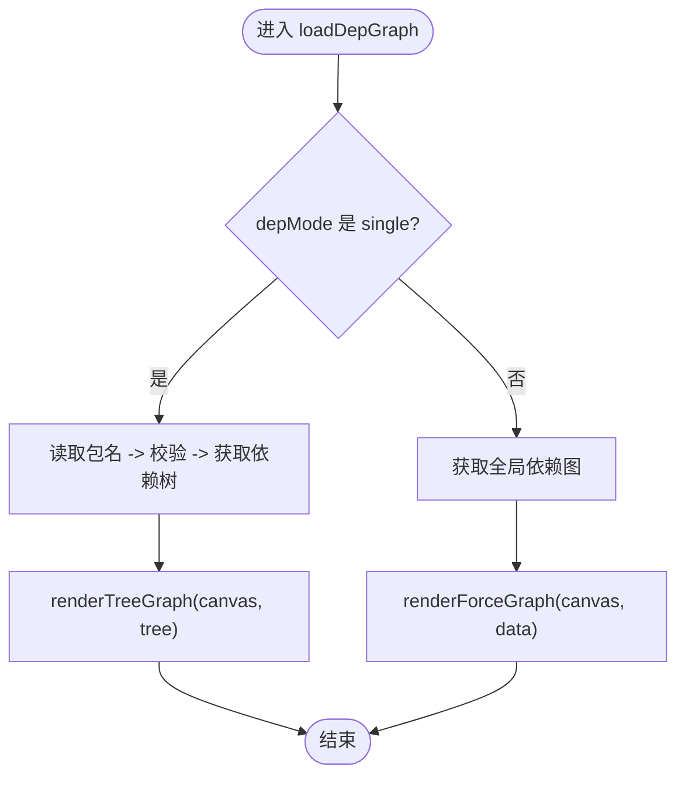
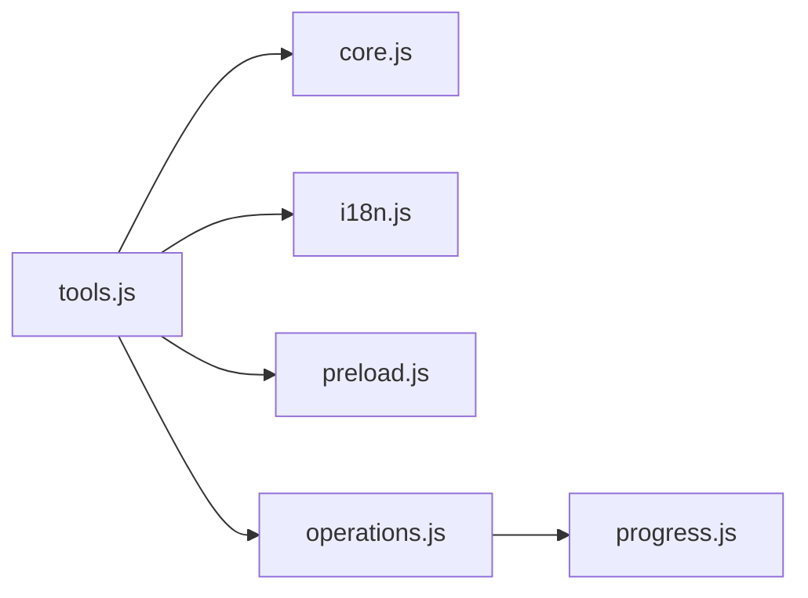

# 工具函数模块 (tools.js)

<cite>
**本文引用的文件**   
- [tools.js](file://renderer/js/tools.js)
- [core.js](file://renderer/js/core.js)
- [app.js](file://renderer/js/app.js)
- [render.js](file://renderer/js/render.js)
- [operations.js](file://renderer/js/operations.js)
- [progress.js](file://renderer/js/progress.js)
- [i18n.js](file://renderer/js/i18n.js)
- [preload.js](file://preload.js)
</cite>

## 目录
1. [简介](#简介)
2. [项目结构](#项目结构)
3. [核心组件](#核心组件)
4. [架构总览](#架构总览)
5. [详细组件分析](#详细组件分析)
6. [依赖关系分析](#依赖关系分析)
7. [性能与内存优化](#性能与内存优化)
8. [故障排查指南](#故障排查指南)
9. [结论](#结论)
10. [附录：扩展与自定义规范](#附录扩展与自定义规范)

## 简介
本文件为 PyLibMaster 渲染进程中的“工具箱”页面交互逻辑，位于 renderer/js/tools.js。该模块聚焦于高级工具能力，包括：
- 依赖图谱（Canvas 力导向图 + 树形图）
- 磁盘空间分析（条形图）
- 环境对比（diff 视图）
- 离线包下载
- 操作撤销
- 系统集成（资源管理器右键菜单开关）
- 版本历史展示、环境健康诊断等

同时，本仓库的通用工具函数集中在 core.js 中提供，如 HTML 转义、Toast 提示、数值动画、唯一 ID 生成等；异步事件与 API 桥接由 preload.js 暴露；进度 UI 由 progress.js 管理；表格与选择逻辑由 render.js 负责；操作执行与刷新由 operations.js 统一处理。

本说明将围绕 tools.js 的功能展开，并系统梳理跨模块的工具函数设计原则、参数校验、错误处理与返回值规范，以及异步封装、Promise 使用、事件处理辅助、性能优化与调试建议，最后给出扩展与自定义开发规范。

## 项目结构
- 入口与初始化：app.js 负责全局事件绑定与启动流程，最终调用 initTools() 初始化工具箱页面。
- 工具箱页面：tools.js 实现各子功能 Tab 切换与具体业务逻辑。
- 通用工具：core.js 提供 escapeHtml、showToast、animateStat、generateOperationId、closeModal 等。
- 进度 UI：progress.js 提供 resetProgress、finishProgress、setProgressUI、updateProgressFromOutput。
- 数据刷新：operations.js 提供 refreshAll、refreshAllData、refreshCurrentPage 等。
- 国际化：i18n.js 提供 t(key) 翻译与 applyLanguage。
- 主进程桥接：preload.js 通过 contextBridge 暴露 window.electronAPI，供渲染进程调用。

图表来源
- [app.js:1-210](file://renderer/js/app.js#L1-L210)
- [tools.js:1-795](file://renderer/js/tools.js#L1-L795)
- [core.js:1-93](file://renderer/js/core.js#L1-L93)
- [progress.js:1-141](file://renderer/js/progress.js#L1-L141)
- [operations.js:1-536](file://renderer/js/operations.js#L1-L536)
- [i18n.js:1-373](file://renderer/js/i18n.js#L1-L373)
- [preload.js:1-221](file://preload.js#L1-L221)

章节来源
- [app.js:1-210](file://renderer/js/app.js#L1-L210)
- [tools.js:1-795](file://renderer/js/tools.js#L1-L795)
- [core.js:1-93](file://renderer/js/core.js#L1-L93)
- [progress.js:1-141](file://renderer/js/progress.js#L1-L141)
- [operations.js:1-536](file://renderer/js/operations.js#L1-L536)
- [i18n.js:1-373](file://renderer/js/i18n.js#L1-L373)
- [preload.js:1-221](file://preload.js#L1-L221)

## 核心组件
- 工具箱 Tab 切换与状态管理：维护 currentToolTab，动态显示对应面板。
- 依赖图谱：支持单包依赖树与全局依赖网络两种模式，Canvas 绘制与交互（缩放、拖拽、平移、双击重置）。
- 磁盘空间分析：获取 site-packages 占用 Top N 并以条形图展示。
- 环境对比：支持从文件或当前环境进行 requirements 差异对比，统计仅 A/B 有、版本变化、相同数量。
- 离线下载：批量下载指定包到目标目录，可选包含依赖与平台限定。
- 操作撤销：查询可撤销状态并执行撤销，刷新界面。
- 系统集成：读取并切换资源管理器右键菜单启用状态。
- 版本历史与健康诊断：加载包发布历史、冲突检测与健康评分。

章节来源
- [tools.js:1-795](file://renderer/js/tools.js#L1-L795)

## 架构总览
工具箱页面通过 Electron 预加载脚本暴露的 electronAPI 与主进程通信，完成数据获取与操作执行。前端负责：
- 用户交互与输入校验
- 异步 Promise 调用与错误捕获
- Canvas 渲染与交互事件处理
- 进度与结果反馈（Toast、进度条、DOM 更新）

图表来源
- [tools.js:1-795](file://renderer/js/tools.js#L1-L795)
- [preload.js:1-221](file://preload.js#L1-L221)

## 详细组件分析

### 依赖图谱（单包树与全局网络）
- 模式切换：根据 depMode 决定加载单包依赖树或全局依赖网络。
- 数据加载：通过 api.getDependencyTree 或 api.getDependencyGraph 获取数据，失败时显示空状态与错误信息。
- 渲染：
  - 树形图：递归计算子树宽度，按层级布局，贝塞尔曲线连线，节点圆角矩形与颜色区分深度。
  - 力导向图：限制节点数（最多 80），预计算度，迭代模拟斥力/引力/向心力，持续 requestAnimationFrame 渲染。
- 交互：
  - 滚轮缩放：以鼠标位置为中心缩放，保持偏移一致性。
  - 拖拽节点：更新节点坐标并清零速度。
  - 平移画布：非节点区域按下拖动平移。
  - 双击重置：恢复 scale=1、offsetX/Y=0。
  - 悬停高亮：关联边与节点高亮，其他淡化。

图表来源
- [tools.js:1-795](file://renderer/js/tools.js#L1-L795)

章节来源
- [tools.js:1-795](file://renderer/js/tools.js#L1-L795)

### 高清 Canvas 工具
- setupHiDPICanvas：根据 devicePixelRatio 设置 canvas 物理像素尺寸与样式尺寸，并设置 2D 上下文变换，确保高分屏下清晰渲染。

章节来源
- [tools.js:1-795](file://renderer/js/tools.js#L1-L795)

### 磁盘空间分析
- 触发后禁用按钮并显示加载中，调用 api.getDiskUsage 获取数据。
- 展示总占用、site-packages 路径、Top 30 包占用条形图，其余合并为“其他”。
- 异常时显示空状态并通过 showToast 提示错误。

章节来源
- [tools.js:1-795](file://renderer/js/tools.js#L1-L795)

### 环境对比（requirements diff）
- 支持来源 A/B 为文件或当前环境，若为文件需先选择路径。
- 调用 api.diffRequirements(sourceA, sourceB) 获取差异结果。
- 统计 onlyA、onlyB、upgraded、same 数量，并渲染列表。
- 错误时显示空状态与错误消息。

章节来源
- [tools.js:1-795](file://renderer/js/tools.js#L1-L795)

### 离线下载
- 输入包名列表与目标目录，可选择是否包含依赖与目标平台。
- 调用 api.downloadPackages(packages, destDir, options) 执行下载。
- 进度条与结果提示，成功时显示已下载数量与目标路径。

章节来源
- [tools.js:1-795](file://renderer/js/tools.js#L1-L795)

### 操作撤销
- 刷新撤销按钮状态：api.canUndo() 判断是否可用，展示 lastAction。
- 执行撤销：api.performUndo() 成功后刷新所有数据并提示。

章节来源
- [tools.js:1-795](file://renderer/js/tools.js#L1-L795)

### 系统集成（右键菜单）
- 加载状态：api.getExplorerStatus() 读取 enabled 并同步 toggle 控件。
- 切换：api.enableExplorerMenu()/disableExplorerMenu() 控制启用/禁用，失败回滚控件状态并提示。

章节来源
- [tools.js:1-795](file://renderer/js/tools.js#L1-L795)

### 版本历史与健康诊断
- 版本历史：api.getPackageReleases(pkgName) 获取 releases，渲染时间线并提供 Changelog 链接。
- 冲突检测：api.checkConflicts() 返回 ok 或 conflicts 列表，展示冲突详情。
- 健康检查：api.healthCheck() 返回 score、totalPackages、conflicts、brokenPackages、issues，渲染评分与问题列表。

章节来源
- [tools.js:1-795](file://renderer/js/tools.js#L1-L795)

### 初始化与事件绑定
- initToolsTabs：为 .tools-tab 元素绑定点击事件，切换 active 类与对应 panel。
- initDepGraph：为 #dep-mode-options 主题选项绑定点击，切换 depMode；为 #dep-canvas 绑定 wheel/mouse/doubleclick 事件。
- initTools：在 app.js 启动流程末尾调用，完成工具箱初始化。

章节来源
- [tools.js:1-795](file://renderer/js/tools.js#L1-L795)
- [app.js:1-210](file://renderer/js/app.js#L1-L210)

## 依赖关系分析
- tools.js 依赖 core.js 的 escapeHtml、showToast、t(key)。
- tools.js 依赖 i18n.js 的 t(key) 用于文案。
- tools.js 依赖 preload.js 暴露的 electronAPI 进行异步数据请求与系统操作。
- tools.js 与 progress.js 无直接调用，但整体应用共享进度状态（operations.js 与 progress.js 协作）。
- tools.js 与 operations.js 通过 refreshAllData() 进行数据刷新联动。

图表来源
- [tools.js:1-795](file://renderer/js/tools.js#L1-L795)
- [core.js:1-93](file://renderer/js/core.js#L1-L93)
- [i18n.js:1-373](file://renderer/js/i18n.js#L1-L373)
- [preload.js:1-221](file://preload.js#L1-L221)
- [operations.js:1-536](file://renderer/js/operations.js#L1-L536)
- [progress.js:1-141](file://renderer/js/progress.js#L1-L141)

章节来源
- [tools.js:1-795](file://renderer/js/tools.js#L1-L795)
- [core.js:1-93](file://renderer/js/core.js#L1-L93)
- [i18n.js:1-373](file://renderer/js/i18n.js#L1-L373)
- [preload.js:1-221](file://preload.js#L1-L221)
- [operations.js:1-536](file://renderer/js/operations.js#L1-L536)
- [progress.js:1-141](file://renderer/js/progress.js#L1-L141)

## 性能与内存优化
- Canvas 高清渲染：使用 setupHiDPICanvas 适配 devicePixelRatio，避免模糊。
- 力导向图性能：
  - 限制节点数（maxNodes=80），减少 O(n^2) 斥力计算开销。
  - 使用 requestAnimationFrame 维持渲染循环，保证交互流畅。
  - 温度衰减与阻尼系数控制收敛速度与稳定性。
- DOM 更新策略：
  - 批量构建 HTML 字符串再一次性 innerHTML 赋值，减少重排次数。
  - 使用 CSS class 切换（active/loading/out）控制状态，避免频繁 style 操作。
- 事件处理：
  - 使用 passive: false 阻止默认滚动行为，提升交互体验。
  - 鼠标事件去抖与状态集中管理（graphState），降低重复计算。
- 内存管理：
  - 及时 cancelAnimationFrame(depAnimFrame) 避免多余帧渲染。
  - 清理临时变量（如 graphState 重置），防止引用泄漏。
- 错误处理：
  - 所有异步调用包裹 try/catch，失败时清空中间状态并提示用户。
  - 空状态与错误信息通过 DOM 显式展示，避免未定义状态。

章节来源
- [tools.js:1-795](file://renderer/js/tools.js#L1-L795)

## 故障排查指南
- 依赖图谱加载失败：
  - 检查包名是否为空，单包模式下需输入有效包名。
  - 查看 info 文本与 empty 容器内容，确认错误消息。
- 力导向图不响应：
  - 确认 canvas 事件绑定是否生效（wheel/mouse/doubleclick）。
  - 检查 graphState 状态是否正确重置（dragging/panning/hoverNode）。
- 磁盘空间分析无数据：
  - 确认已选择 Python 环境，api.getDiskUsage 返回数据为空时需提示。
- 环境对比失败：
  - 检查来源 A/B 是否为文件且路径已选择，或当前环境是否存在。
- 离线下载失败：
  - 确认包名列表与目标目录有效，platform 与 includeDeps 选项合理。
- 撤销不可用：
  - 检查 canUndo 返回 available 字段，若无则隐藏按钮。
- 右键菜单切换失败：
  - 捕获 enable/disable 返回 success 字段，失败时回滚 toggle 状态。

章节来源
- [tools.js:1-795](file://renderer/js/tools.js#L1-L795)

## 结论
tools.js 作为 PyLibMaster 工具箱页面的核心，提供了丰富的数据分析与系统集成功能。其设计遵循清晰的职责分离、严格的参数校验、完善的错误处理与友好的用户反馈。通过 Canvas 高性能渲染与合理的内存管理，保证了复杂交互场景下的流畅体验。结合 core.js 的通用工具函数与 preload.js 的安全桥接，形成了稳定可靠的工具链。

## 附录：扩展与自定义规范
- 函数设计原则：
  - 单一职责：每个函数专注于一个功能（如 loadDepGraph、renderTreeGraph、loadDiskUsage）。
  - 参数校验：对用户输入进行必要校验（如包名非空、URL 格式、路径存在）。
  - 错误处理：统一 try/catch 包裹异步调用，失败时清空中间状态并提示。
  - 返回值规范：异步函数返回 Promise，成功返回数据对象，失败抛出错误。
- 异步封装与 Promise：
  - 所有 electronAPI 调用均为 Promise，使用 async/await 简化代码。
  - 进度与状态更新应在 finally 块中清理，避免状态残留。
- 事件处理辅助：
  - 使用 addEventListener 绑定事件，注意 passive 选项与默认行为阻止。
  - 事件处理器内避免长时间阻塞，必要时分片处理。
- 性能优化技巧：
  - 批量 DOM 更新，减少重排重绘。
  - 限制大数据量渲染（如节点数上限）。
  - 使用 requestAnimationFrame 维持渲染循环。
- 内存管理建议：
  - 及时释放动画帧与定时器。
  - 清理临时对象与事件监听器。
- 调试工具：
  - 使用 console.error/log 输出关键步骤与错误信息。
  - 通过 DOM 元素状态（class、textContent）快速定位问题。
- 扩展指南：
  - 新增功能应遵循现有命名约定与模块化结构。
  - 复用 core.js 的 escapeHtml、showToast、t(key) 等通用函数。
  - 通过 operations.js 的 refreshAllData() 保持数据一致性。
  - 在 i18n.js 中添加多语言文案，确保国际化支持。

章节来源
- [tools.js:1-795](file://renderer/js/tools.js#L1-L795)
- [core.js:1-93](file://renderer/js/core.js#L1-L93)
- [operations.js:1-536](file://renderer/js/operations.js#L1-L536)
- [i18n.js:1-373](file://renderer/js/i18n.js#L1-L373)
- [preload.js:1-221](file://preload.js#L1-L221)