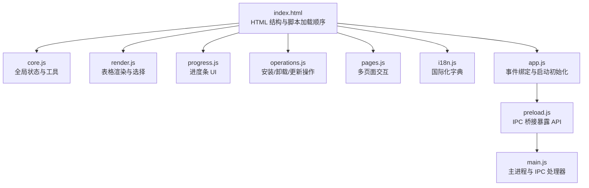
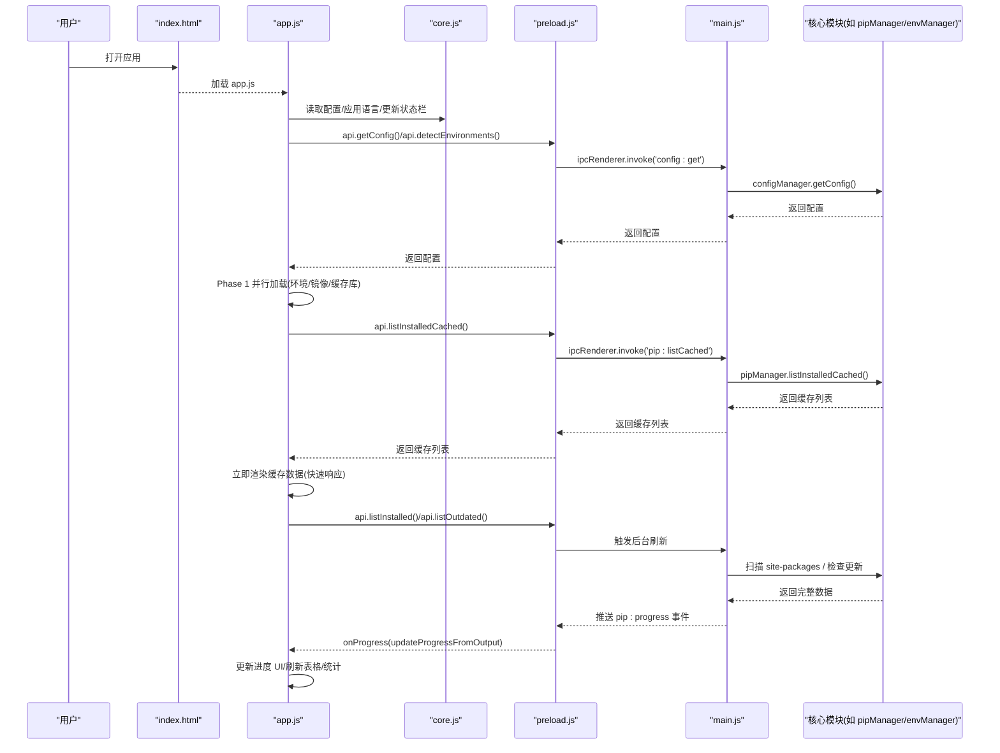
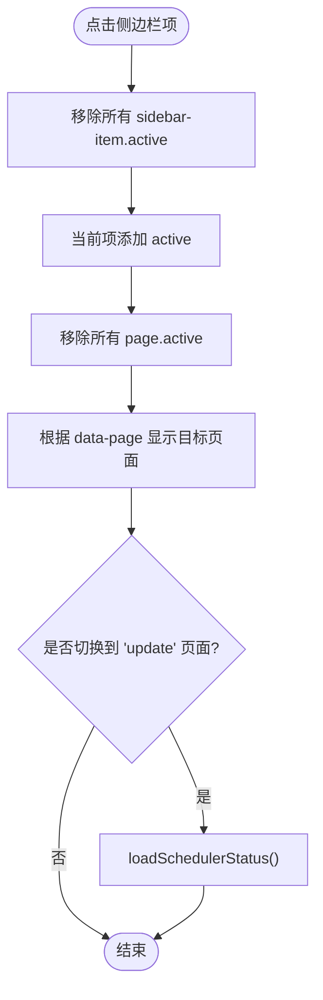
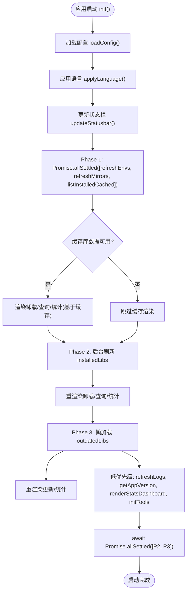
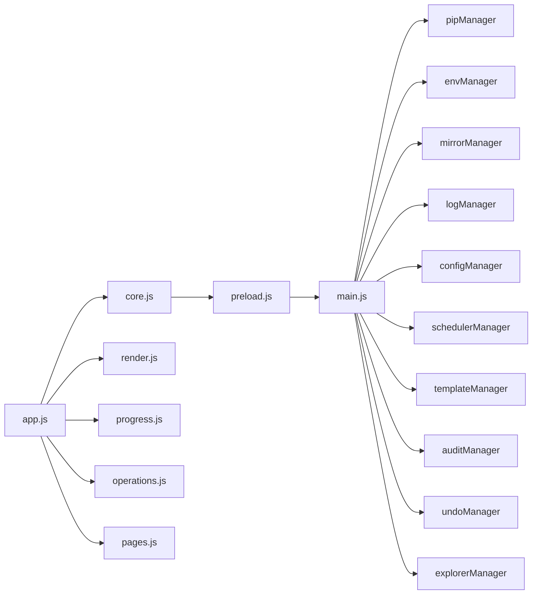

# 应用初始化模块 (app.js)

<cite>
**本文引用的文件**   
- [renderer/js/app.js](file://renderer/js/app.js)
- [main.js](file://main.js)
- [preload.js](file://preload.js)
- [renderer/index.html](file://renderer/index.html)
- [package.json](file://package.json)
- [renderer/js/core.js](file://renderer/js/core.js)
- [renderer/js/render.js](file://renderer/js/render.js)
- [renderer/js/progress.js](file://renderer/js/progress.js)
- [renderer/js/operations.js](file://renderer/js/operations.js)
- [renderer/js/pages.js](file://renderer/js/pages.js)
- [renderer/js/i18n.js](file://renderer/js/i18n.js)
</cite>

## 目录
1. [简介](#简介)
2. [项目结构](#项目结构)
3. [核心组件](#核心组件)
4. [架构总览](#架构总览)
5. [详细组件分析](#详细组件分析)
6. [依赖关系分析](#依赖关系分析)
7. [性能考量](#性能考量)
8. [故障排查指南](#故障排查指南)
9. [结论](#结论)
10. [附录：扩展指南](#附录扩展指南)

## 简介
本文件聚焦渲染进程入口 app.js，系统性阐述其作为“事件绑定与启动初始化”的核心职责。内容涵盖：
- 事件绑定机制（侧边栏导航、设置项、实时筛选）
- 页面导航系统
- 主题与语言切换
- 全局进度事件监听与应用更新事件
- 快捷键系统实现
- 分阶段加载策略（Phase 1-3）的并行执行与懒加载
- IPC 事件处理、错误处理策略与性能优化技巧
- 扩展指南：如何添加新页面与功能模块

## 项目结构
渲染进程由多个 JS 模块协作完成：
- core.js：全局状态与工具函数（API 桥接、i18n 引用、Toast、操作 ID 生成等）
- render.js：表格渲染与选择逻辑（卸载/更新/查询/镜像/环境/日志/统计）
- progress.js：进度条 UI（安装/更新/卸载/回滚共用）
- operations.js：三大核心操作（安装/卸载/更新）、拖拽安装、数据刷新
- pages.js：镜像/环境/日志/设置/自动更新等多页面交互
- i18n.js：中英文字典
- app.js：事件绑定与启动初始化（入口）

图表来源
- [renderer/index.html:14-22](file://renderer/index.html#L14-L22)
- [renderer/js/app.js:1-15](file://renderer/js/app.js#L1-L15)
- [preload.js:1-20](file://preload.js#L1-L20)
- [main.js:1-30](file://main.js#L1-L30)

章节来源
- [renderer/index.html:14-22](file://renderer/index.html#L14-L22)
- [renderer/js/app.js:1-15](file://renderer/js/app.js#L1-L15)

## 核心组件
- 事件绑定与导航：侧边栏点击切换页面，版本模式切换显示/隐藏输入框
- 主题与语言：主题切换（浅色/深色/跟随系统），语言切换（中文/英文）并即时应用
- 实时筛选：卸载页搜索、查询页搜索/筛选/排序、日志页筛选与搜索
- 全局事件：pip 操作进度、应用更新事件、主题变化、调度器执行结果
- 快捷键：Ctrl+F 聚焦搜索框、Ctrl+1~9 切换页面、Esc 关闭弹窗
- 启动流程：Phase 1-3 并行与懒加载，快速响应 + 后台刷新

章节来源
- [renderer/js/app.js:16-126](file://renderer/js/app.js#L16-L126)
- [renderer/js/app.js:128-210](file://renderer/js/app.js#L128-L210)

## 架构总览
渲染进程通过 preload.js 暴露 window.electronAPI，调用 main.js 中的 IPC 处理器，访问核心业务模块（pipManager、envManager、mirrorManager、logManager、configManager、schedulerManager 等）。app.js 负责将 DOM 事件与这些 API 连接，并在启动时按阶段加载数据，保证首屏快速可用。

图表来源
- [renderer/js/app.js:128-210](file://renderer/js/app.js#L128-L210)
- [preload.js:177-184](file://preload.js#L177-L184)
- [main.js:284-354](file://main.js#L284-L354)

## 详细组件分析

### 侧边栏导航与页面切换
- 点击 .sidebar-item 切换 active 类，根据 data-page 显示对应 #page-{id}
- 切换到“更新库”时加载定时调度器状态（loadSchedulerStatus）

图表来源
- [renderer/js/app.js:16-27](file://renderer/js/app.js#L16-L27)
- [renderer/js/pages.js:720-735](file://renderer/js/pages.js#L720-L735)

章节来源
- [renderer/js/app.js:16-27](file://renderer/js/app.js#L16-L27)

### 版本模式切换（安装页）
- 切换 install-version-mode 下拉框，控制 version-input-group 的显示/隐藏

章节来源
- [renderer/js/app.js:29-33](file://renderer/js/app.js#L29-L33)

### 主题与语言切换
- 主题切换：根据 data-theme 设置主题，若为 system 则获取系统主题；body 切换 dark 类
- 语言切换：设置 document.documentElement.lang，保存 language 配置，调用 applyLanguage 重新渲染文案

章节来源
- [renderer/js/app.js:35-62](file://renderer/js/app.js#L35-L62)
- [renderer/js/pages.js:358-374](file://renderer/js/pages.js#L358-L374)

### 实时筛选与设置项绑定
- 卸载页搜索：input 事件触发 renderUninstallTable
- 查询页：搜索/状态筛选/排序变化触发 renderQueryTable
- 日志页：类型筛选与搜索触发 renderLogs
- 设置项：线程数与重试次数变更保存到配置

章节来源
- [renderer/js/app.js:64-78](file://renderer/js/app.js#L64-L78)
- [renderer/js/render.js:167-205](file://renderer/js/render.js#L167-L205)
- [renderer/js/render.js:384-411](file://renderer/js/render.js#L384-L411)

### 全局进度事件与应用更新事件
- 绑定 pip 操作进度事件（onProgress），解析结构化进度或文本输出，更新进度 UI
- 绑定应用自动更新事件（bindUpdaterEvents），在“关于”页展示检查/下载/安装状态
- 监听主题变化（onThemeChanged）与可更新包数量（onUpdatesAvailable）
- 监听调度器执行结果（onSchedulerExecuted），提示并刷新日志

章节来源
- [renderer/js/app.js:80-103](file://renderer/js/app.js#L80-L103)
- [renderer/js/progress.js:101-141](file://renderer/js/progress.js#L101-L141)
- [renderer/js/pages.js:486-522](file://renderer/js/pages.js#L486-L522)

### 快捷键系统
- Ctrl+F：聚焦当前活动页面的搜索框
- Ctrl+1~9：切换侧边栏第 N 个页面
- Esc：关闭所有 show 状态的模态弹窗

章节来源
- [renderer/js/app.js:104-126](file://renderer/js/app.js#L104-L126)

### 启动流程的分阶段加载策略（Phase 1-3）
- Phase 1：并行加载环境、镜像、缓存库（Promise.allSettled），立即渲染缓存数据，提升首屏响应
- Phase 2：后台刷新已安装包完整列表（实时扫描 site-packages），完成后重渲染各表与统计
- Phase 3：懒加载可更新库列表（不阻塞启动），完成后渲染更新表与统计
- 低优先级：加载日志与应用版本，渲染统计仪表盘与工具箱初始化
- 等待后台任务完成（不阻塞 UI）

图表来源
- [renderer/js/app.js:128-210](file://renderer/js/app.js#L128-L210)

章节来源
- [renderer/js/app.js:128-210](file://renderer/js/app.js#L128-L210)

### 用户交互功能的实现原理
- 侧边栏导航：data-page 映射到页面 ID，切换 active 类
- 版本模式切换：根据下拉值控制输入框显隐
- 设置项绑定：线程数与重试次数变更直接写入配置
- 实时筛选：input/change 事件驱动渲染函数
- 进度事件：onProgress 解析结构化/文本输出，更新进度 UI
- 主题/语言：切换后持久化配置并即时应用

章节来源
- [renderer/js/app.js:16-78](file://renderer/js/app.js#L16-L78)
- [renderer/js/progress.js:101-141](file://renderer/js/progress.js#L101-L141)

## 依赖关系分析
- app.js 依赖 core.js（window.electronAPI、i18n、全局状态）
- app.js 调用 render.js、progress.js、operations.js、pages.js 的渲染与交互函数
- preload.js 暴露 electronAPI，转发 IPC 到 main.js
- main.js 注册大量 IPC 处理器，协调核心模块（pipManager、envManager、mirrorManager、logManager、configManager、schedulerManager、templateManager、auditManager、undoManager、explorerManager）

图表来源
- [renderer/js/app.js:1-15](file://renderer/js/app.js#L1-L15)
- [preload.js:20-221](file://preload.js#L20-L221)
- [main.js:16-31](file://main.js#L16-L31)

章节来源
- [renderer/js/app.js:1-15](file://renderer/js/app.js#L1-L15)
- [preload.js:20-221](file://preload.js#L20-L221)
- [main.js:16-31](file://main.js#L16-L31)

## 性能考量
- 并行加载：Phase 1 使用 Promise.allSettled 并行执行环境检测、镜像刷新与缓存库拉取，缩短首屏时间
- 懒加载：Phase 2/3 后台刷新完整数据，避免阻塞 UI
- 防抖与节流：窗口位置尺寸保存使用定时器防抖（main.js）
- 最小化重绘：仅在有数据时渲染空状态，减少不必要的 DOM 操作
- 进度事件解析：优先解析结构化进度消息，降低文本解析开销
- 低优先级任务：日志与版本信息在后台加载，不影响关键路径

章节来源
- [renderer/js/app.js:128-210](file://renderer/js/app.js#L128-L210)
- [main.js:90-101](file://main.js#L90-L101)
- [renderer/js/progress.js:101-141](file://renderer/js/progress.js#L101-L141)

## 故障排查指南
- 进度卡未隐藏：finishProgress 会延迟隐藏，确保无新操作进行时才隐藏；检查 progressOperation 状态
- 进度事件未触发：确认 onProgress 已绑定且主进程发送 pip:progress 事件；检查 payload 格式
- 主题/语言未生效：检查 applyLanguage 是否被调用，document.documentElement.lang 是否正确设置
- 快捷键无效：确认 keydown 监听未被其他元素拦截；检查 active 页面是否存在搜索框
- 启动卡顿：查看 Phase 1/2/3 异步任务是否抛出异常；检查缓存库是否可用
- IPC 通信失败：检查 preload.js 暴露的方法名与 main.js 处理器名称一致；确认 contextIsolation 与 nodeIntegration 配置

章节来源
- [renderer/js/progress.js:45-74](file://renderer/js/progress.js#L45-L74)
- [renderer/js/app.js:80-103](file://renderer/js/app.js#L80-L103)
- [renderer/js/pages.js:358-374](file://renderer/js/pages.js#L358-L374)
- [preload.js:177-184](file://preload.js#L177-L184)
- [main.js:59-66](file://main.js#L59-L66)

## 结论
app.js 作为渲染进程入口，承担了事件绑定、页面导航、主题/语言切换、实时筛选、全局进度与更新事件监听、快捷键系统等关键职责。通过分阶段加载策略（Phase 1-3）与并行执行优化，实现了快速首屏与后台数据刷新。配合 preload.js 与 main.js 的 IPC 体系，确保了安全高效的跨进程通信。整体架构清晰、职责明确，便于扩展与维护。

## 附录：扩展指南

### 新增页面步骤
- 在 index.html 中添加新的页面容器（例如 id="page-new"），并在侧边栏添加对应的 .sidebar-item[data-page="new"]
- 在 app.js 中确保侧边栏点击能切换该页面（已有通用逻辑，无需额外代码）
- 在 pages.js 或 operations.js 中实现页面交互逻辑（如加载数据、渲染表格、绑定事件）
- 如需数据刷新，在 refreshCurrentPage 的 switch 分支中添加对应页面的刷新逻辑

章节来源
- [renderer/index.html:60-119](file://renderer/index.html#L60-L119)
- [renderer/js/app.js:16-27](file://renderer/js/app.js#L16-L27)
- [renderer/js/operations.js:468-536](file://renderer/js/operations.js#L468-L536)

### 新增 IPC 接口
- 在 preload.js 中通过 contextBridge.exposeInMainWorld 暴露新方法（例如 newMethod）
- 在 main.js 中注册对应的 ipcMain.handle('xxx:newMethod', ...) 处理器
- 在 app.js 或其他渲染模块中通过 window.electronAPI.newMethod(...) 调用

章节来源
- [preload.js:20-221](file://preload.js#L20-L221)
- [main.js:234-640](file://main.js#L234-L640)

### 新增快捷键
- 在 app.js 的 keydown 监听中添加新的组合键判断
- 注意 e.preventDefault() 防止默认行为，并确保目标元素存在

章节来源
- [renderer/js/app.js:104-126](file://renderer/js/app.js#L104-L126)

### 新增主题/语言支持
- 在 i18n.js 中补充新的翻译键（zh 与 en）
- 在 pages.js 的 applyLanguage 中确保新元素被翻译（data-i18n 或 data-i18n-placeholder）
- 主题切换逻辑已在 app.js 中通用处理，只需确保 CSS 变量与 body.dark 类正确

章节来源
- [renderer/js/i18n.js:11-373](file://renderer/js/i18n.js#L11-L373)
- [renderer/js/pages.js:358-374](file://renderer/js/pages.js#L358-L374)
- [renderer/js/app.js:35-62](file://renderer/js/app.js#L35-L62)