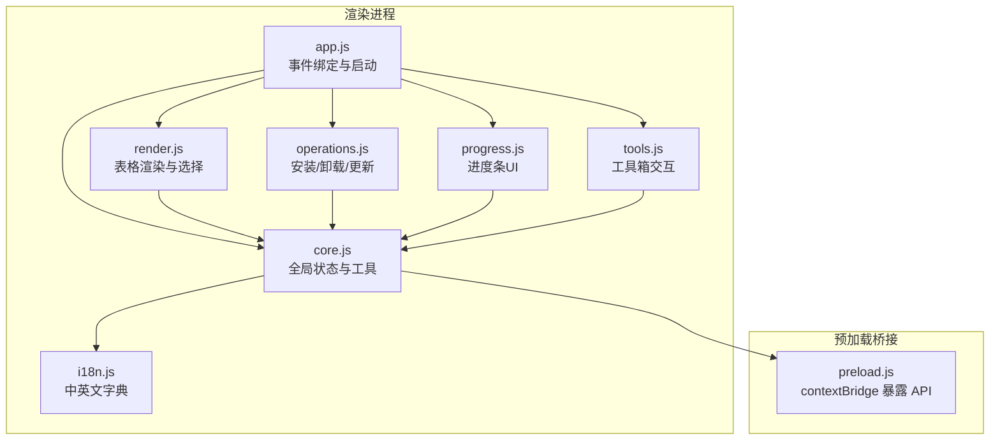
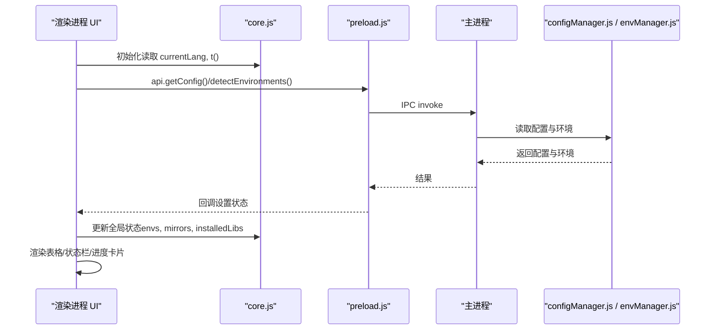
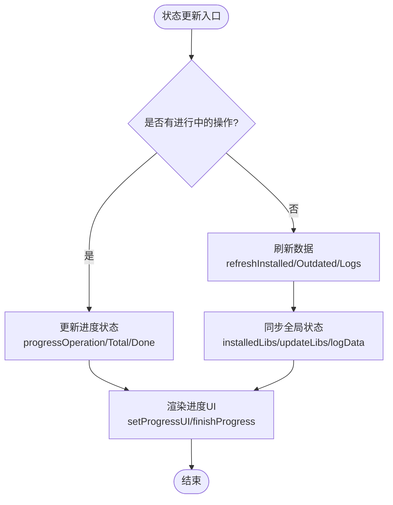
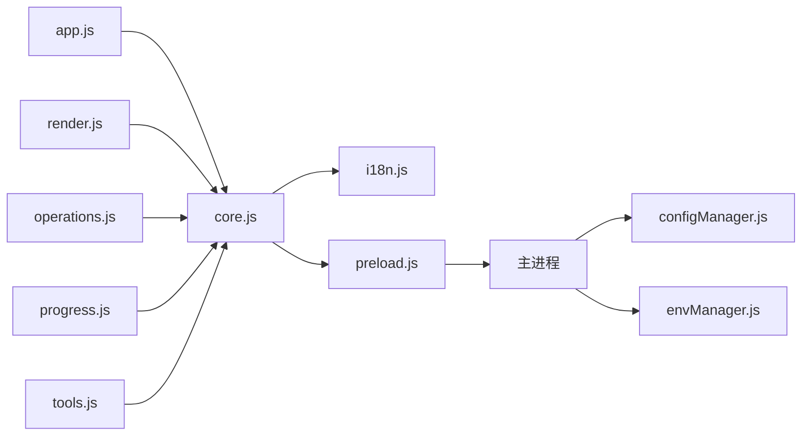

# 核心状态管理模块 (core.js)

<cite>
**本文引用的文件**   
- [renderer/js/core.js](file://renderer/js/core.js)
- [renderer/js/app.js](file://renderer/js/app.js)
- [renderer/js/render.js](file://renderer/js/render.js)
- [renderer/js/operations.js](file://renderer/js/operations.js)
- [renderer/js/progress.js](file://renderer/js/progress.js)
- [renderer/js/tools.js](file://renderer/js/tools.js)
- [renderer/js/i18n.js](file://renderer/js/i18n.js)
- [preload.js](file://preload.js)
- [core/config/configManager.js](file://core/config/configManager.js)
- [core/system/envManager.js](file://core/system/envManager.js)
- [package.json](file://package.json)
</cite>

## 目录
1. [简介](#简介)
2. [项目结构](#项目结构)
3. [核心组件](#核心组件)
4. [架构总览](#架构总览)
5. [详细组件分析](#详细组件分析)
6. [依赖关系分析](#依赖关系分析)
7. [性能考虑](#性能考虑)
8. [故障排查指南](#故障排查指南)
9. [结论](#结论)
10. [附录：最佳实践与扩展方法](#附录最佳实践与扩展方法)

## 简介
本文件聚焦 PyLibMaster 渲染进程中的“核心状态管理模块”，以 core.js 为中心，系统阐述全局状态变量的组织、更新机制、数据同步策略与内存优化；同时梳理工具函数库（DOM 操作封装、格式化、验证、异步辅助）、错误处理模式、日志记录机制与调试手段。文档还给出状态管理模式的最佳实践与可扩展点，帮助读者在不深入源码的情况下也能正确使用和扩展该模块。

## 项目结构
PyLibMaster 采用 Electron 多进程架构：主进程负责系统能力与 I/O，预加载脚本通过 contextBridge 暴露安全 API，渲染进程承载 UI 与交互。核心状态管理位于渲染进程的 renderer/js/core.js，配合 app.js 的启动流程、render.js 的表格渲染、operations.js 的操作执行、progress.js 的进度 UI、tools.js 的工具箱功能以及 i18n.js 的多语言字典，共同构成完整的渲染层状态与交互体系。

图表来源
- [renderer/js/core.js:1-93](file://renderer/js/core.js#L1-L93)
- [renderer/js/app.js:1-210](file://renderer/js/app.js#L1-L210)
- [renderer/js/render.js:1-445](file://renderer/js/render.js#L1-L445)
- [renderer/js/operations.js:1-536](file://renderer/js/operations.js#L1-L536)
- [renderer/js/progress.js:1-141](file://renderer/js/progress.js#L1-L141)
- [renderer/js/tools.js:1-795](file://renderer/js/tools.js#L1-L795)
- [renderer/js/i18n.js:1-373](file://renderer/js/i18n.js#L1-L373)
- [preload.js:1-221](file://preload.js#L1-L221)

章节来源
- [renderer/js/core.js:1-93](file://renderer/js/core.js#L1-L93)
- [renderer/js/app.js:1-210](file://renderer/js/app.js#L1-L210)
- [package.json:1-79](file://package.json#L1-L79)

## 核心组件
- 全局状态变量
  - 环境信息：currentLang、envs、currentEnvIndex
  - 包列表缓存：installedLibs、updateLibs、mirrors
  - 配置数据：appConfig（由 configManager 持久化）
  - 国际化文本：t(key) 基于 window.I18N
  - 操作与进度：progressOperation、progressTotal、progressDone、progressHideTimer、currentOperationId
  - 用户选择集合：selectedForUninstall、selectedForUpdate
  - 日志与统计：logData、todayInstalled、pendingUninstall、editingMirrorIndex
- 工具函数
  - HTML 转义（防 XSS）
  - Toast 提示（带类型与自动消失）
  - 唯一操作 ID 生成
  - 数值动画（animateStat）
  - 模态框关闭（closeModal）

章节来源
- [renderer/js/core.js:15-35](file://renderer/js/core.js#L15-L35)
- [renderer/js/core.js:39-93](file://renderer/js/core.js#L39-L93)
- [renderer/js/i18n.js:11-373](file://renderer/js/i18n.js#L11-L373)

## 架构总览
渲染进程通过 preload.js 暴露的 electronAPI 与主进程通信，完成环境检测、包操作、镜像源管理、日志与配置读写等。core.js 作为全局状态中心，被其他模块直接访问，避免重复声明与导入耦合。app.js 在启动时并行加载配置、环境、镜像与缓存库，优先展示缓存数据，后台再刷新完整数据，提升首屏响应速度。

图表来源
- [renderer/js/app.js:130-209](file://renderer/js/app.js#L130-L209)
- [preload.js:20-184](file://preload.js#L20-L184)
- [core/config/configManager.js:80-138](file://core/config/configManager.js#L80-L138)
- [core/system/envManager.js:85-170](file://core/system/envManager.js#L85-L170)

## 详细组件分析

### 全局状态与工具函数（core.js）
- 环境信息存储
  - currentLang：当前界面语言，影响 t(key) 输出与部分文案显示
  - envs/currentEnvIndex：Python 环境列表与当前索引，供 renderEnvs/updateStatusbar 使用
- 包列表缓存
  - installedLibs：已安装包列表，用于卸载页、查询页与统计
  - updateLibs：可更新包列表，用于更新页与查询页筛选
  - mirrors：镜像源列表，支持编辑、排序与默认标记
- 配置数据管理
  - appConfig：应用配置缓存，实际持久化由 configManager 负责
  - 通过 api.setConfig/getConfig 进行读写
- 国际化文本支持
  - t(key)：根据 currentLang 从 window.I18N 中取值，缺失回退 key
- 状态更新机制
  - 操作完成后调用 refreshAll() 或页面级刷新，确保 installedLibs/updateLibs/logData 与 UI 一致
  - 进度状态由 progressOperation/progressTotal/progressDone 驱动，finishProgress() 统一收尾
- 数据同步策略
  - 启动阶段 Promise.allSettled 并行加载，先展示缓存，后后台刷新真实数据
  - 操作后 Promise.all([refreshInstalled(), refreshOutdated()]) 保证一致性
- 内存管理优化
  - selectedForUninstall/selectedForUpdate 使用 Set，O(1) 增删查
  - 进度隐藏定时器在每次新操作前清理，避免泄漏
  - 大列表渲染前做过滤/分页（如依赖图谱限制节点数）

图表来源
- [renderer/js/operations.js:445-462](file://renderer/js/operations.js#L445-L462)
- [renderer/js/progress.js:20-74](file://renderer/js/progress.js#L20-L74)
- [renderer/js/core.js:15-35](file://renderer/js/core.js#L15-L35)

章节来源
- [renderer/js/core.js:15-35](file://renderer/js/core.js#L15-L35)
- [renderer/js/core.js:39-93](file://renderer/js/core.js#L39-L93)
- [renderer/js/app.js:130-209](file://renderer/js/app.js#L130-L209)
- [renderer/js/operations.js:445-462](file://renderer/js/operations.js#L445-L462)
- [renderer/js/progress.js:20-74](file://renderer/js/progress.js#L20-L74)

### 国际化与语言切换（i18n.js + app.js）
- 中文/英文双字典注册到 window.I18N，键名按模块.文案命名
- 语言切换时更新 document.documentElement.lang 并调用 applyLanguage() 重绘文案
- t(key) 提供快速翻译，未命中键回退为原始 key

章节来源
- [renderer/js/i18n.js:11-373](file://renderer/js/i18n.js#L11-L373)
- [renderer/js/app.js:52-62](file://renderer/js/app.js#L52-L62)

### 表格渲染与选择逻辑（render.js）
- 卸载页：toggleUninstallSelection、全选/取消全选、选择数量与按钮状态联动
- 更新页：toggleUpdateSelection、全选/搜索过滤、批量更新计数
- 查询页：关键词搜索、状态筛选（所有/已安装/有更新）、排序（时间/名称/大小）
- 镜像源页：编辑模式、测速显示、拖拽排序与持久化
- 环境页：Python 环境列表、虚拟环境列表与基础 Python 下拉选项
- 日志页：类型筛选与关键词搜索
- 统计与状态栏：animateStat 数字动画、updateStatusbar 实时反映环境与包数

章节来源
- [renderer/js/render.js:17-445](file://renderer/js/render.js#L17-L445)

### 操作执行与刷新（operations.js）
- 取消操作：cancelCurrentOperation 通过 operationId 通知主进程终止子进程
- 卸载：singleUninstall/batchUninstall/doUninstall，支持备份与回滚
- 更新：updateOne/updateAll/checkUpdates，支持并行、重试、回滚
- 安装：startInstall/installFromSelectedFile，支持 .txt/.whl 与 pip install 命令粘贴
- 数据刷新：refreshAll/refreshCurrentPage，按页面差异化刷新

章节来源
- [renderer/js/operations.js:15-536](file://renderer/js/operations.js#L15-L536)

### 进度条 UI（progress.js）
- resetProgress：新操作开始时重置进度卡片与定时器
- finishProgress：成功/失败状态、自动刷新日志、延迟隐藏
- setProgressUI：填充宽度、百分比、计数
- updateProgressFromOutput：解析结构化进度事件与 pip 输出，兼容卸载/回滚无结构化进度场景

章节来源
- [renderer/js/progress.js:1-141](file://renderer/js/progress.js#L1-L141)

### 工具箱（tools.js）
- 依赖图谱：单包树与全局力导向图，Canvas 高 DPI 适配、交互（缩放/平移/拖拽/双击重置）
- 磁盘空间分析：Top N 条形图，路径与总量展示
- 环境对比：requirements.txt 或环境对比，差异分类展示
- 离线下载：包名列表、目标目录、平台与依赖选项
- 操作撤销：canUndo/performUndo 状态刷新
- 系统集成：资源管理器右键菜单开关

章节来源
- [renderer/js/tools.js:1-795](file://renderer/js/tools.js#L1-L795)

### 预加载桥接（preload.js）
- 通过 contextBridge.exposeInMainWorld 暴露 electronAPI，包含窗口控制、环境管理、包操作、镜像源、日志、配置、主题、调度器、模板快照、审计、磁盘分析、离线下载、diff、版本历史、依赖图谱、环境诊断、撤销、Windows 资源管理器集成、进度事件监听、自动更新事件监听等
- 渲染进程通过 window.electronAPI.xxx() 调用，实现安全隔离

章节来源
- [preload.js:1-221](file://preload.js#L1-L221)

### 配置管理（configManager.js）
- 配置文件位置：userData/pylibmaster-config.json
- 默认值与范围校验：parallelThreads、retryCount 等
- 原子写入：临时文件+rename 避免损坏
- 获取/设置/批量设置：sanitizeValue 修正非法值，立即持久化

章节来源
- [core/config/configManager.js:1-194](file://core/config/configManager.js#L1-L194)

### 环境管理（envManager.js）
- 检测常见 Python 安装路径（含 Conda/Miniconda/Store）
- 并行获取 Python/pip 版本，过滤无 pip 的环境
- 恢复配置保存的当前环境，自动选择首个可用环境
- 切换环境并持久化

章节来源
- [core/system/envManager.js:1-220](file://core/system/envManager.js#L1-L220)

## 依赖关系分析
- 模块耦合
  - core.js 被 app.js、render.js、operations.js、progress.js、tools.js 直接引用
  - i18n.js 提供 window.I18N，core.js 的 t(key) 依赖它
  - operations.js 依赖 core.js 的全局状态与工具函数
  - progress.js 依赖 core.js 的进度状态变量
  - render.js 依赖 core.js 的数据与工具函数
- 外部依赖
  - preload.js 通过 IPC 与主进程通信，主进程使用 configManager/envManager 等核心模块
- 潜在循环依赖
  - 渲染层各模块仅通过全局状态与工具函数协作，未见循环 import
- 接口契约
  - electronAPI 定义了渲染进程可调用的方法集，需保持向后兼容

图表来源
- [renderer/js/core.js:1-93](file://renderer/js/core.js#L1-L93)
- [renderer/js/app.js:1-210](file://renderer/js/app.js#L1-L210)
- [renderer/js/render.js:1-445](file://renderer/js/render.js#L1-L445)
- [renderer/js/operations.js:1-536](file://renderer/js/operations.js#L1-L536)
- [renderer/js/progress.js:1-141](file://renderer/js/progress.js#L1-L141)
- [renderer/js/tools.js:1-795](file://renderer/js/tools.js#L1-L795)
- [preload.js:1-221](file://preload.js#L1-L221)
- [core/config/configManager.js:1-194](file://core/config/configManager.js#L1-L194)
- [core/system/envManager.js:1-220](file://core/system/envManager.js#L1-L220)

章节来源
- [renderer/js/core.js:1-93](file://renderer/js/core.js#L1-L93)
- [preload.js:1-221](file://preload.js#L1-L221)

## 性能考虑
- 启动性能
  - 使用 Promise.allSettled 并行加载配置、环境、镜像与缓存库，优先展示缓存数据，降低首屏等待
  - 后台刷新 installed/outdated 列表不阻塞 UI
- 渲染性能
  - 表格渲染前进行过滤与排序，减少 DOM 节点数量
  - 依赖图谱限制节点数（最多 80），避免 Canvas 绘制压力
- 内存管理
  - 使用 Set 管理选择集合，避免数组查找开销
  - 进度隐藏定时器在新操作前清理，防止内存泄漏
  - 配置写入采用原子操作，避免崩溃导致文件损坏
- I/O 优化
  - 批量配置更新 setBulk 只触发一次磁盘写入
  - 环境检测并行获取版本信息，缩短扫描时间

[本节为通用指导，无需特定文件来源]

## 故障排查指南
- 常见问题定位
  - 进度卡未隐藏：检查 finishProgress 是否被调用，确认 progressOperation 是否为空
  - 语言切换无效：确认 currentLang 更新与 applyLanguage 调用
  - 表格数据不同步：检查 refreshAll 是否在执行，确认 installedLibs/updateLibs 赋值
  - 取消操作无效：确认 currentOperationId 存在且 cancelPipOperation 调用成功
- 日志与调试
  - 操作日志：refreshLogs/renderLogs 查看最近操作结果
  - 控制台错误：app.js 启动阶段 try/catch 捕获 loadConfig 失败
  - 进度事件：onProgress 回调解析结构化事件与 pip 输出
- 配置问题
  - 配置文件损坏：configManager 自动重建默认配置
  - 数值越界：sanitizeValue 自动修正到合法范围

章节来源
- [renderer/js/app.js:130-136](file://renderer/js/app.js#L130-L136)
- [renderer/js/progress.js:45-74](file://renderer/js/progress.js#L45-L74)
- [renderer/js/operations.js:20-31](file://renderer/js/operations.js#L20-L31)
- [core/config/configManager.js:101-138](file://core/config/configManager.js#L101-L138)

## 结论
core.js 作为 PyLibMaster 渲染进程的核心状态管理中心，提供了稳定的全局状态、统一的工具函数与清晰的更新机制。结合 app.js 的启动策略、render.js 的渲染逻辑、operations.js 的操作执行、progress.js 的进度管理与 tools.js 的高级功能，形成了高效、可维护且易扩展的状态管理体系。遵循本文档的最佳实践与扩展建议，可在不破坏现有架构的前提下平滑增强功能。

[本节为总结性内容，无需特定文件来源]

## 附录：最佳实践与扩展方法
- 状态管理最佳实践
  - 单一事实来源：所有模块通过 core.js 的全局变量共享状态，避免重复声明
  - 明确更新边界：操作完成后集中调用 refreshAll/页面级刷新，保证数据一致性
  - 使用 Set/Map：选择集合与映射表优先使用 Set/Map，提升性能
  - 异步任务编排：使用 Promise.allSettled 并行加载，区分优先级与容错
- 自定义扩展方法
  - 新增全局状态：在 core.js 中声明变量，并在相关模块中直接访问
  - 新增工具函数：在 core.js 中补充，保持纯函数与无副作用
  - 新增国际化键：在 i18n.js 的 zh/en 字典中成对添加，确保 t(key) 可用
  - 新增 API：在 preload.js 中暴露 electronAPI 方法，主进程实现对应 IPC handler
- 错误处理与日志
  - 统一 showToast 提示，区分 ok/err/info/warn
  - 关键路径 try/catch 包裹，失败时降级与回退
  - 操作日志记录关键步骤，便于回溯与审计

章节来源
- [renderer/js/core.js:15-35](file://renderer/js/core.js#L15-L35)
- [renderer/js/core.js:39-93](file://renderer/js/core.js#L39-L93)
- [renderer/js/i18n.js:11-373](file://renderer/js/i18n.js#L11-L373)
- [preload.js:20-184](file://preload.js#L20-L184)