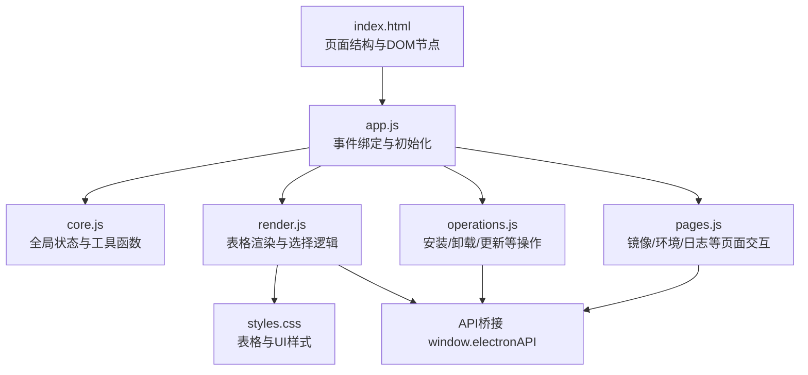
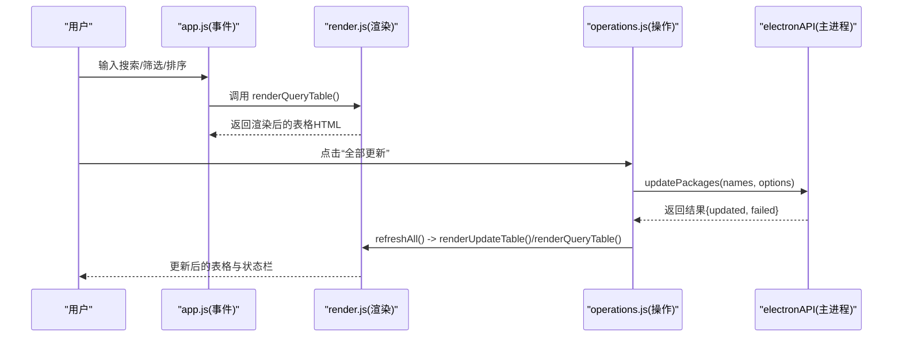
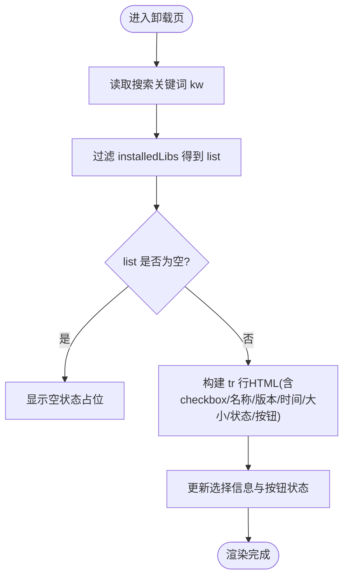
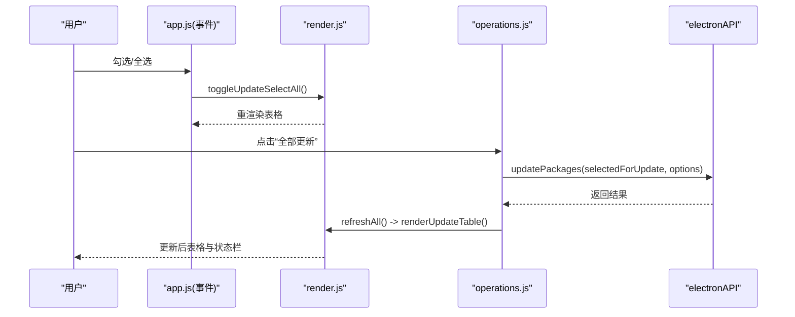
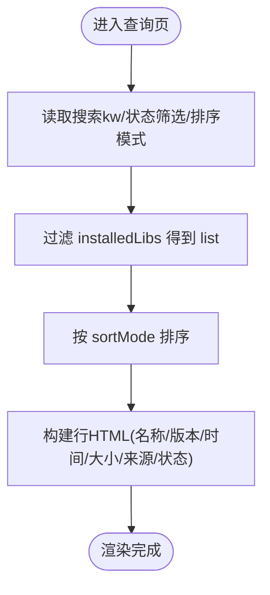
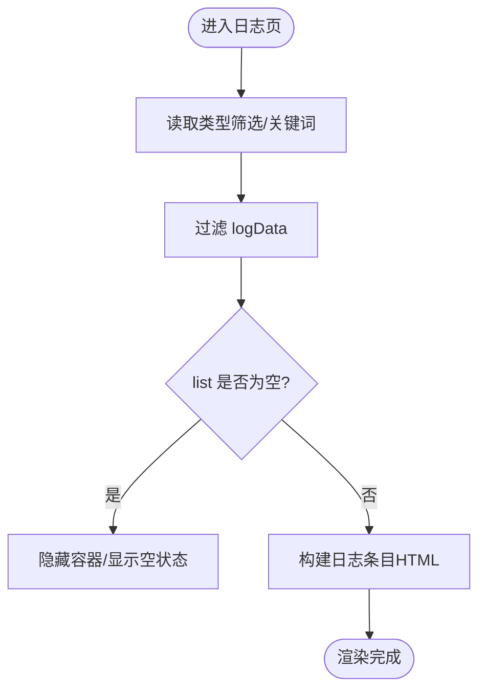
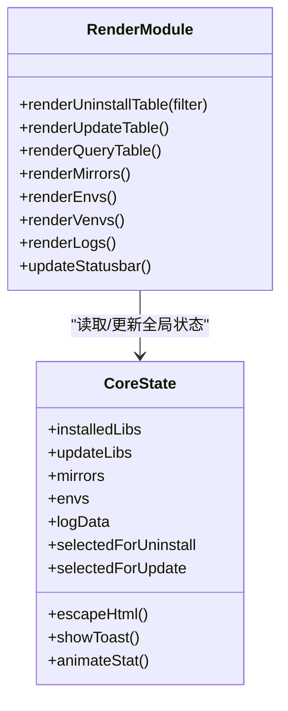
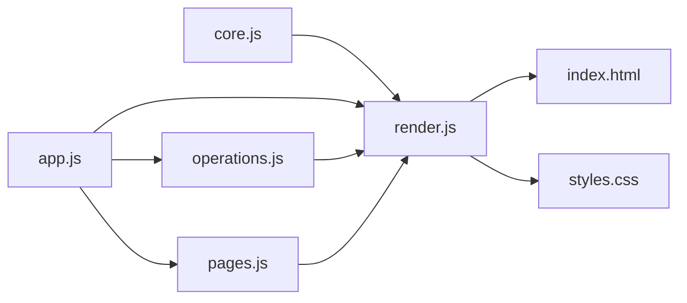

# 表格渲染模块 (render.js)

<cite>
**本文引用的文件**   
- [renderer/js/render.js](file://renderer/js/render.js)
- [renderer/js/core.js](file://renderer/js/core.js)
- [renderer/js/app.js](file://renderer/js/app.js)
- [renderer/js/operations.js](file://renderer/js/operations.js)
- [renderer/js/pages.js](file://renderer/js/pages.js)
- [renderer/index.html](file://renderer/index.html)
- [renderer/styles.css](file://renderer/styles.css)
</cite>

## 目录
1. [简介](#简介)
2. [项目结构](#项目结构)
3. [核心组件](#核心组件)
4. [架构总览](#架构总览)
5. [详细组件分析](#详细组件分析)
6. [依赖关系分析](#依赖关系分析)
7. [性能与内存优化](#性能与内存优化)
8. [故障排查指南](#故障排查指南)
9. [结论](#结论)
10. [附录：扩展与自定义指南](#附录扩展与自定义指南)

## 简介
本文件聚焦于 PyLibMaster 的表格渲染模块（render.js），系统性梳理并解释以下表格的渲染逻辑与交互实现：
- 已安装库表格（卸载页）
- 可更新库表格（更新页）
- 查询结果表格（查询页）
- 日志表格（日志页）
- 镜像源列表与环境/虚拟环境卡片式列表

文档将覆盖：
- 搜索过滤、状态筛选、排序的实现原理
- 选择状态管理（全选/取消全选/批量操作）
- 动态按钮生成与状态标识
- 数据格式化显示与安全转义
- 性能优化策略（当前实现为全量 DOM 渲染，未使用虚拟滚动；提供优化建议）
- 分页处理（当前未实现；提供方案）
- 自定义表格组件开发指南与扩展方法

## 项目结构
渲染模块位于 renderer/js/render.js，配合全局状态 core.js、事件绑定 app.js、操作逻辑 operations.js、页面交互 pages.js、HTML 模板 index.html 以及样式 styles.css 共同完成。

图表来源
- [renderer/index.html:1-120](file://renderer/index.html#L1-L120)
- [renderer/js/app.js:1-120](file://renderer/js/app.js#L1-L120)
- [renderer/js/core.js:1-60](file://renderer/js/core.js#L1-L60)
- [renderer/js/render.js:1-80](file://renderer/js/render.js#L1-L80)
- [renderer/js/operations.js:1-120](file://renderer/js/operations.js#L1-L120)
- [renderer/js/pages.js:1-120](file://renderer/js/pages.js#L1-L120)
- [renderer/styles.css:200-260](file://renderer/styles.css#L200-L260)

章节来源
- [renderer/index.html:1-120](file://renderer/index.html#L1-L120)
- [renderer/js/app.js:1-120](file://renderer/js/app.js#L1-L120)
- [renderer/js/core.js:1-60](file://renderer/js/core.js#L1-L60)

## 核心组件
- render.js：负责各页面表格渲染、选择状态管理、镜像源拖拽排序、环境与虚拟环境列表渲染、日志渲染、统计卡片与状态栏更新。
- core.js：提供全局状态变量（installedLibs、updateLibs、mirrors、envs、logData、selectedForUninstall、selectedForUpdate 等）、国际化 t(key)、HTML 转义 escapeHtml、Toast 提示、数值动画 animateStat、操作ID生成等。
- app.js：事件绑定（侧边栏切换、搜索实时过滤、语言主题切换、快捷键、启动流程）。
- operations.js：安装/卸载/更新操作执行、进度控制、刷新数据 refreshAll、当前页面刷新 refreshCurrentPage。
- pages.js：镜像源设置/编辑/删除/测速/智能路由、环境切换/修复 pip、虚拟环境创建/删除/使用、日志导出/清空、包详情弹窗、调度器配置等。
- index.html：页面结构与表格容器（tbody、空状态占位、筛选控件、按钮等）。
- styles.css：表格样式、标签、进度条、镜像源列表、日志条目、筛选行、状态栏、模态框、Toast、响应式布局等。

章节来源
- [renderer/js/render.js:1-120](file://renderer/js/render.js#L1-L120)
- [renderer/js/core.js:1-93](file://renderer/js/core.js#L1-L93)
- [renderer/js/app.js:1-210](file://renderer/js/app.js#L1-L210)
- [renderer/js/operations.js:1-200](file://renderer/js/operations.js#L1-L200)
- [renderer/js/pages.js:1-200](file://renderer/js/pages.js#L1-L200)
- [renderer/index.html:218-420](file://renderer/index.html#L218-L420)
- [renderer/styles.css:200-350](file://renderer/styles.css#L200-L350)

## 架构总览
渲染模块采用“全局状态 + 多页面渲染函数”的模式：
- 数据层：core.js 维护全局数组与集合（如 installedLibs、updateLibs、selectedForUninstall、selectedForUpdate）。
- 视图层：render.js 根据全局状态生成 HTML 片段并注入到对应 tbody 或容器。
- 交互层：app.js 绑定输入/选择/点击事件，触发 render.js 的渲染函数或 operations.js 的操作函数。
- 业务层：operations.js 调用 electronAPI 进行后端操作，完成后统一刷新数据并重渲染。

图表来源
- [renderer/js/app.js:60-120](file://renderer/js/app.js#L60-L120)
- [renderer/js/render.js:160-210](file://renderer/js/render.js#L160-L210)
- [renderer/js/operations.js:170-220](file://renderer/js/operations.js#L170-L220)

## 详细组件分析

### 已安装库表格（卸载页）
- 渲染函数：renderUninstallTable(filter = '')
- 功能要点：
  - 基于 installedLibs 按名称模糊匹配（toLowerCase().includes(kw)）
  - 每行包含复选框、库名（可点击查看详情）、版本、安装时间、大小、状态标签、卸载按钮
  - 选择状态由 selectedForUninstall Set 维护，支持全选/取消全选 toggleSelectAll()
  - 选择信息通过 updateSelectionInfo() 更新按钮禁用状态与文案
- 安全：所有用户输入通过 escapeHtml 转义，防止 XSS
- 交互：点击库名 showPackageDetail(name)，点击卸载 singleUninstall(name)

图表来源
- [renderer/js/render.js:58-78](file://renderer/js/render.js#L58-L78)
- [renderer/js/core.js:40-52](file://renderer/js/core.js#L40-L52)

章节来源
- [renderer/js/render.js:58-78](file://renderer/js/render.js#L58-L78)
- [renderer/js/core.js:40-52](file://renderer/js/core.js#L40-L52)

### 可更新库表格（更新页）
- 渲染函数：renderUpdateTable()
- 功能要点：
  - 支持搜索过滤（update-search 输入框）
  - 每行包含复选框、库名、当前版本、最新版本、发布日期、更新按钮
  - 选择状态由 selectedForUpdate Set 维护，支持全选/取消全选 toggleUpdateSelectAll()
  - 空状态文案根据是否有搜索结果动态切换
- 交互：点击更新按钮 updateOne(name, btn) 触发单包更新；“全部更新” updateAll() 批量更新

图表来源
- [renderer/js/render.js:121-157](file://renderer/js/render.js#L121-L157)
- [renderer/js/operations.js:170-217](file://renderer/js/operations.js#L170-L217)

章节来源
- [renderer/js/render.js:121-157](file://renderer/js/render.js#L121-L157)
- [renderer/js/operations.js:170-217](file://renderer/js/operations.js#L170-L217)

### 查询结果表格（查询页）
- 渲染函数：renderQueryTable()
- 功能要点：
  - 支持关键词搜索（query-search）
  - 支持状态筛选（query-status-filter：所有/已安装/有更新）
  - 支持排序（query-sort：时间新旧、名称、大小）
  - 每行包含库名、版本、安装时间、大小、来源、状态标签（最新/有更新）
- 算法复杂度：
  - 过滤：O(n)
  - 排序：O(n log n)
  - 渲染：O(n)

图表来源
- [renderer/js/render.js:167-205](file://renderer/js/render.js#L167-L205)

章节来源
- [renderer/js/render.js:167-205](file://renderer/js/render.js#L167-L205)

### 日志表格（日志页）
- 渲染函数：renderLogs()
- 功能要点：
  - 支持类型筛选（log-type-filter）与关键词搜索（log-search）
  - 每行展示 action/detail、time、成功/失败标签
  - 空状态与容器显隐由 list.length 控制
- 数据来源：logData（refreshLogs() 从 API 获取）

图表来源
- [renderer/js/render.js:384-411](file://renderer/js/render.js#L384-L411)

章节来源
- [renderer/js/render.js:384-411](file://renderer/js/render.js#L384-L411)

### 镜像源列表与环境/虚拟环境列表
- 镜像源列表：renderMirrors()
  - 支持显示模式与编辑模式切换（editingMirrorIndex）
  - 显示测速结果（速度分类样式）、默认标记、备注
  - 支持拖拽排序（dragstart/dragover/drop），持久化顺序到主进程
- 环境列表：renderEnvs()
  - 检测 Python 环境，无环境时显示空状态
- 虚拟环境列表：renderVenvs()
  - 显示 venv 名称、Python/pip 版本、包数量
  - 提供“使用”和“删除”按钮

图表来源
- [renderer/js/render.js:215-338](file://renderer/js/render.js#L215-L338)
- [renderer/js/core.js:15-36](file://renderer/js/core.js#L15-L36)

章节来源
- [renderer/js/render.js:215-338](file://renderer/js/render.js#L215-L338)

## 依赖关系分析
- render.js 依赖 core.js 的全局状态与工具函数（t、escapeHtml、animateStat、showToast）
- app.js 作为入口，绑定事件并调用 render.js 与 operations.js
- operations.js 调用 electronAPI 进行后端操作，完成后调用 refreshAll() 触发多页面重渲染
- pages.js 处理镜像源、环境、日志、调度器等页面交互，间接影响表格数据与渲染

图表来源
- [renderer/js/core.js:1-60](file://renderer/js/core.js#L1-L60)
- [renderer/js/app.js:1-120](file://renderer/js/app.js#L1-L120)
- [renderer/js/operations.js:1-120](file://renderer/js/operations.js#L1-L120)
- [renderer/js/pages.js:1-120](file://renderer/js/pages.js#L1-L120)

章节来源
- [renderer/js/core.js:1-60](file://renderer/js/core.js#L1-L60)
- [renderer/js/app.js:1-120](file://renderer/js/app.js#L1-L120)
- [renderer/js/operations.js:1-120](file://renderer/js/operations.js#L1-L120)
- [renderer/js/pages.js:1-120](file://renderer/js/pages.js#L1-L120)

## 性能与内存优化
当前实现说明：
- 渲染方式：全量 innerHTML 替换，未使用虚拟滚动或分页
- 过滤与排序：在内存中直接对数组进行过滤与排序，时间复杂度 O(n) 与 O(n log n)
- 选择状态：使用 Set 存储选中项，避免重复与提升查找效率
- 安全：escapeHtml 对所有用户输入进行转义，防止 XSS

优化建议（按需实施）：
- 虚拟滚动：当 installedLibs/updateLibs/logData 规模较大（>1000 行）时，引入可视区域渲染（仅渲染可见行），减少 DOM 节点数量，提升滚动性能
- 分页处理：对查询结果与日志列表实现服务端或前端分页，降低单次渲染压力
- 防抖/节流：对搜索输入与筛选变化增加 debounce（如 200ms），减少频繁重渲染
- 增量更新：对少量数据变更（如新增一条日志）采用 append/prepend 而非整表重建
- 缓存中间结果：对过滤/排序结果进行缓存，避免重复计算
- 异步渲染：使用 requestIdleCallback 或分片渲染，避免阻塞主线程

[本节为通用优化建议，不直接分析具体文件]

## 故障排查指南
常见问题与定位方法：
- 表格为空：检查对应 tbody 是否存在、empty 状态是否被错误显示；确认数据刷新函数（refreshInstalled/refreshOutdated/refreshLogs）是否成功
- 选择状态异常：检查 selectedForUninstall/selectedForUpdate Set 是否正确维护；全选/取消全选逻辑是否触发
- 搜索/筛选无效：确认输入框 ID 与事件绑定是否正确；过滤条件逻辑是否符合预期
- 排序失效：检查 query-sort 值与排序分支逻辑；localeCompare 与数值比较是否正确
- 镜像源拖拽失效：确认 dragstart/dragover/drop 事件绑定；ensure mirrors.splice 索引正确
- 日志不更新：确认 refreshLogs() 调用与 renderLogs() 重渲染；检查 logData 数据源

章节来源
- [renderer/js/render.js:58-78](file://renderer/js/render.js#L58-L78)
- [renderer/js/render.js:121-157](file://renderer/js/render.js#L121-L157)
- [renderer/js/render.js:167-205](file://renderer/js/render.js#L167-L205)
- [renderer/js/render.js:384-411](file://renderer/js/render.js#L384-L411)
- [renderer/js/operations.js:402-459](file://renderer/js/operations.js#L402-L459)

## 结论
render.js 模块以清晰的分函数职责组织各页面表格渲染逻辑，结合 core.js 的全局状态管理与 app.js 的事件绑定，实现了完整的安装/卸载/更新/查询/日志/镜像源/环境等表格渲染与交互。当前实现注重简洁与可读性，未引入虚拟滚动与分页，但在大规模数据场景下可通过上述优化建议进一步提升性能与用户体验。

[本节为总结性内容，不直接分析具体文件]

## 附录：扩展与自定义指南
- 新增表格列：在对应 render*Table 函数中修改模板字符串，添加新字段与样式类
- 新增筛选/排序：在 renderQueryTable 中添加新的 filter/sort 分支，并在 HTML 中补充控件与事件绑定
- 自定义表格组件：封装一个通用的 renderTable(data, columns, actions) 函数，传入数据、列定义与操作回调，减少重复代码
- 集成虚拟滚动：在 tbody 外层包裹虚拟滚动容器，监听滚动事件，计算可见区间并渲染对应行
- 集成分页：在数据层增加 page/pageSize，渲染前截取 slice(start, end)，并提供分页控件与跳转逻辑
- 国际化扩展：在 i18n.js 中补充新键值，确保 t(key) 能正确翻译按钮与状态文案

章节来源
- [renderer/js/render.js:167-205](file://renderer/js/render.js#L167-L205)
- [renderer/js/core.js:15-36](file://renderer/js/core.js#L15-L36)
- [renderer/index.html:375-420](file://renderer/index.html#L375-L420)
- [renderer/styles.css:200-260](file://renderer/styles.css#L200-L260)