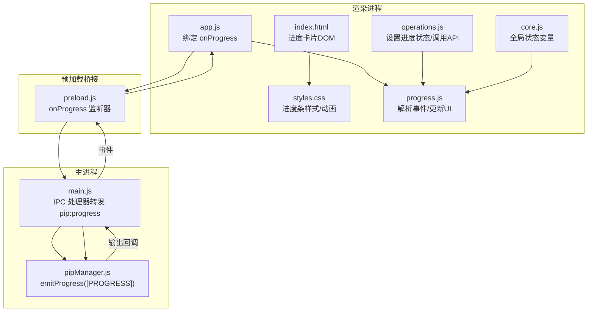
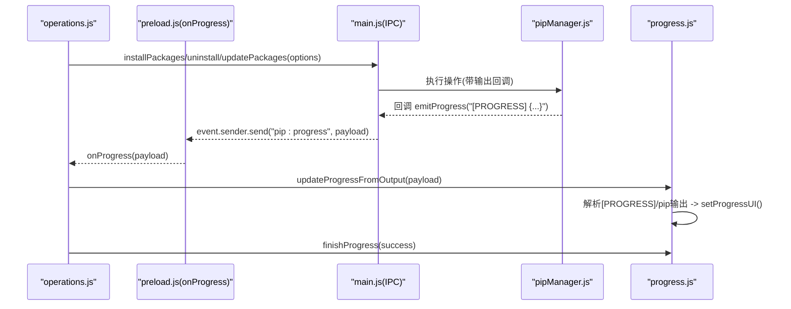

# 进度显示模块 (progress.js)

<cite>
**本文引用的文件**   
- [renderer/js/progress.js](file://renderer/js/progress.js)
- [renderer/index.html](file://renderer/index.html)
- [renderer/styles.css](file://renderer/styles.css)
- [renderer/js/core.js](file://renderer/js/core.js)
- [renderer/js/app.js](file://renderer/js/app.js)
- [renderer/js/operations.js](file://renderer/js/operations.js)
- [preload.js](file://preload.js)
- [main.js](file://main.js)
- [core/operations/pipManager.js](file://core/operations/pipManager.js)
</cite>

## 目录
1. [简介](#简介)
2. [项目结构](#项目结构)
3. [核心组件](#核心组件)
4. [架构总览](#架构总览)
5. [详细组件分析](#详细组件分析)
6. [依赖关系分析](#依赖关系分析)
7. [性能与体验优化](#性能与体验优化)
8. [故障排查指南](#故障排查指南)
9. [结论](#结论)
10. [附录：自定义与样式定制](#附录自定义与样式定制)

## 简介
本文件为 PyLibMaster 的“进度显示模块”技术文档，聚焦于 renderer/js/progress.js 的实现。内容涵盖：
- 进度条 UI 渲染、动画效果、状态管理、实时更新机制
- 进度数据的接收与处理、百分比计算、当前包名展示
- 多场景支持：单任务进度、多任务并行进度、批量操作进度
- 中断、暂停恢复（通过取消）、错误提示等交互
- 扩展与定制指南：如何新增进度类型、样式主题适配、事件接入

## 项目结构
进度模块由前端渲染层（HTML/CSS/JS）与主进程 IPC 通道共同协作完成：
- HTML 提供安装/更新进度卡片 DOM 结构
- CSS 定义进度条样式、成功/失败态颜色、过渡动画
- progress.js 负责解析后端推送的结构化进度事件，更新 UI
- operations.js 在发起安装/卸载/更新时设置全局进度状态并触发 UI
- app.js 绑定 onProgress 事件到 updateProgressFromOutput
- preload.js 暴露 onProgress 监听器
- main.js 将 pipManager 的输出回调转发为 pip:progress 事件
- pipManager.js 发送结构化 [PROGRESS] 事件，供前端可靠计数



图表来源
- [renderer/index.html:196-214](file://renderer/index.html#L196-L214)
- [renderer/styles.css:225-235](file://renderer/styles.css#L225-L235)
- [renderer/js/app.js:80-84](file://renderer/js/app.js#L80-L84)
- [renderer/js/progress.js:1-141](file://renderer/js/progress.js#L1-L141)
- [renderer/js/operations.js:80-113](file://renderer/js/operations.js#L80-L113)
- [renderer/js/core.js:29-34](file://renderer/js/core.js#L29-L34)
- [preload.js:177-184](file://preload.js#L177-L184)
- [main.js:310-348](file://main.js#L310-L348)
- [core/operations/pipManager.js:55-63](file://core/operations/pipManager.js#L55-L63)

章节来源
- [renderer/index.html:196-214](file://renderer/index.html#L196-L214)
- [renderer/styles.css:225-235](file://renderer/styles.css#L225-L235)
- [renderer/js/app.js:80-84](file://renderer/js/app.js#L80-L84)
- [renderer/js/progress.js:1-141](file://renderer/js/progress.js#L1-L141)
- [renderer/js/operations.js:80-113](file://renderer/js/operations.js#L80-L113)
- [renderer/js/core.js:29-34](file://renderer/js/core.js#L29-L34)
- [preload.js:177-184](file://preload.js#L177-L184)
- [main.js:310-348](file://main.js#L310-L348)
- [core/operations/pipManager.js:55-63](file://core/operations/pipManager.js#L55-L63)

## 核心组件
- 进度状态全局变量（core.js）
  - progressOperation：当前操作类型（install/uninstall/update/rollback）
  - progressTotal/progressDone：总数与已完成数
  - progressHideTimer：延迟隐藏进度卡片的定时器
  - currentOperationId：用于取消操作的唯一 ID
- 进度 UI 函数（progress.js）
  - resetProgress(total)：重置进度条、百分比、计数、状态文本
  - finishProgress(success)：设置最终状态（成功/失败），刷新日志，延迟隐藏卡片
  - setProgressUI(prefix, pct)：更新填充宽度、百分比、计数
  - updateProgressFromOutput(payload)：解析结构化 [PROGRESS] 事件与 pip 原始输出，更新 UI
- 操作入口（operations.js）
  - 安装/卸载/更新流程中设置 progressOperation、progressTotal、progressDone，调用 API，完成后调用 finishProgress(true/false)
- 事件绑定（app.js）
  - api.onProgress(updateProgressFromOutput) 绑定实时进度事件

章节来源
- [renderer/js/core.js:29-34](file://renderer/js/core.js#L29-L34)
- [renderer/js/progress.js:20-88](file://renderer/js/progress.js#L20-L88)
- [renderer/js/progress.js:101-141](file://renderer/js/progress.js#L101-L141)
- [renderer/js/operations.js:80-113](file://renderer/js/operations.js#L80-L113)
- [renderer/js/operations.js:134-163](file://renderer/js/operations.js#L134-L163)
- [renderer/js/operations.js:170-217](file://renderer/js/operations.js#L170-L217)
- [renderer/js/app.js:80-84](file://renderer/js/app.js#L80-L84)

## 架构总览
进度数据从主进程 pipManager 发出，经 main.js 的 IPC 处理器转发至渲染进程，再由 progress.js 解析并更新 UI。



图表来源
- [renderer/js/operations.js:337-344](file://renderer/js/operations.js#L337-L344)
- [main.js:310-348](file://main.js#L310-L348)
- [core/operations/pipManager.js:55-63](file://core/operations/pipManager.js#L55-L63)
- [preload.js:177-184](file://preload.js#L177-L184)
- [renderer/js/progress.js:101-141](file://renderer/js/progress.js#L101-L141)

## 详细组件分析

### 进度条 UI 渲染与动画
- DOM 结构
  - 安装页进度卡片：id="install-progress"，包含进度名称、百分比、进度条、计数、状态、取消按钮
  - 更新页进度卡片：id="update-progress"，结构与安装页一致，元素 ID 以 "update-" 前缀区分
- 样式与动画
  - .progress-bar/.progress-fill/.progress-pct/.progress-stats/.progress-status-ok/.progress-status-err
  - 进度条宽度使用 CSS transition: width 0.3s ease 实现平滑动画
  - 失败态通过 .progress-fill-err 切换红色背景

章节来源
- [renderer/index.html:196-214](file://renderer/index.html#L196-L214)
- [renderer/index.html:311-329](file://renderer/index.html#L311-L329)
- [renderer/styles.css:225-235](file://renderer/styles.css#L225-L235)

### 状态管理与实时更新机制
- 全局状态
  - progressOperation：决定使用哪个进度卡片（install 或 update）
  - progressTotal/progressDone：用于百分比与计数
  - progressHideTimer：避免重复隐藏
- 实时更新
  - app.js 绑定 onProgress(updateProgressFromOutput)
  - updateProgressFromOutput 解析 [PROGRESS] 事件，累加 progressDone，计算百分比，调用 setProgressUI
  - 对无结构化进度的场景（uninstall/rollback），通过匹配 pip 输出关键字推断完成并更新计数

章节来源
- [renderer/js/core.js:29-34](file://renderer/js/core.js#L29-L34)
- [renderer/js/app.js:80-84](file://renderer/js/app.js#L80-L84)
- [renderer/js/progress.js:101-141](file://renderer/js/progress.js#L101-L141)

### 进度数据处理与百分比计算
- 结构化事件格式
  - [PROGRESS] {"done":1, "pkg":"xxx", "status":"ok"}
  - done 表示本次完成的数量（通常为 1），pkg 为当前包名，status 为 ok/fail
- 百分比计算
  - pct = Math.min(100, Math.round((progressDone / Math.max(1, progressTotal)) * 100))
- 包名更新
  - 优先使用结构化事件的 pkg；若无，则从 pip 下载/安装输出中提取包名

章节来源
- [renderer/js/progress.js:101-141](file://renderer/js/progress.js#L101-L141)

### 不同进度场景的支持
- 单任务进度
  - 安装单个库、更新单个库：progressTotal=1，resetProgress(1)，finishProgress(true/false)
- 多任务并行进度
  - 批量安装/更新：progressTotal=libs.length，每个包完成时 emitProgress(done=1)，累计 progressDone
- 批量操作进度
  - 卸载/回滚：无结构化事件时，通过匹配 "Successfully installed"/"Successfully uninstalled" 推断完成并计数

章节来源
- [renderer/js/operations.js:331-344](file://renderer/js/operations.js#L331-L344)
- [renderer/js/operations.js:170-217](file://renderer/js/operations.js#L170-L217)
- [renderer/js/progress.js:121-128](file://renderer/js/progress.js#L121-L128)

### 进度中断、暂停恢复、错误提示
- 中断（取消）
  - operations.js 提供 cancelCurrentOperation()，通过 api.cancelPipOperation(operationId) 通知主进程终止子进程
  - 取消后 UI 保持当前进度状态，用户可重新发起操作
- 暂停恢复
  - 当前未实现显式暂停/恢复；可通过取消后再次启动实现“恢复”
- 错误提示
  - finishProgress(false) 设置状态为失败，进度条变红，Toast 提示错误信息
  - 操作日志页面自动刷新，确保结果可见

章节来源
- [renderer/js/operations.js:20-31](file://renderer/js/operations.js#L20-L31)
- [renderer/js/progress.js:45-74](file://renderer/js/progress.js#L45-L74)

### 预估时间显示
- 当前实现未包含剩余时间/ETA 计算；如需扩展，可在 updateProgressFromOutput 中基于历史速率估算 ETA，并在 UI 增加对应字段

章节来源
- [renderer/js/progress.js:101-141](file://renderer/js/progress.js#L101-L141)

## 依赖关系分析
- 模块耦合
  - progress.js 依赖 core.js 的全局状态变量
  - progress.js 被 app.js 通过 onProgress 绑定驱动
  - operations.js 控制进度生命周期（开始/结束）
  - main.js 作为 IPC 中转，将 pipManager 的回调转为 pip:progress 事件
  - pipManager.js 发送结构化 [PROGRESS] 事件，保证计数可靠性
- 外部依赖
  - Electron IPC（ipcRenderer/ipcMain）
  - 浏览器 DOM API（getElementById/style/textContent）

```mermaid
classDiagram
class Core {
+progressOperation
+progressTotal
+progressDone
+progressHideTimer
+currentOperationId
}
class Progress {
+resetProgress(total)
+finishProgress(success)
+setProgressUI(prefix,pct)
+updateProgressFromOutput(payload)
}
class Operations {
+startInstall()
+batchUninstall()
+updateAll()
+cancelCurrentOperation()
}
class App {
+onProgress(callback)
}
class Preload {
+onProgress(callback)
}
class Main {
+pip : install/uninstall/update handlers
}
class PipManager {
+emitProgress(onOutput,pkg,status)
}
Progress --> Core : "读取/写入全局状态"
App --> Preload : "绑定事件"
Preload --> Main : "IPC pip : progress"
Main --> PipManager : "调用并转发回调"
Operations --> Progress : "设置状态/调用finish"
```

图表来源
- [renderer/js/core.js:29-34](file://renderer/js/core.js#L29-L34)
- [renderer/js/progress.js:20-88](file://renderer/js/progress.js#L20-L88)
- [renderer/js/operations.js:331-344](file://renderer/js/operations.js#L331-L344)
- [renderer/js/app.js:80-84](file://renderer/js/app.js#L80-L84)
- [preload.js:177-184](file://preload.js#L177-L184)
- [main.js:310-348](file://main.js#L310-L348)
- [core/operations/pipManager.js:55-63](file://core/operations/pipManager.js#L55-L63)

章节来源
- [renderer/js/core.js:29-34](file://renderer/js/core.js#L29-L34)
- [renderer/js/progress.js:20-88](file://renderer/js/progress.js#L20-L88)
- [renderer/js/operations.js:331-344](file://renderer/js/operations.js#L331-L344)
- [renderer/js/app.js:80-84](file://renderer/js/app.js#L80-L84)
- [preload.js:177-184](file://preload.js#L177-L184)
- [main.js:310-348](file://main.js#L310-L348)
- [core/operations/pipManager.js:55-63](file://core/operations/pipManager.js#L55-L63)

## 性能与体验优化
- 事件节流与防抖
  - 建议对高频进度事件进行节流（如每 100ms 更新一次 UI），减少 DOM 重排
- 动画性能
  - 使用 CSS transform/opacity 替代频繁修改 layout 属性
  - 进度条宽度变化已使用 transition，保持流畅
- 大数据量批量操作
  - 对于大量包的进度，建议合并多次 [PROGRESS] 事件，降低 UI 更新频率
- 内存与定时器
  - 确保每次新操作开始时清除旧定时器（progressHideTimer），避免内存泄漏

章节来源
- [renderer/js/progress.js:20-35](file://renderer/js/progress.js#L20-L35)
- [renderer/styles.css:225-235](file://renderer/styles.css#L225-L235)

## 故障排查指南
- 进度不更新
  - 检查 app.js 是否绑定了 onProgress(updateProgressFromOutput)
  - 确认 main.js 是否正确转发 pip:progress 事件
  - 验证 pipManager 是否调用 emitProgress
- 进度条状态异常
  - 检查 finishProgress(success) 是否被正确调用
  - 查看 CSS 类 progress-fill-err 是否被误用
- 取消无效
  - 确认 currentOperationId 是否正确传递到主进程
  - 检查 pipManager 是否支持按 operationId 取消

章节来源
- [renderer/js/app.js:80-84](file://renderer/js/app.js#L80-L84)
- [main.js:310-348](file://main.js#L310-L348)
- [core/operations/pipManager.js:55-63](file://core/operations/pipManager.js#L55-L63)
- [renderer/js/progress.js:45-74](file://renderer/js/progress.js#L45-L74)

## 结论
progress.js 实现了稳定可靠的进度条 UI 与事件处理逻辑，结合 operations.js 的状态管理与 app.js 的事件绑定，形成完整的进度反馈闭环。通过结构化 [PROGRESS] 事件，保证了计数的准确性与一致性。当前版本支持单任务、多任务并行与批量操作，具备取消与错误提示能力。未来可扩展 ETA 估算、暂停/恢复、更丰富的可视化指标以提升用户体验。

## 附录：自定义与样式定制
- 新增进度类型
  - 在 operations.js 中设置 progressOperation 为新值（如 'build'）
  - 在 index.html 中添加对应 id 的进度卡片（如 "build-progress"）
  - 在 progress.js 的 resetProgress/finishProgress/setProgressUI 中处理新前缀
  - 在 pipManager.js 中 emitProgress 发送结构化事件
- 样式定制
  - 修改 styles.css 中的 .progress-fill/.progress-status-ok/.progress-status-err 等类
  - 调整 CSS 变量 --progress-fill/--progress-bg 以适配主题
- 国际化
  - 通过 core.js 的 currentLang 与 i18n 字典，更新进度状态文案

章节来源
- [renderer/js/operations.js:80-113](file://renderer/js/operations.js#L80-L113)
- [renderer/index.html:196-214](file://renderer/index.html#L196-L214)
- [renderer/js/progress.js:20-88](file://renderer/js/progress.js#L20-L88)
- [renderer/styles.css:225-235](file://renderer/styles.css#L225-L235)
- [renderer/js/core.js:16-17](file://renderer/js/core.js#L16-L17)