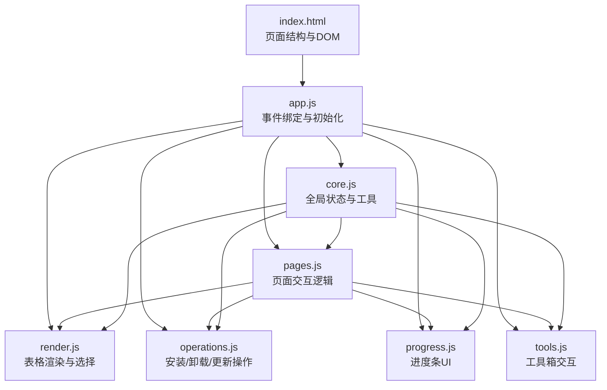
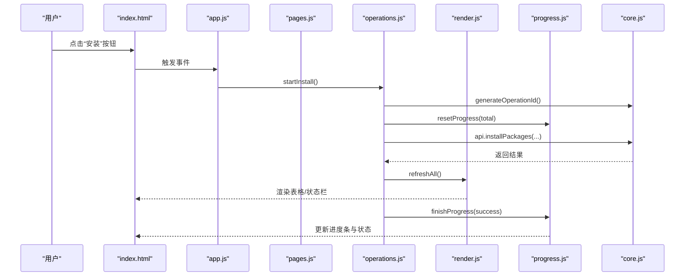
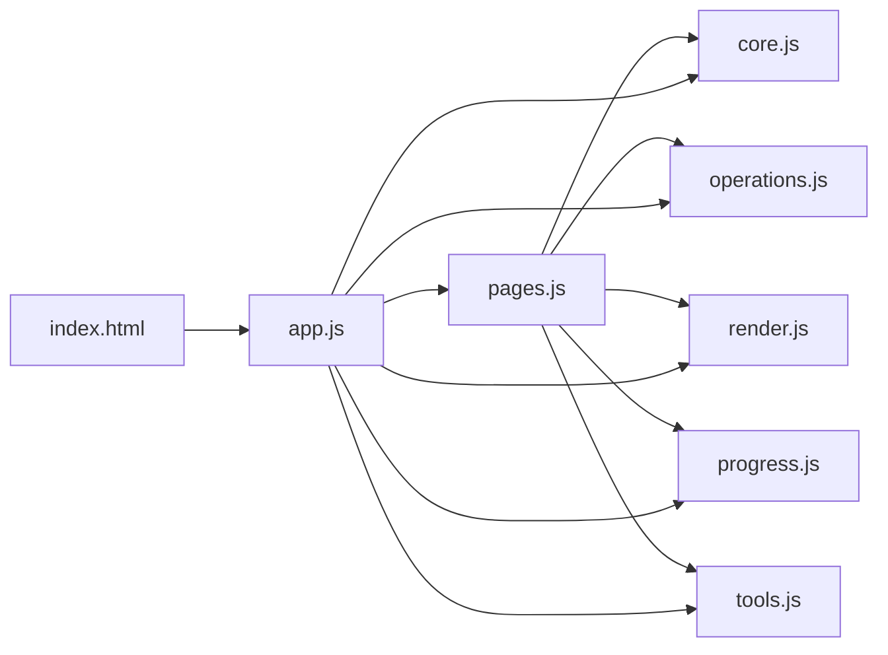

# 页面交互模块 (pages.js)

<cite>
**本文引用的文件**   
- [renderer/js/pages.js](file://renderer/js/pages.js)
- [renderer/index.html](file://renderer/index.html)
- [renderer/js/app.js](file://renderer/js/app.js)
- [renderer/js/core.js](file://renderer/js/core.js)
- [renderer/js/operations.js](file://renderer/js/operations.js)
- [renderer/js/render.js](file://renderer/js/render.js)
- [renderer/js/progress.js](file://renderer/js/progress.js)
- [renderer/js/tools.js](file://renderer/js/tools.js)
</cite>

## 目录
1. [简介](#简介)
2. [项目结构](#项目结构)
3. [核心组件](#核心组件)
4. [架构总览](#架构总览)
5. [详细组件分析](#详细组件分析)
6. [依赖关系分析](#依赖关系分析)
7. [性能考量](#性能考量)
8. [故障排查指南](#故障排查指南)
9. [结论](#结论)
10. [附录：新页面开发模板与最佳实践](#附录新页面开发模板与最佳实践)

## 简介
本文件聚焦于 PyLibMaster 的页面交互模块，围绕 renderer/js/pages.js 展开，系统阐述安装、卸载、更新、查询、日志、设置、工具箱等页面的交互逻辑。文档覆盖页面生命周期管理、数据加载策略、表单验证与用户反馈、模态对话框与通知系统、进度指示器使用、页面间通信与状态共享机制，并提供新页面开发的模板与最佳实践，确保读者能高效扩展与维护该模块。

## 项目结构
PyLibMaster 的前端渲染进程采用模块化组织，关键文件职责如下：
- index.html：应用主界面 HTML，包含侧边栏导航、各页面容器、底部状态栏、Toast 容器、备份确认模态框等。
- app.js：事件绑定与启动初始化，负责侧边栏切换、全局快捷键、主题/语言切换、启动阶段的数据并行加载。
- core.js：全局状态与通用工具（API 桥接、i18n 引用、Toast、操作 ID 生成、动画等）。
- operations.js：三大核心操作（安装/卸载/更新）的执行逻辑、拖拽安装区、刷新函数、当前页刷新。
- render.js：表格渲染与选择逻辑（卸载、更新、查询、镜像源、环境、日志、统计卡片与状态栏）。
- progress.js：进度条 UI，解析后端推送的结构化进度事件，统一更新进度与完成状态。
- tools.js：工具箱页面交互（依赖图谱、磁盘空间分析、环境对比、离线下载、撤销、系统集成）。
- pages.js：页面交互逻辑（镜像源、环境、日志、设置、自动更新、包详情、导出/导入、环境对比、定时调度、安全扫描、PyPI 浏览等）。

**图表来源** 
- [renderer/index.html:1-120](file://renderer/index.html#L1-L120)
- [renderer/js/app.js:1-210](file://renderer/js/app.js#L1-L210)
- [renderer/js/core.js:1-93](file://renderer/js/core.js#L1-L93)
- [renderer/js/render.js:1-445](file://renderer/js/render.js#L1-L445)
- [renderer/js/progress.js:1-141](file://renderer/js/progress.js#L1-L141)
- [renderer/js/operations.js:1-536](file://renderer/js/operations.js#L1-L536)
- [renderer/js/tools.js:1-795](file://renderer/js/tools.js#L1-L795)
- [renderer/js/pages.js:1-1253](file://renderer/js/pages.js#L1-L1253)

**章节来源**
- [renderer/index.html:1-120](file://renderer/index.html#L1-L120)
- [renderer/js/app.js:1-210](file://renderer/js/app.js#L1-L210)

## 核心组件
- 全局状态与工具（core.js）
  - 提供 api（window.electronAPI）、i18n（window.I18N）引用。
  - 定义全局变量：installedLibs、updateLibs、mirrors、envs、currentEnvIndex、logData、todayInstalled、selectedForUninstall、selectedForUpdate、appConfig、progressOperation、progressTotal、progressDone、currentOperationId 等。
  - 通用工具：escapeHtml、showToast、generateOperationId、animateStat、closeModal。
- 表格渲染与选择（render.js）
  - 卸载页：toggleUninstallSelection、toggleSelectAll、updateSelectionInfo、renderUninstallTable。
  - 更新页：toggleUpdateSelectAll、toggleUpdateSelection、updateUpdateSelectionInfo、renderUpdateTable。
  - 查询页：renderQueryTable（支持搜索/筛选/排序）。
  - 镜像源页：renderMirrors（含编辑模式、测速显示、默认标记、拖拽排序）。
  - 环境页：renderEnvs、renderVenvs、renderVenvBaseOptions。
  - 日志页：renderLogs（类型筛选+关键词搜索）。
  - 统计与状态栏：renderStats、updateStatusbar。
- 进度条 UI（progress.js）
  - resetProgress、finishProgress、setProgressUI、updateProgressFromOutput。
  - 解析结构化进度事件与 pip 文本输出，统一更新进度与完成状态。
- 操作执行（operations.js）
  - 取消操作、卸载（单/批）、更新（单/全部）、检查更新、安装（搜索/拖拽/文件）、数据刷新（refreshInstalled、refreshOutdated、refreshLogs、refreshEnvs、refreshMirrors、refreshAll、refreshCurrentPage）。
- 工具箱（tools.js）
  - 依赖图谱（树形图/力导向图）、磁盘空间分析、环境对比、离线下载、撤销、系统集成（右键菜单）、版本历史、环境诊断与安全审计。
- 页面交互（pages.js）
  - 镜像源操作（设置默认、删除、编辑、批量测速、添加自定义、智能路由开关、恢复默认）。
  - 环境操作（切换环境、修复 pip、虚拟环境创建/使用/删除、刷新 venv 列表）。
  - 日志操作（添加、清空、导出 CSV/Markdown）。
  - 语言与主题（applyLanguage、loadConfig）。
  - 应用自动更新（checkAppUpdate、bindUpdaterEvents、进度与状态更新）。
  - 包详情面板（showPackageDetail、依赖树渲染）。
  - 导出/导入环境（requirements.txt）。
  - 环境对比（下拉选项渲染、对比执行与结果展示）。
  - 设置开关（自动检查更新、桌面通知、最小化到托盘）。
  - 定时自动更新调度器（加载状态、切换开关、修改频率、白名单管理、立即执行）。
  - 数据统计仪表盘（renderStatsDashboard）。
  - 项目模板与环境快照（模板网格、创建环境、快照列表、回滚/删除）。
  - 安全漏洞扫描（runSecurityAudit、renderAuditResult、缓存加载）。
  - PyPI 在线浏览（searchPyPI、showPypiDetail、installFromPypi）。

**章节来源**
- [renderer/js/core.js:1-93](file://renderer/js/core.js#L1-L93)
- [renderer/js/render.js:1-445](file://renderer/js/render.js#L1-L445)
- [renderer/js/progress.js:1-141](file://renderer/js/progress.js#L1-L141)
- [renderer/js/operations.js:1-536](file://renderer/js/operations.js#L1-L536)
- [renderer/js/tools.js:1-795](file://renderer/js/tools.js#L1-L795)
- [renderer/js/pages.js:1-1253](file://renderer/js/pages.js#L1-L1253)

## 架构总览
页面交互模块通过 app.js 初始化并绑定事件，pages.js 与各页面 DOM 交互，调用 operations.js 执行核心操作，render.js 渲染表格与列表，progress.js 处理进度 UI，core.js 提供全局状态与工具。整体流程如下：

**图表来源** 
- [renderer/js/app.js:1-210](file://renderer/js/app.js#L1-L210)
- [renderer/js/pages.js:1-1253](file://renderer/js/pages.js#L1-L1253)
- [renderer/js/operations.js:1-536](file://renderer/js/operations.js#L1-L536)
- [renderer/js/render.js:1-445](file://renderer/js/render.js#L1-L445)
- [renderer/js/progress.js:1-141](file://renderer/js/progress.js#L1-L141)
- [renderer/js/core.js:1-93](file://renderer/js/core.js#L1-L93)

## 详细组件分析

### 安装页面（page-install）
- 交互逻辑
  - 输入框支持空格/逗号分隔多个包名，支持粘贴 pip install 命令或文件路径（.whl/.txt）。
  - 拖拽安装区支持 .txt/.whl 文件拖拽与点击选择。
  - 版本控制下拉（最新/指定/范围），指定版本输入框动态显示。
  - 安装选项：并行安装、智能重试、失败自动回滚。
  - 高级设置：线程数、重试次数。
  - 进度卡片：显示当前包名、百分比、计数、状态，支持取消。
- 数据加载策略
  - 启动时并行加载配置、环境、镜像、缓存库；后台刷新已安装包与可更新列表。
  - 安装完成后调用 refreshAll() 刷新全局数据与相关页面。
- 表单验证与用户反馈
  - 文件类型校验（仅 .txt/.whl）。
  - 输入为空提示错误。
  - Toast 提示成功/失败信息。
  - 进度条实时更新，完成后延迟隐藏。
- 关键函数路径
  - startInstall、installFromSelectedFile、resetDropzone、refreshAll、refreshCurrentPage

**章节来源**
- [renderer/js/operations.js:238-398](file://renderer/js/operations.js#L238-L398)
- [renderer/js/operations.js:399-536](file://renderer/js/operations.js#L399-L536)
- [renderer/js/app.js:128-210](file://renderer/js/app.js#L128-L210)
- [renderer/index.html:132-215](file://renderer/index.html#L132-L215)

### 卸载页面（page-uninstall）
- 交互逻辑
  - 搜索框实时过滤已安装包。
  - 勾选单个/全选，批量卸载按钮启用条件为至少选中一个。
  - 卸载选项：安全模式、备份、失败自动回滚。
  - 备份确认模态对话框（backup-modal）。
- 数据加载策略
  - 卸载后调用 refreshAll() 刷新已安装包、可更新列表、统计与状态栏。
- 表单验证与用户反馈
  - 未选中任何包时禁用批量卸载。
  - 备份确认后执行卸载，否则直接卸载。
  - Toast 提示成功/失败信息。
- 关键函数路径
  - singleUninstall、batchUninstall、confirmBackup、forceUninstall、doUninstall、renderUninstallTable、toggleSelectAll、updateSelectionInfo

**章节来源**
- [renderer/js/operations.js:33-113](file://renderer/js/operations.js#L33-L113)
- [renderer/js/render.js:16-78](file://renderer/js/render.js#L16-L78)
- [renderer/index.html:217-262](file://renderer/index.html#L217-L262)

### 更新页面（page-update）
- 交互逻辑
  - 更新选项：并行更新、智能重试、显示版本对比、失败自动回滚。
  - 搜索框过滤可更新包，支持全选/单选。
  - 全部更新与检查更新按钮。
  - 进度卡片：显示当前包名、百分比、计数、状态，支持取消。
  - 定时自动更新：开关、频率、白名单、上次执行时间、立即执行。
- 数据加载策略
  - checkUpdates() 拉取最新可更新列表，渲染更新表格与查询表格。
  - updateAll() 批量更新，完成后刷新全局数据。
- 表单验证与用户反馈
  - 无可选包时提示“暂无可更新的库”。
  - Toast 提示成功/失败信息。
  - 进度条实时更新，完成后延迟隐藏。
- 关键函数路径
  - getUpdateOptions、updateOne、updateAll、checkUpdates、renderUpdateTable、toggleUpdateSelectAll、toggleUpdateSelection、updateUpdateSelectionInfo

**章节来源**
- [renderer/js/operations.js:115-236](file://renderer/js/operations.js#L115-L236)
- [renderer/js/render.js:80-157](file://renderer/js/render.js#L80-L157)
- [renderer/js/pages.js:716-800](file://renderer/js/pages.js#L716-L800)
- [renderer/index.html:264-373](file://renderer/index.html#L264-L373)

### 查询页面（page-query）
- 交互逻辑
  - 搜索框、状态筛选（所有/已安装/有更新）、排序（安装时间/名称/大小）。
  - 表格渲染显示包名、版本、安装时间、大小、来源、状态。
- 数据加载策略
  - 监听搜索/筛选/排序变化，重新渲染表格。
  - 结合 installedLibs 与 updateLibs 计算状态。
- 表单验证与用户反馈
  - 无匹配结果时显示空状态。
- 关键函数路径
  - renderQueryTable

**章节来源**
- [renderer/js/render.js:159-205](file://renderer/js/render.js#L159-L205)
- [renderer/index.html:375-417](file://renderer/index.html#L375-L417)

### 日志页面（page-logs）
- 交互逻辑
  - 类型筛选（全部/安装/卸载/更新）、搜索框、导出 CSV/Markdown、清空日志。
  - 日志条目显示动作、详情、时间、状态。
- 数据加载策略
  - refreshLogs() 获取日志数据，renderLogs() 渲染列表。
- 表单验证与用户反馈
  - 无日志时显示空状态。
  - 导出成功/失败 Toast 提示。
- 关键函数路径
  - addLog、clearLogs、exportLogs、renderLogs

**章节来源**
- [renderer/js/pages.js:320-349](file://renderer/js/pages.js#L320-L349)
- [renderer/js/render.js:378-411](file://renderer/js/render.js#L378-L411)
- [renderer/index.html:621-645](file://renderer/index.html#L621-L645)

### 设置页面（page-settings）
- 交互逻辑
  - 主题切换（浅色/深色/跟随系统）、语言切换（中文/英文）。
  - 存储路径浏览与设置。
  - 线程数、重试次数保存。
  - 新增设置：自动检查更新、桌面通知、最小化到托盘。
  - 定时自动更新调度器状态加载与配置保存。
- 数据加载策略
  - loadConfig() 读取应用配置并应用到 UI。
  - loadSchedulerStatus() 加载调度器状态。
- 表单验证与用户反馈
  - 设置变更后即时保存并提示。
- 关键函数路径
  - browseStoragePath、loadConfig、toggleAutoCheck、toggleDesktopNotify、toggleTrayMinimize、loadSchedulerStatus、toggleScheduler、changeSchedulerFrequency

**章节来源**
- [renderer/js/pages.js:376-422](file://renderer/js/pages.js#L376-L422)
- [renderer/js/pages.js:696-749](file://renderer/js/pages.js#L696-L749)
- [renderer/js/app.js:35-62](file://renderer/js/app.js#L35-L62)
- [renderer/index.html:111-118](file://renderer/index.html#L111-L118)

### 工具箱页面（page-tools）
- 交互逻辑
  - Tab 切换：依赖图谱、环境诊断、空间分析、环境对比、离线下载。
  - 依赖图谱：单包依赖树与全局依赖网络，Canvas 绘制，支持缩放/拖拽/双击重置。
  - 环境诊断：依赖冲突检测、全面健康检查、安全漏洞扫描。
  - 空间分析：磁盘占用 Top 30，条形图展示。
  - 环境对比：选择来源（当前环境/文件），对比结果展示。
  - 离线下载：包名列表、目标目录、平台选择、包含依赖。
  - 撤销：刷新撤销按钮状态，执行撤销操作。
  - 系统集成：资源管理器右键菜单开关。
- 数据加载策略
  - 懒加载各功能数据，按需调用 API。
- 表单验证与用户反馈
  - 输入校验（包名、目标目录等）。
  - Toast 提示成功/失败信息。
- 关键函数路径
  - initToolsTabs、loadDepGraph、renderTreeGraph、renderForceGraph、loadDiskUsage、runDiff、startOfflineDownload、refreshUndoButton、performUndo、loadContextMenuStatus、toggleContextMenu、runConflictCheck、runHealthCheck、runSecurityAudit、renderAuditResult

**章节来源**
- [renderer/js/tools.js:1-795](file://renderer/js/tools.js#L1-L795)
- [renderer/index.html:686-800](file://renderer/index.html#L686-L800)

### 镜像源页面（page-mirror）
- 交互逻辑
  - 镜像源列表显示（名称、URL、备注、测速结果、默认标记）。
  - 设置默认、删除、编辑（名称、URL、备注）、批量测速、添加自定义镜像源、智能路由开关、恢复默认。
  - 拖拽排序调整优先级。
- 数据加载策略
  - refreshMirrors() 获取镜像源列表与智能路由状态。
  - 拖拽排序后持久化顺序。
- 表单验证与用户反馈
  - URL 格式校验。
  - Toast 提示成功/失败信息。
- 关键函数路径
  - setMirror、removeMirror、editMirror、cancelMirrorEdit、saveMirrorEdit、testAllMirrors、addCustomMirror、toggleSmartRoute、restoreDefaultMirrorsSettings、renderMirrors、bindMirrorDragEvents

**章节来源**
- [renderer/js/pages.js:15-161](file://renderer/js/pages.js#L15-L161)
- [renderer/js/render.js:207-318](file://renderer/js/render.js#L207-L318)
- [renderer/index.html:462-506](file://renderer/index.html#L462-L506)

### 环境页面（page-env）
- 交互逻辑
  - Python 环境列表显示（名称、路径、版本），点击切换。
  - 修复 pip（ensurepip 重新引导安装）。
  - 虚拟环境创建（名称、基础 Python、包含 pip、继承系统 site-packages）。
  - 虚拟环境列表（使用/删除）。
  - 导出/导入环境（requirements.txt）。
  - 环境对比（两个环境选择与对比结果）。
- 数据加载策略
  - refreshEnvs() 刷新环境与 venv 列表，渲染基础 Python 下拉选项。
  - useVenv() 切换环境后刷新全局数据。
- 表单验证与用户反馈
  - 环境名称校验（字母、数字、短横线、下划线、点）。
  - Toast 提示成功/失败信息。
- 关键函数路径
  - selectEnv、repairPip、createVenv、useVenv、deleteVenv、refreshVenvs、exportEnv、importEnv、compareEnvs、renderEnvs、renderVenvs、renderVenvBaseOptions

**章节来源**
- [renderer/js/pages.js:163-318](file://renderer/js/pages.js#L163-L318)
- [renderer/js/render.js:320-376](file://renderer/js/render.js#L320-L376)
- [renderer/index.html:508-582](file://renderer/index.html#L508-L582)

### 包详情面板（modal）
- 交互逻辑
  - 显示包详情（版本、简介、作者、主页、许可证、位置）。
  - 依赖列表与被依赖列表，点击可跳转查看其他包详情。
  - 依赖树递归渲染。
- 数据加载策略
  - showPackageInfo() 获取包信息，getDependencyTree() 获取依赖树。
- 表单验证与用户反馈
  - 加载中显示占位符，错误时显示错误消息。
- 关键函数路径
  - showPackageDetail、renderDepTreeNode

**章节来源**
- [renderer/js/pages.js:524-602](file://renderer/js/pages.js#L524-L602)

### 应用自动更新（about 页面）
- 交互逻辑
  - 检查更新、安装已下载的更新。
  - 进度条与状态文本更新。
  - 事件绑定：checking、available、not-available、progress、downloaded、error。
- 数据加载策略
  - bindUpdaterEvents() 订阅主进程推送的更新事件。
- 表单验证与用户反馈
  - 状态文本与进度条实时更新。
- 关键函数路径
  - checkAppUpdate、installAppUpdate、bindUpdaterEvents、setUpdateStatus、setUpdateProgress、hideUpdateProgress

**章节来源**
- [renderer/js/pages.js:424-522](file://renderer/js/pages.js#L424-L522)

### 桌面通知与 Toast 系统
- 交互逻辑
  - sendDesktopNotification() 根据配置发送系统通知。
  - showToast() 显示 Toast 提示（ok/err/info/warn）。
- 数据加载策略
  - 基于 appConfig.desktopNotify 决定是否发送通知。
- 表单验证与用户反馈
  - 所有操作成功后调用 showToast 或 sendDesktopNotification 反馈。
- 关键函数路径
  - sendDesktopNotification、showToast

**章节来源**
- [renderer/js/pages.js:803-813](file://renderer/js/pages.js#L803-L813)
- [renderer/js/core.js:53-68](file://renderer/js/core.js#L53-L68)

### 进度指示器（progress.js）
- 交互逻辑
  - resetProgress() 重置进度条。
  - finishProgress() 设置最终状态（成功/失败），延迟隐藏进度卡片。
  - setProgressUI() 更新进度条宽度、百分比、计数。
  - updateProgressFromOutput() 解析结构化进度事件与 pip 文本输出。
- 数据加载策略
  - 监听主进程推送的进度事件，统一更新进度。
- 表单验证与用户反馈
  - 进度条实时更新，完成后自动刷新日志并隐藏。
- 关键函数路径
  - resetProgress、finishProgress、setProgressUI、updateProgressFromOutput

**章节来源**
- [renderer/js/progress.js:1-141](file://renderer/js/progress.js#L1-L141)

## 依赖关系分析
页面交互模块依赖关系如下：
- pages.js 依赖 core.js（全局状态与工具）、operations.js（操作执行）、render.js（表格渲染）、progress.js（进度 UI）、tools.js（工具箱功能）。
- app.js 作为入口，绑定事件并初始化各模块。
- index.html 提供 DOM 结构，供各模块操作。

**图表来源** 
- [renderer/js/pages.js:1-1253](file://renderer/js/pages.js#L1-L1253)
- [renderer/js/app.js:1-210](file://renderer/js/app.js#L1-L210)
- [renderer/index.html:1-120](file://renderer/index.html#L1-L120)

**章节来源**
- [renderer/js/pages.js:1-1253](file://renderer/js/pages.js#L1-L1253)
- [renderer/js/app.js:1-210](file://renderer/js/app.js#L1-L210)

## 性能考量
- 并行加载：启动时使用 Promise.allSettled 并行加载配置、环境、镜像、缓存库，提升首屏响应速度。
- 懒加载：可更新列表与日志在后台异步刷新，不阻塞 UI。
- 进度事件优化：结构化进度事件减少解析开销，文本输出作为兜底。
- 表格渲染优化：按搜索/筛选/排序条件过滤数据，避免全量重绘。
- 内存管理：操作完成后清理定时器与状态变量，避免内存泄漏。

[本节为通用指导，无需特定文件来源]

## 故障排查指南
- 常见问题
  - 进度条不更新：检查 updateProgressFromOutput 是否正确解析事件。
  - 表格不刷新：确认 refreshAll() 是否被调用，render 函数是否正确绑定。
  - Toast 不显示：检查 toast-container 是否存在，showToast 参数是否正确。
  - 通知不发送：确认 appConfig.desktopNotify 是否为 true。
  - 自动更新事件未触发：检查 bindUpdaterEvents 是否正确绑定。
- 调试建议
  - 使用控制台日志输出关键变量（如 progressOperation、progressTotal、progressDone）。
  - 检查 API 调用返回值与异常信息。
  - 验证 DOM 元素 ID 是否与代码中一致。

**章节来源**
- [renderer/js/progress.js:90-141](file://renderer/js/progress.js#L90-L141)
- [renderer/js/core.js:53-68](file://renderer/js/core.js#L53-L68)
- [renderer/js/pages.js:486-522](file://renderer/js/pages.js#L486-L522)

## 结论
PyLibMaster 的页面交互模块以 pages.js 为核心，结合 operations.js、render.js、progress.js、tools.js 等模块，实现了完整的页面交互逻辑。通过模块化设计、全局状态共享、事件驱动与进度事件解析，提供了良好的用户体验与可维护性。遵循本文档的最佳实践，可高效扩展新页面与功能。

[本节为总结，无需特定文件来源]

## 附录：新页面开发模板与最佳实践
- 页面结构
  - 在 index.html 中添加页面容器与 DOM 元素，使用 data-i18n 属性支持国际化。
  - 在 pages.js 中实现页面交互逻辑，封装函数并绑定事件。
- 数据加载策略
  - 使用 refreshXxx() 函数获取数据，renderXxx() 函数渲染 UI。
  - 启动时并行加载必要数据，后台异步刷新非关键数据。
- 表单验证与用户反馈
  - 输入校验使用正则表达式与条件判断，错误时 showToast 提示。
  - 操作成功后 showToast 或 sendDesktopNotification 反馈。
- 进度指示器
  - 使用 resetProgress()、setProgressUI()、finishProgress() 管理进度。
  - 监听主进程推送的进度事件，更新 UI。
- 页面间通信与状态共享
  - 通过全局状态变量（如 installedLibs、updateLibs、envs）共享数据。
  - 使用 refreshAll() 同步全局数据与 UI。
- 最佳实践
  - 保持函数单一职责，避免过长函数。
  - 使用 escapeHtml 防止 XSS 注入。
  - 错误处理使用 try-catch，捕获异常并提示用户。
  - 国际化文案统一在 i18n.js 中管理。

[本节为通用指导，无需特定文件来源]