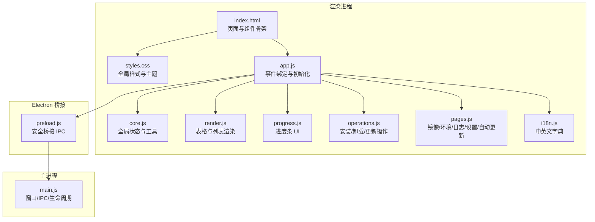
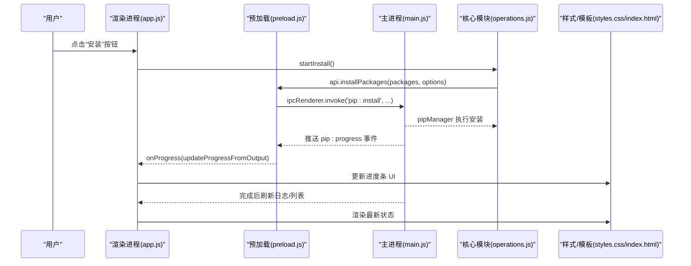
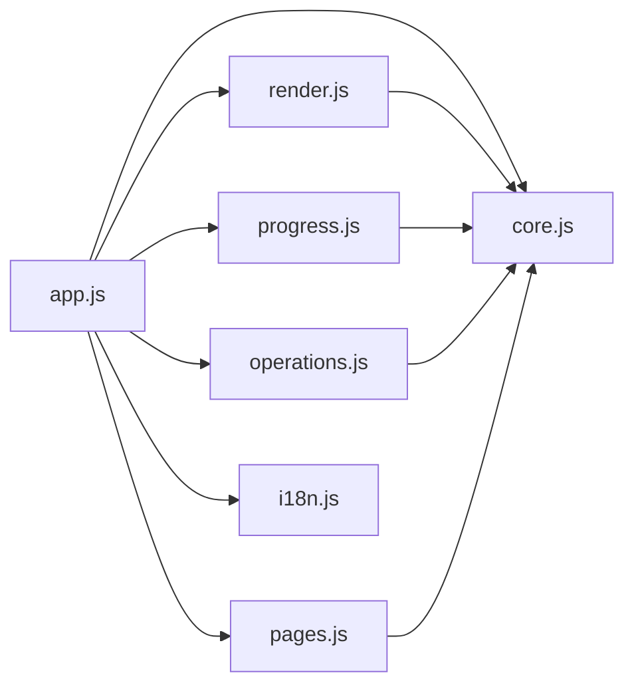

# UI 组件

<cite>
**本文引用的文件**   
- [renderer/index.html](file://renderer/index.html)
- [renderer/styles.css](file://renderer/styles.css)
- [renderer/js/app.js](file://renderer/js/app.js)
- [renderer/js/core.js](file://renderer/js/core.js)
- [renderer/js/render.js](file://renderer/js/render.js)
- [renderer/js/progress.js](file://renderer/js/progress.js)
- [renderer/js/operations.js](file://renderer/js/operations.js)
- [renderer/js/pages.js](file://renderer/js/pages.js)
- [renderer/js/i18n.js](file://renderer/js/i18n.js)
- [preload.js](file://preload.js)
- [main.js](file://main.js)
- [package.json](file://package.json)
</cite>

## 目录
1. [简介](#简介)
2. [项目结构](#项目结构)
3. [核心组件](#核心组件)
4. [架构总览](#架构总览)
5. [详细组件分析](#详细组件分析)
6. [依赖关系分析](#依赖关系分析)
7. [性能考虑](#性能考虑)
8. [故障排查指南](#故障排查指南)
9. [结论](#结论)
10. [附录：API 参考与使用示例](#附录api-参考与使用示例)

## 简介
本文件为 PyLibMaster 的 UI 组件库文档，覆盖搜索框、按钮、卡片、表格、进度条、模态对话框、标签页、开关控件等可复用界面元素。内容包含每个组件的属性配置、事件处理、样式定制选项、使用示例、最佳实践与性能建议；并解释状态管理、动画效果与响应式设计的实现方式，提供扩展指南与自定义组件开发规范，确保对 UI 开发者友好且具备完整 API 参考与使用示例。

## 项目结构
PyLibMaster 采用 Electron 架构，渲染进程负责 UI 与交互，主进程负责系统能力与业务逻辑桥接。UI 组件由 HTML 模板、CSS 样式与 JS 模块共同构成：
- HTML 定义页面结构与组件骨架（标题栏、侧边栏、各功能页、模态与 Toast 容器）
- CSS 提供主题变量、组件样式、动画与响应式布局
- JS 模块承担事件绑定、数据渲染、操作执行与进度更新

**图表来源** 
- [renderer/index.html:1-120](file://renderer/index.html#L1-L120)
- [renderer/styles.css:1-120](file://renderer/styles.css#L1-L120)
- [renderer/js/app.js:16-27](file://renderer/js/app.js#L16-L27)
- [renderer/js/core.js:11-17](file://renderer/js/core.js#L11-L17)
- [renderer/js/render.js:1-15](file://renderer/js/render.js#L1-L15)
- [renderer/js/progress.js:1-13](file://renderer/js/progress.js#L1-L13)
- [renderer/js/operations.js:1-14](file://renderer/js/operations.js#L1-L14)
- [renderer/js/pages.js:1-14](file://renderer/js/pages.js#L1-L14)
- [renderer/js/i18n.js:1-10](file://renderer/js/i18n.js#L1-L10)
- [preload.js:16-20](file://preload.js#L16-L20)
- [main.js:43-74](file://main.js#L43-L74)

**章节来源**
- [renderer/index.html:1-120](file://renderer/index.html#L1-L120)
- [renderer/styles.css:1-120](file://renderer/styles.css#L1-L120)
- [renderer/js/app.js:16-27](file://renderer/js/app.js#L16-L27)
- [preload.js:16-20](file://preload.js#L16-L20)
- [main.js:43-74](file://main.js#L43-L74)

## 核心组件
本节按组件类型梳理其属性、事件、样式与使用要点。所有组件均支持浅色/深色主题切换，并通过 CSS 变量统一控制色彩与尺寸。

- 搜索框（Search Input）
  - 属性：占位符、聚焦边框高亮、输入校验
  - 事件：oninput/onkeydown（回车触发）、实时过滤
  - 样式：圆角、阴影、焦点光晕
  - 使用示例：安装页搜索、查询页筛选、日志页搜索
  - 最佳实践：防抖输入、限制最大长度、国际化占位符

- 按钮（Button）
  - 属性：主次样式、危险样式、禁用态、加载态
  - 事件：onClick、loading 状态控制
  - 样式：悬停、按下缩放、过渡动画
  - 使用示例：安装/卸载/更新、测速、导出、确认/取消
  - 最佳实践：长耗时操作必须显示 loading，避免重复点击

- 卡片（Card）
  - 属性：标题、内边距、阴影、悬停增强
  - 事件：无默认事件，作为容器承载表单或列表
  - 样式：圆角、边框、背景色随主题变化
  - 使用示例：安装选项、更新选项、镜像源分组、统计卡片
  - 最佳实践：合理分组信息，保持视觉层次清晰

- 表格（Table）
  - 属性：列头固定、行悬停、空状态、选择列
  - 事件：全选/单选、排序、筛选、分页（如有）
  - 样式：表头背景、分隔线、版本徽章
  - 使用示例：卸载列表、更新列表、查询结果、日志条目
  - 最佳实践：大数据量时虚拟滚动（可扩展），避免频繁重排

- 进度条（Progress）
  - 属性：总量、完成数、百分比、状态文本
  - 事件：后端推送结构化进度事件，解析更新 UI
  - 样式：填充条、错误颜色、完成延迟隐藏
  - 使用示例：安装/更新/卸载/回滚
  - 最佳实践：失败时保留最终状态供用户确认，避免误隐藏

- 模态对话框（Modal）
  - 属性：遮罩、淡入动画、标题、正文、动作区
  - 事件：打开/关闭、确认/取消、ESC 关闭
  - 样式：居中、阴影、响应式宽度
  - 使用示例：备份确认、包详情弹窗
  - 最佳实践：阻止背景滚动，聚焦管理

- 标签页（Tabs）
  - 属性：激活态、切换动画
  - 事件：点击切换面板
  - 样式：胶囊式、选中高亮
  - 使用示例：工具箱子功能（依赖图谱/诊断/空间分析/对比/离线下载）
  - 最佳实践：懒加载面板内容，减少初始开销

- 开关控件（Toggle）
  - 属性：开/关状态、轨道与滑块动画
  - 事件：onChange 保存配置
  - 样式：圆角轨道、滑块位移、主题适配
  - 使用示例：智能路由、定时更新、通知、托盘最小化
  - 最佳实践：异步保存失败时回滚 UI 状态

**章节来源**
- [renderer/index.html:132-215](file://renderer/index.html#L132-L215)
- [renderer/index.html:218-330](file://renderer/index.html#L218-L330)
- [renderer/index.html:375-417](file://renderer/index.html#L375-L417)
- [renderer/index.html:621-645](file://renderer/index.html#L621-L645)
- [renderer/index.html:686-718](file://renderer/index.html#L686-L718)
- [renderer/styles.css:176-189](file://renderer/styles.css#L176-L189)
- [renderer/styles.css:206-218](file://renderer/styles.css#L206-L218)
- [renderer/styles.css:225-236](file://renderer/styles.css#L225-L236)
- [renderer/styles.css:312-321](file://renderer/styles.css#L312-L321)
- [renderer/styles.css:276-284](file://renderer/styles.css#L276-L284)
- [renderer/styles.css:507-513](file://renderer/styles.css#L507-L513)

## 架构总览
渲染进程通过 preload.js 暴露 electronAPI，调用主进程的 IPC 处理器，实现 UI 与核心模块的解耦。UI 组件的状态集中在 core.js，渲染逻辑在 render.js，操作逻辑在 operations.js，页面交互在 pages.js，i18n 在 i18n.js。

**图表来源** 
- [renderer/js/app.js:80-84](file://renderer/js/app.js#L80-L84)
- [renderer/js/operations.js:301-370](file://renderer/js/operations.js#L301-L370)
- [renderer/js/progress.js:101-141](file://renderer/js/progress.js#L101-L141)
- [preload.js:59-64](file://preload.js#L59-L64)
- [main.js:133-150](file://main.js#L133-L150)

## 详细组件分析

### 搜索框（Search Input）
- 属性与行为
  - 支持 placeholder 国际化、Enter 键触发搜索、实时 input 过滤
  - 焦点态高亮边框与阴影
- 事件处理
  - install-search：Enter 触发安装
  - uninstall-search/query-search/log-search：实时过滤
- 样式定制
  - 使用 .search-input 类，可通过 CSS 变量调整边框、阴影、背景
- 使用示例
  - 安装页搜索、查询页筛选、日志页搜索
- 最佳实践
  - 输入防抖、限制字符长度、清空提示

**章节来源**
- [renderer/index.html:138-141](file://renderer/index.html#L138-L141)
- [renderer/index.html:223-226](file://renderer/index.html#L223-L226)
- [renderer/index.html:381-394](file://renderer/index.html#L381-L394)
- [renderer/index.html:627-638](file://renderer/index.html#L627-L638)
- [renderer/styles.css:171-175](file://renderer/styles.css#L171-L175)
- [renderer/js/app.js:66-75](file://renderer/js/app.js#L66-L75)

### 按钮（Button）
- 属性与行为
  - 主按钮、危险按钮、禁用态、加载态（spinner）
- 事件处理
  - onClick 触发操作，loading 防止重复提交
- 样式定制
  - .btn/.btn-primary/.btn-danger/.btn-sm，悬停与按下缩放
- 使用示例
  - 安装/卸载/更新、测速、导出、确认/取消
- 最佳实践
  - 长耗时操作必须显示 loading，异常时恢复按钮状态

**章节来源**
- [renderer/styles.css:176-189](file://renderer/styles.css#L176-L189)
- [renderer/index.html:139-141](file://renderer/index.html#L139-L141)
- [renderer/index.html:224-226](file://renderer/index.html#L224-L226)
- [renderer/index.html:279-281](file://renderer/index.html#L279-L281)
- [renderer/js/operations.js:253-293](file://renderer/js/operations.js#L253-L293)

### 卡片（Card）
- 属性与行为
  - 标题、内边距、阴影、悬停增强
- 事件处理
  - 作为容器，承载表单、列表、统计信息
- 样式定制
  - .card/.card-title-sm，主题变量控制背景与边框
- 使用示例
  - 安装选项、更新选项、镜像源分组、统计卡片
- 最佳实践
  - 合理分组信息，避免过度嵌套

**章节来源**
- [renderer/styles.css:168-170](file://renderer/styles.css#L168-L170)
- [renderer/index.html:151-172](file://renderer/index.html#L151-L172)
- [renderer/index.html:270-282](file://renderer/index.html#L270-L282)
- [renderer/index.html:468-474](file://renderer/index.html#L468-L474)

### 表格（Table）
- 属性与行为
  - 列头固定、行悬停、空状态、选择列、排序与筛选
- 事件处理
  - 全选/单选、点击包名查看详情、批量操作
- 样式定制
  - .table-wrap、thead th sticky、版本徽章
- 使用示例
  - 卸载列表、更新列表、查询结果、日志条目
- 最佳实践
  - 大数据量时考虑虚拟滚动，避免频繁 DOM 重排

**章节来源**
- [renderer/styles.css:206-218](file://renderer/styles.css#L206-L218)
- [renderer/index.html:240-261](file://renderer/index.html#L240-L261)
- [renderer/index.html:289-309](file://renderer/index.html#L289-L309)
- [renderer/index.html:396-416](file://renderer/index.html#L396-L416)
- [renderer/js/render.js:58-78](file://renderer/js/render.js#L58-L78)
- [renderer/js/render.js:121-157](file://renderer/js/render.js#L121-L157)
- [renderer/js/render.js:167-205](file://renderer/js/render.js#L167-L205)

### 进度条（Progress）
- 属性与行为
  - 总量、完成数、百分比、状态文本、错误颜色
- 事件处理
  - 监听 pip:progress 事件，解析结构化消息更新 UI
- 样式定制
  - .progress-bar/.progress-fill，完成延迟隐藏
- 使用示例
  - 安装/更新/卸载/回滚
- 最佳实践
  - 失败时保留最终状态，避免误隐藏；区分 update 前缀

**章节来源**
- [renderer/styles.css:225-236](file://renderer/styles.css#L225-L236)
- [renderer/js/progress.js:20-35](file://renderer/js/progress.js#L20-L35)
- [renderer/js/progress.js:45-74](file://renderer/js/progress.js#L45-L74)
- [renderer/js/progress.js:101-141](file://renderer/js/progress.js#L101-L141)
- [renderer/index.html:196-214](file://renderer/index.html#L196-L214)
- [renderer/index.html:311-329](file://renderer/index.html#L311-L329)

### 模态对话框（Modal）
- 属性与行为
  - 遮罩、淡入动画、标题、正文、动作区
- 事件处理
  - 打开/关闭、确认/取消、ESC 关闭
- 样式定制
  - .modal-overlay/.modal，居中、阴影、响应式宽度
- 使用示例
  - 备份确认、包详情弹窗
- 最佳实践
  - 阻止背景滚动，聚焦管理，避免多层遮挡

**章节来源**
- [renderer/styles.css:312-321](file://renderer/styles.css#L312-L321)
- [renderer/index.html:42-54](file://renderer/index.html#L42-L54)
- [renderer/js/pages.js:532-582](file://renderer/js/pages.js#L532-L582)
- [renderer/js/core.js:92](file://renderer/js/core.js#L92)

### 标签页（Tabs）
- 属性与行为
  - 激活态、切换动画
- 事件处理
  - 点击切换面板
- 样式定制
  - .tools-tabs/.tools-tab，选中高亮
- 使用示例
  - 工具箱子功能（依赖图谱/诊断/空间分析/对比/离线下载）
- 最佳实践
  - 懒加载面板内容，减少初始开销

**章节来源**
- [renderer/styles.css:507-513](file://renderer/styles.css#L507-L513)
- [renderer/index.html:691-698](file://renderer/index.html#L691-L698)

### 开关控件（Toggle）
- 属性与行为
  - 开/关状态、轨道与滑块动画
- 事件处理
  - onChange 保存配置
- 样式定制
  - .toggle，圆角轨道、滑块位移、主题适配
- 使用示例
  - 智能路由、定时更新、通知、托盘最小化
- 最佳实践
  - 异步保存失败时回滚 UI 状态

**章节来源**
- [renderer/styles.css:276-284](file://renderer/styles.css#L276-L284)
- [renderer/index.html:339-343](file://renderer/index.html#L339-L343)
- [renderer/index.html:482-486](file://renderer/index.html#L482-L486)
- [renderer/js/pages.js:141-150](file://renderer/js/pages.js#L141-L150)

## 依赖关系分析
UI 组件之间的依赖主要体现在数据流与事件流上：
- app.js 负责事件绑定与初始化，调用 core.js 的全局状态与工具函数
- render.js 负责表格与列表渲染，依赖 installedLibs/updateLibs/mirrors/envs/logData
- progress.js 监听 pip:progress 事件，更新进度 UI
- operations.js 执行安装/卸载/更新，调用 api.electronAPI 进行 IPC
- pages.js 处理镜像/环境/日志/设置/自动更新等页面交互
- i18n.js 提供多语言文案，applyLanguage 动态更新 DOM

**图表来源** 
- [renderer/js/app.js:16-27](file://renderer/js/app.js#L16-L27)
- [renderer/js/core.js:11-17](file://renderer/js/core.js#L11-L17)
- [renderer/js/render.js:1-15](file://renderer/js/render.js#L1-L15)
- [renderer/js/progress.js:1-13](file://renderer/js/progress.js#L1-L13)
- [renderer/js/operations.js:1-14](file://renderer/js/operations.js#L1-L14)
- [renderer/js/pages.js:1-14](file://renderer/js/pages.js#L1-L14)
- [renderer/js/i18n.js:1-10](file://renderer/js/i18n.js#L1-L10)

**章节来源**
- [renderer/js/app.js:16-27](file://renderer/js/app.js#L16-L27)
- [renderer/js/core.js:11-17](file://renderer/js/core.js#L11-L17)
- [renderer/js/render.js:1-15](file://renderer/js/render.js#L1-L15)
- [renderer/js/progress.js:1-13](file://renderer/js/progress.js#L1-L13)
- [renderer/js/operations.js:1-14](file://renderer/js/operations.js#L1-L14)
- [renderer/js/pages.js:1-14](file://renderer/js/pages.js#L1-L14)
- [renderer/js/i18n.js:1-10](file://renderer/js/i18n.js#L1-L10)

## 性能考虑
- 启动优化
  - 快速加载缓存数据（已安装包列表），后台异步刷新真实扫描结果
  - 懒加载可更新列表与日志，避免阻塞首屏
- 渲染优化
  - 表格渲染仅更新必要节点，避免全量重绘
  - 使用 CSS 变量与过渡动画，减少重排重绘
- 事件优化
  - 输入防抖（如搜索框），减少频繁请求
  - 长耗时操作显示 loading，防止重复提交
- 内存与资源
  - 及时移除旧监听器（如进度事件、主题变化）
  - 大列表考虑虚拟滚动（可扩展）

[无需章节来源，因为本节为通用指导]

## 故障排查指南
- 进度条不更新
  - 检查 pip:progress 事件是否绑定，确认 payload 格式是否正确
  - 确认 progressOperation 与 prefix 匹配（update 前缀）
- 表格未渲染
  - 检查数据源（installedLibs/updateLibs）是否为空
  - 确认渲染函数被调用（如 renderUninstallTable/renderQueryTable）
- 模态无法关闭
  - 检查 ESC 事件与 closeModal 调用
  - 确认遮罩层 z-index 与 pointer-events
- 主题切换无效
  - 检查 body.dark 类切换与 CSS 变量生效
  - 确认系统主题监听回调正常

**章节来源**
- [renderer/js/progress.js:101-141](file://renderer/js/progress.js#L101-L141)
- [renderer/js/render.js:58-78](file://renderer/js/render.js#L58-L78)
- [renderer/js/core.js:92](file://renderer/js/core.js#L92)
- [renderer/js/app.js:87-89](file://renderer/js/app.js#L87-L89)

## 结论
PyLibMaster 的 UI 组件库以模块化与主题化为核心，通过清晰的职责划分与事件驱动的数据流，实现了丰富的交互体验。组件遵循一致的样式规范与状态管理模式，便于扩展与维护。建议在新增组件时遵循现有模式，确保一致性、可访问性与性能。

[无需章节来源，因为本节为总结性内容]

## 附录：API 参考与使用示例

### 组件 API 参考
- 搜索框
  - 事件：oninput、onkeydown（Enter）
  - 方法：focus()、blur()、value
- 按钮
  - 事件：onClick
  - 方法：classList.add('loading')、classList.remove('loading')
- 表格
  - 方法：renderUninstallTable(filter)、renderUpdateTable()、renderQueryTable()
  - 选择：toggleSelectAll()、getSelectedPackageNames()
- 进度条
  - 方法：resetProgress(total)、finishProgress(success)、setProgressUI(prefix, pct)
- 模态对话框
  - 方法：showModal(id)、closeModal(id)
- 标签页
  - 事件：click（切换 active）
- 开关控件
  - 事件：onChange（保存配置）

**章节来源**
- [renderer/js/render.js:58-78](file://renderer/js/render.js#L58-L78)
- [renderer/js/render.js:121-157](file://renderer/js/render.js#L121-L157)
- [renderer/js/render.js:167-205](file://renderer/js/render.js#L167-L205)
- [renderer/js/progress.js:20-35](file://renderer/js/progress.js#L20-L35)
- [renderer/js/progress.js:45-74](file://renderer/js/progress.js#L45-L74)
- [renderer/js/core.js:92](file://renderer/js/core.js#L92)

### 使用示例
- 安装库
  - 步骤：输入包名 → 点击安装 → 显示进度 → 完成后刷新列表
  - 关键函数：startInstall()、api.installPackages()
- 卸载库
  - 步骤：勾选库 → 批量卸载 → 可选备份 → 显示进度 → 刷新
  - 关键函数：batchUninstall()、doUninstall()
- 更新库
  - 步骤：检查更新 → 勾选库 → 全部更新 → 显示进度 → 刷新
  - 关键函数：checkUpdates()、updateAll()
- 镜像源管理
  - 步骤：添加/编辑/删除 → 测速 → 设为默认 → 智能路由
  - 关键函数：addCustomMirror()、testAllMirrors()、setDefaultMirror()
- 环境切换
  - 步骤：选择环境 → 切换 → 刷新数据
  - 关键函数：selectEnv()、refreshEnvs()

**章节来源**
- [renderer/js/operations.js:301-370](file://renderer/js/operations.js#L301-L370)
- [renderer/js/operations.js:80-113](file://renderer/js/operations.js#L80-L113)
- [renderer/js/operations.js:170-217](file://renderer/js/operations.js#L170-L217)
- [renderer/js/pages.js:108-138](file://renderer/js/pages.js#L108-L138)
- [renderer/js/pages.js:170-182](file://renderer/js/pages.js#L170-L182)

### 状态管理与动画
- 全局状态
  - installedLibs、updateLibs、mirrors、envs、logData、selectedForUninstall/Update
- 动画效果
  - 数值动画 animateStat、Toast 入场/出场、进度条过渡、模态淡入
- 响应式设计
  - CSS 媒体查询、Flex/Grid 布局、主题变量

**章节来源**
- [renderer/js/core.js:15-35](file://renderer/js/core.js#L15-L35)
- [renderer/js/core.js:81-89](file://renderer/js/core.js#L81-L89)
- [renderer/styles.css:363-369](file://renderer/styles.css#L363-L369)
- [renderer/styles.css:352-361](file://renderer/styles.css#L352-L361)

### 扩展指南与自定义组件规范
- 命名约定
  - 类名使用 kebab-case（如 search-input、tool-panel）
  - ID 使用 snake_case（如 install-search、update-tbody）
- 样式规范
  - 使用 CSS 变量，避免硬编码颜色
  - 组件样式集中定义，避免重复
- 事件处理
  - 统一通过 addEventListener 绑定，避免 inline onclick
  - 长耗时操作显示 loading，异常时恢复状态
- 数据流
  - 数据变更触发渲染函数，避免直接操作 DOM
  - 使用 i18n 文案，避免硬编码字符串
- 测试与调试
  - 提供空状态与错误状态
  - 使用控制台日志与 Toast 反馈

[无需章节来源，因为本节为通用规范]