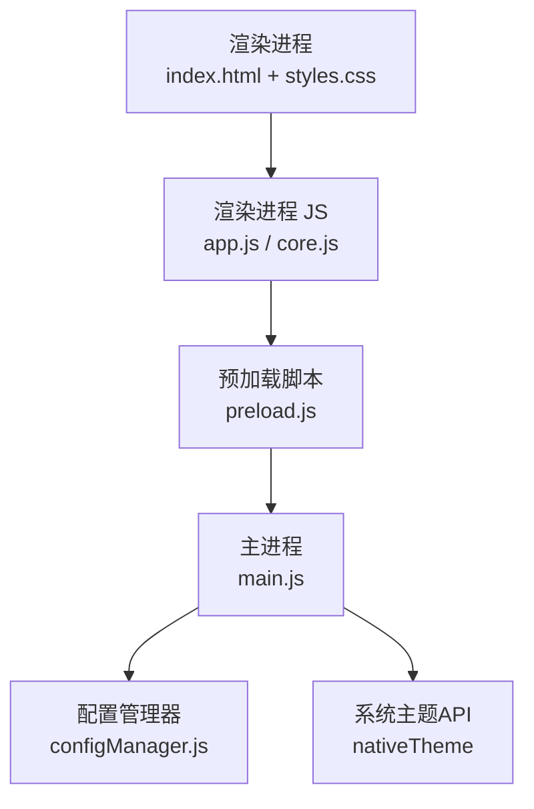
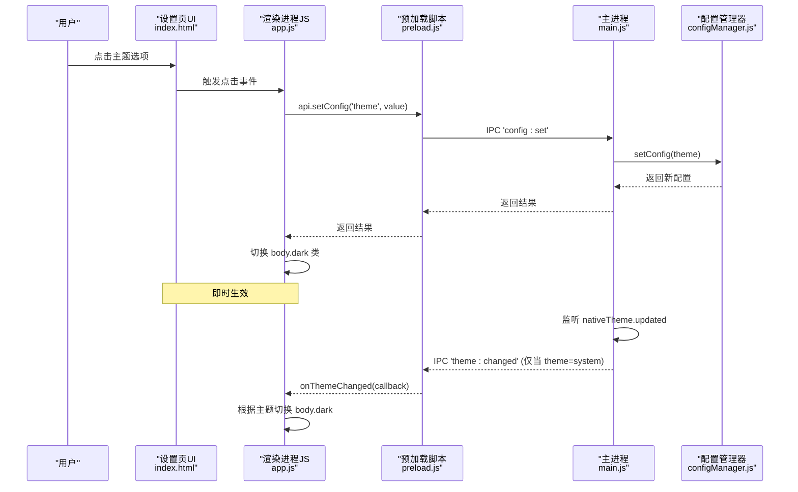
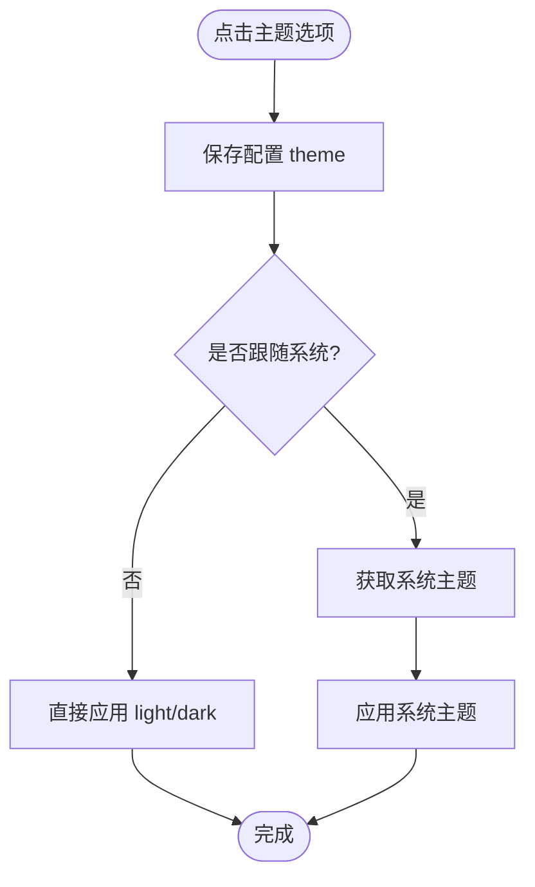
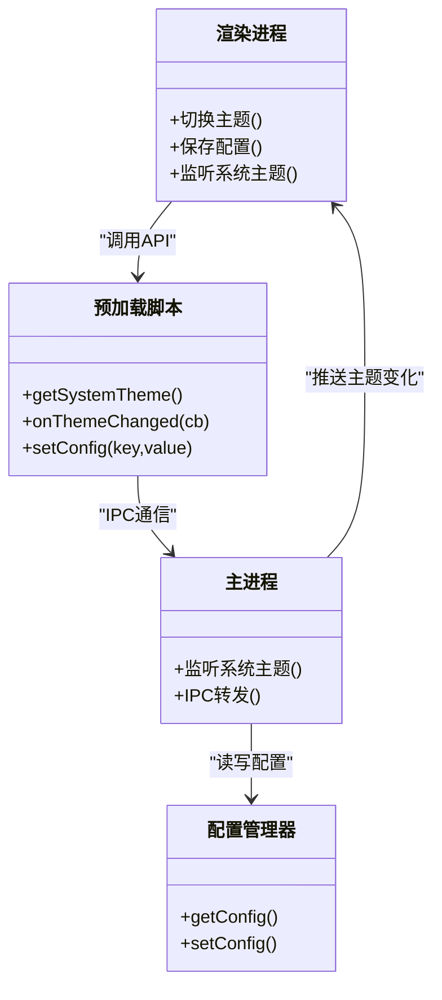

# 主题定制

<cite>
**本文引用的文件**   
- [renderer/styles.css](file://renderer/styles.css)
- [renderer/index.html](file://renderer/index.html)
- [renderer/js/app.js](file://renderer/js/app.js)
- [renderer/js/core.js](file://renderer/js/core.js)
- [preload.js](file://preload.js)
- [main.js](file://main.js)
- [core/config/configManager.js](file://core/config/configManager.js)
</cite>

## 目录
1. [简介](#简介)
2. [项目结构](#项目结构)
3. [核心组件](#核心组件)
4. [架构总览](#架构总览)
5. [详细组件分析](#详细组件分析)
6. [依赖关系分析](#依赖关系分析)
7. [性能考量](#性能考量)
8. [故障排查指南](#故障排查指南)
9. [结论](#结论)
10. [附录](#附录)

## 简介
本文件面向设计师与前端开发者，系统化阐述 PyLibMaster 的主题定制体系：CSS 变量设计、颜色方案管理、深色/浅色主题切换机制、动态样式更新与主题持久化存储；并提供自定义颜色、字体、间距等“设计令牌”的扩展方法、预设主题扩展与第三方主题开发指南，以及主题预览、调试工具与发布流程说明。文档以仓库现有实现为依据，确保可落地、可复用。

## 项目结构
主题系统由以下关键部分构成：
- 样式层：全局 CSS 变量定义与主题类（浅色/深色）
- 界面层：设置页 UI 提供主题选择入口
- 交互层：渲染进程事件绑定与主题切换逻辑
- 桥接层：预加载脚本暴露主题相关 API
- 主进程层：系统主题监听与 IPC 转发
- 配置层：应用配置持久化（含 theme 字段）

图表来源 
- [renderer/index.html](file://renderer/index.html)
- [renderer/styles.css](file://renderer/styles.css)
- [renderer/js/app.js](file://renderer/js/app.js)
- [preload.js](file://preload.js)
- [main.js](file://main.js)
- [core/config/configManager.js](file://core/config/configManager.js)

章节来源
- [renderer/index.html](file://renderer/index.html)
- [renderer/styles.css](file://renderer/styles.css)
- [renderer/js/app.js](file://renderer/js/app.js)
- [preload.js](file://preload.js)
- [main.js](file://main.js)
- [core/config/configManager.js](file://core/config/configManager.js)

## 核心组件
- CSS 变量与主题类
  - :root 定义浅色主题全部设计令牌（背景、文本、边框、强调色、阴影、圆角等）
  - .dark 覆盖为深色主题令牌，保持语义一致
- 设置页主题选项
  - 提供“浅色/深色/跟随系统”三类主题按钮
- 渲染进程主题切换
  - 点击主题按钮时调用配置接口保存主题偏好，并即时切换 body 的 dark 类
- 主进程系统主题同步
  - 当主题为“跟随系统”时，监听 nativeTheme 变化并通过 IPC 推送给渲染进程
- 配置持久化
  - 使用 configManager 将 theme 字段写入 JSON 配置文件，重启后恢复

章节来源
- [renderer/styles.css:28-116](file://renderer/styles.css#L28-L116)
- [renderer/index.html:860-886](file://renderer/index.html#L860-L886)
- [renderer/js/app.js:35-50](file://renderer/js/app.js#L35-L50)
- [main.js:195-208](file://main.js#L195-L208)
- [core/config/configManager.js:89-99](file://core/config/configManager.js#L89-L99)

## 架构总览
主题系统的端到端流程如下：用户在设置页选择主题 → 渲染进程保存配置并立即应用 → 若选择“跟随系统”，主进程监听系统主题变化并通知渲染进程刷新。

图表来源 
- [renderer/index.html:860-886](file://renderer/index.html#L860-L886)
- [renderer/js/app.js:35-50](file://renderer/js/app.js#L35-L50)
- [preload.js:113-118](file://preload.js#L113-L118)
- [main.js:195-208](file://main.js#L195-L208)
- [core/config/configManager.js:157-162](file://core/config/configManager.js#L157-L162)

## 详细组件分析

### CSS 变量系统与颜色方案
- 设计理念
  - 通过语义化变量名组织设计令牌，如 --bg-page、--text-primary、--accent、--shadow-md、--radius-lg 等
  - 浅色主题在 :root 中定义，深色主题通过 .dark 覆盖同名变量，保证组件样式无需改动即可适配
- 颜色方案
  - 背景、文本、边框、强调色、标签状态、进度条、滚动条、阴影等均有对应变量
  - 深色主题对对比度进行优化，避免过亮或过暗导致可读性下降
- 扩展建议
  - 新增令牌遵循命名规范：作用域-用途-属性（如 --bg-sidebar-footer、--text-sidebar-active）
  - 保持明度对比度符合 WCAG 标准，确保可访问性

章节来源
- [renderer/styles.css:28-116](file://renderer/styles.css#L28-L116)

### 深色/浅色主题切换机制
- 用户操作
  - 设置页提供三个主题选项：light、dark、system
- 渲染进程处理
  - 点击后调用 api.setConfig('theme', theme) 持久化
  - 若 theme=system，则通过 api.getSystemTheme() 获取系统主题并应用
  - 通过 document.body.classList.toggle('dark', effective === 'dark') 切换主题
- 系统主题同步
  - 主进程监听 nativeTheme.updated，当 theme=system 时发送 'theme:changed' 事件
  - 渲染进程通过 api.onThemeChanged 回调更新 body.dark

图表来源 
- [renderer/js/app.js:35-50](file://renderer/js/app.js#L35-L50)
- [preload.js:113-118](file://preload.js#L113-L118)
- [main.js:195-208](file://main.js#L195-L208)

章节来源
- [renderer/js/app.js:35-50](file://renderer/js/app.js#L35-L50)
- [preload.js:113-118](file://preload.js#L113-L118)
- [main.js:195-208](file://main.js#L195-L208)

### 动态样式更新与主题持久化
- 动态更新
  - 通过切换 body 的 dark 类，CSS 变量即时生效，无需重新加载页面
  - 所有组件样式均基于变量，切换无闪烁
- 持久化存储
  - 配置项 theme 保存在 pylibmaster-config.json
  - 启动时读取配置，恢复上次主题偏好

章节来源
- [renderer/js/app.js:35-50](file://renderer/js/app.js#L35-L50)
- [core/config/configManager.js:89-99](file://core/config/configManager.js#L89-L99)
- [core/config/configManager.js:157-162](file://core/config/configManager.js#L157-L162)

### 自定义设计令牌（颜色、字体、间距）
- 颜色
  - 在 :root 或 .dark 中新增/修改变量，如 --accent、--tag-ok-text 等
  - 建议在 .dark 中成对覆盖，确保双主题一致性
- 字体
  - 可通过变量控制字体族、字号、行高，或在组件样式中引用变量
- 间距
  - 使用统一的间距变量（如 --radius-*、--spacing-*），便于整体节奏调整
- 最佳实践
  - 变量命名清晰、分层明确
  - 避免硬编码颜色值，统一走变量
  - 变更后进行双主题视觉回归测试

章节来源
- [renderer/styles.css:28-116](file://renderer/styles.css#L28-L116)

### 主题配置文件格式
- 位置
  - Windows: %APPDATA%/PyLibMaster/pylibmaster-config.json
  - macOS: ~/Library/Application Support/PyLibMaster/pylibmaster-config.json
  - Linux: ~/.config/PyLibMaster/pylibmaster-config.json
- 关键字段
  - theme: 'light' | 'dark' | 'system'
  - language: 'zh' | 'en'
  - storagePath: 日志与备份路径
  - parallelThreads、retryCount、smartRoute、currentEnv、windowBounds 等
- 读写方式
  - 通过 configManager.getConfig()/setConfig() 安全读写，支持批量更新与范围校验

章节来源
- [core/config/configManager.js:11-15](file://core/config/configManager.js#L11-L15)
- [core/config/configManager.js:89-99](file://core/config/configManager.js#L89-L99)
- [core/config/configManager.js:144-147](file://core/config/configManager.js#L144-L147)
- [core/config/configManager.js:157-178](file://core/config/configManager.js#L157-L178)

### 预设主题扩展与第三方主题开发指南
- 预设主题扩展
  - 在 styles.css 中新增一个主题类（如 .theme-blueprint），覆盖所有必要变量
  - 在设置页增加对应选项按钮，并在 app.js 中绑定点击事件，保存 theme 并切换类
- 第三方主题
  - 独立维护主题 CSS 文件，按约定命名变量
  - 提供安装/启用流程：复制主题文件到指定目录，在设置中选择并保存
  - 确保与默认主题变量集兼容，避免缺失变量导致样式异常

章节来源
- [renderer/styles.css:28-116](file://renderer/styles.css#L28-L116)
- [renderer/index.html:860-886](file://renderer/index.html#L860-L886)
- [renderer/js/app.js:35-50](file://renderer/js/app.js#L35-L50)

### 主题预览、调试工具与发布流程
- 预览
  - 在浏览器 DevTools 中切换 body 的 dark 类，实时预览深色主题效果
  - 使用样式检查器定位变量未生效的位置
- 调试
  - 控制台输出主题切换日志，确认配置保存与 IPC 通信正常
  - 验证 system 模式下 nativeTheme 事件是否触发
- 发布
  - 构建产物包含 renderer/**/*，主题 CSS 随包分发
  - 打包配置见 package.json build 字段，确保样式资源被包含

章节来源
- [package.json:28-74](file://package.json#L28-L74)
- [renderer/js/app.js:35-50](file://renderer/js/app.js#L35-L50)

## 依赖关系分析
主题系统的关键依赖关系如下：
- 渲染进程依赖 preload 暴露的 API（getSystemTheme、onThemeChanged、setConfig）
- 主进程依赖 nativeTheme 监听系统主题变化
- 配置管理器负责 theme 字段的持久化与读取

图表来源 
- [renderer/js/app.js:35-50](file://renderer/js/app.js#L35-L50)
- [preload.js:113-118](file://preload.js#L113-L118)
- [main.js:195-208](file://main.js#L195-L208)
- [core/config/configManager.js:144-178](file://core/config/configManager.js#L144-L178)

章节来源
- [renderer/js/app.js:35-50](file://renderer/js/app.js#L35-L50)
- [preload.js:113-118](file://preload.js#L113-L118)
- [main.js:195-208](file://main.js#L195-L208)
- [core/config/configManager.js:144-178](file://core/config/configManager.js#L144-L178)

## 性能考量
- 切换开销极低：仅切换 body 类，CSS 变量即时生效，无重绘大成本
- 系统主题监听仅在 theme=system 时启用，避免不必要的 IPC 通信
- 配置写入采用原子写入（临时文件+重命名），降低损坏风险

[本节为通用指导，不直接分析具体文件]

## 故障排查指南
- 主题未生效
  - 检查 body 是否添加了 dark 类
  - 确认 CSS 变量覆盖是否正确
- 系统主题不同步
  - 确认 theme=system 且 main.js 已注册 nativeTheme 监听
  - 检查 IPC 'theme:changed' 是否被渲染进程接收
- 配置未持久化
  - 查看 pylibmaster-config.json 是否存在且包含 theme 字段
  - 检查 configManager 的 setConfig 是否成功

章节来源
- [renderer/js/app.js:35-50](file://renderer/js/app.js#L35-L50)
- [main.js:195-208](file://main.js#L195-L208)
- [core/config/configManager.js:157-162](file://core/config/configManager.js#L157-L162)

## 结论
PyLibMaster 的主题系统以 CSS 变量为核心，结合 Electron 的系统主题能力与配置持久化，实现了轻量、可扩展、跨平台的双主题体验。通过清晰的变量命名与模块化职责划分，设计师与开发者可以高效地扩展主题、定制设计令牌，并确保一致的视觉与交互体验。

[本节为总结，不直接分析具体文件]

## 附录
- 常用设计令牌示例（参考 styles.css 中的变量定义）
  - 背景：--bg-page、--bg-sidebar、--bg-card、--bg-hover、--bg-input
  - 文本：--text-primary、--text-secondary、--text-muted、--text-sidebar、--text-sidebar-active
  - 强调色：--accent、--accent-light、--accent-bg、--accent-dark
  - 标签与状态：--tag-ok、--tag-update、--tag-danger 及对应文本变量
  - 进度与滚动条：--progress-bg、--progress-fill、--scrollbar-thumb
  - 阴影与圆角：--shadow-sm/md/lg、--radius-sm/md/lg/xl
- 主题扩展步骤
  - 新增主题类并覆盖变量
  - 在设置页添加选项按钮
  - 在 app.js 中绑定点击事件并保存配置
  - 验证双主题效果与系统主题同步

章节来源
- [renderer/styles.css:28-116](file://renderer/styles.css#L28-L116)
- [renderer/index.html:860-886](file://renderer/index.html#L860-L886)
- [renderer/js/app.js:35-50](file://renderer/js/app.js#L35-L50)