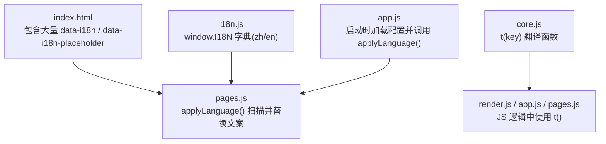
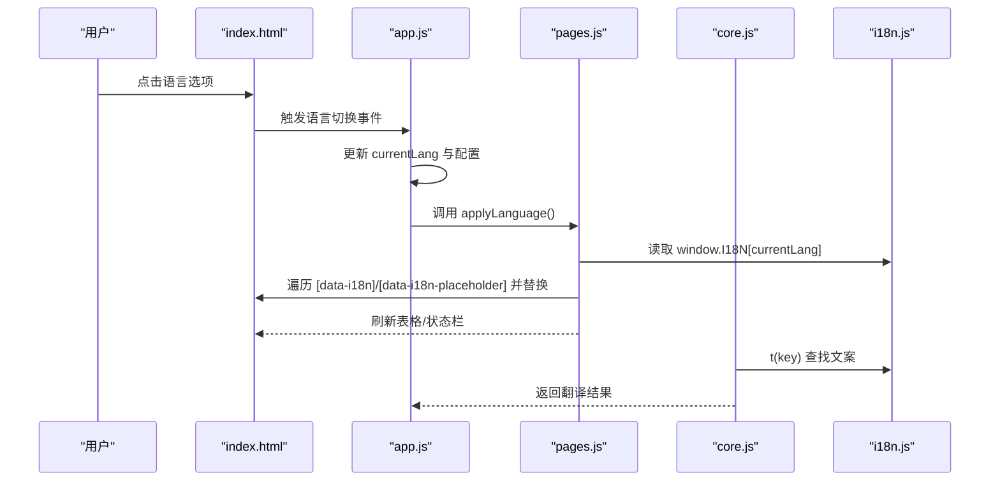
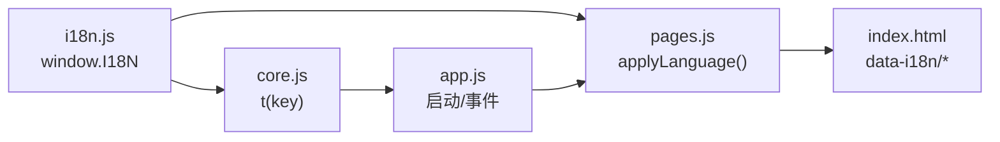

# 国际化支持

<cite>
**本文引用的文件**   
- [renderer/js/i18n.js](file://renderer/js/i18n.js)
- [renderer/js/core.js](file://renderer/js/core.js)
- [renderer/js/pages.js](file://renderer/js/pages.js)
- [renderer/js/app.js](file://renderer/js/app.js)
- [renderer/index.html](file://renderer/index.html)
- [package.json](file://package.json)
</cite>

## 目录
1. [简介](#简介)
2. [项目结构](#项目结构)
3. [核心组件](#核心组件)
4. [架构总览](#架构总览)
5. [详细组件分析](#详细组件分析)
6. [依赖关系分析](#依赖关系分析)
7. [性能考量](#性能考量)
8. [故障排查指南](#故障排查指南)
9. [结论](#结论)
10. [附录：API 参考与最佳实践](#附录api-参考与最佳实践)

## 简介
本文件为 PyLibMaster 的国际化（i18n）系统提供完整、深入且易于理解的文档。内容涵盖多语言支持的实现机制、语言包管理、动态语言切换、本地化字符串处理，以及 data-i18n 属性的使用方式、占位符替换和复数形式处理策略。同时给出添加新语言、翻译文件组织与版本管理的建议，并补充日期时间格式化、数字格式化与文化适配的最佳实践，最后提供开发指南与测试方法，确保对多语言开发友好。

## 项目结构
PyLibMaster 的国际化能力集中在渲染进程的前端代码中，采用“字典 + DOM 属性标记 + 运行时应用”的模式：
- 字典定义：所有文案以键值对形式集中维护在 i18n.js 中，按语言分组（如 zh、en）。
- DOM 标记：HTML 元素通过 data-i18n 和 data-i18n-placeholder 属性声明需要本地化的文本与占位符。
- 运行时应用：pages.js 中的 applyLanguage() 遍历 DOM，根据当前语言将对应文案注入到页面；core.js 暴露 t(key) 用于 JS 逻辑中的即时翻译。

**图表来源** 
- [renderer/index.html:62-118](file://renderer/index.html#L62-L118)
- [renderer/js/pages.js:358-374](file://renderer/js/pages.js#L358-L374)
- [renderer/js/i18n.js:11-372](file://renderer/js/i18n.js#L11-L372)
- [renderer/js/core.js:12-17](file://renderer/js/core.js#L12-L17)
- [renderer/js/app.js:130-137](file://renderer/js/app.js#L130-L137)

**章节来源**
- [renderer/index.html:1-120](file://renderer/index.html#L1-L120)
- [renderer/js/i18n.js:1-20](file://renderer/js/i18n.js#L1-L20)
- [renderer/js/pages.js:350-374](file://renderer/js/pages.js#L350-L374)
- [renderer/js/core.js:1-20](file://renderer/js/core.js#L1-L20)
- [renderer/js/app.js:128-140](file://renderer/js/app.js#L128-L140)

## 核心组件
- 字典模块（i18n.js）
  - 职责：集中维护多语言文案，挂载至 window.I18N，供全局访问。
  - 结构：按语言分组对象（zh、en），键名遵循“模块.具体文案”的命名规范。
- 翻译函数（core.js）
  - 职责：提供 t(key) 函数，基于当前语言 currentLang 从 I18N 字典取值，缺失时回退到 key。
  - 状态：currentLang 保存当前语言（默认 zh）。
- 应用层（pages.js）
  - 职责：applyLanguage() 遍历 DOM，读取 data-i18n 与 data-i18n-placeholder，将文案与占位符替换为当前语言文本；并在切换语言后刷新表格与状态栏。
- 入口与初始化（app.js）
  - 职责：启动时加载配置（含 language），设置 document.documentElement.lang，调用 applyLanguage() 完成首次渲染。

**章节来源**
- [renderer/js/i18n.js:11-372](file://renderer/js/i18n.js#L11-L372)
- [renderer/js/core.js:12-17](file://renderer/js/core.js#L12-L17)
- [renderer/js/pages.js:358-374](file://renderer/js/pages.js#L358-L374)
- [renderer/js/app.js:130-137](file://renderer/js/app.js#L130-L137)

## 架构总览
下图展示了国际化系统在运行时的数据流与交互顺序：用户切换语言或应用启动时，系统如何从配置读取语言、更新 DOM 文案，并通过 t() 在 JS 逻辑中获取文案。

**图表来源** 
- [renderer/js/app.js:52-62](file://renderer/js/app.js#L52-L62)
- [renderer/js/pages.js:358-374](file://renderer/js/pages.js#L358-L374)
- [renderer/js/core.js:17](file://renderer/js/core.js#L17)
- [renderer/js/i18n.js:11-372](file://renderer/js/i18n.js#L11-L372)

## 详细组件分析

### 字典模块（i18n.js）
- 设计要点
  - 集中式字典：所有文案以键值对存储，便于统一管理与检索。
  - 命名约定：键名采用“模块.具体文案”，例如 nav.install、btn.cancel，避免冲突并提升可读性。
  - 扩展性：新增语言只需在 window.I18N 下新增语言对象，并确保键覆盖全面。
- 复杂度与性能
  - 字典查找为 O(1)，整体文案替换为 O(n)（n 为匹配到的 DOM 节点数量）。
- 错误处理
  - 若某键缺失，上层应保证回退策略（如 t(key) 返回 key），避免空显示。

**章节来源**
- [renderer/js/i18n.js:11-372](file://renderer/js/i18n.js#L11-L372)

### 翻译函数（core.js）
- 设计要点
  - t(key) 基于 currentLang 从 I18N 字典取值，缺失时返回 key 作为回退。
  - currentLang 由配置加载或用户切换决定。
- 使用场景
  - 在 JS 逻辑中直接调用 t('key') 获取文案，适用于非 DOM 场景（如 Toast、提示消息等）。

**章节来源**
- [renderer/js/core.js:12-17](file://renderer/js/core.js#L12-L17)

### 应用层（pages.js）
- 设计要点
  - applyLanguage() 负责：
    - 遍历 [data-i18n] 并将 textContent 设置为对应文案。
    - 遍历 [data-i18n-placeholder] 并将 placeholder 设置为对应文案。
    - 刷新各页面表格与状态栏，确保动态内容也符合当前语言。
- 性能优化
  - 批量查询与一次性替换，减少重排重绘。
  - 切换语言后仅刷新必要区域（表格、状态栏、选择信息）。

**章节来源**
- [renderer/js/pages.js:358-374](file://renderer/js/pages.js#L358-L374)

### 入口与初始化（app.js）
- 设计要点
  - 启动流程：
    - 加载配置（包括 language）。
    - 设置 document.documentElement.lang。
    - 调用 applyLanguage() 完成首次文案注入。
  - 用户交互：
    - 语言选项点击后更新 currentLang、持久化配置，并立即刷新界面。
- 事件绑定
  - 主题与语言切换事件分别处理，确保 UI 与配置一致。

**章节来源**
- [renderer/js/app.js:52-62](file://renderer/js/app.js#L52-L62)
- [renderer/js/app.js:130-137](file://renderer/js/app.js#L130-L137)

### HTML 标记（index.html）
- 设计要点
  - 广泛使用 data-i18n 与 data-i18n-placeholder 标记需要本地化的文本与占位符。
  - 侧边栏、页面标题、按钮、提示、空状态等均通过标记实现多语言。
- 可维护性
  - 文案与逻辑分离，便于翻译人员编辑字典而不影响代码。

**章节来源**
- [renderer/index.html:62-118](file://renderer/index.html#L62-L118)

## 依赖关系分析
- 模块耦合
  - core.js 依赖 i18n.js（window.I18N）与 currentLang。
  - pages.js 依赖 i18n.js 与 DOM API，负责文案注入。
  - app.js 依赖 pages.js 与 core.js，协调启动与用户交互。
- 外部依赖
  - package.json 定义了 Electron 与 electron-updater 等依赖，国际化不直接依赖第三方库。

**图表来源** 
- [renderer/js/i18n.js:11-372](file://renderer/js/i18n.js#L11-L372)
- [renderer/js/core.js:12-17](file://renderer/js/core.js#L12-L17)
- [renderer/js/pages.js:358-374](file://renderer/js/pages.js#L358-L374)
- [renderer/js/app.js:130-137](file://renderer/js/app.js#L130-L137)
- [renderer/index.html:62-118](file://renderer/index.html#L62-L118)

**章节来源**
- [package.json:1-79](file://package.json#L1-L79)

## 性能考量
- 文案替换复杂度：O(n)，n 为匹配到的 DOM 节点数量。建议在大型页面中按需刷新（如仅刷新当前页）。
- 字典查找：O(1)，应避免频繁重建字典。
- 语言切换频率：避免高频切换导致重复渲染，可在用户确认后再执行 applyLanguage()。
- 表格与状态栏刷新：仅在语言切换后刷新必要区域，减少重排重绘。

## 故障排查指南
- 常见问题
  - 文案未显示：检查 data-i18n 键是否在 I18N 字典中存在；确认 applyLanguage() 是否被调用。
  - 占位符未替换：检查 data-i18n-placeholder 是否正确；确认目标元素类型支持 placeholder。
  - 动态内容未更新：确保在数据变更后重新调用相关渲染函数（如 renderUninstallTable、renderUpdateTable）。
- 调试技巧
  - 在浏览器控制台打印 currentLang 与 window.I18N[currentLang] 验证字典加载。
  - 临时在 applyLanguage() 中加入日志，观察遍历与替换过程。

**章节来源**
- [renderer/js/pages.js:358-374](file://renderer/js/pages.js#L358-L374)
- [renderer/js/core.js:17](file://renderer/js/core.js#L17)

## 结论
PyLibMaster 的国际化系统采用简洁高效的“字典 + DOM 标记 + 运行时应用”模式，具备良好可扩展性与可维护性。通过统一的键命名规范与集中式字典管理，开发者可以快速添加新语言与文案；通过 t(key) 与 applyLanguage()，实现了 JS 逻辑与 DOM 文案的双通道本地化。结合合理的性能优化与故障排查策略，可为多语言开发提供稳定支撑。

## 附录：API 参考与最佳实践

### API 参考
- 字典访问
  - window.I18N：全局字典对象，包含各语言键值对。
  - 示例路径：[renderer/js/i18n.js:11-372](file://renderer/js/i18n.js#L11-L372)
- 翻译函数
  - t(key)：返回当前语言的文案，缺失时回退到 key。
  - 示例路径：[renderer/js/core.js:17](file://renderer/js/core.js#L17)
- 应用文案
  - applyLanguage()：遍历 DOM，替换 data-i18n 与 data-i18n-placeholder 文案，并刷新表格与状态栏。
  - 示例路径：[renderer/js/pages.js:358-374](file://renderer/js/pages.js#L358-L374)
- 语言切换
  - 用户点击语言选项后，更新 currentLang、持久化配置，并调用 applyLanguage()。
  - 示例路径：[renderer/js/app.js:52-62](file://renderer/js/app.js#L52-L62)

### 占位符替换与复数处理
- 占位符替换
  - 在字典文案中使用 {name} 等占位符，JS 中通过字符串替换注入变量。
  - 示例路径：[renderer/js/pages.js:492-508](file://renderer/js/pages.js#L492-L508)
- 复数形式处理
  - 当前系统未内置复数规则引擎，建议在字典中为不同数量提供独立键（如 item_one、item_many），或在 JS 层根据数量选择对应键。

### 添加新语言步骤
- 在 i18n.js 中新增语言对象（如 fr），并为所有键提供翻译。
- 在 index.html 中添加语言选项按钮，绑定点击事件更新 currentLang 与配置。
- 调用 applyLanguage() 完成首次渲染。

### 翻译文件组织与版本管理
- 组织建议
  - 集中式字典（当前方案）：适合中小型项目，便于统一管理。
  - 分文件字典：按语言拆分为单独文件（如 zh.json、en.json），便于翻译团队协作。
- 版本管理
  - 使用 Git 管理字典变更，提交时附带变更说明。
  - 发布前进行完整性校验（缺失键检测）。

### 日期时间与数字格式化
- 日期时间格式化
  - 建议使用 Intl.DateTimeFormat，根据当前语言与文化环境自动格式化。
- 数字格式化
  - 建议使用 Intl.NumberFormat，支持千分位、小数位数与文化差异。

### 文化适配最佳实践
- 文本方向：支持 RTL（阿拉伯语等）布局。
- 单位与度量：根据地区习惯显示单位（如温度、长度）。
- 颜色与图标：避免文化敏感的颜色与符号。

### 开发指南与测试方法
- 开发指南
  - 新增文案时同步补充所有语言键。
  - 使用 t(key) 在 JS 逻辑中获取文案，避免硬编码。
  - 在 HTML 中使用 data-i18n 与 data-i18n-placeholder 标记文案。
- 测试方法
  - 单元测试：验证 t(key) 返回值与占位符替换。
  - 集成测试：切换语言后检查关键页面文案是否正确。
  - 自动化脚本：扫描 HTML 与 JS 中的文案引用，对比字典完整性。