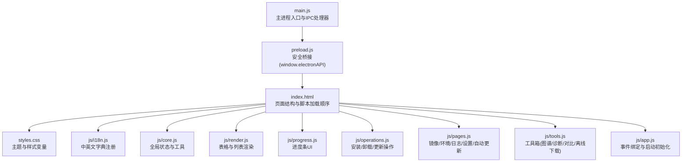
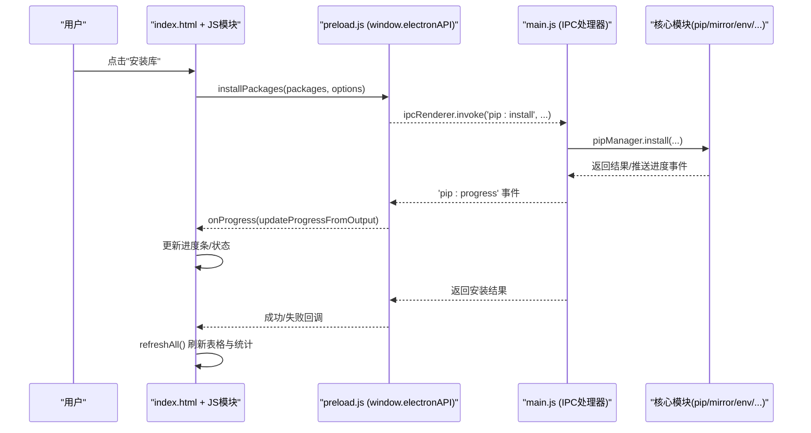
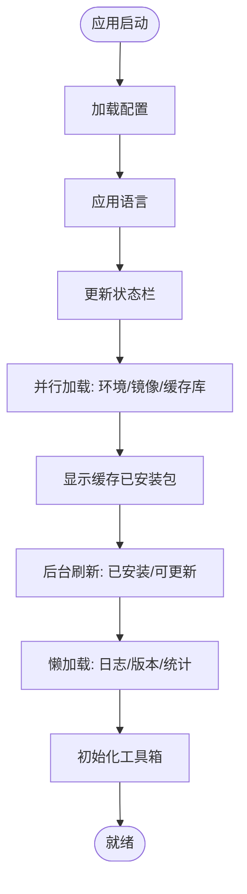
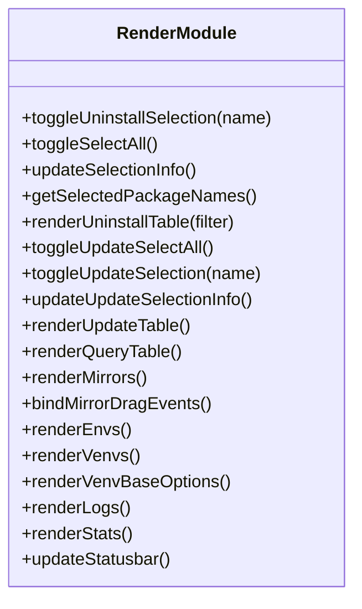
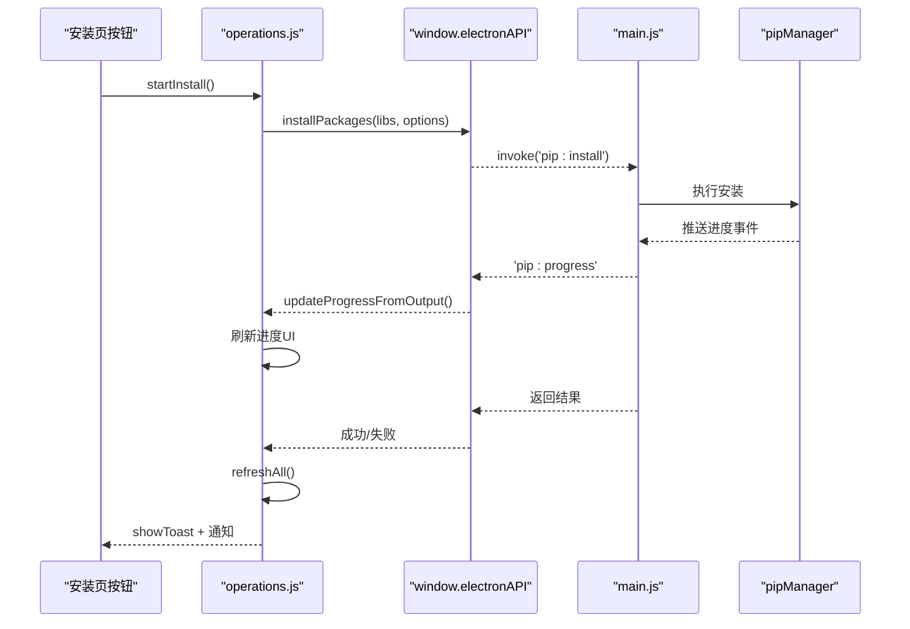
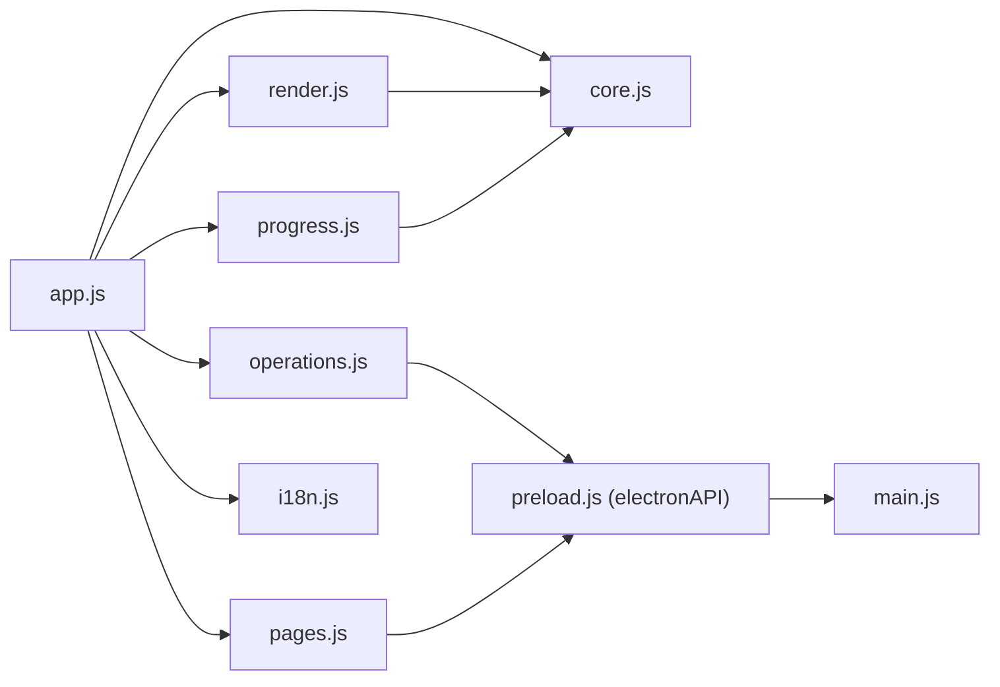

# 用户界面

<cite>
**本文引用的文件**   
- [index.html](file://renderer/index.html)
- [styles.css](file://renderer/styles.css)
- [app.js](file://renderer/js/app.js)
- [core.js](file://renderer/js/core.js)
- [render.js](file://renderer/js/render.js)
- [operations.js](file://renderer/js/operations.js)
- [pages.js](file://renderer/js/pages.js)
- [progress.js](file://renderer/js/progress.js)
- [tools.js](file://renderer/js/tools.js)
- [i18n.js](file://renderer/js/i18n.js)
- [preload.js](file://preload.js)
- [main.js](file://main.js)
- [package.json](file://package.json)
</cite>

## 更新摘要
**变更内容**   
- HTML界面显著增强，包含改进的样式和现代化UI组件
- 新增完整的深色主题支持，通过CSS变量实现无缝切换
- 响应式设计优化，适配不同屏幕尺寸和设备
- 增强的用户体验功能：搜索过滤器、排序能力、实时状态更新
- CSS样式表新增277行代码，包含现代UI组件和动画效果
- 改进的导航系统和页面布局结构

## 目录
1. [简介](#简介)
2. [项目结构](#项目结构)
3. [核心组件](#核心组件)
4. [架构总览](#架构总览)
5. [详细组件分析](#详细组件分析)
6. [依赖关系分析](#依赖关系分析)
7. [性能考量](#性能考量)
8. [故障排查指南](#故障排查指南)
9. [结论](#结论)
10. [附录](#附录)

## 简介
本文件面向前端开发者，系统化阐述 PyLibMaster 用户界面的前端架构与实现细节。内容覆盖基于 HTML/CSS/JavaScript 的主界面布局、导航系统、交互组件与各 JS 模块职责（应用初始化、全局状态管理、表格渲染、操作逻辑等），并说明 UI 组件设计模式、事件处理机制、数据绑定方式，以及主题定制、响应式设计与国际化支持。同时提供界面自定义指南、扩展开发说明、用户体验优化建议与可访问性支持要点。

**最新更新**：界面经过重大升级，引入了现代化的深色主题支持、响应式设计和增强的用户体验功能。

## 项目结构
PyLibMaster 的渲染进程采用"单页多视图"的模块化组织：HTML 定义页面骨架与 DOM 节点，CSS 通过 CSS 变量实现浅色/深色主题，JS 按职责拆分为多个模块，通过 window.electronAPI 与主进程通信。

**图表来源** 
- [index.html:1-120](file://renderer/index.html#L1-L120)
- [styles.css:28-116](file://renderer/styles.css#L28-L116)
- [i18n.js:11-191](file://renderer/js/i18n.js#L11-L191)
- [core.js:11-36](file://renderer/js/core.js#L11-L36)
- [render.js:16-158](file://renderer/js/render.js#L16-L158)
- [progress.js:14-74](file://renderer/js/progress.js#L14-L74)
- [operations.js:15-113](file://renderer/js/operations.js#L15-L113)
- [pages.js:15-161](file://renderer/js/pages.js#L15-L161)
- [tools.js:14-29](file://renderer/js/tools.js#L14-L29)
- [app.js:16-27](file://renderer/js/app.js#L16-L27)
- [preload.js:20-200](file://preload.js#L20-L200)
- [main.js:43-74](file://main.js#L43-L74)

章节来源
- [index.html:1-120](file://renderer/index.html#L1-L120)
- [styles.css:28-116](file://renderer/styles.css#L28-L116)
- [package.json:1-79](file://package.json#L1-L79)

## 核心组件
- index.html：定义标题栏、侧边栏导航、内容区（安装/卸载/更新/查询/镜像/环境/日志/设置/关于/模板/PyPI浏览/工具箱）及底部状态栏、备份确认模态框、Toast 容器。脚本加载顺序保证依赖先于消费者执行。
- styles.css：通过 CSS 变量集中管理浅色/深色主题色彩、阴影、圆角等；使用 .dark 类切换主题；响应式布局通过 Flex/Grid 与媒体查询实现。
- app.js：事件绑定与启动初始化。负责侧边栏导航切换、版本模式显示控制、主题/语言切换、实时筛选与设置项绑定、全局进度事件与应用更新事件监听、快捷键系统、启动阶段并行加载与懒加载策略。
- core.js：全局状态与通用工具。暴露 api（window.electronAPI）、i18n 引用；维护 installedLibs/updateLibs/mirrors/envs/logData 等共享状态；提供 escapeHtml、showToast、generateOperationId、animateStat、closeModal 等工具函数。
- render.js：表格渲染与选择逻辑。涵盖卸载页、更新页、查询页表格渲染；镜像源列表渲染（含编辑模式与拖拽排序）；环境列表与虚拟环境列表渲染；日志列表渲染；统计卡片与状态栏更新。
- operations.js：安装/卸载/更新操作逻辑。包含取消操作、批量/单个卸载、更新单个/全部、检查更新、从搜索或拖拽安装、刷新各页面数据、当前页面刷新等。
- pages.js：镜像/环境/日志/设置/自动更新等页面交互。包括镜像源增删改查、测速、智能路由开关；环境切换、修复 pip、虚拟环境创建/删除/使用；日志导出与清空；语言与主题应用；包详情弹窗；环境对比；定时调度器配置与执行；系统集成右键菜单开关。
- progress.js：进度条 UI。统一重置、完成状态设置、百分比与计数更新、解析后端结构化进度事件与文本输出兜底、操作完成后延迟隐藏。
- tools.js：工具箱页面交互。依赖图谱（Canvas 力导向图与树形图）、磁盘空间分析（条形图）、环境对比（diff 视图）、离线包下载、操作撤销、系统集成（右键菜单）。
- i18n.js：中英文字典注册到 window.I18N，供 t(key) 与 applyLanguage() 使用。

**章节来源**
- [index.html:1-120](file://renderer/index.html#L1-L120)
- [styles.css:28-116](file://renderer/styles.css#L28-L116)
- [app.js:16-27](file://renderer/js/app.js#L16-L27)
- [core.js:11-36](file://renderer/js/core.js#L11-L36)
- [render.js:16-158](file://renderer/js/render.js#L16-L158)
- [operations.js:15-113](file://renderer/js/operations.js#L15-L113)
- [pages.js:15-161](file://renderer/js/pages.js#L15-L161)
- [progress.js:14-74](file://renderer/js/progress.js#L14-L74)
- [tools.js:14-29](file://renderer/js/tools.js#L14-L29)
- [i18n.js:11-191](file://renderer/js/i18n.js#L11-L191)

## 架构总览
渲染进程通过 preload.js 暴露安全的 window.electronAPI，调用主进程的 IPC 处理器，进而协调 core 模块（pipManager、mirrorManager、envManager、backupManager、logManager、configManager、schedulerManager、templateManager、auditManager、undoManager、explorerManager）完成业务。

**图表来源** 
- [index.html:134-215](file://renderer/index.html#L134-L215)
- [operations.js:301-370](file://renderer/js/operations.js#L301-L370)
- [progress.js:101-141](file://renderer/js/progress.js#L101-L141)
- [preload.js:57-65](file://preload.js#L57-L65)
- [main.js:17-31](file://main.js#L17-L31)

章节来源
- [preload.js:20-200](file://preload.js#L20-L200)
- [main.js:43-74](file://main.js#L43-L74)

## 详细组件分析

### 应用初始化与事件绑定（app.js）
- 侧边栏导航：点击项切换 active 类并显示对应 page。
- 安装页版本模式：根据下拉值显示/隐藏版本号输入框。
- 主题/语言切换：保存配置并即时应用；主题跟随系统时读取系统主题。
- 实时筛选与设置项绑定：卸载/查询/日志页的搜索与筛选变化触发重渲染；线程数与重试次数变更持久化。
- 全局事件：绑定 pip 进度事件、应用更新事件、主题变化事件、调度器执行事件。
- 快捷键：Ctrl+F 聚焦搜索框、Ctrl+1~9 切换页面、Esc 关闭弹窗。
- 启动流程：分阶段并行加载（配置、环境、镜像、缓存库），快速显示缓存数据，后台刷新完整已安装列表与可更新列表，低优先级加载日志与应用版本，渲染对比选项与工具箱。

**图表来源** 
- [app.js:128-210](file://renderer/js/app.js#L128-L210)

**章节来源**
- [app.js:16-27](file://renderer/js/app.js#L16-L27)
- [app.js:35-62](file://renderer/js/app.js#L35-L62)
- [app.js:64-78](file://renderer/js/app.js#L64-L78)
- [app.js:80-103](file://renderer/js/app.js#L80-L103)
- [app.js:104-127](file://renderer/js/app.js#L104-L127)
- [app.js:128-210](file://renderer/js/app.js#L128-L210)

### 全局状态管理与工具（core.js）
- 全局引用：api（window.electronAPI）、i18n（window.I18N）。
- 共享状态：installedLibs、updateLibs、mirrors、envs、currentEnvIndex、logData、todayInstalled、pendingUninstall、editingMirrorIndex、appConfig、进度相关变量、selectedForUninstall/Update。
- 工具函数：escapeHtml（防 XSS）、showToast（提示消息）、generateOperationId（唯一操作ID）、animateStat（数值动画）、closeModal（关闭模态）。

**章节来源**
- [core.js:11-36](file://renderer/js/core.js#L11-36)
- [core.js:37-93](file://renderer/js/core.js#L37-93)

### 表格渲染与选择逻辑（render.js）
- 卸载页：单选/全选、选择信息更新、表格渲染（名称/版本/时间/大小/状态/操作）。
- 更新页：全选/单选、搜索过滤、表格渲染（当前/最新/日期/操作）。
- 查询页：关键词搜索、状态筛选（所有/已安装/有更新）、排序（时间/名称/大小）。
- 镜像源：列表渲染（显示/编辑模式）、测速结果展示、默认标记、拖拽排序（本地数组重排后持久化）。
- 环境：Python 环境列表渲染、虚拟环境列表渲染（名称/版本/pip/包数量/操作）、基础 Python 下拉选项填充。
- 日志：类型筛选与关键词搜索、条目渲染（动作/时间/状态）。
- 统计与状态栏：数字动画、已安装/可更新/今日安装计数、Python 版本与环境名显示。

**图表来源** 
- [render.js:16-158](file://renderer/js/render.js#L16-L158)
- [render.js:207-318](file://renderer/js/render.js#L207-L318)
- [render.js:320-445](file://renderer/js/render.js#L320-L445)

**章节来源**
- [render.js:16-158](file://renderer/js/render.js#L16-L158)
- [render.js:207-318](file://renderer/js/render.js#L207-L318)
- [render.js:320-445](file://renderer/js/render.js#L320-L445)

### 操作逻辑（operations.js）
- 取消操作：通过 operationId 向主进程发送取消请求。
- 卸载：单个/批量卸载，支持备份确认对话框；成功后刷新全量数据并清理选择状态。
- 更新：单个/全部更新，读取选项（并行/重试/回滚），显示进度与结果统计。
- 检查更新：拉取可更新列表并重渲染。
- 安装：从搜索框（支持 pip install 命令粘贴、路径识别）或拖拽文件（.txt/.whl）安装；显示进度与结果统计。
- 刷新：refreshInstalled、refreshOutdated、refreshLogs、refreshEnvs、refreshMirrors、refreshAll、refreshCurrentPage。

**图表来源** 
- [operations.js:301-370](file://renderer/js/operations.js#L301-L370)
- [progress.js:101-141](file://renderer/js/progress.js#L101-L141)
- [preload.js:57-65](file://preload.js#L57-L65)

**章节来源**
- [operations.js:15-113](file://renderer/js/operations.js#L15-L113)
- [operations.js:238-370](file://renderer/js/operations.js#L238-L370)
- [operations.js:399-536](file://renderer/js/operations.js#L399-L536)

### 页面交互（pages.js）
- 镜像源：设置默认、删除、编辑、保存、添加、测速、智能路由开关、恢复默认。
- 环境：切换环境、修复 pip、虚拟环境创建/删除/使用、导出/导入 requirements.txt、环境对比。
- 日志：添加记录、清空、导出 CSV/Markdown。
- 语言与主题：applyLanguage 遍历 data-i18n/data-i18n-placeholder 并刷新表格与状态栏；loadConfig 应用配置（语言/主题/线程/重试/存储路径/通知/托盘）。
- 自动更新：检查更新、下载进度、安装更新、错误处理。
- 包详情：弹窗显示版本/摘要/作者/主页/许可证/位置/依赖/被依赖/依赖树。
- 定时调度器：加载状态、切换开关、修改频率、白名单管理、立即执行。
- 系统集成：资源管理器右键菜单启用/禁用。

**章节来源**
- [pages.js:15-161](file://renderer/js/pages.js#L15-L161)
- [pages.js:163-218](file://renderer/js/pages.js#L163-L218)
- [pages.js:220-318](file://renderer/js/pages.js#L220-L318)
- [pages.js:320-349](file://renderer/js/pages.js#L320-L349)
- [pages.js:351-422](file://renderer/js/pages.js#L351-L422)
- [pages.js:424-522](file://renderer/js/pages.js#L424-L522)
- [pages.js:524-602](file://renderer/js/pages.js#L524-L602)
- [pages.js:604-694](file://renderer/js/pages.js#L604-L694)
- [pages.js:696-714](file://renderer/js/pages.js#L696-L714)
- [pages.js:716-800](file://renderer/js/pages.js#L716-L800)

### 进度条 UI（progress.js）
- resetProgress：新操作开始时清除旧定时器、重置进度为 0%。
- finishProgress：成功/失败状态设置、刷新日志、延迟隐藏进度卡片。
- setProgressUI：更新填充宽度、百分比、计数。
- updateProgressFromOutput：解析结构化进度事件（[PROGRESS] JSON）与文本输出兜底（卸载/回滚），解析 pip 下载/安装中的包名更新标签。

**章节来源**
- [progress.js:14-74](file://renderer/js/progress.js#L14-L74)
- [progress.js:76-141](file://renderer/js/progress.js#L76-L141)

### 工具箱（tools.js）
- Tab 切换：依赖图谱/环境诊断/空间分析/环境对比/离线下载。
- 依赖图谱：Canvas 高清适配、树形图与力导向图渲染、交互（缩放/平移/拖拽/悬停/双击重置）。
- 磁盘空间分析：Top N 包条形图、总量与路径显示。
- 环境对比：选择来源（当前环境/文件）、差异结果展示。
- 离线下载：包名输入、目标目录、平台选择、进度与结果。
- 操作撤销：刷新撤销按钮状态、执行撤销并刷新数据。
- 系统集成：右键菜单状态加载与切换。

**章节来源**
- [tools.js:14-29](file://renderer/js/tools.js#L14-L29)
- [tools.js:31-103](file://renderer/js/tools.js#L31-L103)
- [tools.js:111-210](file://renderer/js/tools.js#L111-L210)
- [tools.js:212-386](file://renderer/js/tools.js#L212-L386)
- [tools.js:462-506](file://renderer/js/tools.js#L462-L506)
- [tools.js:508-564](file://renderer/js/tools.js#L508-L564)
- [tools.js:566-605](file://renderer/js/tools.js#L566-L605)
- [tools.js:607-636](file://renderer/js/tools.js#L607-L636)
- [tools.js:638-663](file://renderer/js/tools.js#L638-L663)

### 国际化（i18n.js）
- 中文与英文字典注册到 window.I18N，键格式为"模块.文案"。
- 通过 t(key) 获取翻译，applyLanguage() 遍历 data-i18n 与 data-i18n-placeholder 属性并刷新界面。

**章节来源**
- [i18n.js:11-191](file://renderer/js/i18n.js#L11-L191)
- [i18n.js:192-373](file://renderer/js/i18n.js#L192-L373)
- [pages.js:351-374](file://renderer/js/pages.js#L351-L374)

## 依赖关系分析
- 模块耦合：app.js 作为入口，依赖 core.js（全局状态）、render.js（渲染）、progress.js（进度）、operations.js（操作）、pages.js（页面交互）、i18n.js（国际化）。
- 数据流：operations.js 通过 api 调用主进程，主进程返回结果与进度事件，progress.js 更新 UI，render.js 刷新表格与状态栏。
- 外部依赖：preload.js 暴露 window.electronAPI，main.js 注册 IPC 处理器并协调 core 模块。

**图表来源** 
- [app.js:16-27](file://renderer/js/app.js#L16-L27)
- [operations.js:399-536](file://renderer/js/operations.js#L399-L536)
- [pages.js:351-422](file://renderer/js/pages.js#L351-L422)
- [preload.js:20-200](file://preload.js#L20-L200)
- [main.js:43-74](file://main.js#L43-L74)

**章节来源**
- [app.js:16-27](file://renderer/js/app.js#L16-L27)
- [operations.js:399-536](file://renderer/js/operations.js#L399-L536)
- [preload.js:20-200](file://preload.js#L20-L200)
- [main.js:43-74](file://main.js#L43-L74)

## 性能考量
- 启动阶段并行加载：Promise.allSettled 并行执行环境检测、镜像刷新与缓存库加载，优先显示缓存数据提升首屏响应。
- 懒加载：可更新列表与日志在后台异步刷新，不阻塞 UI。
- 表格渲染优化：仅对可见数据进行过滤与排序，避免全量重绘。
- 进度事件高效更新：结构化进度事件减少解析开销，文本输出兜底确保兼容性。
- Canvas 渲染：依赖图谱使用 requestAnimationFrame 维持渲染循环，限制节点数量与迭代次数，避免卡顿。

**章节来源**
- [app.js:128-210](file://renderer/js/app.js#L128-L210)
- [render.js:167-205](file://renderer/js/render.js#L167-L205)
- [progress.js:101-141](file://renderer/js/progress.js#L101-L141)
- [tools.js:212-386](file://renderer/js/tools.js#L212-L386)

## 故障排查指南
- 进度卡未隐藏：finishProgress 会延迟隐藏，若新操作开始会清除旧定时器；检查 progressOperation 是否为空。
- 表格无数据：确认 refreshInstalled/refreshOutdated 是否成功执行；查看控制台错误与网络请求。
- 主题/语言未生效：检查 loadConfig 是否正确应用 theme/language；确认 applyLanguage 遍历 data-i18n 属性。
- 镜像源拖拽排序无效：确认 bindMirrorDragEvents 已绑定；检查 reorderMirrors 持久化是否成功。
- 操作取消失败：确认 currentOperationId 存在且有效；检查 cancelPipOperation 调用。

**章节来源**
- [progress.js:45-74](file://renderer/js/progress.js#L45-L74)
- [operations.js:399-459](file://renderer/js/operations.js#L399-L459)
- [pages.js:351-422](file://renderer/js/pages.js#L351-L422)
- [render.js:260-318](file://renderer/js/render.js#L260-L318)

## 结论
PyLibMaster 的前端架构以模块化 JS 为核心，结合清晰的 HTML 结构与 CSS 变量主题体系，实现了高内聚、低耦合的用户界面。通过 preload.js 的安全桥接与主进程 IPC 处理器，渲染进程能够稳定地与核心模块交互。整体设计兼顾性能与用户体验，支持主题定制、响应式布局与国际化，便于扩展与维护。

**最新更新**：界面经过重大升级，现在提供了现代化的深色主题支持、响应式设计和增强的用户体验功能，为用户带来更加流畅和直观的操作体验。

## 附录
- **主题定制**：通过 styles.css 的 CSS 变量与 .dark 类切换；可在 app.js 中监听系统主题变化并同步。深色主题包含完整的色彩方案，确保良好的视觉对比度。
- **响应式设计**：使用 Flex/Grid 布局与媒体查询适配不同屏幕尺寸，支持移动端和桌面端的最佳显示效果。
- **国际化支持**：在 i18n.js 新增键值对，并在 HTML 中使用 data-i18n 与 data-i18n-placeholder 属性。
- **界面自定义**：可通过扩展 render.js 的表格渲染逻辑与 pages.js 的页面交互，增加新功能模块。
- **扩展开发**：遵循现有模块职责划分，新增功能建议在 operations.js 或 pages.js 中添加，并通过 window.electronAPI 与主进程通信。
- **用户体验优化**：提供即时反馈（Toast/进度条）、快捷键支持、空状态提示、操作撤销。
- **可访问性支持**：确保表单元素具备 label、按钮具备 title、颜色对比度符合标准、键盘导航可用。

**新增特性**：
- **深色主题支持**：完整的深色主题配色方案，支持系统主题跟随
- **响应式布局**：适配各种屏幕尺寸，从手机到桌面的完美显示
- **现代化UI组件**：包含卡片、按钮、进度条、模态框等现代UI元素
- **增强的交互体验**：实时搜索过滤、排序功能、拖拽操作等
- **动画效果**：平滑的页面切换、数据更新动画和微交互效果