# 界面架构

<cite>
**本文引用的文件**   
- [main.js](file://main.js)
- [preload.js](file://preload.js)
- [index.html](file://renderer/index.html)
- [styles.css](file://renderer/styles.css)
- [app.js](file://renderer/js/app.js)
- [core.js](file://renderer/js/core.js)
- [render.js](file://renderer/js/render.js)
- [operations.js](file://renderer/js/operations.js)
- [pages.js](file://renderer/js/pages.js)
- [i18n.js](file://renderer/js/i18n.js)
- [package.json](file://package.json)
</cite>

## 目录
1. [简介](#简介)
2. [项目结构](#项目结构)
3. [核心组件](#核心组件)
4. [架构总览](#架构总览)
5. [详细组件分析](#详细组件分析)
6. [依赖关系分析](#依赖关系分析)
7. [性能考量](#性能考量)
8. [故障排查指南](#故障排查指南)
9. [结论](#结论)
10. [附录：扩展与自定义样式指南](#附录扩展与自定义样式指南)

## 简介
本文件系统化阐述 PyLibMaster 的界面架构，聚焦基于 HTML/CSS 的主界面布局设计（自定义标题栏、侧边栏导航、内容区域三层结构），并详细说明 9 个核心页面的组织方式与组件复用机制。文档还涵盖 CSS 变量系统、响应式设计与主题切换实现原理，以及窗口控制按钮、拖拽交互、模态对话框等 UI 组件的设计规范，最后提供界面扩展指南与自定义样式开发说明，帮助前端开发者快速理解与二次开发。

## 项目结构
PyLibMaster 采用 Electron 架构，渲染进程由 index.html 作为入口，通过 preload.js 安全桥接主进程 API；样式集中在 styles.css；页面交互逻辑分布在 renderer/js 下的多个模块中，按职责划分清晰。

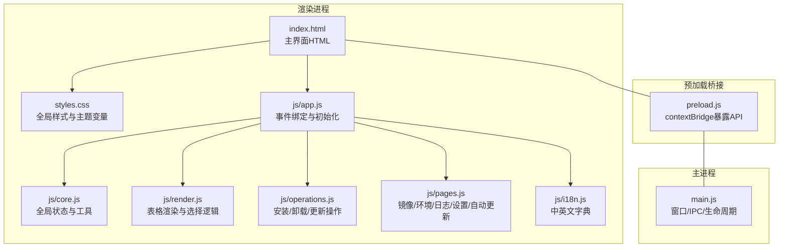

**图表来源** 
- [index.html:1-120](file://renderer/index.html#L1-L120)
- [styles.css:1-120](file://renderer/styles.css#L1-L120)
- [app.js:1-120](file://renderer/js/app.js#L1-L120)
- [core.js:1-93](file://renderer/js/core.js#L1-L93)
- [render.js:1-120](file://renderer/js/render.js#L1-L120)
- [operations.js:1-120](file://renderer/js/operations.js#L1-L120)
- [pages.js:1-120](file://renderer/js/pages.js#L1-L120)
- [i18n.js:1-120](file://renderer/js/i18n.js#L1-L120)
- [preload.js:1-120](file://preload.js#L1-L120)
- [main.js:1-120](file://main.js#L1-L120)

**章节来源**
- [index.html:1-120](file://renderer/index.html#L1-L120)
- [package.json:1-79](file://package.json#L1-L79)

## 核心组件
- 自定义标题栏：包含应用标识、刷新、撤销、最小化/最大化/关闭按钮，支持拖拽移动窗口。
- 侧边栏导航：分组展示“核心操作”“配置管理”“系统”，点击切换对应页面，底部显示当前 Python 环境信息。
- 内容区域：以 page 为单位承载各功能页，默认隐藏，激活时显示并附带入场动画。
- 底部状态栏：显示已安装数、可更新数、Python 版本与环境名称。
- 模态对话框：用于备份确认等关键操作的二次确认。
- Toast 提示：统一的消息反馈容器，支持 ok/err/info/warn 类型。

**章节来源**
- [index.html:33-127](file://renderer/index.html#L33-L127)
- [styles.css:128-166](file://renderer/styles.css#L128-L166)
- [styles.css:305-321](file://renderer/styles.css#L305-L321)
- [styles.css:313-321](file://renderer/styles.css#L313-L321)
- [styles.css:353-361](file://renderer/styles.css#L353-L361)

## 架构总览
界面遵循“标题栏 + 侧边栏 + 内容区”的三层布局，数据流通过 preload.js 暴露的 electronAPI 与 main.js 的 IPC 处理器通信，核心业务逻辑在 core/* 模块中实现，渲染层仅负责 UI 与交互。

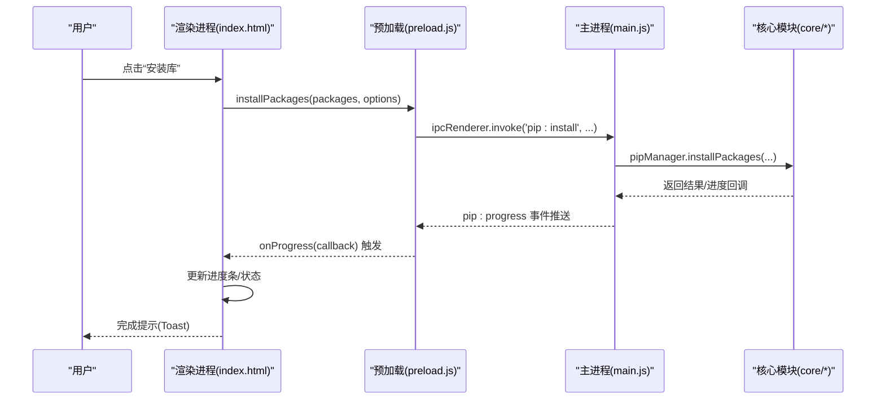

**图表来源** 
- [index.html:134-215](file://renderer/index.html#L134-L215)
- [preload.js:59-64](file://preload.js#L59-L64)
- [main.js:311-316](file://main.js#L311-L316)
- [operations.js:337-344](file://renderer/js/operations.js#L337-L344)
- [app.js:82-84](file://renderer/js/app.js#L82-L84)

**章节来源**
- [preload.js:1-120](file://preload.js#L1-L120)
- [main.js:1-120](file://main.js#L1-L120)
- [operations.js:1-120](file://renderer/js/operations.js#L1-L120)
- [app.js:1-120](file://renderer/js/app.js#L1-L120)

## 详细组件分析

### 页面组织与组件复用
- 页面清单（9 个核心页面）：安装/卸载/更新/查询/镜像/环境/日志/设置/关于。每个页面以 
 包裹，通过 app.js 监听侧边栏点击切换 active 类。
- 通用组件：
  - 搜索栏与筛选行：search-bar、filter-row 统一样式，便于跨页面复用。
  - 卡片与选项组：card、option-group、checkbox-group 组合形成一致的表单区块。
  - 表格与空状态：table-wrap、empty-state 统一列表展示与无数据提示。
  - 进度条：progress-section 用于安装/更新/回滚等操作的状态反馈。
  - 标签与状态：tag-ok/tag-update/tag-danger 表示包状态或操作结果。
  - 开关组件：toggle 用于设置项开关。
  - 镜像源列表：mirror-item 支持编辑、测速、拖拽排序。
  - 日志条目：log-entry 展示时间、动作、状态。
  - 统计卡片：stat-card 用于数据统计页概览。
  - 工具箱 Tab：tools-tabs/tool-panel 实现多面板切换。

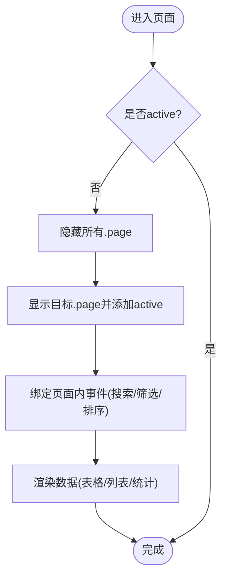

**图表来源** 
- [app.js:18-27](file://renderer/js/app.js#L18-L27)
- [index.html:134-215](file://renderer/index.html#L134-L215)
- [render.js:167-205](file://renderer/js/render.js#L167-L205)

**章节来源**
- [index.html:134-800](file://renderer/index.html#L134-L800)
- [render.js:1-120](file://renderer/js/render.js#L1-L120)
- [pages.js:1-120](file://renderer/js/pages.js#L1-L120)

### CSS 变量系统与主题切换
- 变量体系：在 :root 定义浅色主题变量，.dark 覆盖深色变量，涵盖背景、文本、边框、强调色、阴影、圆角等。
- 主题切换：通过 body 添加/移除 .dark 类实现；支持“跟随系统”模式，由主进程 nativeTheme 变化推送 theme:changed 事件，渲染进程同步切换。
- 响应式设计：使用 @media (max-width: 900px) 调整网格列数、侧边栏宽度与内容区间距，保证小屏可用性。

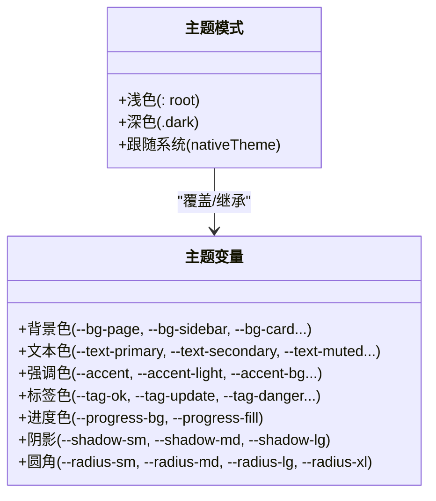

**图表来源** 
- [styles.css:29-116](file://renderer/styles.css#L29-L116)
- [app.js:37-50](file://renderer/js/app.js#L37-L50)
- [main.js:201-208](file://main.js#L201-L208)

**章节来源**
- [styles.css:29-116](file://renderer/styles.css#L29-L116)
- [styles.css:364-369](file://renderer/styles.css#L364-L369)
- [app.js:37-50](file://renderer/js/app.js#L37-L50)
- [main.js:201-208](file://main.js#L201-L208)

### 窗口控制与拖拽交互
- 窗口控制：标题栏按钮调用 window.electronAPI.windowMinimize/Maximize/Close，由 main.js 注册 IPC 处理器执行。
- 拖拽移动：标题栏整体启用 -webkit-app-region: drag，按钮区域使用 no-drag，避免冲突。
- 拖拽安装区：dropzone 支持拖放 requirements.txt/.whl 文件，点击也可选择文件，统一走 installFromSelectedFile 流程。

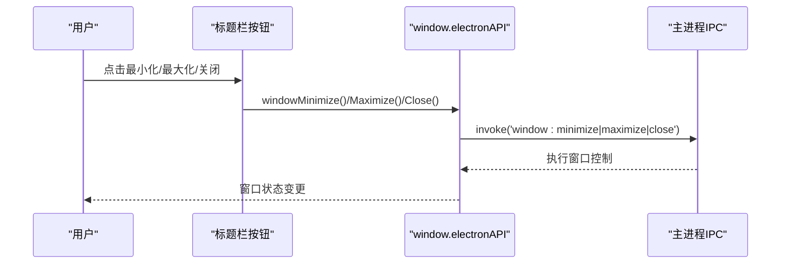

**图表来源** 
- [index.html:39-54](file://renderer/index.html#L39-L54)
- [preload.js:23-25](file://preload.js#L23-L25)
- [main.js:237-252](file://main.js#L237-L252)

**章节来源**
- [index.html:33-55](file://renderer/index.html#L33-L55)
- [preload.js:23-25](file://preload.js#L23-L25)
- [main.js:237-252](file://main.js#L237-L252)
- [operations.js:374-397](file://renderer/js/operations.js#L374-L397)

### 模态对话框与消息反馈
- 模态对话框：如备份确认弹窗，通过 modal-overlay.show 显示，支持取消/确认操作。
- Toast 提示：统一容器 toast-container，动态创建 toast 节点，支持多种类型与自动消失。

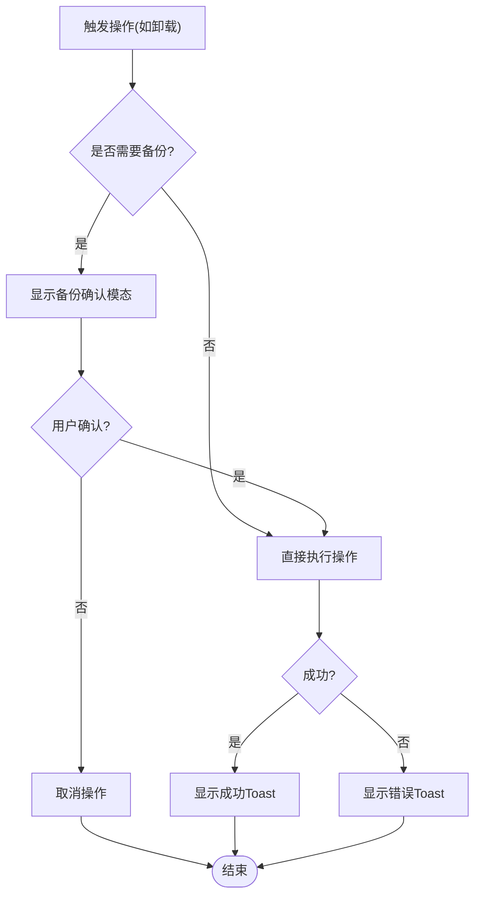

**图表来源** 
- [operations.js:39-73](file://renderer/js/operations.js#L39-L73)
- [styles.css:313-321](file://renderer/styles.css#L313-L321)
- [core.js:58-68](file://renderer/js/core.js#L58-L68)

**章节来源**
- [operations.js:39-73](file://renderer/js/operations.js#L39-L73)
- [styles.css:313-321](file://renderer/styles.css#L313-L321)
- [core.js:58-68](file://renderer/js/core.js#L58-L68)

### 国际化与多语言
- i18n 字典：i18n.js 维护 zh/en 两套文案，键名按模块.具体文案组织。
- 应用语言：通过 applyLanguage() 遍历 data-i18n 与 data-i18n-placeholder 属性替换文案，并重新渲染相关表格与状态栏。
- 快捷键：Ctrl+F 聚焦搜索框，Ctrl+1~9 切换页面，Esc 关闭弹窗。

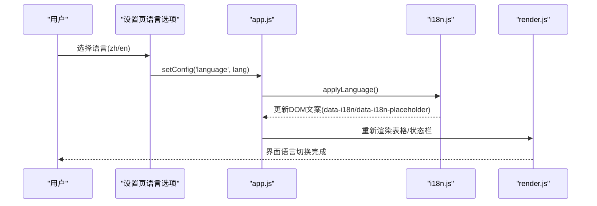

**图表来源** 
- [pages.js:358-374](file://renderer/js/pages.js#L358-L374)
- [app.js:53-62](file://renderer/js/app.js#L53-L62)
- [i18n.js:1-120](file://renderer/js/i18n.js#L1-L120)

**章节来源**
- [pages.js:358-374](file://renderer/js/pages.js#L358-L374)
- [app.js:53-62](file://renderer/js/app.js#L53-L62)
- [i18n.js:1-120](file://renderer/js/i18n.js#L1-L120)

### 表格渲染与选择逻辑
- 卸载页：支持全选/单选、选择数量统计、批量卸载。
- 更新页：支持全选/单选、搜索过滤、批量更新。
- 查询页：支持关键词搜索、状态筛选（全部/已安装/有更新）、排序（时间/名称/大小）。
- 镜像源页：支持编辑模式、测速、拖拽排序、默认标记。
- 环境页：环境列表与虚拟环境列表渲染，基础 Python 下拉选项动态填充。
- 日志页：按类型筛选与关键词搜索，导出 CSV/Markdown。

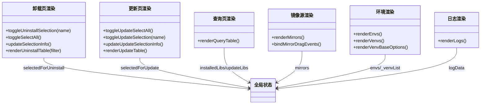

**图表来源** 
- [render.js:18-78](file://renderer/js/render.js#L18-L78)
- [render.js:82-157](file://renderer/js/render.js#L82-L157)
- [render.js:167-205](file://renderer/js/render.js#L167-L205)
- [render.js:215-258](file://renderer/js/render.js#L215-L258)
- [render.js:323-376](file://renderer/js/render.js#L323-L376)
- [render.js:384-411](file://renderer/js/render.js#L384-L411)

**章节来源**
- [render.js:1-205](file://renderer/js/render.js#L1-L205)
- [render.js:215-411](file://renderer/js/render.js#L215-L411)

### 操作执行与进度反馈
- 安装：支持从输入框、拖拽区、文件选择三种方式；支持版本控制、并行、重试、回滚；进度实时更新。
- 卸载：支持单包/批量卸载，可选备份与回滚；完成后刷新全局数据。
- 更新：支持单包/全部更新，显示对比与进度；失败计数与成功提示。
- 取消：通过 operationId 向主进程发送取消请求，终止子进程。

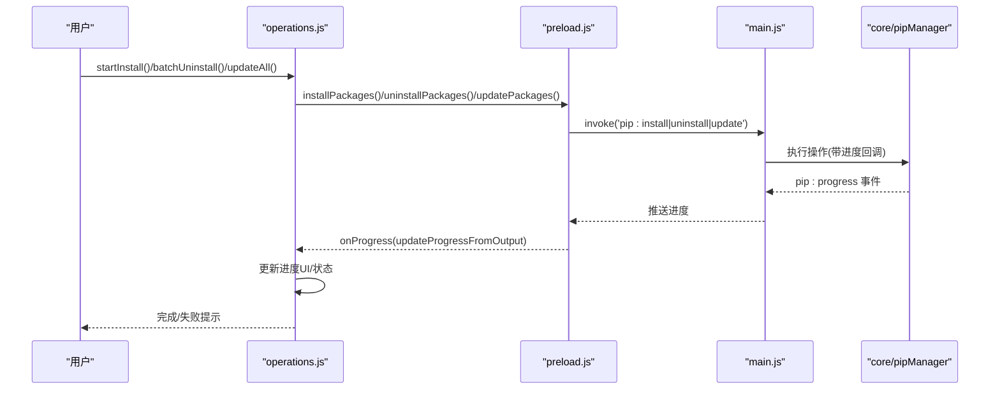

**图表来源** 
- [operations.js:301-370](file://renderer/js/operations.js#L301-L370)
- [operations.js:134-217](file://renderer/js/operations.js#L134-L217)
- [operations.js:20-31](file://renderer/js/operations.js#L20-L31)
- [preload.js:59-64](file://preload.js#L59-L64)
- [main.js:311-336](file://main.js#L311-L336)

**章节来源**
- [operations.js:1-217](file://renderer/js/operations.js#L1-L217)
- [operations.js:301-370](file://renderer/js/operations.js#L301-L370)
- [preload.js:59-64](file://preload.js#L59-L64)
- [main.js:311-336](file://main.js#L311-L336)

### 镜像源管理与智能路由
- 列表渲染：显示名称、URL、备注、测速结果、默认标记。
- 编辑模式：支持修改名称、URL、备注，保存后刷新列表。
- 测速：批量测试速度，最快者提示。
- 智能路由：开启后根据网络状况自动选择最优镜像源。
- 拖拽排序：长按拖动调整优先级，持久化顺序。

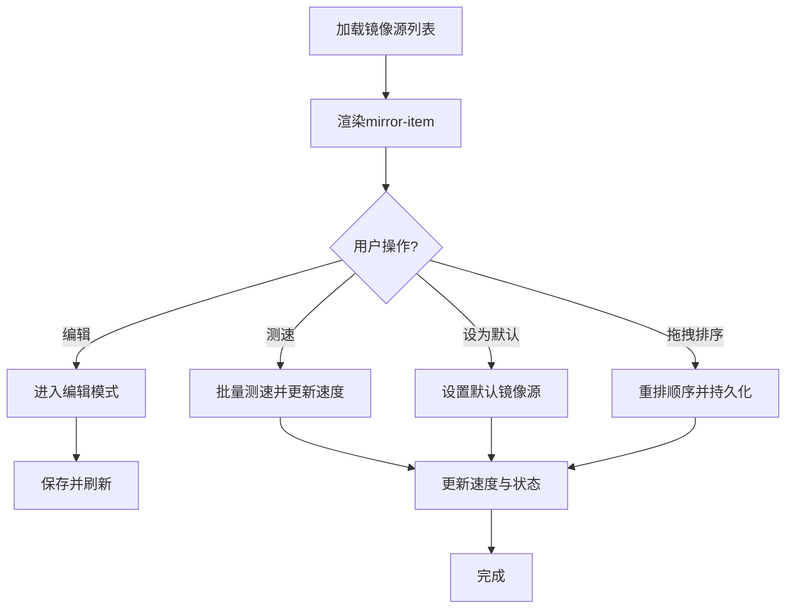

**图表来源** 
- [render.js:215-258](file://renderer/js/render.js#L215-L258)
- [render.js:264-318](file://renderer/js/render.js#L264-L318)
- [pages.js:21-161](file://renderer/js/pages.js#L21-L161)

**章节来源**
- [render.js:215-318](file://renderer/js/render.js#L215-L318)
- [pages.js:21-161](file://renderer/js/pages.js#L21-L161)

### 环境选择与虚拟环境管理
- 环境检测：列出系统 Python 环境，支持切换当前环境。
- 虚拟环境：创建 venv（含 pip、继承 site-packages），列出/使用/删除。
- 导出/导入：导出为 requirements.txt，从文件导入包。
- 环境对比：对比两个环境的包差异，展示仅 A/B 有与版本不同项。

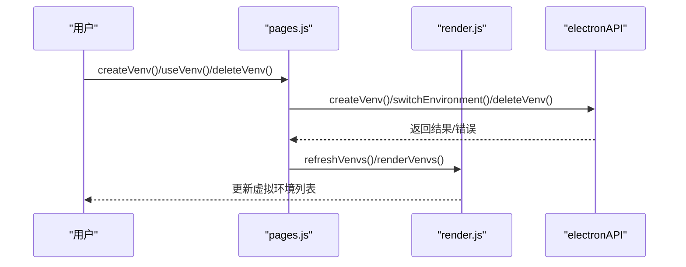

**图表来源** 
- [pages.js:227-318](file://renderer/js/pages.js#L227-L318)
- [render.js:345-376](file://renderer/js/render.js#L345-L376)
- [preload.js:35-38](file://preload.js#L35-L38)

**章节来源**
- [pages.js:227-318](file://renderer/js/pages.js#L227-L318)
- [render.js:345-376](file://renderer/js/render.js#L345-L376)
- [preload.js:35-38](file://preload.js#L35-L38)

### 日志与数据统计
- 日志：支持类型筛选与关键词搜索，导出 CSV/Markdown，清空日志。
- 统计：概览卡片（已安装/有更新/今日安装/镜像源），本周活动与最近活动，Top 包与磁盘占用 Top 10。

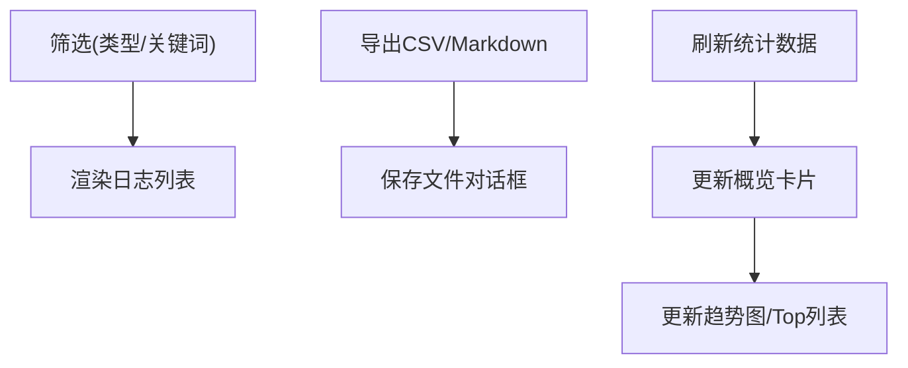

**图表来源** 
- [render.js:384-411](file://renderer/js/render.js#L384-L411)
- [main.js:485-514](file://main.js#L485-L514)
- [index.html:649-684](file://renderer/index.html#L649-L684)

**章节来源**
- [render.js:384-411](file://renderer/js/render.js#L384-L411)
- [main.js:485-514](file://main.js#L485-L514)
- [index.html:649-684](file://renderer/index.html#L649-L684)

## 依赖关系分析
渲染进程模块间依赖关系清晰：app.js 作为入口协调 core.js、render.js、operations.js、pages.js、i18n.js；preload.js 暴露 electronAPI；main.js 注册 IPC 处理器并协调核心模块。

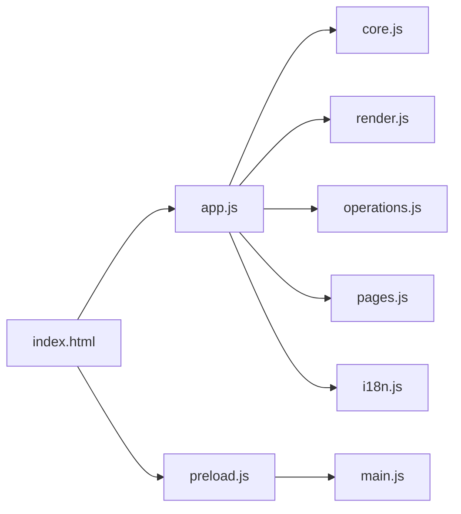

**图表来源** 
- [app.js:1-27](file://renderer/js/app.js#L1-L27)
- [core.js:1-14](file://renderer/js/core.js#L1-L14)
- [preload.js:1-20](file://preload.js#L1-L20)
- [main.js:1-31](file://main.js#L1-L31)

**章节来源**
- [app.js:1-27](file://renderer/js/app.js#L1-L27)
- [core.js:1-14](file://renderer/js/core.js#L1-L14)
- [preload.js:1-20](file://preload.js#L1-L20)
- [main.js:1-31](file://main.js#L1-L31)

## 性能考量
- 启动优化：Phase 1 并行加载配置、环境、镜像与缓存库，优先显示缓存数据；Phase 2 后台刷新完整已安装列表；Phase 3 懒加载可更新列表。
- 渲染优化：表格渲染按需过滤与排序，避免全量重绘；空状态与选择信息即时更新。
- 进度反馈：实时 pip:progress 事件驱动，减少轮询开销。
- 存储路径与托盘：支持最小化到托盘，减少频繁窗口创建销毁。

[本节为通用指导，不直接分析具体文件]

## 故障排查指南
- 主题切换无效：检查 body 是否添加/移除 .dark 类，确认主进程 theme:changed 事件是否触发。
- 进度不更新：确认 onProgress 是否正确绑定，主进程是否推送 pip:progress 事件。
- 镜像源无法设置默认：检查 URL 格式校验与 API 调用返回值。
- 日志导出失败：确认文件格式与保存路径权限。
- 虚拟环境创建失败：检查基础 Python 路径与参数合法性。

**章节来源**
- [app.js:87-89](file://renderer/js/app.js#L87-L89)
- [operations.js:20-31](file://renderer/js/operations.js#L20-L31)
- [pages.js:109-138](file://renderer/js/pages.js#L109-L138)
- [main.js:485-514](file://main.js#L485-L514)
- [pages.js:227-266](file://renderer/js/pages.js#L227-L266)

## 结论
PyLibMaster 的界面架构以清晰的三层布局与模块化 JS 组织为基础，结合 CSS 变量与响应式设计，实现了高可用、易扩展的前端体验。通过 preload.js 的安全桥接与 main.js 的 IPC 管理，渲染进程与主进程解耦良好，便于后续功能扩展与主题定制。

[本节为总结性内容，不直接分析具体文件]

## 附录：扩展与自定义样式指南
- 新增页面：
  - 在 index.html 中添加 
 结构与导航项 
。
  - 在 app.js 中确保侧边栏点击能切换 active 类。
  - 如需特定初始化逻辑，可在 app.js 的 init 流程中补充。
- 复用组件：
  - 使用 search-bar、filter-row、card、option-group、checkbox-group、table-wrap、empty-state、progress-section、tag、toggle 等通用样式类。
  - 表格渲染参考 render.js 中的函数，保持选择状态与数据一致。
- 主题扩展：
  - 在 styles.css 的 :root 或 .dark 中新增/覆盖 CSS 变量，确保明暗主题一致性。
  - 若需“跟随系统”，确保 main.js 的 theme:changed 事件正确推送。
- 交互增强：
  - 拖拽交互参考 dropzone 与 mirror-item 的实现，注意 dragover/dragleave/drop 事件处理。
  - 模态对话框使用 modal-overlay.show 控制显隐，配合 core.js 的 closeModal 方法。
- 国际化：
  - 在 i18n.js 的 zh/en 字典中新增键值，并在 HTML 中使用 data-i18n 与 data-i18n-placeholder。
  - 切换语言后调用 applyLanguage() 更新 DOM。

**章节来源**
- [index.html:134-800](file://renderer/index.html#L134-L800)
- [styles.css:168-205](file://renderer/styles.css#L168-L205)
- [styles.css:215-258](file://renderer/styles.css#L215-L258)
- [styles.css:313-321](file://renderer/styles.css#L313-L321)
- [core.js:92-93](file://renderer/js/core.js#L92-L93)
- [pages.js:358-374](file://renderer/js/pages.js#L358-L374)
- [i18n.js:1-120](file://renderer/js/i18n.js#L1-L120)