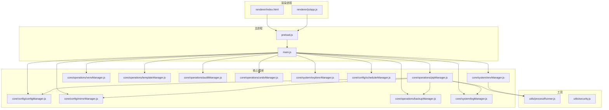
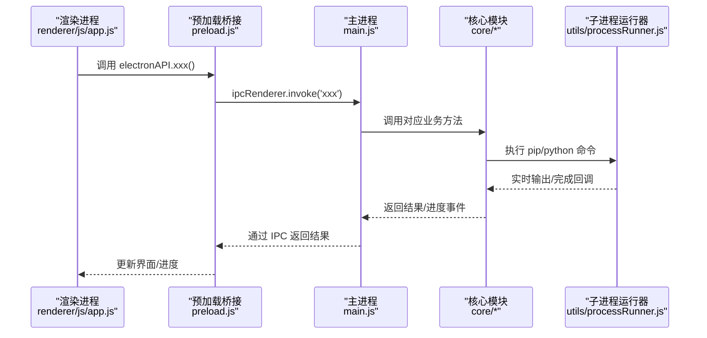
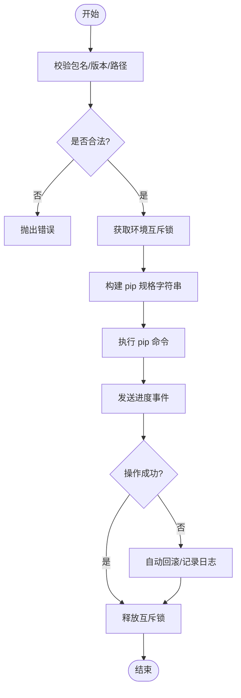
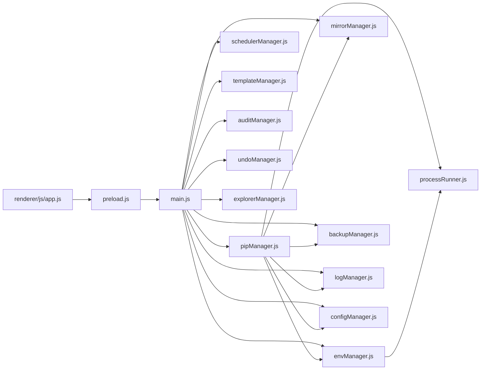

# 项目概述

<cite>
**本文引用的文件**   
- [package.json](file://package.json)
- [main.js](file://main.js)
- [preload.js](file://preload.js)
- [renderer/index.html](file://renderer/index.html)
- [core/operations/pipManager.js](file://core/operations/pipManager.js)
- [core/system/envManager.js](file://core/system/envManager.js)
- [core/config/configManager.js](file://core/config/configManager.js)
- [utils/processRunner.js](file://utils/processRunner.js)
- [renderer/js/app.js](file://renderer/js/app.js)
</cite>

## 目录
1. [简介](#简介)
2. [项目结构](#项目结构)
3. [核心组件](#核心组件)
4. [架构总览](#架构总览)
5. [详细组件分析](#详细组件分析)
6. [依赖关系分析](#依赖关系分析)
7. [性能考量](#性能考量)
8. [故障排查指南](#故障排查指南)
9. [结论](#结论)
10. [附录](#附录)

## 简介
PyLibMaster 是一款基于 Electron 框架开发的跨平台桌面应用程序，专注于 Python 包管理与环境管理。它通过图形界面简化了安装、卸载、更新、查询、镜像源配置、虚拟环境创建与切换、备份与回滚、安全漏洞扫描、依赖图谱可视化等常见任务，帮助开发者更高效地维护 Python 生态。

核心价值主张：
- 一站式 Python 包与环境管理：从发现到安装、从升级到回滚，全流程可视化管理。
- 智能网络优化：内置镜像源测速与智能路由，提升下载与安装效率。
- 安全与稳定优先：命令注入防护、路径校验、操作互斥锁、自动回滚、撤销机制。
- 可观测性与可恢复性：完整日志、健康诊断、快照与时间旅行式回滚。
- 跨平台体验：Electron + Node.js 技术栈，支持 Windows/macOS/Linux，提供托盘、通知、主题跟随系统等功能。

适用场景与目标用户：
- 个人开发者：快速搭建与切换多版本 Python 环境，批量管理依赖。
- 团队与项目：模板化环境初始化、快照与回滚、离线包分发与对比。
- 运维与质量保障：依赖冲突检测、健康检查、安全漏洞扫描、操作审计。

技术栈概览：
- 前端渲染层：HTML/CSS/JS（Electron 渲染进程）
- 主进程控制层：Electron 主进程（窗口、IPC、系统集成）
- 业务核心层：core/*（pip 管理、环境管理、镜像源、备份、调度、模板、审计、撤销等）
- 工具与基础设施：utils/*（子进程运行器、安全校验）
- 构建与打包：electron-builder，GitHub 发布与自动更新

## 项目结构
项目采用分层模块化组织，职责清晰、耦合度低：
- main.js：Electron 主进程入口，负责窗口生命周期、IPC 处理器注册、应用启动流程与各模块协调。
- preload.js：安全桥接层，通过 contextBridge 暴露受限 API 给渲染进程，隔离 Node 能力。
- renderer/*：UI 层，包含页面 HTML、样式与交互脚本（app.js 为渲染进程入口）。
- core/*：核心业务逻辑，按功能域划分为 config、operations、system 三大子目录。
- utils/*：通用工具，如 processRunner（子进程封装）、security（路径安全校验）。
- package.json：应用元数据、依赖声明、构建与发布配置。

图表来源
- [main.js:1-120](file://main.js#L1-L120)
- [preload.js:1-120](file://preload.js#L1-L120)
- [renderer/index.html:1-120](file://renderer/index.html#L1-L120)
- [core/operations/pipManager.js:1-60](file://core/operations/pipManager.js#L1-L60)
- [core/system/envManager.js:1-60](file://core/system/envManager.js#L1-L60)
- [core/config/configManager.js:1-80](file://core/config/configManager.js#L1-L80)
- [utils/processRunner.js:1-80](file://utils/processRunner.js#L1-L80)

章节来源
- [package.json:1-79](file://package.json#L1-L79)
- [main.js:1-150](file://main.js#L1-L150)
- [preload.js:1-120](file://preload.js#L1-L120)
- [renderer/index.html:1-120](file://renderer/index.html#L1-L120)

## 核心组件
- 主进程与 IPC：统一入口与事件总线，将渲染进程请求转发至核心模块，并返回结果或推送进度事件。
- 预加载桥接：最小权限暴露，避免渲染进程直接访问 Node API，确保上下文隔离与安全。
- pip 管理器：包查询、安装、卸载、更新、导出/导入、依赖树、磁盘占用、离线下载、版本历史、全局依赖图、健康检查等。
- 环境管理器：自动检测系统 Python 环境（含 Conda/Miniconda），获取版本信息，切换当前环境并持久化。
- 配置管理器：JSON 持久化、默认值合并、范围校验与原子写入，存储路径与安装目录管理。
- 子进程运行器：封装 spawn，支持超时、取消、实时输出、ANSI 清理、UTF-8 编码、活跃进程跟踪。
- UI 渲染与应用初始化：侧边栏导航、页面切换、状态栏、进度条、国际化、快捷键、主题跟随系统。

章节来源
- [main.js:120-300](file://main.js#L120-L300)
- [preload.js:120-221](file://preload.js#L120-L221)
- [core/operations/pipManager.js:1-200](file://core/operations/pipManager.js#L1-L200)
- [core/system/envManager.js:1-120](file://core/system/envManager.js#L1-L120)
- [core/config/configManager.js:1-120](file://core/config/configManager.js#L1-L120)
- [utils/processRunner.js:1-120](file://utils/processRunner.js#L1-L120)
- [renderer/js/app.js:1-120](file://renderer/js/app.js#L1-L120)

## 架构总览
PyLibMaster 采用经典的 Electron 三层架构：
- 渲染进程（浏览器环境）：负责 UI 展示与用户交互，通过 window.electronAPI 调用主进程能力。
- 预加载脚本（安全桥接）：使用 contextBridge 暴露受控 API，拦截并转发 IPC 请求。
- 主进程（Node.js）：管理窗口、系统集成、IPC 处理器、核心业务模块与外部进程。

图表来源
- [renderer/js/app.js:1-120](file://renderer/js/app.js#L1-L120)
- [preload.js:1-120](file://preload.js#L1-L120)
- [main.js:200-350](file://main.js#L200-L350)
- [utils/processRunner.js:1-120](file://utils/processRunner.js#L1-L120)

## 详细组件分析

### 主进程与 IPC 通信
- 窗口生命周期：创建 BrowserWindow、设置安全选项（contextIsolation、nodeIntegration=false）、拦截外链打开、保存窗口位置。
- 应用启动流程：创建托盘、初始化自动更新、启动环境检测、主题同步、定时调度器、静默检查更新。
- IPC 处理器：集中注册所有渲染进程请求（窗口控制、环境管理、虚拟环境、包查询/安装/卸载/更新、备份、镜像源、日志、配置、自动更新、系统功能、通知、日志导出、主题、调度器、模板与快照、审计、磁盘空间、离线下载、requirements 对比、版本历史、依赖图、撤销、资源管理器集成）。
- 事件推送：通过 webContents.send 向渲染进程推送 pip 进度、主题变化、更新可用、调度器执行结果等。

章节来源
- [main.js:1-200](file://main.js#L1-L200)
- [main.js:200-640](file://main.js#L200-L640)

### 预加载桥接层
- 安全暴露：仅暴露必要 API 到 window.electronAPI，避免渲染进程直接访问 Node 能力。
- IPC 转发：将渲染进程调用转换为 ipcRenderer.invoke，并处理事件监听（进度、主题、更新、调度器等）。
- 事件去重：在绑定新监听前移除旧监听，防止重复触发。

章节来源
- [preload.js:1-221](file://preload.js#L1-L221)

### pip 包管理器
- 包名与版本安全：正则校验包名与版本规格，wheel 路径白名单与敏感目录过滤，防止命令注入与路径遍历。
- 缓存与互斥：已安装包列表缓存（TTL 5 分钟），site-packages 路径缓存（TTL 30 秒），环境级操作互斥锁保证串行执行。
- 操作类型：安装（批量、并行、版本控制、镜像重试、自动回滚）、卸载（安全模式、自动回滚）、更新（智能重试、自动回滚）、导出/导入 requirements、依赖树、磁盘占用、离线下载、版本历史、全局依赖图、健康检查、冲突检测。
- 进度与取消：结构化进度事件，operationId 关联的批量取消。

图表来源
- [core/operations/pipManager.js:1-200](file://core/operations/pipManager.js#L1-L200)

章节来源
- [core/operations/pipManager.js:1-200](file://core/operations/pipManager.js#L1-L200)

### Python 环境管理器
- 环境检测：扫描常见路径（系统 Python、用户级安装、Windows Store、Conda/Miniconda），结合 where python 查找 PATH 中的 Python。
- 版本信息：并行获取 Python 与 pip 版本，过滤无 pip 的环境，生成友好名称。
- 当前环境：内存缓存与配置文件持久化，切换时立即保存。

章节来源
- [core/system/envManager.js:1-200](file://core/system/envManager.js#L1-L200)

### 配置管理器
- 持久化：JSON 文件存储于 Electron userData 目录，支持默认值合并与损坏重建。
- 校验与修正：数值范围限制与回退默认值，批量设置只触发一次写入。
- 存储路径：自动创建目录，返回日志与备份存储路径。

章节来源
- [core/config/configManager.js:1-194](file://core/config/configManager.js#L1-L194)

### 子进程运行器
- 进程封装：spawn 封装，支持超时（SIGTERM+SIGKILL）、实时输出、ANSI 清理、UTF-8 强制。
- 活跃进程管理：按 operationId 取消、应用退出时统一清理。
- pip 就绪缓存：避免重复检测，提升性能。

章节来源
- [utils/processRunner.js:1-200](file://utils/processRunner.js#L1-L200)

### 渲染进程与应用初始化
- 页面导航：侧边栏点击切换页面，激活对应内容区。
- 事件绑定：搜索框实时过滤、设置项变更保存、进度事件监听、主题与语言切换、快捷键系统。
- 启动流程：分阶段加载（配置、环境、镜像、缓存库），后台刷新完整列表与可更新列表，懒加载日志与版本信息。

章节来源
- [renderer/js/app.js:1-200](file://renderer/js/app.js#L1-L200)
- [renderer/index.html:1-120](file://renderer/index.html#L1-L120)

## 依赖关系分析
- 主进程依赖核心模块：pipManager、envManager、mirrorManager、backupManager、logManager、configManager、schedulerManager、templateManager、auditManager、undoManager、explorerManager。
- 核心模块依赖工具：processRunner（子进程）、configManager（配置）、logManager（日志）、envManager（环境）。
- 渲染进程依赖预加载桥接：window.electronAPI 暴露的方法映射到主进程 IPC 处理器。

图表来源
- [main.js:1-120](file://main.js#L1-L120)
- [core/operations/pipManager.js:1-60](file://core/operations/pipManager.js#L1-L60)
- [core/system/envManager.js:1-60](file://core/system/envManager.js#L1-L60)
- [core/config/configManager.js:1-60](file://core/config/configManager.js#L1-L60)
- [utils/processRunner.js:1-60](file://utils/processRunner.js#L1-L60)
- [renderer/js/app.js:1-60](file://renderer/js/app.js#L1-L60)
- [preload.js:1-60](file://preload.js#L1-L60)

章节来源
- [package.json:1-79](file://package.json#L1-L79)
- [main.js:1-120](file://main.js#L1-L120)

## 性能考量
- 缓存策略：已安装包列表缓存（5 分钟）、site-packages 路径缓存（30 秒）、pip 就绪状态缓存（5 分钟），减少重复 IO 与命令执行。
- 并发控制：并行安装线程数可配置（默认 4），环境级互斥锁避免并发冲突。
- 懒加载与分阶段初始化：启动时先显示缓存数据，后台异步刷新完整列表与可更新列表，降低首屏延迟。
- 子进程优化：超时与强制终止、ANSI 清理、UTF-8 编码、活跃进程跟踪，避免资源泄漏与卡顿。
- 镜像智能路由：根据网络状况自动选择最快镜像源，提升下载与安装速度。

[本节为通用指导，不直接分析具体文件]

## 故障排查指南
- 无法检测到 Python 环境：确认系统中存在带 pip 的 Python 安装；检查 envManager 的检测路径与 where python 命令结果。
- 安装/卸载失败：查看操作日志与 pip 输出；启用自动回滚与智能重试；检查包名与版本合法性。
- 镜像源不可用：使用镜像源测速功能；开启智能路由；添加自定义镜像源并测试响应速度。
- 进程卡住或超时：检查 processRunner 的超时设置与取消逻辑；确认操作未长时间阻塞。
- 配置异常：检查配置文件是否损坏；使用默认值重建；确认存储路径存在且可写。
- 主题与语言不生效：确认主题跟随系统与语言切换逻辑；检查渲染进程事件绑定。

章节来源
- [core/system/envManager.js:1-120](file://core/system/envManager.js#L1-L120)
- [core/operations/pipManager.js:1-200](file://core/operations/pipManager.js#L1-L200)
- [utils/processRunner.js:1-200](file://utils/processRunner.js#L1-L200)
- [core/config/configManager.js:1-120](file://core/config/configManager.js#L1-L120)
- [renderer/js/app.js:1-120](file://renderer/js/app.js#L1-L120)

## 结论
PyLibMaster 以 Electron 为核心，构建了安全、高效、可观测的 Python 包与环境管理桌面应用。通过清晰的架构分层、严格的输入校验与并发控制、完善的缓存与回滚机制，以及丰富的可视化与诊断工具，为用户提供了开箱即用的一站式解决方案。无论是个人开发还是团队协作，都能显著提升 Python 生态管理的效率与稳定性。

[本节为总结性内容，不直接分析具体文件]

## 附录
- 技术栈版本：Electron 31.7.7、Node.js（由 package.json 声明）
- 构建与发布：electron-builder，GitHub 仓库作为更新源
- 安全最佳实践：上下文隔离、禁用 Node 集成、路径白名单、命令注入防护

章节来源
- [package.json:1-79](file://package.json#L1-L79)